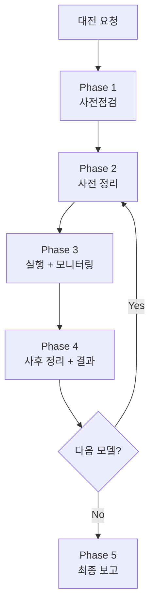

# AI 대전 배치 실행 스킬 (Batch Battle)

> 사전점검 → 정리 → 실행 → 모니터링 → 정리. 빠뜨리면 망한다.

## Purpose

AI 대전 테스트(multirun, 단일 모델 등) 배치 작업을 안전하게 실행한다.
2026-04-10 좀비 게임 사고의 교훈을 체계화한 스킬이다.

---

## 핵심 원칙

1. **E2E 테스트와 대전을 절대 병렬 실행하지 않는다** — 순차만
2. **실행 전 반드시 정리** — Redis game:* 0개 확인
3. **실행 중 반드시 모니터링** — 5분 주기, 던져놓고 방치 금지
4. **실행 후 반드시 정리** — Redis, 프로세스, 좀비 확인
5. **클라우드 API와 로컬 서비스를 혼동하지 않는다** — 성능 분석 시 구분 필수
6. **이상 수치는 "원래 그런가" 넘기지 않는다** — 반드시 원인 분석

---

## 워크플로우



---

## Phase 1: 사전점검

DevOps 에이전트 또는 직접 실행:

```bash
# 1. K8s Pod 상태
kubectl get pods -n rummikub

# 2. 서비스 헬스체크
curl -s http://localhost:30080/ready
curl -s http://localhost:30081/health

# 3. Redis/PostgreSQL
kubectl exec -n rummikub deploy/redis -- redis-cli ping
kubectl exec -n rummikub deploy/postgres -- pg_isready -U rummikub

# 4. ConfigMap 핵심값 확인
kubectl get configmap game-server-config -n rummikub -o yaml | grep -E "AI_COOLDOWN|DAILY_COST|RATE_LIMIT|AI_ADAPTER_TIMEOUT"
kubectl get configmap ai-adapter-config -n rummikub -o yaml | grep -E "DAILY_COST|MODEL|TIMEOUT|V2_PROMPT"

# 5. API 잔액 확인
curl -s https://api.deepseek.com/user/balance -H "Authorization: Bearer $DEEPSEEK_API_KEY"
# Claude/OpenAI: 콘솔에서 확인 또는 메모리 참조

# 6. 최신 코드 배포 여부
docker images | grep rummiarena
git log --oneline -3
```

**체크리스트**:
- [ ] 7/7 Pod Running
- [ ] 서비스 응답 정상
- [ ] Redis PONG, PostgreSQL accepting
- [ ] AI_COOLDOWN_SEC=0
- [ ] API 잔액 확인 → 회수 결정
- [ ] 이미지 빌드 시점 vs 최신 커밋 → 리빌드 필요 여부

---

## Phase 2: 사전 정리 (매 모델 실행 전)

**이 단계를 절대 건너뛰지 않는다.**

```bash
# 1. Redis 활성 게임 0개 확인
kubectl exec -n rummikub deploy/redis -- redis-cli keys "game:*"
# → 결과가 비어야 함. 있으면 삭제:
# kubectl exec -n rummikub deploy/redis -- redis-cli eval "local k=redis.call('keys','game:*') for i,v in ipairs(k) do redis.call('del',v) end return #k" 0

# 2. ai-adapter에 /move 요청 없음 확인
kubectl logs -n rummikub deploy/ai-adapter --tail=5 | grep "MoveController"
# → 0건이어야 함

# 3. 기존 배틀 프로세스 없음 확인
ps aux | grep "ai-battle" | grep -v grep
# → 없어야 함. 있으면 kill
```

---

## Phase 3: 실행 + 모니터링

### 실행

```bash
# 모델별 순차 실행 (절대 병렬 금지)
python3 scripts/ai-battle-multirun.py --model deepseek --runs 3 --include-historical
python3 scripts/ai-battle-multirun.py --model openai --runs 3 --include-historical
python3 scripts/ai-battle-multirun.py --model claude --runs 3 --include-historical

# 또는 단일 모델
python3 scripts/ai-battle-3model-r4.py --models deepseek
```

### 모니터링 설정 (필수)

Monitor 도구로 5분 주기 자동 감시 설정:

```bash
while true; do
  echo "===== $(date '+%H:%M:%S') 모니터링 ====="
  
  # 활성 게임 수
  GAMES=$(kubectl exec -n rummikub deploy/redis -- redis-cli keys "game:*" 2>/dev/null | grep -c "game:" || echo "0")
  echo "활성게임: ${GAMES}개"
  
  # 최근 5분 턴 레이턴시 + 토큰
  kubectl logs -n rummikub deploy/ai-adapter --since=5m 2>/dev/null | grep --line-buffered "Metrics.*MODEL_NAME" | awk '{
    match($0, /latency=([0-9]+)ms/, lat);
    match($0, /tokens=([0-9]+)\+([0-9]+)/, tok);
    n++; total += lat[1]/1000;
    printf "  턴: %3ds  out=%s\n", lat[1]/1000, tok[2]
  } END { if(n>0) printf "  최근%d턴 평균: %.0fs\n", n, total/n; else print "  (최근 5분 턴 없음)" }'
  
  # 프로세스 생존
  PROCS=$(ps aux 2>/dev/null | grep "ai-battle" | grep -v grep | wc -l)
  echo "배틀프로세스: ${PROCS}개"
  
  # 이상 감지
  if [ "$GAMES" -gt 1 ]; then echo "⚠ 경고: 활성 게임 ${GAMES}개 — 좀비 의심"; fi
  if [ "$PROCS" -eq 0 ]; then echo "⚠ 경고: 배틀 프로세스 없음 — 종료됨"; fi
  
  sleep 300
done
```

### 모니터링 중 확인 사항

| 항목 | 정상 | 이상 (즉시 중단) |
|------|------|----------------|
| 활성 게임 수 | 1개 | 2개 이상 → 좀비 |
| 배틀 프로세스 | 1개 이상 | 0개 → 종료됨 |
| 레이턴시 | 모델별 역대 범위 내 | 역대 max의 1.5배 초과 |
| fallback | 0건 | 연속 3건 이상 → timeout 부족 |

### 모니터링 이력 기록

`work_logs/ai-battle-monitoring-YYYYMMDD.md`에 턴별 데이터 기록:

| 턴 | 시각 | 레이턴시 | 입력토큰 | 출력토큰 | action |
|----|------|---------|---------|---------|--------|

구간별 통계(초반/중반/후반) 및 5분 주기 스냅샷도 기록.

---

## Phase 4: 사후 정리 (매 모델 완료 후)

```bash
# 1. Redis 게임 키 정리
kubectl exec -n rummikub deploy/redis -- redis-cli keys "game:*"
# 잔여 있으면 삭제

# 2. 결과 파일 확인
ls -la scripts/ai-battle-multirun-*.json
ls -la scripts/ai-battle-3model-r4-results*.json

# 3. 비용 확인
curl -s https://api.deepseek.com/user/balance -H "Authorization: Bearer $DEEPSEEK_API_KEY"

# 4. 프로세스 정리
ps aux | grep "ai-battle" | grep -v grep
```

---

## Phase 5: 최종 보고

모든 모델 대전 완료 후:

1. **통계 집계**: `python3 scripts/ai-battle-multirun.py --aggregate-only --include-historical`
2. **모니터링 문서 마감**: 구간별 통계, 비용 총합, 이상 이력 정리
3. **모델별 에세이 작성**: 인터넷 리서치 + 관측 데이터 결합
4. **비용 잔액 업데이트**: 메모리에 최신 잔액 반영

---

## 모델별 참고 수치 (역대 데이터 기반)

| 모델 | 평균 레이턴시 | 최대 레이턴시 | 턴당 비용 | 게임당 비용 |
|------|-------------|-------------|----------|-----------|
| DeepSeek Reasoner | 176초 (전체) | 349초 | $0.001 | ~$0.04 |
| GPT-5-mini | 60~85초 | ~175초 | $0.025 | ~$0.98 |
| Claude Sonnet 4 | 45~65초 | ~170초 | $0.074 | ~$2.22 |

**주의**: DeepSeek는 후반부에 추론 토큰이 급증(2K→15K)하며 레이턴시가 3배 이상 올라간다. 이는 정상적인 "사고 시간 자율 확장"이다.

---

## 금지 사항

1. ❌ E2E 테스트와 대전 동시 실행
2. ❌ Redis game:* 확인 없이 대전 시작
3. ❌ 모니터링 없이 배치 방치
4. ❌ 로컬 서비스(Ollama) 부하로 클라우드 API(DeepSeek) 레이턴시를 설명
5. ❌ fallback 20% 이상을 "원래 그런 것"으로 넘기기
6. ❌ API 잔액 확인 없이 회수 결정
