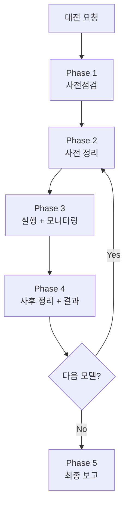

# AI 대전 배치 실행 스킬 (Batch Battle)

> 사전점검 → 정리 → 실행 → 모니터링 → 정리. 빠뜨리면 망한다.

## Purpose

AI 대전 테스트(multirun, 단일 모델 등) 배치 작업을 안전하게 실행한다.
2026-04-10 좀비 게임 사고의 교훈을 체계화한 스킬이다.

---

## 핵심 원칙

1. **E2E 테스트와 대전을 절대 병렬 실행하지 않는다** — 순차만
2. **실행 전 반드시 정리** — Redis game:* 0개 확인
3. **실행 중 반드시 모니터링** — 5분 주기, 던져놓고 방치 금지
4. **실행 후 반드시 정리** — Redis, 프로세스, 좀비 확인
5. **클라우드 API와 로컬 서비스를 혼동하지 않는다** — 성능 분석 시 구분 필수
6. **이상 수치는 "원래 그런가" 넘기지 않는다** — 반드시 원인 분석

---

## 워크플로우



---

## Phase 1: 사전점검

DevOps 에이전트 또는 직접 실행:

```bash
# 1. K8s Pod 상태
kubectl get pods -n rummikub

# 2. 서비스 헬스체크
curl -s http://localhost:30080/ready
curl -s http://localhost:30081/health

# 3. Redis/PostgreSQL
kubectl exec -n rummikub deploy/redis -- redis-cli ping
kubectl exec -n rummikub deploy/postgres -- pg_isready -U rummikub

# 4. ConfigMap 핵심값 확인
kubectl get configmap game-server-config -n rummikub -o yaml | grep -E "AI_COOLDOWN|DAILY_COST|RATE_LIMIT|AI_ADAPTER_TIMEOUT"
kubectl get configmap ai-adapter-config -n rummikub -o yaml | grep -E "DAILY_COST|MODEL|TIMEOUT|V2_PROMPT"

# 5. API 잔액 확인
curl -s https://api.deepseek.com/user/balance -H "Authorization: Bearer $DEEPSEEK_API_KEY"
# Claude/OpenAI: 콘솔에서 확인 또는 메모리 참조

# 6. 최신 코드 배포 여부
docker images | grep rummiarena
git log --oneline -3

# 7. 비용 한도 실 적용 값 확인 (가장 자주 놓치는 지점)
kubectl -n rummikub exec deploy/ai-adapter -- printenv | grep -E "DAILY_COST_LIMIT|HOURLY_USER_COST_LIMIT"
# → 평상시: DAILY_COST_LIMIT_USD=20, HOURLY_USER_COST_LIMIT_USD=5
# → 이 값이 Day 예산 + 모델별 시간당 rate 를 견딜 수 있는지 계산

# 8. 실측 스크립트 dry-run 검증 (2026-04-19 false success 사고 교훈)
python3 scripts/ai-battle-3model-r4.py --help 2>&1 | head -20
python3 scripts/ai-battle-3model-r4.py --models deepseek --max-turns 80 --dry-run 2>&1
# → argparse 에러 없이 configuration dump 출력되어야 함
# → wrapper 스크립트 (예: ai-battle-v6-smoke.sh) 가 전달하는 인자가 실제 Python 스크립트에 존재하는지 확인
# → 존재하지 않는 인자 (예: --turns 대신 --max-turns) 사용 시 argparse error 로 Run 이 0초에 종료됨
```

**체크리스트**:
- [ ] 7/7 Pod Running
- [ ] 서비스 응답 정상
- [ ] Redis PONG, PostgreSQL accepting
- [ ] AI_COOLDOWN_SEC=0
- [ ] API 잔액 확인 → 회수 결정
- [ ] 이미지 빌드 시점 vs 최신 커밋 → 리빌드 필요 여부
- [ ] **비용 한도 2건 실 적용 값 (DAILY_COST_LIMIT_USD / HOURLY_USER_COST_LIMIT_USD)**
- [ ] **예상 Day 총 지출 + 모델별 시간당 rate 계산 → 한도 상향 필요 여부 판단 (Phase 1b)**
- [ ] **실측 스크립트 `--help` + `--dry-run` 통과** (wrapper 의 인자가 실제로 존재하는지 검증 — 2026-04-19 false success 사고 재발 방지)

### Phase 1b: 비용 한도 사전 상향 (필요 시)

> **배경**: Sprint 5 3모델 대전 때 `DAILY_COST_LIMIT_USD=$20` 걸려서 **RESET 했던 선례** 있음. Day 예산이 $20 근접 또는 시간당 rate 가 $5 근접이면 **배틀 시작 전에** 한도를 임시 상향하고, 배틀 완료 후 즉시 복구한다. Redis DEL 로 사후 RESET 하는 건 배틀 중단을 초래하므로 비권장.

**현 시스템 한도 구조** (2026-04-16 확인):

| 환경변수 | 적용 범위 | Redis 키 | 평상시 | 차단 코드 |
|---------|----------|----------|--------|----------|
| `DAILY_COST_LIMIT_USD` | **전체 시스템** 일일 누적 | `quota:daily:{UTC-YYYY-MM-DD}` TTL 30일 | $20 | `DAILY_COST_LIMIT_EXCEEDED` 403 |
| `HOURLY_USER_COST_LIMIT_USD` | **gameId** 단위 시간당 | `user:{gameId}:hourly` TTL 1h | $5 | `HOURLY_COST_LIMIT_EXCEEDED` 403 |

**`DAILY_USER_COST_LIMIT_USD` 는 존재하지 않음** — 전역 daily + gameId-hourly 2개뿐. gameId 바뀌면 hourly 는 독립 리셋 (Run 1/2 간 누적 없음). 전역 daily 만 누적.

**판단 절차**:

1. **예상 최악 일일 지출** 계산 (모든 Run × 모든 모델 × v4 inflation 최악치 가정):
   - DeepSeek: $0.001~$0.004/turn × 40 turns × Run 수
   - GPT-5-mini: $0.025/turn × 40 × Run 수 (v2 안정)
   - Claude: $0.074~$0.286/turn × 40 × Run 수 (v4 inflation 1x~3.86x 범위)
   - DashScope: 미측정, stub 이면 $0
2. 합산이 **$15** 이상이면 `DAILY_COST_LIMIT_USD` 상향 필요 (2배 여유)
3. **모델별 시간당 rate** 계산:
   - per-game 비용 / per-game 소요시간 = 시간당 rate
   - Claude 가 20~30분 완주 시 $5/hr 초과 (v2 $5.92/hr, v4 최대 $17/hr)
   - 시간당 rate 가 $3/hr 이상이면 `HOURLY_USER_COST_LIMIT_USD` 상향 필요

**상향 커맨드 (필요 시)**:

```bash
# 예: Claude × 2 + DashScope × 3 + GPT × 2 대전
kubectl -n rummikub set env deploy/ai-adapter \
  DAILY_COST_LIMIT_USD=50 \
  HOURLY_USER_COST_LIMIT_USD=20

# 실측 후 검증
kubectl -n rummikub exec deploy/ai-adapter -- printenv | grep COST_LIMIT
```

**주의**: 본 단계는 Phase 4 (사후 정리) 마지막에 반드시 복구해야 함. 복구 안 하면 평상시에 느슨한 한도로 폭주 리스크.

---

## Phase 2: 사전 정리 (매 모델 실행 전)

**이 단계를 절대 건너뛰지 않는다.**

```bash
# 1. Redis 활성 게임 0개 확인
kubectl exec -n rummikub deploy/redis -- redis-cli keys "game:*"
# → 결과가 비어야 함. 있으면 삭제:
# kubectl exec -n rummikub deploy/redis -- redis-cli eval "local k=redis.call('keys','game:*') for i,v in ipairs(k) do redis.call('del',v) end return #k" 0

# 2. ai-adapter에 /move 요청 없음 확인
kubectl logs -n rummikub deploy/ai-adapter --tail=5 | grep "MoveController"
# → 0건이어야 함

# 3. 기존 배틀 프로세스 없음 확인
ps aux | grep "ai-battle" | grep -v grep
# → 없어야 함. 있으면 kill
```

---

## Phase 3: 실행 + 모니터링

### 실행

```bash
# 모델별 순차 실행 (절대 병렬 금지)
python3 scripts/ai-battle-multirun.py --model deepseek --runs 3 --include-historical
python3 scripts/ai-battle-multirun.py --model openai --runs 3 --include-historical
python3 scripts/ai-battle-multirun.py --model claude --runs 3 --include-historical

# 또는 단일 모델
python3 scripts/ai-battle-3model-r4.py --models deepseek
```

### Wrapper/Orchestrator 스크립트 실패 감지 (2026-04-19 false success 사고 반영)

배치 orchestrator 가 내부에서 `bash wrapper.sh | tee $LOG` 패턴을 쓸 때 **tee 의 exit code 0 이 Python 실패를 마스킹**해서 "Pass 10/10" 같은 가짜 성공을 초래할 수 있다. 실측 wrapper/orchestrator 작성 시 다음 3중 체크 필수:

```bash
# (A) PIPESTATUS 로 tee 마스킹 제거 — wrapper 내부
python3 scripts/ai-battle-3model-r4.py --models deepseek --max-turns "$TURNS" 2>&1 | tee "$LOG_FILE"
RC=${PIPESTATUS[0]}
if [ "$RC" -ne 0 ]; then
  echo "[ERROR] Python 실패 (exit=$RC)"
  exit "$RC"
fi

# (B) argparse/Traceback grep 으로 조용한 실패 감지 — orchestrator 내부
if grep -qE "unrecognized arguments|ArgumentError|Traceback|error:" "$RUN_LOG"; then
  RC=2
  echo "[ERROR] Python argparse/runtime 오류 감지"
fi

# (C) 비정상 조기 종료 감지 — orchestrator 내부 (80턴 실측은 최소 10~60분 소요)
START_EPOCH=$(date +%s)
bash "$WRAPPER" ...
RUN_ELAPSED=$(( $(date +%s) - START_EPOCH ))
if [ "$RUN_ELAPSED" -lt 600 ]; then
  RC=3
  echo "[ERROR] 비정상 조기 종료 (elapsed=${RUN_ELAPSED}s < 600s)"
fi

# (D) 연속 2 Run 실패 시 fail-fast (무한 실패 방지)
if [ "$RC" -ne 0 ]; then
  FAIL_COUNT=$((FAIL_COUNT+1))
  if [ "$FAIL_COUNT" -ge 2 ]; then
    echo "[FATAL] 연속 2 Run 실패 — 배치 중단"
    break
  fi
else
  FAIL_COUNT=0
fi
```

**실측 후 즉시 검증 (kickoff 5분 후)**:
- `tail master.log | head -20` 로 Run 1 이 argparse error 없이 실측 단계 (예: `T02 AI(seat 1): thinking...`) 진입했는지 확인
- 5분 만에 Run 2/N 으로 넘어가 있다면 80턴 실측이 아닌 false success → **즉시 중단 + 스크립트 debug**

### 모니터링 설정 (필수)

Monitor 도구로 5분 주기 자동 감시 설정:

```bash
while true; do
  echo "===== $(date '+%H:%M:%S') 모니터링 ====="
  
  # 활성 게임 수
  GAMES=$(kubectl exec -n rummikub deploy/redis -- redis-cli keys "game:*" 2>/dev/null | grep -c "game:" || echo "0")
  echo "활성게임: ${GAMES}개"
  
  # 최근 5분 턴 레이턴시 + 토큰
  kubectl logs -n rummikub deploy/ai-adapter --since=5m 2>/dev/null | grep --line-buffered "Metrics.*MODEL_NAME" | awk '{
    match($0, /latency=([0-9]+)ms/, lat);
    match($0, /tokens=([0-9]+)\+([0-9]+)/, tok);
    n++; total += lat[1]/1000;
    printf "  턴: %3ds  out=%s\n", lat[1]/1000, tok[2]
  } END { if(n>0) printf "  최근%d턴 평균: %.0fs\n", n, total/n; else print "  (최근 5분 턴 없음)" }'
  
  # 프로세스 생존
  PROCS=$(ps aux 2>/dev/null | grep "ai-battle" | grep -v grep | wc -l)
  echo "배틀프로세스: ${PROCS}개"
  
  # 이상 감지
  if [ "$GAMES" -gt 1 ]; then echo "⚠ 경고: 활성 게임 ${GAMES}개 — 좀비 의심"; fi
  if [ "$PROCS" -eq 0 ]; then echo "⚠ 경고: 배틀 프로세스 없음 — 종료됨"; fi
  
  sleep 300
done
```

### 모니터링 중 확인 사항

| 항목 | 정상 | 이상 (즉시 중단) |
|------|------|----------------|
| 활성 게임 수 | 1개 | 2개 이상 → 좀비 |
| 배틀 프로세스 | 1개 이상 | 0개 → 종료됨 |
| 레이턴시 | 모델별 역대 범위 내 | 역대 max의 1.5배 초과 |
| fallback | 0건 | 연속 3건 이상 → timeout 부족 |

### 모니터링 이력 기록

`work_logs/ai-battle-monitoring-YYYYMMDD.md`에 턴별 데이터 기록:

| 턴 | 시각 | 레이턴시 | 입력토큰 | 출력토큰 | action |
|----|------|---------|---------|---------|--------|

구간별 통계(초반/중반/후반) 및 5분 주기 스냅샷도 기록.

---

## Phase 3b: 메인 Claude 비동기 모니터링 (ScheduleWakeup 패턴)

**상황**: 대전이 3~6시간에 걸쳐 야간에 돌거나, 애벌레가 수면 중일 때, 메인 Claude 세션이 15~30분 주기로 "깨어나 확인 후 다시 잠드는" 패턴으로 모니터링한다. Phase 3 의 in-session bash while-loop 와 **상호 배타** — 이 패턴은 bash loop 가 없을 때 또는 bash loop 를 신뢰할 수 없을 때 (주로 긴 야간 대전) 사용한다.

### 전제 조건

1. 대전은 백그라운드 bash 프로세스로 실행되어 로그 파일에 append 됨
2. 로그 파일 경로가 고정되어 있어 Read 도구로 접근 가능
3. 애벌레가 "15분(또는 N분)마다 로그 직접 읽어 확인해달라" 고 명시 요청한 상태

### 로그 파일 네이밍 규칙

```
work_logs/battles/<round-tag>/
  phase2-master.log              # 오케스트레이션 요약 (Run 시작/종료 + place/fallback/turns)
  phase2-<model>-run1.log        # Run 1 전체 턴 로그
  phase2-<model>-run2.log        # Run 2 (Run 1 완료 후 생성)
  phase2-<model>-run3.log        # Run 3 (Run 2 완료 후 생성)
```

예: `work_logs/battles/r6-fix/phase2-master.log`, `phase2-deepseek-run1.log`

오케스트레이션 스크립트는 반드시 각 Run 완료 시 phase2-master.log 에 한 줄 요약 append:
```
=== Run $i 종료 YYYY-MM-DD HH:MM:SS ===
  Place rate=<X>% | Fallback=<Y> | Turns=<N> | Time=<S>s
```

### 모니터링 절차 (매 wake-up 마다)

1. **파일 목록 + 크기 스냅샷**
   ```bash
   ls -la work_logs/battles/<round-tag>/
   ```
   - 로그 파일 개수로 현재 Run 진행도 추정 (run3.log 생성 = Run 3 시작)
   - 크기 변화로 append 중 여부 판단

2. **master.log 전체 Read** (Read 도구, tail 파이프 금지)
   - 어느 Run 이 진행 중/완료인지 판정
   - 완료된 Run 의 요약(Place rate / Fallback) 즉시 수집

3. **현재 진행 중 Run 로그 전체 Read**
   - 직전 wake-up 이후 append 된 턴들 파악
   - AI 턴별: place/draw/fallback, 응답 시간
   - 주의: `cat | tail` 금지 (feedback_no_tail_pipe 규칙). 파일 크기가 크면 Read tool 의 `offset` + `limit` 사용

4. **프로세스 생존 확인**
   ```bash
   ps -ef | grep -E "python3 scripts/ai-battle" | grep -v grep
   ```
   - 생존 = 정상, 부재 + run.log 에 마지막 Run 완료 요약 있음 = 정상 종료
   - 부재 + run.log 에 요약 없음 = 비정상 크래시 → 즉시 `kubectl logs deploy/game-server --tail=100` 원인 파악

5. **비용 실시간 추적** (선택, 매 1~2시간마다)
   ```bash
   kubectl -n rummikub exec deploy/redis -- redis-cli HGETALL "quota:daily:$(date +%Y-%m-%d)"
   ```
   - total_cost_usd 를 1e6 으로 나눠 실제 $ 단위 환산
   - DeepSeek 기준 per-turn ~$0.001, per-game ~$0.04. 예상 대비 +/- 30% 이내면 정상

### 판정 규칙

| 관측 | 판정 | 조치 |
|------|------|------|
| 프로세스 생존 + fallback 0 + Run 진행 중 | 정상 | 다음 wake-up 예약 |
| 프로세스 생존 + fallback 1~2 (연속 아님) | 주의 | ai-adapter 로그 스냅샷, 다음 wake-up 에서 재확인 |
| 프로세스 생존 + fallback 연속 3건 | 경고 | 즉시 kubectl logs 분석 → drift 재발 vs 일시적 LLM API 에러 구분. drift 면 대전 중단 + 긴급 수정 |
| 프로세스 부재 + 마지막 run.log 에 요약 있음 | Run 완료 | master.log 에 다음 Run 자동 시작 여부 확인 (sleep 30s 후 run${N+1}.log 생성) |
| 프로세스 부재 + 요약 없음 | **비정상 크래시** | kubectl logs 분석 + 애벌레 긴급 알림 검토 (수면 중이면 원인 복구 가능성 우선 시도) |
| 3 Run 전부 완료 | 총평 작성 | 애벌레 아침 리뷰용 요약 생성, git commit 은 보류 |

### 보고 형식 (매 wake-up, terse ≤ 10줄)

```
Run N/3 · 경과 XXm · 현재 Turn YY/80
AI 턴 집계: place=A(+T tiles) / draw=B / fallback=C
응답시간: avg=XXXs / max=YYYs
프로세스: 생존 (PID NNNNN) / 오늘 비용: $X.XX/$20
특이사항: (없으면 "정상")
다음 wake-up: HH:MM
```

### 다음 wake-up 예약

```python
ScheduleWakeup(
  delaySeconds=900,  # 15분 (애벌레 요청 주기)
  prompt="<본 Phase 3b 절차를 그대로 재수행하도록 명시>",
  reason="Run N/3 진행 중, 마지막 확인 시 T<turn>/80"
)
```

**delaySeconds 선택 가이드**:
- 15분 (900s): 애벌레 명시 요청 시 사용. Prompt cache 만료되지만 사용자 요청이 우선
- 20~30분 (1200~1800s): 애벌레 부재 자율 모니터링. 캐시 미스 비용 절감
- 5분 (300s) 금지: 캐시 미스 비용만 발생, 실익 없음 (DeepSeek 턴이 평균 150~200s 이므로 5분엔 1~2턴만 진행)

### 금지 사항 (Phase 3b 특화)

1. ❌ **sleep 루프로 자체 대기** — 반드시 ScheduleWakeup 로 명시적 예약
2. ❌ **`cat <file> | tail`** — Read 도구로 전체 읽거나 offset 지정 (feedback_no_tail_pipe)
3. ❌ **결과 해석 생략** — 파일만 읽고 "로그 파일 1574 bytes" 같은 단순 보고 금지. 반드시 턴별 집계 + 판정
4. ❌ **잘못된 경보** — 단일 fallback 1건으로 수면 중인 애벌레 즉시 깨우기 금지. 연속 3건 또는 크래시만 긴급
5. ❌ **변경 작업 수행** — 이 단계는 관찰 전용. 코드/설정 수정은 오직 "긴급 drift 재발" 판단 후에만 architect 위임 경로로

### 예시 — 2026-04-15 Phase 2 재실행 모니터링 (실제 사례)

- Run 1 시작 01:01:25
- 첫 체크 01:14 (13분 경과) — T02 PLACE 6 tiles, T04/T06/T08 DRAW, T10 thinking, fallback 0
- ScheduleWakeup 900s → 01:30 재체크 예약
- 15분 주기로 반복, 각 체크마다 master.log + runN.log 전체 Read
- 3 Run 예상 총 소요: ~3~4시간 (AI 턴 40개 × 평균 173s + Run 간 sleep 30s × 2)
- 완료 시 master.log 에 모든 Run 요약이 연속으로 찍혀 있고 python3 프로세스는 종료됨

### 사고 사례 — 2026-04-19 Smoke 10회 false success (재발 방지 기록)

- 킥오프 14:03:41 → 14:09:58 에 "Pass 10/10" 종료 (6분 만에 10 Run 전부 완료 보고)
- **실제**: 매 Run 이 argparse error 로 0초에 종료. DeepSeek API 호출 0회, 비용 $0
- **원인**: `ai-battle-v6-smoke.sh` 가 `--turns 80 --timeout 700` 전달했으나 `ai-battle-3model-r4.py` 는 `--max-turns` 만 지원. `--turns`, `--timeout` 은 존재하지 않는 인자
- **마스킹 메커니즘**: `python ... | tee $LOG` 에서 Python exit 2 가 tee exit 0 으로 덮임 → orchestrator 가 exit=0 을 성공으로 집계
- **교훈 반영**:
  - Phase 1 체크리스트 8 추가 (dry-run 검증)
  - Phase 3 에 PIPESTATUS + grep argparse error + 10분 미만 조기 종료 감지 + 연속 2 Run fail-fast 4중 방어 추가
  - 금지 사항 10~12 추가 (dry-run 생략, PIPESTATUS 미체크, 5분 검증 생략)
- 같은 날 15:32:17 재킥오프 성공 (BatchTag r11-smoke-20260419-153217, 정상 T02 thinking 확인)

---

## Phase 4: 사후 정리 (매 모델 완료 후)

```bash
# 1. Redis 게임 키 정리
kubectl exec -n rummikub deploy/redis -- redis-cli keys "game:*"
# 잔여 있으면 삭제

# 2. 결과 파일 확인
ls -la scripts/ai-battle-multirun-*.json
ls -la scripts/ai-battle-3model-r4-results*.json

# 3. 비용 확인
curl -s https://api.deepseek.com/user/balance -H "Authorization: Bearer $DEEPSEEK_API_KEY"

# 4. 프로세스 정리
ps aux | grep "ai-battle" | grep -v grep

# 5. 비용 한도 복구 (Phase 1b 에서 상향했을 경우 반드시)
kubectl -n rummikub exec deploy/ai-adapter -- printenv | grep COST_LIMIT
# 평상시 값이 아니면:
kubectl -n rummikub set env deploy/ai-adapter \
  DAILY_COST_LIMIT_USD=20 \
  HOURLY_USER_COST_LIMIT_USD=5
# 복구 후 재확인 필수
kubectl -n rummikub exec deploy/ai-adapter -- printenv | grep COST_LIMIT
```

---

## Phase 5: 최종 보고

모든 모델 대전 완료 후:

1. **통계 집계**: `python3 scripts/ai-battle-multirun.py --aggregate-only --include-historical`
2. **모니터링 문서 마감**: 구간별 통계, 비용 총합, 이상 이력 정리
3. **모델별 에세이 작성**: 인터넷 리서치 + 관측 데이터 결합
4. **비용 잔액 업데이트**: 메모리에 최신 잔액 반영

---

## 모델별 참고 수치 (역대 데이터 기반)

| 모델 | 평균 레이턴시 | 최대 레이턴시 | 턴당 비용 | 게임당 비용 |
|------|-------------|-------------|----------|-----------|
| DeepSeek Reasoner | 176초 (전체) | 349초 | $0.001 | ~$0.04 |
| GPT-5-mini | 60~85초 | ~175초 | $0.025 | ~$0.98 |
| Claude Sonnet 4 | 45~65초 | ~170초 | $0.074 | ~$2.22 |

**주의**: DeepSeek는 후반부에 추론 토큰이 급증(2K→15K)하며 레이턴시가 3배 이상 올라간다. 이는 정상적인 "사고 시간 자율 확장"이다.

---

## 금지 사항

1. ❌ E2E 테스트와 대전 동시 실행
2. ❌ Redis game:* 확인 없이 대전 시작
3. ❌ 모니터링 없이 배치 방치
4. ❌ 로컬 서비스(Ollama) 부하로 클라우드 API(DeepSeek) 레이턴시를 설명
5. ❌ fallback 20% 이상을 "원래 그런 것"으로 넘기기
6. ❌ API 잔액 확인 없이 회수 결정
7. ❌ **비용 한도 (`DAILY_COST_LIMIT_USD` / `HOURLY_USER_COST_LIMIT_USD`) 예상 지출 대비 미점검 배틀 시작** (Sprint 5 3모델 대전 RESET 사고 재발 방지)
8. ❌ **배틀 도중 한도 걸려서 Redis `DEL quota:daily:*` 로 사후 RESET** (배틀 중단 + 통계 누락 초래, Phase 1b 사전 상향이 정답)
9. ❌ **배틀 완료 후 Phase 1b 에서 상향한 한도 복구 누락** (평상시에 느슨한 한도 잔존 → 다음 대전/버그 폭주 리스크)
10. ❌ **Python 실측 스크립트 인자 검증 (`--help` + `--dry-run`) 없이 wrapper/orchestrator kickoff** (2026-04-19 Smoke 10회 false success 사고 재발 방지 — argparse error 가 tee pipe 에 의해 마스킹되면 Pass 10/10 로 보고됨)
11. ❌ **`tee` 로 pipe 한 실행에서 PIPESTATUS 체크 없이 `$?` 만 사용** — tee 성공이 Python 실패를 숨김. `${PIPESTATUS[0]}` 로 실행 명령 자체의 exit code 확인 필수
12. ❌ **80턴 실측 kickoff 후 5분 검증 생략** — 정상은 Run 1 이 T02~T04 단계에 있어야 함. Run 2+ 로 넘어갔으면 false success 징후
