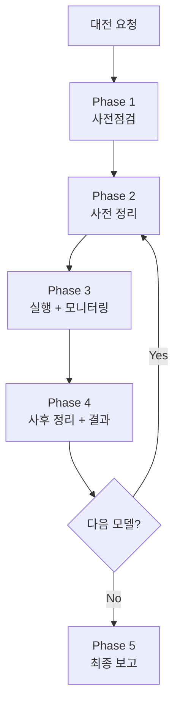

# AI 대전 배치 실행 스킬 (Batch Battle)

> 사전점검 → 정리 → 실행 → 모니터링 → 정리. 빠뜨리면 망한다.

## Purpose

AI 대전 테스트(multirun, 단일 모델 등) 배치 작업을 안전하게 실행한다.
2026-04-10 좀비 게임 사고의 교훈을 체계화한 스킬이다.

---

## 핵심 원칙

1. **E2E 테스트와 대전을 절대 병렬 실행하지 않는다** — 순차만
2. **실행 전 반드시 정리** — Redis game:* 0개 확인
3. **실행 중 반드시 모니터링** — 5분 주기, 던져놓고 방치 금지
4. **실행 후 반드시 정리** — Redis, 프로세스, 좀비 확인
5. **클라우드 API와 로컬 서비스를 혼동하지 않는다** — 성능 분석 시 구분 필수
6. **이상 수치는 "원래 그런가" 넘기지 않는다** — 반드시 원인 분석

---

## 워크플로우



---

## Phase 1: 사전점검

DevOps 에이전트 또는 직접 실행:

```bash
# 1. K8s Pod 상태
kubectl get pods -n rummikub

# 2. 서비스 헬스체크
curl -s http://localhost:30080/ready
curl -s http://localhost:30081/health

# 3. Redis/PostgreSQL
kubectl exec -n rummikub deploy/redis -- redis-cli ping
kubectl exec -n rummikub deploy/postgres -- pg_isready -U rummikub

# 4. ConfigMap 핵심값 확인
kubectl get configmap game-server-config -n rummikub -o yaml | grep -E "AI_COOLDOWN|DAILY_COST|RATE_LIMIT|AI_ADAPTER_TIMEOUT"
kubectl get configmap ai-adapter-config -n rummikub -o yaml | grep -E "DAILY_COST|MODEL|TIMEOUT|V2_PROMPT"

# 5. API 잔액 확인
curl -s https://api.deepseek.com/user/balance -H "Authorization: Bearer $DEEPSEEK_API_KEY"
# Claude/OpenAI: 콘솔에서 확인 또는 메모리 참조

# 6. 최신 코드 배포 여부
docker images | grep rummiarena
git log --oneline -3

# 7. 비용 한도 실 적용 값 확인 (가장 자주 놓치는 지점)
kubectl -n rummikub exec deploy/ai-adapter -- printenv | grep -E "DAILY_COST_LIMIT|HOURLY_USER_COST_LIMIT"
# → 평상시: DAILY_COST_LIMIT_USD=20, HOURLY_USER_COST_LIMIT_USD=5
# → 이 값이 Day 예산 + 모델별 시간당 rate 를 견딜 수 있는지 계산

# 8. 실측 스크립트 dry-run 검증 (2026-04-19 false success 사고 교훈)
python3 scripts/ai-battle-3model-r4.py --help 2>&1 | head -20
python3 scripts/ai-battle-3model-r4.py --models deepseek --max-turns 80 --dry-run 2>&1
# → argparse 에러 없이 configuration dump 출력되어야 함
# → wrapper 스크립트 (예: ai-battle-v6-smoke.sh) 가 전달하는 인자가 실제 Python 스크립트에 존재하는지 확인
# → 존재하지 않는 인자 (예: --turns 대신 --max-turns) 사용 시 argparse error 로 Run 이 0초에 종료됨
```

**체크리스트**:
- [ ] 7/7 Pod Running
- [ ] 서비스 응답 정상
- [ ] Redis PONG, PostgreSQL accepting
- [ ] AI_COOLDOWN_SEC=0
- [ ] API 잔액 확인 → 회수 결정
- [ ] 이미지 빌드 시점 vs 최신 커밋 → 리빌드 필요 여부
- [ ] **비용 한도 2건 실 적용 값 (DAILY_COST_LIMIT_USD / HOURLY_USER_COST_LIMIT_USD)**
- [ ] **예상 Day 총 지출 + 모델별 시간당 rate 계산 → 한도 상향 필요 여부 판단 (Phase 1b)**
- [ ] **실측 스크립트 `--help` + `--dry-run` 통과** (wrapper 의 인자가 실제로 존재하는지 검증 — 2026-04-19 false success 사고 재발 방지)
- [ ] **DNS 검증 통과** (Phase 1c — 2026-04-20 DNS 장애 3건 재발 방지)

### Phase 1c: DNS/네트워크 사전 검증 (2026-04-20 반성 4 반영)

> **배경**: 2026-04-20 네트워크 변경 후 WSL2 `/etc/resolv.conf` 동기화 지연으로 Run 7/9/10 DNS 장애 발생 (총 30턴 오염). 배치 시작 전 DNS 해상도를 명시적으로 점검하면 오염 Run 을 사전 차단할 수 있다.

**실행 위치**: 배치 스크립트 Phase 1 마지막, Round 1 호출 직전.

```bash
# DNS 사전 검증 — LLM 엔드포인트 3개 동시 점검
echo "[DNS] === LLM 엔드포인트 DNS 해상도 검증 ==="

DNS_FAIL=0

for HOST in api.deepseek.com api.openai.com api.anthropic.com; do
  RESULT=$(getent hosts "$HOST" 2>&1)
  RC=$?
  if [ $RC -eq 0 ]; then
    IP=$(echo "$RESULT" | awk '{print $1}')
    echo "[DNS] OK    $HOST → $IP"
  else
    echo "[DNS] FAIL  $HOST → getaddrinfo 실패 (RC=$RC)"
    DNS_FAIL=$((DNS_FAIL + 1))
  fi
done

# K8s 내부 DNS 점검 (ai-adapter Pod 에서 외부 도달 가능성 확인)
K8S_DNS=$(kubectl exec -n rummikub deploy/ai-adapter -- getent hosts api.deepseek.com 2>&1 || echo "FAIL")
if echo "$K8S_DNS" | grep -qE "^[0-9]"; then
  echo "[DNS] OK    K8s ai-adapter → api.deepseek.com 도달 가능"
else
  echo "[DNS] FAIL  K8s ai-adapter → api.deepseek.com 도달 불가: $K8S_DNS"
  DNS_FAIL=$((DNS_FAIL + 1))
fi

# HTTP 수준 도달 가능성 (401/403/200 이면 DNS+라우팅 정상)
DS_HTTP=$(curl -sS -m 10 https://api.deepseek.com/ -o /dev/null -w "%{http_code}" 2>/dev/null || echo "000")
if [[ "$DS_HTTP" =~ ^[234] ]]; then
  echo "[DNS] OK    https://api.deepseek.com/ HTTP=$DS_HTTP (DNS+TLS 정상)"
else
  echo "[DNS] WARN  https://api.deepseek.com/ HTTP=$DS_HTTP (라우팅 확인 필요)"
  # HTTP 레벨 실패는 WARN — DNS 는 됐을 수도 있으므로 즉시 중단하지 않음
fi

echo "[DNS] === 검증 완료: FAIL=$DNS_FAIL ==="

if [ "$DNS_FAIL" -gt 0 ]; then
  echo "[ERROR] DNS 검증 실패 ($DNS_FAIL 건). 배치 중단."
  echo "  조치:"
  echo "    1. 네트워크 변경 직후라면 10분 대기 후 재시도 (WSL2 resolv.conf 동기화)"
  echo "    2. sudo systemctl restart systemd-resolved  (호스트 DNS 재시작)"
  echo "    3. kubectl rollout restart deploy/ai-adapter -n rummikub  (K8s DNS 재시작)"
  echo "    4. 재검증 후 배치 재개"
  exit 1
fi
```

**중요 운영 규칙**:
- 네트워크 변경(공유기 전환, 테더링, VPN 등) 후에는 **최소 10분 유예** 후 배치 시작
- DNS 검증 실패 시 배치 중단 + 위 조치 후 재검증 → 통과 시 재개
- 사용자가 네트워크 변경을 요청할 때: "~하지 마세요" 단정 금지, 아래 형식으로 답변:
  ```
  현재 실험 상태: [Run N/M, Kill/Pivot/GO 판정 근거 이미 확보 여부]
  변경 시 영향: [최악 시나리오, 예: Run N 오염 가능성]
  선택지: ① 지금 바꾸고 10분 대기 후 재개 / ② 현 Run 완료 후 변경 / ③ 변경 안 함
  권고: [실험적 권고 vs 생활 제약 명시 분리]
  → 최종 판단은 사용자에게 위임
  ```

### Phase 1b: 비용 한도 사전 상향 (필요 시)

> **배경**: Sprint 5 3모델 대전 때 `DAILY_COST_LIMIT_USD=$20` 걸려서 **RESET 했던 선례** 있음. Day 예산이 $20 근접 또는 시간당 rate 가 $5 근접이면 **배틀 시작 전에** 한도를 임시 상향하고, 배틀 완료 후 즉시 복구한다. Redis DEL 로 사후 RESET 하는 건 배틀 중단을 초래하므로 비권장.

**현 시스템 한도 구조** (2026-04-16 확인):

| 환경변수 | 적용 범위 | Redis 키 | 평상시 | 차단 코드 |
|---------|----------|----------|--------|----------|
| `DAILY_COST_LIMIT_USD` | **전체 시스템** 일일 누적 | `quota:daily:{UTC-YYYY-MM-DD}` TTL 30일 | $20 | `DAILY_COST_LIMIT_EXCEEDED` 403 |
| `HOURLY_USER_COST_LIMIT_USD` | **gameId** 단위 시간당 | `user:{gameId}:hourly` TTL 1h | $5 | `HOURLY_COST_LIMIT_EXCEEDED` 403 |

**`DAILY_USER_COST_LIMIT_USD` 는 존재하지 않음** — 전역 daily + gameId-hourly 2개뿐. gameId 바뀌면 hourly 는 독립 리셋 (Run 1/2 간 누적 없음). 전역 daily 만 누적.

**판단 절차**:

1. **예상 최악 일일 지출** 계산 (모든 Run × 모든 모델 × v4 inflation 최악치 가정):
   - DeepSeek: $0.001~$0.004/turn × 40 turns × Run 수
   - GPT-5-mini: $0.025/turn × 40 × Run 수 (v2 안정)
   - Claude: $0.074~$0.286/turn × 40 × Run 수 (v4 inflation 1x~3.86x 범위)
   - DashScope: 미측정, stub 이면 $0
2. 합산이 **$15** 이상이면 `DAILY_COST_LIMIT_USD` 상향 필요 (2배 여유)
3. **모델별 시간당 rate** 계산:
   - per-game 비용 / per-game 소요시간 = 시간당 rate
   - Claude 가 20~30분 완주 시 $5/hr 초과 (v2 $5.92/hr, v4 최대 $17/hr)
   - 시간당 rate 가 $3/hr 이상이면 `HOURLY_USER_COST_LIMIT_USD` 상향 필요

**상향 커맨드 (필요 시)**:

```bash
# 예: Claude × 2 + DashScope × 3 + GPT × 2 대전
kubectl -n rummikub set env deploy/ai-adapter \
  DAILY_COST_LIMIT_USD=50 \
  HOURLY_USER_COST_LIMIT_USD=20

# 실측 후 검증
kubectl -n rummikub exec deploy/ai-adapter -- printenv | grep COST_LIMIT
```

**주의**: 본 단계는 Phase 4 (사후 정리) 마지막에 반드시 복구해야 함. 복구 안 하면 평상시에 느슨한 한도로 폭주 리스크.

---

## Phase 2: 사전 정리 (매 모델 실행 전)

**이 단계를 절대 건너뛰지 않는다.**

```bash
# 1. Redis 활성 게임 0개 확인
kubectl exec -n rummikub deploy/redis -- redis-cli keys "game:*"
# → 결과가 비어야 함. 있으면 삭제:
# kubectl exec -n rummikub deploy/redis -- redis-cli eval "local k=redis.call('keys','game:*') for i,v in ipairs(k) do redis.call('del',v) end return #k" 0

# 2. ai-adapter에 /move 요청 없음 확인
kubectl logs -n rummikub deploy/ai-adapter --tail=5 | grep "MoveController"
# → 0건이어야 함

# 3. 기존 배틀 프로세스 없음 확인 + pstree 로 자식 프로세스 잔존 확인
ps aux | grep "ai-battle" | grep -v grep
# → 없어야 함. 있으면 아래 Cleanup 절차 실행

PREV_PIDS=$(pgrep -f "ai-battle" 2>/dev/null)
if [ -n "$PREV_PIDS" ]; then
  echo "[WARN] 잔존 ai-battle 프로세스 발견: $PREV_PIDS"
  echo "[INFO] 프로세스 트리 (pstree 없으면 ps --forest 사용):"
  for PID in $PREV_PIDS; do
    pstree -p "$PID" 2>/dev/null || ps --forest -p "$PID" 2>/dev/null || true
  done
  echo "[ACTION] 프로세스 트리 전체 kill (Phase 2 Cleanup 절차):"
  pkill -TERM -f "ai-battle" 2>/dev/null || true
  sleep 5
  # 잔존 확인 후 KILL
  REMAINING=$(pgrep -f "ai-battle" 2>/dev/null)
  if [ -n "$REMAINING" ]; then
    echo "[WARN] TERM 후 잔존: $REMAINING → KILL 강제"
    pkill -KILL -f "ai-battle" 2>/dev/null || true
    sleep 2
  fi
  echo "[OK] 프로세스 정리 완료"
fi
```

### Phase 2 Cleanup 체크리스트 (배치 중단/장애 시 필수)

배치가 **정상 완료 / 실패 / 수동 중단** 어느 경로로 끝나든 다음 절차를 실행한다. (2026-04-20 반성 3: cleanup 미흡으로 자식 Python 프로세스 잔존 → DNS 불안정 구간에 진입)

```bash
# == 즉시 중단 시 프로세스 트리 전체 kill ==

# 1. 현재 배치 PID 확인 (배치 시작 시 기록해둔 BATCH_PID 사용)
echo "배치 PID: $BATCH_PID"

# 2. pstree 로 자식 프로세스 트리 확인
pstree -p "$BATCH_PID" 2>/dev/null || ps --forest -p "$BATCH_PID" 2>/dev/null || true

# 3. 프로세스 그룹 전체 kill (bash orchestrator + 자식 Python 동시 종료)
kill -- -"$BATCH_PID" 2>/dev/null || true   # 프로세스 그룹 kill
pkill -TERM -f "ai-battle" 2>/dev/null || true
pkill -TERM -f "python3 scripts" 2>/dev/null || true
sleep 5

# 4. 잔존 확인
REMAINING=$(pgrep -f "ai-battle" 2>/dev/null)
if [ -n "$REMAINING" ]; then
  echo "[WARN] 잔존 PID=$REMAINING → KILL"
  pkill -KILL -f "ai-battle" 2>/dev/null || true
  pkill -KILL -f "python3 scripts" 2>/dev/null || true
fi

# 5. Redis game:* 잔존 키 정리
GAME_KEYS=$(kubectl exec -n rummikub deploy/redis -- redis-cli --scan --pattern "game:*" 2>/dev/null | wc -l || echo "0")
echo "Redis game:* 잔존 키: $GAME_KEYS"
if [ "$GAME_KEYS" -gt 0 ]; then
  kubectl exec -n rummikub deploy/redis -- sh -c \
    'redis-cli --scan --pattern "game:*" | xargs -r redis-cli DEL' 2>/dev/null || true
  echo "Redis game:* 키 정리 완료"
fi

# 6. 최종 확인
echo "=== Cleanup 완료 확인 ==="
echo "잔존 ai-battle 프로세스: $(pgrep -f 'ai-battle' 2>/dev/null | wc -l)개"
echo "Redis game:* 키: $(kubectl exec -n rummikub deploy/redis -- redis-cli --scan --pattern 'game:*' 2>/dev/null | wc -l)개"
```

**배치 스크립트 trap 핸들러 필수 패턴** (orchestrator 재작성 시 반드시 포함):

```bash
# 스크립트 최상단에 배치 — EXIT/INT/TERM 어느 경로로 종료되든 cleanup 보장
cleanup_all() {
  local EXIT_CODE=$?
  echo "[Cleanup] 배치 종료 (exit=$EXIT_CODE) — 프로세스 트리 정리 시작"
  pkill -TERM -f "ai-battle" 2>/dev/null || true
  pkill -TERM -f "python3 scripts" 2>/dev/null || true
  sleep 3
  pkill -KILL -f "ai-battle" 2>/dev/null || true
  pkill -KILL -f "python3 scripts" 2>/dev/null || true
  # Redis game:* 정리
  kubectl exec -n rummikub deploy/redis -- sh -c \
    'redis-cli --scan --pattern "game:*" | xargs -r redis-cli DEL' 2>/dev/null || true
  echo "[Cleanup] 완료"
}
trap 'cleanup_all' EXIT INT TERM
```

---

## Phase 3: 실행 + 모니터링

### 실행

```bash
# 모델별 순차 실행 (절대 병렬 금지)
python3 scripts/ai-battle-multirun.py --model deepseek --runs 3 --include-historical
python3 scripts/ai-battle-multirun.py --model openai --runs 3 --include-historical
python3 scripts/ai-battle-multirun.py --model claude --runs 3 --include-historical

# 또는 단일 모델
python3 scripts/ai-battle-3model-r4.py --models deepseek
```

### 배치 시작 시 PID 기록 (pstree 추적용)

배치 스크립트 실행 후 즉시 PID 를 기록해둔다. 중단/장애 시 `pstree -p <BATCH_PID>` 로 자식 프로세스 잔존 여부를 확인한다.

```bash
# nohup 으로 실행한 경우 PID 기록
nohup bash scripts/ai-battle-v6-smoke-10runs.sh > /tmp/batch-nohup.log 2>&1 &
BATCH_PID=$!
echo "BATCH_PID=$BATCH_PID" | tee /tmp/batch-pid.txt
disown "$BATCH_PID"

# 배치 프로세스 트리 확인 (시작 직후 / 이상 감지 시)
pstree -p "$BATCH_PID" 2>/dev/null || ps --forest "$BATCH_PID" 2>/dev/null
# 출력 예시:
#   bash(13721)─┬─bash(13755)
#               └─python3(25482)─┬─python3(25489)  ← 자식 잔존 주의 대상
#                                └─{python3}(25491)

# /tmp/batch-pid.txt 가 있으면 세션 재접속 후에도 PID 복원 가능
BATCH_PID=$(cat /tmp/batch-pid.txt | grep BATCH_PID | cut -d= -f2)
```

**pstree 스냅샷 타이밍**:
- 배치 시작 직후 1회 (기준 트리 확인)
- 이상 징후 감지 시 (프로세스 부재 또는 좀비 의심 시)
- 배치 수동 중단 직전 (kill 대상 PID 확인용)
- Phase 4 cleanup 완료 후 1회 (잔존 프로세스 0개 확인)

### Wrapper/Orchestrator 스크립트 실패 감지 (2026-04-19 false success 사고 반영)

배치 orchestrator 가 내부에서 `bash wrapper.sh | tee $LOG` 패턴을 쓸 때 **tee 의 exit code 0 이 Python 실패를 마스킹**해서 "Pass 10/10" 같은 가짜 성공을 초래할 수 있다. 실측 wrapper/orchestrator 작성 시 다음 3중 체크 필수:

```bash
# (A) PIPESTATUS 로 tee 마스킹 제거 — wrapper 내부
python3 scripts/ai-battle-3model-r4.py --models deepseek --max-turns "$TURNS" 2>&1 | tee "$LOG_FILE"
RC=${PIPESTATUS[0]}
if [ "$RC" -ne 0 ]; then
  echo "[ERROR] Python 실패 (exit=$RC)"
  exit "$RC"
fi

# (B) argparse/Traceback grep 으로 조용한 실패 감지 — orchestrator 내부
if grep -qE "unrecognized arguments|ArgumentError|Traceback|error:" "$RUN_LOG"; then
  RC=2
  echo "[ERROR] Python argparse/runtime 오류 감지"
fi

# (C) 비정상 조기 종료 감지 — orchestrator 내부 (80턴 실측은 최소 10~60분 소요)
START_EPOCH=$(date +%s)
bash "$WRAPPER" ...
RUN_ELAPSED=$(( $(date +%s) - START_EPOCH ))
if [ "$RUN_ELAPSED" -lt 600 ]; then
  RC=3
  echo "[ERROR] 비정상 조기 종료 (elapsed=${RUN_ELAPSED}s < 600s)"
fi

# (D) 연속 2 Run 실패 시 fail-fast (무한 실패 방지)
if [ "$RC" -ne 0 ]; then
  FAIL_COUNT=$((FAIL_COUNT+1))
  if [ "$FAIL_COUNT" -ge 2 ]; then
    echo "[FATAL] 연속 2 Run 실패 — 배치 중단"
    break
  fi
else
  FAIL_COUNT=0
fi
```

**실측 후 즉시 검증 (kickoff 5분 후)**:
- `tail master.log | head -20` 로 Run 1 이 argparse error 없이 실측 단계 (예: `T02 AI(seat 1): thinking...`) 진입했는지 확인
- 5분 만에 Run 2/N 으로 넘어가 있다면 80턴 실측이 아닌 false success → **즉시 중단 + 스크립트 debug**

### 모니터링 설정 (필수)

Monitor 도구로 5분 주기 자동 감시 설정:

```bash
while true; do
  echo "===== $(date '+%H:%M:%S') 모니터링 ====="
  
  # 활성 게임 수
  GAMES=$(kubectl exec -n rummikub deploy/redis -- redis-cli keys "game:*" 2>/dev/null | grep -c "game:" || echo "0")
  echo "활성게임: ${GAMES}개"
  
  # 최근 5분 턴 레이턴시 + 토큰
  kubectl logs -n rummikub deploy/ai-adapter --since=5m 2>/dev/null | grep --line-buffered "Metrics.*MODEL_NAME" | awk '{
    match($0, /latency=([0-9]+)ms/, lat);
    match($0, /tokens=([0-9]+)\+([0-9]+)/, tok);
    n++; total += lat[1]/1000;
    printf "  턴: %3ds  out=%s\n", lat[1]/1000, tok[2]
  } END { if(n>0) printf "  최근%d턴 평균: %.0fs\n", n, total/n; else print "  (최근 5분 턴 없음)" }'
  
  # 프로세스 생존
  PROCS=$(ps aux 2>/dev/null | grep "ai-battle" | grep -v grep | wc -l)
  echo "배틀프로세스: ${PROCS}개"
  
  # 이상 감지
  if [ "$GAMES" -gt 1 ]; then echo "⚠ 경고: 활성 게임 ${GAMES}개 — 좀비 의심"; fi
  if [ "$PROCS" -eq 0 ]; then echo "⚠ 경고: 배틀 프로세스 없음 — 종료됨"; fi
  
  sleep 300
done
```

### 모니터링 중 확인 사항

| 항목 | 정상 | 이상 (즉시 중단) |
|------|------|----------------|
| 활성 게임 수 | 1개 | 2개 이상 → 좀비 |
| 배틀 프로세스 | 1개 이상 | 0개 → 종료됨 |
| 레이턴시 | 모델별 역대 범위 내 | 역대 max의 1.5배 초과 |
| fallback | 0건 | 연속 3건 이상 → timeout 부족 |

### 🚨 fallback 장애 보고서 규칙 (2026-04-19 애벌레 지시)

**fallback 이 1건이라도 발생하면** (연속 3건 기준과 별개로) **즉시 장애 보고서 작성**:
- 위치: `work_logs/incidents/YYYY-MM-DD-NN-timeout.md`
- 템플릿: `work_logs/incidents/_template-timeout.md` 복사 후 작성
- 필수 기재: 발생 시각, Run/shaper/턴, 장애 직전·직후 turn, 구간별 통계, timeout 체인 값, ai-adapter/game-server 로그 스냅샷, 근본원인 가설, 재발방지 액션
- 1건 fallback = 기록 의무 (배치 중단은 "연속 3건" 기준 유지)
- 긴급 알림 여부는 "연속 3건" 기준으로 판단

### 모니터링 이력 기록

`work_logs/ai-battle-monitoring-YYYYMMDD.md`에 턴별 데이터 기록:

| 턴 | 시각 | 레이턴시 | 입력토큰 | 출력토큰 | action |
|----|------|---------|---------|---------|--------|

구간별 통계(초반/중반/후반) 및 5분 주기 스냅샷도 기록.

### Phase 3c: 15분 주기 능동 보고 + 10개 지표 고정 테이블 (2026-04-20 리포트 63 반성 2·6 반영)

> **배경**: Day 9 14~17시 3시간 동안 메인 Claude 가 ScheduleWakeup 으로 내부 체크만 하고 사용자에게 능동 보고를 하지 않았다 (반성 2). Day 10 에는 각 Run 완료 시 20~50줄 장황 분석을 덧붙여 "간결하게" 요청 전까지 보고가 부풀었다 (반성 6). 이 두 실수는 같은 뿌리 — **보고 지표 미정의 + 포맷 규범 미강제** — 에서 나왔다. 아래 규격은 두 실수를 동시에 차단한다.

**원칙**:
1. **15분 주기 능동 보고 (Push)** — 사용자 요청을 기다리지 않고 `ScheduleWakeup(delaySeconds=900)` 로 예약된 시점에 메인 Claude 가 사용자에게 먼저 tick 보고를 낸다. 사용자 수면 중이거나 "조용히" 를 명시한 시간대는 예외.
2. **10개 지표 고정 테이블** — 매 tick 은 아래 고정 표를 채운다. 지표를 빼거나 추가하지 않는다. "이번엔 할 말이 없다" 라면 해당 셀을 `-` 로 둔다.
3. **terse 포맷 강제 (≤ 15줄)** — 기본은 고정 표 + 특이사항 2줄. 사용자가 "자세히" 요청 시에만 30~80줄 상세 확장. 기본 tick 에서 "잘 분석했다" 를 보여주려 길게 쓰지 않는다.
4. **블로커 즉시 보고 (Interrupt)** — 15분 주기와 별개로, 아래 조건 중 하나라도 감지되면 tick 주기를 깨고 즉시 보고한다:
   - DNS 해상도 실패 (`getent hosts api.{deepseek,openai,anthropic}.com` 중 1건 이상 FAIL)
   - K8s Pod 상태 변화 (Running → CrashLoopBackOff/Error/Pending)
   - fallback 누적 1건 이상 (연속 3건이 아니라 **1건** 부터 — 2026-04-19 애벌레 지시)
   - 비용 quota 80% 초과 (`$16 / $20` 도달 시점)

**보고 파일 경로 규칙**:

```
work_logs/monitoring/YYYY-MM-DD-<session-id>/
  tick-001.md         # 첫 tick (배치 kickoff 직후 ~15분)
  tick-002.md         # 두 번째 tick (~30분)
  tick-003.md
  ...
  incidents.md        # blocker 감지 시 누적 기록 (timestamp 기반 append)
  summary.md          # 배치 완료 시 전체 tick 요약 (Phase 5 최종 보고 입력)
```

- `<session-id>` = 배치 태그. 예: `r6-fix`, `r11-smoke`, `r12-v6-shaper`
- 디렉토리는 배치 kickoff 직후 **Phase 2 마지막** 에 생성 (`mkdir -p work_logs/monitoring/$(date +%F)-$SESSION_ID`)
- tick 번호는 001 부터 3자리 zero-padding. 15분 × 999 = 약 10일 배치까지 커버

**10개 지표 고정 테이블 (매 tick 필수)**:

| # | 지표 | 단위/형식 | 예시 | 비고 |
|---|------|----------|------|------|
| 1 | `elapsed_time` | HH:MM | `02:37` | 배치 kickoff 부터 경과 |
| 2 | `turn_count` | N/80 (현재 Run) | `T34/80` | 현재 진행 중 Run 기준 |
| 3 | `model` | 문자열 | `deepseek` | 현재 Run 의 모델 |
| 4 | `variant/shaper` | `<variant>/<shaper>` | `v2/passthrough` | 프롬프트 variant + context shaper (v6 에서 도입) |
| 5 | `place_rate` | `%` (현재 Run 기준) | `28.2%` | AI place tiles / AI total actions |
| 6 | `fallback_count` | 누적 N | `0` | 현재 Run 의 auto-draw / timeout fallback 누적 |
| 7 | `avg_latency / max_latency` | `XXXs / YYYs` | `176s / 349s` | 최근 10턴 기준 |
| 8 | `cost_spent` | `$X.XX / $20` | `$0.88 / $20` | 금일 `quota:daily:{YYYY-MM-DD}.total_cost_usd` |
| 9 | `eta` | HH:MM (로컬) | `03:15` | (남은 turn × avg_latency) + Run 간 sleep 반영 |
| 10 | `status` | enum | `running` | `running` / `blocked` / `dns_error` / `timeout` / `cost_exceeded` / `completed` |

**terse 마크다운 포맷 (매 tick — work_logs/monitoring/.../tick-NNN.md)**:

```markdown
# tick-034 · 2026-04-21 02:37 KST

| 지표 | 값 |
|------|-----|
| elapsed_time | 02:37 |
| turn_count | T34/80 (Run 2/3) |
| model | deepseek |
| variant/shaper | v2/passthrough |
| place_rate | 28.2% |
| fallback_count | 0 |
| avg_latency / max_latency | 176s / 349s |
| cost_spent | $0.88 / $20 (4.4%) |
| eta | 03:15 KST |
| status | running |

특이사항: (없으면 "정상")
다음 tick: 02:52 KST
```

**사용자 채팅 tick 보고 포맷 (≤ 10줄, push)**:

```
tick-034 · 02:37 · Run 2/3 T34/80 · deepseek v2/passthrough
place=28.2% fallback=0 avg/max=176s/349s
cost=$0.88/$20 (4.4%) eta=03:15 status=running
특이사항: 정상
다음 tick: 02:52
```

**blocker 보고 포맷 (≤ 15줄, interrupt, work_logs/monitoring/.../incidents.md 에도 append)**:

```
[BLOCKER] tick-034 · 02:37 · dns_error
감지: api.deepseek.com getaddrinfo 실패 (RC=2)
영향: Run 2 T34~ 진행 중단, auto-draw 오염 위험
현재 지표: turn=T34/80 place=28.2% fallback=0 cost=$0.88
권장 조치:
  ① 10분 대기 후 DNS 재검증 (WSL2 resolv.conf 동기화)
  ② sudo systemctl restart systemd-resolved
  ③ kubectl rollout restart deploy/ai-adapter -n rummikub
배치 상태: 일시 중지 (Phase 2 Cleanup 대기)
사용자 개입: 네트워크 변경 직후인지 확인 요청
```

**장황 확장 요청 대응 (사용자가 "자세히" 명시 시)**:
- 30~80줄 허용. 턴별 place/draw 분포, latency 히스토그램, 토큰 분포, 최근 3 Run 비교 Δ 등 포함 가능.
- 단, 사용자가 요청하지 않으면 **절대** 확장 금지 (반성 6 재발 방지).

**tick 자동화 (ScheduleWakeup 패턴)**:

```python
# 배치 kickoff 직후 최초 예약
ScheduleWakeup(
  delaySeconds=900,  # 15분
  prompt="""
  batch-battle Phase 3c tick 보고 시점이다.
  절차:
  1. work_logs/monitoring/<date>-<session-id>/ 의 최신 상태 확인
  2. master.log + 현재 Run log tail 읽기
  3. 10개 지표 수집 (kubectl redis HGETALL quota:daily + ai-adapter metrics)
  4. tick-NNN.md 작성 (고정 테이블 포맷)
  5. 사용자 채팅에 push (≤ 10줄 terse)
  6. blocker 미감지면 다음 ScheduleWakeup(900s) 예약
  7. blocker 감지 시 즉시 incidents.md append + interrupt 보고
  """,
  reason="Phase 3c 15분 주기 능동 보고"
)
```

**금지**:
- 사용자 요청 없이 tick 에서 30줄 이상 분석 덧붙이기 (반성 6)
- 10개 지표 중 일부 생략 (지표는 고정, 값이 없으면 `-` 표기)
- ScheduleWakeup 없이 사용자가 물을 때까지 조용히 대기 (반성 2 — 능동성 부재)
- blocker 감지 후 "다음 tick 에서 보고" 로 미루기 (반성 2 — 즉시 보고가 원칙)

---

## Phase 3b: 메인 Claude 비동기 모니터링 (ScheduleWakeup 패턴)

**상황**: 대전이 3~6시간에 걸쳐 야간에 돌거나, 애벌레가 수면 중일 때, 메인 Claude 세션이 15~30분 주기로 "깨어나 확인 후 다시 잠드는" 패턴으로 모니터링한다. Phase 3 의 in-session bash while-loop 와 **상호 배타** — 이 패턴은 bash loop 가 없을 때 또는 bash loop 를 신뢰할 수 없을 때 (주로 긴 야간 대전) 사용한다.

### 전제 조건

1. 대전은 백그라운드 bash 프로세스로 실행되어 로그 파일에 append 됨
2. 로그 파일 경로가 고정되어 있어 Read 도구로 접근 가능
3. 애벌레가 "15분(또는 N분)마다 로그 직접 읽어 확인해달라" 고 명시 요청한 상태

### 로그 파일 네이밍 규칙

```
work_logs/battles/<round-tag>/
  phase2-master.log              # 오케스트레이션 요약 (Run 시작/종료 + place/fallback/turns)
  phase2-<model>-run1.log        # Run 1 전체 턴 로그
  phase2-<model>-run2.log        # Run 2 (Run 1 완료 후 생성)
  phase2-<model>-run3.log        # Run 3 (Run 2 완료 후 생성)
```

예: `work_logs/battles/r6-fix/phase2-master.log`, `phase2-deepseek-run1.log`

오케스트레이션 스크립트는 반드시 각 Run 완료 시 phase2-master.log 에 한 줄 요약 append:
```
=== Run $i 종료 YYYY-MM-DD HH:MM:SS ===
  Place rate=<X>% | Fallback=<Y> | Turns=<N> | Time=<S>s
```

### 모니터링 절차 (매 wake-up 마다)

1. **파일 목록 + 크기 스냅샷**
   ```bash
   ls -la work_logs/battles/<round-tag>/
   ```
   - 로그 파일 개수로 현재 Run 진행도 추정 (run3.log 생성 = Run 3 시작)
   - 크기 변화로 append 중 여부 판단

2. **master.log 전체 Read** (Read 도구, tail 파이프 금지)
   - 어느 Run 이 진행 중/완료인지 판정
   - 완료된 Run 의 요약(Place rate / Fallback) 즉시 수집

3. **현재 진행 중 Run 로그 전체 Read**
   - 직전 wake-up 이후 append 된 턴들 파악
   - AI 턴별: place/draw/fallback, 응답 시간
   - 주의: `cat | tail` 금지 (feedback_no_tail_pipe 규칙). 파일 크기가 크면 Read tool 의 `offset` + `limit` 사용

4. **프로세스 생존 확인**
   ```bash
   ps -ef | grep -E "python3 scripts/ai-battle" | grep -v grep
   ```
   - 생존 = 정상, 부재 + run.log 에 마지막 Run 완료 요약 있음 = 정상 종료
   - 부재 + run.log 에 요약 없음 = 비정상 크래시 → 즉시 `kubectl logs deploy/game-server --tail=100` 원인 파악

5. **비용 실시간 추적** (선택, 매 1~2시간마다)
   ```bash
   kubectl -n rummikub exec deploy/redis -- redis-cli HGETALL "quota:daily:$(date +%Y-%m-%d)"
   ```
   - total_cost_usd 를 1e6 으로 나눠 실제 $ 단위 환산
   - DeepSeek 기준 per-turn ~$0.001, per-game ~$0.04. 예상 대비 +/- 30% 이내면 정상

### 판정 규칙

| 관측 | 판정 | 조치 |
|------|------|------|
| 프로세스 생존 + fallback 0 + Run 진행 중 | 정상 | 다음 wake-up 예약 |
| 프로세스 생존 + fallback 1~2 (연속 아님) | 주의 | ai-adapter 로그 스냅샷, 다음 wake-up 에서 재확인 |
| 프로세스 생존 + fallback 연속 3건 | 경고 | 즉시 kubectl logs 분석 → drift 재발 vs 일시적 LLM API 에러 구분. drift 면 대전 중단 + 긴급 수정 |
| 프로세스 부재 + 마지막 run.log 에 요약 있음 | Run 완료 | master.log 에 다음 Run 자동 시작 여부 확인 (sleep 30s 후 run${N+1}.log 생성) |
| 프로세스 부재 + 요약 없음 | **비정상 크래시** | kubectl logs 분석 + 애벌레 긴급 알림 검토 (수면 중이면 원인 복구 가능성 우선 시도) |
| 3 Run 전부 완료 | 총평 작성 | 애벌레 아침 리뷰용 요약 생성, git commit 은 보류 |

### 보고 형식 (매 wake-up, terse ≤ 10줄)

> **권장**: Phase 3c 의 **10개 지표 고정 테이블** 을 사용한다. 아래 간이 포맷은 후방 호환용. 신규 배치는 Phase 3c 포맷 + `work_logs/monitoring/<date>-<session-id>/tick-NNN.md` 파일 생성을 함께 적용.

```
Run N/3 · 경과 XXm · 현재 Turn YY/80
AI 턴 집계: place=A(+T tiles) / draw=B / fallback=C
응답시간: avg=XXXs / max=YYYs
프로세스: 생존 (PID NNNNN) / 오늘 비용: $X.XX/$20
특이사항: (없으면 "정상")
다음 wake-up: HH:MM
```

### 다음 wake-up 예약

```python
ScheduleWakeup(
  delaySeconds=900,  # 15분 (애벌레 요청 주기)
  prompt="<본 Phase 3b 절차를 그대로 재수행하도록 명시>",
  reason="Run N/3 진행 중, 마지막 확인 시 T<turn>/80"
)
```

**delaySeconds 선택 가이드**:
- 15분 (900s): 애벌레 명시 요청 시 사용. Prompt cache 만료되지만 사용자 요청이 우선
- 20~30분 (1200~1800s): 애벌레 부재 자율 모니터링. 캐시 미스 비용 절감
- 5분 (300s) 금지: 캐시 미스 비용만 발생, 실익 없음 (DeepSeek 턴이 평균 150~200s 이므로 5분엔 1~2턴만 진행)

### 금지 사항 (Phase 3b 특화)

1. ❌ **sleep 루프로 자체 대기** — 반드시 ScheduleWakeup 로 명시적 예약
2. ❌ **`cat <file> | tail`** — Read 도구로 전체 읽거나 offset 지정 (feedback_no_tail_pipe)
3. ❌ **결과 해석 생략** — 파일만 읽고 "로그 파일 1574 bytes" 같은 단순 보고 금지. 반드시 턴별 집계 + 판정
4. ❌ **잘못된 경보** — 단일 fallback 1건으로 수면 중인 애벌레 즉시 깨우기 금지. 연속 3건 또는 크래시만 긴급
5. ❌ **변경 작업 수행** — 이 단계는 관찰 전용. 코드/설정 수정은 오직 "긴급 drift 재발" 판단 후에만 architect 위임 경로로

### 예시 — 2026-04-15 Phase 2 재실행 모니터링 (실제 사례)

- Run 1 시작 01:01:25
- 첫 체크 01:14 (13분 경과) — T02 PLACE 6 tiles, T04/T06/T08 DRAW, T10 thinking, fallback 0
- ScheduleWakeup 900s → 01:30 재체크 예약
- 15분 주기로 반복, 각 체크마다 master.log + runN.log 전체 Read
- 3 Run 예상 총 소요: ~3~4시간 (AI 턴 40개 × 평균 173s + Run 간 sleep 30s × 2)
- 완료 시 master.log 에 모든 Run 요약이 연속으로 찍혀 있고 python3 프로세스는 종료됨

### 사고 사례 — 2026-04-19 Smoke 10회 false success (재발 방지 기록)

- 킥오프 14:03:41 → 14:09:58 에 "Pass 10/10" 종료 (6분 만에 10 Run 전부 완료 보고)
- **실제**: 매 Run 이 argparse error 로 0초에 종료. DeepSeek API 호출 0회, 비용 $0
- **원인**: `ai-battle-v6-smoke.sh` 가 `--turns 80 --timeout 700` 전달했으나 `ai-battle-3model-r4.py` 는 `--max-turns` 만 지원. `--turns`, `--timeout` 은 존재하지 않는 인자
- **마스킹 메커니즘**: `python ... | tee $LOG` 에서 Python exit 2 가 tee exit 0 으로 덮임 → orchestrator 가 exit=0 을 성공으로 집계
- **교훈 반영**:
  - Phase 1 체크리스트 8 추가 (dry-run 검증)
  - Phase 3 에 PIPESTATUS + grep argparse error + 10분 미만 조기 종료 감지 + 연속 2 Run fail-fast 4중 방어 추가
  - 금지 사항 10~12 추가 (dry-run 생략, PIPESTATUS 미체크, 5분 검증 생략)
- 같은 날 15:32:17 재킥오프 성공 (BatchTag r11-smoke-20260419-153217, 정상 T02 thinking 확인)

---

## Phase 4: 사후 정리 (매 모델 완료 후)

```bash
# 1. Redis 게임 키 정리
kubectl exec -n rummikub deploy/redis -- redis-cli keys "game:*"
# 잔여 있으면 삭제

# 2. 결과 파일 확인
ls -la scripts/ai-battle-multirun-*.json
ls -la scripts/ai-battle-3model-r4-results*.json

# 3. 비용 확인
curl -s https://api.deepseek.com/user/balance -H "Authorization: Bearer $DEEPSEEK_API_KEY"

# 4. 프로세스 트리 전체 정리 (2026-04-20 반성 3 반영 — 자식 잔존 방지)
echo "=== Phase 4 프로세스 정리 ==="

# 4-a. 잔존 ai-battle / python3 scripts 프로세스 확인
REMAINING_PIDS=$(pgrep -f "ai-battle\|python3 scripts/ai-battle" 2>/dev/null)
if [ -n "$REMAINING_PIDS" ]; then
  echo "[Phase4] 잔존 프로세스 발견:"
  pstree -p $REMAINING_PIDS 2>/dev/null || ps --forest -p $REMAINING_PIDS 2>/dev/null || true
  pkill -TERM -f "ai-battle" 2>/dev/null || true
  pkill -TERM -f "python3 scripts/ai-battle" 2>/dev/null || true
  sleep 5
  pkill -KILL -f "ai-battle" 2>/dev/null || true
  pkill -KILL -f "python3 scripts/ai-battle" 2>/dev/null || true
  echo "[Phase4] 프로세스 정리 완료"
else
  echo "[Phase4] 잔존 프로세스 없음 (정상)"
fi

# 4-b. 최종 pstree 확인 (잔존 0개 확인)
AFTER_PIDS=$(pgrep -f "ai-battle" 2>/dev/null | wc -l)
echo "[Phase4] 정리 후 잔존 ai-battle 프로세스: ${AFTER_PIDS}개"

# 4-c. Redis game:* 잔존 키 최종 확인
GAME_KEYS=$(kubectl exec -n rummikub deploy/redis -- redis-cli --scan --pattern "game:*" 2>/dev/null | wc -l || echo "0")
echo "[Phase4] Redis game:* 잔존 키: ${GAME_KEYS}개"
if [ "$GAME_KEYS" -gt 0 ]; then
  kubectl exec -n rummikub deploy/redis -- sh -c \
    'redis-cli --scan --pattern "game:*" | xargs -r redis-cli DEL' 2>/dev/null || true
  echo "[Phase4] Redis game:* 정리 완료"
fi

# 5. 비용 한도 복구 (Phase 1b 에서 상향했을 경우 반드시)
kubectl -n rummikub exec deploy/ai-adapter -- printenv | grep COST_LIMIT
# 평상시 값이 아니면:
kubectl -n rummikub set env deploy/ai-adapter \
  DAILY_COST_LIMIT_USD=20 \
  HOURLY_USER_COST_LIMIT_USD=5
# 복구 후 재확인 필수
kubectl -n rummikub exec deploy/ai-adapter -- printenv | grep COST_LIMIT

# 6. /tmp/batch-pid.txt 정리 (다음 배치에서 stale PID 참조 방지)
rm -f /tmp/batch-pid.txt
echo "[Phase4] 임시 PID 파일 정리 완료"
```

**Phase 4 완료 체크리스트**:
- [ ] ai-battle 프로세스 0개 잔존
- [ ] Redis game:* 키 0개 잔존
- [ ] DAILY_COST_LIMIT_USD / HOURLY_USER_COST_LIMIT_USD 평상시 값 복구
- [ ] /tmp/batch-pid.txt 삭제
- [ ] 결과 JSON 파일 존재 확인

---

## Phase 5: 최종 보고

모든 모델 대전 완료 후:

1. **통계 집계**: `python3 scripts/ai-battle-multirun.py --aggregate-only --include-historical`
2. **모니터링 문서 마감**: 구간별 통계, 비용 총합, 이상 이력 정리
3. **모델별 에세이 작성**: 인터넷 리서치 + 관측 데이터 결합
4. **비용 잔액 업데이트**: 메모리에 최신 잔액 반영

---

## 모델별 참고 수치 (역대 데이터 기반)

| 모델 | 평균 레이턴시 | 최대 레이턴시 | 턴당 비용 | 게임당 비용 |
|------|-------------|-------------|----------|-----------|
| DeepSeek Reasoner | 176초 (전체) | 349초 | $0.001 | ~$0.04 |
| GPT-5-mini | 60~85초 | ~175초 | $0.025 | ~$0.98 |
| Claude Sonnet 4 | 45~65초 | ~170초 | $0.074 | ~$2.22 |

**주의**: DeepSeek는 후반부에 추론 토큰이 급증(2K→15K)하며 레이턴시가 3배 이상 올라간다. 이는 정상적인 "사고 시간 자율 확장"이다.

---

## 금지 사항

1. ❌ E2E 테스트와 대전 동시 실행
2. ❌ Redis game:* 확인 없이 대전 시작
3. ❌ 모니터링 없이 배치 방치
4. ❌ 로컬 서비스(Ollama) 부하로 클라우드 API(DeepSeek) 레이턴시를 설명
5. ❌ fallback 20% 이상을 "원래 그런 것"으로 넘기기
6. ❌ API 잔액 확인 없이 회수 결정
7. ❌ **비용 한도 (`DAILY_COST_LIMIT_USD` / `HOURLY_USER_COST_LIMIT_USD`) 예상 지출 대비 미점검 배틀 시작** (Sprint 5 3모델 대전 RESET 사고 재발 방지)
8. ❌ **배틀 도중 한도 걸려서 Redis `DEL quota:daily:*` 로 사후 RESET** (배틀 중단 + 통계 누락 초래, Phase 1b 사전 상향이 정답)
9. ❌ **배틀 완료 후 Phase 1b 에서 상향한 한도 복구 누락** (평상시에 느슨한 한도 잔존 → 다음 대전/버그 폭주 리스크)
10. ❌ **Python 실측 스크립트 인자 검증 (`--help` + `--dry-run`) 없이 wrapper/orchestrator kickoff** (2026-04-19 Smoke 10회 false success 사고 재발 방지 — argparse error 가 tee pipe 에 의해 마스킹되면 Pass 10/10 로 보고됨)
11. ❌ **`tee` 로 pipe 한 실행에서 PIPESTATUS 체크 없이 `$?` 만 사용** — tee 성공이 Python 실패를 숨김. `${PIPESTATUS[0]}` 로 실행 명령 자체의 exit code 확인 필수
12. ❌ **80턴 실측 kickoff 후 5분 검증 생략** — 정상은 Run 1 이 T02~T04 단계에 있어야 함. Run 2+ 로 넘어갔으면 false success 징후
13. ❌ **배치 시작 전 DNS 검증(Phase 1c) 없이 kickoff** — 네트워크 변경 후 WSL2/K8s DNS 불안정 구간에서 배치를 시작하면 Run 전체가 auto-draw 오염됨. `getent hosts api.deepseek.com` 이 IP 를 반환해야만 배치 시작 (2026-04-20 Run 7/9/10 DNS 오염 3건 재발 방지)
14. ❌ **배치 중단 시 bash orchestrator PID 만 kill** — bash 자식 Python 프로세스가 잔존하여 DNS 불안정 구간에 자동 진입함. 반드시 `pkill -TERM -f "ai-battle"` + `pkill -TERM -f "python3 scripts"` 로 자식 트리 전체 종료 (2026-04-20 반성 3: cleanup 미흡 사고)
15. ❌ **orchestrator 에 `trap 'cleanup_all' EXIT INT TERM` 없이 배포** — 예외 종료/사용자 Ctrl-C 시 자식 프로세스가 leak 됨. Phase 2 의 trap 핸들러 패턴 적용 필수
