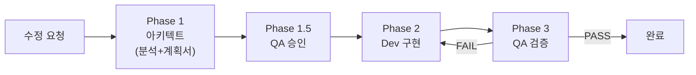

# 코드 수정 워크플로우

> 아키텍트가 분석하고, Dev가 구현하고, QA가 검증한다.

## 언제 사용하나

- 코드 수정, 버그픽스, 리팩토링 요청이 있을 때
- 서비스 간(game-server / ai-adapter / frontend) 변경이 필요할 때
- 대전 배치 중 drift가 감지되어 긴급 수정이 필요할 때

## 핵심 흐름

## 관련 문서

- `.claude/skills/code-modification/SKILL.md` -- Dev 에이전트가 따르는 개별 코딩 절차
- `docs/02-design/41-timeout-chain-breakdown.md` -- 타임아웃 SSOT
- `docs/02-design/42-prompt-variant-standard.md` -- 프롬프트 variant SSOT

## 변경 이력

| 날짜 | 버전 | 내용 |
|------|------|------|
| 2026-04-17 | v1.0 | P0/P1/P2 15건 일괄 개정 (SSOT 매핑, 롤백, SKILL 진화 트리거, 루프 상한 등) |
