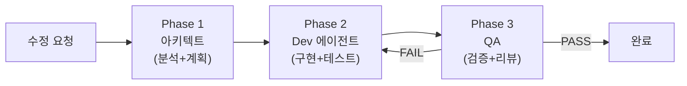

# Code Fix Workflow (코드 수정 워크플로우)

> 아키텍트가 분석하고, Dev가 구현하고, QA가 검증한다.

## Purpose

코드 수정/버그픽스/리팩토링 요청 시 **아키텍트 → Dev → QA** 3단계 팀 워크플로우를 실행한다.
단일 에이전트가 혼자 분석+구현+검증을 모두 하지 않고, 역할을 분리하여 품질을 보장한다.

---

## 워크플로우 흐름



---

## Phase 1: 아키텍트 — 분석 + 수정 계획서

**에이전트**: `architect` (반드시 먼저 실행)

아키텍트에게 전달할 프롬프트 구조:
```
## 미션: [요청 내용] 수정 계획서 작성

### 요청 사항
(사용자의 원래 요청을 그대로 전달)

### 분석 범위
1. 수정 대상 코드를 Read로 전체 읽고 현재 동작 이해
2. 수정 대상의 caller/callee를 Grep으로 전수 검색
3. 관련 테스트 파일 존재 여부 확인
4. 서비스 간 영향 분석 (game-server ↔ ai-adapter ↔ frontend)

### 산출물: 수정 계획서
다음 형식으로 작성하라 (Dev 에이전트가 이것을 읽고 구현한다):

#### 서비스별 수정 항목
| 서비스 | 파일:라인 | 현재 동작 | 변경 내용 | 이유 |
|--------|----------|----------|----------|------|

#### 파급 영향
- 이 변경으로 인해 함께 수정해야 하는 곳 목록
- 환경변수/ConfigMap/Helm 변경 필요 여부
- API 계약 변경 여부

#### 테스트 범위
- 수정 후 실행해야 할 테스트 목록 (파일명 + 명령어)
- 추가해야 할 테스트 (현재 없는 경우)

#### 주의사항
- Dev가 반드시 알아야 할 맥락, 함정, 엣지 케이스
```

아키텍트는 **코드를 직접 수정하지 않는다**. 계획서만 작성한다.

---

## Phase 2: Dev 에이전트 — 구현 + 테스트

**에이전트**: 서비스에 맞는 Dev 에이전트 (go-dev, node-dev, frontend-dev 등)

Dev 에이전트에게 전달할 프롬프트 구조:
```
## 미션: 아키텍트 수정 계획서 기반 구현

### 아키텍트 수정 계획서
(Phase 1의 산출물을 그대로 포함)

### 구현 규칙
1. `.claude/skills/code-modification/SKILL.md` 절차를 따른다
2. 계획서의 수정 항목을 순서대로 구현한다
3. 계획서에 없는 추가 수정은 하지 않는다
4. 계획서의 "주의사항"을 반드시 읽고 이해한 뒤 시작한다
5. 수정 완료 후:
   - 빌드 확인 (go build / npm run build)
   - 계획서의 "테스트 범위"에 명시된 테스트 실행
   - git diff --stat 으로 변경 목록 확인
```

여러 서비스에 걸친 수정이면 **서비스별 Dev 에이전트를 병렬로 실행**한다.
단, 서비스 간 의존이 있으면 (예: 에러코드 변경은 backend 먼저 → frontend 후) 순서를 지킨다.

---

## Phase 3: QA — 검증 + 리뷰

**에이전트**: `qa`

QA 에이전트에게 전달할 프롬프트 구조:
```
## 미션: 코드 수정 검증

### 아키텍트 수정 계획서
(Phase 1 산출물)

### Dev 수정 결과
(Phase 2 에이전트의 리포트)

### 검증 항목
1. git diff 확인 — 계획서와 실제 변경이 일치하는지 대조
2. 빌드 확인 — 전체 서비스 빌드
3. 테스트 실행 — 수정 관련 테스트 + 회귀 테스트
4. 누락 확인 — 계획서에 있지만 구현되지 않은 항목
5. 의도치 않은 변경 — 계획서에 없는 추가 변경이 있는지

### 판정
- PASS: 모든 검증 통과
- FAIL: 실패 항목과 구체적 수정 요청을 Dev에게 전달
```

---

## 실행 예시

Claude(메인)가 이 워크플로우를 실행하는 순서:

```python
# 1. 아키텍트 (foreground — 결과가 Phase 2 입력이므로)
architect_result = Agent(subagent_type="architect", prompt="분석+계획서...")

# 2. Dev 에이전트들 (background 병렬 — 서비스별)
go_dev = Agent(subagent_type="go-dev", prompt=f"계획서:{architect_result}...", run_in_background=True)
node_dev = Agent(subagent_type="node-dev", prompt=f"계획서:{architect_result}...", run_in_background=True)
frontend_dev = Agent(subagent_type="frontend-dev", prompt=f"계획서:{architect_result}...", run_in_background=True)

# 3. QA (foreground — Dev 완료 후)
qa_result = Agent(subagent_type="qa", prompt=f"계획서+Dev결과 검증...")
```

---

## 스킵 가능 조건

| 조건 | Phase 1 (아키텍트) | Phase 2 (Dev) | Phase 3 (QA) |
|------|-------------------|---------------|--------------|
| 단일 파일 오타 수정 | 스킵 가능 | 필수 | 스킵 가능 |
| 설정값 변경 | 간소화 | 필수 | 필수 |
| 서비스 간 변경 | **필수** | 필수 | **필수** |
| 긴급 핫픽스 | 간소화 | 필수 | 필수 |

**서비스 간 변경**(game-server ↔ ai-adapter ↔ frontend)은 반드시 3단계 모두 실행한다.

---

## 관련 스킬

- `.claude/skills/code-modification/SKILL.md` — Phase 2에서 Dev 에이전트가 따르는 개별 코딩 절차
- `.claude/skills/layered-architecture-enforcer/SKILL.md` — 계층 분리 원칙 검증
