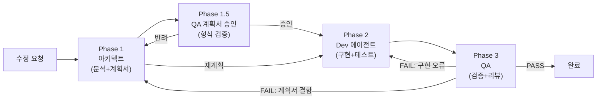

# Code Fix Workflow (코드 수정 워크플로우)

> 아키텍트가 분석하고, Dev가 구현하고, QA가 검증한다.

## Purpose

코드 수정/버그픽스/리팩토링 요청 시 **아키텍트 → Dev → QA** 3단계 팀 워크플로우를 실행한다.
단일 에이전트가 혼자 분석+구현+검증을 모두 하지 않고, 역할을 분리하여 품질을 보장한다.

---

## 워크플로우 흐름



> **루프 상한**: `QA -->|FAIL: 구현 오류| DEV` 경로는 **최대 2회**. 3번째 FAIL 시 `FAIL: 계획서 결함` 경로로 강제 전환
> (아키텍트 재분석). 아키텍트 재분석도 실패하면 애벌레(사용자) 에게 에스컬레이션. 상세는 §루프 상한 참조.

---

## Phase 1: 아키텍트 — 분석 + 수정 계획서

**에이전트**: `architect` (반드시 먼저 실행)

아키텍트에게 전달할 프롬프트 구조:
```
## 미션: [요청 내용] 수정 계획서 작성

### 요청 사항
(사용자의 원래 요청을 그대로 전달)

### 분석 범위
1. 수정 대상 코드를 Read로 전체 읽고 현재 동작 이해
2. 수정 대상의 caller/callee를 Grep으로 전수 검색
3. 관련 테스트 파일 존재 여부 확인
4. 서비스 간 영향 분석 (game-server ↔ ai-adapter ↔ frontend)
5. **SSOT 매핑** — 수정 대상이 아래 5종 SSOT 지점에 해당하면 해당 체크리스트를 **계획서에 통째로 복사/포함**한다.
   단일 값/단일 파일처럼 보여도 SSOT 인 경우 다수 지점 동기화가 필수.

   | 수정 대상 | SSOT 문서 | 적용 조건 |
   |----------|-----------|----------|
   | 타임아웃 값 (초/ms) | `docs/02-design/41-timeout-chain-breakdown.md` §5 체크리스트 | AI_ADAPTER_TIMEOUT_SEC / ws_timeout / per_try_timeout / ctx timeout 등 10개 지점 중 어느 하나라도 건드릴 때 |
   | 프롬프트 variant env | `docs/02-design/42-prompt-variant-standard.md` §5 체크리스트 | `*_PROMPT_VARIANT` / `USE_V2_PROMPT` 등 variant 선택 env 추가/삭제/변경 |
   | 게임 룰/엔진 로직 | `docs/02-design/31-game-rule-traceability.md` 추적성 매트릭스 | Meld/Run/Group/조커/재배치/첫수 30점 등 게임 규칙 관련 코드 수정 |
   | 에이전트 모델 | `.claude/skills/code-modification/agent-model-change-checklist.md` | `.claude/agents/*-agent.md` `model:` 필드, CLAUDE.md §Agent Model Policy |
   | 에러 코드/메시지 | `docs/02-design/30-error-management-policy.md` | 에러 코드 신설/변경, 프론트 에러 핸들링 매핑 |

   5종 모두 해당 없음 → 계획서에 "SSOT 매핑: 해당 없음" 명시. 추후 새 SSOT 문서가 생기면 §SKILL 진화 트리거 § (3) 참조.

### 산출물: 수정 계획서
다음 형식으로 작성하라 (Dev 에이전트가 이것을 읽고 구현한다):

#### 서비스별 수정 항목
| 서비스 | 파일:라인 | 현재 동작 | 변경 내용 | 이유 |
|--------|----------|----------|----------|------|

#### 파급 영향
- 이 변경으로 인해 함께 수정해야 하는 곳 목록
- 환경변수/ConfigMap/Helm 변경 필요 여부
- API 계약 변경 여부
- DB 스키마/마이그레이션 필요 여부

#### SSOT 매핑 결과
- §분석 범위 §5 표 기준 해당하는 SSOT 문서 이름과 적용 체크리스트 항목
- 해당 없음일 경우 "해당 없음" 명시
- 해당 있음일 경우 해당 문서의 체크리스트를 계획서 본문에 복사하거나 인용

#### 테스트 범위
- Phase 3 (Dev) 에서 실행할 테스트: code-modification §4.2 ① 수정 파일 단위 + ② 연결 경계 패키지
- Phase 4 (QA) 에서 실행할 테스트: ③ 전체 suite (Go 30s, NestJS 80s 범위에서는 무조건 전체)
- 각 테스트의 실행 명령어를 그대로 기재
- 추가해야 할 테스트 (신규 기능이면 최소 1개 happy path + 1개 엣지 — code-modification §1.3)

#### 롤백 명령
- 이전 상태 스냅샷 명령 (예: `kubectl get cm ... -o yaml > /tmp/pre-change.yaml`)
- 원복 명령 (예: `kubectl apply -f /tmp/pre-change.yaml`, `git revert <sha>`, `helm rollback`)
- 롤백 실행 기준 (예: "smoke test fallback > 0 이면 즉시 원복")
- 단순 코드 수정(설정/배포/DB 변경 없음)은 `git revert <sha>` 한 줄로 충분

#### 주의사항
- Dev가 반드시 알아야 할 맥락, 함정, 엣지 케이스
- Sonnet Dev 가 놓치기 쉬운 암묵적 가정은 명시적으로 풀어서 기재
```

아키텍트는 **코드를 직접 수정하지 않는다**. 계획서만 작성한다.

### Phase 1.5: QA 계획서 승인 체크

Phase 2 진입 전 QA 가 계획서의 **형식적 완전성** 을 검증한다 (내용 판단은 Phase 3 의 몫).

- [ ] "서비스별 수정 항목" 표에 최소 1행 존재
- [ ] "파급 영향" 에 API/환경변수/DB 각각 체크됨
- [ ] **"SSOT 매핑 결과"** 섹션 존재 및 5종 SSOT 검토 흔적 (해당 없음도 명시적이면 OK)
- [ ] "테스트 범위" 에 실행 명령어 명시 + Phase 3/4 범위 구분됨
- [ ] **"롤백 명령"** 섹션 존재 (스냅샷/원복/실행기준 3항목)
- [ ] "주의사항" 에 최소 1건 기재 (없다면 "없음" 명시)

형식 불비 시 QA 는 아키텍트에게 **반려** (= QA 의 Phase 1 반려권). 이 반려는 Mermaid 에서
`QAP1 -->|반려| ARCH` 경로로 표현된다.

---

## Phase 2: Dev 에이전트 — 구현 + 테스트

**에이전트**: 서비스에 맞는 Dev 에이전트 (go-dev, node-dev, frontend-dev 등)

Dev 에이전트에게 전달할 프롬프트 구조:
```
## 미션: 아키텍트 수정 계획서 기반 구현

### 아키텍트 수정 계획서
(Phase 1의 산출물을 그대로 포함)

### 구현 규칙
1. `.claude/skills/code-modification/SKILL.md` 절차를 따른다
2. 계획서의 수정 항목을 순서대로 구현한다
3. 계획서에 없는 추가 수정은 하지 않는다
4. 계획서의 "주의사항"을 반드시 읽고 이해한 뒤 시작한다
5. 수정 완료 후:
   - 빌드 확인 (go build / npm run build)
   - 계획서의 "테스트 범위"에 명시된 테스트 실행 (code-modification §4.2 ① + ②)
   - git diff --stat 으로 변경 목록 확인
6. **자기 이해도 증명 (Sonnet Dev 필수)**: 구현 **시작 전** 에 다음을 응답 메시지로 출력한다.
   - 계획서의 "주의사항" 각 항목을 한 문장씩 자기 언어로 재서술 (복붙 금지)
   - 계획서의 "SSOT 매핑 결과" 가 왜 이 5종 중 해당/비해당인지 한 줄 논리 설명
   - 계획서에 없는데 Dev 가 수정이 필요하다고 판단한 항목은 **구현하지 말고** 질문 목록으로 남긴다
     (범위 외 수정 금지 — 아키텍트에게 재계획 요청 사유가 됨)
7. QA 는 Phase 3 검증 시 Dev 의 위 재서술이 계획서와 일치하는지도 점검한다.
   불일치 시 "FAIL: 계획서 결함" 으로 판정할 근거가 됨.
```

> **배경**: 2026-04-17 에이전트 모델 개편으로 Dev 5명이 Sonnet 4.6 으로 다운시프트되었다. Opus 대비
> 계획서 오독 리스크가 증가하므로, 자기 이해도 증명을 통한 방어 레이어를 의무화한다.

여러 서비스에 걸친 수정이면 **서비스별 Dev 에이전트를 병렬로 실행**한다.
단, 서비스 간 의존이 있으면 (예: 에러코드 변경은 backend 먼저 → frontend 후) 순서를 지킨다.

---

## Phase 3: QA — 검증 + 리뷰

**에이전트**: `qa`

QA 에이전트에게 전달할 프롬프트 구조:
```
## 미션: 코드 수정 검증

### 아키텍트 수정 계획서
(Phase 1 산출물)

### Dev 수정 결과
(Phase 2 에이전트의 리포트)

### 검증 항목
1. git diff 확인 — 계획서와 실제 변경이 일치하는지 대조
2. 빌드 확인 — 전체 서비스 빌드
3. 테스트 실행 — 수정 관련 테스트 + 회귀 테스트
4. 누락 확인 — 계획서에 있지만 구현되지 않은 항목
5. 의도치 않은 변경 — 계획서에 없는 추가 변경이 있는지

### 판정
- PASS: 모든 검증 통과
- FAIL: 실패 항목과 구체적 수정 요청을 Dev에게 전달
  - **FAIL: 구현 오류** — 계획서와 코드 간 불일치 (Dev 재수정 경로, 루프 상한 2회)
  - **FAIL: 계획서 결함** — 계획서 자체가 누락/모순 (아키텍트 재계획 경로)
```

### QA → Dev 피드백 경로 (주체 명문화)

QA 는 FAIL 리포트를 **응답 메시지로 반환** 한다. 메인 Claude (또는 사용자) 가 그 리포트를 기반으로
Dev 에이전트를 **재호출** 한다. QA 에이전트는 Dev 를 직접 호출하지 않는다 —
QA 에게 Agent 도구 권한을 부여하면 감사·추적이 어려워지고, 재호출 주체 책임이 흐려진다.

동일 원칙으로 QA → 아키텍트 (FAIL: 계획서 결함) 경로도 메인 Claude 가 중개한다.

### 루프 상한

| 루프 | 상한 | 초과 시 |
|------|------|---------|
| Phase 1.5 반려 → 아키텍트 재작성 | **3회** | 애벌레에게 에스컬레이션 (계획서 자체가 지속적으로 형식을 못 맞춤 = SKILL 또는 요청이 모호함) |
| QA FAIL: 구현 오류 → Dev 재수정 | **2회** | 3번째 FAIL 시 "FAIL: 계획서 결함" 경로로 강제 전환 (root cause 가 계획서일 가능성) |
| 아키텍트 재계획 → Dev → QA | **1회** | 그래도 FAIL 시 애벌레에게 에스컬레이션 |

**근거 실측**:
- Round 4 BUG-GS-004: 1회 재수정으로 해결 (상한 2회 내)
- Round 5 timeout 240→500: 2회 이터레이션으로 수렴 (상한 2회 딱 맞음)
- 두 사례 모두 3회차는 실제로 불필요했으므로 상한 2회가 합리적 임계점

### CI 와의 책임 경계

- **로컬 Phase 4 (Dev 구현 완료 시점)** = 최소 게이트: 빌드 + 수정 패키지 테스트
- **로컬 Phase 3 (QA 검증)** = 중간 게이트: 전체 suite (Go/NestJS 는 로컬에서 전체 실행)
- **CI** = 최종 게이트: 전체 테스트 + SonarQube 커버리지/품질 + Trivy 보안 + 빌드/배포

CI FAIL 은 QA PASS 를 **자동 무효화** 하며, code-fix 워크플로우를 Phase 2 (Dev 재수정) 로 되돌린다.
이 되돌림은 Mermaid 상 `QA -->|FAIL: 구현 오류| DEV` 경로와 동일하게 취급되며,
루프 상한 카운트에 합산된다 (로컬 FAIL 2회 + CI FAIL 1회 = 상한 소진).

---

## 실행 예시

Claude(메인)가 이 워크플로우를 실행하는 순서:

```python
# 1. 아키텍트 (foreground — 결과가 Phase 2 입력이므로)
architect_result = Agent(subagent_type="architect", prompt="분석+계획서...")

# 2. Dev 에이전트들 (background 병렬 — 서비스별)
go_dev = Agent(subagent_type="go-dev", prompt=f"계획서:{architect_result}...", run_in_background=True)
node_dev = Agent(subagent_type="node-dev", prompt=f"계획서:{architect_result}...", run_in_background=True)
frontend_dev = Agent(subagent_type="frontend-dev", prompt=f"계획서:{architect_result}...", run_in_background=True)

# 3. QA (foreground — Dev 완료 후)
qa_result = Agent(subagent_type="qa", prompt=f"계획서+Dev결과 검증...")
```

---

## 스킵 가능 조건

| 조건 | Phase 1 (아키텍트) | Phase 2 (Dev) | Phase 3 (QA) |
|------|-------------------|---------------|--------------|
| 단일 파일 오타 수정 | 스킵 가능 | 필수 | 스킵 가능 |
| 설정값 변경 | **필수 (SSOT 검토)** | 필수 | 필수 |
| 서비스 간 변경 | **필수** | 필수 | **필수** |
| 긴급 핫픽스 | 축약 (아래 정의) | 필수 | 필수 (핫픽스 최소 티어) |

**"간소화" 표현의 구체적 정의** (P1-A1 명확화):
- **Phase 1 축약**: Phase 1 을 300자 이내 2~3 문단으로 축약 가능 — caller/callee 분석은 생략 가능하되
  **SSOT 매핑과 롤백 명령은 생략 금지**.
- **Phase 2 축약**: "수정 내용 + 이유 + 롤백 명령 3 줄" 로 축약 가능. Phase 3 (QA) 는 축약 불가.

**서비스 간 변경**(game-server ↔ ai-adapter ↔ frontend)은 반드시 3단계 모두 실행한다.

### batch-battle 중 drift 발견 시 (교차 워크플로우)

`batch-battle` SKILL Phase 3 모니터링 중에 drift 가 감지되면 (예: fallback 이 연속 3건 발생,
응답시간이 SLO 를 2x 초과 지속, 예상 외 에러율 급증):

1. **대전 즉시 중단** — `kubectl rollout pause` 또는 batch 스크립트에 SIGTERM
2. **code-fix Phase 1 긴급 모드 호출** — 아키텍트에게 300자 이내 축약 분석 허용.
   단, **SSOT 매핑과 롤백 명령은 생략 금지** (drift 원인이 SSOT drift 일 가능성이 가장 높음)
3. **Phase 2 Dev 구현** 후 → 단순히 code-fix Phase 3 QA 만 보는 게 아니라,
   **batch-battle Phase 1 (사전점검) 부터 재시작** 한다. drift 수정이 새 drift 를 만들지 않는지 확인.

drift 기록은 그 자체로 §SKILL 진화 트리거 § (1) "같은 종류 drift 2회 반복" 집계 대상이다.

---

## SKILL 진화 트리거

이 SKILL 자체도 학습하는 개체다. 다음 3가지 트리거 발생 시 본 SKILL 또는 별도 전용 체크리스트를 **즉시 개정** 한다.

1. **같은 종류의 drift 사고가 2회 반복** — 예: 타임아웃 chain 동기화 실패 2회, 프롬프트 variant 동기화 실패 2회.
   2회차 발생 시 해당 영역 전용 체크리스트를 신설하고 본 SKILL §SSOT 매핑 표에 추가.
2. **스킵 조건 표 해석 충돌이 1회라도 기록됨** — "이 건은 간소화 가능한가?" 를 놓고 의견이 갈린 사례가
   work_logs/ 또는 PR 리뷰에 남았다면 표 정의를 더 구체화.
3. **새 SSOT 문서가 생성됨** — `docs/02-design/` 아래에 SSOT 성격의 문서가 추가되면
   §Phase 1 §분석 범위 §5 표에 행을 추가하고, 아키텍트 에이전트 정의(`.claude/agents/architect-agent.md`)
   의 참조 문서 목록도 갱신.

**개정 주체**: architect + qa 공동. Dev 는 개정 요청만 올린다 (자기가 준수할 규칙을 직접 개정하지 않음).

**과거 사례** — 이미 다음 3건이 사후 신설된 전례다. 앞으로는 트리거 기반으로 예방적 전환한다.
- `docs/02-design/41-timeout-chain-breakdown.md` (타임아웃 체인) — 2026-04-16 Day 4 Run 3 fallback 오분류 사고 이후
- `docs/02-design/42-prompt-variant-standard.md` (프롬프트 variant) — 2026-04-16 v4 regression 이후
- `.claude/skills/code-modification/agent-model-change-checklist.md` (에이전트 모델) — 2026-04-17 개편 직전

---

## 관련 스킬

- `.claude/skills/code-modification/SKILL.md` — Phase 2에서 Dev 에이전트가 따르는 개별 코딩 절차
- `.claude/skills/code-modification/agent-model-change-checklist.md` — 에이전트 모델 변경 전용 체크리스트
- `.claude/skills/layered-architecture-enforcer/SKILL.md` — 계층 분리 원칙 검증
- `.claude/skills/batch-battle/SKILL.md` — 대전 실행 중 drift 발견 시 본 SKILL 로 교차 (§batch-battle 중 drift 발견 시)

---

## 개정 이력

- **2026-04-17**: P0/P1/P2 15건 일괄 개정 (리뷰어: architect + qa, 반영: architect).
  SSOT 매핑 / 롤백 준비 / SKILL 진화 트리거 / 테스트 3단계 / 설정값 스킵 제거 /
  재수정 루프 상한 / Mermaid 분기 확장 / Sonnet Dev 자기이해도 / 계획서 승인 체크 /
  신규 기능 테스트 / 프롬프트 텍스트 변경 / batch-battle 교차 / CI 경계 / QA 피드백 경로 / Phase 4 티어링.
  본 파일에는 이 중 Mermaid 분기/루프 상한, Phase 1 §분석 범위 §5 SSOT 매핑, 계획서 형식
  (SSOT 매핑 결과 / 롤백 명령 섹션), Phase 1.5 QA 승인 체크, Phase 2 §6~7 Sonnet Dev 자기이해도,
  Phase 3 QA 피드백 경로 명문화, 스킵 표 "설정값 필수 (SSOT 검토)" 상향, 간소화 표현 정의,
  batch-battle 교차 경로, CI 경계, SKILL 진화 트리거 섹션이 반영됐다.
  Phase 4 검증 티어링과 §1.3 신규 기능 테스트는 `code-modification/SKILL.md` 에 있음.
