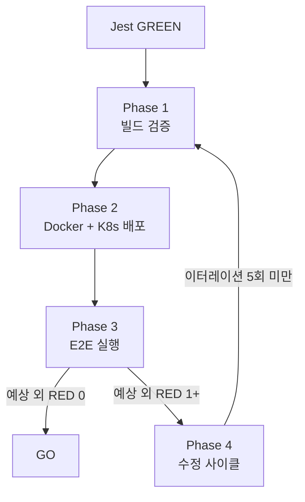

# E2E 검증 이터레이션 루프

> "테스트가 통과했다"와 "동작한다"는 다른 말이다. E2E를 돌려야 하는 이유.

## 언제 사용하나

- 프론트엔드 코드 수정 후 사용자 테스트 전
- G-* Task 구현 완료 + Jest GREEN 확인 후
- "사용자 테스트 가능한가?" / "배포해도 되나?" 판단 시
- PR 머지 전 최종 검증

## 핵심 흐름

## 관련 문서

- `docs/04-testing/81-e2e-rule-scenario-matrix.md` -- 룰 19 매트릭스
- `.claude/skills/pre-deploy-playbook/SKILL.md` -- Phase 3에서 호출하는 배포 전 게이트
- `docs/04-testing/9N-e2e-iteration-N-report.md` -- 이터레이션 보고서

## 변경 이력

| 날짜 | 버전 | 내용 |
|------|------|------|
| 2026-04-26 | v1.0 | 신설. GHOST-SC2 이터레이션 2회 경험 기반 |
