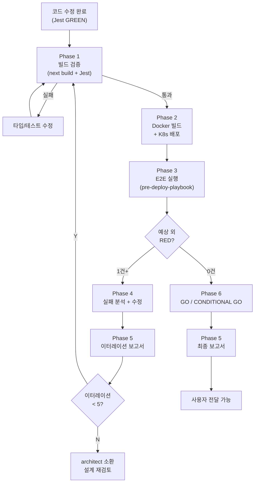

# E2E Verify Loop (E2E 검증 이터레이션)

> "테스트가 통과했다"와 "동작한다"는 다른 말이다. E2E를 돌려야 하는 이유.
> — 바이브 로그 2026-04-26

## Purpose

코드 수정 후 **사용자에게 보여줄 수 있는 수준**이 될 때까지, 빌드→배포→E2E→분석→수정 사이클을 반복한다. `pre-deploy-playbook`이 1회 실행+판정이라면, 이 스킬은 NO-GO일 때 수정→재빌드→재테스트를 반복하는 **외부 루프**다.

**탄생 배경** (2026-04-26):
- Jest 단위 테스트 545 PASS로 "완료"라고 판단 → 사용자에게 테스트 떠넘기기 시도
- E2E 돌려보니 GHOST-SC2 실패 — Jest 마커 통과 ≠ 실동작
- 이터레이션 1 (9 PASS / 5 FAIL) → 근본 원인 수정 → 이터레이션 2 (10 PASS / 4 FAIL 의도된 RED)
- 이 사이클이 스킬로 구조화되어 있었다면, "사용자 테스트 떠넘기기" 실수를 방지했을 것

**적용 대상**:
- 프론트엔드 코드 수정 후, 사용자 테스트 전
- G-* Task 구현 완료 후
- PR 머지 전 최종 검증

**SSOT 참조**:
- `docs/04-testing/81-e2e-rule-scenario-matrix.md` — 룰 19 매트릭스
- `docs/04-testing/92-*.md`, `93-*.md` — 이터레이션 보고서 템플릿

---

## Trigger

다음 문맥에서 자동 발동:
- "사용자 테스트 가능한가?" / "배포해도 되나?"
- G-* Task 구현 + Jest GREEN 확인 후
- `code-modification` SKILL Phase 4 완료 후
- 사용자가 "E2E 돌려" / "검증해" / "테스트해" 요청

**절대 규칙**: Jest PASS만으로 "완료" 판정 금지. 이 스킬을 거치지 않으면 사용자 전달 차단.

---

## Phase 1: 빌드 검증

### 1.1 next build
```bash
cd src/frontend && rm -rf .next && npx next build 2>&1 | tail -30
```
- 타입 에러 0 확인
- ESLint warning은 허용 (error만 차단)
- **실패 시**: 타입 에러 수정 후 재실행. Phase 2 진입 불가.

### 1.2 Jest 회귀 확인
```bash
cd src/frontend && npx jest --no-coverage 2>&1 | tail -10
```
- 기존 PASS 수 유지 확인 (현재 기준: 545+)
- 의도된 RED(A14.5 등) 외 신규 FAIL 0
- **실패 시**: Jest 수정 후 재실행. Phase 2 진입 불가.

---

## Phase 2: Docker 빌드 + K8s 배포

### 2.1 이미지 빌드
```bash
SHORT_SHA=$(git rev-parse --short HEAD)
TAG="<task-tag>-${SHORT_SHA}"
docker build -t rummiarena/frontend:${TAG} -f src/frontend/Dockerfile src/frontend/
```
- `<task-tag>`: 현재 작업 식별자 (예: `g-b`, `g-e`, `g-b-fix`)
- HEAD SHA를 태그에 포함 (HEAD ↔ 이미지 일치 보장)

### 2.2 K8s 배포
```bash
kubectl set image deployment/frontend frontend=rummiarena/frontend:${TAG} -n rummikub
kubectl rollout status deployment/frontend -n rummikub --timeout=120s
```
- rollout 성공 확인
- Pod Running + endpoint 200/307 확인:
  ```bash
  curl -s -o /dev/null -w "%{http_code}" http://localhost:30000/
  ```

---

## Phase 3: E2E 실행 (pre-deploy-playbook 호출)

`pre-deploy-playbook` SKILL의 Phase 2 를 실행한다.

### 3.1 룰 기반 시나리오 (핵심 5 spec)
```bash
cd src/frontend
npx playwright test --workers=1 --reporter=list \
  e2e/rule-initial-meld-30pt.spec.ts \
  e2e/rule-extend-after-confirm.spec.ts \
  e2e/rule-ghost-box-absence.spec.ts \
  e2e/rule-turn-boundary-invariants.spec.ts \
  e2e/rule-invalid-meld-cleanup.spec.ts
```

### 3.2 결과 분류
각 FAIL을 아래 3종으로 분류:

| 분류 | 의미 | 조치 |
|------|------|------|
| **의도된 RED** | 미구현 Feature 범위 (G-E, G-F 등) | 허용 — Task ID 기록 |
| **예상 외 RED** | 이번 수정이 유발한 회귀 또는 미해소 | **Phase 4로 진행** |
| **환경 이슈** | Pod 비정상, auth 만료, 네트워크 | devops 조치 후 재실행 |

### 3.3 판정
- 예상 외 RED = 0 → **GO** → Phase 6 (보고서)
- 예상 외 RED >= 1 → **NO-GO** → Phase 4 (수정 사이클)

---

## Phase 4: 실패 분석 + 수정 (NO-GO 시)

### 4.1 근본 원인 분석
1. 실패 TC의 error-context.md + 스크린샷 확인
2. 실패 assertion 위치 + 기대값 vs 실제값 확인
3. 근본 원인 후보 분류:

| 원인 유형 | 예시 | 수정 대상 |
|----------|------|----------|
| 프로덕션 코드 버그 | handleDragEnd 분기 누락 | src/ 코드 |
| E2E 테스트 상태 설정 불완전 | setupScenario players 미패치 | e2e/ 테스트 |
| 타이밍/WS race | currentSeat 덮어쓰기 | 테스트 대기 로직 |
| 의도된 RED 오분류 | 사실은 구현 범위 밖 | 분류 정정만 |

### 4.2 수정 실행
- **프로덕션 코드 수정**: `code-modification` SKILL 사용
- **E2E 테스트 수정**: 직접 수정 (band-aid 금지, 근본 원인 해결)
- **에이전트 dispatch**: 복잡한 분석은 frontend-dev/qa에 위임

### 4.3 수정 후 커밋
```bash
git add <수정 파일>
git commit -m "fix(e2e): <TC명> <근본 원인 1줄 요약>"
```

### 4.4 Phase 1로 복귀
수정 후 **Phase 1부터 다시 시작** (빌드 → 배포 → E2E). 이것이 이터레이션 루프.

---

## Phase 5: 이터레이션 보고서

매 이터레이션 완료 시 보고서 작성:

```markdown
# E2E 이터레이션 N 보고서

- **날짜**: YYYY-MM-DD
- **이미지**: `rummiarena/frontend:<tag>`
- **커밋**: `<sha>`
- **트리거**: <이유>

## 결과 요약
| 구분 | 이전 | 이번 | 변화 |
|------|------|------|------|
| PASS | N | M | +K |
| FAIL | N | M | -K |

## 수정 내용 (NO-GO → 수정 후)
- 근본 원인: ...
- 수정 파일: ...
- 프로덕션 코드 변경: Y/N

## 잔존 FAIL (의도된 RED)
| TC | 이유 | 해소 Task |
|----|------|----------|

## 판정: GO / NO-GO / CONDITIONAL GO
```

저장 위치: `docs/04-testing/9N-e2e-iteration-N-report.md`

---

## Phase 6: 최종 판정

### GO 조건
- 예상 외 RED = 0
- next build 통과
- Jest 기존 PASS 유지
- 의도된 RED 전부 Task ID로 분류됨

### CONDITIONAL GO 조건
- 예상 외 RED = 0
- 의도된 RED가 존재하지만 현재 세션 범위 밖으로 명확히 분류
- 사용자에게 "이 기능은 아직 미구현" 안내 가능

### NO-GO 조건
- 예상 외 RED >= 1 → Phase 4로 복귀

### 최대 이터레이션
- **5회까지** 반복. 5회 초과 시 근본적 설계 재검토 필요 → architect 소환.

---

## 금지 사항

1. **Jest PASS만으로 "완료" 판정 금지** — Jest 마커 통과 ≠ E2E 실동작 (2026-04-26 교훈)
2. **사용자 테스트 떠넘기기 금지** — 이 스킬을 거치지 않으면 "테스트해보시겠습니까?" 제안 불가
3. **E2E 실패를 flaky로 치부 금지** — 근본 원인 분석 필수
4. **이터레이션 보고서 생략 금지** — 매 사이클마다 기록
5. **빌드 없이 배포 금지** — Phase 1 건너뛰기 불가

---

## 역할 분담

| 담당 | 역할 |
|------|------|
| Claude 메인 | 전체 루프 오케스트레이션 + 판정 |
| qa | E2E 결과 분류 + 시나리오 추가 |
| frontend-dev | 예상 외 RED 수정 |
| game-analyst | 의도된 RED 분류 검증 (룰 ID 매핑) |
| devops | Docker 빌드 + K8s 배포 |
| architect | 5회 초과 시 설계 재검토 |

---

## 플로우차트



---

## 변경 이력

- **2026-04-26 v1.0**: 신설. GHOST-SC2 이터레이션 2회 경험 기반. Jest 마커 ≠ E2E 실동작 교훈 반영.
