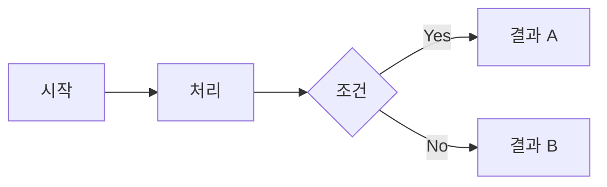
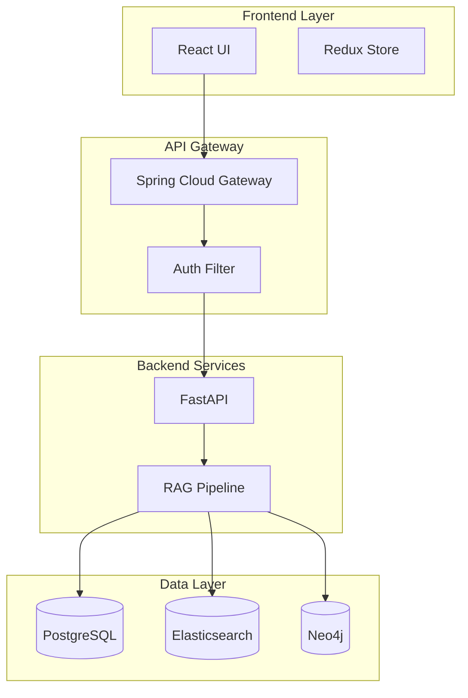
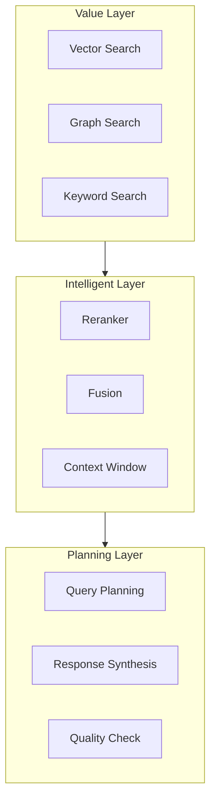
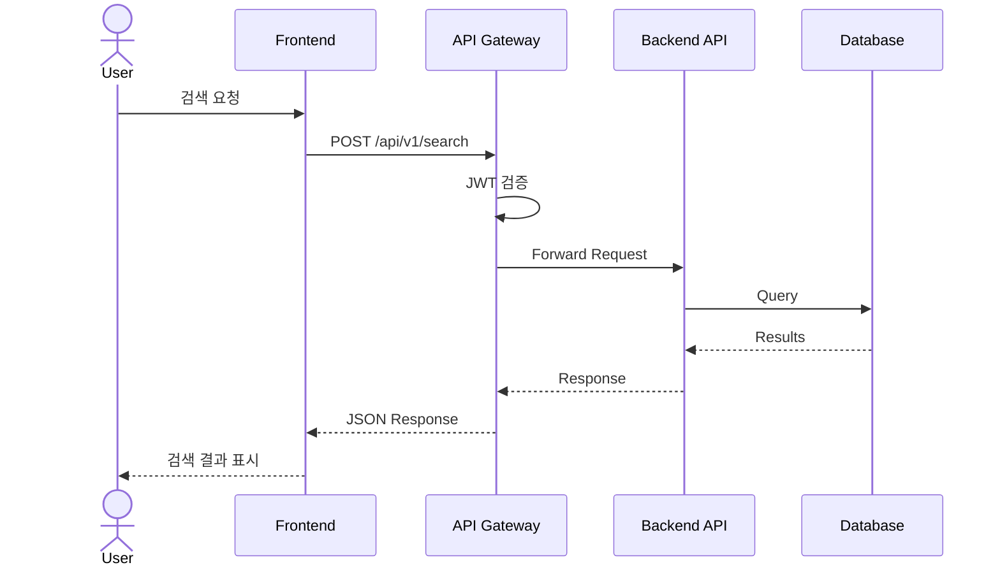
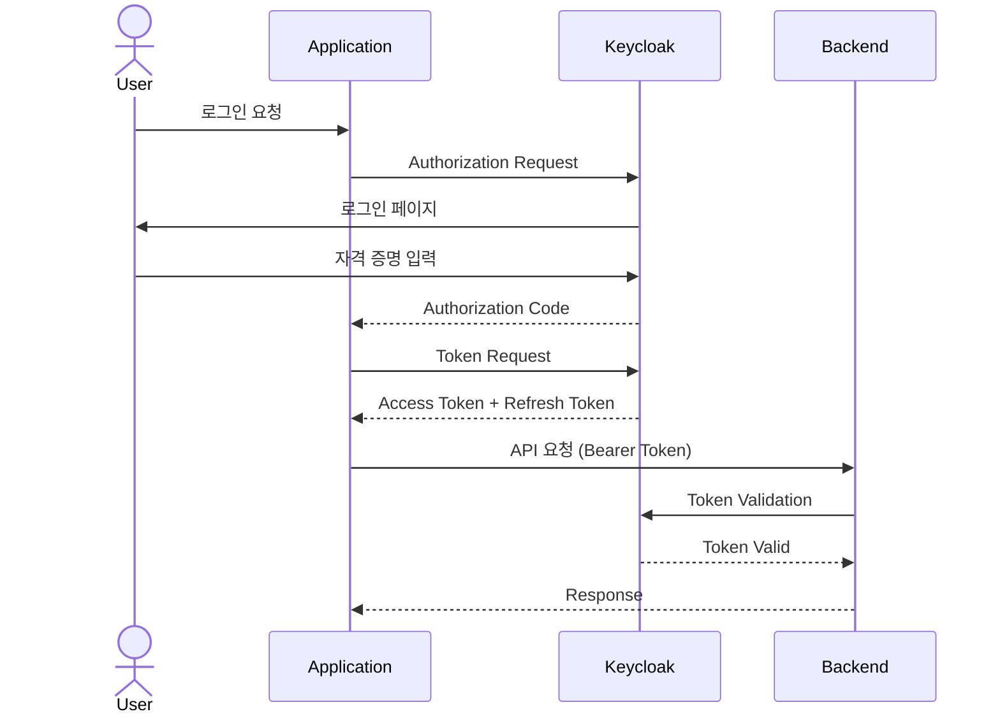
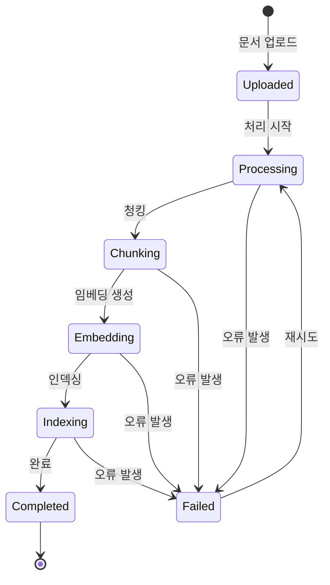
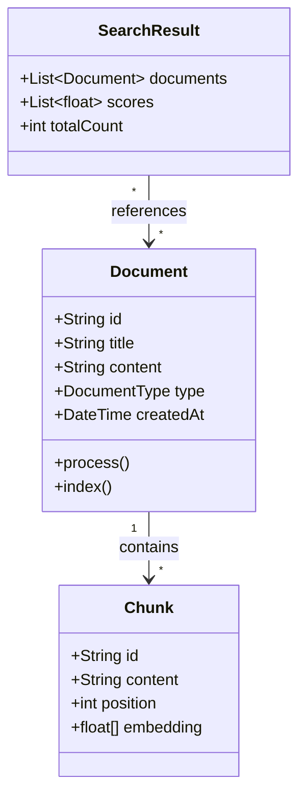
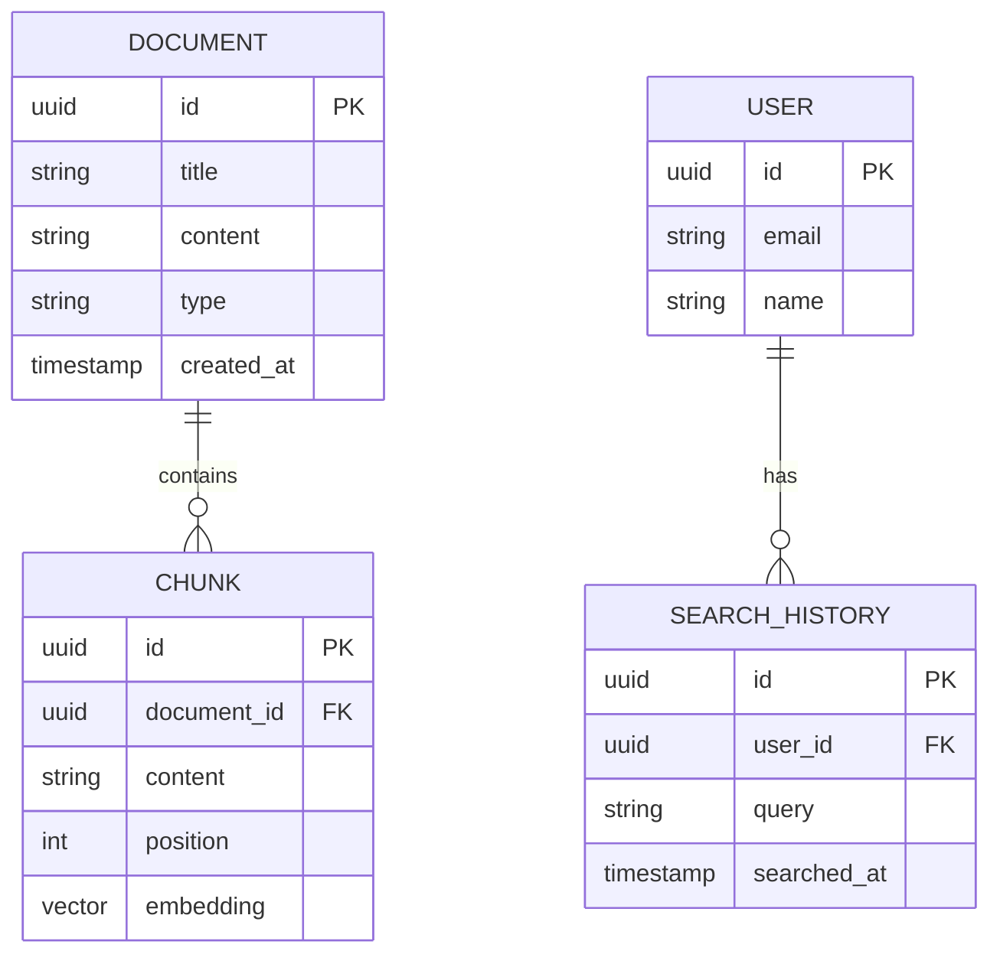
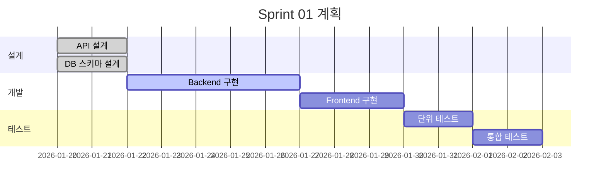
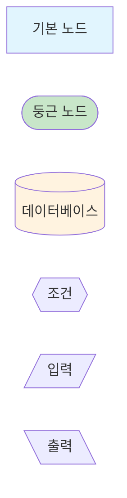

# Mermaid Diagrams

Mermaid를 사용한 다이어그램 작성 표준을 정의합니다.

## Purpose

문서 내 다이어그램을 일관된 형식으로 작성하여 가독성과 유지보수성을 높입니다.

---

## Diagram Type Selection (다이어그램 유형 선택)

| 상황 | Mermaid 유형 | 예시 |
|------|-------------|------|
| 순차적 흐름 | `flowchart LR` | A → B → C |
| 계층적 흐름 | `flowchart TB` | 상위에서 하위로 |
| 시스템 간 통신 | `sequenceDiagram` | API 호출, 인증 플로우 |
| 일정/타임라인 | `gantt` | 스프린트 계획, 테스트 일정 |
| 상태 변화 | `stateDiagram-v2` | 주문 상태, 문서 상태 |
| 클래스 관계 | `classDiagram` | 도메인 모델, 엔티티 관계 |
| ER 다이어그램 | `erDiagram` | 데이터베이스 스키마 |
| 컴포넌트 그룹핑 | `subgraph` | 레이어별 서비스 분류 |

---

## ⚠️ GitHub 렌더링 주의사항 (Breaking Rules)

GitHub의 Mermaid 렌더러는 표준 Mermaid와 미묘하게 다르다. 아래 규칙을 반드시 지킨다.

| 규칙 | 잘못된 예 | 올바른 예 |
|------|-----------|-----------|
| **gantt 작업명에 `:` 금지** | `Sprint 1: 게임 엔진  :s1, ...` | `Sprint 1 게임 엔진  :s1, ...` |
| **flowchart edge label에 `\n` 금지** | `A -->|시작\n완료| B` | `A -->|시작 완료| B` |
| **gitGraph 대소문자** | ` ```mermaid\ngitgraph` | ` ```mermaid\ngitGraph` |
| **sequenceDiagram 메시지에 `;` 금지** | `A->>B: SELECT * WHERE id='x';` | `A->>B: SELECT * WHERE id=x` |
| **sequenceDiagram 메시지에 `'` 주의** | `A->>B: WHERE id='abc'` | `A->>B: WHERE id=abc` |

> **gantt 작업명 규칙 상세**: `gantt`에서 첫 번째 `:`는 작업명과 속성(status/id/날짜)의 구분자이다.
> 작업명 안에 `:`를 쓰면 파싱 오류가 발생한다. 공백 또는 ` -`로 대체할 것.

> **`\n` 제한 상세**: `\n`은 노드 라벨(`A["줄1\n줄2"]`) 안에서는 사용 가능하나,
> 엣지 라벨(`|텍스트|`) 안에서는 불가하다.

---

## Flowchart Patterns

### 기본 플로우차트



### 시스템 아키텍처 (레이어 분리)



### VIP 3단계 아키텍처



---

## Sequence Diagram Patterns

### API 호출 플로우



### 인증 플로우



---

## State Diagram Patterns

### 문서 처리 상태



---

## Class Diagram Patterns

### 도메인 모델



---

## ER Diagram Patterns

### 데이터베이스 스키마



---

## Gantt Chart Patterns

### 스프린트 계획



---

## Style Guidelines

### 노드 스타일링



### 색상 팔레트 (권장)

| 용도 | 색상 코드 | 예시 |
|------|----------|------|
| Frontend | `#e1f5fe` | 연한 파랑 |
| Backend | `#c8e6c9` | 연한 초록 |
| Database | `#fff3e0` | 연한 주황 |
| Gateway | `#f3e5f5` | 연한 보라 |
| Error | `#ffcdd2` | 연한 빨강 |
| Success | `#c8e6c9` | 연한 초록 |

---

## Anti-Patterns (피해야 할 패턴)

### 🚫 피해야 할 것

1. **ASCII 아트 사용**
   ```
   ❌ +---+    +---+
      | A | -> | B |
      +---+    +---+
   ```

2. **너무 복잡한 단일 다이어그램**
   - 노드 20개 이상 → 분리 권장

3. **설명 없는 노드**
   - `A --> B` 대신 `A["검색 요청"] --> B["결과 처리"]`

4. **한글 레이블 누락**
   - 모든 노드에 한글 설명 포함

---

## Quick Reference

### 노드 형태

```
A["사각형"]
B("둥근 사각형")
C(("원"))
D{{"육각형"}}
E[("데이터베이스")]
F{{"조건"}}
```

### 화살표

```
A --> B     실선 화살표
A --- B     실선
A -.-> B    점선 화살표
A ==> B     굵은 화살표
A --text--> B  텍스트 포함
```

### 방향

```
flowchart LR  (왼쪽→오른쪽)
flowchart TB  (위→아래)
flowchart BT  (아래→위)
flowchart RL  (오른쪽→왼쪽)
```

---

**Version**: 1.0.0
**Last Updated**: 2026-01-24
