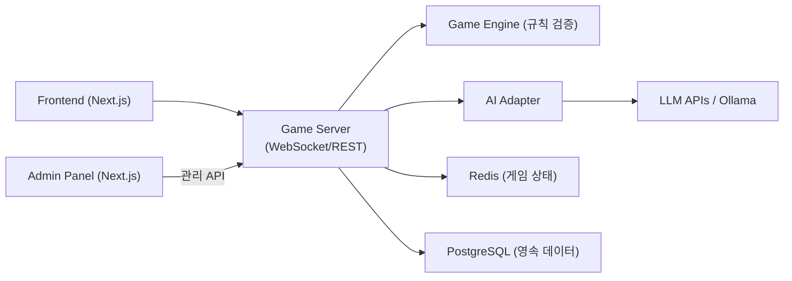

# CLAUDE.md

This file provides guidance to Claude Code (claude.ai/code) when working with code in this repository.

## Screenshot Directory

사용자 스크린샷은 `d:\Users\KTDS\Pictures\FastStone` (WSL: `/mnt/d/Users/KTDS/Pictures/FastStone`) 에 저장된다.
파일명 형식: `YYYY-MM-DD_HHMMSS.png`

- MCP filesystem 서버에 해당 경로가 허용 디렉터리로 등록되어 있다.
- 사용자가 파일명(타임스탬프)만 언급하면 즉시 이 경로에서 Read 도구로 열어볼 것.
- 경로를 다시 물어보지 말 것.

## Project Overview

RummiArena는 루미큐브(Rummikub) 보드게임 기반 멀티 LLM 전략 실험 플랫폼이다.
Human + AI 혼합 2~4인 실시간 대전을 지원하며, 다양한 LLM 모델(OpenAI, Claude, DeepSeek, Ollama/LLaMA)의 게임 전략을 비교·분석한다.

## Architecture



- **Game Engine**: 게임 규칙 검증 전담. LLM은 행동을 "제안"만 하고 Engine이 유효성 검증
- **AI Adapter**: 모델 무관 공통 인터페이스. 모든 LLM은 동일한 MoveRequest/MoveResponse로 통신
- **Stateless Server**: 게임 상태는 Redis, 영속 데이터는 PostgreSQL. Pod 재시작에도 게임 유지

## Repository Structure

```
docs/
  01-planning/     # 기획 (헌장, 요구사항, 리스크, 도구체인, WBS)
  02-design/       # 설계 (아키텍처, DB, API, AI Adapter, 세션 관리)
  03-development/  # 개발 가이드 (셋업 매뉴얼)
  04-testing/      # 테스트 전략 + 보고서
  05-deployment/   # 배포 가이드 + K8s 아키텍처
  06-operations/   # 운영 가이드 (추후)
src/
  frontend/        # Next.js 프론트엔드
  game-server/     # Backend API + Game Engine
  ai-adapter/      # AI Adapter 서비스
  admin/           # 관리자 대시보드
helm/              # Helm charts (5개 서비스: postgres, redis, game-server, ai-adapter, frontend)
scripts/           # 통합 테스트 등 자동화 스크립트
argocd/            # ArgoCD application manifests
work_logs/         # 세션/데일리/스크럼/바이브/회고/결정 로그
.github/           # GitHub Issues templates, workflows
```

## Tech Stack

- **Frontend**: Next.js, TailwindCSS, Framer Motion, dnd-kit
- **Backend (game-server)**: Go (gin + gorilla/websocket + GORM)
- **Backend (ai-adapter)**: NestJS (TypeScript)
- **DB**: PostgreSQL 16, Redis 7
- **AI**: OpenAI API, Claude API, DeepSeek API, Ollama (LLaMA)
- **Infra**: Docker Desktop Kubernetes, Helm 3, ArgoCD
- **CI**: GitLab CI + GitLab Runner
- **Quality**: SonarQube, Trivy
- **Mesh**: Istio Service Mesh (Phase 5)
- **Notification**: 카카오톡 API
- **Auth**: Google OAuth 2.0

## Key Design Principles

1. **LLM 신뢰 금지**: LLM 응답은 항상 Game Engine으로 유효성 검증. Invalid move → 재요청 (max 3회) → 실패 시 강제 드로우
2. **AI Adapter 분리**: Game Engine은 특정 LLM에 의존하지 않음. 공통 인터페이스로 모델 교체 가능
3. **Stateless 서버**: 모든 게임 상태는 Redis에 저장. Pod 재시작 대응
4. **GitOps**: 소스 repo와 GitOps repo 분리. ArgoCD가 Helm chart 기반 배포 담당
5. **DevSecOps**: CI 파이프라인에 SonarQube + Trivy 보안 게이트
6. **인증/인가 ↔ 사용자 프로필 완전 분리**: OAuth 핸들러에서 DisplayName, AvatarURL 등 프로필 정보를 절대 덮어쓰지 않는다. OAuth는 identity 확인만, 프로필은 별도 API에서 관리. 상세: `docs/03-development/06-coding-conventions.md` 섹션 5.5
7. **타임아웃 체인 SSOT**: game-server ↔ ai-adapter ↔ LLM vendor 사이의 타임아웃은 최소 10개 지점에 흩어져 있다. 한 값을 바꿀 때 반드시 `docs/02-design/41-timeout-chain-breakdown.md` §3 레지스트리 + §5 체크리스트를 따라 모든 지점을 함께 수정한다. 부등식 계약 `script_ws > gs_ctx > http_client > istio_vs > adapter_internal > llm_vendor` 가 깨지면 정상 응답이 fallback 으로 오분류된다 (2026-04-16 Day 4 Run 3 사고 근거).
8. **프롬프트 변형 SSOT**: 각 모델이 어떤 variant 를 사용하는지, 어느 env 가 우선하는지는 `docs/02-design/42-prompt-variant-standard.md` §2 표 B 가 단일 기준이다. variant 환경변수를 추가/삭제/변경할 때 반드시 §5 체크리스트 전수 점검. **중요**: `USE_V2_PROMPT=true` 는 stale 가 아니라 per-model override 가 없는 모델(openai/ollama/deepseek-chat)을 **v2 베이스라인에 의도적으로 고정**하는 메커니즘이다. GPT v2 결정의 1차 근거는 **empirical 실측** (`docs/04-testing/57` + `docs/03-development/17` 부록 A): v2 vs v4 N=3 실험에서 v4 가 reasoning_tokens 을 −25% 감소시키고(Cohen d=−1.46), tiles_placed 는 동등. GPT-5-mini 내부 CoT RLHF 로 외부 v4 reasoning 지시가 무시/역효과. Round 6 Phase 3 대조군도 v2 유지 확정, `OPENAI_PROMPT_VARIANT=v3` patch 금지.

## Tile Encoding

타일 코드 규칙: `{Color}{Number}{Set}`
- Color: R(Red), B(Blue), Y(Yellow), K(Black)
- Number: 1~13
- Set: a/b (동일 타일 구분)
- 조커: JK1, JK2
- 예: `R7a` = 빨강 7 세트a, `B13b` = 파랑 13 세트b

## AI Character System

AI 플레이어는 난이도(하수/중수/고수)와 캐릭터(Rookie, Calculator, Shark, Fox, Wall, Wildcard)를 조합하여 다양한 전략 스타일을 시뮬레이션한다. 심리전 레벨(0~3)도 설정 가능.

## User

- 사용자 이름: **애벌레**
- 스크럼 로그, 액션 아이템 등에서 이 이름을 사용할 것

## Document Naming Convention

문서 파일명은 `{번호}-{이름}.md` 형식 (예: `01-project-charter.md`)

## Agent Execution Policy

에이전트(Agent tool)를 실행할 때는 반드시 **`mode: "bypassPermissions"`** 를 설정한다.

- 이유: 에이전트가 Bash/Edit/Write 도구를 실행할 때마다 권한 승인 프롬프트가 발생하면 작업이 차단됨
- 예외: 외부 시스템(GitHub, K8s 프로덕션, 비가역 작업)에 영향을 주는 에이전트는 `mode: "default"` 유지
- 적용 범위: go-dev, node-dev, frontend-dev, devops, qa, ai-engineer, pm 등 모든 개발 에이전트

```json
// Agent 호출 예시
{
  "subagent_type": "go-dev",
  "mode": "bypassPermissions",
  "prompt": "..."
}
```

## Agent Model Policy (2026-04-17 갱신)

에이전트별 모델은 작업 특성에 따라 분리한다. Claude Code 메인 세션 및 Opus 유지 에이전트들은 **Opus 4.7 xhigh** 를 사용한다.

| 구분 | Model | 에이전트 | 사유 |
|------|-------|---------|------|
| 메인 세션 | **Opus 4.7 xhigh** | Claude Code | 전반적 추론·의사결정 |
| 추론·전략 | **Opus 4.7 xhigh** | architect, ai-engineer, security, pm, qa | 설계·보안 판단·프롬프트 엔지니어링·전략적 의사결정·검증 게이트 |
| 구현·설정 | `claude-sonnet-4-6` | go-dev, node-dev, frontend-dev, devops, designer | 정형화된 코드 구현·인프라 설정·UI 작업 (비용 최적화) |

### 이력
- **2026-03-30**: 전 에이전트 sonnet → opus 일괄 승격
- **2026-04-17**: 구현 중심 5개 에이전트 opus → `claude-sonnet-4-6` 다운시프트. 추론/전략 5개 에이전트 + 메인 세션은 **Opus 4.7 xhigh** 로 명시

### 운영 원칙
- 모델 변경 시 `.claude/agents/{name}-agent.md` frontmatter `model:` 필드에 이력 주석 필수
- "xhigh" = Extended Thinking High budget. 복잡한 추론을 요하는 세션에서 사용
- 구현 작업 중 설계 의사결정이 필요하면 architect/ai-engineer 에이전트로 위임

## Git Commit Policy

### 커밋 포함 대상
- `src/frontend/test-results/` — Playwright E2E 실패 스크린샷·컨텍스트. 사이즈가 작고 테스트 이력 추적에 유용하므로 **커밋에 포함**한다.
- `src/frontend/e2e/auth.json` — 갱신된 세션 토큰. 추적 대상에 포함.

### 커밋 제외 대상
- `.env`, `*.pem`, `*-key.pem` 등 시크릿 파일
- `node_modules/`, `dist/`, `__pycache__/` 등 빌드 산출물

## Diagram Convention

- 문서 내 도식은 **Mermaid를 우선** 사용한다. ASCII art, 텍스트 박스 다이어그램은 지양한다.
- 적합한 Mermaid 유형 선택 기준:
  | 상황 | Mermaid 유형 |
  |------|-------------|
  | 순차적 흐름 | `flowchart LR` |
  | 계층적 흐름 | `flowchart TB` |
  | 시스템 간 통신 | `sequenceDiagram` |
  | 상태 변화 | `stateDiagram-v2` |
  | DB 관계 | `erDiagram` |
  | 클래스/컴포넌트 | `classDiagram` |
  | 일정 | `gantt` |
- 노드에는 반드시 한글 설명 포함 (예: `A["Game Server"]` 대신 `A["Game Server\n(게임 서버)"]`)
- 노드 20개 이상이면 다이어그램을 분리한다.
- 상세 표준은 `.claude/skills/mermaid-diagrams/SKILL.md` 참조
