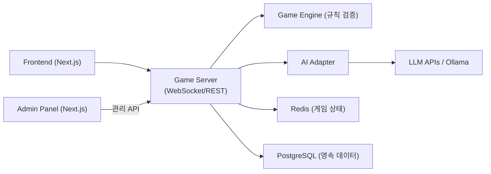

# CLAUDE.md

This file provides guidance to Claude Code (claude.ai/code) when working with code in this repository.

## Project Overview

RummiArena는 루미큐브(Rummikub) 보드게임 기반 멀티 LLM 전략 실험 플랫폼이다.
Human + AI 혼합 2~4인 실시간 대전을 지원하며, 다양한 LLM 모델(OpenAI, Claude, DeepSeek, Ollama/LLaMA)의 게임 전략을 비교·분석한다.

## Architecture



- **Game Engine**: 게임 규칙 검증 전담. LLM은 행동을 "제안"만 하고 Engine이 유효성 검증
- **AI Adapter**: 모델 무관 공통 인터페이스. 모든 LLM은 동일한 MoveRequest/MoveResponse로 통신
- **Stateless Server**: 게임 상태는 Redis, 영속 데이터는 PostgreSQL. Pod 재시작에도 게임 유지

## Repository Structure

```
docs/
  01-planning/     # 기획 (헌장, 요구사항, 리스크, 도구체인, WBS)
  02-design/       # 설계 (아키텍처, DB, API, AI Adapter, 세션 관리)
  03-development/  # 개발 가이드 (셋업 매뉴얼)
  04-testing/      # 테스트 전략 + 보고서
  05-deployment/   # 배포 가이드 + K8s 아키텍처
  06-operations/   # 운영 가이드 (추후)
src/
  frontend/        # Next.js 프론트엔드
  game-server/     # Backend API + Game Engine
  ai-adapter/      # AI Adapter 서비스
  admin/           # 관리자 대시보드
helm/              # Helm charts (5개 서비스: postgres, redis, game-server, ai-adapter, frontend)
scripts/           # 통합 테스트 등 자동화 스크립트
argocd/            # ArgoCD application manifests
work_logs/         # 세션/데일리/스크럼/바이브/회고/결정 로그
.github/           # GitHub Issues templates, workflows
```

## Tech Stack

- **Frontend**: Next.js, TailwindCSS, Framer Motion, dnd-kit
- **Backend (game-server)**: Go (gin + gorilla/websocket + GORM)
- **Backend (ai-adapter)**: NestJS (TypeScript)
- **DB**: PostgreSQL 16, Redis 7
- **AI**: OpenAI API, Claude API, DeepSeek API, Ollama (LLaMA)
- **Infra**: Docker Desktop Kubernetes, Helm 3, ArgoCD
- **CI**: GitLab CI + GitLab Runner
- **Quality**: SonarQube, Trivy
- **Mesh**: Istio Service Mesh (Phase 5)
- **Notification**: 카카오톡 API
- **Auth**: Google OAuth 2.0

## Key Design Principles

1. **LLM 신뢰 금지**: LLM 응답은 항상 Game Engine으로 유효성 검증. Invalid move → 재요청 (max 3회) → 실패 시 강제 드로우
2. **AI Adapter 분리**: Game Engine은 특정 LLM에 의존하지 않음. 공통 인터페이스로 모델 교체 가능
3. **Stateless 서버**: 모든 게임 상태는 Redis에 저장. Pod 재시작 대응
4. **GitOps**: 소스 repo와 GitOps repo 분리. ArgoCD가 Helm chart 기반 배포 담당
5. **DevSecOps**: CI 파이프라인에 SonarQube + Trivy 보안 게이트

## Tile Encoding

타일 코드 규칙: `{Color}{Number}{Set}`
- Color: R(Red), B(Blue), Y(Yellow), K(Black)
- Number: 1~13
- Set: a/b (동일 타일 구분)
- 조커: JK1, JK2
- 예: `R7a` = 빨강 7 세트a, `B13b` = 파랑 13 세트b

## AI Character System

AI 플레이어는 난이도(하수/중수/고수)와 캐릭터(Rookie, Calculator, Shark, Fox, Wall, Wildcard)를 조합하여 다양한 전략 스타일을 시뮬레이션한다. 심리전 레벨(0~3)도 설정 가능.

## User

- 사용자 이름: **애벌레**
- 스크럼 로그, 액션 아이템 등에서 이 이름을 사용할 것

## Document Naming Convention

문서 파일명은 `{번호}-{이름}.md` 형식 (예: `01-project-charter.md`)

## Diagram Convention

- 문서 내 도식은 **Mermaid를 우선** 사용한다. ASCII art, 텍스트 박스 다이어그램은 지양한다.
- 적합한 Mermaid 유형 선택 기준:
  | 상황 | Mermaid 유형 |
  |------|-------------|
  | 순차적 흐름 | `flowchart LR` |
  | 계층적 흐름 | `flowchart TB` |
  | 시스템 간 통신 | `sequenceDiagram` |
  | 상태 변화 | `stateDiagram-v2` |
  | DB 관계 | `erDiagram` |
  | 클래스/컴포넌트 | `classDiagram` |
  | 일정 | `gantt` |
- 노드에는 반드시 한글 설명 포함 (예: `A["Game Server"]` 대신 `A["Game Server\n(게임 서버)"]`)
- 노드 20개 이상이면 다이어그램을 분리한다.
- 상세 표준은 `.claude/skills/mermaid-diagrams/SKILL.md` 참조
