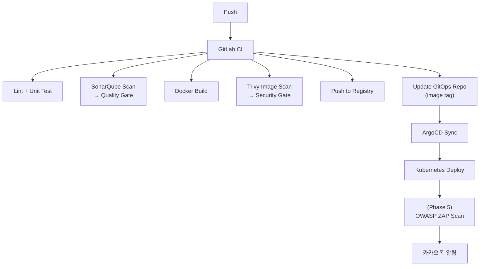

# PLAN.md

RummiArena 프로젝트 전체 실행 계획서.
ALM/Agile/DevSecOps 기반 풀 사이클 개발.

---

## 프로젝트 한 줄 요약

> 루미큐브 보드게임 기반 **멀티 LLM 전략 실험 플랫폼**을 Kubernetes + GitOps로 구축한다.

---

## Phase 총괄

| Phase | 이름 | Sprint | 핵심 산출물 | 상태 |
|-------|------|--------|-------------|------|
| 1 | 기획 & 환경 구축 | Sprint 0 | 기획/설계 문서, K8s/ArgoCD/Traefik 환경 | **완료** |
| 2 | 핵심 게임 개발 (MVP) | Sprint 1~3 | Game Engine (Go), Backend API, Frontend 기본 | **진행 중** |
| 3 | AI 연동 & 멀티플레이 | Sprint 4~5 | AI Adapter (NestJS), 실시간 대전, 1인 연습 모드 | 미착수 |
| 4 | 플랫폼 기능 확장 | Sprint 6 | 관리자 대시보드, 카카오톡 알림, ELO, 게임 복기 | 미착수 |
| 5 | DevSecOps 고도화 | Sprint 7~9 | Observability, 보안 고도화, Istio Service Mesh | 미착수 |
| 6 | 운영 & 실험 | (Phase 6) | AI 토너먼트, 모델 비교 분석, OpenShift 검토 | 미착수 |

---

## Phase 1: 기획 & 환경 구축 (Sprint 0)

### 기획 문서 (docs/01-planning/)
- [x] 01-project-charter.md — 프로젝트 헌장
- [x] 02-requirements.md — 요구사항 정의서
- [x] 03-risk-management.md — 리스크 관리 계획
- [x] 04-tool-chain.md — 도구 체인 및 환경 구성
- [x] 05-wbs.md — WBS

### 설계 문서 (docs/02-design/)
- [x] 01-architecture.md — 시스템 아키텍처
- [x] 02-database-design.md — DB 설계
- [x] 03-api-design.md — API 설계
- [x] 04-ai-adapter-design.md — AI Adapter 설계 (캐릭터/심리전 포함)
- [x] 05-game-session-design.md — 게임 세션 관리
- [x] 06-game-rules.md — 게임 규칙 설계
- [x] 07-ui-wireframe.md — UI 와이어프레임
- [x] 08-ai-prompt-templates.md — AI 프롬프트 템플릿
- [x] 09-game-engine-detail.md — 게임 엔진 상세 설계
- [x] 10-websocket-protocol.md — WebSocket 프로토콜 + Redis 직렬화 설계

### 개발/배포/테스트 문서
- [x] docs/03-development/01-dev-setup.md — 개발 환경 셋업 매뉴얼
- [x] docs/03-development/02-secret-management.md — 시크릿 관리 정책
- [x] docs/03-development/03-game-server-scaffolding.md — game-server 스캐폴딩
- [x] docs/04-testing/01-test-strategy.md — 테스트 전략
- [x] docs/04-testing/02-smoke-test-report.md — 스모크 테스트 보고서 (16/16)
- [x] docs/04-testing/03-engine-test-matrix.md — 엔진 테스트 매트릭스 (155개)
- [x] docs/04-testing/05-integration-test-plan-v2.md — 통합 테스트 계획서
- [x] docs/04-testing/06-integration-test-report.md — 통합 테스트 보고서 (31/31)
- [x] docs/05-deployment/01-local-infra-guide.md — 로컬 인프라 구성 가이드
- [x] docs/05-deployment/03-infra-setup-checklist.md — 인프라 셋업 체크리스트
- [x] docs/05-deployment/04-k8s-architecture.md — K8s 아키텍처

### 인프라 환경 구축
- [x] PostgreSQL 컨테이너 기동 (docker-compose → K8s)
- [x] .wslconfig 최적화 및 적용 확인 (10GB/swap4GB/6코어)
- [x] Docker Desktop Kubernetes 활성화 및 확인
- [x] Traefik Ingress 설치 (Helm)
- [x] ArgoCD 설치 (Helm)
- [ ] GitLab Runner 등록 (Docker Executor) — Sprint 2 이월
- [ ] SonarQube 설치 (Docker 또는 K8s) — Sprint 2 이월
- [ ] GitHub Projects 보드 구성 (Kanban + Sprint)
- [x] GitOps 레포 초기 구조 설정
- [x] Helm Umbrella Chart 초기 골격 + 5개 서비스 Helm chart 완성
- [x] K8s rummikub namespace에 5개 서비스 배포 (postgres/redis/game-server/ai-adapter/frontend)
- [x] ResourceQuota 설정 (4Gi memory, 4 CPU, 20 pods)

### 사전 준비 (외부 서비스)
- [x] Google Cloud Console — OAuth 2.0 클라이언트 ID 발급
- [ ] 카카오 디벨로퍼스 — 앱 등록 + 메시지 API 키 발급
- [ ] OpenAI API Key 준비
- [ ] Anthropic (Claude) API Key 준비
- [ ] DeepSeek API Key 준비
- [ ] GitLab 계정 + Container Registry 확인

---

## Phase 2: 핵심 게임 개발 — MVP (Sprint 1~3)

### Sprint 1: 게임 엔진 + 백엔드 API (03-13 ~ 03-28, 28SP)
- [x] 백엔드 언어 최종 결정 → **Go (game-server) + NestJS (ai-adapter)** 확정
- [x] 타일 데이터 모델 + 풀 생성/셔플
- [x] 그룹/런 유효성 검증
- [x] 조커 처리
- [x] 최초 등록 (30점) 검증
- [x] 턴 관리 + 승리 판정
- [x] 단위 테스트 (TDD) — 69개 테스트, 96.5% 커버리지
- [x] REST API (Room CRUD 7개 + Game 5개 = 12개 엔드포인트)
- [ ] WebSocket 서버 (Hub/Connection 실구현) — **P0 다음 작업**
- [x] Google OAuth 연동 (NextAuth.js)
- [x] Redis 연동 (게임 상태, 어댑터 패턴)
- [x] PostgreSQL 연동 (10개 테이블, GORM AutoMigrate)
- [x] /health, /ready 엔드포인트
- [x] 구조화 JSON 로그 (zap)
- [x] Dockerfile (4개 멀티스테이지) + Helm Chart (5개 서비스)
- [x] 통합 테스트 31/31 PASS

### Sprint 2: 프론트엔드 + AI 연동
- [x] Next.js 프로젝트 초기화
- [x] 로그인 페이지 (Google OAuth)
- [x] 로비 화면 (Room 목록/생성, Zustand, Framer Motion)
- [ ] 게임 보드 레이아웃 (타일 렌더링 고도화)
- [ ] 타일 랙 + 드래그&드롭 (dnd-kit) 인터랙션
- [ ] WebSocket 연결/동기화 (클라이언트)
- [x] AI Adapter /move 엔드포인트 (4개 어댑터, 재시도 3회, fallback DRAW)
- [ ] Ollama 로컬 연동 테스트
- [ ] GitLab CI + Runner 등록
- [ ] SonarQube 설치

### MVP 완료 기준
- [ ] 로컬 K8s에서 Human 2명이 WebSocket으로 게임 가능
- [x] 게임 규칙 정상 동작 (그룹/런/조커/30점) — engine 테스트 69/69
- [ ] CI 파이프라인에서 빌드 + 테스트 통과

---

## Phase 3: AI 연동 & 멀티플레이 (Sprint 4~5)

### Sprint 4: AI Adapter
- [ ] LangChain/LangGraph PoC 비교 → 방식 결정
- [ ] AI Adapter 공통 인터페이스
- [ ] OpenAI Adapter 구현
- [ ] Claude Adapter 구현
- [ ] DeepSeek Adapter 구현
- [ ] Ollama Adapter 구현
- [ ] 프롬프트 설계 (전략별/캐릭터별/심리전 레벨별)
- [ ] 재시도 + Fallback 로직
- [ ] AI 호출 로그/메트릭 수집
- [ ] Dockerfile + Helm Chart

### Sprint 5: 멀티플레이 완성 + 연습 모드
- [ ] Room 기반 세션 관리 (생명주기 전체)
- [ ] Human + AI 혼합 매칭
- [ ] 턴 오케스트레이터 (Human ↔ AI 턴 전환)
- [ ] 테이블 재배치 동기화
- [ ] 연결 끊김/재연결 처리
- [ ] 1인 연습 모드 (Stage 1~6)
- [ ] 통합 테스트 (2~4인 Human+AI 게임)

### AI 연동 완료 기준
- [ ] Human 1 + AI 3 (서로 다른 모델) 게임 정상 동작
- [ ] AI 캐릭터 (하수/중수/고수) 차이 확인
- [ ] 1인 연습 Stage 1~5 동작

---

## Phase 4: 플랫폼 기능 확장 (Sprint 6)

- [ ] 관리자 대시보드 (활성 Room, 유저 관리, 강제 종료)
- [ ] AI 모델별 통계 (승률, 평균 응답시간, 토큰)
- [ ] 카카오톡 알림 연동 (빌드/배포/게임 결과)
- [ ] ELO 랭킹 시스템
- [ ] 게임 복기 (4분할 뷰, game_snapshots 기반 턴별 리플레이)

---

## Phase 5: DevSecOps 고도화 (Sprint 7)

### 보안 & 품질
- [ ] SonarQube CI 파이프라인 연동 (Quality Gate)
- [ ] Trivy 이미지 스캔 자동화
- [ ] OWASP ZAP 동적 보안 테스트 (선택)
- [ ] Sealed Secrets 도입

### Observability
- [ ] Prometheus + Grafana 설치 (Helm)
- [ ] 커스텀 대시보드 (AI 메트릭, 게임 통계)

### Istio Service Mesh
- [ ] Istio 설치 (istioctl or Helm)
- [ ] Kiali + Jaeger 설치
- [ ] AI Adapter 가중치 라우팅 (VirtualService)
- [ ] Circuit Breaker (DestinationRule)
- [ ] mTLS (PeerAuthentication)

### 부하 테스트
- [ ] k6 스크립트 작성
- [ ] WebSocket 부하 테스트
- [ ] AI Adapter 부하 테스트

---

## Phase 6: 운영 & 실험 (Sprint 8+)

- [ ] AI vs AI 토너먼트 실행
- [ ] 모델별 전략 비교 분석 리포트
- [ ] 캐릭터 × 모델 조합별 승률 통계
- [ ] 심리전 효과 검증 (유무 비교)
- [ ] 프롬프트 최적화 실험
- [ ] 운영 가이드 문서 작성
- [ ] OpenShift 이관 검토

---

## Agile 운영 방식

| 항목 | 방식 |
|------|------|
| 스프린트 주기 | 1~2주 |
| 백로그 관리 | GitHub Projects (Kanban 보드) |
| 이슈 추적 | GitHub Issues (Feature/Bug 템플릿) |
| 브랜치 전략 | GitFlow (main / develop / feature / hotfix) |
| 코드 리뷰 | PR 기반 (SonarQube 자동 분석) |
| 회고 | Sprint 종료 시 RETROSPECTIVE.md 기록 |

---

## CI/CD 파이프라인 흐름



---

## 핵심 미결정 사항 (Decision Log)

| ID | 항목 | 선택지 | 결정 시점 | 상태 |
|----|------|--------|-----------|------|
| D-01 | 백엔드 언어 | ~~NestJS vs Go~~ → **Go (game-server) + NestJS (ai-adapter)** | Sprint 0 (2026-03-11) | **확정** |
| D-02 | AI 호출 방식 | 직접 API vs LangChain/LangGraph | Sprint 4 PoC | 미결정 |
| D-03 | SonarQube 배포 위치 | K8s Pod vs Docker Compose vs Oracle VM | Sprint 0 | 미결정 |
| D-04 | Ollama 배포 위치 | K8s Pod vs Docker Compose vs Oracle VM | Sprint 4 | 미결정 |
| D-05 | GitLab Runner Executor | Docker vs Kubernetes | Sprint 0 | Docker (초기) |
| D-06 | 카카오톡 API 방식 | 나에게 보내기 vs 카카오워크 봇 | Sprint 6 | 미결정 |

---

## 문서 체계

```
docs/
├── 01-planning/      ← 기획 (Phase 1, 완료)
├── 02-design/        ← 설계 (Phase 1, 진행 중)
├── 03-development/   ← 개발 가이드 (Phase 2 시작 시 작성)
├── 04-testing/       ← 테스트 전략 (Phase 2 시작 시 작성)
├── 05-deployment/    ← 배포 가이드 (Phase 2 완료 시 작성)
└── 06-operations/    ← 운영 가이드 (Phase 6 시 작성)
```

각 문서는 `{번호}-{이름}.md` 형식으로 명명한다.

---

## 현재 진행 상황

**Phase 2 진행 중 (Sprint 1)** — Sprint 0 완료, Sprint 1 Day 1 성과 우수

Sprint 0 완료 (Phase 1):
- 기획 7문서, 설계 10문서, 개발 3문서, 테스트 6문서, 배포 4문서
- K8s/Traefik/ArgoCD 인프라 구축 완료
- 4개 프로젝트 스캐폴딩 + 빌드 통과
- QA 스모크 테스트 16/16 PASS

Sprint 1 Day 1 (2026-03-13):
- game-server 12개 REST API 완전 구현 (Handler→Service→Repository)
- Game Engine 69개 단위 테스트 (96.5% 커버리지)
- AI Adapter /move 엔드포인트 + 4개 어댑터 + fallback DRAW
- K8s 5개 서비스 Helm chart 작성 + 배포
- **통합 테스트 31/31 (100%) 전원 PASS**
- 커밋 6건, 107파일, +17,263줄

다음 단계: WebSocket Hub 실구현 → Frontend 연동 → ConfirmTurn/PlaceTiles 시나리오 보강
