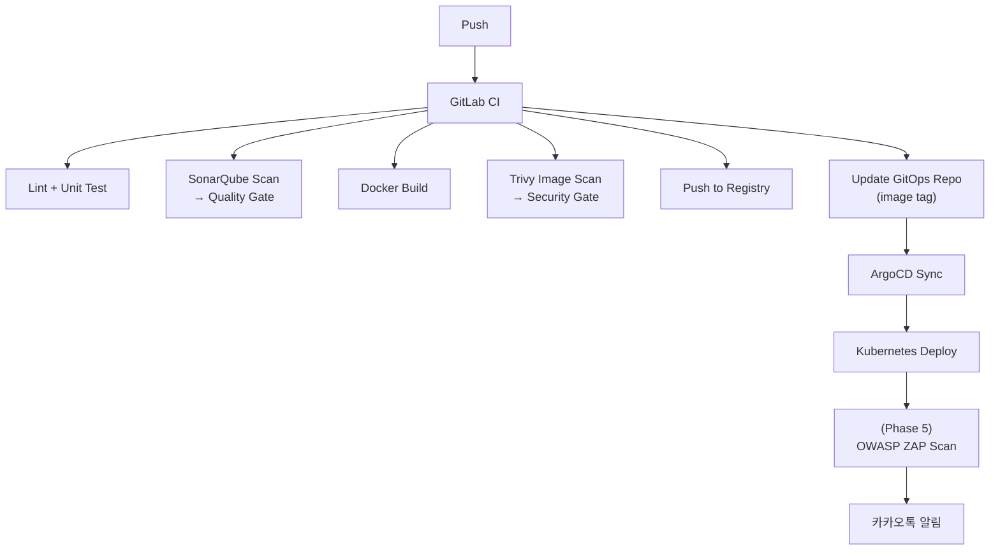

# PLAN.md

RummiArena 프로젝트 전체 실행 계획서.
ALM/Agile/DevSecOps 기반 풀 사이클 개발.

---

## 프로젝트 한 줄 요약

> 루미큐브 보드게임 기반 **멀티 LLM 전략 실험 플랫폼**을 Kubernetes + GitOps로 구축한다.

---

## Phase 총괄

| Phase | 이름 | Sprint | 핵심 산출물 | 상태 |
|-------|------|--------|-------------|------|
| 1 | 기획 & 환경 구축 | Sprint 0 | 기획/설계 문서, K8s/ArgoCD/Traefik 환경 | **완료** |
| 2 | 핵심 게임 개발 (MVP) | Sprint 1~3 | Game Engine (Go), Backend API, Frontend 기본 | **완료** (2026-03-23) |
| 3 | AI 연동 & 멀티플레이 | Sprint 4~5 | AI Adapter (NestJS), 실시간 대전, 1인 연습 모드 | **Sprint 5 완료** (2026-04-12 마감, 진행률 100%) |
| 4 | 플랫폼 기능 확장 | Sprint 6 | 관리자 대시보드, 카카오톡 알림, ELO, 게임 복기 | 일부 선행 완료 (ELO, 관리자) |
| 5 | DevSecOps 고도화 | Sprint 7~9 | Observability, 보안 고도화, Istio Service Mesh | **Sprint 5에서 선행 착수** (SEC-RL-003, SEC-ADD-001/002, Istio 설계) |
| 6 | 운영 & 실험 | (Phase 6) | AI 토너먼트, 모델 비교 분석, OpenShift 검토 | **일부 선행** (Round 4 토너먼트, v2 크로스모델 실험) |

---

## Phase 1: 기획 & 환경 구축 (Sprint 0)

### 기획 문서 (docs/01-planning/)
- [x] 01-project-charter.md — 프로젝트 헌장
- [x] 02-requirements.md — 요구사항 정의서
- [x] 03-risk-management.md — 리스크 관리 계획
- [x] 04-tool-chain.md — 도구 체인 및 환경 구성
- [x] 05-wbs.md — WBS

### 설계 문서 (docs/02-design/)
- [x] 01-architecture.md — 시스템 아키텍처
- [x] 02-database-design.md — DB 설계
- [x] 03-api-design.md — API 설계
- [x] 04-ai-adapter-design.md — AI Adapter 설계 (캐릭터/심리전 포함)
- [x] 05-game-session-design.md — 게임 세션 관리
- [x] 06-game-rules.md — 게임 규칙 설계
- [x] 07-ui-wireframe.md — UI 와이어프레임
- [x] 08-ai-prompt-templates.md — AI 프롬프트 템플릿
- [x] 09-game-engine-detail.md — 게임 엔진 상세 설계
- [x] 10-websocket-protocol.md — WebSocket 프로토콜 + Redis 직렬화 설계

### 개발/배포/테스트 문서
- [x] docs/03-development/01-dev-setup.md — 개발 환경 셋업 매뉴얼
- [x] docs/03-development/02-secret-management.md — 시크릿 관리 정책
- [x] docs/03-development/03-game-server-scaffolding.md — game-server 스캐폴딩
- [x] docs/03-development/04-ai-adapter-guide.md — AI Adapter 개발 가이드
- [x] docs/03-development/05-frontend-guide.md — Frontend 개발 가이드
- [x] docs/03-development/06-coding-conventions.md — 코딩 컨벤션
- [x] docs/03-development/07-git-workflow.md — Git 워크플로우
- [x] docs/04-testing/01-test-strategy.md — 테스트 전략
- [x] docs/04-testing/02-smoke-test-report.md — 스모크 테스트 보고서 (16/16)
- [x] docs/04-testing/03-engine-test-matrix.md — 엔진 테스트 매트릭스 (155개)
- [x] docs/04-testing/05-integration-test-plan-v2.md — 통합 테스트 계획서
- [x] docs/04-testing/06-integration-test-report.md — 통합 테스트 보고서 (31/31)
- [x] docs/05-deployment/01-local-infra-guide.md — 로컬 인프라 구성 가이드
- [x] docs/05-deployment/03-infra-setup-checklist.md — 인프라 셋업 체크리스트
- [x] docs/05-deployment/04-k8s-architecture.md — K8s 아키텍처

### 인프라 환경 구축
- [x] PostgreSQL 컨테이너 기동 (docker-compose → K8s)
- [x] .wslconfig 최적화 및 적용 확인 (10GB/swap4GB/6코어)
- [x] Docker Desktop Kubernetes 활성화 및 확인
- [x] Traefik Ingress 설치 (Helm)
- [x] ArgoCD 설치 (Helm)
- [x] SonarQube 설치 (Docker Compose, http://localhost:9001) — 2026-03-15 완료
- [x] GitLab Runner 등록 (K8s Executor) — Runner ID 52262488, gitlab-runner NS, online (2026-03-16)
- [x] GitLab CI Variables 등록 (SONAR_TOKEN, GITOPS_TOKEN) — 2026-03-15 완료
- [ ] GitHub Projects 보드 구성 (Kanban + Sprint)
- [x] GitOps 레포 초기 구조 설정
- [x] Helm Umbrella Chart 초기 골격 + 5개 서비스 Helm chart 완성
- [x] K8s rummikub namespace에 5개 서비스 배포 (postgres/redis/game-server/ai-adapter/frontend)
- [x] ResourceQuota 설정 (4Gi memory, 4 CPU, 20 pods)

### 사전 준비 (외부 서비스)
- [x] Google Cloud Console — OAuth 2.0 클라이언트 ID 발급
- [ ] 카카오 디벨로퍼스 — 앱 등록 + 메시지 API 키 발급
- [x] OpenAI API Key 준비 — [REDACTED-OPENAI-KEY] (2026-03-23)
- [x] Anthropic (Claude) API Key 준비 — [REDACTED-ANTHROPIC-KEY] (2026-03-23)
- [x] DeepSeek API Key 준비 — [REDACTED-DEEPSEEK-KEY] (2026-03-23)
- [x] GitLab 계정 + Container Registry 확인 (k82022603, 2026-03-15)

---

## Phase 2: 핵심 게임 개발 — MVP (Sprint 1~3)

### Sprint 1: 게임 엔진 + 백엔드 API (03-13 ~ 03-28, 28SP)
- [x] 백엔드 언어 최종 결정 → **Go (game-server) + NestJS (ai-adapter)** 확정
- [x] 타일 데이터 모델 + 풀 생성/셔플
- [x] 그룹/런 유효성 검증
- [x] 조커 처리
- [x] 최초 등록 (30점) 검증
- [x] 턴 관리 + 승리 판정
- [x] 단위 테스트 (TDD) — 69개 테스트, 96.5% 커버리지
- [x] REST API (Room CRUD 7개 + Game 5개 = 12개 엔드포인트)
- [x] WebSocket 서버 (Hub/Connection 실구현) — 완료 (2026-03-14)
- [x] Google OAuth 연동 (NextAuth.js)
- [x] Redis 연동 (게임 상태, 어댑터 패턴)
- [x] PostgreSQL 연동 (10개 테이블, GORM AutoMigrate)
- [x] /health, /ready 엔드포인트
- [x] 구조화 JSON 로그 (zap)
- [x] Dockerfile (4개 멀티스테이지) + Helm Chart (5개 서비스)
- [x] 통합 테스트 31/31 PASS

### Sprint 2: 프론트엔드 + AI 연동
- [x] Next.js 프로젝트 초기화
- [x] 로그인 페이지 (Google OAuth)
- [x] 로비 화면 (Room 목록/생성, Zustand, Framer Motion)
- [x] 게임 보드 레이아웃 (타일 렌더링 고도화) — DnD UX 고도화 완료 (2026-03-15)
- [x] 타일 랙 + 드래그&드롭 (dnd-kit) 인터랙션 — 점선 고스트 + overlay scale/shadow 완료 (2026-03-15)
- [x] WebSocket 연결/동기화 (클라이언트) — 프로토콜 연동 완료 (2026-03-14)
- [x] AI Adapter /move 엔드포인트 (4개 어댑터, 재시도 3회, fallback DRAW)
- [x] Ollama 로컬 연동 테스트 — qwen2.5:3b 실 API 검증 PASS (2026-03-31)
- [x] SonarQube 설치 (http://localhost:9001 UP, 2026-03-15)
- [x] GitLab 프로젝트 생성 + glab 인증 (2026-03-15)
- [x] GitLab CI Variables 등록 (SONAR_TOKEN, GITOPS_TOKEN) — 2026-03-15
- [x] GitLab Runner 등록 (K8s Executor, runner-id 52262488) — 2026-03-16
- [x] dev-login 엔드포인트 (APP_ENV=dev, 게스트 JWT 발급) — 2026-03-15
- [x] ai-adapter 테스트 110개 GREEN (adapter 100% coverage) — 2026-03-15
- [x] SonarQube Quality Gate RummiArena-Dev 연결 (new_coverage ≥ 30%) — 2026-03-21
- [x] SonarQube coverage.out 경로 패치 (sed 순서 수정) — 2026-03-21
- [x] Practice Progress API (Go) — POST/GET /api/practice/progress — 2026-03-21

### MVP 완료 기준
- [x] 로컬 K8s에서 Human 2명이 WebSocket으로 게임 가능 — ws_multiplayer_test.go 7개 테스트 PASS (2026-03-21)
- [x] 게임 규칙 정상 동작 (그룹/런/조커/30점) — engine 테스트 69/69
- [x] CI 파이프라인에서 빌드 + 테스트 통과 — GitLab CI 13개 job ALL GREEN (2026-03-21)

---

## Phase 3: AI 연동 & 멀티플레이 (Sprint 4~5)

### Sprint 4: AI Adapter
- [ ] LangChain/LangGraph PoC 비교 → 방식 결정
- [x] AI Adapter 공통 인터페이스 — AIClientInterface (game-server), AI Move API 계약서 (2026-03-21)
- [x] OpenAI Adapter 구현 — OpenAiAdapter, gpt-5-mini (추론 모델), 17/17 PASS (2026-03-23, 모델 변경 2026-03-31)
- [x] Claude Adapter 구현 — ClaudeAdapter 완료 (Sprint 1)
- [x] DeepSeek Adapter 구현 — DeepSeekAdapter 완료 (Sprint 1)
- [x] Ollama Adapter 구현 — OllamaAdapter + qwen2.5:3b K8s Pod 영속 (gemma3:1b→qwen2.5:3b 변경 2026-03-31)
- [x] 프롬프트 설계 (전략별/캐릭터별/심리전 레벨별) — persona.templates.ts 6캐릭터 × 3난이도 × 4레벨 (2026-03-21)
- [x] 재시도 + Fallback 로직 — 최대 3회 재시도, fallback DRAW (Sprint 1)
- [x] AI 호출 로그/메트릭 수집 — CostTrackingService + MetricsService + API 5개 (2026-03-30)
- [x] Dockerfile + Helm Chart — ai-adapter, secretRef 추가 (2026-03-23)
- [x] ISS-002 FIXED: AI userID `ai-` 접두사 제거 → PostgreSQL UUID 타입 정상 (2026-03-23)
- [x] admin API 실 구현 — 7개 엔드포인트, admin_handler/service/repository (2026-03-23)
- [x] ISSUE-004 FIXED: WS GAME_OVER 절단 — WriteTimeout=0, WriteBuffer=8K, data race (2026-03-23)
- [x] Playwright E2E 테스트 추가 — practice.spec.ts 12개 시나리오 (2026-03-23)
- [x] Playwright E2E 44/44 PASS 달성 — BUG-P-004 수정 + practice.spec.ts helpers.ts 통일 (2026-03-29)
- [x] Google OAuth K8s 구조적 복구 — inject-secrets.sh .env.local 자동 참조 + ArgoCD ignoreDifferences (2026-03-29)
- [x] BUG-G-001 FIXED — GameClient 그룹 병합 3단계 분기 (forceNewGroup + useMemo) (2026-03-29)
- [x] 빌드 경고 0개 — Tile.tsx aria 수정, StageSelector data-disabled (2026-03-29)
- [x] WS 멀티플레이 기본 룰 통합 테스트 16/16 PASS — ws-multiplayer-game-test.go (2026-03-29)

### Sprint 5: 멀티플레이 완성 + 연습 모드
- [x] Room 기반 세션 관리 (생명주기 전체) — FinishRoom + ListRooms 필터 + 재접속 감지 (2026-03-21)
- [x] Human + AI 혼합 매칭 — BUG-S4-001 수정 후 E2E 5/5 PASS (2026-03-23)
- [x] 턴 오케스트레이터 (Human ↔ AI 턴 전환) — AI Turn Orchestrator goroutine + forceAIDraw 폴백 (2026-03-21)
- [x] **테이블 재배치 동기화** — V-13 재배치 4유형 UI 완성 (§6.2 유형 1/2/3/4) — 2026-04-13 Sprint 6 Day 2 가속
- [x] 연결 끊김/재연결 처리 — PLAYER_RECONNECT Frontend 토스트 UI 구현 (2026-03-21)
- [x] 1인 연습 모드 Stage 1~3 — PracticeBoard + dnd-kit + joker-aware validation (2026-03-21)
- [x] 1인 연습 모드 Stage 4~6 — 조커 마스터/복합 배치/루미큐브 마스터 (2026-03-21)
- [x] 통합 테스트 (Human 2명 WebSocket 대전) — ws_multiplayer_test.go 7개 PASS (2026-03-21)

### Sprint 4 추가 완료 (2026-04-01)
- [x] Playwright E2E 153→338개 확장 (185 신규, 100% PASS) — 2026-04-01
- [x] E2E 안정화 (global-teardown, room-cleanup) — 기존 34건 실패 → 1건 — 2026-04-01
- [x] DeepSeek Reasoner 전용 영문 프롬프트 + 4단계 JSON 추출 — 2026-04-01
- [x] AI 대전 E2E 27개 작성 (25/27 PASS) — 2026-04-01
- [x] Sprint 4 종료 선언 — 2026-04-01

### Sprint 5 Day 1: CI/CD 파이프라인 (2026-04-01)
- [x] GitLab Runner K8s 등록 (Runner ID 52511778, cicd NS) — 2026-04-01
- [x] SonarQube 서버 배포 (9.9.8 LTS, SONAR_TOKEN 생성) — 2026-04-01
- [x] CI Variables 3개 설정 (SONAR_HOST_URL, SONAR_TOKEN, GITOPS_TOKEN) — 2026-04-01
- [x] .gitlab-ci.yml 11건 수정 — 2026-04-01
- [x] CI lint 4/4 PASS + test 2/2 PASS — 2026-04-01
- [x] CI quality 2/2 PASS — SonarQube Xms=Xmx=256m 93초, Trivy 42초 (2026-04-02)
- [x] CI build 4/4 PASS — DinD→Kaniko 전환 + Phase 직렬화 + timeout 45m (2026-04-03)
- [x] CI scan 4/4 PASS — Trivy 이미지 스캔 각 ~20s (2026-04-03)
- [x] CI update-gitops 1/1 PASS — GitOps repo 자동 업데이트 (2026-04-03)
- [x] **Pipeline #96: 17/17 ALL GREEN** — lint 4 + test 2 + quality 2 + build 4 + scan 4 + gitops 1 (2026-04-03)

### Sprint 5 Day 2: 게임 버그 수정 + CI 관통 (2026-04-02)
- [x] 게임 버그 24건 수정 (Critical 7 + Major 7 + Minor 10) — 2026-04-02
- [x] Go 테스트 346→355개 (+9 신규) — 2026-04-02
- [x] DnD E2E 24건 작성 (game-dnd-manipulation.spec.ts) — 2026-04-02
- [x] CI 8/13 관통 (lint+test+quality) — 2026-04-02

### Sprint 5 Day 3: 품질 게이트 완성 (2026-04-03)
- [x] CI/CD **17/17 완주** (Pipeline #96 ALL GREEN) — 2026-04-03
- [x] ArgoCD SyncWave Helm 24개 템플릿 — 2026-04-03
- [x] DnD E2E **24/24 PASS** — 2026-04-03
- [x] Conservation 테스트 +24 (Go 379→611 PASS) — 2026-04-03
- [x] K8s 4서비스 배포 (빌드+롤아웃+헬스 OK, 191Mi) — 2026-04-03
- [x] DeepSeek Round 3: 5%→**12.5%** (+2.5배), C등급 — 2026-04-03
- [x] 플레이테스트 S1 11/13 PASS, **S3 INVALID_MOVE 17/17 PASS** — 2026-04-03
- [x] E2E 34건 실패 해결 → **362/362 전량 PASS** — 2026-04-03
- [x] turnNumber 0-based→1-based 수정 — 2026-04-03
- [x] CI/CD 문서 6개 업데이트 (배포 가이드 v2.0~v3.0) — 2026-04-03
- [x] E2E 전량 PASS 보고서 (docs/04-testing/30) — 2026-04-03

### Sprint 5 Day 4: P1 병렬 처리 + 기능 확장 (2026-04-04)
- [x] **Rate Limit 구현** — 설계(690줄) + Go middleware(15 tests) + NestJS guard + Frontend 429 Toast(6 E2E) — 2026-04-04
- [x] **P0 SEC-RL-002 LLM 비용 공격 차단** — AI 게임 5분 쿨다운 + 시간당 $5 비용 한도 (2중 방어) — 2026-04-04
- [x] **DeepSeek 프롬프트 최적화** — few-shot 5개 + 자기 검증 7항목, 324→395 tests — 2026-04-04
- [x] **Trivy HIGH severity 확대** — 2-pass + .map 검출 + --ignore-unfixed — 2026-04-04
- [x] **플레이테스트 S2/S4/S5 스크립트** — S2(618줄)/S4(1031줄)/S5(691줄) 완성 — 2026-04-04
- [x] **AI 캐릭터 비주얼 스펙** — Designer, 1,238줄, 6종 전체 (P2 선행) — 2026-04-04
- [x] **보안 감사** — P0~P3 13건 식별, P0+P1+P2 해결 5건, sourceMap 제거 — 2026-04-04
- [x] 프로젝트 분석: Claude Code Insights 리포트 (48세션/110커밋/96시간) — 2026-04-04
- [x] 프로젝트 분석: 개발 방법론 종합 평가 (1인+10에이전트 실험) — 2026-04-04
- [x] /buddy 스크럼 미팅 (11명 전원) — FSM/결정적 생성 패턴 토론 — 2026-04-04

### Sprint 5 Day 5: 실전 검증 + CI/CD ALL GREEN (2026-04-05)
- [x] **K8s 재배포** — 이미지 4개 빌드, 7 Pod Running, ConfigMap 정리 (DAILY_COST_LIMIT 이중 키 해소) — 2026-04-05
- [x] **서비스 검증** — Go 624 tests + NestJS 395 tests = 1,019건 PASS, Rate Limit 429 + 쿨다운 실환경 확인 — 2026-04-05
- [x] **DeepSeek Round 4** — 12.5%→**23.1%** Place Rate (A등급), max_tokens 8192→16384 버그 수정, $0.013/game — 2026-04-05
- [x] **플레이테스트 S2/S4/S5** — 39/44 (88.6%), 서버 버그 2건 발견 (BUG-WS-001, BUG-AI-001), $1.18 — 2026-04-05
- [x] **SEC-RL-003 설계** — 17-ws-rate-limit-design.md (837줄, Mermaid 6개, ADR-017) — 2026-04-05
- [x] **모델별 프롬프트 정책** — 18-model-prompt-policy.md (8섹션, Mermaid 10개) — 2026-04-05
- [x] **CI/CD Pipeline #113: 17/17 ALL GREEN** — lint 수정 3건 + go mod download + 소스맵 범위 한정 — 2026-04-05

### AI 연동 완료 기준
- [ ] Human 1 + AI 3 (서로 다른 모델) 게임 정상 동작 — Sprint 5 이월
- [x] AI 캐릭터 (하수/중수/고수) 차이 확인 — CharacterService + DIFFICULTY_TEMPERATURE 구현 (2026-03-21)
- [x] 1인 연습 Stage 1~3 동작 — 구현 완료 (2026-03-21)
- [x] 1인 연습 Stage 4~6 동작 — 구현 완료 (2026-03-21)

---

## Phase 4: 플랫폼 기능 확장 (Sprint 6)

- [x] 관리자 대시보드 초기 구현 (Next.js, recharts, mock 데이터) — 실제 API 연동 미완 (2026-03-21)
- [x] 관리자 대시보드 실 API 연동 — fetchHealth/fetchRooms + ServerStatus 배지 + Bearer 토큰 (2026-03-21)
- [x] 관리자 인증 — getAdminToken() 3단계 fallback (env → sessionStorage → dev-login) (2026-03-21)
- [x] AI 모델별 통계 UI (승률, 평균 응답시간) — mock 데이터 기반, 실 데이터 연동 미완 (2026-03-21)
- [x] **AI 토너먼트 대시보드 와이어프레임** — 23번 문서 (894줄), Sprint 6 P1 (2026-04-07)
- [x] **AI 토너먼트 대시보드 컴포넌트 스펙** — 33번 문서 (1538줄, 13 컴포넌트, PR 5개 분할) (2026-04-12)
- [ ] **AI 토너먼트 대시보드 구현** — Sprint 6 P1, PR 1~5 (8 SP, 나머지 4 SP Sprint 7 이월 가능)
  - [x] PR 1: 기반 구조 + 옵션 B 엔드포인트 + TournamentPage 레이아웃 — 2026-04-13
  - [ ] PR 2: PlaceRateChart (recharts LineChart)
  - [ ] PR 3: CostEfficiencyScatter
  - [ ] PR 4: ModelCardGrid + Sparkline + GradeBadge
  - [ ] PR 5: RoundHistoryTable + 조립 + 반응형 + E2E
- [ ] 카카오톡 알림 연동 (빌드/배포/게임 결과) — Sprint 7+
- [ ] ELO 랭킹 시스템 — 설계 완료 (docs/01-planning/10-phase4-elo-design.md), Issues #25~#27 등록
- [ ] 게임 복기 (4분할 뷰, game_snapshots 기반 턴별 리플레이) — Sprint 7+

---

## Phase 5: DevSecOps 고도화 (Sprint 7)

### 보안 & 품질
- [x] SonarQube CI 파이프라인 연동 (Quality Gate) — 93초 PASS (2026-04-02)
- [x] Trivy 이미지 스캔 자동화 — fs-scan 18초 + image-scan 4개 각 ~20초 PASS (2026-04-03)
- [x] **Rate Limit 구현** — Redis middleware + NestJS throttler + Frontend 429 — 2026-04-04
- [x] **Trivy severity HIGH,CRITICAL** — 2-pass 전략 + .map 검출 — 2026-04-04
- [x] **P0 SEC-RL-002** — AI 게임 쿨다운 + 시간당 비용 한도 — 2026-04-04
- [x] **P2 SEC-SM-001** — ai-adapter sourceMap: false + admin/frontend Dockerfile .map delete — 2026-04-04/05
- [x] **SEC-RL-003 설계** — WS 서버측 메시지 빈도 제한 설계 완료 (구현 Sprint 5 W2) — 2026-04-05
- [x] **SEC-RL-003 구현** — WS Rate Limit Fixed Window 60msg/min + Close 4005 — 2026-04-06
- [x] **SEC-ADD-001 구현** — Google id_token JWKS RS256 서명 검증 (keyfunc/v3) — 2026-04-07
- [x] **SEC-ADD-002 구현** — 보안 응답 헤더 6종 (CSP, X-Frame-Options 등) — 2026-04-06
- [x] **Rate Limit 환경변수 외부화** — config.go RateLimitConfig + InitRateLimitPolicies (하드코딩 → ConfigMap) — 2026-04-08
- [x] **SEC-REV Medium 3건 사전 분석** — SEC-REV-002/008/009 영향도 + Sprint 6 수정 순서 — 2026-04-08
- [ ] OWASP ZAP 동적 보안 테스트 (선택)
- [ ] Sealed Secrets 도입

### Observability
- [ ] Prometheus + Grafana 설치 (Helm)
- [ ] 커스텀 대시보드 (AI 메트릭, 게임 통계)

### Istio Service Mesh
- [x] **Istio 선별 적용 설계** — ADR-020, game-server + ai-adapter만 sidecar, minimal profile — 2026-04-06
- [x] **Istio Sprint 6 사전 점검** — 27번 문서 (781줄, 4 Phase 로드맵, 게이트 기반) — 2026-04-08
- [x] **Istio 설치/롤백 스크립트** — istio-install.sh, namespace-label.sh, uninstall.sh — 2026-04-08
- [x] **Istio CRD 매니페스트** — PeerAuth 2개, DestinationRule, VirtualService — 2026-04-08
- [x] **Helm Istio values** — istio-values.yaml + deployment 조건부 annotations — 2026-04-08
- [x] **Istio 드라이런 P0×3 사전 발견** — I1/I2/I3 블로커 식별 — 2026-04-12
- [x] **Sprint 6 Day 1 선결 블로커** — I1/I2/I3 완료 — 2026-04-13
- [x] **Istio Phase 5.0** istiod minimal 설치 (30Mi 메모리, 설계 예측 180Mi 대비 17%) — 2026-04-13
- [x] **Istio Phase 5.1** sidecar injection + mTLS (game-server/ai-adapter 2/2, SPIFFE 양방향, mutual_tls 9회) — 2026-04-13
- [x] **Istio Phase 5.2 검증 초안** — DestinationRule + VirtualService + ollama Recreate strategy 적용 — 2026-04-13
- [ ] **Istio Phase 5.2 본격 적용** — 서킷 브레이커 실증 테스트 + 재시도 동작 검증 (Sprint 6 Day 3~4)
- [ ] **Istio Phase 5.3** 관측성 (조건부, istioctl PATH + proxy-check 스크립트)
- [ ] Kiali 관측성 (Sprint 7 예정)

### 부하 테스트
- [ ] k6 스크립트 작성
- [ ] WebSocket 부하 테스트
- [ ] AI Adapter 부하 테스트

---

## Phase 6: 운영 & 실험 (Sprint 8+)

- [x] AI vs AI 토너먼트 실행 — Round 2~4 완료, 4모델 비교 (GPT/Claude/DeepSeek/Ollama) — 2026-04-07
- [ ] 모델별 전략 비교 분석 리포트
- [ ] 캐릭터 × 모델 조합별 승률 통계
- [ ] 심리전 효과 검증 (유무 비교)
- [x] 프롬프트 최적화 실험 — v2 공통 프롬프트 채택, 4모델 비교 확정 — 2026-04-07
- [ ] 운영 가이드 문서 작성
- [ ] OpenShift 이관 검토

---

## Agile 운영 방식

| 항목 | 방식 |
|------|------|
| 스프린트 주기 | 1~2주 |
| 백로그 관리 | GitHub Projects (Kanban 보드) |
| 이슈 추적 | GitHub Issues (Feature/Bug 템플릿) |
| 브랜치 전략 | GitFlow (main / develop / feature / hotfix) |
| 코드 리뷰 | PR 기반 (SonarQube 자동 분석) |
| 회고 | Sprint 종료 시 RETROSPECTIVE.md 기록 |

---

## CI/CD 파이프라인 흐름



---

## 핵심 미결정 사항 (Decision Log)

| ID | 항목 | 선택지 | 결정 시점 | 상태 |
|----|------|--------|-----------|------|
| D-01 | 백엔드 언어 | ~~NestJS vs Go~~ → **Go (game-server) + NestJS (ai-adapter)** | Sprint 0 (2026-03-11) | **확정** |
| D-02 | AI 호출 방식 | 직접 API vs LangChain/LangGraph | Sprint 4 PoC | 미결정 |
| D-03 | SonarQube 배포 위치 | ~~K8s Pod vs Docker Compose vs Oracle VM~~ → **Docker Compose (포트 9001)** | 2026-03-15 | **확정** |
| D-04 | Ollama 배포 위치 | ~~K8s Pod vs Docker Compose vs Oracle VM~~ → **K8s Pod (helm/charts/ollama, gemma3:1b PVC 영속)** | 2026-03-23 | **확정** |
| D-05 | GitLab Runner Executor | ~~Docker~~ → **Kubernetes Executor** | 2026-03-15 | **확정** |
| D-06 | 카카오톡 API 방식 | 나에게 보내기 vs 카카오워크 봇 | Sprint 6 | 미결정 |

---

## 문서 체계

```
docs/
├── 01-planning/      ← 기획 (Phase 1, 완료)
├── 02-design/        ← 설계 (Phase 1, 진행 중)
├── 03-development/   ← 개발 가이드 (Phase 2 시작 시 작성)
├── 04-testing/       ← 테스트 전략 (Phase 2 시작 시 작성)
├── 05-deployment/    ← 배포 가이드 (Phase 2 완료 시 작성)
└── 06-operations/    ← 운영 가이드 (Phase 6 시 작성)
```

각 문서는 `{번호}-{이름}.md` 형식으로 명명한다.

---

## 현재 진행 상황

**Sprint 6 Day 9~10 v6 ContextShaper 실험 완결** (2026-04-19~20) — "프롬프트 엔지니어링 두 축 수확체감 이중 확증"

### Sprint 6 Day 9~10 성과
- **20건 커밋** origin/main 반영 (9c90199 ~ 53e5886)
- **Agent Teams 8명 병렬 출동** (PM×2, Architect×2, AIE×2, Security, QA, Designer, Node Dev×2, Frontend Dev×2, DevOps×3)
- **Task #20 v6 ContextShaper 당일 구현 완결** — ADR 44 (1041줄) + Passthrough/JokerHinter/PairWarmup 실알고리즘 + PromptBuilder 통합, **576 tests PASS**
- **v6 Smoke 10회 실측 (2일, $0.88)** — passthrough 28.2%/28.2% (N=2), joker-hinter 25.6%/30.8%/25.6% (N=3=27.3%), pair-warmup 28.9% (N=1 유효)
- **🎯 v6 Kill 공식 확정** — 3 shaper 모두 Δ<2%p, v2 baseline 29.07% 에 수렴. Day 8 텍스트 축 (v2 vs v3 Δ=0.04%p) + Day 9/10 구조 축 이중 확증
- **종합 리포트 63번 완성** — 831줄, Part 1 실측 / Part 2 감상 / Part 3 반성 6건 (AI Engineer, commit 53e5886)
- **PR 5 RoundHistoryTable draft** (1607줄), ADR 42/44/45 3건, Day 12 GO/Kill/Pivot 선제 결정문
- **게임 UI** 턴 히스토리 자체 스크롤 수정 (애벌레 피드백)
- **장애 3건 기록** — argparse bug (복구), T66 fallback (장애보고서), DNS 장애 3회 (Run 7/9/10 오염)
- **batch-battle SKILL 2회 업데이트** — Phase 1 dry-run + 4중 방어 + fallback 1건 장애보고서 규칙

### Task #20/#21 판정
- **Task #20 v6 구조 재설계**: 구현 완결 + 실측 완결 → **Kill 확정**
- **Task #21 A안 (v6 Round 11 + 블로그 2차)**: Kill → **Plan B 자동 발동** (D안 대시보드 + B안 PostgreSQL 마이그)
- **Task #19 본실측 turn 80 × 3N**: 불필요 확정 (Smoke 결과로 충분)

### Sprint 6 Day 1+2 당일 성과 (2026-04-13, 참고)
- **24건 커밋** origin/main 반영
- **Agent Teams 13명 투입** — 3개 팀 (sprint6-day2 / sprint6-day2-p2p3 / sprint6-day2-ui-hotfix)
- **Istio Phase 5.0/5.1 완료** — 30Mi 메모리, mTLS 양방향 9회 실체결
- **재배치 4유형 UI 최초 완성** — V-13 분할/합병/이동/조커 교체 (§6.2) 라이브 플레이 가능
- **BUG-GS-005 후속** TIMEOUT Redis cleanup 옵션 A
- **대시보드 PR 1** TournamentPage + 옵션 B 엔드포인트
- **SEC-REV-002/008/009** Sprint 5 Medium 3건 모두 해소
- **DashScope V1/V2/V10 확인** (V3~V9 Sprint 6 후반 이월)
- **진단 보고서 48번 신규** — 게임 규칙 커버리지 감사 (286줄)
- **라이브 테스트 핫픽스 4건** — LAYOUT/REARRANGE-002/CLASSIFY-001a/b
- **Frontend 재배포 2회** — P2/P3 반영 + 핫픽스 반영
- **추적성 매트릭스**: ❌ 3 → **0** 해소, ⚠️ 10 → 13, ✅ 6 유지

### Sprint 6 백로그 요약 (확정 40 SP)
- **기간**: 2026-04-13 (월) ~ 2026-04-26 (일) — 2주
- **미션**: "Istio 메시로 East-West 통신을 보호하고, AI 실험 데이터를 대시보드로 시각화한다"
- **P0 (24 SP)**: Istio Phase 5.0~5.3 (12) + BUG-GS-005 후속 (2) + 에러코드 정리 (2) + Istio 런북 (2) + 품질 게이트 (5) + 기타 (1)
- **P1 (14 SP)**: 대시보드 PR 1~5 (8) + SEC-REV Medium 3건 (6)
- **P2 (2 SP)**: DashScope 스켈레톤 (1) + v3 프롬프트 confirm (1)
- **상세**: `docs/01-planning/17-sprint6-kickoff-directives.md`
- **Day 3 우선**: 라이브 테스트 재개 + Playwright suite 안정화 + Playtest S4 결정론적 전환 + 전체 19 규칙 3단계 재감사

---

**Sprint 5 최종 마감** (2026-04-12) — 진행률 **100%**

### Sprint 5 최종 성과 요약
- **AI 대전 12회** 완료: multirun 9회 (GPT/Claude/DeepSeek 각 3회) + 검증 대전 3회 (BUG-GS-005 수정 후)
- **검증 대전 3모델 전수 완주**: DeepSeek 33.3% / GPT 28.2% / Claude 25.6%, Fallback 0, WS_TIMEOUT 0
- **BUG-GS-005 수정 완료**: WS 끊김 시 AI goroutine 생명주기 독립 버그 → `aiTurnCancels` + `cancelAITurn` + `cleanupGame`
- **보고서 47번 신규** (575줄): 추론 엔진 심층 분석, 토큰 효율성
- **에세이 4편 완성**: DeepSeek 15/16, GPT 17, Claude 18 — 네 모델 초상화 시리즈
- **테스트**: Go 689 PASS / AI Adapter 428 PASS / E2E 376 PASS = 총 1,528건
- **CI/CD**: 17/17 GREEN (Pipeline #113)
- **보안**: 13건 중 9건 해결 (Critical 2 + High 3 + Medium 4)
- **문서**: 총 114문서
- **총 비용**: $14.09 (대전 12회), API 잔액 Sprint 6 예산 충분

### 완료된 스프린트

- **Sprint 1** 28/28 SP: Game Engine, REST API, WebSocket, K8s 5개 서비스 배포
- **Sprint 2** 50/50 SP: AI 캐릭터, Turn Orchestrator, ELO, 관리자 대시보드, 연습 모드
- **Sprint 3** 30/30 SP: OAuth K8s 패치, WS 재연결, gemma3 최적화, Redis Timer/Session
- **Sprint 4** 완료 (2026-04-01): ISS-001~004, BUG 7건, E2E 338개, AI Adapter 324개, 보안 P0 4건

### Sprint 5 진행 중 (2026-04-01~04-11)

**W1 완료**: Rate Limit 설계, DeepSeek 23.1%, CI/CD 17/17, 플레이테스트 88.6%

**W2 Day 1 완료 (2026-04-06)**: SEC-RL-003/SEC-ADD-002/BUG-WS-001 구현, Round 4 대전, v2 프롬프트 3모델 공통 채택, Istio 설계

**W2 Day 2 완료 (2026-04-07)**:
- [x] BUG-GS-004 processAIDraw K8s 배포 — 680 PASS / 0 FAIL / 0 SKIP
- [x] SEC-ADD-001 JWKS 서명 검증 (설계→구현→테스트→배포 하루 완결) — 13 보안 테스트
- [x] GPT-5-mini Round 4 재실행 — 30.8% Place Rate, 80턴 완주, Fallback 0
- [x] Ollama qwen2.5:3b 베이스라인 — 0% Place Rate (비추론 한계 확인)
- [x] Rate Limit UX 구현 — +344 lines (CooldownProgress, ThrottleBadge)
- [x] 대시보드 와이어프레임 — 23번 문서 (894줄)
- [x] v3 프롬프트 어댑터 영향도 분석 — 24번 문서
- [x] 클라우드 로컬 LLM 연동 방안 — 25번 문서 (qwen3:4b CPU 한계 확인)
- [x] 테스트 버그 3건 수정 (auth DisplayName + ranking UUID)

**W2 Day 3 완료 (2026-04-08)**:
- [x] v3 프롬프트 텍스트 초안 — 4개 개선안, NestJS 428/428 PASS (+33)
- [x] DeepSeek dead code -246줄 정리 — 공유 v2 함수로 통일
- [x] Rate Limit UX E2E 15건 추가 — E2E 390건 (375+15)
- [x] ai-battle-multirun.py 생성 (766줄) — 다회 실행 통계 자동화
- [x] Istio Sprint 6 사전 점검 + 스크립트 + CRD + Helm — 즉시 실행 가능
- [x] SEC-REV Medium 3건 영향도 분석 — Sprint 6 수정 순서 확정
- [x] v3 프롬프트 UX 리뷰 — Must 6건 (3.5 SP)
- [x] Sprint 5 진행률 보고서 — 92%, 리스크 낮음
- [x] Rate Limit 환경변수 외부화 — config.go + rate_limiter.go + main.go
- [x] E2E 트러블슈팅 — 47건 실패 원인 추적 (프론트엔드 상태/E2E 구조 이슈로 재분류)

**W2 Day 4 완료** (2026-04-09):
- [x] E2E 47건→4건 해결 — 근본 원인: AI_COOLDOWN (SEC-RL-002, room_service.go 429)
- [x] AI_COOLDOWN_SEC 환경변수 외부화 + cooldown.go TTL<=0 비활성화
- [x] Helm ConfigMap 영구 반영 (RATE_LIMIT_LOW_MAX=1000, AI_COOLDOWN_SEC=0)
- [x] api.ts AI_COOLDOWN vs RATE_LIMITED 분기 처리
- [x] 에러코드 레지스트리 (29번, 38개 코드, CRITICAL 1건)
- [x] DB 연결 수정 (postgres password sync)

**W2 Day 5 완료** (2026-04-10):
- [x] DeepSeek 3회 multirun (20.5% / 25.6% / 30.8%) — timeout 500초 효과 확인
- [x] AI_ADAPTER_TIMEOUT_SEC 240→500 전구간 배포 (game-server, ai-adapter, ConfigMap, Helm, config.go)
- [x] E2E 376/390 PASS
- [x] 배치 대전 스킬 생성 (`batch-battle`)
- [x] DeepSeek 에세이 15/16번 작성

**W2 Day 6 완료** (2026-04-11):
- [x] GPT 3회 multirun (33.3% / 30.8% / 21.9%)
- [x] Claude 3회 multirun (28.2% / 19.0% / 33.3%)
- [x] **BUG-GS-005 수정** — AI goroutine 생명주기 독립 버그 (6파일, 9테스트)
- [x] **검증 대전 3모델** — 전수 완주, Fallback 0, WS_TIMEOUT 0
- [x] 46번 보고서 갱신 + **47번 신규 (575줄)** 토큰 효율성 분석
- [x] 에러코드 전수 검토 + 게임룰 3건 구현

**W2 Day 7 완료** (2026-04-12) — **Sprint 5 마감**:
- [x] Sprint 5 최종 종료 보고 갱신 (`16-sprint5-closing-report.md` 479→550줄)
- [x] GPT·Claude 대전 에세이 2편 작성 (`17`, `18`) — 네 모델 초상화 시리즈 완성
- [x] TIMEOUT Redis 자동 삭제 설계 메모 (`32`) — Sprint 6 Day 1 구현용
- [x] Istio 드라이런 최종 확인 — Not Ready, P0 이슈 3건 사전 발견
- [x] AI 토너먼트 대시보드 컴포넌트 스펙 초안 (`33`, 1538줄, 13 컴포넌트)
- [x] 와이어프레임 23번 기술 리뷰 — Conditional Ready, 선결 5건
- [x] Agent Teams 6명 병렬 실행 — 30분 내 3,631줄 생산
