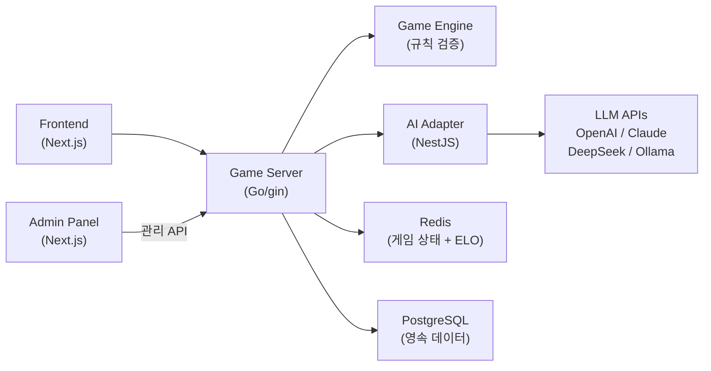

# RummiArena

루미큐브(Rummikub) 보드게임 기반 **멀티 LLM 전략 실험 플랫폼**.
Human + AI 혼합 2~4인 실시간 대전을 지원하며, GPT / Claude / DeepSeek / Ollama 등 다양한 LLM의 게임 전략을 비교·분석한다.

> **Sprint 5 진행 중** — Game Engine 624 tests · AI Adapter 395 tests · E2E 362 tests · CI/CD 17/17 ALL GREEN

## Highlights

- **4종 LLM 실시간 대전** — OpenAI gpt-5-mini, Claude Sonnet 4, DeepSeek Reasoner, Ollama qwen2.5:3b
- **LLM 신뢰 금지 아키텍처** — LLM은 수를 "제안"만 하고, Game Engine이 규칙 검증. 무효 → 재요청(3회) → 강제 드로우
- **AI 캐릭터 시스템** — 6종 페르소나 × 3단계 난이도 × 심리전 레벨(0~3)
- **ELO 랭킹** — Redis Sorted Set 기반 6티어, 실시간 순위
- **DevSecOps** — GitLab CI 17스테이지, SonarQube, Trivy, Rate Limiting

## Architecture



### Core Design Principles

| 원칙 | 설명 |
|------|------|
| **LLM 신뢰 금지** | LLM 응답은 항상 Game Engine으로 유효성 검증 |
| **AI Adapter 분리** | 공통 인터페이스(`MoveRequest`/`MoveResponse`)로 모델 무관 교체 |
| **Stateless 서버** | 모든 게임 상태는 Redis에 저장, Pod 재시작에도 게임 유지 |
| **GitOps** | ArgoCD + Helm chart 기반 선언적 배포 |
| **DevSecOps** | CI 파이프라인에 SonarQube + Trivy 보안 게이트 |

## Tech Stack

| Layer | Technology |
|-------|-----------|
| Frontend | Next.js 15, TailwindCSS, Framer Motion, dnd-kit, Zustand |
| Backend (game-server) | Go 1.24, gin, gorilla/websocket, GORM, zap |
| Backend (ai-adapter) | NestJS, TypeScript, class-validator, @nestjs/throttler |
| Database | PostgreSQL 16, Redis 7 |
| AI Models | OpenAI API (gpt-5-mini), Claude API (Sonnet 4), DeepSeek API (Reasoner), Ollama (qwen2.5:3b) |
| Auth | Google OAuth 2.0 (NextAuth.js) |
| Infra | Docker Desktop Kubernetes, Helm 3, ArgoCD, Traefik v3 |
| CI/CD | GitLab CI + GitLab Runner (Kaniko build) |
| Quality | SonarQube, Trivy, OWASP ZAP |
| Notification | KakaoTalk API |

## Project Structure

```
docs/
  00-tools/        # 도구 체인 매뉴얼 (26개)
  01-planning/     # 기획 (헌장, 요구사항, WBS, 스프린트 백로그)
  02-design/       # 설계 (아키텍처, DB, API, WebSocket, AI, 보안)
  03-development/  # 개발 가이드 (셋업, 코딩 컨벤션, CI/CD)
  04-testing/      # 테스트 전략 + 보고서
  05-deployment/   # 배포 가이드 + K8s 아키텍처
  06-operations/   # 운영 가이드
src/
  game-server/     # Go backend — REST API + Game Engine + WebSocket
  ai-adapter/      # NestJS — LLM 통합 어댑터
  frontend/        # Next.js — 게임 UI
  admin/           # Next.js — 관리자 대시보드
helm/              # Helm charts (7개: postgres, redis, game-server,
                   #   ai-adapter, frontend, admin, ollama)
argocd/            # ArgoCD application manifests
scripts/           # 자동화 스크립트 (시크릿 주입, 통합 테스트)
work_logs/         # 세션/데일리/스크럼/바이브/회고 로그
.github/           # GitHub Issues templates, workflows
```

## Quick Start

### Prerequisites

- Docker Desktop with Kubernetes enabled
- Helm 3, Node.js 20+, Go 1.24+
- API Keys: OpenAI / Anthropic / DeepSeek (선택)

### K8s Deployment

```bash
# 네임스페이스 생성
kubectl create namespace rummikub

# Helm 배포 (7개 서비스)
cd helm
helm install postgres charts/postgres -n rummikub
helm install redis charts/redis -n rummikub
helm install game-server charts/game-server -n rummikub
helm install ai-adapter charts/ai-adapter -n rummikub
helm install frontend charts/frontend -n rummikub
helm install admin charts/admin -n rummikub
helm install ollama charts/ollama -n rummikub

# 시크릿 주입 (Google OAuth, API Keys)
cd ../scripts
./inject-secrets.sh
```

### Service Endpoints (NodePort)

| Service | URL | Port |
|---------|-----|------|
| Frontend | http://localhost:30000 | 30000 |
| Admin Dashboard | http://localhost:30001 | 30001 |
| Game Server | http://localhost:30080 | 30080 |
| AI Adapter | http://localhost:30081 | 30081 |
| PostgreSQL | localhost:30432 | 30432 |

### Local Development

```bash
# game-server
cd src/game-server && go build ./cmd/server && ./server

# ai-adapter
cd src/ai-adapter && npm install && npm run start:dev

# frontend
cd src/frontend && npm install && npm run dev

# admin
cd src/admin && npm install && npm run dev
```

## API Overview

### Authentication
```
POST /api/auth/google         # Google OAuth authorization code
POST /api/auth/google/token   # Google id_token (NextAuth.js)
POST /api/auth/dev-login      # Development-only login
```

### Room Management
```
POST   /api/rooms             # 방 생성
GET    /api/rooms             # 방 목록
GET    /api/rooms/:id         # 방 상세
POST   /api/rooms/:id/join   # 입장
POST   /api/rooms/:id/leave  # 퇴장
POST   /api/rooms/:id/start  # 게임 시작
DELETE /api/rooms/:id         # 방 삭제
```

### Game Actions
```
GET    /api/games/:id         # 게임 상태 (1인칭 뷰)
POST   /api/games/:id/place  # 타일 임시 배치
POST   /api/games/:id/confirm# 턴 확정 (엔진 검증)
POST   /api/games/:id/draw   # 타일 드로우
POST   /api/games/:id/reset  # 턴 되돌리기
```

### Rankings & ELO
```
GET    /api/rankings                  # 전체 랭킹
GET    /api/rankings/tier/:tier       # 티어별 랭킹
GET    /api/users/:id/rating          # ELO 레이팅 (공개)
GET    /api/users/:id/rating/history  # 레이팅 이력 (인증 필요)
```

### Practice Mode
```
POST   /api/practice/progress  # 연습 진행 저장
GET    /api/practice/progress  # 연습 진행 조회
```

### Admin
```
GET    /admin/dashboard            # 대시보드
GET    /admin/games                # 게임 목록
GET    /admin/games/:id            # 게임 상세
GET    /admin/users                # 사용자 목록
GET    /admin/stats/ai             # AI 성능 통계
GET    /admin/stats/elo            # ELO 분포 통계
GET    /admin/stats/performance    # 퍼포먼스 메트릭
```

### WebSocket
```
GET    /ws                    # WebSocket 연결
```

**메시지 타입**: `AUTH` → `AUTH_OK` → `GAME_STATE` / `TURN_START` / `TURN_ACTION` / `GAME_OVER` / `ERROR`
**Heartbeat**: `PING`/`PONG` (30s interval)

### Health Check
```
GET    /health                # 서버 상태 + Redis 연결
GET    /ready                 # 준비 상태
```

## Tile Encoding

타일 코드: `{Color}{Number}{Set}`

| 요소 | 값 | 예시 |
|------|-----|------|
| Color | R(Red), B(Blue), Y(Yellow), K(Black) | `R7a` = 빨강 7 세트a |
| Number | 1~13 | `B13b` = 파랑 13 세트b |
| Set | a / b (동일 타일 구분) | |
| Joker | JK1, JK2 | |

## AI Character System

| Character | 스타일 | 설명 |
|-----------|--------|------|
| Rookie | 보수적 | 안전한 수만 선택 |
| Calculator | 확률 기반 | 기대값 계산으로 최적 수 |
| Shark | 공격적 | 상대 견제 + 대량 배치 |
| Fox | 기만적 | 의도적 지연 + 역전 |
| Wall | 수비적 | 최소 배치 + 자원 비축 |
| Wildcard | 예측 불가 | 랜덤 전략 혼합 |

- **난이도**: 하수 / 중수 / 고수
- **심리전 레벨**: 0 (없음) ~ 3 (고급 블러프)
- **추론 모델 필수**: 비추론 모델은 타일 조합 탐색에 부적합 (실험 검증)

## AI Battle Results

### Round 4 (2026-04-06, 최신)

| Model | Place Rate | 등급 | 턴 | 비용 | 비고 |
|-------|-----------|------|-----|------|------|
| **DeepSeek Reasoner** | **30.8%** | **A+** | 80 (완주) | $0.04 | 비용 대비 성과 1위, v2 프롬프트 |
| **GPT-5-mini** | 33.3% | (N/A) | 14 | $0.15 | 재배포로 WS 끊김, 재실행 필요 |
| **Claude Sonnet 4** (thinking) | 20.0% | A | 32 | $1.11 | WS_TIMEOUT |
| **Ollama qwen2.5:3b** | - | - | - | $0 | 로컬 추론, 성능 제한적 |

### Round 2 → Round 4 개선

| Model | Round 2 | Round 4 | Delta |
|-------|---------|---------|-------|
| DeepSeek Reasoner | 5% (F) | **30.8% (A+)** | **+25.8%p** |
| GPT-5-mini | 28% (A) | 33.3% (N/A) | 데이터 불완전 |
| Claude Sonnet 4 | 23% (A) | 20.0% (A) | -3%p |

> 전 모델 Fallback 0건. DeepSeek 비용 대비 성과: Claude의 114배, GPT의 23배

### v2 프롬프트 통일 실험 (2026-04-06)

DeepSeek 전용으로 설계한 v2 프롬프트를 3모델 공통 표준으로 적용하여 크로스모델 실험을 수행했다.

| Model | v2 Rate | 이전 Rate | 변화 | 턴 | 비고 |
|-------|:-------:|:---------:|:----:|:---:|------|
| **Claude Sonnet 4** (thinking) | **33.3%** | 20.0% (R4) | **+13.3%p** | 62 | **역대 최고 Place Rate** |
| **GPT-5-mini** | **30.8%** | 28.0% (R2) | +2.8%p | 80 | **첫 80턴 완주** |
| DeepSeek Reasoner | 17.9% | 30.8% (R4) | -12.9%p | 80 | 게임 간 분산, AI_TIMEOUT 8건 |

**결론**: v2 프롬프트가 Claude/GPT에서도 효과를 입증하여 **3모델 공통 표준**으로 채택. Claude가 역대 최고 성적(33.3%)을 달성하고, GPT가 사상 첫 80턴 완주에 성공했다.

> 상세 분석: `docs/04-testing/38-v2-prompt-crossmodel-experiment.md` 참조

## Test Status

| Category | Tests | Status |
|----------|-------|--------|
| Game Engine (Go) | 651 | PASS |
| AI Adapter (NestJS) | 395 | PASS |
| Playwright E2E | 375 | PASS |
| WS Multiplayer | 16 | PASS |
| WS Integration | 5 | PASS |
| **Total** | **1,421** | **ALL PASS** |

### CI/CD Pipeline (17/17 Stages)

```
lint (4) → test (2) → quality (2) → build (4) → scan (4) → gitops (1)
```

- **Build**: Kaniko (DinD 폐기)
- **Quality**: SonarQube 정적 분석
- **Security**: Trivy 이미지 스캔
- **Deploy**: ArgoCD GitOps 자동 배포

## Security

| Feature | Implementation |
|---------|---------------|
| Authentication | Google OAuth 2.0 (id_token + authorization code) |
| Rate Limiting (REST) | Redis Sliding Window Counter (10~60 req/min) |
| Rate Limiting (WS) | In-memory Fixed Window (60 msg/min) |
| AI Cost Control | Daily $20 한도 + 시간당 사용자 제한 |
| LLM Validation | Game Engine 3-retry fallback |
| Image Scanning | Trivy CVE 스캔 (CI/CD 통합) |
| Static Analysis | SonarQube Quality Gate |

## Documentation

### Planning
- [Project Charter](docs/01-planning/01-project-charter.md)
- [Requirements](docs/01-planning/02-requirements.md)
- [Sprint Backlogs](docs/01-planning/) (Sprint 1~5)

### Design
- [Architecture](docs/02-design/01-architecture.md)
- [Database Design](docs/02-design/02-database-design.md)
- [API Design](docs/02-design/03-api-design.md)
- [AI Adapter Design](docs/02-design/04-ai-adapter-design.md)
- [Game Rules](docs/02-design/06-game-rules.md)
- [WebSocket Protocol](docs/02-design/10-websocket-protocol.md)
- [Rate Limit Design](docs/02-design/14-rate-limit-design.md)
- [Model Prompt Policy](docs/02-design/18-model-prompt-policy.md)

### Testing
- [Test Strategy](docs/04-testing/01-test-strategy.md)
- [LLM Model Comparison](docs/04-testing/23-llm-model-comparison.md)
- [AI vs AI Tournament](docs/04-testing/22-ai-vs-ai-tournament.md)

### Deployment
- [K8s Architecture](docs/05-deployment/02-k8s-architecture.md)
- [Deployment Guide](docs/05-deployment/01-deployment-guide.md)

## Sprint Progress

| Sprint | Period | SP | Key Deliverables |
|--------|--------|----|-----------------|
| Sprint 1 | W1~W2 | 28/28 | Game Engine, REST API, WebSocket, K8s 5서비스 |
| Sprint 2 | W3~W4 | 50/50 | AI 캐릭터, Turn Orchestrator, ELO, Admin, 연습 모드 |
| Sprint 3 | W5~W6 | 30/30 | OAuth K8s, WS 재연결, Ollama, Redis Timer/Session |
| Sprint 4 | W7 | - | 생명주기 4기능, 비용/메트릭, 보안 P0 5건, AI Round 2 |
| **Sprint 5** | **W8~** | - | **Rate Limiting, DeepSeek 최적화, CI/CD 17/17, 플레이테스트** |

**384 commits** · 100+ 설계 문서 · 1,421 tests

## License

This project is for educational and research purposes.
