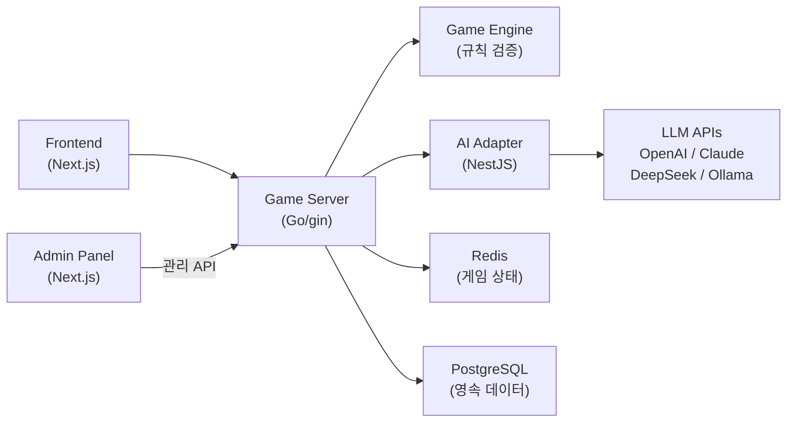

# RummiArena

루미큐브(Rummikub) 보드게임 기반 **멀티 LLM 전략 실험 플랫폼**.
Human + AI 혼합 2~4인 실시간 대전을 지원하며, 다양한 LLM 모델의 게임 전략을 비교/분석한다.

## Architecture



### Core Design

- **LLM 신뢰 금지**: LLM 응답은 항상 Game Engine으로 유효성 검증. Invalid move -> 재요청 (max 3회) -> 실패 시 강제 드로우
- **AI Adapter 분리**: Game Engine은 특정 LLM에 의존하지 않음. 공통 인터페이스(`MoveRequest`/`MoveResponse`)로 모델 교체 가능
- **Stateless 서버**: 모든 게임 상태는 Redis에 저장. Pod 재시작에도 게임 유지
- **GitOps**: ArgoCD가 Helm chart 기반 배포 담당

## Tech Stack

| Layer | Technology |
|-------|-----------|
| Frontend | Next.js 15, TailwindCSS, Framer Motion, dnd-kit, Zustand |
| Backend (game-server) | Go 1.24, gin, gorilla/websocket, GORM, zap |
| Backend (ai-adapter) | NestJS, TypeScript, class-validator |
| Database | PostgreSQL 16, Redis 7 |
| AI Models | OpenAI API, Claude API, DeepSeek API, Ollama (LLaMA) |
| Infra | Docker Desktop Kubernetes, Helm 3, ArgoCD, Traefik v3 |
| CI/CD | GitLab CI + GitLab Runner |
| Quality | SonarQube, Trivy, OWASP ZAP |
| Auth | Google OAuth 2.0 (NextAuth.js) |

## Project Structure

```
docs/
  01-planning/      # 기획 (헌장, 요구사항, WBS, 백로그)
  02-design/        # 설계 (아키텍처, DB, API, WebSocket, AI Adapter)
  03-development/   # 개발 가이드
  04-testing/       # 테스트 전략 + 보고서
  05-deployment/    # 배포 가이드 + K8s 아키텍처
src/
  game-server/      # Go backend (REST API + Game Engine)
  ai-adapter/       # NestJS AI 서비스
  frontend/         # Next.js 게임 UI
  admin/            # 관리자 대시보드
helm/               # Helm charts (5개 서비스)
work_logs/          # 세션/데일리/스크럼 로그
```

## Quick Start

### Prerequisites

- Docker Desktop with Kubernetes enabled
- Helm 3
- Node.js 20+
- Go 1.24+

### K8s Deployment

```bash
# 네임스페이스 생성
kubectl create namespace rummikub

# Helm 배포 (5개 서비스)
cd helm
helm install postgres charts/postgres -n rummikub
helm install redis charts/redis -n rummikub
helm install game-server charts/game-server -n rummikub
helm install ai-adapter charts/ai-adapter -n rummikub
helm install frontend charts/frontend -n rummikub
```

### Service Endpoints (NodePort)

| Service | URL | Port |
|---------|-----|------|
| Frontend | http://localhost:30000 | 30000 |
| Game Server | http://localhost:30080 | 30080 |
| AI Adapter | http://localhost:30081 | 30081 |
| PostgreSQL | localhost:30432 | 30432 |

### Local Development

```bash
# game-server
cd src/game-server
go build ./cmd/server && ./server

# ai-adapter
cd src/ai-adapter
npm install && npm run start:dev

# frontend
cd src/frontend
npm install && npm run dev
```

## Game Rules (Tile Encoding)

타일 코드: `{Color}{Number}{Set}`
- Color: R(Red), B(Blue), Y(Yellow), K(Black)
- Number: 1~13
- Set: a/b (동일 타일 구분)
- Joker: JK1, JK2
- Example: `R7a` = Red 7 set-a, `B13b` = Blue 13 set-b

## AI Character System

| Character | Style | Description |
|-----------|-------|-------------|
| Rookie | 보수적 | 안전한 수만 선택 |
| Calculator | 확률 기반 | 기대값 계산으로 최적 수 |
| Shark | 공격적 | 상대 견제 + 대량 배치 |
| Fox | 기만적 | 의도적 지연 + 역전 |
| Wall | 수비적 | 최소 배치 + 자원 비축 |
| Wildcard | 예측 불가 | 랜덤 전략 혼합 |

난이도: 하수 / 중수 / 고수 -- 심리전 레벨: 0~3

## API Overview

### Room Management
```
POST   /api/rooms          # 방 생성
GET    /api/rooms          # 방 목록
GET    /api/rooms/:id      # 방 상세
POST   /api/rooms/:id/join # 입장
POST   /api/rooms/:id/leave# 퇴장
POST   /api/rooms/:id/start# 게임 시작
DELETE /api/rooms/:id      # 방 삭제
```

### Game Actions
```
GET    /api/games/:id      # 게임 상태 (1인칭 뷰)
POST   /api/games/:id/place   # 타일 임시 배치
POST   /api/games/:id/confirm # 턴 확정 (엔진 검증)
POST   /api/games/:id/draw    # 타일 드로우
POST   /api/games/:id/reset   # 턴 되돌리기
```

### Health Check
```
GET    /health             # 서버 상태 + Redis 연결
GET    /ready              # 준비 상태
```

## Test Status

| Category | Result | Coverage |
|----------|--------|----------|
| Engine Unit Tests | 69/69 PASS | 96.5% |
| Smoke Tests | 16/16 PASS | - |
| Integration Tests | 31/31 PASS | REST API + DB/Redis |

## Documentation

- [Project Charter](docs/01-planning/01-project-charter.md)
- [Architecture Design](docs/02-design/01-architecture.md)
- [Database Design](docs/02-design/02-database-design.md)
- [API Design](docs/02-design/03-api-design.md)
- [WebSocket Protocol](docs/02-design/10-websocket-protocol.md)
- [Test Strategy](docs/04-testing/01-test-strategy.md)
- [Integration Test Report](docs/04-testing/06-integration-test-report.md)

## License

This project is for educational and research purposes.
