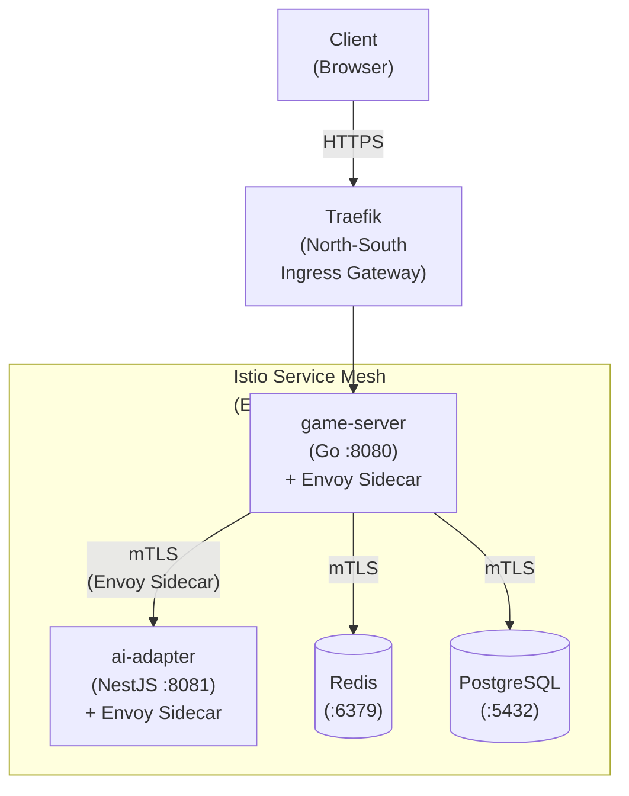
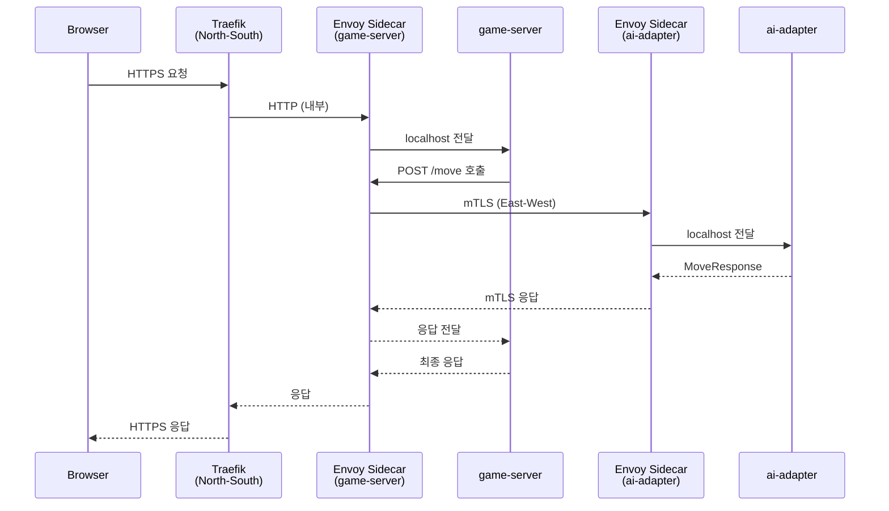

# Istio Service Mesh 매뉴얼

## 1. 개요

Istio는 서비스 간(East-West) 통신을 관리하는 Service Mesh 플랫폼이다.
RummiArena 프로젝트에서는 **Phase 5(Sprint 7~9)**에 도입 예정이며, 아래 역할을 담당한다.

- **game-server <-> ai-adapter 간 mTLS**: 내부 서비스 간 상호 인증 및 암호화 통신
- **트래픽 관리**: 카나리 배포, 가중치 기반 라우팅, Circuit Breaker
- **관측성(Observability)**: 분산 트레이싱(Jaeger), 서비스 토폴로지(Kiali), 메트릭 수집
- **정책 적용**: Rate Limiting, Retry, Timeout 세밀 제어

> **중요**: Istio는 East-West(서비스 간) 트래픽만 담당한다.
> North-South(외부 진입) 트래픽은 Traefik이 전담한다. Istio Ingress Gateway는 사용하지 않는다.

### 아키텍처 내 위치



---

## 2. 설치

### 2.1 사전 요구사항

- Docker Desktop Kubernetes 클러스터 활성화
- `kubectl` CLI 설치 완료
- **RAM 여유**: Istio 컨트롤 플레인(istiod) ~200MB + sidecar당 ~50MB

> **16GB RAM 제약 주의**: Istio 최소 프로파일(`minimal` 또는 `demo`)을 사용하고,
> 불필요한 애드온(Zipkin, Grafana 내장 등)은 비활성화한다.

### 2.2 istioctl 설치 (WSL2)

```bash
# istioctl 다운로드
curl -L https://istio.io/downloadIstio | ISTIO_VERSION=1.24.0 sh -

# PATH에 추가
echo 'export PATH=$HOME/istio-1.24.0/bin:$PATH' >> ~/.bashrc
source ~/.bashrc

# 설치 확인
istioctl version
```

### 2.3 Istio 설치 (최소 프로파일)

```bash
# Namespace 생성
kubectl create namespace istio-system

# 최소 프로파일로 설치 (메모리 절약)
istioctl install --set profile=minimal \
  --set values.pilot.resources.requests.memory=128Mi \
  --set values.pilot.resources.limits.memory=256Mi \
  -y

# 설치 확인
kubectl get pods -n istio-system
# NAME                      READY   STATUS    RESTARTS   AGE
# istiod-xxxx               1/1     Running   0          1m
```

### 2.4 네임스페이스 사이드카 주입 활성화

```bash
# rummikub 네임스페이스에 자동 sidecar 주입 활성화
kubectl label namespace rummikub istio-injection=enabled

# 확인
kubectl get namespace rummikub --show-labels
```

> 기존 Pod에 사이드카를 주입하려면 Pod를 재시작해야 한다.
> ```bash
> kubectl rollout restart deployment -n rummikub
> ```

---

## 3. 프로젝트 설정

### 3.1 Traefik + Istio 역할 분리

| 계층 | 담당 | 역할 | 비고 |
|------|------|------|------|
| 외부 진입 (North-South) | **Traefik** | TLS 종단, URL 라우팅, Host 라우팅 | 기존 유지 |
| 서비스 간 (East-West) | **Istio (Envoy Sidecar)** | mTLS, Circuit Breaker, 트래픽 가중치 | Phase 5 신규 |

### 3.2 트래픽 흐름 상세



### 3.3 mTLS 정책

```yaml
# istio/peer-authentication.yaml
apiVersion: security.istio.io/v1
kind: PeerAuthentication
metadata:
  name: default
  namespace: rummikub
spec:
  # STRICT: 평문 트래픽 차단, mTLS 필수
  mtls:
    mode: STRICT
```

### 3.4 game-server -> ai-adapter 트래픽 정책

```yaml
# istio/destination-rule-ai-adapter.yaml
apiVersion: networking.istio.io/v1
kind: DestinationRule
metadata:
  name: ai-adapter
  namespace: rummikub
spec:
  host: ai-adapter.rummikub.svc.cluster.local
  trafficPolicy:
    connectionPool:
      http:
        # AI Adapter 호출은 LLM 응답 대기로 느림 -> 연결 풀 확보
        h2UpgradePolicy: UPGRADE
        maxRequestsPerConnection: 10
        http1MaxPendingRequests: 50
      tcp:
        maxConnections: 100
    outlierDetection:
      # Circuit Breaker: 연속 5xx 에러 시 30초간 트래픽 차단
      consecutive5xxErrors: 3
      interval: 30s
      baseEjectionTime: 30s
      maxEjectionPercent: 50
```

### 3.5 리소스 예산 (16GB 환경)

| 구성 요소 | 메모리 사용 | 비고 |
|----------|-----------|------|
| istiod (컨트롤 플레인) | ~200MB | minimal 프로파일 |
| Envoy Sidecar (game-server) | ~50MB | |
| Envoy Sidecar (ai-adapter) | ~50MB | |
| Envoy Sidecar (frontend) | ~50MB | |
| Envoy Sidecar (admin) | ~50MB | |
| **Istio 총합** | **~400MB** | 기존 대비 추가 |

> Redis, PostgreSQL에는 sidecar를 주입하지 않을 수 있다(선택).
> `sidecar.istio.io/inject: "false"` 어노테이션으로 제외 가능.

---

## 4. 주요 명령어 / 사용법

### 4.1 istioctl 기본 명령어

```bash
# Istio 설치 상태 확인
istioctl verify-install

# Proxy 상태 확인
istioctl proxy-status

# 특정 Pod의 Envoy 설정 확인
istioctl proxy-config cluster <pod-name> -n rummikub

# mTLS 상태 확인
istioctl authn tls-check <pod-name>.rummikub

# Envoy 로그 레벨 변경 (디버깅)
istioctl proxy-config log <pod-name> -n rummikub --level debug
```

### 4.2 트래픽 관리

```bash
# 카나리 배포: ai-adapter v2에 10% 트래픽 분배
cat <<EOF | kubectl apply -f -
apiVersion: networking.istio.io/v1
kind: VirtualService
metadata:
  name: ai-adapter
  namespace: rummikub
spec:
  hosts:
    - ai-adapter
  http:
    - route:
        - destination:
            host: ai-adapter
            subset: v1
          weight: 90
        - destination:
            host: ai-adapter
            subset: v2
          weight: 10
EOF
```

### 4.3 관측성 애드온 (선택)

```bash
# Kiali (서비스 토폴로지) 설치 - Phase 5에서 사용
kubectl apply -f https://raw.githubusercontent.com/istio/istio/release-1.24/samples/addons/kiali.yaml

# Kiali 접속
kubectl port-forward svc/kiali -n istio-system 20001:20001
# http://localhost:20001
```

---

## 5. 트러블슈팅

| 증상 | 원인 | 해결 |
|------|------|------|
| Pod READY 1/2 (sidecar 미시작) | Envoy 초기화 실패 | `kubectl describe pod <name>` 확인, 리소스 부족 여부 점검 |
| 503 Service Unavailable (내부) | mTLS 설정 불일치 | `istioctl authn tls-check`로 TLS 모드 확인 |
| AI 호출 타임아웃 증가 | Envoy sidecar 추가 레이턴시 | `outlierDetection` 타임아웃 조정 |
| OOMKilled (istio-system) | istiod 메모리 부족 | `resources.limits.memory` 상향 (256Mi -> 384Mi) |
| sidecar 자동 주입 안 됨 | 네임스페이스 라벨 미설정 | `kubectl label ns rummikub istio-injection=enabled` |
| Traefik -> Pod 간 연결 실패 | Traefik이 mTLS를 사용하지 않음 | PeerAuthentication을 `PERMISSIVE`로 설정하여 Traefik 트래픽 허용 |

### Traefik 연동 시 주의사항

Traefik은 Istio 메시 외부에 있으므로 mTLS를 사용하지 않는다.
Traefik이 접근하는 서비스(frontend, game-server)는 `PERMISSIVE` 모드가 필요할 수 있다.

```yaml
# Traefik이 직접 접근하는 서비스는 PERMISSIVE 허용
apiVersion: security.istio.io/v1
kind: PeerAuthentication
metadata:
  name: allow-traefik-ingress
  namespace: rummikub
spec:
  selector:
    matchLabels:
      app: game-server
  mtls:
    mode: PERMISSIVE
```

---

## 6. 참고 링크

- Istio 공식 문서: https://istio.io/latest/docs/
- istioctl 설치: https://istio.io/latest/docs/setup/getting-started/
- Envoy Proxy: https://www.envoyproxy.io/docs/envoy/latest/
- Kiali: https://kiali.io/
- Jaeger: https://www.jaegertracing.io/
- 프로젝트 내 관련 문서:
  - 게이트웨이 아키텍처: `docs/05-deployment/02-gateway-architecture.md`
  - Kubernetes: `docs/00-tools/02-kubernetes.md`
  - Traefik: `docs/00-tools/25-traefik.md`
