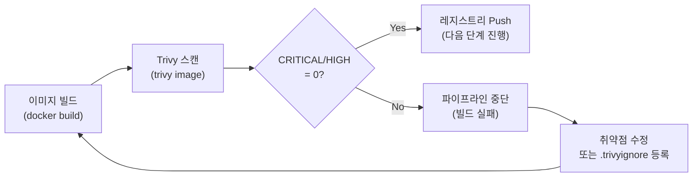

# Trivy 매뉴얼

## 1. 개요

Trivy는 Aqua Security가 개발한 오픈소스 컨테이너 이미지·파일시스템·IaC 보안 스캔 도구다.
RummiArena DevSecOps 파이프라인의 **Container Security 게이트**를 담당한다.

GitLab CI 파이프라인에서 이미지 빌드 직후 Trivy를 실행하며, CRITICAL 또는 HIGH 취약점이
1개 이상 존재하면 파이프라인을 즉시 중단한다.

### 스캔 대상 이미지 (4개)

| 이미지 | 베이스 | 비고 |
|--------|--------|------|
| `rummiarena/game-server` | `alpine:3.21` | Go 멀티스테이지 빌드 |
| `rummiarena/ai-adapter` | `node:22-alpine` | NestJS |
| `rummiarena/frontend` | `node:22-alpine` | Next.js |
| `rummiarena/admin` | `node:22-alpine` | Next.js |

### 보안 게이트 기준

| 심각도 | 기준 | 결과 |
|--------|------|------|
| CRITICAL | 0건 | 파이프라인 통과 |
| HIGH | 0건 | 파이프라인 통과 |
| MEDIUM 이하 | 제한 없음 | 경고 출력, 통과 |



---

## 2. 설치

### 2.1 옵션 A: WSL2 바이너리 설치 (권장)

```bash
# 최신 버전 확인 후 설치
TRIVY_VERSION=$(curl -s https://api.github.com/repos/aquasecurity/trivy/releases/latest \
  | grep '"tag_name"' | sed 's/.*"v\([^"]*\)".*/\1/')

wget https://github.com/aquasecurity/trivy/releases/download/v${TRIVY_VERSION}/trivy_${TRIVY_VERSION}_Linux-64bit.tar.gz
tar -xzf trivy_${TRIVY_VERSION}_Linux-64bit.tar.gz
sudo mv trivy /usr/local/bin/
trivy --version
```

### 2.2 옵션 B: Docker로 실행 (바이너리 없을 때)

```bash
# 이미지 스캔 (Docker in Docker 방식)
docker run --rm \
  -v /var/run/docker.sock:/var/run/docker.sock \
  -v $HOME/.trivy-cache:/root/.cache \
  aquasec/trivy:latest image rummiarena/game-server:latest
```

### 2.3 취약점 DB 캐시 갱신

```bash
# 최초 실행 또는 오래된 DB 갱신 시
trivy image --download-db-only

# 오프라인 환경 (캐시 사용, DB 갱신 생략)
trivy image --skip-db-update rummiarena/game-server:latest
```

---

## 3. 프로젝트 설정

### 3.1 trivy.yaml (프로젝트 루트)

```yaml
# trivy.yaml
# Trivy 전역 설정 — 모든 scan 명령에 자동 적용됨
scan:
  security-checks:
    - vuln
    - secret
    - config

severity:
  - CRITICAL
  - HIGH
  - MEDIUM

exit-code: 1          # CRITICAL/HIGH 발견 시 비정상 종료 (CI 게이트)
ignore-unfixed: true  # 아직 패치가 없는 취약점은 무시

cache:
  dir: ~/.trivy-cache

format: table         # 로컬 실행 기본 포맷 (CI에서는 sarif로 덮어씀)
```

### 3.2 .trivyignore (프로젝트 루트)

.trivyignore에 CVE를 등록할 때는 반드시 사유와 날짜 주석을 추가해야 한다.
이유 없는 ignore는 코드 리뷰에서 반려한다.

```
# .trivyignore 예시
# 형식: CVE-ID  # 사유 | 등록일 | 재검토일

# node:22-alpine의 busybox CVE — 업스트림 미패치, 익스플로잇 경로 없음 | 2026-03-12 | 2026-06-12
# CVE-2023-42364

# go stdlib TLS — game-server는 내부망 전용, 외부 노출 없음 | 2026-03-12 | 2026-06-12
# CVE-2024-XXXX
```

> 재검토일이 지난 항목은 팀 보안 리뷰에서 제거 여부를 결정한다.

### 3.3 .gitignore에 캐시 제외

```
# .gitignore 추가
.trivy-cache/
trivy-results/
```

---

## 4. 주요 명령어 / 사용법

### 4.1 단일 이미지 스캔

```bash
# 기본 스캔 (CRITICAL + HIGH만 표시)
trivy image --severity CRITICAL,HIGH rummiarena/game-server:latest

# JSON 출력 (파싱용)
trivy image --format json --output results/game-server.json rummiarena/game-server:latest

# SARIF 출력 (GitLab Security Dashboard 연동)
trivy image --format sarif --output results/game-server.sarif rummiarena/game-server:latest
```

### 4.2 4개 이미지 일괄 스캔 스크립트

```bash
#!/usr/bin/env bash
# scripts/trivy-scan-all.sh

set -euo pipefail

IMAGES=(
  "rummiarena/game-server:latest"
  "rummiarena/ai-adapter:latest"
  "rummiarena/frontend:latest"
  "rummiarena/admin:latest"
)

SEVERITY="CRITICAL,HIGH"
REPORT_DIR="trivy-results"
FAILED=0

mkdir -p "$REPORT_DIR"

for IMAGE in "${IMAGES[@]}"; do
  NAME=$(echo "$IMAGE" | cut -d'/' -f2 | cut -d':' -f1)
  echo "==> Scanning: $IMAGE"

  if trivy image \
      --severity "$SEVERITY" \
      --exit-code 1 \
      --ignore-unfixed \
      --format sarif \
      --output "$REPORT_DIR/${NAME}.sarif" \
      "$IMAGE"; then
    echo "    PASS: $IMAGE"
  else
    echo "    FAIL: $IMAGE — CRITICAL/HIGH 취약점 발견"
    FAILED=$((FAILED + 1))
  fi
done

echo ""
echo "============================="
echo "스캔 완료: ${#IMAGES[@]}개 이미지"
echo "실패: ${FAILED}개"
echo "============================="

exit $FAILED
```

```bash
chmod +x scripts/trivy-scan-all.sh
./scripts/trivy-scan-all.sh
```

### 4.3 파일시스템(소스코드) 시크릿 스캔

```bash
# 소스 코드에 하드코딩된 시크릿 탐지
trivy fs --security-checks secret .
```

### 4.4 Helm Chart IaC 스캔

```bash
# Helm 템플릿 오설정 탐지 (securityContext 미설정 등)
trivy config helm/rummiarena/
```

---

## 5. GitLab CI 통합

```yaml
# .gitlab-ci.yml 일부

trivy:scan:
  stage: security
  image: aquasec/trivy:latest
  variables:
    TRIVY_NO_PROGRESS: "true"
    TRIVY_CACHE_DIR: ".trivycache"
  before_script:
    - trivy image --download-db-only
  script:
    - |
      for IMAGE in \
        "${CI_REGISTRY_IMAGE}/game-server:${CI_COMMIT_SHORT_SHA}" \
        "${CI_REGISTRY_IMAGE}/ai-adapter:${CI_COMMIT_SHORT_SHA}" \
        "${CI_REGISTRY_IMAGE}/frontend:${CI_COMMIT_SHORT_SHA}" \
        "${CI_REGISTRY_IMAGE}/admin:${CI_COMMIT_SHORT_SHA}"; do
        NAME=$(echo "$IMAGE" | sed 's|.*/||' | cut -d':' -f1)
        trivy image \
          --severity CRITICAL,HIGH \
          --exit-code 1 \
          --ignore-unfixed \
          --format sarif \
          --output "trivy-${NAME}.sarif" \
          "$IMAGE"
      done
  artifacts:
    when: always
    paths:
      - "trivy-*.sarif"
    reports:
      container_scanning:
        - "trivy-*.sarif"
  cache:
    paths:
      - .trivycache/
  allow_failure: false
  only:
    - main
    - develop
    - merge_requests
```

---

## 6. 트러블슈팅

| 증상 | 원인 | 해결 |
|------|------|------|
| `WARN: DB file is older than 1 day` | 취약점 DB가 오래됨 | `trivy image --download-db-only` 실행 |
| `failed to download vulnerability DB` | 네트워크 차단 | `--skip-db-update` 플래그 추가 또는 DB 미러 설정 |
| alpine 이미지에서 다수 MEDIUM 출력 | busybox 내장 취약점 | MEDIUM 심각도 게이트에서 제외 (trivy.yaml `severity` 조정) |
| CI에서 `permission denied: /var/run/docker.sock` | Runner에 소켓 마운트 누락 | GitLab Runner config에 `/var/run/docker.sock` 볼륨 추가 |
| 동일 CVE 반복 출력 | .trivyignore 미적용 | 파일 경로 확인 (`trivy --ignorefile .trivyignore`) |
| WSL2에서 `--exit-code 1` 미동작 | exit code 전파 오류 | `set -e` 확인, `if trivy ...; then` 패턴 사용 |

---

## 7. 참고 링크

- Trivy 공식 문서: https://aquasecurity.github.io/trivy/
- Trivy GitHub: https://github.com/aquasecurity/trivy
- GitLab Container Scanning: https://docs.gitlab.com/ee/user/application_security/container_scanning/
- .trivyignore 문법: https://aquasecurity.github.io/trivy/latest/docs/configuration/filtering/
