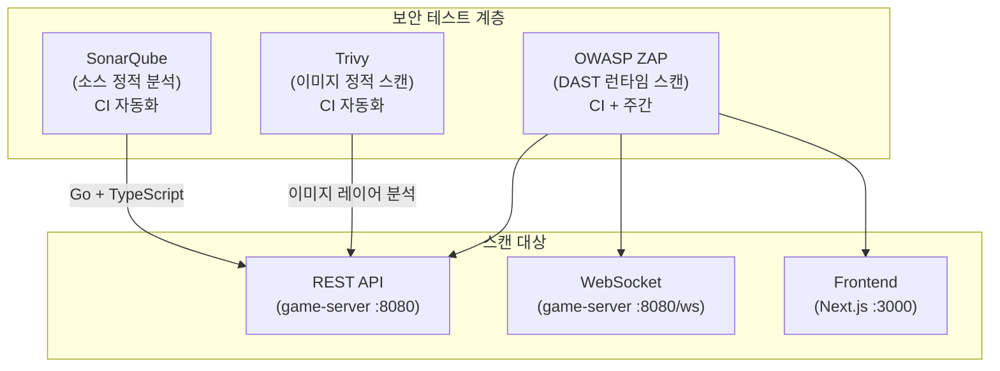
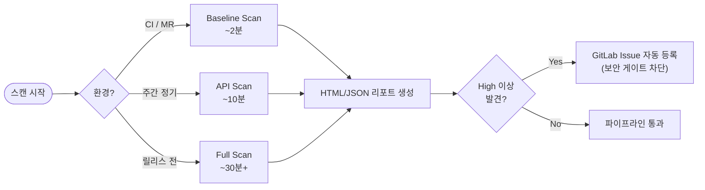

# OWASP ZAP 매뉴얼

## 1. 개요

OWASP ZAP(Zed Attack Proxy)은 웹 애플리케이션 동적 보안 테스트(DAST) 도구다.
실행 중인 서버를 대상으로 HTTP 요청을 주고받으며 실시간으로 취약점을 탐지한다.

RummiArena에서는 **REST API**와 **WebSocket** 엔드포인트를 대상으로 런타임 보안 테스트를 수행한다.
Trivy(이미지 정적 스캔)와 짝을 이루어 DevSecOps 파이프라인의 두 번째 보안 게이트를 담당한다.

### 스캔 모드 3단계

| 모드 | 실행 주기 | 소요 시간 | 대상 | RAM 사용 |
|------|-----------|-----------|------|----------|
| Baseline Scan | CI (MR마다) | ~2분 | Spider + 수동 크롤 | ~512MB |
| API Scan | 주간 (수동) | ~10분 | OpenAPI 명세 기반 | ~512MB |
| Full Scan | 릴리스 전 | ~30분+ | 능동 공격 포함 | ~1GB |





---

## 2. 설치

### Docker로 실행 (권장 — 별도 설치 불필요)

```bash
# ZAP Docker 이미지 Pull
docker pull ghcr.io/zaproxy/zaproxy:stable

# 버전 확인
docker run --rm ghcr.io/zaproxy/zaproxy:stable zap.sh -version
```

### 로컬 보고서 저장 디렉토리 준비

```bash
mkdir -p reports/zap
```

---

## 3. 프로젝트 설정

### 3.1 디렉토리 구조

```
tests/
  security/
    zap/
      baseline.conf        # Baseline 스캔 설정
      api-scan.conf        # API 스캔 설정
      auth-header.js       # JWT 인증 헤더 스크립트
      openapi.yaml         # game-server OpenAPI 명세 (스캔 대상)
reports/
  zap/                     # 스캔 결과 HTML/JSON (gitignore)
```

### 3.2 JWT 인증 설정 (ZAP 요청 헤더 자동 추가)

ZAP은 기본적으로 인증 없이 스캔하므로 인증이 필요한 엔드포인트는 탐지가 불완전하다.
아래 스크립트를 통해 모든 요청에 Bearer 토큰을 자동 추가한다.

```javascript
// tests/security/zap/auth-header.js
// ZAP HTTP Sender Script — 모든 요청에 Authorization 헤더 주입

var HttpSender = Java.type('org.parosproxy.paros.network.HttpSender');

// 테스트용 JWT 토큰 (실제 값은 환경변수로 주입)
var TOKEN = java.lang.System.getenv('ZAP_AUTH_TOKEN') || 'test-jwt-token-here';

function sendingRequest(msg, initiator, helper) {
    if (initiator === HttpSender.ACTIVE_SCANNER_INITIATOR ||
        initiator === HttpSender.SPIDER_INITIATOR ||
        initiator === HttpSender.FUZZER_INITIATOR) {
        msg.getRequestHeader().setHeader('Authorization', 'Bearer ' + TOKEN);
    }
}

function responseReceived(msg, initiator, helper) {
    // 응답 처리 없음
}
```

### 3.3 .gitignore에 보고서 제외

```
# .gitignore 추가
reports/zap/
```

---

## 4. 주요 명령어 / 사용법

### 4.1 Baseline Scan (CI용, ~2분)

Spider 크롤링 + 수동 테스트 규칙만 실행. 능동 공격은 포함하지 않아 안전하게 CI에 삽입 가능하다.

```bash
# game-server REST API 대상
docker run --rm \
  --network host \
  -v $(pwd)/reports/zap:/zap/wrk:rw \
  ghcr.io/zaproxy/zaproxy:stable \
  zap-baseline.py \
    -t http://localhost:8080 \
    -r baseline-report.html \
    -J baseline-report.json \
    -l WARN \
    -I  # 경고는 무시, FAIL만 exit code 1
```

### 4.2 API Scan (OpenAPI 명세 기반, ~10분)

```bash
# OpenAPI 명세를 기반으로 모든 엔드포인트 자동 탐지 + 스캔
docker run --rm \
  --network host \
  -v $(pwd)/reports/zap:/zap/wrk:rw \
  -v $(pwd)/tests/security/zap:/zap/scripts:ro \
  -e ZAP_AUTH_TOKEN="${ZAP_AUTH_TOKEN}" \
  ghcr.io/zaproxy/zaproxy:stable \
  zap-api-scan.py \
    -t http://localhost:8080/swagger/doc.json \
    -f openapi \
    -r api-scan-report.html \
    -J api-scan-report.json \
    -z "-configfile /zap/scripts/api-scan.conf"
```

### 4.3 Full Scan (릴리스 전, ~30분+)

```bash
# 능동 공격 포함 — 스테이징 환경에서만 실행
docker run --rm \
  --network host \
  -v $(pwd)/reports/zap:/zap/wrk:rw \
  -e ZAP_AUTH_TOKEN="${ZAP_AUTH_TOKEN}" \
  ghcr.io/zaproxy/zaproxy:stable \
  zap-full-scan.py \
    -t http://localhost:8080 \
    -r full-scan-report.html \
    -J full-scan-report.json \
    -m 10 \  # 크롤 최대 10분
    -I       # 경고 무시 (FAIL만 차단)
```

### 4.4 수동 스캔 체크리스트

릴리스 전 수동으로 확인해야 할 8개 항목이다.

- [ ] SQL Injection: `/api/v1/rooms?name=` 쿼리 파라미터에 `' OR '1'='1` 입력
- [ ] JWT 변조: Access Token 서명부 임의 변경 후 API 호출 → 401 확인
- [ ] IDOR: 다른 사용자의 `roomId`로 GET/DELETE 시도 → 403 확인
- [ ] WebSocket 미인증 연결: 토큰 없이 `ws://localhost:8080/ws/game/roomId` 연결 시도 → 거부 확인
- [ ] Rate Limiting: 로그인 API에 1분간 100회 요청 → 429 확인
- [ ] CORS: `Origin: https://evil.example.com` 헤더로 API 호출 → 차단 확인
- [ ] Path Traversal: `/api/v1/../../../etc/passwd` 시도 → 400/404 확인
- [ ] Sensitive Data: 응답 본문에 비밀번호·토큰·내부 IP 노출 여부 확인

---

## 5. OWASP Top 10 매핑

RummiArena에서 ZAP으로 검증하는 OWASP Top 10 항목이다.

| OWASP | 취약점 | 검증 방법 | 대상 |
|-------|--------|-----------|------|
| A01 - Broken Access Control | IDOR, 권한 우회 | API Scan + 수동 | game-server |
| A02 - Cryptographic Failures | HTTP 평문 전송 | Baseline | 전체 |
| A03 - Injection | SQL Injection, Command Injection | Full Scan | game-server |
| A05 - Security Misconfiguration | CORS, 불필요한 헤더 | Baseline | 전체 |
| A07 - Identification & Auth Failures | JWT 우회, 세션 고정 | 수동 체크리스트 | game-server |
| A08 - Software & Data Integrity Failures | 의존성 검증 | Trivy 연계 | 이미지 |
| A09 - Logging & Monitoring Failures | 에러 응답 정보 노출 | Baseline | game-server |

---

## 6. GitLab CI 통합

```yaml
# .gitlab-ci.yml 일부

zap:baseline:
  stage: dast
  image: ghcr.io/zaproxy/zaproxy:stable
  services:
    - name: $CI_REGISTRY_IMAGE/game-server:$CI_COMMIT_SHORT_SHA
      alias: game-server
  variables:
    TARGET_URL: "http://game-server:8080"
    ZAP_AUTH_TOKEN: $ZAP_JWT_TOKEN  # GitLab CI/CD Variables에 등록
  script:
    - mkdir -p /zap/wrk
    - |
      zap-baseline.py \
        -t "$TARGET_URL" \
        -r /zap/wrk/zap-baseline.html \
        -J /zap/wrk/zap-baseline.json \
        -l WARN \
        -I
  artifacts:
    when: always
    paths:
      - /zap/wrk/
    reports:
      dast:
        - /zap/wrk/zap-baseline.json
  allow_failure: false
  only:
    - merge_requests
    - main
```

---

## 7. 트러블슈팅

| 증상 | 원인 | 해결 |
|------|------|------|
| `Unable to connect to: http://localhost:8080` | --network host 미적용 | `--network host` 플래그 확인, 또는 컨테이너 내부 IP 사용 |
| WebSocket 스캔 결과 없음 | ZAP Spider는 WS 미지원 | ZAP 수동 크롤 또는 AJAX Spider 사용 |
| 스캔이 30초 만에 종료 | Spider가 엔드포인트를 찾지 못함 | `-t` URL이 Swagger/OpenAPI 경로인지 확인 |
| `Authentication failed` | JWT 토큰 만료 | ZAP_AUTH_TOKEN 환경변수에 유효한 토큰 주입 |
| Full Scan에서 false positive 다수 | 능동 공격 규칙 과민 | `.zap/rules.tsv`에서 특정 규칙 비활성화 |
| Docker 실행 후 보고서 파일 없음 | 볼륨 마운트 권한 오류 | `chmod 777 reports/zap` 또는 `--user $(id -u)` 추가 |

---

## 8. 참고 링크

- OWASP ZAP 공식 사이트: https://www.zaproxy.org/
- ZAP Docker Hub: https://github.com/zaproxy/zaproxy/wiki/Docker
- ZAP API 스캔 문서: https://www.zaproxy.org/docs/docker/api-scan/
- OWASP Top 10 2021: https://owasp.org/Top10/
- GitLab DAST 연동: https://docs.gitlab.com/ee/user/application_security/dast/
