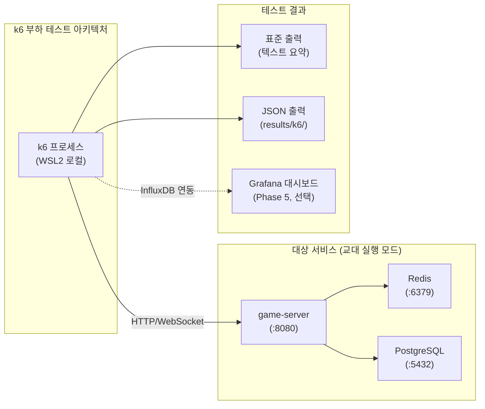

# k6 매뉴얼

## 1. 개요

k6는 Grafana Labs가 유지 관리하는 오픈소스 부하 테스트 도구다.
JavaScript(ES2015+)로 시나리오를 작성하며, Go 런타임으로 실행되어 낮은 메모리로 높은 동시성을 달성한다.

RummiArena에서는 game-server의 **REST API 응답시간 SLA**와 **WebSocket 동시 연결 안정성**을
검증하는 데 사용한다.

### 16GB RAM 제약 준수 기준

LG Gram 15Z90R (RAM 16GB, WSL2 할당 10GB) 환경에서 부하 테스트 실행 시 다른 서비스와 공존해야 한다.

| 항목 | 제한값 | 이유 |
|------|--------|------|
| VU (Virtual Users) 최대 | 50 | RAM 과부하 방지 |
| 테스트 지속 시간 최대 | 5분 | 교대 실행 슬롯 내 완료 |
| WebSocket 동시 연결 최대 | 20 | goroutine 메모리 누적 방지 |
| 동시 실행 시나리오 수 | 1개 | 리소스 집중 |

### SLA 목표

| 지표 | 목표 | 측정 방법 |
|------|------|-----------|
| REST API p95 응답시간 | < 500ms | http_req_duration p(95) |
| REST API 에러율 | < 1% | http_req_failed rate |
| WebSocket 연결 p95 | < 200ms | ws_connecting p(95) |
| WebSocket 메시지 에러율 | < 0.5% | ws_msgs_received / ws_sessions |



---

## 2. 설치

### 2.1 WSL2 바이너리 설치 (권장)

```bash
# GPG 키 + apt 저장소 추가
sudo gpg --no-default-keyring \
  --keyring /usr/share/keyrings/k6-archive-keyring.gpg \
  --keyserver hkp://keyserver.ubuntu.com:80 \
  --recv-keys C5AD17C747E3415A3642D57D77C6C491D6AC1D69

echo "deb [signed-by=/usr/share/keyrings/k6-archive-keyring.gpg] \
  https://dl.k6.io/deb stable main" \
  | sudo tee /etc/apt/sources.list.d/k6.list

sudo apt-get update
sudo apt-get install k6

k6 version
```

### 2.2 옵션 B: Docker로 실행

```bash
docker run --rm -i \
  --network host \
  -v $(pwd)/tests/load:/scripts \
  grafana/k6:latest run /scripts/rest-api.js
```

---

## 3. 프로젝트 설정

### 3.1 디렉토리 구조

```
tests/
  load/
    config.js             # 공통 SLA 임계값 + 환경 설정
    scenarios/
      rest-api.js         # Room CRUD REST 부하 시나리오
      websocket.js        # 게임 WebSocket 부하 시나리오
    helpers/
      auth.js             # JWT 토큰 헬퍼
      assertions.js       # 공통 체크 함수
results/
  k6/                     # 실행 결과 JSON (gitignore)
```

### 3.2 config.js (공통 설정)

```javascript
// tests/load/config.js

export const BASE_URL = __ENV.BASE_URL || 'http://localhost:8080';

// 16GB RAM 제약 기반 상한값
export const MAX_VUS = 50;
export const MAX_WS_VUS = 20;
export const MAX_DURATION = '5m';

// SLA 임계값
export const REST_THRESHOLDS = {
  http_req_duration: ['p(95)<500'],   // p95 < 500ms
  http_req_failed:   ['rate<0.01'],   // 에러율 < 1%
};

export const WS_THRESHOLDS = {
  ws_connecting:         ['p(95)<200'],  // 연결 p95 < 200ms
  ws_session_duration:   ['p(95)<60000'], // 세션 유지 p95 < 60초
};
```

---

## 4. 주요 명령어 / 사용법

### 4.1 REST API 부하 테스트 시나리오 (Room CRUD)

```javascript
// tests/load/scenarios/rest-api.js
import http from 'k6/http';
import { check, sleep } from 'k6';
import { Counter } from 'k6/metrics';
import { BASE_URL, MAX_VUS, MAX_DURATION, REST_THRESHOLDS } from '../config.js';

const createRoomErrors = new Counter('create_room_errors');
const listRoomErrors   = new Counter('list_room_errors');

export const options = {
  stages: [
    { duration: '30s', target: 10 },    // 워밍업: 10 VU까지 점진 증가
    { duration: '2m',  target: MAX_VUS }, // 부하: 50 VU 유지
    { duration: '1m',  target: MAX_VUS }, // 안정: 50 VU 유지
    { duration: '30s', target: 0 },     // 쿨다운: 0으로 감소
  ],
  thresholds: REST_THRESHOLDS,
};

// 테스트용 JWT 토큰 (CI에서는 환경변수로 주입)
const AUTH_TOKEN = __ENV.K6_AUTH_TOKEN || 'test-bearer-token';

const HEADERS = {
  'Content-Type': 'application/json',
  'Authorization': `Bearer ${AUTH_TOKEN}`,
};

export default function () {
  // 1. 방 목록 조회
  const listRes = http.get(`${BASE_URL}/api/v1/rooms`, { headers: HEADERS });
  check(listRes, {
    '방 목록 200': (r) => r.status === 200,
    '방 목록 응답시간 < 500ms': (r) => r.timings.duration < 500,
  }) || listRoomErrors.add(1);

  sleep(0.5);

  // 2. 방 생성
  const createPayload = JSON.stringify({
    name: `load-test-room-${__VU}-${__ITER}`,
    maxPlayers: 4,
    isPrivate: false,
  });

  const createRes = http.post(
    `${BASE_URL}/api/v1/rooms`,
    createPayload,
    { headers: HEADERS }
  );

  const created = check(createRes, {
    '방 생성 201': (r) => r.status === 201,
    '방 생성 응답시간 < 1000ms': (r) => r.timings.duration < 1000,
    '방 ID 존재': (r) => {
      try { return JSON.parse(r.body).id !== undefined; }
      catch (_) { return false; }
    },
  });

  if (!created) {
    createRoomErrors.add(1);
    sleep(1);
    return;
  }

  const roomId = JSON.parse(createRes.body).id;

  sleep(0.5);

  // 3. 방 상세 조회
  const getRes = http.get(`${BASE_URL}/api/v1/rooms/${roomId}`, { headers: HEADERS });
  check(getRes, {
    '방 조회 200': (r) => r.status === 200,
    '방 조회 응답시간 < 300ms': (r) => r.timings.duration < 300,
  });

  sleep(0.5);

  // 4. 방 삭제 (생성자만 가능)
  const deleteRes = http.del(
    `${BASE_URL}/api/v1/rooms/${roomId}`,
    null,
    { headers: HEADERS }
  );
  check(deleteRes, {
    '방 삭제 204': (r) => r.status === 204,
  });

  sleep(1);
}

export function handleSummary(data) {
  return {
    'results/k6/rest-api-summary.json': JSON.stringify(data, null, 2),
  };
}
```

### 4.2 WebSocket 부하 테스트 시나리오 (게임 시뮬레이션)

```javascript
// tests/load/scenarios/websocket.js
import ws from 'k6/ws';
import { check, sleep } from 'k6';
import { Counter, Trend } from 'k6/metrics';
import { BASE_URL, MAX_WS_VUS, WS_THRESHOLDS } from '../config.js';

const wsConnectErrors  = new Counter('ws_connect_errors');
const wsMsgSendErrors  = new Counter('ws_msg_send_errors');
const wsMsgReceiveLag  = new Trend('ws_msg_receive_lag_ms');

// WebSocket URL은 ws:// 프로토콜
const WS_URL = BASE_URL.replace(/^http/, 'ws');
const AUTH_TOKEN = __ENV.K6_AUTH_TOKEN || 'test-bearer-token';

export const options = {
  scenarios: {
    websocket_load: {
      executor: 'ramping-vus',
      startVUs: 0,
      stages: [
        { duration: '30s', target: 5 },         // 워밍업
        { duration: '2m',  target: MAX_WS_VUS }, // 부하: 20 VU
        { duration: '1m',  target: MAX_WS_VUS }, // 안정
        { duration: '30s', target: 0 },          // 쿨다운
      ],
    },
  },
  thresholds: WS_THRESHOLDS,
};

export default function () {
  // 테스트용 고정 roomId (사전에 생성된 방)
  const ROOM_ID = __ENV.TEST_ROOM_ID || 'test-room-001';
  const url = `${WS_URL}/ws/game/${ROOM_ID}?token=${AUTH_TOKEN}`;

  const res = ws.connect(url, {}, function (socket) {
    let connected = false;
    let messageCount = 0;
    const sentAt = {};

    socket.on('open', function () {
      connected = true;

      // 입장 메시지 전송
      socket.send(JSON.stringify({
        type: 'join',
        payload: { roomId: ROOM_ID },
      }));
    });

    socket.on('message', function (data) {
      messageCount++;
      let msg;
      try {
        msg = JSON.parse(data);
      } catch (_) {
        return;
      }

      // 라운드트립 레이턴시 측정
      if (msg.type === 'pong' && sentAt[msg.id]) {
        wsMsgReceiveLag.add(Date.now() - sentAt[msg.id]);
        delete sentAt[msg.id];
      }

      // 게임 행동 시뮬레이션: 서버 메시지에 반응
      if (msg.type === 'game_state') {
        sleep(0.5); // 플레이어 "생각" 시간
        const pingId = `ping-${__VU}-${messageCount}`;
        sentAt[pingId] = Date.now();
        socket.send(JSON.stringify({ type: 'ping', id: pingId }));
      }
    });

    socket.on('error', function (e) {
      wsMsgSendErrors.add(1);
    });

    // 20초 동안 세션 유지 후 정상 종료
    socket.setTimeout(function () {
      socket.send(JSON.stringify({ type: 'leave' }));
      socket.close();
    }, 20000);
  });

  check(res, {
    'WebSocket 연결 성공 (101)': (r) => r && r.status === 101,
  }) || wsConnectErrors.add(1);

  sleep(2);
}

export function handleSummary(data) {
  return {
    'results/k6/websocket-summary.json': JSON.stringify(data, null, 2),
  };
}
```

### 4.3 실행 명령어

```bash
# REST API 시나리오
k6 run tests/load/scenarios/rest-api.js

# WebSocket 시나리오
k6 run tests/load/scenarios/websocket.js

# 환경변수 주입
K6_AUTH_TOKEN="valid-jwt-token" \
BASE_URL="http://localhost:8080" \
k6 run tests/load/scenarios/rest-api.js

# 빠른 스모크 테스트 (SLA 검증 없이 동작 확인)
k6 run --vus 1 --duration 10s tests/load/scenarios/rest-api.js

# JSON 결과 저장
k6 run \
  --out json=results/k6/run-$(date +%Y%m%d-%H%M%S).json \
  tests/load/scenarios/rest-api.js
```

---

## 5. GitLab CI 통합

```yaml
# .gitlab-ci.yml 일부

k6:load:
  stage: performance
  image: grafana/k6:latest
  services:
    - name: $CI_REGISTRY_IMAGE/game-server:$CI_COMMIT_SHORT_SHA
      alias: game-server
    - name: redis:7-alpine
      alias: redis
  variables:
    BASE_URL: "http://game-server:8080"
    K6_AUTH_TOKEN: $K6_TEST_TOKEN   # GitLab CI/CD Variables에 등록
  script:
    - mkdir -p results/k6
    # 스모크 테스트만 CI에서 실행 (16GB 제약, 부하 테스트는 주간 수동 실행)
    - |
      k6 run \
        --vus 5 \
        --duration 1m \
        --out json=results/k6/ci-smoke.json \
        tests/load/scenarios/rest-api.js
  artifacts:
    when: always
    paths:
      - results/k6/
    expire_in: 1 week
  allow_failure: false
  only:
    - main
    - merge_requests
```

---

## 6. Grafana 연동 (Phase 5)

Phase 5에서 Prometheus + Grafana 스택이 도입되면 k6 실시간 메트릭을 대시보드로 시각화할 수 있다.

```bash
# Phase 5 이후 — InfluxDB + Grafana 연동
k6 run \
  --out influxdb=http://localhost:8086/k6 \
  tests/load/scenarios/rest-api.js
```

Grafana k6 전용 대시보드 ID: `2587` (Grafana Dashboards에서 임포트)

---

## 7. 트러블슈팅

| 증상 | 원인 | 해결 |
|------|------|------|
| `ECONNREFUSED` | game-server 미실행 | `docker ps`로 컨테이너 상태 확인 |
| `http_req_failed rate > 1%` | SLA 임계값 초과 | VU 수 줄이거나 game-server 성능 개선 |
| WS 연결 즉시 종료 | 토큰 검증 실패 | K6_AUTH_TOKEN 유효 여부 확인 |
| 메모리 부족 (WSL2 OOM) | VU > 50 초과 설정 | `options.stages` 최대 VU를 50으로 제한 |
| `handleSummary not called` | 테스트 중 패닉 | `--no-thresholds` 플래그로 임계값 무시 후 디버그 |
| JSON 파싱 오류 | 서버가 오류 HTML 반환 | `console.log(res.body)` 추가해 실제 응답 확인 |

---

## 8. 참고 링크

- k6 공식 문서: https://k6.io/docs/
- k6 JavaScript API: https://k6.io/docs/javascript-api/
- k6 WebSocket API: https://k6.io/docs/javascript-api/k6-ws/
- Grafana k6 GitHub: https://github.com/grafana/k6
- k6 대시보드 (Grafana): https://grafana.com/grafana/dashboards/2587-k6-load-testing-results/
