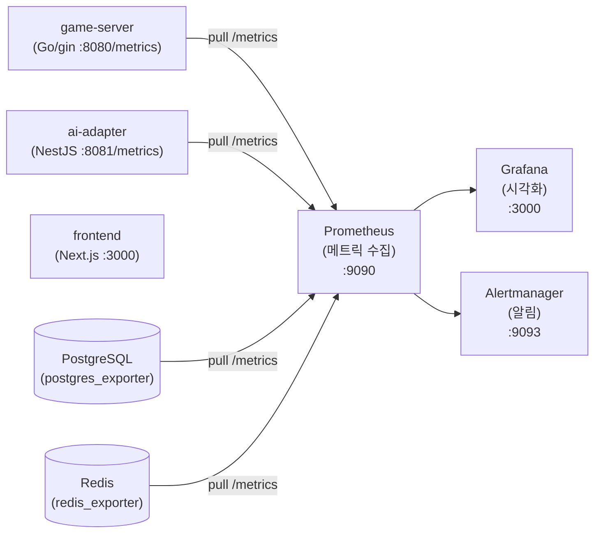

# Prometheus 매뉴얼

## 1. 개요

Prometheus는 시계열(time-series) 메트릭 수집 및 저장 엔진이다.
RummiArena에서는 game-server(Go/gin)와 ai-adapter(NestJS)가 `/metrics` 엔드포인트를 노출하고,
Prometheus가 주기적으로 스크랩하여 게임 성능 지표를 축적한다.

### 1.1 RummiArena에서의 역할



### 1.2 수집 대상 메트릭

| 서비스 | 주요 메트릭 | 설명 |
|--------|-----------|------|
| game-server | `rummikub_active_games` | 현재 진행 중인 게임 수 |
| game-server | `rummikub_turns_total` | 총 턴 처리 수 |
| game-server | `http_request_duration_seconds` | REST API 응답 시간 |
| game-server | `websocket_connections` | 활성 WebSocket 연결 수 |
| ai-adapter | `llm_requests_total` | LLM API 호출 총 횟수 |
| ai-adapter | `llm_duration_seconds` | LLM 응답 시간 (모델별) |
| ai-adapter | `llm_fallback_total` | Fallback(강제 드로우) 발생 수 |
| PostgreSQL | `pg_stat_activity_count` | 활성 DB 연결 수 |
| Redis | `redis_connected_clients` | Redis 클라이언트 연결 수 |

### 1.3 도입 시점

Phase 5 (Istio Service Mesh 도입과 함께). Phase 1~4는 `kubectl logs` + `kubectl top`으로 대체한다.

---

## 2. 설치

### 2.1 전제 조건

- Docker Desktop Kubernetes 활성화
- Helm 3 설치 완료
- `rummikub` 네임스페이스 존재
- ResourceQuota 여유: monitoring 네임스페이스 별도 생성 권장

### 2.2 Helm 저장소 추가

```bash
helm repo add prometheus-community https://prometheus-community.github.io/helm-charts
helm repo update
```

### 2.3 kube-prometheus-stack 설치 (Prometheus + Grafana + Alertmanager 통합)

16GB RAM 제약으로 최소 리소스 설정을 적용한다.

```bash
# monitoring 네임스페이스 생성
kubectl create namespace monitoring

# values 파일 적용 후 설치
helm install kube-prometheus-stack prometheus-community/kube-prometheus-stack \
  --namespace monitoring \
  --create-namespace \
  -f docs/00-tools/prometheus-values.yaml
```

**prometheus-values.yaml (리소스 최소화 설정):**

```yaml
# docs/00-tools/prometheus-values.yaml
prometheus:
  prometheusSpec:
    retention: 3d          # 3일치만 보관 (16GB 제약)
    retentionSize: "2GB"
    resources:
      requests:
        cpu: 100m
        memory: 256Mi
      limits:
        cpu: 500m
        memory: 512Mi
    storageSpec:
      volumeClaimTemplate:
        spec:
          accessModes: ["ReadWriteOnce"]
          resources:
            requests:
              storage: 3Gi

alertmanager:
  alertmanagerSpec:
    resources:
      requests:
        cpu: 50m
        memory: 64Mi
      limits:
        cpu: 100m
        memory: 128Mi

grafana:
  resources:
    requests:
      cpu: 50m
      memory: 128Mi
    limits:
      cpu: 200m
      memory: 256Mi

# 불필요한 컴포넌트 비활성화 (메모리 절약)
kubeEtcd:
  enabled: false
kubeControllerManager:
  enabled: false
kubeScheduler:
  enabled: false
```

### 2.4 설치 확인

```bash
kubectl get pods -n monitoring
# 예상 출력:
# alertmanager-kube-prometheus-stack-alertmanager-0   2/2  Running
# kube-prometheus-stack-grafana-xxx                   3/3  Running
# kube-prometheus-stack-operator-xxx                  1/1  Running
# prometheus-kube-prometheus-stack-prometheus-0       2/2  Running
```

---

## 3. 프로젝트 설정

### 3.1 game-server (Go/gin) Prometheus 연동

**의존성 추가 (go.mod):**

```bash
go get github.com/prometheus/client_golang/prometheus
go get github.com/prometheus/client_golang/prometheus/promhttp
go get github.com/gin-gonic/gin
```

**메트릭 정의 (`src/game-server/internal/metrics/metrics.go`):**

```go
package metrics

import "github.com/prometheus/client_golang/prometheus"

var (
    ActiveGames = prometheus.NewGauge(prometheus.GaugeOpts{
        Name: "rummikub_active_games",
        Help: "현재 진행 중인 게임 수",
    })

    TurnsTotal = prometheus.NewCounter(prometheus.CounterOpts{
        Name: "rummikub_turns_total",
        Help: "총 턴 처리 횟수",
    })

    WebSocketConns = prometheus.NewGauge(prometheus.GaugeOpts{
        Name: "rummikub_websocket_connections",
        Help: "활성 WebSocket 연결 수",
    })

    HTTPDuration = prometheus.NewHistogramVec(prometheus.HistogramOpts{
        Name:    "rummikub_http_request_duration_seconds",
        Help:    "HTTP 요청 응답 시간",
        Buckets: []float64{0.01, 0.05, 0.1, 0.25, 0.5, 1.0, 2.5},
    }, []string{"method", "path", "status"})
)

func Init() {
    prometheus.MustRegister(ActiveGames, TurnsTotal, WebSocketConns, HTTPDuration)
}
```

**라우터에 `/metrics` 엔드포인트 추가 (`src/game-server/internal/handler/router.go`):**

```go
import (
    "github.com/prometheus/client_golang/prometheus/promhttp"
    ginmetrics "github.com/gin-gonic/gin"
)

func SetupRouter(r *gin.Engine) {
    // Prometheus 메트릭 엔드포인트
    r.GET("/metrics", gin.WrapH(promhttp.Handler()))

    // 헬스체크
    r.GET("/health", healthHandler)
    r.GET("/ready", readyHandler)

    // 게임 API
    api := r.Group("/api/v1")
    // ...
}
```

### 3.2 ai-adapter (NestJS) Prometheus 연동

**의존성 추가:**

```bash
cd src/ai-adapter
npm install @willsoto/nestjs-prometheus prom-client
```

**모듈 등록 (`src/ai-adapter/src/app.module.ts`):**

```typescript
import { PrometheusModule } from '@willsoto/nestjs-prometheus';

@Module({
  imports: [
    PrometheusModule.register({
      defaultMetrics: {
        enabled: true,
      },
      path: '/metrics',
    }),
    // ...
  ],
})
export class AppModule {}
```

**LLM 전용 메트릭 (`src/ai-adapter/src/metrics/llm.metrics.ts`):**

```typescript
import { makeCounterProvider, makeHistogramProvider } from '@willsoto/nestjs-prometheus';

export const llmRequestsTotal = makeCounterProvider({
  name: 'llm_requests_total',
  help: 'LLM API 호출 총 횟수',
  labelNames: ['model', 'status'],
});

export const llmDurationSeconds = makeHistogramProvider({
  name: 'llm_duration_seconds',
  help: 'LLM 응답 시간 (초)',
  labelNames: ['model'],
  buckets: [0.5, 1, 2, 5, 10, 30],
});

export const llmFallbackTotal = makeCounterProvider({
  name: 'llm_fallback_total',
  help: 'Fallback(강제 드로우) 발생 횟수',
  labelNames: ['reason'],
});
```

### 3.3 ServiceMonitor CRD (자동 스크랩 설정)

kube-prometheus-stack이 설치되면 ServiceMonitor CRD를 사용할 수 있다.
Prometheus Operator가 ServiceMonitor를 감지하여 자동으로 스크랩 대상을 구성한다.

```yaml
# helm/charts/game-server/templates/service-monitor.yaml
apiVersion: monitoring.coreos.com/v1
kind: ServiceMonitor
metadata:
  name: game-server
  namespace: rummikub
  labels:
    release: kube-prometheus-stack   # Prometheus Operator가 찾는 레이블
spec:
  selector:
    matchLabels:
      app: game-server
  namespaceSelector:
    matchNames:
      - rummikub
  endpoints:
    - port: http
      path: /metrics
      interval: 15s
```

```yaml
# helm/charts/ai-adapter/templates/service-monitor.yaml
apiVersion: monitoring.coreos.com/v1
kind: ServiceMonitor
metadata:
  name: ai-adapter
  namespace: rummikub
  labels:
    release: kube-prometheus-stack
spec:
  selector:
    matchLabels:
      app: ai-adapter
  namespaceSelector:
    matchNames:
      - rummikub
  endpoints:
    - port: http
      path: /metrics
      interval: 15s
```

### 3.4 Traefik Ingress로 Prometheus UI 노출 (선택)

```yaml
# argocd/ingress-route-monitoring.yaml
apiVersion: traefik.io/v1alpha1
kind: IngressRoute
metadata:
  name: prometheus
  namespace: monitoring
spec:
  entryPoints:
    - web
  routes:
    - match: Host(`prometheus.localhost`)
      kind: Rule
      services:
        - name: kube-prometheus-stack-prometheus
          port: 9090
```

---

## 4. 주요 명령어 / 사용법

### 4.1 Prometheus UI 접근

```bash
# port-forward 방식
kubectl port-forward svc/kube-prometheus-stack-prometheus -n monitoring 9090:9090

# 브라우저: http://localhost:9090
```

### 4.2 메트릭 쿼리 예시 (PromQL)

```promql
# 현재 활성 게임 수
rummikub_active_games

# API 엔드포인트별 평균 응답 시간 (최근 5분)
rate(rummikub_http_request_duration_seconds_sum[5m])
/ rate(rummikub_http_request_duration_seconds_count[5m])

# LLM 모델별 호출 비율 (최근 1분)
rate(llm_requests_total[1m])

# LLM Fallback 비율
rate(llm_fallback_total[5m]) / rate(llm_requests_total[5m])

# WebSocket 연결 수 추이
rummikub_websocket_connections

# 게임 서버 에러율 (5xx)
rate(rummikub_http_request_duration_seconds_count{status=~"5.."}[5m])
/ rate(rummikub_http_request_duration_seconds_count[5m])
```

### 4.3 스크랩 상태 확인

```bash
# Prometheus UI > Status > Targets 에서 확인
# 또는 CLI로 확인
kubectl exec -n monitoring prometheus-kube-prometheus-stack-prometheus-0 -- \
  wget -qO- http://localhost:9090/api/v1/targets | jq '.data.activeTargets[] | .labels.job'
```

### 4.4 Alertmanager 확인

```bash
kubectl port-forward svc/kube-prometheus-stack-alertmanager -n monitoring 9093:9093
# 브라우저: http://localhost:9093
```

---

## 5. 트러블슈팅

| 문제 | 원인 | 해결 |
|------|------|------|
| ServiceMonitor가 인식되지 않음 | `release` 레이블 불일치 | `kubectl get prometheus -n monitoring -o yaml`로 `serviceMonitorSelector` 확인 후 레이블 맞춤 |
| `/metrics` 404 에러 | 앱에서 엔드포인트 미노출 | game-server: `promhttp.Handler()` 등록 확인, ai-adapter: `PrometheusModule.register()` 확인 |
| Prometheus OOM | 보존 기간/데이터 과다 | `retention: 3d`, `retentionSize: "2GB"` 설정 확인 |
| Pod 미기동 (메모리 부족) | 16GB 교대 실행 위반 | CI/Deploy 모드 서비스 중지 후 monitoring 기동 |
| 스크랩 타임아웃 | LLM 응답 느림 | `scrapeTimeout: 30s` 로 조정 (기본 10s) |
| Target `down` 상태 | 네임스페이스 간 RBAC | ServiceMonitor `namespaceSelector` 확인, Prometheus RBAC 점검 |

---

## 6. 참고 링크

- 공식 문서: https://prometheus.io/docs/
- kube-prometheus-stack Helm Chart: https://github.com/prometheus-community/helm-charts/tree/main/charts/kube-prometheus-stack
- Go client_golang: https://github.com/prometheus/client_golang
- NestJS Prometheus (@willsoto): https://github.com/willsoto/nestjs-prometheus
- PromQL 치트시트: https://promlabs.com/promql-cheat-sheet/
