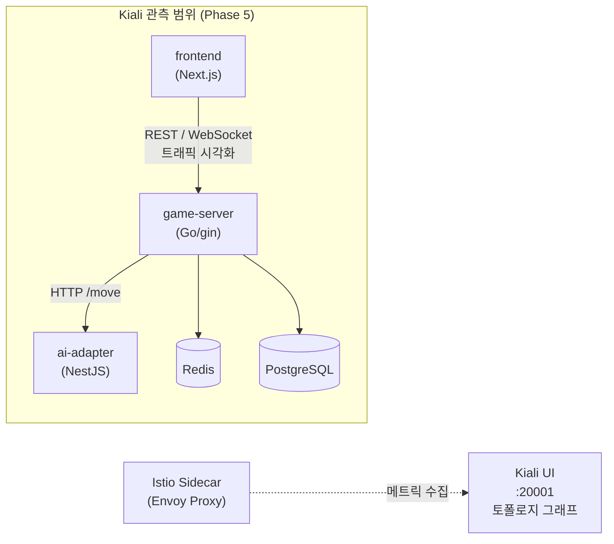
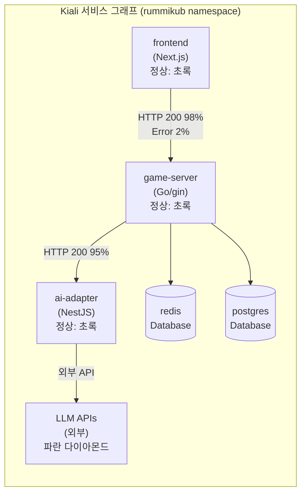

# Kiali 매뉴얼

## 1. 개요

Kiali는 Istio Service Mesh의 관측성(Observability) 콘솔이다.
서비스 간 트래픽 흐름을 실시간 토폴로지 그래프로 시각화하고,
각 서비스의 Health, 트래픽 비율, 에러율을 한 화면에서 확인할 수 있다.

RummiArena에서는 Phase 5 Istio 도입과 함께 `frontend → game-server → ai-adapter → LLM API`
호출 체인을 시각화하고, 서비스 간 통신 오류를 조기에 감지하는 데 활용한다.

### 1.1 RummiArena에서의 역할



### 1.2 Kiali가 제공하는 정보

| 기능 | 설명 |
|------|------|
| 서비스 그래프 | 서비스 간 트래픽 흐름, 요청 수, 에러율 실시간 표시 |
| Health 상태 | 각 서비스의 정상/경고/오류 상태 (Workload, Service, App) |
| Traffic Metrics | Istio Envoy 프록시가 수집한 HTTP/gRPC 지표 |
| Istio Config | VirtualService, DestinationRule 설정 검증 |
| Tracing 연동 | Jaeger 연동 시 개별 요청 트레이스로 드릴다운 |

### 1.3 도입 시점

Phase 5 (Istio Service Mesh 도입 시 함께 설치).
Phase 1~4는 Traefik Dashboard와 `kubectl describe` 로 대체한다.

---

## 2. 설치

### 2.1 전제 조건

- Istio 설치 완료 (`istioctl` 또는 `helm install istio-base, istiod`)
- `rummikub` 네임스페이스에 Istio sidecar injection 활성화
- Prometheus 설치 완료 (Kiali가 메트릭 데이터 소스로 사용)

```bash
# Istio sidecar injection 활성화 확인
kubectl get namespace rummikub --show-labels | grep istio-injection
# 출력 예: istio-injection=enabled

# 미활성화 시
kubectl label namespace rummikub istio-injection=enabled
```

### 2.2 Helm으로 설치

```bash
helm repo add kiali https://kiali.org/helm-charts
helm repo update

kubectl create namespace istio-system  # Istio 설치 시 이미 존재할 수 있음

helm install kiali-server kiali/kiali-server \
  --namespace istio-system \
  -f docs/00-tools/kiali-values.yaml
```

**kiali-values.yaml (리소스 최소화):**

```yaml
# docs/00-tools/kiali-values.yaml
auth:
  strategy: anonymous   # 로컬 개발 환경: 인증 없이 접근

deployment:
  resources:
    requests:
      cpu: 50m
      memory: 64Mi
    limits:
      cpu: 200m
      memory: 256Mi

external_services:
  prometheus:
    url: "http://kube-prometheus-stack-prometheus.monitoring.svc.cluster.local:9090"
  tracing:
    enabled: true
    in_cluster_url: "http://jaeger-query.monitoring.svc.cluster.local:16686"
    use_grpc: false
  grafana:
    enabled: true
    in_cluster_url: "http://kube-prometheus-stack-grafana.monitoring.svc.cluster.local:80"
    url: "http://grafana.localhost"
```

### 2.3 설치 확인

```bash
kubectl get pods -n istio-system -l app=kiali
# 예상 출력:
# kiali-xxx   1/1   Running

kubectl get svc -n istio-system kiali
# ClusterIP:20001
```

### 2.4 Traefik Ingress로 Kiali UI 노출

```yaml
# argocd/ingress-route-monitoring.yaml에 추가
apiVersion: traefik.io/v1alpha1
kind: IngressRoute
metadata:
  name: kiali
  namespace: istio-system
spec:
  entryPoints:
    - web
  routes:
    - match: Host(`kiali.localhost`)
      kind: Rule
      services:
        - name: kiali
          port: 20001
```

```bash
kubectl apply -f argocd/ingress-route-monitoring.yaml
# 이후 http://kiali.localhost 접근 가능
```

---

## 3. 프로젝트 설정

### 3.1 rummikub 네임스페이스 Istio 설정

Istio sidecar가 주입되면 각 Pod에 Envoy 프록시 컨테이너가 추가된다.
기존 Helm Chart의 Deployment에 별도 수정 없이 네임스페이스 레이블만으로 자동 주입된다.

```bash
# sidecar injection 활성화 후 Pod 재기동
kubectl rollout restart deployment -n rummikub

# sidecar 주입 확인 (READY가 1/1 → 2/2로 변경됨)
kubectl get pods -n rummikub
# 예:
# game-server-xxx    2/2   Running   # app 컨테이너 + envoy sidecar
# ai-adapter-xxx     2/2   Running
# frontend-xxx       2/2   Running
```

### 3.2 RummiArena 서비스 그래프 해석



**그래프 아이콘 색상:**

| 색상 | 의미 |
|------|------|
| 초록 | 정상 (에러율 < 1%) |
| 노랑 | 경고 (에러율 1~5%) |
| 빨강 | 오류 (에러율 > 5% 또는 응답 없음) |
| 파랑 | 외부 서비스 (클러스터 외부) |

### 3.3 Istio VirtualService 설정 (선택)

게임 서버 트래픽에 재시도 정책과 타임아웃을 적용한다.

```yaml
# helm/charts/game-server/templates/virtual-service.yaml
apiVersion: networking.istio.io/v1beta1
kind: VirtualService
metadata:
  name: game-server
  namespace: rummikub
spec:
  hosts:
    - game-server
  http:
    - timeout: 10s
      retries:
        attempts: 3
        perTryTimeout: 3s
        retryOn: 5xx,gateway-error,connect-failure
      route:
        - destination:
            host: game-server
            port:
              number: 8080
```

```yaml
# ai-adapter VirtualService (LLM 응답 지연 대비 타임아웃 30s)
apiVersion: networking.istio.io/v1beta1
kind: VirtualService
metadata:
  name: ai-adapter
  namespace: rummikub
spec:
  hosts:
    - ai-adapter
  http:
    - timeout: 30s
      retries:
        attempts: 3
        perTryTimeout: 10s
      route:
        - destination:
            host: ai-adapter
            port:
              number: 8081
```

### 3.4 Kiali에서 Istio Config 검증

Kiali UI에서 잘못된 VirtualService/DestinationRule 설정을 자동으로 감지한다.

```
Kiali UI > Istio Config > 상태 아이콘 확인
- 체크 아이콘 (초록): 설정 정상
- 경고 아이콘 (노랑): 권장하지 않는 설정
- 오류 아이콘 (빨강): 설정 오류 (트래픽 중단 위험)
```

---

## 4. 주요 명령어 / 사용법

### 4.1 Kiali UI 접근

```bash
# port-forward 방식
kubectl port-forward svc/kiali -n istio-system 20001:20001

# 브라우저: http://localhost:20001
# 또는 Traefik Ingress: http://kiali.localhost
```

### 4.2 Kiali CLI (kialictl)

```bash
# kialictl 설치 (선택)
curl -L https://github.com/kiali/kiali/releases/latest/download/kialictl-linux-amd64 \
  -o kialictl && chmod +x kialictl
sudo mv kialictl /usr/local/bin/

# 서비스 그래프 요약 출력
kialictl graph --namespace rummikub

# 네임스페이스 Health 확인
kialictl namespace list
```

### 4.3 Kiali API로 데이터 조회

```bash
# Kiali port-forward 활성화 상태에서

# 네임스페이스 서비스 목록
curl -s http://localhost:20001/api/namespaces/rummikub/services | jq '.services[].name'

# 서비스 Health 확인
curl -s http://localhost:20001/api/namespaces/rummikub/services/game-server/health | jq .

# 트래픽 그래프 데이터
curl -s "http://localhost:20001/api/namespaces/rummikub/graph?duration=1m&graphType=workload" | jq .
```

### 4.4 자주 사용하는 Kiali UI 메뉴

| 메뉴 경로 | 용도 |
|----------|------|
| Graph > Namespace: rummikub | 실시간 서비스 토폴로지 |
| Workloads > game-server | Pod 로그, 메트릭, Trace 드릴다운 |
| Services > ai-adapter | 요청 비율, 에러율, 응답 시간 |
| Istio Config | VirtualService/DestinationRule 검증 |

---

## 5. 트러블슈팅

| 문제 | 원인 | 해결 |
|------|------|------|
| 서비스 그래프에 트래픽 없음 | sidecar 미주입 | `kubectl get pods -n rummikub`에서 READY `2/2` 확인, 미주입 시 `kubectl rollout restart` |
| Kiali UI 로드 불가 | Prometheus 연결 실패 | `kiali-values.yaml`의 Prometheus URL 확인 |
| 외부 LLM API가 그래프에 미표시 | Istio가 외부 서비스를 모름 | ServiceEntry CRD로 외부 도메인 등록 |
| Pod READY `1/2` 상태 | sidecar crash | `kubectl logs <pod> -c istio-proxy -n rummikub` 로 Envoy 로그 확인 |
| `auth strategy: anonymous` 경고 | 프로덕션 환경 부적합 | 로컬 개발 전용이므로 무시, 실제 운영 시 OIDC 설정 |
| Kiali OOM | 리소스 limits 부족 | `limits.memory: 256Mi` → `512Mi` 로 조정 |

---

## 6. 참고 링크

- 공식 문서: https://kiali.io/docs/
- Kiali Helm Chart: https://kiali.org/helm-charts
- Istio 공식 문서: https://istio.io/latest/docs/
- VirtualService 레퍼런스: https://istio.io/latest/docs/reference/config/networking/virtual-service/
- RummiArena Istio 설계: `docs/02-design/01-architecture.md` (Phase 5 섹션)
