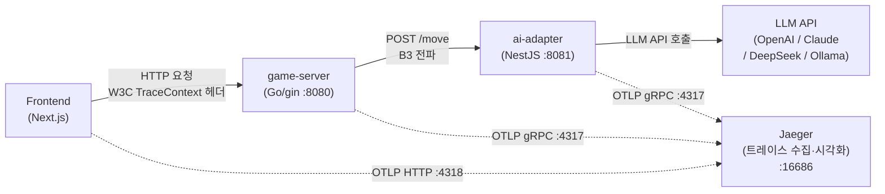
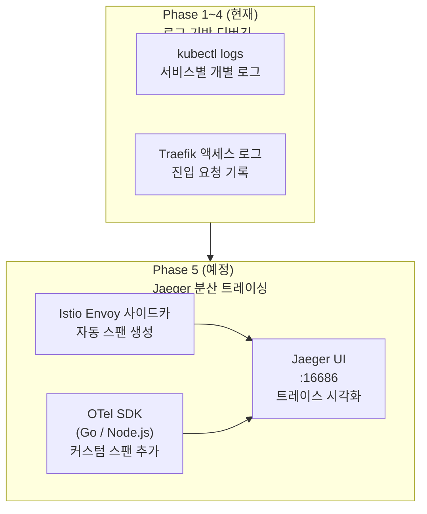
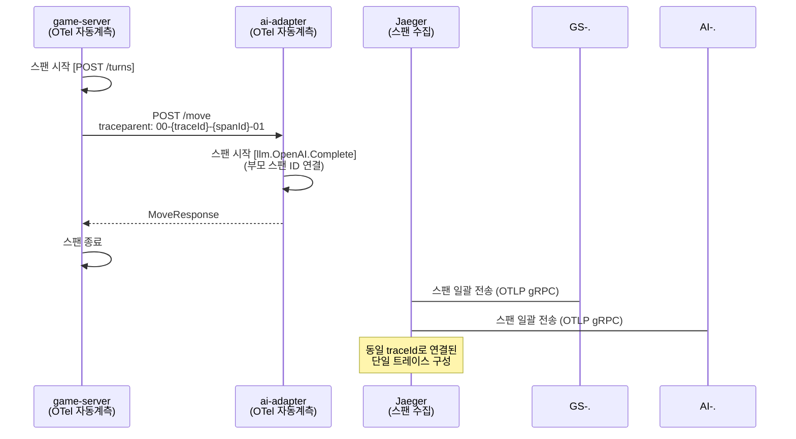

# Jaeger 분산 트레이싱 매뉴얼

## 1. 개요

Jaeger는 CNCF(Cloud Native Computing Foundation) 프로젝트로, 마이크로서비스 환경에서 개별 요청이 여러 서비스를 거치는 경로를 추적(Tracing)하는 분산 트레이싱 플랫폼이다.
OpenTelemetry(OTel) 표준 기반으로 스팬(Span)을 수집·저장·시각화하며, 성능 병목과 오류 전파 경로를 추적하는 데 사용한다.

### 1.1 RummiArena에서의 역할

게임 한 턴이 처리되는 동안 `Frontend → game-server → ai-adapter → LLM API`에 이르는 요청 체인 전체를 단일 트레이스(Trace)로 연결하여 각 구간의 지연 시간과 오류 발생 위치를 파악한다.



### 1.2 수집 대상 스팬

| 서비스 | 스팬 이름 예시 | 설명 |
|--------|--------------|------|
| game-server | `POST /api/v1/games/{id}/turns` | 턴 처리 REST 요청 전체 |
| game-server | `engine.ValidateMove` | 게임 엔진 유효성 검증 |
| game-server | `redis.GetGameState` | Redis에서 게임 상태 조회 |
| game-server | `ai-adapter.RequestMove` | ai-adapter HTTP 호출 |
| ai-adapter | `llm.OpenAI.Complete` | OpenAI API 호출 |
| ai-adapter | `llm.Claude.Complete` | Anthropic API 호출 |
| ai-adapter | `llm.DeepSeek.Complete` | DeepSeek API 호출 |
| ai-adapter | `llm.Ollama.Complete` | 로컬 Ollama 호출 |

### 1.3 도입 시점과 전략

Phase 5 (Istio Service Mesh 도입과 함께). Istio Envoy 사이드카가 서비스 간 트래픽을 자동으로 계측하여 스팬을 생성하므로, 애플리케이션 코드 수정 없이 기본 트레이싱이 가능하다.
Phase 1~4에서는 `kubectl logs`와 Traefik 액세스 로그로 대체한다.



---

## 2. 설치

### 2.1 전제 조건

- Docker Desktop Kubernetes 활성화
- `rummikub` 네임스페이스 존재
- Istio 설치 완료 (Phase 5 시나리오 기준)
- **RAM 예산**: Jaeger all-in-one ~150MB (최소 프로파일 기준)

> **16GB RAM 제약**: Jaeger all-in-one 이미지(수집기 + 스토리지 + UI 통합)를 사용한다.
> Elasticsearch 백엔드는 메모리 과다 소모로 사용하지 않는다. 인메모리 스토리지로 단기 트레이스만 보관한다.

### 2.2 로컬 테스트 (Docker Compose — Phase 1~4에서 단독 실행)

Phase 5 이전에 로컬에서 Jaeger를 빠르게 체험하거나 ai-adapter 개발 중 LLM 호출을 추적할 때 사용한다.
K8s 없이 Docker만으로 실행 가능하다.

```bash
# Jaeger all-in-one 컨테이너 실행
docker run -d \
  --name jaeger \
  -p 16686:16686 \   # Jaeger UI
  -p 4317:4317 \     # OTLP gRPC 수신
  -p 4318:4318 \     # OTLP HTTP 수신
  -p 6831:6831/udp \ # Jaeger Thrift (Istio 호환)
  -e COLLECTOR_OTLP_ENABLED=true \
  jaegertracing/all-in-one:1.57

# UI 접근: http://localhost:16686
```

### 2.3 Kubernetes 설치 (Helm — Phase 5)

```bash
helm repo add jaegertracing https://jaegertracing.github.io/helm-charts
helm repo update

# monitoring 네임스페이스에 설치 (Prometheus와 동일 네임스페이스)
helm install jaeger jaegertracing/jaeger \
  --namespace monitoring \
  --create-namespace \
  -f docs/00-tools/jaeger-values.yaml
```

**jaeger-values.yaml (인메모리 스토리지, 리소스 최소화):**

```yaml
# docs/00-tools/jaeger-values.yaml

# all-in-one 모드: Collector + Query + UI 통합 (메모리 절약)
allInOne:
  enabled: true
  image:
    tag: "1.57.0"
  resources:
    requests:
      cpu: 50m
      memory: 128Mi
    limits:
      cpu: 200m
      memory: 256Mi
  # 인메모리 스토리지: 트레이스 최대 50,000개 보관
  args:
    - "--memory.max-traces=50000"
  ingress:
    enabled: false  # Traefik IngressRoute로 별도 노출

# Collector, Query, Agent를 별도 배포하지 않음 (all-in-one이 통합)
collector:
  enabled: false
query:
  enabled: false
agent:
  enabled: false

# OTLP 수신 활성화
collector:
  otlp:
    grpc:
      enabled: true
      port: 4317
    http:
      enabled: true
      port: 4318
```

### 2.4 설치 확인

```bash
kubectl get pods -n monitoring -l app.kubernetes.io/name=jaeger
# 예상 출력:
# jaeger-all-in-one-xxx   1/1   Running

kubectl get svc -n monitoring | grep jaeger
# jaeger-all-in-one   ClusterIP   <IP>   16686/TCP,4317/TCP,4318/TCP,6831/UDP
```

### 2.5 Traefik IngressRoute로 Jaeger UI 노출

```yaml
# argocd/ingress-route-monitoring.yaml에 추가
apiVersion: traefik.io/v1alpha1
kind: IngressRoute
metadata:
  name: jaeger
  namespace: monitoring
spec:
  entryPoints:
    - web
  routes:
    - match: Host(`jaeger.localhost`)
      kind: Rule
      services:
        - name: jaeger-all-in-one
          port: 16686
```

```bash
kubectl apply -f argocd/ingress-route-monitoring.yaml
# 이후 http://jaeger.localhost 접근 가능
```

---

## 3. 프로젝트 설정

### 3.1 Istio 자동 트레이싱 설정

Istio가 설치된 환경에서는 Envoy 사이드카가 서비스 간 요청을 자동으로 계측한다.
Jaeger 엔드포인트를 Istio 설치 시 지정하면 추가 코드 수정 없이 기본 스팬이 생성된다.

```bash
# Istio 설치 시 Jaeger 엔드포인트 지정
istioctl install --set profile=minimal \
  --set values.pilot.traceSampling=100.0 \
  --set values.meshConfig.enableTracing=true \
  --set "values.meshConfig.defaultConfig.tracing.zipkin.address=jaeger-all-in-one.monitoring.svc.cluster.local:9411"
```

> `traceSampling=100.0`은 로컬 개발 전용이다. 프로덕션에서는 1.0~10.0으로 낮춘다.

### 3.2 game-server (Go) OpenTelemetry 설정

Istio 자동 스팬 외에, 게임 엔진 내부 로직(유효성 검증, Redis 조회 등)의 세부 스팬을 추가하려면 OTel SDK를 사용한다.

**의존성 추가 (`src/game-server/go.mod`):**

```bash
cd src/game-server
go get go.opentelemetry.io/otel
go get go.opentelemetry.io/otel/sdk/trace
go get go.opentelemetry.io/otel/exporters/otlp/otlptrace/otlptracegrpc
go get go.opentelemetry.io/contrib/instrumentation/github.com/gin-gonic/gin/otelgin
```

**트레이서 초기화 (`src/game-server/internal/telemetry/tracer.go`):**

```go
package telemetry

import (
    "context"
    "go.opentelemetry.io/otel"
    "go.opentelemetry.io/otel/exporters/otlp/otlptrace/otlptracegrpc"
    "go.opentelemetry.io/otel/sdk/resource"
    sdktrace "go.opentelemetry.io/otel/sdk/trace"
    semconv "go.opentelemetry.io/otel/semconv/v1.21.0"
    "google.golang.org/grpc"
)

func InitTracer(ctx context.Context, endpoint string) (*sdktrace.TracerProvider, error) {
    exporter, err := otlptracegrpc.New(ctx,
        otlptracegrpc.WithEndpoint(endpoint),    // "jaeger-all-in-one.monitoring.svc.cluster.local:4317"
        otlptracegrpc.WithInsecure(),
        otlptracegrpc.WithDialOption(grpc.WithBlock()),
    )
    if err != nil {
        return nil, err
    }

    res := resource.NewWithAttributes(
        semconv.SchemaURL,
        semconv.ServiceName("game-server"),
        semconv.ServiceVersion("1.0.0"),
        semconv.DeploymentEnvironment("local"),
    )

    tp := sdktrace.NewTracerProvider(
        sdktrace.WithBatcher(exporter),
        sdktrace.WithResource(res),
        sdktrace.WithSampler(sdktrace.AlwaysSample()), // 로컬: 100% 샘플링
    )

    otel.SetTracerProvider(tp)
    return tp, nil
}
```

**gin 미들웨어 등록 (`src/game-server/internal/handler/router.go`):**

```go
import "go.opentelemetry.io/contrib/instrumentation/github.com/gin-gonic/gin/otelgin"

func SetupRouter(r *gin.Engine) {
    // OTel 자동 계측 미들웨어
    r.Use(otelgin.Middleware("game-server"))

    r.GET("/health", healthHandler)
    r.GET("/ready", readyHandler)

    api := r.Group("/api/v1")
    // ...
}
```

**게임 엔진 내부 스팬 추가 예시 (`src/game-server/internal/engine/validator.go`):**

```go
import (
    "context"
    "go.opentelemetry.io/otel"
)

var tracer = otel.Tracer("game-server/engine")

func (e *Engine) ValidateMove(ctx context.Context, move Move) (bool, error) {
    // 커스텀 스팬: 유효성 검증 구간 추적
    ctx, span := tracer.Start(ctx, "engine.ValidateMove")
    defer span.End()

    span.SetAttributes(
        attribute.String("game.id", move.GameID),
        attribute.String("player.id", move.PlayerID),
        attribute.String("move.type", string(move.Type)),
    )

    // 유효성 검증 로직 ...
    return true, nil
}
```

### 3.3 ai-adapter (NestJS) OpenTelemetry 설정

**의존성 추가:**

```bash
cd src/ai-adapter
npm install @opentelemetry/sdk-node \
            @opentelemetry/exporter-trace-otlp-grpc \
            @opentelemetry/auto-instrumentations-node \
            @opentelemetry/resources \
            @opentelemetry/semantic-conventions
```

**트레이서 초기화 (`src/ai-adapter/src/telemetry/tracer.ts`):**

```typescript
import { NodeSDK } from '@opentelemetry/sdk-node';
import { OTLPTraceExporter } from '@opentelemetry/exporter-trace-otlp-grpc';
import { getNodeAutoInstrumentations } from '@opentelemetry/auto-instrumentations-node';
import { Resource } from '@opentelemetry/resources';
import { SEMRESATTRS_SERVICE_NAME } from '@opentelemetry/semantic-conventions';

export function initTracer(): NodeSDK {
  const sdk = new NodeSDK({
    resource: new Resource({
      [SEMRESATTRS_SERVICE_NAME]: 'ai-adapter',
    }),
    traceExporter: new OTLPTraceExporter({
      url: process.env.OTEL_EXPORTER_OTLP_ENDPOINT || 'http://localhost:4317',
    }),
    instrumentations: [
      getNodeAutoInstrumentations({
        // HTTP, Express, gRPC 자동 계측 포함
        '@opentelemetry/instrumentation-fs': { enabled: false }, // 불필요한 파일 스팬 제외
      }),
    ],
  });

  sdk.start();
  return sdk;
}
```

**LLM 어댑터 스팬 추가 예시 (`src/ai-adapter/src/adapters/openai.adapter.ts`):**

```typescript
import { trace, SpanStatusCode } from '@opentelemetry/api';

const tracer = trace.getTracer('ai-adapter');

export class OpenAIAdapter implements LLMAdapter {
  async requestMove(req: MoveRequest): Promise<MoveResponse> {
    return tracer.startActiveSpan('llm.OpenAI.Complete', async (span) => {
      span.setAttributes({
        'llm.model': req.model,
        'llm.player_id': req.playerId,
        'game.id': req.gameId,
        'game.turn': req.turnNumber,
      });

      try {
        const response = await this.openai.chat.completions.create({ /* ... */ });
        span.setStatus({ code: SpanStatusCode.OK });
        return this.parseResponse(response);
      } catch (error) {
        span.setStatus({ code: SpanStatusCode.ERROR, message: String(error) });
        span.recordException(error as Error);
        throw error;
      } finally {
        span.end();
      }
    });
  }
}
```

### 3.4 트레이스 컨텍스트 전파

`game-server`가 `ai-adapter`를 HTTP로 호출할 때 W3C TraceContext 헤더를 전달하여 단일 트레이스로 연결한다.
OTel SDK의 HTTP 자동 계측을 활성화하면 헤더 주입/추출이 자동으로 처리된다.



### 3.5 환경 변수 설정 (K8s Secret / ConfigMap)

```yaml
# helm/charts/game-server/templates/deployment.yaml 환경 변수 섹션
env:
  - name: OTEL_EXPORTER_OTLP_ENDPOINT
    value: "jaeger-all-in-one.monitoring.svc.cluster.local:4317"
  - name: OTEL_SERVICE_NAME
    value: "game-server"
  - name: OTEL_TRACES_SAMPLER
    value: "always_on"   # 로컬 개발: 100% 샘플링
```

```yaml
# helm/charts/ai-adapter/templates/deployment.yaml 환경 변수 섹션
env:
  - name: OTEL_EXPORTER_OTLP_ENDPOINT
    value: "http://jaeger-all-in-one.monitoring.svc.cluster.local:4317"
  - name: OTEL_SERVICE_NAME
    value: "ai-adapter"
  - name: OTEL_TRACES_SAMPLER
    value: "always_on"
```

### 3.6 리소스 예산 (16GB 환경)

| 구성 요소 | 메모리 사용량 | 비고 |
|----------|------------|------|
| Jaeger all-in-one | ~150MB | 인메모리 스토리지, 트레이스 50,000개 상한 |
| OTel SDK (game-server, Go) | ~10MB | SDK 오버헤드 |
| OTel SDK (ai-adapter, Node.js) | ~20MB | SDK + 자동계측 |
| Istio Envoy 스팬 생성 | 추가 없음 | 기존 Envoy 메모리에 포함 |
| **Jaeger 총합** | **~180MB** | Prometheus(~512MB)보다 가벼움 |

---

## 4. 주요 명령어 / 사용법

### 4.1 Jaeger UI 접근

```bash
# port-forward 방식 (K8s 환경)
kubectl port-forward svc/jaeger-all-in-one -n monitoring 16686:16686

# 브라우저: http://localhost:16686
# 또는 Traefik IngressRoute: http://jaeger.localhost
```

### 4.2 Jaeger UI 주요 기능

| 메뉴 | 용도 |
|------|------|
| Search > Service: game-server | 게임 서버 트레이스 목록 조회 |
| Search > Operation: engine.ValidateMove | 유효성 검증 스팬 필터 |
| Search > Min Duration: 1s | 1초 이상 소요된 느린 요청 찾기 |
| Compare | 두 트레이스의 스팬 구성 비교 |
| System Architecture | 서비스 간 의존 관계 그래프 |

### 4.3 느린 LLM 호출 추적 예시

```
Jaeger UI > Search
  - Service: ai-adapter
  - Operation: llm.OpenAI.Complete
  - Min Duration: 5s
  - Limit Results: 20

→ 결과에서 특정 트레이스 클릭
→ game-server.POST /turns → ai-adapter.llm.OpenAI.Complete 스팬 타임라인 확인
→ LLM API 응답 지연이 전체 턴 처리 시간에 미치는 영향 수치화
```

### 4.4 트레이스 API 조회 (자동화 스크립트용)

```bash
# 서비스 목록 확인
curl -s http://localhost:16686/api/services | jq '.data[]'

# 최근 20개 트레이스 조회 (game-server)
curl -s "http://localhost:16686/api/traces?service=game-server&limit=20" | jq '.data[].traceID'

# 특정 트레이스 상세 조회
curl -s "http://localhost:16686/api/traces/{traceId}" | jq '.data[0].spans | length'
```

### 4.5 Kiali 연동 (드릴다운 트레이싱)

Kiali UI에서 서비스 그래프의 특정 요청을 클릭하면 Jaeger 트레이스로 드릴다운할 수 있다.
설정은 `kiali-values.yaml`의 `external_services.tracing` 섹션에서 Jaeger URL을 지정한다 (13-kiali.md 참조).

---

## 5. 트러블슈팅

| 문제 | 원인 | 해결 |
|------|------|------|
| Jaeger UI에 트레이스 없음 | OTLP 엔드포인트 연결 실패 | `kubectl exec -n rummikub <pod> -- wget -qO- http://jaeger-all-in-one.monitoring.svc.cluster.local:14269/` 로 수신기 헬스 확인 |
| 스팬이 분리되어 표시됨 | TraceContext 헤더 미전파 | game-server의 OTel HTTP 자동계측 활성화 여부 확인. `otelgin.Middleware` 등록 확인 |
| 인메모리 스팬 유실 | Pod 재시작 또는 상한 초과 | `--memory.max-traces` 값 상향 또는 Badger 스토리지 볼륨 추가 |
| `context deadline exceeded` | OTLP gRPC 연결 타임아웃 | `WithDialOption(grpc.WithBlock())` 제거, 비동기 연결로 전환 |
| Istio 자동 스팬 없음 | `meshConfig.enableTracing: false` | `istioctl install`로 `enableTracing=true` 재설치 |
| Jaeger Pod OOMKilled | 인메모리 스토리지 과부하 | `--memory.max-traces=20000` 으로 상한 낮추거나 `limits.memory: 384Mi` 상향 |
| K8s에서 4317 포트 접근 불가 | 네임스페이스 간 NetworkPolicy | monitoring 네임스페이스 OTLP 수신 NetworkPolicy 허용 규칙 추가 |

---

## 6. 참고 링크

- Jaeger 공식 문서: https://www.jaegertracing.io/docs/
- OpenTelemetry Go SDK: https://opentelemetry.io/docs/languages/go/
- OpenTelemetry Node.js SDK: https://opentelemetry.io/docs/languages/js/getting-started/nodejs/
- OTLP 프로토콜 사양: https://opentelemetry.io/docs/specs/otlp/
- Jaeger Helm Chart: https://github.com/jaegertracing/helm-charts
- otelgin (Gin 미들웨어): https://pkg.go.dev/go.opentelemetry.io/contrib/instrumentation/github.com/gin-gonic/gin/otelgin
- W3C TraceContext 표준: https://www.w3.org/TR/trace-context/
- 프로젝트 내 관련 문서:
  - Istio 설정: `docs/00-tools/04-istio.md`
  - Kiali 연동: `docs/00-tools/13-kiali.md`
  - Prometheus 메트릭: `docs/00-tools/11-prometheus.md`
  - 아키텍처 설계: `docs/02-design/01-architecture.md`
