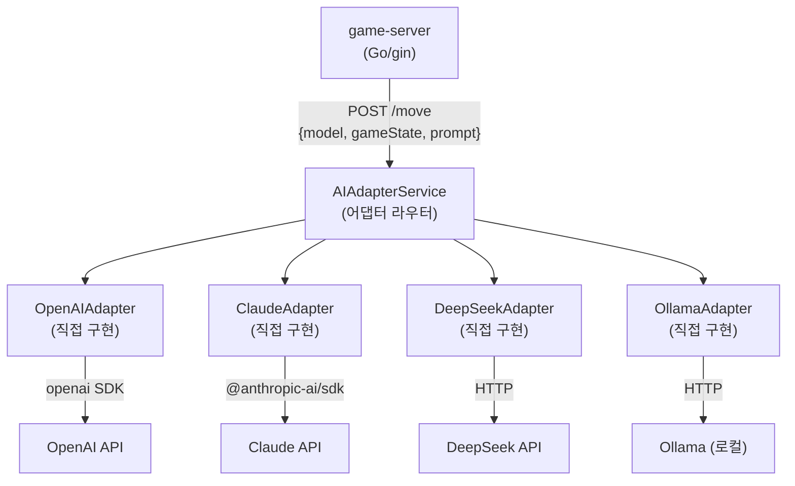
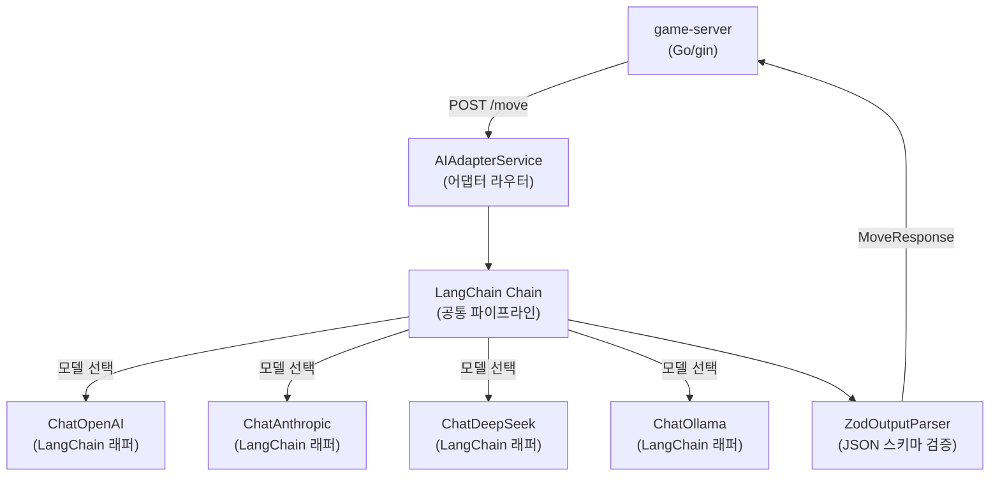
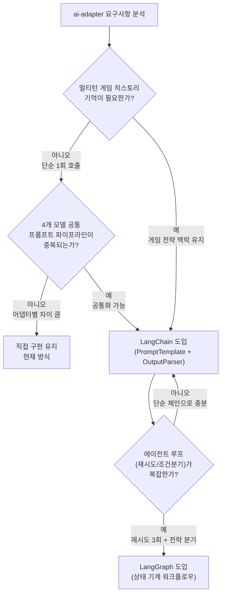

# LangChain / LangGraph 매뉴얼

> **상태: 검토 중 (Sprint 4 PoC에서 도입 여부 결정 예정)**
>
> 현재 RummiArena ai-adapter는 4개 어댑터 패턴(직접 구현)으로 동작 중이다.
> LangChain/LangGraph는 Sprint 4 PoC를 통해 실익이 있을 때에만 도입한다.
> 이 문서는 도입 검토를 위한 사전 학습 및 시나리오 분석 자료다.

---

## 1. 개요

### 1.1 LangChain이란

LangChain은 LLM 기반 애플리케이션을 구축하기 위한 오케스트레이션 프레임워크다.
프롬프트 관리, 출력 파서, 메모리, 도구 연동, 체인 구성 등 LLM 애플리케이션에서 반복되는 패턴을 추상화한다.
Python과 JavaScript/TypeScript를 모두 지원하며, RummiArena의 ai-adapter(NestJS)와는 TypeScript 버전(`langchain`, `@langchain/core`)이 관련된다.

### 1.2 LangGraph란

LangGraph는 LangChain 위에 구축된 에이전트 워크플로우 프레임워크다.
상태 기계(State Machine) 개념으로 LLM 호출 흐름을 노드(Node)와 엣지(Edge)로 표현하며,
조건 분기, 반복 루프, 멀티 에이전트 협업을 지원한다.

### 1.3 현재 ai-adapter 구조 (직접 구현)



각 어댑터는 `MoveRequest → LLM API 호출 → MoveResponse` 변환을 독립적으로 구현한다.
공통 로직(프롬프트 구성, 재시도, 응답 파싱)이 어댑터마다 중복될 수 있다.

### 1.4 LangChain 도입 시 구조 (검토 중)



---

## 2. 설치

### 2.1 전제 조건

- Node.js 20+ (ai-adapter: NestJS 환경)
- `src/ai-adapter` 디렉토리에서 실행
- Sprint 4 PoC 전에는 설치하지 않는다

### 2.2 패키지 설치 (PoC 시나리오)

**LangChain 코어 + 모델 통합:**

```bash
cd src/ai-adapter

# LangChain 코어 (모델 무관 공통 인터페이스)
npm install langchain @langchain/core

# 모델별 통합 패키지
npm install @langchain/openai      # GPT-4o
npm install @langchain/anthropic   # Claude
npm install @langchain/ollama      # Ollama (로컬)
# DeepSeek: OpenAI 호환 API이므로 @langchain/openai에 baseURL 설정으로 사용 가능
```

**LangGraph (에이전트 워크플로우, 선택):**

```bash
npm install @langchain/langgraph
```

**번들 사이즈 확인 (도입 판단 참고):**

```bash
# 설치 후 node_modules 크기 비교
du -sh node_modules/langchain node_modules/@langchain
# 도입 전 기준 대비 증가분 확인
```

### 2.3 환경 변수

```bash
# .env (K8s에서는 Secret으로 관리)
OPENAI_API_KEY=sk-...
ANTHROPIC_API_KEY=sk-ant-...
DEEPSEEK_API_KEY=sk-...
OLLAMA_BASE_URL=http://localhost:11434

# LangChain 추적 (LangSmith, 선택)
LANGCHAIN_TRACING_V2=true
LANGCHAIN_API_KEY=ls__...
LANGCHAIN_PROJECT=rummiarena-dev
```

---

## 3. 프로젝트 설정

### 3.1 LangChain 방식: 공통 Chain 구성

프롬프트 구성, 모델 호출, 출력 파싱을 체인으로 연결한다.
각 어댑터가 중복 구현하던 공통 로직이 하나의 체인으로 통합된다.

```typescript
// src/ai-adapter/src/chains/move-chain.ts
import { ChatPromptTemplate } from '@langchain/core/prompts';
import { JsonOutputParser } from '@langchain/core/output_parsers';
import { BaseChatModel } from '@langchain/core/language_models/chat_models';
import { z } from 'zod';

// MoveResponse JSON 스키마 정의
const MoveResponseSchema = z.object({
  action: z.enum(['place', 'draw']),
  tiles: z.array(z.string()).optional(),
  sets: z.array(z.array(z.string())).optional(),
  reasoning: z.string().optional(),
});

// 게임 상태 기반 프롬프트 템플릿
const movePrompt = ChatPromptTemplate.fromMessages([
  ['system', `당신은 루미큐브 AI 플레이어입니다.
캐릭터: {character} | 난이도: {difficulty} | 심리전 레벨: {psych_level}
게임 규칙을 엄격히 준수하고 JSON 형식으로만 응답하세요.`],
  ['human', `게임 상태:
- 내 타일: {my_tiles}
- 테이블 세트: {table_sets}
- 점수 보드: {scores}
- 현재 턴: {turn_number}

다음 행동을 JSON으로 결정하세요.`],
]);

// 체인 생성 함수 (모델을 주입받아 재사용)
export function createMoveChain(model: BaseChatModel) {
  return movePrompt
    .pipe(model)
    .pipe(new JsonOutputParser());
}
```

**어댑터 서비스에서 체인 사용:**

```typescript
// src/ai-adapter/src/services/ai-adapter.service.ts
import { ChatOpenAI } from '@langchain/openai';
import { ChatAnthropic } from '@langchain/anthropic';
import { ChatOllama } from '@langchain/ollama';
import { createMoveChain } from '../chains/move-chain';

@Injectable()
export class AIAdapterService {
  private readonly chains: Record<string, ReturnType<typeof createMoveChain>>;

  constructor() {
    this.chains = {
      'gpt-4o': createMoveChain(new ChatOpenAI({ model: 'gpt-4o', temperature: 0.7 })),
      'claude-3-5-sonnet': createMoveChain(new ChatAnthropic({ model: 'claude-3-5-sonnet-20241022' })),
      'deepseek-chat': createMoveChain(
        new ChatOpenAI({
          model: 'deepseek-chat',
          configuration: { baseURL: 'https://api.deepseek.com/v1' },
          apiKey: process.env.DEEPSEEK_API_KEY,
        })
      ),
      'ollama/qwen2.5:7b': createMoveChain(new ChatOllama({ model: 'qwen2.5:7b', baseUrl: process.env.OLLAMA_BASE_URL })),
    };
  }

  async requestMove(req: MoveRequest): Promise<MoveResponse> {
    const chain = this.chains[req.model];
    if (!chain) throw new Error(`Unknown model: ${req.model}`);

    return chain.invoke({
      character: req.character,
      difficulty: req.difficulty,
      psych_level: req.psychLevel,
      my_tiles: req.gameState.myTiles.join(', '),
      table_sets: JSON.stringify(req.gameState.tableSets),
      scores: JSON.stringify(req.gameState.scores),
      turn_number: req.gameState.turnNumber,
    });
  }
}
```

### 3.2 LangGraph 방식: 멀티턴 전략 워크플로우

LangGraph는 단순 체인보다 복잡한 시나리오에 적합하다.
예를 들어 "이전 턴 기억 → 전략 수립 → 행동 결정 → 유효성 확인 → 재시도" 흐름을 그래프로 표현한다.

```typescript
// src/ai-adapter/src/graphs/strategy-graph.ts
import { StateGraph, END } from '@langchain/langgraph';
import { BaseMessage } from '@langchain/core/messages';

// 게임 에이전트 상태 정의
interface GameAgentState {
  messages: BaseMessage[];
  gameState: GameState;
  proposedMove: MoveResponse | null;
  retryCount: number;
  finalMove: MoveResponse | null;
}

// 노드: 전략 수립 (이전 턴 기억 반영)
async function strategyNode(state: GameAgentState): Promise<Partial<GameAgentState>> {
  // 게임 히스토리 기반 전략 분석
  // ...
  return { proposedMove: /* LLM 호출 결과 */ null };
}

// 노드: 행동 유효성 로컬 체크 (게임 규칙 사전 검증)
async function validateNode(state: GameAgentState): Promise<Partial<GameAgentState>> {
  // 간단한 사전 검증 (game-server Engine은 최종 권위)
  if (isBasicValid(state.proposedMove, state.gameState)) {
    return { finalMove: state.proposedMove };
  }
  return { retryCount: state.retryCount + 1 };
}

// 엣지: 재시도 여부 분기
function shouldRetry(state: GameAgentState): 'retry' | typeof END {
  if (state.finalMove) return END;
  if (state.retryCount >= 3) return END; // 최대 3회 → 강제 드로우
  return 'retry';
}

// 그래프 조립
export const strategyGraph = new StateGraph<GameAgentState>({ channels: /* ... */ })
  .addNode('strategy', strategyNode)
  .addNode('validate', validateNode)
  .addEdge('__start__', 'strategy')
  .addEdge('strategy', 'validate')
  .addConditionalEdges('validate', shouldRetry, { retry: 'strategy', [END]: END })
  .compile();
```

### 3.3 메모리 (멀티턴 게임 히스토리)

LangChain의 메모리 모듈로 이전 턴 내용을 LLM 컨텍스트에 포함시킬 수 있다.

```typescript
// src/ai-adapter/src/memory/game-memory.ts
import { BufferWindowMemory } from 'langchain/memory';
import { RedisChatMessageHistory } from '@langchain/redis';

// 게임 ID별 메모리 인스턴스 생성 (Redis 기반 영속 메모리)
export function createGameMemory(gameId: string) {
  return new BufferWindowMemory({
    k: 5,  // 최근 5턴만 보관 (토큰 절약)
    returnMessages: true,
    chatHistory: new RedisChatMessageHistory({
      sessionId: `game:${gameId}:memory`,
      url: process.env.REDIS_URL || 'redis://localhost:6379',
      ttl: 3600, // 1시간 TTL (게임 종료 후 자동 소멸)
    }),
  });
}
```

---

## 4. 주요 사용법 / 직접 구현 vs LangChain vs LangGraph 비교

### 4.1 방식별 특성 비교

| 항목 | 직접 구현 (현재) | LangChain | LangGraph |
|------|----------------|-----------|-----------|
| 코드 복잡도 | 낮음 (패턴 명확) | 중간 (추상화 레이어) | 높음 (상태 기계 개념) |
| 번들 크기 | 최소 | +~5MB | +~7MB |
| 런타임 메모리 | 최소 | +~30MB | +~50MB |
| 프롬프트 재사용 | 수동 | PromptTemplate 체계화 | PromptTemplate 체계화 |
| 멀티턴 메모리 | 직접 구현 필요 | BufferMemory 내장 | 상태(State)로 관리 |
| 출력 파서 | 직접 구현 필요 | ZodOutputParser 내장 | ZodOutputParser 내장 |
| 에이전트 루프 | 직접 구현 필요 | 복잡 (AgentExecutor) | 자연스러움 (그래프) |
| 러닝 커브 | 없음 | 중간 | 높음 |
| 모델 교체 | 어댑터 클래스 교체 | baseURL/apiKey 변경 | baseURL/apiKey 변경 |
| LangSmith 관측성 | 없음 | 내장 지원 | 내장 지원 |
| 커뮤니티/생태계 | 없음 | 매우 활발 | 활발 |

### 4.2 RummiArena 활용 시나리오별 판단



| 시나리오 | 권장 방식 | 이유 |
|----------|---------|------|
| 현재 (단순 1회 호출) | 직접 구현 | 오버엔지니어링 방지 |
| 공통 프롬프트 체계화 | LangChain | PromptTemplate, OutputParser 활용 |
| 고수 캐릭터 멀티턴 전략 | LangChain + Memory | 이전 턴 맥락 유지 |
| Shark/Fox 복잡 전략 | LangGraph | 조건 분기, 재시도 루프 |
| 4개 모델 동시 토너먼트 | LangChain | 모델 추상화로 코드 단순화 |

### 4.3 도입 시 예상 이점

1. **프롬프트 중복 제거**: 4개 어댑터가 각자 구성하던 시스템 프롬프트를 `PromptTemplate`으로 단일화
2. **JSON 파싱 안정성**: `ZodOutputParser`로 스키마 기반 검증, 파싱 실패 시 자동 재요청
3. **메모리 통합**: Redis 기반 `RedisChatMessageHistory`로 게임 히스토리 저장/조회 일원화
4. **LangSmith 관측성**: 각 LLM 호출의 입력/출력/토큰 사용량을 자동 추적 (Jaeger와 별개)
5. **모델 교체 용이성**: `ChatOpenAI`, `ChatAnthropic` 등 인터페이스 통일로 모델 교체 시 코드 변경 최소화

### 4.4 도입 시 예상 단점

1. **추가 추상화 레이어**: LangChain API 변경(버전 업)에 종속. `0.x → 0.1 → 0.2` 마이그레이션 이력이 많음
2. **번들 사이즈 증가**: `langchain` + `@langchain/core` + 모델 패키지 합산 ~15MB 이상 추가
3. **러닝 커브**: `LCEL(LangChain Expression Language)` 체인 문법, LangGraph 상태 기계 개념 학습 필요
4. **디버깅 난이도 상승**: 체인 내부 흐름 추적이 직접 구현보다 어려움 (LangSmith 없이는 블랙박스)
5. **과잉 추상화 위험**: 단순한 1회 LLM 호출에 LangGraph까지 적용하면 코드가 복잡해짐

---

## 5. 트러블슈팅

| 문제 | 원인 | 해결 |
|------|------|------|
| `Cannot find module '@langchain/core'` | 패키지 미설치 | `npm install @langchain/core` 재실행 |
| JSON 파싱 실패 (`OutputParserException`) | LLM이 JSON 형식을 어김 | `JsonOutputParser` 대신 `StructuredOutputParser.fromZodSchema()` 사용, 프롬프트에 예시 JSON 추가 |
| 메모리 사용량 급증 | `BufferMemory` k 값 과다 | `BufferWindowMemory({ k: 5 })`로 제한, TTL 설정 |
| LangGraph 무한 루프 | 조건 엣지 분기 오류 | `retryCount >= 3` 상한 조건 반드시 설정 |
| `RateLimitError` 반복 | LangChain 자동 재시도가 과도하게 호출 | `maxRetries: 1` 로 재시도 횟수 제한 후 game-server 레벨에서 처리 |
| `langchain` vs `@langchain/core` 버전 충돌 | 패키지 간 peer dependency 불일치 | `npm ls langchain @langchain/core`로 버전 확인, 메이저 버전 맞춤 |
| NestJS DI 컨테이너와 Chain 충돌 | LangChain이 DI를 인식하지 못함 | Chain을 `useFactory`로 생성하여 NestJS 프로바이더로 등록 |

---

## 6. 참고 링크

- LangChain.js 공식 문서: https://js.langchain.com/docs/
- LangGraph.js 공식 문서: https://langchain-ai.github.io/langgraphjs/
- LangChain Expression Language(LCEL): https://js.langchain.com/docs/concepts/lcel/
- ZodOutputParser: https://js.langchain.com/docs/how_to/structured_output/
- RedisChatMessageHistory: https://js.langchain.com/docs/integrations/memory/redis/
- LangSmith (트레이싱): https://smith.langchain.com/
- ChatOllama: https://js.langchain.com/docs/integrations/chat/ollama/
- 프로젝트 내 관련 문서:
  - AI Adapter 설계: `docs/02-design/04-ai-adapter-design.md`
  - AI 프롬프트 템플릿: `docs/02-design/08-ai-prompt-templates.md`
  - 로컬 LLM 비교: `docs/00-tools/15-local-llm.md`
  - Jaeger 트레이싱: `docs/00-tools/14-jaeger.md`
