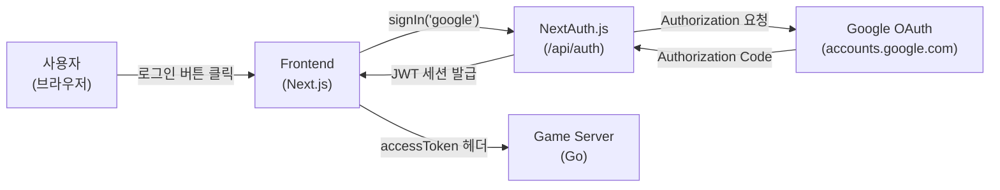
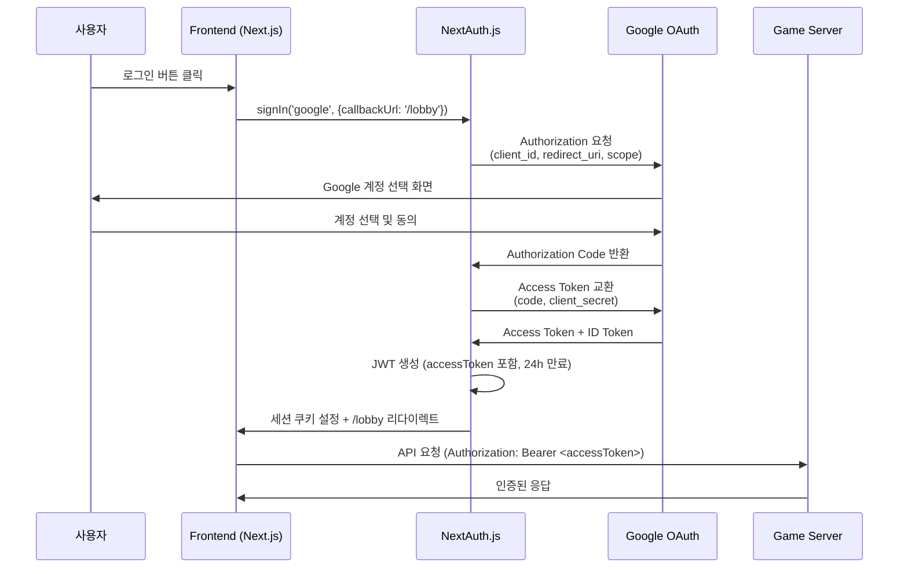

# Google OAuth 2.0 매뉴얼

## 1. 개요

Google OAuth 2.0은 RummiArena의 사용자 인증 수단이다. Next.js 프론트엔드에서 **NextAuth.js**를 통해 처리하며, Google 계정으로 1클릭 로그인을 제공한다.

### RummiArena에서의 역할



### 기술 스택

| 항목 | 내용 |
|------|------|
| 라이브러리 | NextAuth.js v4 |
| 인증 공급자 | Google OAuth 2.0 |
| 세션 전략 | JWT (stateless, 24시간 만료) |
| 적용 위치 | `src/frontend/` |
| 도입 시점 | Phase 2 |

### 주요 파일

| 파일 | 역할 |
|------|------|
| `src/frontend/src/lib/auth.ts` | NextAuth 옵션 (providers, callbacks, pages) |
| `src/frontend/src/app/api/auth/[...nextauth]/route.ts` | NextAuth API Route Handler |
| `src/frontend/src/components/providers/AuthProvider.tsx` | SessionProvider 래퍼 |
| `src/frontend/src/app/login/LoginClient.tsx` | 로그인 UI (Google 버튼) |
| `src/frontend/src/types/next-auth.d.ts` | Session / JWT 타입 확장 |

---

## 2. 설치

### 2.1 전제 조건

- Node.js 18 이상
- Next.js 15 프로젝트 초기화 완료 (`src/frontend/`)
- Google Cloud Console 계정

### 2.2 패키지 설치

```bash
cd /mnt/d/Users/KTDS/Documents/06.과제/RummiArena/src/frontend

npm install next-auth
```

현재 `package.json`에 `next-auth`가 의존성으로 포함되어 있으므로 `npm install`만으로 설치된다.

### 2.3 Google Cloud Console 설정

#### 1단계: 프로젝트 생성

1. [Google Cloud Console](https://console.cloud.google.com/) 접속
2. 상단 프로젝트 선택 드롭다운 → "새 프로젝트"
3. 프로젝트 이름: `RummiArena` (또는 원하는 이름)
4. "만들기" 클릭

#### 2단계: OAuth 동의 화면 구성

1. 좌측 메뉴 → "API 및 서비스" → "OAuth 동의 화면"
2. 사용자 유형: **외부** (테스트 계정 추가 가능)
3. 앱 정보 입력:
   - 앱 이름: `RummiArena`
   - 사용자 지원 이메일: 본인 이메일
   - 개발자 연락처 이메일: 본인 이메일
4. 범위(Scopes) 추가: `email`, `profile`, `openid` (기본값으로 충분)
5. 테스트 사용자 추가: 본인 Google 계정

#### 3단계: OAuth 2.0 클라이언트 ID 생성

1. 좌측 메뉴 → "API 및 서비스" → "사용자 인증 정보"
2. "사용자 인증 정보 만들기" → "OAuth 클라이언트 ID"
3. 애플리케이션 유형: **웹 애플리케이션**
4. 이름: `RummiArena Web`
5. 승인된 자바스크립트 원본:
   ```
   http://localhost:3000
   ```
6. 승인된 리디렉션 URI:
   ```
   http://localhost:3000/api/auth/callback/google
   ```
7. "만들기" → **클라이언트 ID**와 **클라이언트 보안 비밀번호** 복사

> K8s/프로덕션 배포 시 승인된 URI에 해당 도메인을 추가한다.
> 예: `http://rummiarena.localhost/api/auth/callback/google`

---

## 3. 프로젝트 설정

### 3.1 환경변수 설정

`.env.local` 파일 생성 (`.env.local.example` 참조):

```bash
# Google OAuth
GOOGLE_CLIENT_ID=<Google Cloud에서 복사한 클라이언트 ID>
GOOGLE_CLIENT_SECRET=<Google Cloud에서 복사한 보안 비밀번호>

# NextAuth
NEXTAUTH_URL=http://localhost:3000
NEXTAUTH_SECRET=<랜덤 시크릿 — 아래 명령으로 생성>

# Game Server
NEXT_PUBLIC_API_URL=http://localhost:8080
NEXT_PUBLIC_WS_URL=ws://localhost:8080
```

NEXTAUTH_SECRET 생성:

```bash
openssl rand -base64 32
```

### 3.2 NextAuth 옵션 (`src/lib/auth.ts`)

현재 구현 개요:

- **Google Provider**: `GOOGLE_CLIENT_ID` / `GOOGLE_CLIENT_SECRET` 환경변수가 존재할 때만 등록 (누락 시 graceful 처리)
- **JWT Callback**: 최초 로그인 시 Google `access_token`을 JWT에 저장
- **Session Callback**: `session.accessToken`을 노출하여 클라이언트에서 WebSocket 인증에 활용
- **세션 전략**: `jwt` (stateless, Redis/DB 없이 동작)
- **세션 만료**: 24시간 (`maxAge: 86400`)
- **커스텀 페이지**: 로그인 → `/login`, 에러 → `/login`

### 3.3 K8s Secret 설정

K8s 환경에서는 `.env.local` 대신 K8s Secret을 사용한다.

```bash
# Secret 생성
kubectl create secret generic rummiarena-frontend-secret \
  --namespace rummikub \
  --from-literal=GOOGLE_CLIENT_ID=<클라이언트 ID> \
  --from-literal=GOOGLE_CLIENT_SECRET=<보안 비밀번호> \
  --from-literal=NEXTAUTH_SECRET=<랜덤 시크릿>
```

Helm values.yaml에서 ConfigMap/Secret 주입:

```yaml
# helm/frontend/values.yaml
env:
  NEXTAUTH_URL: "http://rummiarena.localhost"
  NEXT_PUBLIC_API_URL: "http://api.localhost"
  NEXT_PUBLIC_WS_URL: "ws://api.localhost"

envFrom:
  - secretRef:
      name: rummiarena-frontend-secret
```

---

## 4. 주요 명령어 / 사용법

### 4.1 OAuth 인증 흐름 (시퀀스 다이어그램)



### 4.2 클라이언트에서 세션 사용

```typescript
// 클라이언트 컴포넌트
import { useSession, signIn, signOut } from "next-auth/react";

const { data: session, status } = useSession();

if (status === "loading") return <div>로딩 중...</div>;
if (status === "unauthenticated") signIn("google");

// session.user.name, session.user.email, session.user.image 사용 가능
// session.accessToken — WebSocket 인증에 활용
```

### 4.3 서버 컴포넌트에서 세션 사용

```typescript
// 서버 컴포넌트 (App Router)
import { getServerSession } from "next-auth";
import { authOptions } from "@/lib/auth";

const session = await getServerSession(authOptions);
if (!session) redirect("/login");
```

### 4.4 미들웨어로 보호 라우트 설정

`src/frontend/src/middleware.ts` 생성 예시:

```typescript
export { default } from "next-auth/middleware";

export const config = {
  matcher: ["/lobby/:path*", "/game/:path*", "/room/:path*"],
};
```

### 4.5 로그인 / 로그아웃

```typescript
import { signIn, signOut } from "next-auth/react";

// 로그인 (현재 LoginClient.tsx 구현)
await signIn("google", { callbackUrl: "/lobby" });

// 로그아웃
await signOut({ callbackUrl: "/" });
```

---

## 5. 트러블슈팅

### 5.1 "Error: redirect_uri_mismatch"

Google Cloud Console의 승인된 리디렉션 URI가 실제 콜백 URL과 다를 때 발생한다.

**확인 사항:**
- Google Cloud Console URI: `http://localhost:3000/api/auth/callback/google`
- `NEXTAUTH_URL` 환경변수: `http://localhost:3000`
- 두 값의 프로토콜/포트가 정확히 일치해야 한다.

### 5.2 "NEXTAUTH_SECRET is missing"

```bash
# .env.local에 추가
NEXTAUTH_SECRET=$(openssl rand -base64 32)
```

NEXTAUTH_SECRET은 개발/운영 환경 모두 필수다. 미설정 시 NextAuth.js가 JWT 서명을 거부한다.

### 5.3 Google Provider가 등록되지 않는 경우

`src/lib/auth.ts`에서 환경변수 존재 여부를 체크한다. `.env.local`이 올바른 위치에 있는지, 서버를 재시작했는지 확인한다.

```bash
# 환경변수 확인
echo $GOOGLE_CLIENT_ID
echo $GOOGLE_CLIENT_SECRET
```

### 5.4 K8s 환경에서 세션 쿠키 누락

Traefik이 HTTPS를 처리하는 경우, NextAuth 세션 쿠키의 `secure` 속성 때문에 HTTP에서 세션이 유지되지 않을 수 있다.

개발 환경에서는 `NEXTAUTH_URL=http://...`로 HTTP를 명시하면 쿠키에 `secure` 플래그가 붙지 않는다.

### 5.5 세션 만료 시 처리

`useSession`의 `status === "unauthenticated"` 상태에서 자동 로그인 페이지 리다이렉트가 필요하다면 `AuthProvider` 내부에서 처리하거나 미들웨어를 활용한다.

---

## 6. 참고 링크

- [NextAuth.js 공식 문서](https://next-auth.js.org/)
- [Google OAuth 2.0 개발자 문서](https://developers.google.com/identity/protocols/oauth2)
- [Google Cloud Console](https://console.cloud.google.com/)
- [NextAuth.js Google Provider](https://next-auth.js.org/providers/google)
- [Next.js App Router와 NextAuth.js](https://next-auth.js.org/configuration/initialization#route-handlers-app)
- 관련 파일: `src/frontend/src/lib/auth.ts`, `src/frontend/.env.local.example`
- 관련 설계: `docs/02-design/06-session-management.md`
