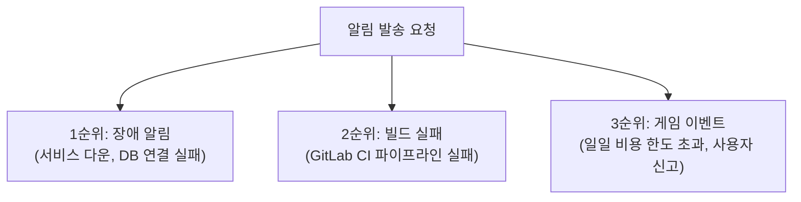
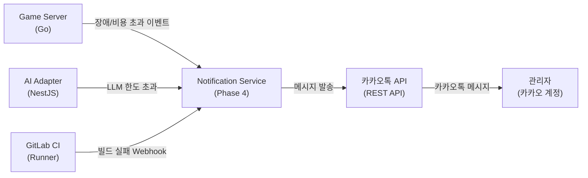
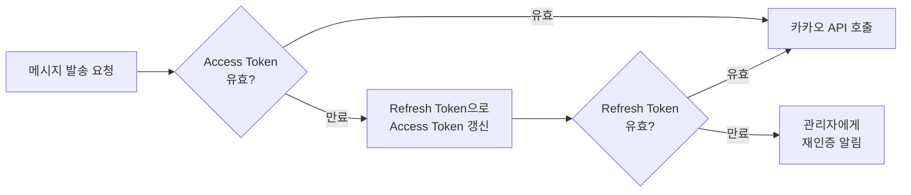
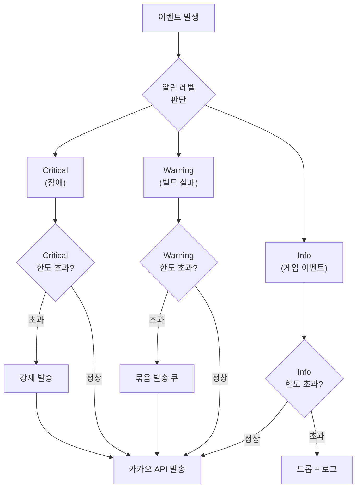

# 카카오톡 API 매뉴얼

## 1. 개요

카카오톡 API는 RummiArena의 알림 채널이다. 장애 발생, 빌드 실패, 게임 이벤트 등 운영 중요 이벤트를 카카오톡 메시지로 발송한다. **Phase 4에서 도입 예정**이며, Slack 대신 카카오톡을 채택한다.

### 알림 우선순위



### 리스크 요약

| 리스크 ID | 내용 | 대응 |
|----------|------|------|
| AR-01 | 카카오톡 일일 발송 한도 초과 | 우선순위 기반 필터링 + 버킷별 쿼터 관리 |
| AR-02 | 토큰 만료 (Access Token 6시간, Refresh Token 최대 60일) | 자동 토큰 갱신 로직 |
| AR-03 | API 스펙 변경 대비 | 인터페이스 추상화, 카카오 API 버전 고정 |

### RummiArena에서의 역할



---

## 2. 설치

### 2.1 전제 조건

- 카카오 계정 (알림을 수신할 카카오톡 계정)
- [Kakao Developers](https://developers.kakao.com/) 계정 등록 완료
- Node.js 18 이상 (AI Adapter에서 구현 시)

### 2.2 카카오 디벨로퍼스 애플리케이션 설정

#### 1단계: 애플리케이션 생성

1. [Kakao Developers](https://developers.kakao.com/) → 로그인
2. "내 애플리케이션" → "애플리케이션 추가하기"
3. 앱 이름: `RummiArena`, 사업자 이름: 입력
4. "저장"

#### 2단계: 플랫폼 등록

1. 생성된 앱 클릭 → 좌측 "앱 설정" → "플랫폼"
2. "Web 플랫폼 등록"
3. 사이트 도메인:
   ```
   http://localhost:3000
   http://rummiarena.localhost
   ```

#### 3단계: 카카오 로그인 활성화

1. 좌측 "제품 설정" → "카카오 로그인"
2. "활성화 설정": ON
3. Redirect URI 등록:
   ```
   http://localhost:3000/oauth/kakao/callback
   ```

#### 4단계: 동의항목 설정

1. 좌측 "카카오 로그인" → "동의항목"
2. "카카오톡 메시지 전송" → 필수 동의로 설정

#### 5단계: REST API 키 확인

1. "앱 설정" → "앱 키"
2. **REST API 키** 복사 (메시지 발송에 사용)

### 2.3 사용자 인증 및 토큰 발급 (최초 1회)

카카오 메시지 API는 사용자 대신 발송하는 방식이므로 OAuth 토큰이 필요하다.

```bash
# 1. Authorization Code 요청 (브라우저에서 접속)
# https://kauth.kakao.com/oauth/authorize?
#   client_id=<REST_API_KEY>&
#   redirect_uri=http://localhost:3000/oauth/kakao/callback&
#   response_type=code

# 2. 리다이렉트된 URL에서 code 파라미터 추출

# 3. Access Token / Refresh Token 발급
curl -X POST "https://kauth.kakao.com/oauth/token" \
  -H "Content-Type: application/x-www-form-urlencoded" \
  -d "grant_type=authorization_code" \
  -d "client_id=<REST_API_KEY>" \
  -d "redirect_uri=http://localhost:3000/oauth/kakao/callback" \
  -d "code=<AUTHORIZATION_CODE>"
```

응답 예시:

```json
{
  "access_token": "xxxxx",
  "token_type": "bearer",
  "refresh_token": "yyyyy",
  "expires_in": 21599,
  "scope": "talk_message",
  "refresh_token_expires_in": 5183999
}
```

- **Access Token**: 6시간 유효 (21,600초)
- **Refresh Token**: 최대 60일 유효 (5,184,000초)

---

## 3. 프로젝트 설정

### 3.1 환경변수

```bash
# AI Adapter / Notification Service
KAKAO_REST_API_KEY=<REST API 키>
KAKAO_ACCESS_TOKEN=<Access Token>
KAKAO_REFRESH_TOKEN=<Refresh Token>

# 알림 수신 대상 (자기 자신에게 보내기 위한 설정)
# "나에게 보내기" API 사용 시 별도 대상 설정 불필요
```

### 3.2 K8s Secret 설정

```bash
kubectl create secret generic rummiarena-kakao-secret \
  --namespace rummikub \
  --from-literal=KAKAO_REST_API_KEY=<REST API 키> \
  --from-literal=KAKAO_ACCESS_TOKEN=<Access Token> \
  --from-literal=KAKAO_REFRESH_TOKEN=<Refresh Token>
```

### 3.3 인터페이스 추상화 (AR-03 대응)

카카오 API 스펙 변경에 대비하여 알림 서비스를 인터페이스로 추상화한다.

```typescript
// src/ai-adapter/src/notification/notification.interface.ts
export interface NotificationService {
  sendAlert(level: 'critical' | 'warning' | 'info', message: string): Promise<void>;
}

// 카카오 구현체
export class KakaoNotificationService implements NotificationService {
  async sendAlert(level: string, message: string): Promise<void> {
    // 카카오 API 호출
  }
}

// 테스트용 No-op 구현체
export class NoopNotificationService implements NotificationService {
  async sendAlert(): Promise<void> { /* 아무것도 하지 않음 */ }
}
```

### 3.4 토큰 자동 갱신 흐름 (AR-02 대응)



토큰 갱신 API:

```bash
curl -X POST "https://kauth.kakao.com/oauth/token" \
  -H "Content-Type: application/x-www-form-urlencoded" \
  -d "grant_type=refresh_token" \
  -d "client_id=<REST_API_KEY>" \
  -d "refresh_token=<REFRESH_TOKEN>"
```

---

## 4. 주요 명령어 / 사용법

### 4.1 나에게 보내기 (기본 알림)

관리자 계정(자기 자신)에게 메시지를 발송하는 가장 단순한 방식이다.

```bash
curl -X POST "https://kapi.kakao.com/v2/api/talk/memo/default/send" \
  -H "Authorization: Bearer <ACCESS_TOKEN>" \
  -H "Content-Type: application/x-www-form-urlencoded" \
  -d "template_object=$(cat <<'EOF'
{
  "object_type": "text",
  "text": "[RummiArena] 장애 감지\n서비스: Game Server\n상태: DB 연결 실패\n시각: 2026-03-14 14:30:00",
  "link": {
    "web_url": "http://rummiarena.localhost",
    "mobile_web_url": "http://rummiarena.localhost"
  },
  "button_title": "대시보드 확인"
}
EOF
)"
```

### 4.2 알림 유형별 메시지 템플릿

#### 장애 알림 (Critical)

```json
{
  "object_type": "text",
  "text": "[RummiArena] CRITICAL\n{service}: {error_message}\n발생 시각: {timestamp}\n영향: {impact}",
  "link": { "web_url": "http://rummiarena.localhost/admin" },
  "button_title": "Admin 패널 확인"
}
```

#### 빌드 실패 알림 (Warning)

```json
{
  "object_type": "text",
  "text": "[RummiArena] 빌드 실패\n브랜치: {branch}\n커밋: {commit_sha}\nJOB: {job_name}\n{pipeline_url}",
  "link": { "web_url": "{pipeline_url}" },
  "button_title": "파이프라인 확인"
}
```

#### 비용 한도 초과 알림 (Info)

```json
{
  "object_type": "text",
  "text": "[RummiArena] AI API 비용 경고\n일일 한도: $10.00\n현재 사용: ${current_cost}\n초과율: {percentage}%\nOllama 전용 모드로 전환됨",
  "link": { "web_url": "http://rummiarena.localhost/admin/costs" },
  "button_title": "비용 현황 확인"
}
```

### 4.3 일일 발송 한도 관리 (AR-01 대응)

카카오 비즈니스 앱 기준 일반 메시지는 일일 1,000건 제한이 적용된다.

**버킷별 쿼터 전략 (Redis 활용):**

```
Redis Key: kakao:quota:daily:{date}
Type: Hash
Fields:
  - critical:count    # 장애 알림 발송 수
  - warning:count     # 빌드 실패 알림 발송 수
  - info:count        # 일반 이벤트 알림 발송 수
  - total:count       # 전체 발송 수
TTL: 86400 (24시간)
```

우선순위별 일일 한도:

| 우선순위 | 유형 | 일일 한도 | 초과 시 동작 |
|---------|------|-----------|-------------|
| 1 | Critical (장애) | 200건 | 항상 발송 (한도 초과해도 발송) |
| 2 | Warning (빌드 실패) | 300건 | 한도 초과 시 묶음 발송 (5건 단위) |
| 3 | Info (게임 이벤트) | 500건 | 한도 초과 시 드롭 후 로그만 기록 |

### 4.4 알림 발송 판단 흐름



---

## 5. 트러블슈팅

### 5.1 "KOE101: Authorization failed" 오류

Access Token이 만료되었거나 유효하지 않다.

```bash
# Refresh Token으로 재발급
curl -X POST "https://kauth.kakao.com/oauth/token" \
  -H "Content-Type: application/x-www-form-urlencoded" \
  -d "grant_type=refresh_token&client_id=<REST_API_KEY>&refresh_token=<REFRESH_TOKEN>"
```

갱신된 Access Token을 K8s Secret에 업데이트:

```bash
kubectl patch secret rummiarena-kakao-secret \
  --namespace rummikub \
  -p '{"stringData":{"KAKAO_ACCESS_TOKEN":"<NEW_ACCESS_TOKEN>"}}'
```

### 5.2 "KOE106: scope is invalid" 오류

카카오 로그인 동의항목에서 "카카오톡 메시지 전송" 권한이 누락된 경우다.

Kakao Developers → 앱 → "제품 설정" → "카카오 로그인" → "동의항목" → `talk_message` 확인.

### 5.3 "Too Many Requests" 오류

일일 발송 한도를 초과했다. Redis의 `kakao:quota:daily:{date}` 값을 확인하고 불필요한 Info 레벨 알림을 줄인다.

### 5.4 Refresh Token 만료 (60일 경과)

Refresh Token은 최대 60일이므로 갱신 없이 60일이 지나면 재인증이 필요하다.

1. 개발자가 다시 [브라우저 인증 URL](#23-사용자-인증-및-토큰-발급-최초-1회)에 접속하여 Authorization Code 재발급
2. 새 Access Token / Refresh Token 발급
3. K8s Secret 업데이트

> Refresh Token 만료 7일 전에 자동 경고 알림을 발송하도록 Cron Job 설정 권장.

### 5.5 개발 환경에서 알림 테스트 억제

`.env.local`에 `KAKAO_ENABLED=false`를 추가하고 `NoopNotificationService`로 전환하여 실제 발송 없이 테스트한다.

---

## 6. 참고 링크

- [Kakao Developers 공식 문서](https://developers.kakao.com/docs/latest/ko/message/rest-api)
- [카카오 메시지 API - 나에게 보내기](https://developers.kakao.com/docs/latest/ko/message/rest-api#default-template-msg-me)
- [카카오 토큰 갱신](https://developers.kakao.com/docs/latest/ko/kakaologin/rest-api#refresh-token)
- [카카오 오류 코드 목록](https://developers.kakao.com/docs/latest/ko/rest-api/reference#error-code)
- 관련 설계: `docs/02-design/04-ai-adapter-design.md` (섹션 8.3 - 한도 초과 시 카카오 알림)
- 관련 리스크: `docs/01-planning/04-risk-register.md` (AR-01, AR-02, AR-03)
