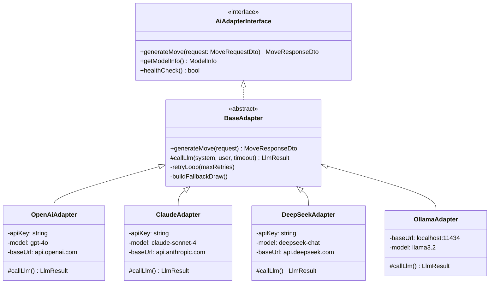
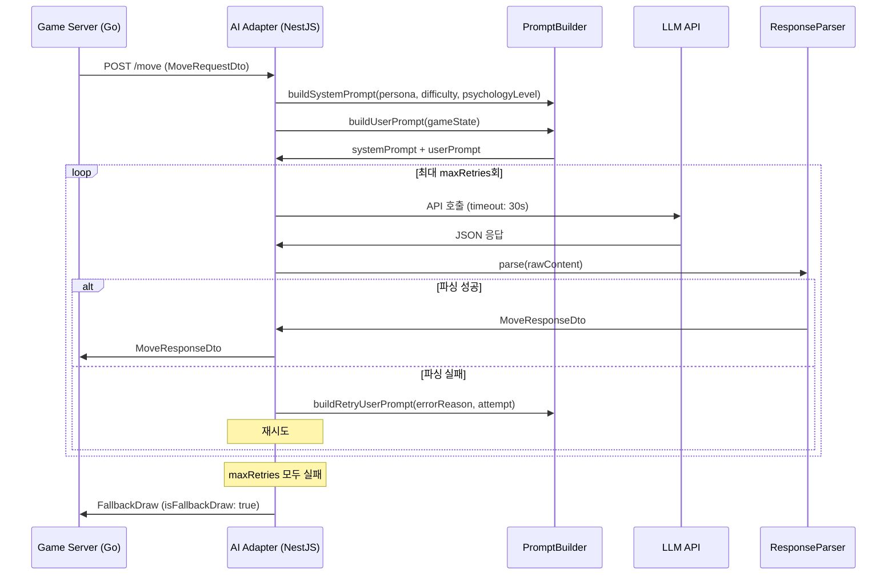
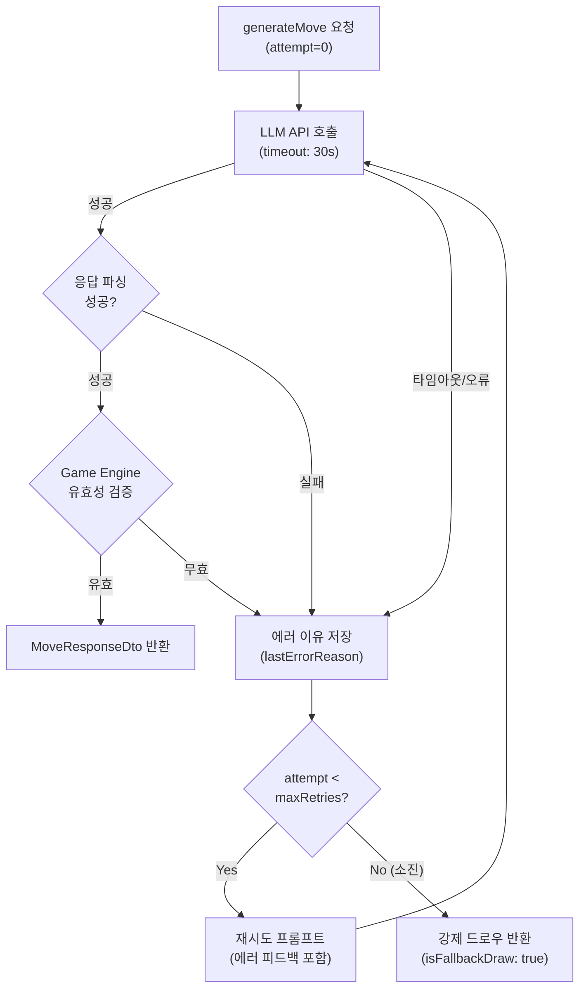

# OpenAI / Claude / DeepSeek API 매뉴얼

## 1. 개요

RummiArena AI Adapter는 4개의 LLM 어댑터를 제공한다. OpenAI, Claude, DeepSeek 3개의 상용 API와 Ollama 로컬 LLM을 동일한 인터페이스(`AiAdapterInterface`)로 추상화하여, Game Engine이 LLM 종류에 무관하게 AI 플레이어를 활용할 수 있게 한다.

이 문서는 3개 상용 API에 대한 통합 가이드다. Ollama 로컬 LLM은 `15-local-llm.md`를 참조한다.

### LLM 신뢰 금지 원칙

LLM 응답은 절대 신뢰하지 않는다. 모든 AI 수(move)는 Game Engine이 유효성을 검증하며, 파싱 실패 또는 불법 수 제안 시 최대 3회 재시도 후 강제 드로우로 처리한다.

### AI Adapter 구조



### 모델별 특성 비교

| 항목 | OpenAI GPT-4o | Claude Sonnet 4 | DeepSeek Chat | Ollama (로컬) |
|------|--------------|-----------------|---------------|---------------|
| 응답 속도 | 2~4초 | 3~6초 | 2~5초 | 5~30초 (CPU) |
| 비용 (1K 토큰) | ~$0.005 | ~$0.003 | ~$0.0003 | 무료 |
| JSON 출력 품질 | 최상 (JSON mode) | 매우 높음 | 높음 (JSON mode) | 모델 의존 |
| 컨텍스트 윈도우 | 128K | 200K | 64K | 모델 의존 |
| 추론 능력 | 최상 | 최상 | 높음 | 중~상 |
| 토큰 한도 (출력) | 4,096 | 8,096 | 4,096 | 모델 의존 |
| 한국어 품질 | 우수 | 우수 | 보통 | 모델 의존 |
| 게임 AI 적합도 | Expert용 | Expert용 | Intermediate~Expert | 전 난이도 |

---

## 2. 설치

### 2.1 전제 조건

- Node.js 18 이상
- NestJS AI Adapter 프로젝트 초기화 완료 (`src/ai-adapter/`)
- 각 LLM 서비스의 API 키 발급 완료

### 2.2 패키지 확인

```bash
cd /mnt/d/Users/KTDS/Documents/06.과제/RummiArena/src/ai-adapter

# axios는 이미 설치되어 있음
npm list axios
```

`src/ai-adapter/package.json`에 `axios`가 의존성으로 포함되어 있다. 추가 SDK는 사용하지 않으며, 모든 API 호출은 `axios`로 직접 구현한다.

### 2.3 API 키 발급

#### OpenAI

1. [platform.openai.com](https://platform.openai.com/) → API Keys → "Create new secret key"
2. 결제 정보 등록 필수 (선불 크레딧 방식)
3. 키 형식: `sk-...`

#### Claude (Anthropic)

1. [console.anthropic.com](https://console.anthropic.com/) → API Keys → "Create Key"
2. 결제 정보 등록 필수
3. 키 형식: `sk-ant-...`

#### DeepSeek

1. [platform.deepseek.com](https://platform.deepseek.com/) → API Keys → "Create API Key"
2. 결제 정보 등록 (충전 방식)
3. 키 형식: `sk-...`

---

## 3. 프로젝트 설정

### 3.1 환경변수 설정

`.env` 파일 생성 (`.env.example` 참조):

```bash
# OpenAI
OPENAI_API_KEY=sk-...
OPENAI_DEFAULT_MODEL=gpt-4o

# Claude (Anthropic)
CLAUDE_API_KEY=sk-ant-...
CLAUDE_DEFAULT_MODEL=claude-sonnet-4-20250514

# DeepSeek
DEEPSEEK_API_KEY=sk-...
DEEPSEEK_DEFAULT_MODEL=deepseek-chat

# Ollama (로컬)
OLLAMA_BASE_URL=http://localhost:11434
OLLAMA_DEFAULT_MODEL=llama3.2

# 공통
LLM_TIMEOUT_MS=30000
LLM_MAX_RETRIES=3

# 비용 제한
DAILY_COST_LIMIT_USD=10
USER_DAILY_CALL_LIMIT=500
GAME_CALL_LIMIT=200

# Redis (쿼터 추적)
REDIS_HOST=localhost
REDIS_PORT=6379
```

### 3.2 K8s Secret 설정

```bash
kubectl create secret generic rummikub-ai-secret \
  --namespace rummikub \
  --from-literal=OPENAI_API_KEY=<OpenAI API 키> \
  --from-literal=CLAUDE_API_KEY=<Claude API 키> \
  --from-literal=DEEPSEEK_API_KEY=<DeepSeek API 키>
```

Helm values.yaml:

```yaml
# helm/ai-adapter/values.yaml
env:
  PORT: "8081"
  NODE_ENV: "production"
  OPENAI_DEFAULT_MODEL: "gpt-4o"
  CLAUDE_DEFAULT_MODEL: "claude-sonnet-4-20250514"
  DEEPSEEK_DEFAULT_MODEL: "deepseek-chat"
  OLLAMA_BASE_URL: "http://ollama-service.rummikub.svc.cluster.local:11434"
  LLM_TIMEOUT_MS: "30000"
  LLM_MAX_RETRIES: "3"
  DAILY_COST_LIMIT_USD: "10"

envFrom:
  - secretRef:
      name: rummikub-ai-secret
```

### 3.3 난이도별 모델 매핑

AI Adapter는 `difficulty` 파라미터에 따라 적합한 모델을 선택한다.

| 난이도 | 권장 모델 | 이유 |
|--------|-----------|------|
| beginner | `gpt-4o-mini`, `deepseek-chat`, `llama3.2:1b` | 경량, 빠른 응답, 의도적 실수 연출 |
| intermediate | `gpt-4o-mini`, `deepseek-chat`, `qwen2.5:7b` | 균형적 성능, 합리적 비용 |
| expert | `gpt-4o`, `claude-sonnet-4`, `deepseek-r1` | 최고 추론 능력, 심리전 시뮬레이션 |

---

## 4. 주요 명령어 / 사용법

### 4.1 공통 인터페이스: MoveRequest / MoveResponse

AI Adapter의 핵심 DTO는 `src/ai-adapter/src/common/dto/`에 정의되어 있다.

#### MoveRequestDto 요약

| 필드 | 타입 | 설명 |
|------|------|------|
| `gameId` | string | 게임 세션 ID |
| `playerId` | string | AI 플레이어 ID |
| `gameState.tableGroups` | TileGroupDto[] | 현재 테이블 그룹/런 목록 |
| `gameState.myTiles` | string[] | AI 보유 타일 (최대 14장) |
| `gameState.opponents` | OpponentInfoDto[] | 상대 정보 |
| `gameState.drawPileCount` | number | 드로우 파일 남은 장수 |
| `gameState.turnNumber` | number | 현재 턴 번호 |
| `gameState.initialMeldDone` | boolean | 최초 등록 완료 여부 |
| `gameState.unseenTiles?` | string[] | 미출현 타일 (expert 전용) |
| `persona` | Persona | rookie/calculator/shark/fox/wall/wildcard |
| `difficulty` | Difficulty | beginner/intermediate/expert |
| `psychologyLevel` | 0\|1\|2\|3 | 심리전 레벨 |
| `maxRetries` | 1~5 | 최대 재시도 횟수 (기본 3) |
| `timeoutMs` | 5000~60000 | LLM API 타임아웃 (기본 30000ms) |

#### MoveResponseDto 요약

| 필드 | 타입 | 설명 |
|------|------|------|
| `action` | 'place'\|'draw' | AI가 선택한 행동 |
| `tableGroups?` | TileGroupDto[] | 배치 후 테이블 전체 구성 (place 시) |
| `tilesFromRack?` | string[] | 이번 턴 사용한 타일 목록 (place 시) |
| `reasoning?` | string | AI 사고 과정 설명 (디버깅/UI용) |
| `metadata.modelType` | string | openai/claude/deepseek/ollama |
| `metadata.modelName` | string | 실제 사용 모델명 |
| `metadata.latencyMs` | number | API 응답 지연시간 |
| `metadata.promptTokens` | number | 프롬프트 토큰 수 |
| `metadata.completionTokens` | number | 완성 토큰 수 |
| `metadata.retryCount` | number | 실제 재시도 횟수 |
| `metadata.isFallbackDraw` | boolean | 강제 드로우 여부 |

### 4.2 AI 수 생성 흐름



### 4.3 재시도 및 Fallback 로직



### 4.4 어댑터별 API 호출 특이사항

#### OpenAI GPT

```
엔드포인트: POST https://api.openai.com/v1/chat/completions
인증: Authorization: Bearer <OPENAI_API_KEY>
JSON mode: response_format: { type: "json_object" }
시스템 프롬프트: messages[0].role = "system"
```

JSON mode 사용 시 반드시 프롬프트에 "JSON 형식으로 응답하라"는 문구가 있어야 한다.

#### Claude (Anthropic)

```
엔드포인트: POST https://api.anthropic.com/v1/messages
인증: x-api-key: <CLAUDE_API_KEY>
버전 헤더: anthropic-version: 2023-06-01
시스템 프롬프트: 별도 "system" 필드 (messages 배열 외부)
응답 위치: response.data.content[0].text
```

Claude는 별도 health check 엔드포인트가 없으므로 최소 토큰 요청(`max_tokens: 10`)으로 연결 확인을 수행한다.

#### DeepSeek

```
엔드포인트: POST https://api.deepseek.com/v1/chat/completions
인증: Authorization: Bearer <DEEPSEEK_API_KEY>
OpenAI 호환 API: OpenAI와 동일한 요청/응답 구조
JSON mode: response_format: { type: "json_object" } 지원
```

DeepSeek은 OpenAI 호환 API를 제공하므로 `OpenAiAdapter`와 구조가 거의 동일하다. 엔드포인트 URL과 API 키만 다르다.

### 4.5 /move 엔드포인트 사용 예시

```bash
# AI Adapter에 수 생성 요청
curl -X POST http://localhost:8081/move \
  -H "Content-Type: application/json" \
  -d '{
    "gameId": "game-abc123",
    "playerId": "ai-player-1",
    "gameState": {
      "tableGroups": [
        {"tiles": ["R7a", "B7a", "K7b"]}
      ],
      "myTiles": ["R1a", "R5b", "B3a", "Y7a", "K2b", "JK1"],
      "opponents": [
        {"playerId": "player-2", "remainingTiles": 6}
      ],
      "drawPileCount": 28,
      "turnNumber": 5,
      "initialMeldDone": true
    },
    "persona": "shark",
    "difficulty": "expert",
    "psychologyLevel": 2,
    "maxRetries": 3,
    "timeoutMs": 30000
  }'
```

응답 예시:

```json
{
  "action": "place",
  "tableGroups": [
    {"tiles": ["R7a", "B7a", "K7b"]},
    {"tiles": ["R1a", "R3a", "R5b"]}
  ],
  "tilesFromRack": ["R1a", "R5b"],
  "reasoning": "상대가 6장 남았으므로 공격적으로 배치합니다. 런을 완성하여 2장을 소진합니다.",
  "metadata": {
    "modelType": "openai",
    "modelName": "gpt-4o",
    "latencyMs": 1842,
    "promptTokens": 487,
    "completionTokens": 145,
    "retryCount": 0,
    "isFallbackDraw": false
  }
}
```

### 4.6 비용 모니터링 전략 (CR-01 리스크)

AI API 비용 초과는 프로젝트 운영 핵심 리스크(CR-01)다.

**Redis 비용 추적 구조:**

```
Key: quota:daily:{YYYY-MM-DD}
Type: Hash
Fields:
  totalCalls, totalCost
  openai:calls, openai:cost
  claude:calls, claude:cost
  deepseek:calls, deepseek:cost
  ollama:calls, ollama:cost
TTL: 172800 (48시간)
```

**한도 초과 시 동작:**

| 조건 | 동작 |
|------|------|
| 사용자 일일 500회 초과 | AI 플레이어 추가 불가, 기존 게임 AI는 강제 드로우 전환 |
| 게임당 200회 초과 | 해당 게임의 AI를 강제 드로우 전환 |
| 일일 $10 초과 | 상용 API 비활성화, Ollama 전용 모드 전환 + 카카오 알림 발송 |

**토큰별 예상 비용 (2026년 3월 기준):**

| 모델 | Input (1M 토큰) | Output (1M 토큰) | 게임 1판 예상 비용 |
|------|----------------|-----------------|-------------------|
| gpt-4o | $2.50 | $10.00 | ~$0.02~$0.05 |
| claude-sonnet-4 | $3.00 | $15.00 | ~$0.03~$0.06 |
| deepseek-chat | $0.27 | $1.10 | ~$0.003 |
| Ollama | $0 | $0 | $0 |

> 게임 1판 기준: 평균 30~50턴, 턴당 프롬프트 ~1,000 토큰 + 응답 ~200 토큰.

---

## 5. 트러블슈팅

### 5.1 JSON 파싱 실패 반복

LLM이 순수 JSON 대신 마크다운 코드 블록(` ```json ... ``` `)으로 감싸 응답하는 경우다.

`ResponseParserService`에서 코드 블록 제거 처리가 구현되어 있다. 반복 실패 시 `reasoning` 필드에 에러 내용이 포함된 재시도 프롬프트가 전송된다.

수동 확인:

```bash
# AI Adapter 로그에서 파싱 실패 원인 확인
kubectl logs -n rummikub deployment/ai-adapter | grep "파싱 실패"
```

### 5.2 타임아웃 오류 (30초 초과)

expert 난이도에서 게임 히스토리가 길어질 경우 응답 시간이 늘어날 수 있다.

- `timeoutMs`를 요청별로 조정 (최대 60,000ms)
- 프롬프트 토큰 수가 2,000을 초과하면 히스토리를 자동 축약한다 (`PromptBuilderService` 참조)

### 5.3 OpenAI "rate_limit_exceeded"

분당 요청 한도(RPM) 또는 분당 토큰 한도(TPM) 초과.

- `BaseAdapter`의 재시도 로직이 지수 백오프 없이 즉시 재시도하므로 rate limit 상황에서는 모두 실패할 수 있다.
- 단기 대응: `timeoutMs` 사이에 딜레이 추가 또는 DeepSeek/Ollama로 폴백.
- 장기 대응: `BaseAdapter`에 지수 백오프(exponential backoff) 적용.

### 5.4 Claude API "overloaded_error"

Anthropic 서버 과부하 시 503 응답. `BaseAdapter` 재시도 로직으로 자동 처리된다.

### 5.5 DeepSeek 연결 불가 (중국 서버)

네트워크 환경에 따라 `api.deepseek.com` 접속이 지연될 수 있다.

```bash
# 연결 확인
curl -I https://api.deepseek.com/v1/models \
  -H "Authorization: Bearer $DEEPSEEK_API_KEY"
```

접속 불가 시 OpenAI 또는 Claude로 임시 대체한다.

### 5.6 강제 드로우 빈번 발생

`metadata.isFallbackDraw = true`가 반복되면 다음을 점검한다.

1. API 키 유효성 확인 (`healthCheck()` 엔드포인트 호출)
2. 프롬프트 토큰 수 확인 (2,000 초과 시 히스토리 축약)
3. `LLM_TIMEOUT_MS` 값 증가 검토
4. AI Adapter 로그에서 에러 원인 확인

```bash
kubectl logs -n rummikub deployment/ai-adapter | grep "isFallbackDraw"
```

---

## 6. 참고 링크

- [OpenAI API 공식 문서](https://platform.openai.com/docs/api-reference)
- [OpenAI JSON mode](https://platform.openai.com/docs/guides/text-generation/json-mode)
- [Anthropic Messages API](https://docs.anthropic.com/en/api/messages)
- [DeepSeek API 문서](https://platform.deepseek.com/docs)
- [DeepSeek OpenAI 호환 API](https://platform.deepseek.com/docs#openai-compatibility)
- 관련 파일 (AI Adapter):
  - `src/ai-adapter/src/common/interfaces/ai-adapter.interface.ts`
  - `src/ai-adapter/src/common/dto/move-request.dto.ts`
  - `src/ai-adapter/src/common/dto/move-response.dto.ts`
  - `src/ai-adapter/src/adapter/base.adapter.ts`
  - `src/ai-adapter/src/adapter/openai.adapter.ts`
  - `src/ai-adapter/src/adapter/claude.adapter.ts`
  - `src/ai-adapter/src/adapter/deepseek.adapter.ts`
  - `src/ai-adapter/src/prompt/persona.templates.ts`
- 관련 설계: `docs/02-design/04-ai-adapter-design.md`
- 로컬 LLM(Ollama): `docs/00-tools/15-local-llm.md`
