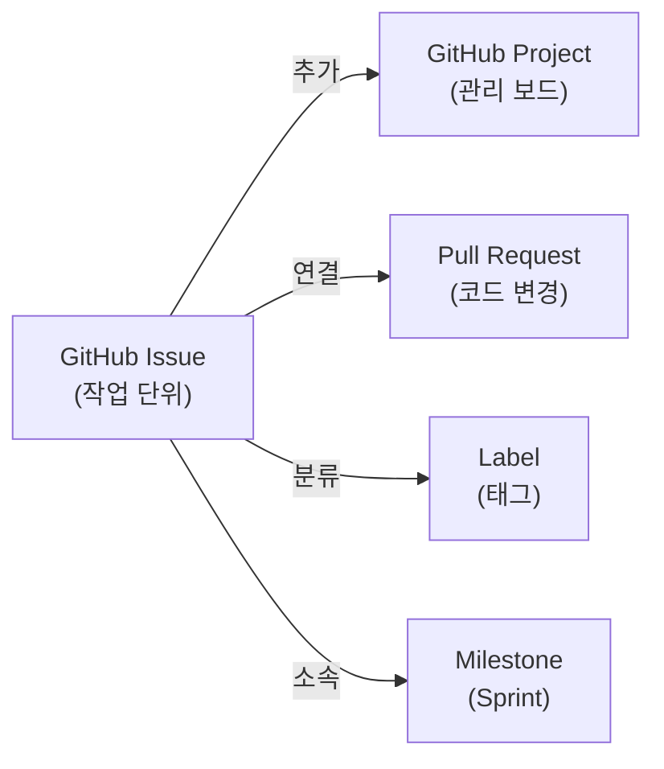

# GitHub Projects 사용 가이드

## 1. 개요

RummiArena 프로젝트는 **GitHub Projects (V2)** 를 사용하여 백로그/스프린트/이슈를 관리한다.
Jira, Trello 등 별도 도구 없이 GitHub 내에서 프로젝트 관리를 통합 수행한다.

### 1.1 왜 GitHub Projects인가?

| 도구 | 장점 | 단점 | 선택 |
|------|------|------|------|
| **GitHub Projects** | 소스와 통합, 무료, Issue 연동 자동화 | Jira보다 기능 제한적 | **채택** |
| Jira Cloud | 풍부한 기능, 스크럼 지원 | 별도 계정/비용, 소스와 분리 | 비채택 |
| Trello | 간단, 직관적 | 개발 워크플로우 통합 약함 | 비채택 |

---

## 2. 기본 개념

### 2.1 핵심 용어

| 용어 | 설명 |
|------|------|
| **Project** | Kanban 보드/테이블 뷰를 제공하는 프로젝트 관리 공간 |
| **Issue** | 작업 단위 (백로그 아이템, 버그, 태스크) |
| **Label** | Issue 분류 태그 (`bug`, `feature`, `docs` 등) |
| **Milestone** | Sprint 또는 Phase 단위 마감 기한 |
| **Field** | 커스텀 속성 (Status, Priority, Sprint, Size 등) |
| **View** | 보드/테이블/로드맵 등 다양한 시각화 |

### 2.2 Issue ↔ Project 관계



---

## 3. 보드 구성

### 3.1 Kanban 컬럼 (Status)

| 컬럼 | 설명 | 자동화 |
|------|------|--------|
| **Backlog** | 아직 착수하지 않은 항목 | Issue 생성 시 기본 배치 |
| **Ready** | 스프린트에 배정, 착수 대기 | Sprint 필드 설정 시 |
| **In Progress** | 현재 작업 중 | 담당자 할당 시 |
| **In Review** | PR 리뷰 대기 | PR 연결 시 |
| **Done** | 완료 | Issue close 시 자동 이동 |

### 3.2 커스텀 필드

| 필드명 | 타입 | 값 | 용도 |
|--------|------|-----|------|
| Status | Single Select | Backlog/Ready/In Progress/In Review/Done | Kanban 컬럼 |
| Priority | Single Select | P0-Critical/P1-High/P2-Medium/P3-Low | 우선순위 |
| Sprint | Iteration | Sprint 0, Sprint 1, ... | 스프린트 배정 |
| Size | Single Select | XS/S/M/L/XL | 작업 규모 (스토리 포인트 대용) |
| Phase | Single Select | Phase 1~6 | 단계 분류 |

### 3.3 뷰 구성

| 뷰 이름 | 타입 | 용도 |
|---------|------|------|
| **Board** | Kanban | 현재 스프린트 작업 현황 (기본 뷰) |
| **Backlog** | Table | 전체 백로그 목록 (필터: Status=Backlog) |
| **Sprint** | Table | 현재 스프린트 아이템 (필터: Sprint=현재) |
| **Roadmap** | Roadmap | Phase/Sprint별 타임라인 |

### 3.4 뷰 레이아웃 전환 방법

프로젝트를 처음 열면 **Table 뷰**가 기본으로 표시된다.
Kanban 보드 형태로 전환하는 방법은 두 가지다.

**방법 A: 기존 뷰를 Board로 변경**
1. 우측 상단 **⚙ View** 버튼 클릭 (필터 바 오른쪽)
2. **Layout** 섹션에서 **Board** 아이콘 선택
3. **Group by**: `Status` 확인 (기본값)

**방법 B: Board 뷰를 새로 추가** (추천)
1. 상단 탭 영역에서 **+ New view** 클릭
2. **Board** 선택
3. 뷰 이름을 "Kanban"으로 변경

> **참고**: View 1 옆 `▼` 드롭다운은 뷰 이름 변경/복제/삭제 메뉴이다. Layout 변경은 여기서 할 수 없다.

전환 후 카드를 좌→우로 **드래그**하여 상태 변경 가능.

| 레이아웃 | 특징 | 추천 용도 |
|---------|------|----------|
| **Table** | 스프레드시트 형태, 필드 정렬/필터 용이 | 백로그 관리, 대량 편집 |
| **Board** | Kanban 컬럼, 드래그 앤 드롭 | 일일 스탠드업, 진행 현황 파악 |
| **Roadmap** | 타임라인 형태 | Sprint/Phase 일정 관리 |

> **팁**: 뷰를 여러 개 만들 수 있다. 예를 들어 Board 뷰와 Table 뷰를 각각 만들어두고 탭으로 전환하면 편리하다. 상단 **+ New view**를 클릭하여 추가한다.

---

## 4. 라벨 체계

### 4.1 타입 라벨

| 라벨 | 색상 | 설명 |
|------|------|------|
| `feature` | 🟢 #0E8A16 | 신규 기능 |
| `bug` | 🔴 #D73A4A | 버그 수정 |
| `docs` | 🔵 #0075CA | 문서 작업 |
| `infra` | 🟣 #7057FF | 인프라/환경 구성 |
| `refactor` | 🟡 #FEF2C0 | 리팩토링 |
| `test` | 🟠 #F9D0C4 | 테스트 작성 |
| `design` | ⚪ #C5DEF5 | 설계 작업 |

### 4.2 서비스 라벨

| 라벨 | 설명 |
|------|------|
| `frontend` | Next.js 프론트엔드 |
| `game-server` | Go 게임 서버 |
| `ai-adapter` | NestJS AI 어댑터 |
| `admin` | 관리자 대시보드 |

### 4.3 우선순위 라벨

| 라벨 | 설명 |
|------|------|
| `P0-critical` | 즉시 처리 |
| `P1-high` | 현재 스프린트 필수 |
| `P2-medium` | 가능하면 이번 스프린트 |
| `P3-low` | 다음 스프린트 이후 |

---

## 5. gh CLI 사용법

### 5.1 Issue 관리

```bash
# Issue 생성
gh issue create --title "Traefik 설치" \
  --body "Helm으로 Traefik Proxy 설치 및 라우팅 설정" \
  --label "infra" \
  --milestone "Sprint 0"

# Issue 목록 조회
gh issue list
gh issue list --label "bug"
gh issue list --milestone "Sprint 0"

# Issue 상세 보기
gh issue view 1

# Issue 닫기
gh issue close 1

# Issue에 담당자 할당
gh issue edit 1 --add-assignee k82022603

# Issue에 라벨 추가
gh issue edit 1 --add-label "P1-high,game-server"
```

### 5.2 Project 관리

```bash
# Project 목록 조회
gh project list --owner k82022603

# Project 아이템 조회
gh project item-list <project-number> --owner k82022603

# Issue를 Project에 추가
gh project item-add <project-number> --owner k82022603 --url <issue-url>
```

### 5.3 Milestone 관리

```bash
# Milestone 생성
gh api repos/k82022603/RummiArena/milestones \
  -f title="Sprint 0" \
  -f description="기획 & 설계 & 환경 구축" \
  -f due_on="2026-03-28T00:00:00Z"

# Milestone 목록
gh api repos/k82022603/RummiArena/milestones
```

### 5.4 Label 관리

```bash
# 라벨 생성
gh label create "feature" --color "0E8A16" --description "신규 기능"
gh label create "infra" --color "7057FF" --description "인프라/환경 구성"

# 라벨 목록
gh label list
```

---

## 6. 웹 UI 사용법

### 6.1 Project 보드 접근

1. GitHub 저장소 → **Projects** 탭 클릭
2. 프로젝트 보드 선택
3. Kanban 뷰에서 카드를 드래그하여 상태 변경

### 6.2 Issue 생성 (웹)

1. **Issues** 탭 → **New issue** 클릭
2. 템플릿 선택 (Bug Report, Feature Request 등)
3. 제목, 본문 작성
4. Labels, Milestone, Assignees 설정
5. **Submit new issue** 클릭

### 6.3 보드에서 작업 관리

```
┌─ Backlog ──┐  ┌─ Ready ────┐  ┌─ In Progress ┐  ┌─ Done ─────┐
│            │  │            │  │              │  │            │
│  #5 UI설계  │→│  #3 DB설계  │→│  #1 Traefik  │→│  #2 문서완료 │
│  #6 API설계 │  │  #4 인증    │  │              │  │            │
│            │  │            │  │              │  │            │
└────────────┘  └────────────┘  └──────────────┘  └────────────┘
```

- 카드를 좌→우로 드래그하면 Status 자동 변경
- 카드 클릭하면 Issue 상세로 이동

### 6.4 필터링

보드 상단 필터 바에서:
- `label:bug` — 버그만 표시
- `assignee:k82022603` — 내 작업만 표시
- `milestone:"Sprint 0"` — 현재 스프린트만 표시

---

## 7. 자동화 (Workflows)

GitHub Projects V2는 내장 자동화를 지원한다.

| 트리거 | 동작 | 설정 방법 |
|--------|------|----------|
| Issue 생성 | Status → Backlog | Project Settings → Workflows |
| Issue close | Status → Done | Project Settings → Workflows |
| PR 연결 | Status → In Review | Project Settings → Workflows |
| PR merge | Issue 자동 close | PR 본문에 `Closes #이슈번호` |

### 7.1 자동 close 연결

PR 본문 또는 커밋 메시지에 아래 키워드를 사용하면 Issue가 자동으로 닫힌다:

```
Closes #12
Fixes #12
Resolves #12
```

---

## 8. 스프린트 운영 방법

### 8.1 스프린트 시작

1. Backlog에서 이번 스프린트에 할 항목 선택
2. Sprint 필드에 현재 스프린트 설정
3. Status를 **Ready**로 이동
4. 스탠드업에서 확인

### 8.2 일일 스탠드업

1. Board 뷰에서 **In Progress** 항목 확인
2. 블로커 있으면 Issue에 코멘트 추가
3. 완료 항목은 **Done**으로 이동

### 8.3 스프린트 종료

1. Done 컬럼의 항목 확인 → 미완료 항목은 다음 스프린트로 이월
2. Milestone close 처리
3. 회고 진행

---

## 9. 참고

| 항목 | 링크 |
|------|------|
| GitHub Projects 공식 문서 | https://docs.github.com/en/issues/planning-and-tracking-with-projects |
| gh CLI 프로젝트 명령 | https://cli.github.com/manual/gh_project |
| Issue 템플릿 위치 | `.github/ISSUE_TEMPLATE/` |
