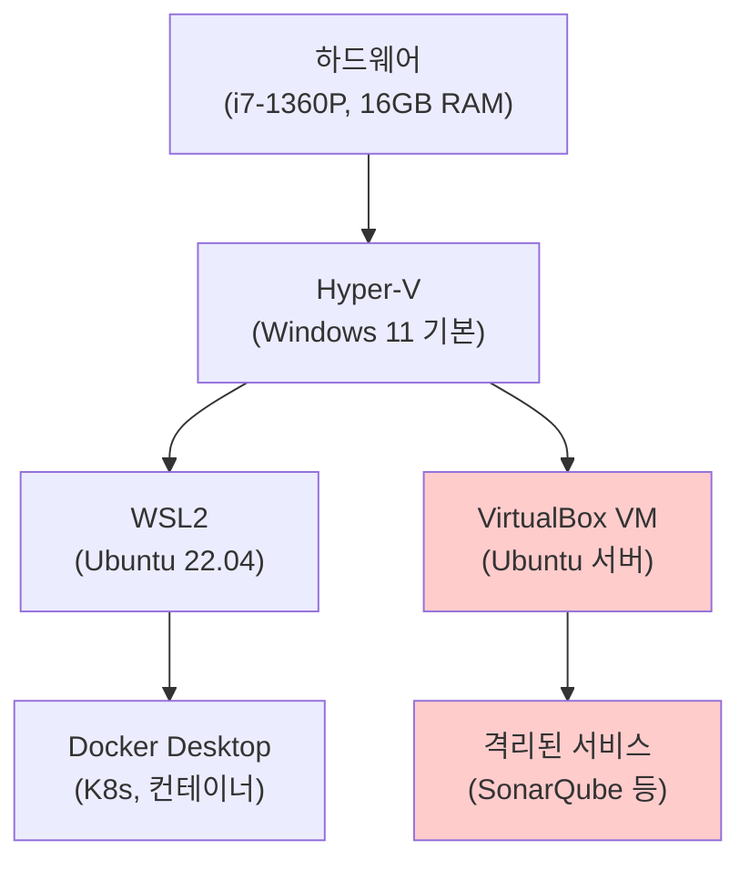
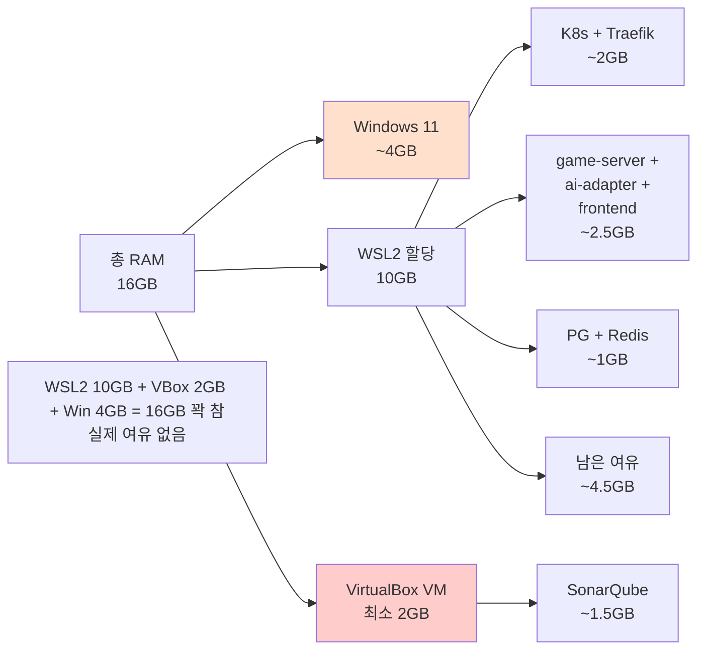

# Oracle VirtualBox 매뉴얼

## 1. 개요

Oracle VirtualBox는 x86 기반 범용 하이퍼바이저다.
RummiArena 프로젝트에서는 **비권장** 도구로 분류한다.

> 결론: LG Gram 15Z90R (RAM 16GB) 환경에서는 VirtualBox 도입이 득보다 실이 크다.
> WSL2 + Docker Desktop 교대 실행 전략으로 동일한 목적을 달성할 수 있다.

---

## 2. 비권장 사유

### 2.1 Hyper-V 충돌 문제

Windows 11에서 WSL2와 Docker Desktop은 Hyper-V(또는 Virtual Machine Platform)를 사용한다.
VirtualBox 6.x 이하 버전은 Hyper-V가 활성화된 상태에서 64비트 VM을 실행할 수 없다.
VirtualBox 7.x에서 Hyper-V 백엔드를 지원하지만 성능 저하와 불안정성이 보고된다.

결국 WSL2 또는 VirtualBox 중 하나를 선택해야 하며, RummiArena는 WSL2 기반 전체 스택을 사용한다.

### 2.2 이중 가상화 성능 저하



VirtualBox를 Hyper-V 위에서 실행하면 Type-2 위에 Type-2가 중첩된다.
CPU 가상화 오버헤드가 2배 발생하며, RAM 또한 VM 기동만으로 최소 2GB가 소비된다.

### 2.3 RAM 분할 문제



WSL2에 10GB를 할당하면 VirtualBox VM에 줄 여유가 없다.
WSL2 할당을 줄이면 Docker Desktop K8s가 불안정해진다.

---

## 3. 대안: WSL2 + Docker Desktop 교대 실행 전략

VirtualBox로 해결하려 했던 문제(서비스 격리, 리소스 분산)를 교대 실행으로 해결한다.

| 실행 모드 | 구성 | 예상 RAM | 용도 |
|-----------|------|----------|------|
| 개발 모드 | PG + Redis + Traefik + App + Claude | ~6.5GB | 일상 개발 |
| CI 모드 | PG + GitLab Runner + SonarQube | ~6GB | 파이프라인 실행 |
| 관측 모드 | PG + Redis + K8s + Traefik + ArgoCD | ~5GB | 배포·모니터링 |

```bash
# 개발 모드 전환 예시
docker compose -f docker-compose.dev.yml up -d

# CI 모드 전환 예시
docker compose -f docker-compose.dev.yml down
docker compose -f docker-compose.ci.yml up -d
```

모드 전환은 `switch-wslconfig.sh`로 WSL2 메모리 프로파일도 함께 변경한다.
자세한 내용은 `/docs/00-tools/23-wslconfig.md`를 참조한다.

---

## 4. 도입 가능 조건

아래 조건이 모두 충족될 경우 VirtualBox 또는 VMware Workstation 도입을 재검토할 수 있다.

- RAM 32GB 이상으로 업그레이드
- WSL2와 충돌 없는 VirtualBox 7.1+ 버전 안정화 확인
- VM에서만 실행해야 하는 특수 OS 요구사항 발생 (예: Windows Server 테스트)

Phase 5 이후 운영 환경 시뮬레이션이 필요하다면 VirtualBox 대신
Docker Desktop의 multi-node K8s 또는 kind(Kubernetes in Docker)를 검토한다.

---

## 5. 참고 링크

- VirtualBox 공식 사이트: https://www.virtualbox.org/
- WSL2 + VirtualBox 충돌 이슈: https://docs.microsoft.com/en-us/windows/wsl/faq
- kind (Kubernetes in Docker): https://kind.sigs.k8s.io/
