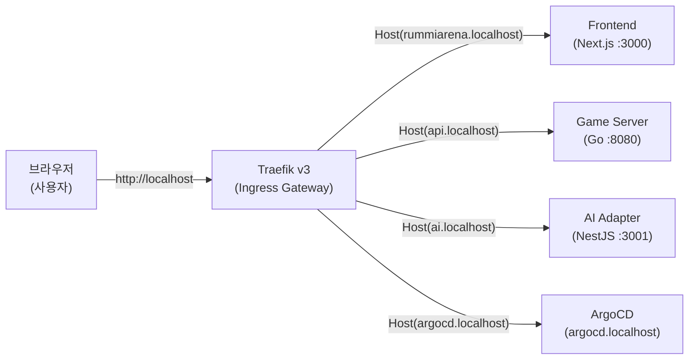
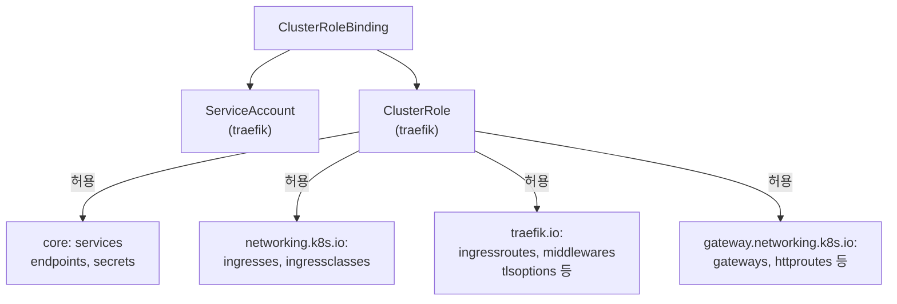

# Traefik Ingress Gateway 매뉴얼

## 1. 개요

Traefik v3는 RummiArena의 **North-South Ingress Gateway**다. 외부 트래픽을 K8s 클러스터 내부 서비스로 라우팅하는 단일 진입점(Single Entry Point) 역할을 담당한다.

### 선정 배경

| 항목 | 내용 |
|------|------|
| 선정 일자 | 2026-03-12 |
| 대체 대상 | NGINX Ingress (EOL 2026-03) |
| 근거 | NGINX Ingress Controller 공식 지원 종료, Java SCG 배제, Istio Envoy 중복 방지 |
| Phase 5 이후 | Istio(East-West) + Traefik(North-South) 공존 — 역할 명확히 분리 |

### RummiArena에서의 역할



### 포트 구성

| EntryPoint | 컨테이너 포트 | 서비스 포트 | 용도 |
|-----------|------------|-----------|------|
| web | 8000 | 80 | HTTP 트래픽 |
| websecure | 8443 | 443 | HTTPS 트래픽 (차후) |
| traefik | 9000 | 9000 | Dashboard + Health Probe |

---

## 2. 설치

### 2.1 전제 조건

- Docker Desktop Kubernetes 활성화 (`kubectl cluster-info` 정상 응답)
- Helm 3 설치 완료
- `traefik` namespace 생성

### 2.2 Helm으로 설치

```bash
# Traefik Helm 레포 추가
helm repo add traefik https://traefik.github.io/charts
helm repo update

# namespace 생성
kubectl create namespace traefik

# 설치 (프로젝트 values.yaml 사용)
helm install traefik traefik/traefik \
  --namespace traefik \
  --version "^33.0.0" \
  -f helm/charts/traefik/values.yaml
```

### 2.3 CRD 설치 확인

Traefik은 Helm 설치 시 CRD(Custom Resource Definition)를 자동 등록한다.

```bash
kubectl get crd | grep traefik
# 출력 예시:
# ingressroutes.traefik.io
# middlewares.traefik.io
# traefikservices.traefik.io
# tlsoptions.traefik.io
```

### 2.4 커스텀 Deployment 방식 (프로젝트 적용)

본 프로젝트는 Helm chart 대신 커스텀 YAML(`helm/charts/traefik/templates/deployment.yaml`)로 직접 관리한다. ArgoCD가 해당 파일을 감시하여 자동 배포한다.

```bash
# 수동 적용 (ArgoCD 없을 때)
kubectl apply -f helm/charts/traefik/templates/rbac.yaml
kubectl apply -f helm/charts/traefik/templates/deployment.yaml
```

### 2.5 설치 확인

```bash
kubectl get pods -n traefik
# NAME                       READY   STATUS    RESTARTS   AGE
# traefik-xxxxxxxxxx-xxxxx   1/1     Running   0          1m

kubectl get svc -n traefik
# NAME      TYPE           CLUSTER-IP     EXTERNAL-IP   PORT(S)
# traefik   LoadBalancer   10.x.x.x       localhost     80:xxx/TCP, 443:xxx/TCP

# Health 확인
curl http://localhost:9000/ping
# OK
```

---

## 3. 프로젝트 설정

### 3.1 values.yaml 구성

파일 위치: `/mnt/d/Users/KTDS/Documents/06.과제/RummiArena/helm/charts/traefik/values.yaml`

주요 설정:

| 항목 | 값 | 비고 |
|------|-----|------|
| replicas | 1 | 단일 노드 환경 |
| CPU request/limit | 50m / 200m | 리소스 절약 |
| Memory request/limit | 64Mi / 128Mi | Deploy 모드 ~5GB 예산 |
| Service type | LoadBalancer | Docker Desktop에서 localhost 바인딩 |
| Dashboard | insecure=true | 로컬 전용, 운영 환경 false 필수 |
| Access log | JSON 포맷 | |

### 3.2 RBAC 구성

파일 위치: `/mnt/d/Users/KTDS/Documents/06.과제/RummiArena/helm/charts/traefik/templates/rbac.yaml`

Traefik이 K8s API를 감시하기 위해 ClusterRole이 필요하다. 허용 리소스:



### 3.3 IngressRoute 설정

#### ArgoCD IngressRoute

파일 위치: `/mnt/d/Users/KTDS/Documents/06.과제/RummiArena/argocd/ingress-route.yaml`

```yaml
apiVersion: traefik.io/v1alpha1
kind: IngressRoute
metadata:
  name: argocd-server
  namespace: argocd
spec:
  entryPoints:
    - web
  routes:
    - match: Host(`argocd.localhost`)
      kind: Rule
      services:
        - name: argocd-server
          port: 80
```

#### rummikub 서비스 IngressRoute 예시

```yaml
apiVersion: traefik.io/v1alpha1
kind: IngressRoute
metadata:
  name: rummiarena-routes
  namespace: rummikub
spec:
  entryPoints:
    - web
  routes:
    # Frontend
    - match: Host(`rummiarena.localhost`)
      kind: Rule
      services:
        - name: frontend
          port: 3000
    # Game Server API
    - match: Host(`api.localhost`)
      kind: Rule
      services:
        - name: game-server
          port: 8080
    # WebSocket (경로 기반 라우팅)
    - match: Host(`api.localhost`) && PathPrefix(`/ws`)
      kind: Rule
      services:
        - name: game-server
          port: 8080
    # AI Adapter
    - match: Host(`ai.localhost`)
      kind: Rule
      services:
        - name: ai-adapter
          port: 3001
```

### 3.4 hosts 파일 설정

Docker Desktop K8s에서 `*.localhost` 도메인을 사용하려면 `/etc/hosts`(WSL2) 또는 `C:\Windows\System32\drivers\etc\hosts`(Windows)에 다음을 추가한다.

```
127.0.0.1 rummiarena.localhost
127.0.0.1 api.localhost
127.0.0.1 ai.localhost
127.0.0.1 argocd.localhost
127.0.0.1 traefik.localhost
```

### 3.5 Dashboard 접속

```bash
# port-forward 방식 (traefik.localhost 접근 전)
kubectl port-forward -n traefik svc/traefik 9000:9000

# 브라우저에서
# http://localhost:9000/dashboard/
```

---

## 4. 주요 명령어 / 사용법

### 4.1 상태 확인

```bash
# Traefik Pod 상태
kubectl get pods -n traefik -l app.kubernetes.io/name=traefik

# Traefik 서비스 확인
kubectl get svc -n traefik

# IngressRoute 목록 조회
kubectl get ingressroutes -A

# Middleware 목록 조회
kubectl get middlewares -A

# Traefik 로그 확인
kubectl logs -n traefik -l app.kubernetes.io/name=traefik --tail=50 -f
```

### 4.2 라우팅 동작 확인

```bash
# Health ping
curl http://localhost:9000/ping

# Frontend 라우팅 확인
curl -H "Host: rummiarena.localhost" http://localhost/

# Game Server API 확인
curl -H "Host: api.localhost" http://localhost/api/health

# ArgoCD 라우팅 확인
curl -H "Host: argocd.localhost" http://localhost/
```

### 4.3 Middleware 예시 (Strip Prefix)

```yaml
apiVersion: traefik.io/v1alpha1
kind: Middleware
metadata:
  name: strip-api-prefix
  namespace: rummikub
spec:
  stripPrefix:
    prefixes:
      - /api
```

```yaml
# IngressRoute에서 middleware 참조
routes:
  - match: Host(`rummiarena.localhost`) && PathPrefix(`/api`)
    kind: Rule
    middlewares:
      - name: strip-api-prefix
    services:
      - name: game-server
        port: 8080
```

### 4.4 WebSocket 지원

Traefik v3는 WebSocket을 기본 지원한다. 별도 설정 없이 `/ws` 경로 라우팅만 추가하면 된다. 타임아웃 조정이 필요한 경우:

```yaml
apiVersion: traefik.io/v1alpha1
kind: Middleware
metadata:
  name: websocket-timeout
  namespace: rummikub
spec:
  forwardAuth:
    # 또는 ServersTransport로 타임아웃 조정
```

Traefik ServersTransport로 WebSocket 타임아웃 연장:

```yaml
apiVersion: traefik.io/v1alpha1
kind: ServersTransport
metadata:
  name: websocket-transport
  namespace: rummikub
spec:
  forwardingTimeouts:
    dialTimeout: "30s"
    responseHeaderTimeout: "0"  # 0 = 무제한 (WebSocket 지속 연결)
    idleConnTimeout: "90s"
```

### 4.5 업그레이드 / 재배포

```bash
# Helm 업그레이드
helm upgrade traefik traefik/traefik \
  --namespace traefik \
  -f helm/charts/traefik/values.yaml

# 커스텀 YAML 재적용
kubectl apply -f helm/charts/traefik/templates/rbac.yaml
kubectl apply -f helm/charts/traefik/templates/deployment.yaml

# Pod 재시작
kubectl rollout restart deployment/traefik -n traefik
kubectl rollout status deployment/traefik -n traefik
```

---

## 5. 트러블슈팅

### 5.1 IngressRoute가 적용되지 않는 경우

**증상**: `kubectl get ingressroutes` 결과가 없거나 CRD 오류 발생

```bash
# CRD 확인
kubectl get crd | grep traefik.io

# CRD가 없으면 재설치
helm upgrade --install traefik traefik/traefik \
  --namespace traefik \
  -f helm/charts/traefik/values.yaml
```

**원인**: Traefik이 정상 실행 중이어야 CRD가 유효하다. Pod가 Running 상태인지 먼저 확인한다.

### 5.2 LoadBalancer EXTERNAL-IP가 pending인 경우

**증상**: `kubectl get svc -n traefik`에서 EXTERNAL-IP가 `<pending>`으로 표시

**원인**: Docker Desktop Kubernetes가 아닌 다른 K8s 환경(minikube 등)을 사용 중

```bash
# Docker Desktop K8s 확인
kubectl config current-context
# 출력: docker-desktop

# Docker Desktop이 맞는데 pending이면 Docker Desktop 재시작
```

### 5.3 Dashboard 접속 불가 (9000 포트)

**증상**: `http://localhost:9000/dashboard/` 접속 실패

```bash
# port-forward 활성화 확인
kubectl port-forward -n traefik svc/traefik 9000:9000 &

# Traefik 컨테이너 args 확인 (--api.insecure=true 필요)
kubectl get deployment -n traefik traefik -o jsonpath='{.spec.template.spec.containers[0].args}'
```

### 5.4 WebSocket 연결 끊김

**증상**: 게임 중 WebSocket 연결이 30~60초 후 단절

**원인**: Traefik 기본 idle timeout 초과

```bash
# ServersTransport 적용 확인
kubectl get serverstransports -n rummikub
```

해결: 위 4.4절의 `ServersTransport` YAML을 적용하고 IngressRoute에서 참조한다.

### 5.5 503 Service Unavailable

**증상**: 라우팅은 되는데 503 응답

```bash
# 대상 서비스 엔드포인트 확인
kubectl get endpoints -n rummikub

# 대상 Pod 상태 확인
kubectl get pods -n rummikub

# Traefik 로그에서 오류 확인
kubectl logs -n traefik -l app.kubernetes.io/name=traefik | grep -i error
```

### 5.6 메모리 부족 (16GB RAM 환경)

교대 실행 전략에 따라 Deploy 모드에서 Traefik을 포함하여 총 ~5GB를 목표로 한다.

```bash
# Traefik 메모리 사용량 확인
kubectl top pod -n traefik

# 초과 시 values.yaml의 limits 조정
# memory limit: 128Mi -> 64Mi (임시 축소)
```

---

## 6. 참고 링크

| 항목 | URL |
|------|-----|
| Traefik 공식 문서 | https://doc.traefik.io/traefik/ |
| Traefik v3 마이그레이션 가이드 | https://doc.traefik.io/traefik/migration/v2-to-v3/ |
| IngressRoute CRD 레퍼런스 | https://doc.traefik.io/traefik/routing/providers/kubernetes-crd/ |
| Helm Chart 소스 | https://github.com/traefik/traefik-helm-chart |
| Middleware 레퍼런스 | https://doc.traefik.io/traefik/middlewares/overview/ |
| Gateway API (차세대) | https://doc.traefik.io/traefik/routing/providers/kubernetes-gateway/ |
| Prometheus 메트릭 | https://doc.traefik.io/traefik/observability/metrics/prometheus/ |
