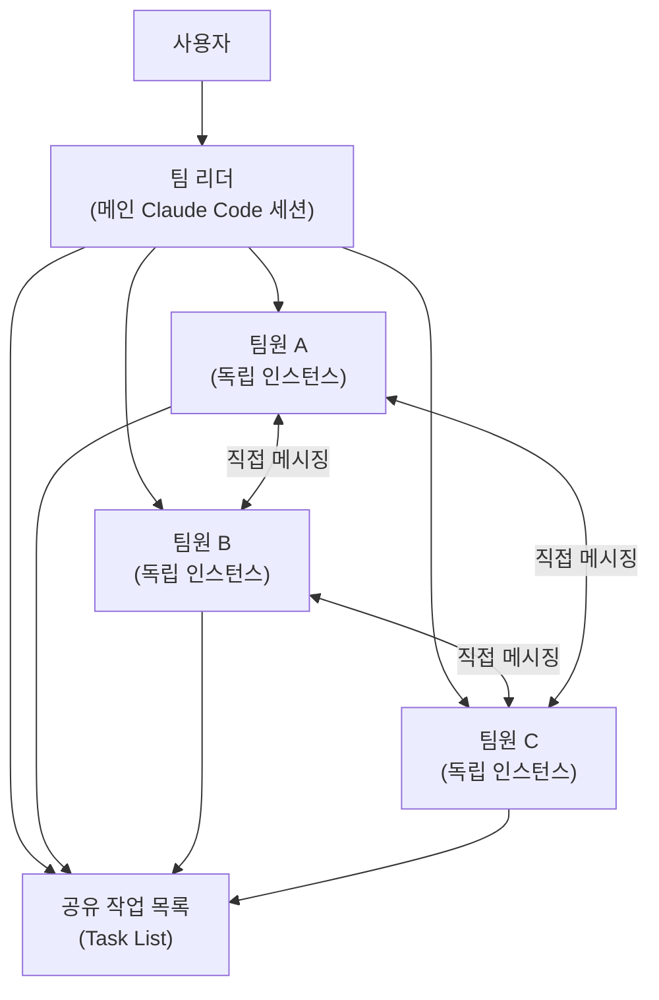
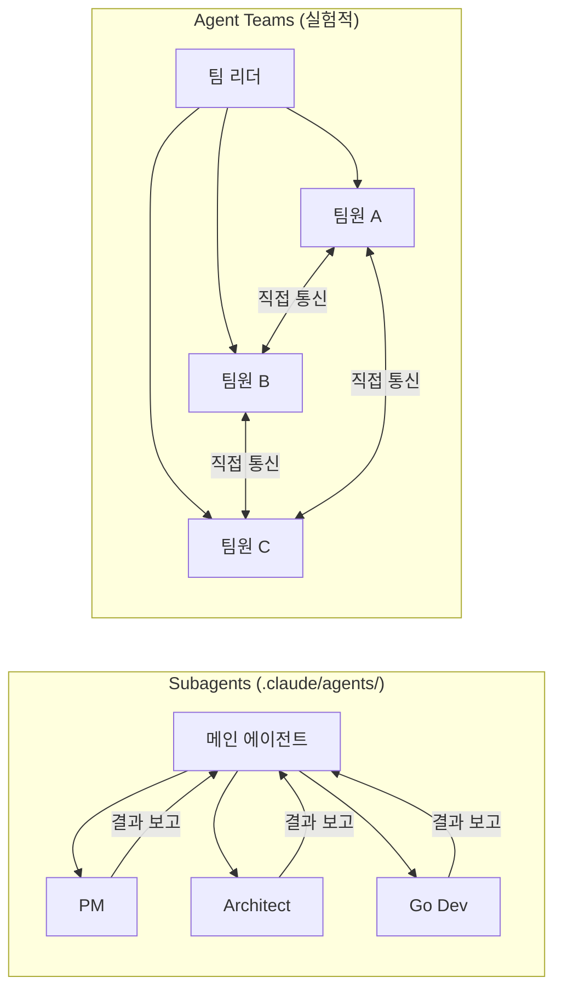
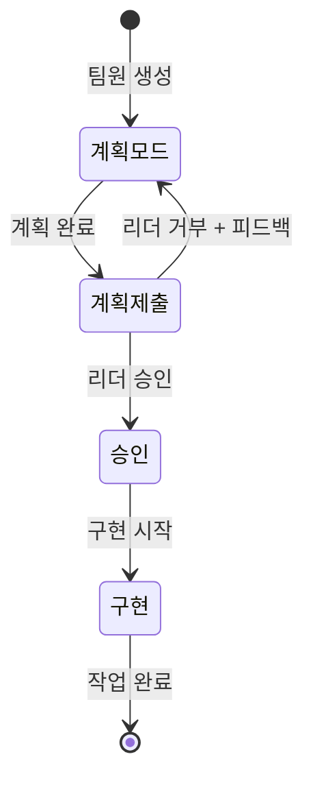
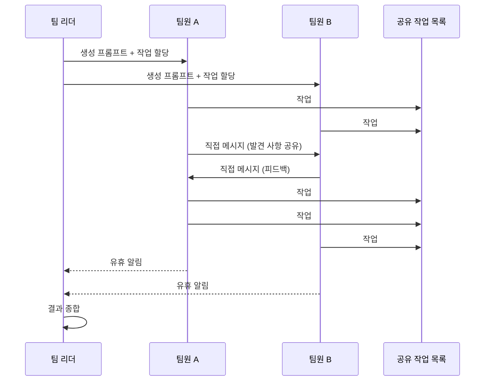

# Claude Code Agent Teams 사용 가이드

## 1. 개요

### 1.1 Agent Teams란?

Agent Teams는 여러 Claude Code 인스턴스를 **팀으로 조율**하는 실험적 기능이다.
한 세션이 **팀 리더** 역할을 하여 작업을 분배하고, **팀원들**은 독립적으로 작동하면서 서로 직접 통신한다.



### 1.2 Subagents와의 차이

이 프로젝트에는 `.claude/agents/`에 10개의 **Subagent**가 정의되어 있다.
Agent Teams는 이와 별도의 기능이다.



| 구분 | Subagents | Agent Teams |
|------|-----------|-------------|
| **정의 방식** | `.claude/agents/*.md` 파일 | 런타임에 자연어로 동적 생성 |
| **인스턴스** | 메인 세션 내 서브프로세스 | 독립 Claude Code 인스턴스 |
| **통신** | 메인 에이전트에게만 결과 보고 | 팀원 간 직접 메시지 교환 |
| **조율** | 메인 에이전트가 관리 | 공유 작업 목록으로 자체 조율 |
| **컨텍스트** | 결과가 메인 컨텍스트로 요약 반환 | 각자 독립 컨텍스트 윈도우 |
| **토큰 비용** | 낮음 | 높음 (팀원 수에 비례) |
| **적합한 작업** | 결과만 중요한 집중된 작업 | 논의·협업이 필요한 복잡한 작업 |

### 1.3 언제 사용하나?

**Agent Teams가 효과적인 경우:**
- 여러 관점에서 동시 연구/검토 (PR 리뷰, 아키텍처 평가)
- 새로운 모듈/기능 병렬 개발 (파일 충돌 없는 독립 작업)
- 경쟁 가설로 디버깅 (여러 이론을 동시 검증)
- 교차 계층 조율 (프론트엔드 + 백엔드 + 테스트)

**단일 세션/Subagents가 나은 경우:**
- 순차적 작업 (A 완료 후 B 시작)
- 동일 파일 편집 (충돌 위험)
- 의존성이 많은 작업
- 토큰 비용이 중요한 경우

---

## 2. 활성화

Agent Teams는 **실험적 기능**으로 기본 비활성화되어 있다.

### 2.1 settings.json으로 활성화 (권장)

`~/.claude/settings.json`:

```json
{
  "env": {
    "CLAUDE_CODE_EXPERIMENTAL_AGENT_TEAMS": "1"
  }
}
```

### 2.2 환경 변수로 활성화

```bash
export CLAUDE_CODE_EXPERIMENTAL_AGENT_TEAMS=1
```

> **현재 프로젝트 상태**: `~/.claude/settings.json`에 설정 완료 (2026-03-12)

---

## 3. 팀 시작하기

Claude에게 자연어로 팀 생성을 요청한다.

### 3.1 기본 팀 생성

```text
I'm designing a CLI tool that helps developers track TODO comments.
Create an agent team:
- one teammate on UX
- one on technical architecture
- one playing devil's advocate
```

### 3.2 모델 지정

```text
Create a team with 4 teammates to refactor these modules in parallel.
Use Sonnet for each teammate.
```

### 3.3 계획 승인 모드

팀원이 구현 전에 계획을 리더에게 제출하도록 요구할 수 있다.

```text
Spawn an architect teammate to refactor the authentication module.
Require plan approval before they make any changes.
```

승인 흐름:



---

## 4. 팀 제어

### 4.1 표시 모드

| 모드 | 설명 | 요구사항 |
|------|------|----------|
| **In-process** (기본) | 모든 팀원이 메인 터미널 내에서 실행 | 없음 |
| **분할 창** | 각 팀원이 자신의 창 보유 | tmux 또는 iTerm2 |

설정 방법:

```json
{
  "teammateMode": "in-process"
}
```

또는 CLI 플래그:

```bash
claude --teammate-mode in-process
```

> **RummiArena 환경**: WSL2에서 tmux 분할 창 지원이 제한적이므로 **in-process 모드 권장**

### 4.2 팀원 탐색 (In-process 모드)

| 키 | 동작 |
|----|------|
| `Shift+Down` | 다음 팀원으로 이동 (순환) |
| `Enter` | 팀원 세션 보기 |
| `Escape` | 현재 턴 중단 |
| `Ctrl+T` | 작업 목록 토글 |

### 4.3 팀원과 직접 대화

팀원에게 직접 메시지를 보내 추가 지시, 후속 질문, 방향 재설정이 가능하다.

- **In-process**: `Shift+Down`으로 팀원 선택 후 입력
- **분할 창**: 팀원 창 클릭 후 직접 상호작용

### 4.4 작업 할당

공유 작업 목록으로 팀 전체 작업을 조율한다.

| 방식 | 설명 |
|------|------|
| **리더 할당** | 리더에게 "이 작업을 팀원 A에게 할당"이라고 지시 |
| **자체 요청** | 팀원이 완료 후 다음 미할당 작업을 자동 선택 |

작업 상태: **대기 중** → **진행 중** → **완료됨**

작업 간 종속성도 지원한다. 선행 작업이 완료되면 차단된 후속 작업이 자동 해제된다.

### 4.5 팀원 종료

```text
Ask the researcher teammate to shut down
```

### 4.6 팀 정리

```text
Clean up the team
```

> **주의**: 반드시 **리더가** 정리를 실행해야 한다. 팀원이 정리를 실행하면 리소스 불일치가 발생할 수 있다.

---

## 5. RummiArena 활용 시나리오

### 5.1 병렬 코드 리뷰

```text
Create an agent team to review PR #42. Spawn three reviewers:
- Security: OWASP Top 10, 입력 검증, Secret 노출 점검
- Performance: 게임 엔진 성능, WebSocket 부하, Redis 최적화
- Test Coverage: 단위/통합 테스트 커버리지, 엣지 케이스
Have them each review and report findings.
```

### 5.2 교차 계층 기능 개발

```text
Create an agent team for the "AI Player Turn" feature:
- Frontend teammate: React 컴포넌트, 턴 타이머 UI
- Go Dev teammate: game-server WebSocket 핸들러, 턴 로직
- Node Dev teammate: ai-adapter LLM 호출, MoveRequest/MoveResponse
Each teammate owns their service directory. No shared file edits.
```

### 5.3 경쟁 가설 디버깅

```text
Users report WebSocket disconnects after 5 minutes.
Spawn 3 agent teammates to investigate:
- Hypothesis A: Traefik idle timeout 설정 문제
- Hypothesis B: Go gorilla/websocket ping/pong 미구현
- Hypothesis C: Redis pub/sub 메시지 누락
Have them talk to each other to disprove each other's theories.
```

### 5.4 설계 문서 병렬 검토

```text
Create an agent team to review our architecture documents:
- PM: 일정/WBS 정합성, 마일스톤 달성 가능성
- Architect: 계층 분리, 의존성 방향, 설계 원칙 준수
- Security: DevSecOps 파이프라인, 인증/인가 설계
- QA: 테스트 전략 커버리지, 엣지 케이스 식별
Report findings with severity (Critical/Major/Minor).
```

---

## 6. 아키텍처

### 6.1 구성 요소

| 구성 요소 | 역할 |
|-----------|------|
| **팀 리더** | 팀 생성, 팀원 생성, 작업 조율 (메인 Claude Code 세션) |
| **팀원** | 할당된 작업을 독립 수행하는 별도 Claude Code 인스턴스 |
| **작업 목록** | 팀원들이 요청/완료하는 공유 작업 항목 |
| **메일박스** | 에이전트 간 직접 통신을 위한 메시징 시스템 |

### 6.2 데이터 저장 위치

```
~/.claude/
├── teams/{team-name}/config.json    # 팀 구성 (멤버 목록)
└── tasks/{team-name}/               # 작업 목록
```

### 6.3 통신 메커니즘



### 6.4 권한

- 팀원은 **리더의 권한 설정**을 상속받는다
- 리더가 `--dangerously-skip-permissions`이면 모든 팀원도 동일
- 생성 후 개별 팀원 모드 변경 가능 (생성 시점에는 불가)
- 팀원 권한 요청이 리더로 버블링될 수 있으므로, 일반 작업은 사전 승인 권장

### 6.5 컨텍스트

- 각 팀원은 **독립 컨텍스트 윈도우** 보유
- 생성 시 CLAUDE.md, MCP servers, skills 자동 로드
- **리더의 대화 기록은 전달되지 않음** → 생성 프롬프트에 충분한 컨텍스트 포함 필요

---

## 7. 모범 사례

### 7.1 팀원에게 충분한 컨텍스트 제공

```text
Spawn a security reviewer teammate with the prompt:
"Review the authentication module at src/auth/ for security vulnerabilities.
Focus on token handling, session management, and input validation.
The app uses JWT tokens stored in httpOnly cookies.
Report any issues with severity ratings."
```

### 7.2 적절한 팀 규모

- **권장**: 3~5명
- 팀원당 5~6개 작업 유지
- 15개 독립 작업 → 3명이 적절한 시작점
- 토큰 비용이 팀원 수에 선형 증가하므로 필요 최소로 유지

### 7.3 파일 충돌 방지

- 각 팀원이 **서로 다른 파일/디렉토리**를 담당하도록 분할
- 동일 파일 편집 시 덮어쓰기 발생

### 7.4 작업 크기 조정

| 크기 | 문제 | 권장 |
|------|------|------|
| 너무 작음 | 조율 오버헤드 > 이점 | - |
| 너무 큼 | 장시간 체크인 없음, 낭비 위험 | - |
| **적절함** | 함수, 테스트 파일, 검토 등 명확한 결과물 | ✅ |

### 7.5 리더가 먼저 시작하지 않도록

```text
Wait for your teammates to complete their tasks before proceeding
```

### 7.6 16GB RAM 고려사항

RummiArena는 16GB RAM 환경이므로:
- 팀원 수를 **3명 이하**로 제한 권장
- 각 Claude Code 인스턴스가 메모리를 소비하므로 무거운 서비스(Docker, K8s)와 동시 실행 주의
- 연구/검토 작업에서 시작하여 점진적으로 확장

---

## 8. Hooks 연동

[Hooks](/ko/hooks)를 사용하여 팀원 동작에 품질 게이트를 적용할 수 있다.

| Hook | 트리거 | 활용 |
|------|--------|------|
| `TeammateIdle` | 팀원이 유휴 상태 진입 시 | 종료 코드 2로 피드백 전송, 팀원 계속 작동 |
| `TaskCompleted` | 작업이 완료로 표시될 때 | 종료 코드 2로 완료 방지, 피드백 전송 |

---

## 9. 트러블슈팅

### 9.1 팀원이 나타나지 않음

- In-process 모드에서 `Shift+Down`으로 숨은 팀원 확인
- 작업이 팀 생성을 보증할 만큼 복잡한지 확인
- 분할 창 모드: `which tmux`로 tmux 설치 확인

### 9.2 너무 많은 권한 프롬프트

- 일반 작업을 settings.json에서 사전 승인
- `.claude/settings.local.json`의 `permissions.allow` 목록 활용

### 9.3 팀원이 오류에서 중지

- `Shift+Down`으로 팀원 출력 확인
- 직접 추가 지시 제공
- 필요 시 대체 팀원 생성

### 9.4 리더가 작업 완료 전 종료

```text
Continue. Wait for all teammates to finish their tasks.
```

### 9.5 고아 tmux 세션 정리

```bash
tmux ls
tmux kill-session -t <session-name>
```

---

## 10. 제한 사항

| 제한 | 설명 |
|------|------|
| 세션 재개 불가 | `/resume`, `/rewind`가 in-process 팀원을 복원하지 않음 |
| 작업 상태 지연 | 팀원이 완료 표시를 놓쳐 후속 작업이 차단될 수 있음 |
| 종료 지연 | 현재 요청/도구 호출 완료 후 종료 |
| 세션당 1팀 | 새 팀 시작 전 현재 팀 정리 필요 |
| 중첩 불가 | 팀원이 자신의 팀 생성 불가 |
| 리더 고정 | 리더십 이전/팀원 승격 불가 |
| 분할 창 제한 | VS Code 터미널, Windows Terminal, Ghostty 미지원 |

---

## 11. 참고

| 항목 | 링크 |
|------|------|
| Agent Teams 공식 문서 | https://code.claude.com/docs/ko/agent-teams |
| Subagents 문서 | https://code.claude.com/docs/ko/sub-agents |
| Hooks 문서 | https://code.claude.com/docs/ko/hooks |
| 토큰 비용 | https://code.claude.com/docs/ko/costs#agent-team-token-costs |
| Settings 문서 | https://code.claude.com/docs/ko/settings |
