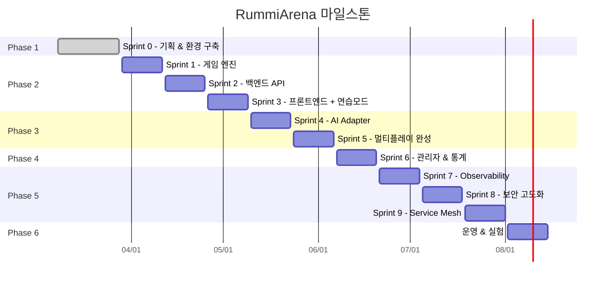

# 프로젝트 헌장 (Project Charter)

## 1. 프로젝트 개요

| 항목 | 내용 |
|------|------|
| 프로젝트명 | RummiArena - 멀티 LLM 전략 실험 플랫폼 |
| 프로젝트 유형 | 내부 AI 실험 프로젝트 (외부 서비스 수준 설계) |
| 시작일 | 2026-03-08 |
| 목표 종료일 | 2026-08-15 (약 23주, Sprint 0~9) |
| Sprint 주기 | 2주 |
| 저장소 | https://github.com/k82022603/RummiArena |

## 2. 프로젝트 목적

루미큐브(Rummikub) 보드게임을 기반으로 Human과 AI가 혼합 대전하는 플랫폼을 구축한다.

### 핵심 목표
- **멀티 LLM 전략 비교**: OpenAI, Claude, DeepSeek, 로컬 LLaMA 모델의 게임 전략을 실험/비교
- **풀스택 플랫폼 엔지니어링 실습**: Kubernetes, GitOps, DevSecOps 전체 사이클 경험
- **실시간 멀티플레이**: WebSocket 기반 2~4인 동시 대전
- **외부 공개 가능한 아키텍처**: 내부 실험이지만 SaaS 수준 설계

## 3. 프로젝트 범위 (Scope)

### In-Scope
- 루미큐브 게임 엔진 (규칙 검증, 상태 관리)
- 1인 연습 모드 (Stage 1~6, 튜토리얼 포함)
- 실시간 멀티플레이 (WebSocket)
- Google OAuth 로그인
- 멀티 LLM AI 플레이어 (OpenAI, Claude, DeepSeek, Ollama/LLaMA)
- AI 캐릭터 시스템 (6캐릭터 x 3난이도 x 심리전 Level 0~3)
- ELO 랭킹 시스템
- 관리자 대시보드 (게임 모니터링, AI 통계, 유저 관리)
- Kubernetes 배포 (Docker Desktop)
- GitOps CI/CD (GitLab + GitLab Runner + ArgoCD + Helm)
- DevSecOps (SonarQube, Trivy, OWASP ZAP)
- 카카오톡 알림 연동
- Observability (Lean -> 점진 확장)

### Out-of-Scope
- 모바일 네이티브 앱
- 결제 시스템
- 대규모 트래픽 처리 (100+ 동시 사용자)

## 4. 이해관계자

| 역할 | 담당 | 비고 |
|------|------|------|
| PM / 개발자 | 애벌레 | 전체 설계/개발/운영 (1인 개발) |
| AI 플레이어 | LLM 모델들 | OpenAI, Claude, DeepSeek, LLaMA |
| 사용자 | 내부 테스터 | Google 계정 보유자 |

## 5. 마일스톤

| Phase | 목표 날짜 | 마일스톤 |
|-------|-----------|----------|
| Phase 1 (Sprint 0) | 2026-03-28 | 기획 완료, 인프라 환경 구축, **Backend 기술 결정** |
| Phase 2 (Sprint 1~3) | 2026-05-09 | 게임 엔진 + 백엔드 + 프론트엔드 MVP, 1인 연습 모드 |
| Phase 3 (Sprint 4~5) | 2026-06-06 | AI Adapter 4종 연동, 실시간 멀티플레이 |
| Phase 4 (Sprint 6) | 2026-06-20 | 관리자 대시보드, ELO 랭킹, 카카오톡 알림 |
| Phase 5 (Sprint 7~9) | 2026-08-01 | Observability, 보안 고도화, Istio Service Mesh |
| Phase 6 (운영) | 2026-08-15 | AI 토너먼트, 모델 비교 분석, 운영 가이드 |

> ~~Backend 기술 결정 (NestJS vs Go): Sprint 0 완료 전(2026-03 말)까지 확정한다.~~
> **[확정]** 폴리글랏 구성: game-server = **Go** (gin), ai-adapter = **NestJS** (TypeScript). 상세는 02-design/01-architecture.md §9 참조.

## 6. 핵심 제약 조건

### 6.1 하드웨어 사양
| 항목 | 사양 |
|------|------|
| 장비 | LG 그램 15Z90R |
| CPU | Intel i7-1360P (12코어/16스레드, 2.2GHz) |
| RAM | 16GB (실사용 가능 ~12GB, OS/시스템 제외) |
| GPU | Intel Iris Xe (내장, VRAM 없음) |
| 디스크 | SSD |
| OS | Windows 11 Pro + WSL2 + Hyper-V |

### 6.2 리소스 제약 및 운영 전략
RAM 16GB로 모든 서비스 동시 실행 불가. **교대 실행 전략** 적용:

| 모드 | 실행 서비스 | 예상 RAM |
|------|------------|----------|
| 개발 모드 | 앱(게임서버, 프론트) + Redis + PostgreSQL | ~6GB |
| CI/CD 모드 | ArgoCD + GitLab Runner | ~6GB |
| 품질 모드 | SonarQube (단독) | ~4GB |
| AI 실험 모드 | Ollama + 1B~3B 모델 (K8s 밖 직접 실행) | ~5GB |

> Oracle VirtualBox 별도 VM은 이 사양에서 RAM 분할만 발생하므로 사용하지 않는다.
> Ollama로 7B+ 모델은 K8s와 동시 실행 불가. 3B 이하 모델 또는 API 모델 사용 권장.

### 6.3 기타 제약
| 제약 | 상세 |
|------|------|
| 비용 | LLM API 호출 비용 최소화 필요 |
| 인원 | 1인 개발 |

## 7. 기술 스택 요약

| 영역 | 기술 |
|------|------|
| Frontend | Next.js, TailwindCSS, Framer Motion, dnd-kit |
| Backend (game-server) | Go (gin + gorilla/websocket + GORM) |
| Backend (ai-adapter) | NestJS (TypeScript) |
| Database | PostgreSQL 16 |
| Cache/State | Redis 7 |
| AI | OpenAI API, Claude API, DeepSeek API, Ollama |
| Container | Docker, Kubernetes (Docker Desktop) |
| CI | GitLab CI + GitLab Runner |
| CD | ArgoCD + Helm |
| Code Quality | SonarQube |
| Security | Trivy, OWASP ZAP |
| Notification | 카카오톡 API |
| Auth | Google OAuth 2.0 |

## 8. 성공 기준

### 8.1 기능 성공 기준
| 기준 | 목표값 |
|------|--------|
| Human + AI 혼합 게임 정상 동작 | 2~4인 게임 완주율 95% 이상 |
| LLM 모델 동시 참가 | 최소 3개 이상 모델 동시 참가 가능 |
| AI 대전 실험 | AI vs AI 대전 100판 이상 완료 |
| 1인 연습 모드 | Stage 1~6 전체 플레이 가능 |
| AI 캐릭터 시스템 | 6캐릭터 x 3난이도 조합 동작 확인 |

### 8.2 품질/인프라 성공 기준
| 기준 | 목표값 |
|------|--------|
| CI 파이프라인 소요 시간 | 평균 5분 이내 |
| GitOps 자동 배포 | ArgoCD Sync 성공률 99% 이상 |
| SonarQube 품질 게이트 | 통과 (Coverage >= 60%, Bug 0) |
| 컨테이너 보안 스캔 | Trivy CRITICAL/HIGH 취약점 0 |
| Pod 재시작 시 게임 복구 | 30초 이내 |
| AI 턴 응답 시간 | 10초 이내 (95 percentile) |
| 게임 결과 기반 AI 비교 | 모델별 승률/전략 분석 리포트 산출 |

## 9. 스크럼 운영 규칙

- **최초 제정**: 2026-04-24 (Sprint 7 Day 3, AM 스탠드업 Action Item 이행)
- **적용 개시**: 2026-04-25 (Day 4) 부터 주 1회 회고 모드 정기화
- **책임**: PM 주관 (퍼실리테이션) · Claude main (로그 기록) · 애벌레 (PO, 주제 승인)

### 9.1 배경

Sprint 7 Day 2 (2026-04-23) 머지 직후 실사용자 플레이테스트에서 회귀 7건이 폭발했고, 같은 날 아침 스크럼에서는 11명 전원이 "블로커: 없음" 을 반복하고 있었다. 최근 3주간의 스크럼 로그 (`work_logs/scrums/2026-04-21~23`) 를 돌아보면 **"어제 / 오늘 / 블로커"** 3줄 반복이 보고회로 굳어졌고, "Sprint 5 부터 같은 UI 회귀 패턴이 반복되는가" 같은 구조 질문이 한 번도 제기되지 않았다. 스크럼이 작업 현황 공유 이상의 **반성 장치** 역할을 하도록 주 1회 회고 모드를 정례화한다.

### 9.2 스크럼 운영 주기 (주 5일 기준)

| 구분 | 요일 (기본) | 포맷 | 소요 시간 |
|------|------------|------|----------|
| **데일리 스탠드업** | 월/화/수/목 (주 4일) | **어제 / 오늘 / 블로커** 각 1~3줄 | 15~20분 |
| **회고 모드 스크럼** | **금요일 (주 1회, Sprint 중 1회 고정)** | **부주제 1개 + 각자 250~400자 발언 + 액션 아이템 추적** | 40~60분 |

- 기본 요일은 금요일이나, Sprint 킥오프/마감 주간 등 스케줄 충돌 시 Sprint 내 **1회 고정** 이 원칙 (요일은 PM 재량).
- Sprint 2주 주기 = 회고 모드 2회 이상 보장.
- 데일리 포맷은 기존 `work_logs/scrums/_template.md` 구조 유지.

### 9.3 회고 모드 부주제 로테이션 (5개 이내)

매 회차 하나씩 순환. 로테이션이 한 바퀴 돌면 재시작. 동일 주제 반복은 PM 이 "이번 주 이 주제가 다시 등판한 근거" 를 스크럼 본문 머리에 명시.

| 순번 | 부주제 | 질문 프레임 |
|------|--------|------------|
| 1 | **반복 패턴** | "지난 1~2주간 반복해서 등장한 버그·지연·착각 패턴은 무엇이고, 왜 계속 등장하는가?" |
| 2 | **구조 개선 1건** | "지금 당장 한 개만 고친다면 어느 구조를 바꿔야 가장 큰 연쇄 효과가 나는가? ADR 후보 1건." |
| 3 | **놓친 회귀** | "지난 주 머지 이후 실사용자·운영 모니터링에서 뒤늦게 발견된 회귀는? Pre-merge 에서 왜 못 잡았나?" |
| 4 | **지표 vs 체감** | "우리가 추적하는 지표 (테스트 PASS 수, 커버리지, cost 등) 와 실사용자/본인 체감이 괴리된 지점은?" |
| 5 | **번아웃 & 속도** | "지난 주 처리량이 지속 가능했는가? '가속' 착시 신호는 없었는가?" |

- 규칙 중복 방지를 위해 주제는 5개로 제한. 5개를 모두 돈 뒤에는 재시작.
- Sprint 회고 (Sprint 종료 주) 는 별도 공식 문서 (sprint-review) 로 집약하며, 본 회고 모드와 병행하지 않는다.

### 9.4 회고 모드 발언 규칙

1. 각자 **선택된 부주제 관점에서만** 발언. "오늘 할 일" 같은 데일리 내용은 금지 (별도 데일리에서 다룸).
2. **250~400자 필수** (한글 기준). 한 줄 "반성합니다" 금지.
3. 자기 경계 안쪽 (서버/어댑터/프런트/인프라) 보다 **경계 너머 사용자 경험** 에 어떻게 기여·누락했는지 1문장 이상 포함.
4. 애벌레 (PO) 는 사용자 관점에서 프로덕트 체감 1건을 반드시 공유.
5. Claude main 은 본인 반성 외에 **패턴 교집합 분석** (몇 명 이상이 동일 진단?) 을 스크럼 말미에 1표로 제출.

### 9.5 액션 아이템 추적

- 회고 모드에서 나온 액션 아이템은 **다음 주 Sprint Review 전까지** 추적한다 (Sprint Review 가 없는 주는 다음 회고 모드 스크럼 전까지).
- PM 이 스크럼 로그 끝에 `회고 Action #N / 기한 / 책임자 / 증빙 PR 링크` 표를 작성.
- 미완 액션은 다음 회고 모드 머리에 "롤오버 이유" 와 함께 재상정. 2회 연속 롤오버 시 Sprint 백로그 승격 또는 WONTFIX ADR 필수.

### 9.6 체크리스트 — 회고 모드 스크럼 운영

- [ ] PM 이 회고 모드 3일 전 부주제 공지 (로테이션 순번 + 질문 프레임)
- [ ] 참석자 각자 250~400자 사전 초안 준비 (선택이지만 권장)
- [ ] 당일 스크럼 로그에 부주제 명시 + 11명 (또는 전체) 발언 전수 기록
- [ ] Claude main 의 패턴 교집합 분석 표 포함
- [ ] 액션 아이템 표에 기한 + 책임자 + 추적 방법 명시
- [ ] 스크럼 로그 파일은 `work_logs/scrums/YYYY-MM-DD-01.md` 포맷 유지
- [ ] PM 이 헌장 §9 로테이션 상태 (이번 회차가 1~5 중 어디인지) 메모에 기록

### 9.7 개정 이력

| 버전 | 일자 | 작성자 | 변경 내용 |
|------|------|--------|-----------|
| v1.0 | 2026-04-24 | pm (Opus 4.7 xhigh) + Claude main | 최초 제정. Sprint 7 Day 3 AM 스탠드업 11명 반성 결과, 스크럼이 보고회로 퇴화한 증거 수집 (`2026-04-21~23` 스크럼 로그) 후 주 1회 회고 모드 정례화. Merge Gate 정책 (`docs/01-planning/22-merge-gate-policy.md`) 과 짝을 이루는 품질 게이트. |
