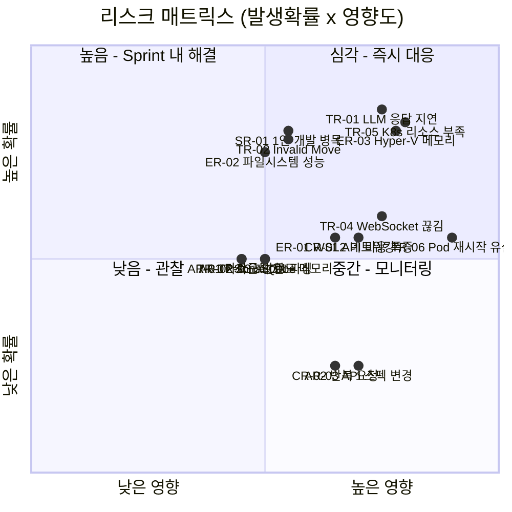

# 리스크 관리 계획 (Risk Management Plan)

## 1. 리스크 식별 및 대응 전략

### 기술 리스크

| ID | 리스크 | 발생확률 | 영향도 | 등급 | 대응 전략 | 리스크 오너 |
|----|--------|----------|--------|------|-----------|-------------|
| TR-01 | LLM 응답 지연/타임아웃 | 높음 | 높음 | 심각 | Timeout 10초 설정, 재요청 3회, fallback으로 랜덤 드로우 | 애벌레 |
| TR-02 | LLM이 불법 수(Invalid Move) 제안 | 높음 | 중간 | 높음 | Game Engine 유효성 검증 필수, 재요청 로직 | 애벌레 |
| TR-03 | LLM JSON 파싱 오류 | 중간 | 중간 | 중간 | Structured Output 사용, 파싱 실패 시 재요청 | 애벌레 |
| TR-04 | WebSocket 연결 끊김 | 중간 | 높음 | 높음 | 자동 재연결, 게임 상태 서버 보존 | 애벌레 |
| TR-05 | Docker Desktop K8s 리소스 부족 | 높음 | 높음 | 심각 | Resource limit 설정, Ollama 메모리 상한 제한, **교대 실행 전략** 적용 (01-project-charter.md 6.2절 참조) | 애벌레 |
| TR-06 | Pod 재시작 시 게임 데이터 유실 | 중간 | 심각 | 심각 | Stateless 설계, 게임 상태 Redis/PostgreSQL 저장, 복구 목표 30초 이내 | 애벌레 |
| TR-07 | SonarQube 메모리 과다 사용 | 중간 | 중간 | 중간 | Docker Desktop 메모리 할당 조정, 분석 주기 제한, 품질 모드 전용 실행 | 애벌레 |

### 환경 리스크

| ID | 리스크 | 발생확률 | 영향도 | 등급 | 대응 전략 | 리스크 오너 |
|----|--------|----------|--------|------|-----------|-------------|
| ER-01 | WSL2 네트워킹 불안정 (포트 포워딩 오류, DNS 이슈) | 중간 | 높음 | 높음 | WSL2 포트 매핑 스크립트 관리, /etc/resolv.conf 고정, 재시작 자동화 | 애벌레 |
| ER-02 | WSL2 + Docker Desktop 파일시스템 성능 저하 | 높음 | 중간 | 높음 | WSL2 내부(/home)에 소스 배치, Windows 마운트(/mnt) 최소 사용, .wslconfig 최적화 | 애벌레 |
| ER-03 | Hyper-V 메모리 과점유 (WSL2 + Docker Desktop) | 높음 | 높음 | 심각 | .wslconfig으로 메모리 상한 설정 (10GB), 프로젝트별 프로파일 전환 (switch-wslconfig.sh) | 애벌레 |

### 외부 API 리스크

| ID | 리스크 | 발생확률 | 영향도 | 등급 | 대응 전략 | 리스크 오너 |
|----|--------|----------|--------|------|-----------|-------------|
| AR-01 | 카카오톡 API 일일 발송 한도 초과 | 중간 | 중간 | 중간 | 알림 우선순위 분류 (장애 > 빌드실패 > 게임이벤트), 일일 발송량 모니터링, 임계치 도달 시 저우선 알림 억제 | 애벌레 |
| AR-02 | 카카오톡 인증 토큰 만료/갱신 실패 | 중간 | 중간 | 중간 | Refresh Token 자동 갱신 로직, 토큰 만료 사전 알림, 수동 갱신 절차 문서화 | 애벌레 |
| AR-03 | 카카오톡 API 스펙 변경/지원 중단 | 낮음 | 높음 | 중간 | 알림 서비스 추상화 (인터페이스 분리), 대체 채널 준비 (이메일 fallback) | 애벌레 |

### 비용 리스크

| ID | 리스크 | 발생확률 | 영향도 | 등급 | 대응 전략 | 리스크 오너 |
|----|--------|----------|--------|------|-----------|-------------|
| CR-01 | LLM API 비용 폭증 | 중간 | 높음 | 높음 | 사용자당/게임당 호출 제한, 토큰 사용량 모니터링 | 애벌레 |
| CR-02 | 악의적 반복 요청 | 낮음 | 높음 | 중간 | Rate limiting, 인증 필수 | 애벌레 |

### 일정 리스크

| ID | 리스크 | 발생확률 | 영향도 | 등급 | 대응 전략 | 리스크 오너 |
|----|--------|----------|--------|------|-----------|-------------|
| SR-01 | 1인 개발로 인한 병목 | 높음 | 중간 | 높음 | Agile Sprint 기반 우선순위 관리, MVP 우선 | 애벌레 |
| SR-02 | 테이블 재배치 UX 구현 난이도 | 중간 | 중간 | 중간 | 1단계 단순배치 -> 2단계 재조합으로 분리 | 애벌레 |
| SR-03 | 인프라 구성에 과도한 시간 소요 | 중간 | 중간 | 중간 | Helm chart 템플릿 활용, 단계적 구축 | 애벌레 |

## 2. 리스크 등급 기준

| 등급 | 기준 | 대응 |
|------|------|------|
| 심각 | 프로젝트 중단 가능 | 즉시 대응, 설계 반영 |
| 높음 | 주요 기능 영향 | Sprint 내 해결 |
| 중간 | 품질/일정 영향 | 모니터링 후 대응 |
| 낮음 | 경미한 영향 | 기록 후 관찰 |

## 3. 리스크 매트릭스

## 4. 리스크 모니터링

- Sprint 회고 시 리스크 상태 점검
- AI 호출 비용 주간 리뷰
- K8s 리소스 사용량 일일 확인 (`kubectl top`)
- 카카오톡 API 일일 발송량 모니터링
- WSL2 메모리 사용량 모니터링 (`wsl --status`, `.wslconfig` 프로파일 점검)
- 리스크 오너(애벌레)가 Sprint 단위로 리스크 등급 재평가
