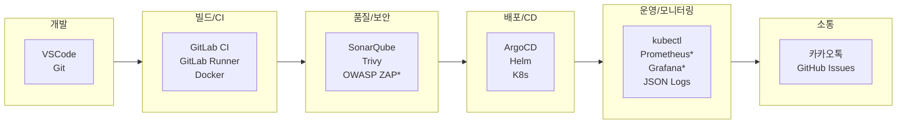
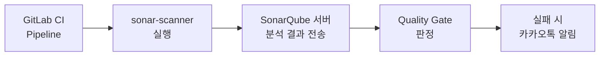
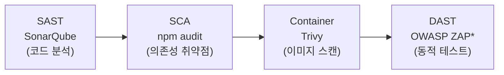
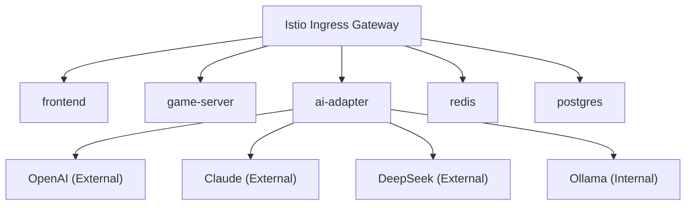

# 도구 체인 및 환경 구성 (Tool Chain & Environment)

## 1. 전체 도구 체인 맵

> `*` 표시: 2단계 이후 도입

## 2. ALM (Application Lifecycle Management) 도구

| 단계 | 도구 | 용도 |
|------|------|------|
| 백로그/이슈 관리 | **GitHub Projects + Issues** | Kanban 보드, Sprint 관리, 이슈 추적 |
| 소스 관리 | **GitHub** | 소스 코드 저장소 |
| CI (빌드/테스트) | **GitLab CI + GitLab Runner** | Docker 빌드, 테스트, 이미지 Push |
| 코드 품질 | **SonarQube** | 정적 분석, 코드 스멜, 커버리지 |
| 보안 스캔 | **Trivy** | 컨테이너 이미지 취약점 스캔 |
| DAST | **OWASP ZAP** (2단계) | 동적 보안 테스트 |
| CD (배포) | **ArgoCD + Helm** | GitOps 기반 배포 |
| 알림 | **카카오톡 API** | 빌드/배포/장애 알림 |

## 3. 개발 환경

| 항목 | 설정 |
|------|------|
| OS | Windows 11 + WSL2 |
| 런타임 | Docker Desktop (Kubernetes 활성화) |
| IDE | VSCode + 관련 확장 |
| Node.js | v20 LTS |
| Go | 1.22+ (Backend Go 선택 시) |
| Helm | v3.x |
| kubectl | Docker Desktop 내장 |

## 4. 카카오톡 연동 계획

### 4.1 사전 준비
- [카카오 디벨로퍼스](https://developers.kakao.com) 앱 등록
- 카카오톡 메시지 API 활성화
- 앱 키 발급 (REST API Key)

### 4.2 연동 대상 이벤트
| 이벤트 | 알림 내용 |
|--------|-----------|
| CI 빌드 실패 | 빌드 실패 알림 + 에러 요약 |
| 배포 완료 | ArgoCD Sync 완료 알림 |
| SonarQube 품질 게이트 실패 | 코드 품질 이슈 알림 |
| 보안 취약점 발견 | Trivy/ZAP 결과 알림 |
| AI 장애 | AI Adapter 응답 실패율 임계치 초과 |
| 게임 이벤트 | 게임 초대, 결과 알림 (선택) |

### 4.3 구현 방식
- 카카오톡 나에게 보내기 API 활용 (개인 알림)
- 또는 카카오워크 봇 API (팀 채널 알림)
- GitLab CI에서 Webhook → 카카오 API 호출

## 5. SonarQube 구성 계획

### 5.1 배포 방식
- Docker Desktop K8s에 Helm으로 배포
- 또는 Docker Compose로 별도 실행 (리소스 절약)

### 5.2 연동 구조

### 5.3 품질 게이트 기준 (초기)
| 메트릭 | 기준 |
|--------|------|
| Coverage | ≥ 60% |
| Duplicated Lines | ≤ 5% |
| Bugs | 0 (New Code) |
| Vulnerabilities | 0 (New Code) |
| Code Smells | ≤ 10 (New Code) |

## 6. 보안 스캔 도구 체인 (DevSecOps)

### 파이프라인 내 보안 게이트
1. `sonar-scanner` → 품질 게이트 통과
2. `npm audit` / `go vet` → 취약 의존성 0
3. `trivy image` → CRITICAL/HIGH 취약점 0
4. (2단계) OWASP ZAP → 배포 후 자동 스캔

## 7. Oracle VM 활용 방안 (비권장)

> **현재 장비(LG 그램, RAM 16GB)에서는 사용하지 않는다.**
> VM은 물리 RAM을 나눠 쓰므로, 16GB 환경에서 VM 추가 시 오히려 성능 악화.
> 별도 PC(32GB+)가 확보되거나, 멀티노드 K8s 실험이 필요할 때만 검토.

대안: **교대 실행 전략**으로 Docker Desktop 하나에서 모드별 서비스 전환.

## 8. Istio Service Mesh 구성 계획

### 8.1 도입 목적
- **mTLS**: 서비스 간 자동 암호화 통신
- **트래픽 관리**: AI Adapter별 가중치 라우팅, Canary 배포
- **관측성**: Kiali 대시보드로 서비스 토폴로지/트래픽 시각화
- **장애 주입**: AI 응답 지연 시뮬레이션 (Chaos Engineering)
- **Rate Limiting**: AI API 호출 제한

### 8.2 적용 대상 서비스

### 8.3 핵심 활용 시나리오
| 시나리오 | Istio 기능 |
|----------|-----------|
| AI 모델 A/B 테스트 | VirtualService 가중치 라우팅 |
| 서비스 간 암호화 | PeerAuthentication (mTLS) |
| AI 타임아웃 제어 | DestinationRule timeout 설정 |
| Circuit Breaker | DestinationRule outlierDetection |
| 트래픽 시각화 | Kiali + Jaeger |
| 카나리 배포 실험 | VirtualService + Subset |

### 8.4 설치 방식
- istioctl 또는 Helm으로 설치
- Docker Desktop K8s에서 동작 가능 (메모리 추가 ~2GB 필요)
- Kiali, Jaeger, Prometheus 애드온 함께 설치

### 8.5 주의사항
- 리소스 소모가 큼 → Phase 2 이후 도입 권장
- Sidecar injection으로 Pod 메모리 증가
- Oracle VM에서 별도 클러스터 구성도 고려

## 9. 추가 실험 가능 도구

| 도구 | 용도 | 단계 |
|------|------|------|
| Backstage | 개발자 포털 | 3단계 |
| k6 / Artillery | 부하 테스트 | 2단계 |
| Vault | Secret 관리 | 2단계 |
| Cert-Manager | TLS 인증서 자동화 | 2단계 |
| Telepresence | 로컬-K8s 개발 브릿지 | 선택 |
| Kustomize | Helm 대안 실험 | 선택 |
| **Istio** | **Service Mesh (트래픽 관리, mTLS, 관측)** | **2단계** |
