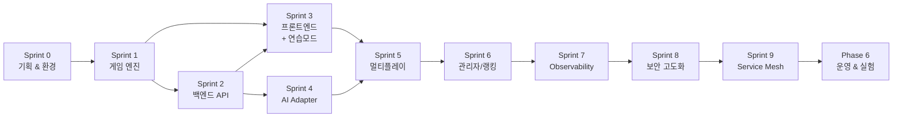

# WBS (Work Breakdown Structure)

## Sprint-Phase 매핑 표

| Sprint | Phase | 기간 | 주요 목표 |
|--------|-------|------|-----------|
| Sprint 0 | Phase 1: 기획 & 환경 구축 | 2026-03-08 ~ 03-28 (3주) | 기획 문서, 인프라 환경, Backend 기술 결정 |
| Sprint 1 | Phase 2: 핵심 게임 개발 | 2026-03-29 ~ 04-11 (2주) | 게임 엔진 |
| Sprint 2 | Phase 2: 핵심 게임 개발 | 2026-04-12 ~ 04-25 (2주) | 백엔드 API |
| Sprint 3 | Phase 2: 핵심 게임 개발 | 2026-04-26 ~ 05-09 (2주) | 프론트엔드 + 1인 연습 모드 |
| Sprint 4 | Phase 3: AI 연동 & 멀티플레이 | 2026-05-10 ~ 05-23 (2주) | AI Adapter 4종 |
| Sprint 5 | Phase 3: AI 연동 & 멀티플레이 | 2026-05-24 ~ 06-06 (2주) | 실시간 멀티플레이 완성 |
| Sprint 6 | Phase 4: 플랫폼 기능 확장 | 2026-06-07 ~ 06-20 (2주) | 관리자, ELO 랭킹, 카카오톡 알림 |
| Sprint 7 | Phase 5: DevSecOps 고도화 | 2026-06-21 ~ 07-04 (2주) | Prometheus, Grafana, 로그 수집 |
| Sprint 8 | Phase 5: DevSecOps 고도화 | 2026-07-05 ~ 07-18 (2주) | SonarQube 고도화, Trivy, OWASP ZAP |
| Sprint 9 | Phase 5: DevSecOps 고도화 | 2026-07-19 ~ 08-01 (2주) | Istio, Kiali, Jaeger, 부하 테스트 |
| 운영 | Phase 6: 운영 & 실험 | 2026-08-02 ~ 08-15 (2주) | AI 토너먼트, 분석, 운영 가이드 |

> 전체 프로젝트 기간: 약 23주 (Sprint 0~9 + 운영 기간)
> Sprint 0은 초기 셋업을 위해 3주, 이후 Sprint는 2주 고정

## 전체 프로젝트 Gantt 차트

```mermaid
gantt
    title RummiArena 전체 WBS
    dateFormat YYYY-MM-DD
    axisFormat %m/%d

    section Phase 1 - 기획 & 환경
        Sprint 0: 기획/인프라/Backend 결정   :done, s0, 2026-03-08, 2026-03-28

    section Phase 2 - 핵심 게임 (MVP)
        Sprint 1: 게임 엔진                  :s1, 2026-03-29, 2026-04-11
        Sprint 2: 백엔드 API                 :s2, 2026-04-12, 2026-04-25
        Sprint 3: 프론트엔드 + 연습모드       :s3, 2026-04-26, 2026-05-09

    section Phase 3 - AI & 멀티플레이
        Sprint 4: AI Adapter                 :s4, 2026-05-10, 2026-05-23
        Sprint 5: 멀티플레이 완성             :s5, 2026-05-24, 2026-06-06

    section Phase 4 - 플랫폼 확장
        Sprint 6: 관리자/랭킹/알림            :s6, 2026-06-07, 2026-06-20

    section Phase 5 - DevSecOps 고도화
        Sprint 7: Observability              :s7, 2026-06-21, 2026-07-04
        Sprint 8: 보안 고도화                 :s8, 2026-07-05, 2026-07-18
        Sprint 9: Service Mesh               :s9, 2026-07-19, 2026-08-01

    section Phase 6 - 운영 & 실험
        운영/토너먼트/분석                    :op, 2026-08-02, 2026-08-15
```

## 작업 간 의존 관계



| 작업 | 선행 의존 | 비고 |
|------|-----------|------|
| Sprint 1 (게임 엔진) | Sprint 0 완료 | Backend 기술 결정 필요 |
| Sprint 2 (백엔드 API) | Sprint 1 | 게임 엔진 로직 필요 |
| Sprint 3 (프론트엔드) | Sprint 1, 2 | API 엔드포인트 + 게임 로직 |
| Sprint 4 (AI Adapter) | Sprint 2 | 백엔드 API 연동 |
| Sprint 5 (멀티플레이) | Sprint 3, 4 | 프론트 + AI 통합 |
| Sprint 6 (관리자/랭킹) | Sprint 5 | 게임 완료 데이터 필요 |
| Sprint 7 (Observability) | Sprint 6 | 운영 대상 서비스 완성 |
| Sprint 8 (보안 고도화) | Sprint 7 | 모니터링 기반 위에 보안 강화 |
| Sprint 9 (Service Mesh) | Sprint 8 | Prometheus 선행, 보안 정비 후 Mesh 도입 |

---

## Phase 1: 기획 & 환경 구축

### Sprint 0 (2026-03-08 ~ 03-28, 3주)

| ID | 작업 | 산출물 |
|----|------|--------|
| 1.1.1 | 프로젝트 기획 문서 작성 | docs/01-planning/* |
| 1.1.2 | GitHub 저장소 구성 + Issue 템플릿 | .github/ |
| 1.1.3 | Docker Desktop K8s 활성화 | - |
| 1.1.4 | NGINX Ingress Controller 설치 | K8s Ingress |
| 1.1.5 | ArgoCD 설치 (Helm) | argocd namespace |
| 1.1.6 | GitLab Runner 등록 | .gitlab-ci.yml |
| 1.1.7 | SonarQube 설치 (Docker) | sonarqube 서비스 |
| 1.1.8 | Helm Umbrella Chart 초기 구조 | helm/ |
| 1.1.9 | GitOps 레포 구조 설정 | environments/ |
| 1.1.10 | ~~Backend 기술 결정~~ → **확정: Go (game-server) + NestJS (ai-adapter)** | 01-architecture.md §9 |

---

## Phase 2: 핵심 게임 개발 (MVP)

### Sprint 1: 게임 엔진 (2026-03-29 ~ 04-11)

| ID | 작업 | 산출물 |
|----|------|--------|
| 2.1.1 | 루미큐브 타일 데이터 모델 설계 | 타일 구조체/클래스 |
| 2.1.2 | 타일 풀(Pool) 생성 및 셔플 | 초기 분배 로직 |
| 2.1.3 | 그룹 유효성 검증 로직 | 검증 함수 |
| 2.1.4 | 런 유효성 검증 로직 | 검증 함수 |
| 2.1.5 | 조커 처리 로직 | 조커 규칙 구현 |
| 2.1.6 | 최초 등록 (30점) 조건 검증 | 등록 검증 함수 |
| 2.1.7 | 턴 관리 (턴 전환, 드로우, 타임아웃 30~120초) | 턴 매니저 |
| 2.1.8 | 승리 조건 판정 | 게임 종료 로직 |
| 2.1.9 | 게임 상태 enum (WAITING, PLAYING, FINISHED, CANCELLED) | 상태 관리 |
| 2.1.10 | 게임 엔진 단위 테스트 | 테스트 코드 |

### Sprint 2: 백엔드 API (2026-04-12 ~ 04-25)

| ID | 작업 | 산출물 |
|----|------|--------|
| 2.2.1 | 프로젝트 초기화 (Go gin) | src/game-server/ |
| 2.2.2 | REST API 설계 (Room CRUD) | API 엔드포인트 |
| 2.2.3 | WebSocket 서버 구현 | 실시간 통신 |
| 2.2.4 | Redis 연동 (게임 상태 저장) | Redis 클라이언트 |
| 2.2.5 | PostgreSQL 연동 (유저, 전적) | DB 스키마 |
| 2.2.6 | Health / Metrics 엔드포인트 | /health, /metrics |
| 2.2.7 | 구조화 JSON 로그 설정 | Logger 설정 |
| 2.2.8 | Dockerfile 작성 | Docker 이미지 |
| 2.2.9 | Helm Chart 작성 | helm/charts/game-server/ |

### Sprint 3: 프론트엔드 + 1인 연습 모드 (2026-04-26 ~ 05-09)

| ID | 작업 | 산출물 |
|----|------|--------|
| 2.3.1 | Next.js 프로젝트 초기화 | src/frontend/ |
| 2.3.2 | Google OAuth 로그인 구현 | 로그인 페이지 |
| 2.3.3 | 로비 화면 (Room 목록/생성) | 로비 UI |
| 2.3.4 | 게임 보드 기본 레이아웃 | 게임 화면 |
| 2.3.5 | 타일 랙 UI (내 타일) | 하단 랙 컴포넌트 |
| 2.3.6 | 타일 드래그 & 드롭 (dnd-kit) | 인터랙션 |
| 2.3.7 | WebSocket 연결 | 실시간 동기화 |
| 2.3.8 | **1인 연습 모드 Stage 1~6 구현 (FR-001B)** | 연습 모드 UI/로직 |
| 2.3.9 | Dockerfile 작성 | Docker 이미지 |
| 2.3.10 | Helm Chart 작성 | helm/charts/frontend/ |

---

## Phase 3: AI 연동 & 멀티플레이

### Sprint 4: AI Adapter (2026-05-10 ~ 05-23)

| ID | 작업 | 산출물 |
|----|------|--------|
| 3.1.1 | AI Adapter 인터페이스 설계 | 공통 인터페이스 |
| 3.1.2 | OpenAI Adapter 구현 | OpenAI 연동 |
| 3.1.3 | Claude Adapter 구현 | Claude 연동 |
| 3.1.4 | DeepSeek Adapter 구현 | DeepSeek 연동 |
| 3.1.5 | Ollama Adapter 구현 | 로컬 LLaMA 연동 |
| 3.1.6 | 프롬프트 설계 (게임 상태 -> 행동) | 프롬프트 템플릿 |
| 3.1.7 | AI 캐릭터 시스템 구현 (6캐릭터 x 3난이도 x 심리전 Level) | 캐릭터 프롬프트 |
| 3.1.8 | 유효성 검증 실패 시 재요청 로직 (3회, 실패 시 강제 드로우) | 재시도 핸들러 |
| 3.1.9 | AI 호출 로그/메트릭 수집 | 로깅 |
| 3.1.10 | Helm Chart 작성 | helm/charts/ai-adapter/ |

### Sprint 5: 실시간 멀티플레이 완성 (2026-05-24 ~ 06-06)

| ID | 작업 | 산출물 |
|----|------|--------|
| 3.2.1 | Room 기반 게임 세션 관리 | Room Manager |
| 3.2.2 | Human + AI 혼합 매칭 로직 | 매칭 시스템 |
| 3.2.3 | 턴 동기화 (Human 턴 <-> AI 턴) | 턴 오케스트레이터 |
| 3.2.4 | 테이블 재배치 동기화 | 재조합 동기화 |
| 3.2.5 | 연결 끊김 / 재연결 처리 | 복구 로직 |
| 3.2.6 | 통합 테스트 (2~4인 게임) | E2E 테스트 |

---

## Phase 4: 플랫폼 기능 확장

### Sprint 6: 관리자 & 통계 & 랭킹 (2026-06-07 ~ 06-20)

| ID | 작업 | 산출물 |
|----|------|--------|
| 4.1.1 | 관리자 페이지 기본 구조 | src/admin/ |
| 4.1.2 | 활성 게임 모니터링 | Room 대시보드 |
| 4.1.3 | AI 모델별 통계 (승률, 응답시간) | 통계 화면 |
| 4.1.4 | 사용자 관리 (목록, 차단) | 유저 관리 |
| 4.1.5 | 카카오톡 알림 연동 | 알림 서비스 |
| 4.1.6 | **ELO 랭킹 시스템 (FR-006)** | 랭킹 로직/UI |
| 4.1.7 | 랭킹 리더보드 UI | 전체/AI별/기간별 |

---

## Phase 5: DevSecOps 고도화

### Sprint 7: Observability (2026-06-21 ~ 07-04)

| ID | 작업 | 산출물 |
|----|------|--------|
| 5.1.1 | Prometheus 설치 (Helm) | 메트릭 수집 |
| 5.1.2 | Grafana 설치 + 대시보드 구성 | 모니터링 대시보드 |
| 5.1.3 | 로그 수집 시스템 구축 (Loki 또는 EFK Lite) | 중앙 로그 |
| 5.1.4 | 애플리케이션 메트릭 연동 (/metrics -> Prometheus) | 커스텀 메트릭 |
| 5.1.5 | 알림 규칙 설정 (Grafana Alerting -> 카카오톡) | 알림 파이프라인 |

### Sprint 8: 보안 고도화 (2026-07-05 ~ 07-18)

| ID | 작업 | 산출물 |
|----|------|--------|
| 5.2.1 | SonarQube CI 파이프라인 고도화 | 품질 게이트 자동화 |
| 5.2.2 | Trivy 이미지 스캔 자동화 | CI 보안 게이트 |
| 5.2.3 | OWASP ZAP 동적 보안 테스트 | DAST 결과 |
| 5.2.4 | Sealed Secrets / Vault 도입 | Secret 관리 |
| 5.2.5 | Cert-Manager TLS 인증서 자동화 | HTTPS/WSS |

### Sprint 9: Service Mesh & 부하 테스트 (2026-07-19 ~ 08-01)

| ID | 작업 | 산출물 |
|----|------|--------|
| 5.3.1 | Istio Service Mesh 설치 | mTLS, 트래픽 관리 |
| 5.3.2 | Kiali 설치 | 서비스 토폴로지 시각화 |
| 5.3.3 | Jaeger 설치 | 분산 트레이싱 |
| 5.3.4 | AI Adapter 가중치 라우팅 (Istio VirtualService) | A/B 테스트 |
| 5.3.5 | Circuit Breaker 설정 (Istio DestinationRule) | 장애 격리 |
| 5.3.6 | 부하 테스트 (k6) | 성능 테스트 결과 |

---

## Phase 6: 운영 & 실험

### 운영 기간 (2026-08-02 ~ 08-15)

| ID | 작업 | 산출물 |
|----|------|--------|
| 6.1.1 | AI vs AI 토너먼트 실행 (100판 이상) | 실험 결과 |
| 6.1.2 | 모델별 전략 비교 분석 | 분석 리포트 |
| 6.1.3 | 프롬프트 최적화 | 개선된 프롬프트 |
| 6.1.4 | 운영 가이드 작성 | docs/06-operations/ |
| 6.1.5 | OpenShift 이관 검토 | 이관 계획 |
