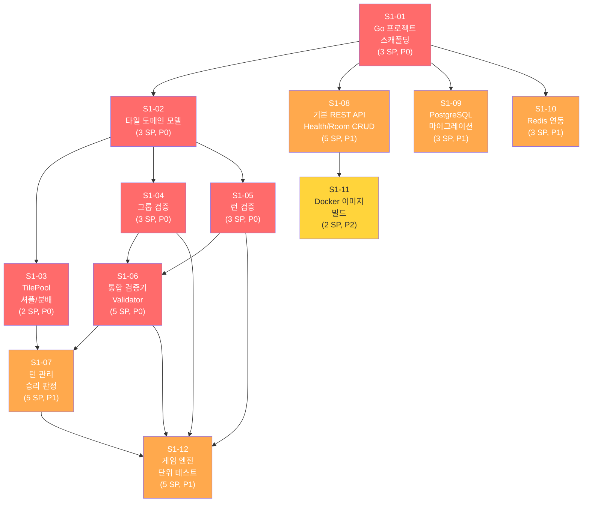
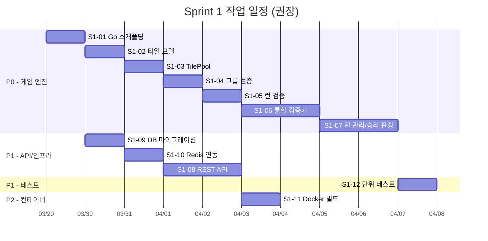

# Sprint 1 백로그 (Sprint Backlog)

## 1. Sprint 1 개요

| 항목 | 내용 |
|------|------|
| Sprint | Sprint 1 |
| Phase | Phase 2: 핵심 게임 개발 (MVP) |
| 기간 | 2026-03-29 ~ 04-11 (2주) |
| 목표 | game-server Go 프로젝트 스캐폴딩, 게임 엔진 코어 구현, 기본 REST API |
| 선행 조건 | Sprint 0 완료 (기획/설계 문서, 인프라 환경 구축) |
| 마일스톤 | GitHub Milestone: Sprint 1 (due: 2026-04-10) |
| Owner | 애벌레 (1인 개발) |

### Sprint 1 목표 (Sprint Goal)

> **game-server Go 프로젝트를 초기화하고, 루미큐브 게임 엔진 코어(타일 모델, 그룹/런 유효성 검증, 조커 처리, 최초 등록, 턴 관리, 승리 판정)를 구현하여 단위 테스트로 규칙 검증이 통과하는 상태를 만든다. 기본 REST API(/health, /ready, Room CRUD)와 DB/Redis 연동까지 완료하여 다음 Sprint(백엔드 API 고도화)의 기반을 확보한다.**

### Sprint 1 완료 기준 (Definition of Done)

- [ ] game-server Go 프로젝트가 `go build`/`go test`로 정상 빌드/테스트
- [ ] 게임 엔진 규칙 검증(V-01~V-15)이 단위 테스트로 커버됨
- [ ] `/health`, `/ready` 엔드포인트가 정상 응답
- [ ] Room CRUD API가 동작 (POST/GET/DELETE)
- [ ] PostgreSQL 마이그레이션이 실행되어 테이블 생성 완료
- [ ] Redis 연동으로 게임 상태 저장/조회가 동작
- [ ] Dockerfile 멀티스테이지 빌드로 이미지 생성 가능
- [ ] 단위 테스트 커버리지 80% 이상 (엔진 패키지)

---

## 2. 백로그 아이템 상세

### S1-01: game-server Go 프로젝트 스캐폴딩

| 항목 | 내용 |
|------|------|
| ID | S1-01 |
| 제목 | game-server Go 프로젝트 초기화 |
| 유형 | Feature |
| 우선순위 | P0 (Critical) |
| 스토리포인트 | 3 |
| 의존성 | 없음 (Sprint 1 시작 아이템) |
| 담당 | 애벌레 |
| 라벨 | `game-server`, `feature`, `P0-critical` |

**설명**:
Go 프로젝트를 초기화하고 아키텍처 문서(01-architecture.md 9.3절)에 정의된 디렉토리 구조를 생성한다. go mod init, 핵심 의존성(gin, gorilla/websocket, GORM, go-redis, zap, viper, testify) 설치, 기본 main.go 엔트리포인트를 구성한다.

**수용 조건 (Acceptance Criteria)**:
1. `src/game-server/` 디렉토리에 Go 프로젝트가 초기화됨
2. `go mod init github.com/k82022603/RummiArena/game-server` 완료
3. 아키텍처 문서 기준 디렉토리 구조 생성:
   - `cmd/server/main.go`
   - `internal/handler/`, `internal/service/`, `internal/engine/`
   - `internal/repository/`, `internal/model/`, `internal/middleware/`, `internal/config/`
4. 핵심 의존성 설치: gin, gorilla/websocket, GORM, go-redis, zap, viper, testify
5. `go build ./...` 성공
6. `.gitignore`에 Go 관련 항목 추가

---

### S1-02: 타일 도메인 모델

| 항목 | 내용 |
|------|------|
| ID | S1-02 |
| 제목 | 타일 데이터 모델 및 인코딩/디코딩 구현 |
| 유형 | Feature |
| 우선순위 | P0 (Critical) |
| 스토리포인트 | 3 |
| 의존성 | S1-01 |
| 담당 | 애벌레 |
| 라벨 | `game-server`, `feature`, `P0-critical` |

**설명**:
게임 규칙 문서(06-game-rules.md 1절)에 정의된 타일 인코딩 규칙 `{Color}{Number}{Set}`을 Go 구조체로 모델링한다. 타일 생성, 인코딩(구조체 -> 문자열), 디코딩(문자열 -> 구조체), 비교, 정렬 기능을 구현한다.

**수용 조건 (Acceptance Criteria)**:
1. `internal/engine/tile.go`에 Tile 구조체 정의
   - Color (R/B/Y/K), Number (1~13), Set (a/b), IsJoker 필드
2. `internal/model/tile.go`에 GORM 모델 (DB용) 별도 정의
3. 타일 인코딩: `Tile{Color: "R", Number: 7, Set: "a"}` -> `"R7a"`
4. 타일 디코딩: `"R7a"` -> `Tile{Color: "R", Number: 7, Set: "a"}`
5. 조커 처리: `"JK1"` -> `Tile{IsJoker: true, JokerID: 1}`
6. 전체 타일 106장 생성 함수 (104 숫자 + 2 조커)
7. 타일 비교(Equal), 점수 계산(Score) 메서드 구현
8. 유효하지 않은 타일 코드에 대한 에러 처리
9. 단위 테스트: 인코딩/디코딩 왕복 테스트, 전체 타일 수 검증, 점수 계산 검증

---

### S1-03: 타일 풀(TilePool) 및 셔플

| 항목 | 내용 |
|------|------|
| ID | S1-03 |
| 제목 | TilePool 생성, 셔플, 분배 로직 구현 |
| 유형 | Feature |
| 우선순위 | P0 (Critical) |
| 스토리포인트 | 2 |
| 의존성 | S1-02 |
| 담당 | 애벌레 |
| 라벨 | `game-server`, `feature`, `P0-critical` |

**설명**:
106장 타일 풀을 생성하고 Fisher-Yates 셔플 알고리즘으로 무작위 섞은 후, 각 플레이어에게 14장씩 분배하고 나머지를 드로우 파일로 관리하는 로직을 구현한다. 게임 규칙 문서 2절(게임 준비)을 기반으로 한다.

**수용 조건 (Acceptance Criteria)**:
1. `internal/engine/pool.go`에 TilePool 구조체 정의
2. NewTilePool() 함수: 106장 생성 및 셔플
3. Fisher-Yates 또는 `math/rand.Shuffle` 기반 균등 분포 셔플
4. DealInitialTiles(playerCount int) 함수: 각 플레이어 14장 분배
   - 2인: 78장 남음, 3인: 64장, 4인: 50장
5. DrawTile() 함수: 드로우 파일에서 1장 뽑기 (비어있으면 nil 반환)
6. RemainingCount() 함수: 남은 타일 수 반환
7. 단위 테스트: 분배 후 타일 수 검증, 셔플 편향 없음 검증 (통계적), 빈 풀 드로우 검증

---

### S1-04: 그룹(Group) 유효성 검증

| 항목 | 내용 |
|------|------|
| ID | S1-04 |
| 제목 | 그룹 유효성 검증 로직 구현 (V-01, V-02, V-14) |
| 유형 | Feature |
| 우선순위 | P0 (Critical) |
| 스토리포인트 | 3 |
| 의존성 | S1-02 |
| 담당 | 애벌레 |
| 라벨 | `game-server`, `feature`, `P0-critical` |

**설명**:
게임 규칙 문서 3.1절에 정의된 그룹(같은 숫자, 서로 다른 색상 3~4장) 유효성 검증 로직을 구현한다. 조커를 포함한 그룹 검증도 처리한다.

**수용 조건 (Acceptance Criteria)**:
1. `internal/engine/group.go`에 IsValidGroup(tiles []Tile) bool 함수 구현
2. 검증 규칙:
   - 타일 수: 3장 이상 4장 이하 (V-02)
   - 모든 숫자 타일의 숫자가 동일 (조커 제외)
   - 모든 색상이 서로 다름 - 같은 색 중복 불가 (V-14)
   - 최대 4장 (R, B, Y, K 각 1장)
3. 조커 처리:
   - 조커는 빠진 색상의 타일을 대체
   - 조커 여러 장 가능 (유효성 유지 시)
4. 유효 그룹 예시: `[R7a, B7a, K7b]`, `[R5a, B5a, Y5a, K5b]`, `[R3a, JK1, Y3a]`
5. 무효 그룹 예시: `[R7a, B7a]`(2장), `[R7a, R7b, B7a]`(같은 색), `[R7a, B8a, K7b]`(숫자 불일치)
6. 단위 테스트: 유효/무효 케이스 각 5개 이상, 조커 포함 케이스 3개 이상

---

### S1-05: 런(Run) 유효성 검증

| 항목 | 내용 |
|------|------|
| ID | S1-05 |
| 제목 | 런 유효성 검증 로직 구현 (V-01, V-02, V-15) |
| 유형 | Feature |
| 우선순위 | P0 (Critical) |
| 스토리포인트 | 3 |
| 의존성 | S1-02 |
| 담당 | 애벌레 |
| 라벨 | `game-server`, `feature`, `P0-critical` |

**설명**:
게임 규칙 문서 3.2절에 정의된 런(같은 색상, 연속 숫자 3장 이상) 유효성 검증 로직을 구현한다. 조커가 빈 숫자를 대체하는 경우도 처리한다.

**수용 조건 (Acceptance Criteria)**:
1. `internal/engine/run.go`에 IsValidRun(tiles []Tile) bool 함수 구현
2. 검증 규칙:
   - 타일 수: 3장 이상, 최대 13장 (V-02)
   - 모든 숫자 타일의 색상이 동일 (조커 제외)
   - 숫자가 연속 (V-15)
   - 1과 13은 순환하지 않음 (12-13-1 불가)
   - 숫자 범위: 1~13
3. 조커 처리:
   - 조커가 빈 자리 숫자를 대체
   - 처음/중간/끝 위치 모두 가능
   - 조커 여러 장 가능
4. 유효 런 예시: `[Y3a, Y4a, Y5a]`, `[B9a, B10b, B11a, B12a]`, `[K11a, K12b, JK1]`
5. 무효 런 예시: `[Y3a, Y5a, Y6a]`(비연속), `[R12a, R13a, R1a]`(순환), `[R3a, B4a, Y5a]`(색상 불일치), `[K7a, K8a]`(2장)
6. 단위 테스트: 유효/무효 케이스 각 5개 이상, 조커 포함 케이스 3개 이상, 경계값(1-2-3, 11-12-13)

---

### S1-06: 세트 유효성 통합 검증 (Validator)

| 항목 | 내용 |
|------|------|
| ID | S1-06 |
| 제목 | 세트 유효성 통합 검증기 및 조커 교체 로직 (V-01~V-07) |
| 유형 | Feature |
| 우선순위 | P0 (Critical) |
| 스토리포인트 | 5 |
| 의존성 | S1-04, S1-05 |
| 담당 | 애벌레 |
| 라벨 | `game-server`, `feature`, `P0-critical` |

**설명**:
그룹/런 검증을 통합하고, 턴 확정 시 수행해야 할 전체 유효성 검증 로직(V-01~V-07)을 구현한다. 최초 등록(30점) 조건 검증, 조커 교체 규칙, 테이블 타일 보존 검증을 포함한다.

**수용 조건 (Acceptance Criteria)**:
1. `internal/engine/validator.go`에 통합 검증기 구현
2. `IsValidSet(tiles []Tile) (bool, SetType)` 함수:
   - 그룹 또는 런인지 자동 판별
   - SetType: GROUP / RUN / INVALID 반환
3. `ValidateTurnConfirm(before, after TableState, rackTilesUsed []Tile, hasInitialMeld bool) error` 함수:
   - V-01: 모든 세트가 유효한 그룹 또는 런
   - V-02: 각 세트가 3장 이상
   - V-03: 랙에서 최소 1장 이상 추가
   - V-04: 최초 등록 미완료 시 합계 30점 이상 (조커는 대체 타일 값으로)
   - V-05: 최초 등록 시 랙 타일만 사용
   - V-06: 테이블 타일 유실 없음
   - V-07: 조커 교체 후 즉시 사용
4. `CalculateSetScore(tiles []Tile) int` 함수:
   - 최초 등록 점수 계산 (조커는 대체 숫자 값)
5. 에러는 구체적 에러 코드로 반환 (INVALID_SET, INSUFFICIENT_MELD_SCORE, TILE_MISSING 등)
6. 단위 테스트: V-01~V-07 각각에 대한 유효/무효 테스트 케이스

---

### S1-07: 턴 관리 및 승리 판정

| 항목 | 내용 |
|------|------|
| ID | S1-07 |
| 제목 | 턴 전환, 타임아웃, 드로우, 승리/교착 판정 로직 (V-08~V-12) |
| 유형 | Feature |
| 우선순위 | P1 (High) |
| 스토리포인트 | 5 |
| 의존성 | S1-06, S1-03 |
| 담당 | 애벌레 |
| 라벨 | `game-server`, `feature`, `P1-high` |

**설명**:
게임 규칙 문서 5~7절에 정의된 턴 관리, 드로우, 타임아웃, 승리 조건, 교착 상태 판정 로직을 구현한다. 게임 상태 enum(WAITING, PLAYING, FINISHED, CANCELLED) 관리를 포함한다.

**수용 조건 (Acceptance Criteria)**:
1. `internal/engine/turn.go` 또는 `internal/service/turn_service.go`에 턴 관리 로직
2. 턴 전환:
   - seat 순서대로 전환 (0 -> 1 -> 2 -> 3 -> 0)
   - 빈 seat / 퇴장 플레이어 스킵 (V-08)
3. 드로우 처리:
   - 드로우 파일에서 1장 뽑기, 턴 종료
   - 드로우 파일 비어있으면 패스 (V-10)
4. 타임아웃 처리:
   - 테이블 스냅샷 롤백 + 자동 드로우 1장 (V-09)
5. 승리 판정:
   - 랙 타일 0장 -> FINISHED (V-12)
   - 교착 상태: 드로우 파일 소진 + player_count 턴 동안 전원 패스 -> 점수 비교 (V-11)
6. 점수 계산:
   - 남은 타일 숫자 합산, 조커는 30점
   - 동점 처리: 타일 수 비교 -> 무승부
7. 게임 상태 enum: WAITING, PLAYING, FINISHED, CANCELLED
8. 단위 테스트: 턴 전환, 드로우, 교착 판정, 승리 판정 각 테스트

---

### S1-08: 기본 REST API (Health/Ready, Room CRUD)

| 항목 | 내용 |
|------|------|
| ID | S1-08 |
| 제목 | gin 라우터 설정 및 기본 REST API 엔드포인트 구현 |
| 유형 | Feature |
| 우선순위 | P1 (High) |
| 스토리포인트 | 5 |
| 의존성 | S1-01 |
| 담당 | 애벌레 |
| 라벨 | `game-server`, `feature`, `P1-high` |

**설명**:
gin 프레임워크 기반 HTTP 라우터를 설정하고, 시스템 엔드포인트(/health, /ready)와 Room CRUD API를 구현한다. API 설계 문서(03-api-design.md 1.2절, 1.7절)를 기반으로 한다. 이 단계에서 인증(JWT)은 포함하지 않는다.

**수용 조건 (Acceptance Criteria)**:
1. `cmd/server/main.go`에 gin 라우터 초기화
2. 시스템 엔드포인트:
   - `GET /health` -> `{"status": "ok"}` (200)
   - `GET /ready` -> DB/Redis 연결 확인 후 응답 (200/503)
3. Room CRUD:
   - `POST /api/rooms` -> Room 생성 (roomCode 4자리 자동 생성)
   - `GET /api/rooms` -> Room 목록 조회
   - `GET /api/rooms/:id` -> Room 상세 조회
   - `DELETE /api/rooms/:id` -> Room 삭제
4. 공통 에러 응답 포맷 적용 (API 설계 문서 0.1절)
5. 구조화 JSON 로그 (zap) 적용
6. CORS 미들웨어 설정
7. viper 기반 설정 로드 (환경변수 / config.yaml)
8. 단위 테스트: 각 엔드포인트에 대한 HTTP 테스트 (httptest)

---

### S1-09: PostgreSQL 스키마 마이그레이션

| 항목 | 내용 |
|------|------|
| ID | S1-09 |
| 제목 | PostgreSQL 테이블 생성 (GORM AutoMigrate 또는 SQL 마이그레이션) |
| 유형 | Feature |
| 우선순위 | P1 (High) |
| 스토리포인트 | 3 |
| 의존성 | S1-01 |
| 담당 | 애벌레 |
| 라벨 | `game-server`, `feature`, `P1-high` |

**설명**:
DB 설계 문서(02-database-design.md 2절)에 정의된 PostgreSQL 테이블을 생성한다. GORM AutoMigrate 또는 golang-migrate 도구를 사용하여 마이그레이션을 관리한다. Sprint 1에서 필요한 핵심 테이블(users, games, game_players, game_events, system_config)을 생성한다.

**수용 조건 (Acceptance Criteria)**:
1. GORM 모델 정의 (`internal/model/`):
   - `user.go` -> users 테이블
   - `game.go` -> games 테이블
   - `game_player.go` -> game_players 테이블
   - `game_event.go` -> game_events 테이블
   - `system_config.go` -> system_config 테이블
2. GORM AutoMigrate 또는 SQL 마이그레이션 파일 작성
3. 마이그레이션 실행 시 테이블 생성 + 인덱스 생성
4. system_config 초기 데이터 시드 (turn_timeout_sec, ai_max_retries 등)
5. 기존 rummikub-postgres 컨테이너(rummikub DB)에서 동작 확인
6. Sprint 2 이후 추가될 테이블(ai_call_logs, elo_history, practice_sessions, game_snapshots)은 제외
7. `internal/repository/postgres_repo.go`에 DB 연결 초기화 로직

---

### S1-10: Redis 연동 (게임 상태 저장/조회)

| 항목 | 내용 |
|------|------|
| ID | S1-10 |
| 제목 | go-redis 클라이언트 설정 및 게임 상태 저장/조회 구현 |
| 유형 | Feature |
| 우선순위 | P1 (High) |
| 스토리포인트 | 3 |
| 의존성 | S1-01 |
| 담당 | 애벌레 |
| 라벨 | `game-server`, `feature`, `P1-high` |

**설명**:
DB 설계 문서 3절(Redis 데이터 구조)에 정의된 Redis 키 구조를 구현한다. go-redis 클라이언트를 설정하고, 게임 상태, 플레이어 타일, 드로우 파일, 턴 타이머를 Redis에 저장/조회하는 Repository를 구현한다.

**수용 조건 (Acceptance Criteria)**:
1. `internal/repository/redis_repo.go`에 Redis 클라이언트 초기화
2. Redis 키 구조 구현:
   - `game:{gameId}:state` (Hash) -> 게임 상태
   - `game:{gameId}:player:{seatOrder}:tiles` (List) -> 플레이어 타일
   - `game:{gameId}:drawpile` (List) -> 드로우 파일
   - `game:{gameId}:timer` (String) -> 턴 타이머
   - `game:{gameId}:stalemate` (Hash) -> 교착 상태 판정 데이터
3. TTL 관리:
   - 게임 상태: 7200초 (2시간)
   - 매 턴 종료 시 TTL 갱신
   - 게임 종료 후 TTL 600초로 단축
4. SaveGameState / GetGameState 함수
5. SavePlayerTiles / GetPlayerTiles 함수
6. Redis Transaction (MULTI/EXEC) 또는 Lua Script 사용 (원자성)
7. /ready 엔드포인트에서 Redis 연결 확인
8. 단위 테스트: 저장/조회 왕복 테스트 (miniredis 라이브러리 사용)

---

### S1-11: Docker 이미지 빌드

| 항목 | 내용 |
|------|------|
| ID | S1-11 |
| 제목 | game-server Dockerfile (멀티스테이지) 및 docker-compose 추가 |
| 유형 | Feature |
| 우선순위 | P2 (Medium) |
| 스토리포인트 | 2 |
| 의존성 | S1-01, S1-08 |
| 담당 | 애벌레 |
| 라벨 | `game-server`, `infra`, `P2-medium` |

**설명**:
아키텍처 문서 9.5절에 정의된 컨테이너 이미지 구성에 따라 game-server Dockerfile을 작성한다. golang:alpine 빌드 스테이지 + scratch 런타임 스테이지로 ~15MB 이미지를 목표한다. 기존 docker-compose.yml에 game-server 서비스를 추가한다.

**수용 조건 (Acceptance Criteria)**:
1. `src/game-server/Dockerfile` 작성 (멀티스테이지)
   - Stage 1: `golang:1.22-alpine` - 빌드
   - Stage 2: `scratch` 또는 `alpine:3.19` - 실행
2. 빌드 결과 바이너리만 복사 (CGO_ENABLED=0)
3. 이미지 크기 목표: ~15MB (scratch) 또는 ~25MB (alpine)
4. 환경변수 기반 설정 주입
5. HEALTHCHECK 설정
6. `docker-compose.yml`에 game-server 서비스 추가
   - postgres, redis 의존성 (depends_on)
   - 포트 8080 노출
7. `docker compose up game-server` 정상 기동 확인
8. `.dockerignore` 파일 작성

---

### S1-12: 게임 엔진 단위 테스트

| 항목 | 내용 |
|------|------|
| ID | S1-12 |
| 제목 | 게임 엔진 규칙 검증 단위 테스트 (V-01~V-15 전체) |
| 유형 | Test |
| 우선순위 | P1 (High) |
| 스토리포인트 | 5 |
| 의존성 | S1-04, S1-05, S1-06, S1-07 |
| 담당 | 애벌레 |
| 라벨 | `game-server`, `test`, `P1-high` |

**설명**:
게임 규칙 문서 10절(규칙 검증 매트릭스 V-01~V-15)의 모든 규칙에 대한 단위 테스트를 작성한다. TDD 방식으로 엔진 구현과 병행하되, 이 아이템은 테스트 커버리지 확보에 집중한다. Table-Driven Test 패턴을 사용한다.

**수용 조건 (Acceptance Criteria)**:
1. 테스트 파일 구조:
   - `internal/engine/tile_test.go`
   - `internal/engine/pool_test.go`
   - `internal/engine/group_test.go`
   - `internal/engine/run_test.go`
   - `internal/engine/validator_test.go`
   - `internal/engine/turn_test.go` 또는 `internal/service/turn_service_test.go`
2. 검증 매트릭스 커버리지:
   - V-01: 세트가 유효한 그룹 또는 런
   - V-02: 세트가 3장 이상
   - V-03: 랙에서 최소 1장 추가
   - V-04: 최초 등록 30점 이상
   - V-05: 최초 등록 시 랙 타일만 사용
   - V-06: 테이블 타일 유실 없음
   - V-07: 조커 교체 후 즉시 사용
   - V-08: 자기 턴 확인
   - V-09: 턴 타임아웃 처리
   - V-10: 빈 드로우 파일 패스
   - V-11: 교착 상태 판정
   - V-12: 승리 조건 (랙 타일 0장)
   - V-13: 재배치 권한 (hasInitialMeld)
   - V-14: 그룹 같은 색상 중복 없음
   - V-15: 런 연속 숫자 (13-1 순환 불가)
3. `go test ./internal/engine/... -cover` 커버리지 80% 이상
4. Table-Driven Test 패턴 사용 (testify assert/require)
5. Edge case 포함: 조커만 3장, 최대 13장 런, 4장 그룹, 빈 테이블, 빈 랙

---

## 3. 백로그 요약표

| ID | 제목 | SP | 우선순위 | 의존성 | WBS ID |
|----|------|----|----------|--------|--------|
| S1-01 | game-server Go 프로젝트 스캐폴딩 | 3 | P0 | - | 2.2.1 |
| S1-02 | 타일 도메인 모델 | 3 | P0 | S1-01 | 2.1.1 |
| S1-03 | TilePool 생성/셔플/분배 | 2 | P0 | S1-02 | 2.1.2 |
| S1-04 | 그룹(Group) 유효성 검증 | 3 | P0 | S1-02 | 2.1.3 |
| S1-05 | 런(Run) 유효성 검증 | 3 | P0 | S1-02 | 2.1.4 |
| S1-06 | 세트 유효성 통합 검증 (Validator) | 5 | P0 | S1-04, S1-05 | 2.1.3, 2.1.5, 2.1.6 |
| S1-07 | 턴 관리 및 승리 판정 | 5 | P1 | S1-06, S1-03 | 2.1.7, 2.1.8, 2.1.9 |
| S1-08 | 기본 REST API | 5 | P1 | S1-01 | 2.2.2, 2.2.6 |
| S1-09 | PostgreSQL 스키마 마이그레이션 | 3 | P1 | S1-01 | 2.2.5 |
| S1-10 | Redis 연동 | 3 | P1 | S1-01 | 2.2.4 |
| S1-11 | Docker 이미지 빌드 | 2 | P2 | S1-01, S1-08 | 2.2.8 |
| S1-12 | 게임 엔진 단위 테스트 | 5 | P1 | S1-04~S1-07 | 2.1.10 |
| | **합계** | **42** | | | |

---

## 4. 스토리포인트 분석

### 총 스토리포인트: 42 SP

| 우선순위 | 아이템 수 | SP 합계 | 비율 |
|----------|----------|---------|------|
| P0 (Critical) | 6 | 19 | 45% |
| P1 (High) | 5 | 21 | 50% |
| P2 (Medium) | 1 | 2 | 5% |

### 번다운 차트 기준 (2주, 10 근무일)

| 일차 | 날짜 | 이상 잔여 SP | 목표 아이템 |
|------|------|-------------|------------|
| Day 0 | 03/29 (월) | 42 | - |
| Day 1 | 03/30 (화) | 38 | S1-01 스캐폴딩 시작 |
| Day 2 | 03/31 (수) | 34 | S1-01 완료, S1-02 시작 |
| Day 3 | 04/01 (목) | 30 | S1-02 완료, S1-09 시작 |
| Day 4 | 04/02 (금) | 25 | S1-03 완료, S1-04 시작 |
| Day 5 | 04/05 (월) | 21 | S1-04 완료, S1-05 시작 |
| Day 6 | 04/06 (화) | 17 | S1-05 완료, S1-06 시작 |
| Day 7 | 04/07 (수) | 13 | S1-06 완료, S1-08 시작 |
| Day 8 | 04/08 (목) | 8 | S1-08 완료, S1-07 시작 |
| Day 9 | 04/09 (금) | 4 | S1-07 완료, S1-10 완료 |
| Day 10 | 04/10 (목) | 0 | S1-11, S1-12 마무리 |

> **Velocity 참고**: 1인 개발자 기준 42 SP / 2주는 높은 편이다. Sprint 0에서 기획/설계에 소요된 실제 속도를 감안하여 Sprint 1 중반에 리스크를 재평가한다. P2 아이템(S1-11)은 버퍼로 활용하며, 필요 시 Sprint 2로 이월한다.

---

## 5. Sprint 1 의존성 그래프



**범례**: 빨강 = P0 (Critical), 주황 = P1 (High), 노랑 = P2 (Medium)

### 크리티컬 패스

```
S1-01 -> S1-02 -> S1-04/S1-05 -> S1-06 -> S1-07 -> S1-12
```

크리티컬 패스 총 SP: 3 + 3 + 3 + 5 + 5 + 5 = **24 SP** (전체의 57%)

> 크리티컬 패스에 속하지 않는 S1-08(REST API), S1-09(DB), S1-10(Redis), S1-11(Docker)은 병렬 진행이 가능하다. S1-01 완료 후 엔진 라인과 인프라 라인을 교차로 진행하면 효율적이다.

---

## 6. 작업 순서 권장 (1인 개발자 최적화)

1인 개발자가 컨텍스트 스위칭을 최소화하면서 진행할 권장 순서:



> **Note**: 게임 엔진 라인(S1-01~S1-07)을 먼저 완료한 후, API/인프라 라인(S1-08~S1-10)으로 전환하는 것이 컨텍스트 스위칭을 줄인다. 단, S1-09(DB)와 S1-10(Redis)는 S1-01 직후에 병렬 가능하므로, 엔진 작업 피로도 전환용으로 끼워넣을 수 있다.

---

## 7. 리스크 및 대응

| ID | 리스크 | 영향도 | 발생 가능성 | 대응 방안 |
|----|--------|--------|------------|-----------|
| R1 | Go 언어 학습 곡선으로 예상보다 시간 소요 | 높음 | 중간 | 핵심 라이브러리 문서 사전 학습, 레퍼런스 프로젝트 참고 |
| R2 | 조커 처리 로직이 예상보다 복잡 | 중간 | 높음 | 조커 없는 기본 그룹/런 먼저 구현, 조커는 단계적 추가 |
| R3 | 16GB RAM 제약으로 Docker + Go 빌드 + Redis + PostgreSQL 동시 실행 부하 | 중간 | 높음 | 교대 실행 전략 유지, 테스트 시 최소 서비스만 기동 |
| R4 | 턴 타이머와 교착 판정 로직의 동시성 이슈 | 높음 | 낮음 | Go goroutine + channel 기반 설계, 단위 테스트 먼저 |
| R5 | Sprint 0 인프라 미완료 항목(K8s, ArgoCD)과 병행 부담 | 중간 | 중간 | Sprint 1에서는 Docker Compose로 개발, K8s 배포는 Sprint 2 이후 |
| R6 | 42 SP가 1인 2주에 과부하 | 높음 | 중간 | P2 아이템(S1-11) 이월 허용, Sprint 1 중반 리스크 재평가 |

---

## 8. 요구사항 추적 매트릭스

| 요구사항 ID | 요구사항 | Sprint 1 아이템 | 커버리지 |
|------------|----------|-----------------|---------|
| FR-001-01 | 루미큐브 공식 규칙 기반 로직 | S1-04, S1-05, S1-06, S1-07 | 핵심 규칙 구현 |
| FR-001-02 | 타일 106개 관리 | S1-02, S1-03 | 완전 |
| FR-001-03 | 그룹 유효성 검증 | S1-04 | 완전 |
| FR-001-04 | 런 유효성 검증 | S1-05 | 완전 |
| FR-001-05 | 최초 등록 30점 검증 | S1-06 | 완전 |
| FR-001-06 | 테이블 재배치 지원 | S1-06 (V-13 검증) | 검증 로직만 (UI는 Sprint 3) |
| FR-001-07 | 조커 처리 | S1-04, S1-05, S1-06 | 완전 |
| FR-001-08 | 턴 타이머 | S1-07 | 로직만 (WebSocket 연동은 Sprint 2) |
| FR-001-10 | 게임 상태 관리 | S1-07 | 완전 |
| FR-001-11 | 타일 인코딩 규칙 | S1-02 | 완전 |
| FR-002-04 | Room 생성/참가/퇴장 | S1-08 | CRUD만 (Join/Leave는 Sprint 2) |
| NFR-001-05 | 턴 타임아웃 설정 가능 | S1-07 | 로직만 |
| NFR-003-01 | 구조화 JSON 로그 | S1-08 | 완전 (zap) |
| NFR-003-02 | Health/Readiness probe | S1-08 | 완전 |
| NFR-003-05 | Stateless 서버 설계 | S1-10 | Redis 기반 상태 저장 |

---

## 9. GitHub Issues 생성용 템플릿

Sprint 1 각 백로그 아이템을 GitHub Issue로 생성할 때 사용하는 템플릿이다.

### 이슈 생성 명령어

```bash
# S1-01: game-server Go 프로젝트 스캐폴딩
gh issue create \
  --title "[Sprint 1] game-server Go 프로젝트 스캐폴딩" \
  --label "game-server,feature,P0-critical" \
  --milestone "Sprint 1" \
  --body "## 설명
Go 프로젝트 초기화, 아키텍처 문서 기준 디렉토리 구조 생성, 핵심 의존성 설치

## 수용 조건
- [ ] src/game-server/ 디렉토리에 Go 프로젝트 초기화
- [ ] go mod init 완료
- [ ] 디렉토리 구조 생성 (cmd/, internal/handler,service,engine,repository,model,middleware,config/)
- [ ] 핵심 의존성 설치 (gin, gorilla/websocket, GORM, go-redis, zap, viper, testify)
- [ ] go build ./... 성공
- [ ] .gitignore 업데이트

## 스토리포인트: 3
## 의존성: 없음
## WBS: 2.2.1"

# S1-02: 타일 도메인 모델
gh issue create \
  --title "[Sprint 1] 타일 도메인 모델 및 인코딩/디코딩" \
  --label "game-server,feature,P0-critical" \
  --milestone "Sprint 1" \
  --body "## 설명
타일 인코딩 규칙 {Color}{Number}{Set}을 Go 구조체로 모델링, 인코딩/디코딩/비교/점수 계산

## 수용 조건
- [ ] internal/engine/tile.go에 Tile 구조체 (Color, Number, Set, IsJoker)
- [ ] internal/model/tile.go에 GORM 모델
- [ ] 인코딩: Tile -> 'R7a' 문자열
- [ ] 디코딩: 'R7a' -> Tile 구조체
- [ ] 조커 처리: 'JK1' -> Tile{IsJoker: true}
- [ ] 전체 106장 생성 함수
- [ ] Equal, Score 메서드
- [ ] 단위 테스트

## 스토리포인트: 3
## 의존성: S1-01 (#15)
## WBS: 2.1.1"

# S1-03: TilePool 생성/셔플/분배
gh issue create \
  --title "[Sprint 1] TilePool 생성, 셔플, 분배 로직" \
  --label "game-server,feature,P0-critical" \
  --milestone "Sprint 1" \
  --body "## 설명
106장 타일 풀 생성, Fisher-Yates 셔플, 플레이어별 14장 분배, 드로우 파일 관리

## 수용 조건
- [ ] internal/engine/pool.go에 TilePool 구조체
- [ ] NewTilePool() 106장 생성 + 셔플
- [ ] DealInitialTiles(playerCount) 플레이어별 14장 분배
- [ ] DrawTile() 1장 뽑기 (빈 풀 nil)
- [ ] RemainingCount() 남은 수
- [ ] 단위 테스트 (분배 후 수량, 빈 풀 드로우)

## 스토리포인트: 2
## 의존성: S1-02 (#16)
## WBS: 2.1.2"

# S1-04: 그룹 유효성 검증
gh issue create \
  --title "[Sprint 1] 그룹(Group) 유효성 검증 로직" \
  --label "game-server,feature,P0-critical" \
  --milestone "Sprint 1" \
  --body "## 설명
같은 숫자, 서로 다른 색상 3~4장 그룹 유효성 검증 (V-01, V-02, V-14)

## 수용 조건
- [ ] internal/engine/group.go에 IsValidGroup 함수
- [ ] 타일 수 3~4장 검증
- [ ] 숫자 동일 검증 (조커 제외)
- [ ] 색상 중복 없음 검증
- [ ] 조커 처리 (빠진 색상 대체, 복수 조커)
- [ ] 단위 테스트: 유효 5개+, 무효 5개+, 조커 3개+

## 스토리포인트: 3
## 의존성: S1-02 (#16)
## WBS: 2.1.3"

# S1-05: 런 유효성 검증
gh issue create \
  --title "[Sprint 1] 런(Run) 유효성 검증 로직" \
  --label "game-server,feature,P0-critical" \
  --milestone "Sprint 1" \
  --body "## 설명
같은 색상, 연속 숫자 3장 이상 런 유효성 검증 (V-01, V-02, V-15)

## 수용 조건
- [ ] internal/engine/run.go에 IsValidRun 함수
- [ ] 타일 수 3장 이상 검증
- [ ] 색상 동일 검증 (조커 제외)
- [ ] 연속 숫자 검증 (13-1 순환 불가)
- [ ] 조커 처리 (빈 숫자 대체, 복수 조커)
- [ ] 단위 테스트: 유효 5개+, 무효 5개+, 조커 3개+, 경계값

## 스토리포인트: 3
## 의존성: S1-02 (#16)
## WBS: 2.1.4"

# S1-06: 세트 유효성 통합 검증
gh issue create \
  --title "[Sprint 1] 세트 유효성 통합 검증기 (Validator)" \
  --label "game-server,feature,P0-critical" \
  --milestone "Sprint 1" \
  --body "## 설명
그룹/런 통합 검증, 턴 확정 시 전체 유효성 검증 (V-01~V-07), 최초 등록 30점, 조커 교체

## 수용 조건
- [ ] internal/engine/validator.go 통합 검증기
- [ ] IsValidSet(tiles) -> (bool, SetType) 자동 판별
- [ ] ValidateTurnConfirm() -> V-01~V-07 전체 검증
- [ ] CalculateSetScore() 최초 등록 점수 계산
- [ ] 구체적 에러 코드 반환
- [ ] 단위 테스트: V-01~V-07 각 유효/무효 케이스

## 스토리포인트: 5
## 의존성: S1-04 (#18), S1-05 (#19)
## WBS: 2.1.3, 2.1.5, 2.1.6"

# S1-07: 턴 관리 및 승리 판정
gh issue create \
  --title "[Sprint 1] 턴 관리, 드로우, 승리/교착 판정 로직" \
  --label "game-server,feature,P1-high" \
  --milestone "Sprint 1" \
  --body "## 설명
턴 전환, 타임아웃, 드로우, 승리 조건, 교착 상태 판정 (V-08~V-12), 게임 상태 enum

## 수용 조건
- [ ] 턴 전환 로직 (seat 순서, 스킵)
- [ ] 드로우 처리 (1장 뽑기, 빈 풀 패스)
- [ ] 타임아웃 처리 (스냅샷 롤백 + 자동 드로우)
- [ ] 승리 판정 (랙 타일 0장)
- [ ] 교착 판정 (드로우 소진 + 전원 패스)
- [ ] 점수 계산 (조커 30점, 동점 처리)
- [ ] 게임 상태 enum (WAITING/PLAYING/FINISHED/CANCELLED)
- [ ] 단위 테스트

## 스토리포인트: 5
## 의존성: S1-06 (#20), S1-03 (#17)
## WBS: 2.1.7, 2.1.8, 2.1.9"

# S1-08: 기본 REST API
gh issue create \
  --title "[Sprint 1] 기본 REST API (Health/Ready, Room CRUD)" \
  --label "game-server,feature,P1-high" \
  --milestone "Sprint 1" \
  --body "## 설명
gin 라우터, /health, /ready, Room CRUD API, 공통 에러 포맷, zap 로그, CORS, viper 설정

## 수용 조건
- [ ] gin 라우터 초기화
- [ ] GET /health -> {status: ok}
- [ ] GET /ready -> DB/Redis 연결 확인
- [ ] POST /api/rooms -> Room 생성
- [ ] GET /api/rooms -> Room 목록
- [ ] GET /api/rooms/:id -> Room 상세
- [ ] DELETE /api/rooms/:id -> Room 삭제
- [ ] 공통 에러 응답 포맷
- [ ] zap 구조화 JSON 로그
- [ ] CORS 미들웨어
- [ ] viper 설정
- [ ] HTTP 테스트 (httptest)

## 스토리포인트: 5
## 의존성: S1-01 (#15)
## WBS: 2.2.2, 2.2.6"

# S1-09: PostgreSQL 마이그레이션
gh issue create \
  --title "[Sprint 1] PostgreSQL 스키마 마이그레이션" \
  --label "game-server,feature,P1-high" \
  --milestone "Sprint 1" \
  --body "## 설명
GORM 모델 정의, 핵심 테이블 생성 (users, games, game_players, game_events, system_config)

## 수용 조건
- [ ] GORM 모델 (internal/model/): user.go, game.go, game_player.go, game_event.go, system_config.go
- [ ] AutoMigrate 또는 SQL 마이그레이션
- [ ] 인덱스 생성
- [ ] system_config 초기 데이터 시드
- [ ] rummikub-postgres 컨테이너에서 동작 확인
- [ ] postgres_repo.go DB 연결 초기화

## 스토리포인트: 3
## 의존성: S1-01 (#15)
## WBS: 2.2.5"

# S1-10: Redis 연동
gh issue create \
  --title "[Sprint 1] Redis 연동 (게임 상태 저장/조회)" \
  --label "game-server,feature,P1-high" \
  --milestone "Sprint 1" \
  --body "## 설명
go-redis 클라이언트, Redis 키 구조 구현, TTL 관리, 원자성 보장

## 수용 조건
- [ ] redis_repo.go 클라이언트 초기화
- [ ] game:{gameId}:state (Hash) 저장/조회
- [ ] game:{gameId}:player:{seat}:tiles (List)
- [ ] game:{gameId}:drawpile (List)
- [ ] game:{gameId}:timer (String)
- [ ] TTL 관리 (7200초, 종료 시 600초)
- [ ] Redis Transaction 사용
- [ ] /ready에서 Redis 연결 확인
- [ ] 단위 테스트 (miniredis)

## 스토리포인트: 3
## 의존성: S1-01 (#15)
## WBS: 2.2.4"

# S1-11: Docker 이미지 빌드
gh issue create \
  --title "[Sprint 1] game-server Dockerfile 및 docker-compose" \
  --label "game-server,infra,P2-medium" \
  --milestone "Sprint 1" \
  --body "## 설명
멀티스테이지 Dockerfile (golang:alpine -> scratch), docker-compose에 game-server 추가

## 수용 조건
- [ ] src/game-server/Dockerfile (멀티스테이지)
- [ ] 이미지 크기 ~15MB (scratch) 또는 ~25MB (alpine)
- [ ] CGO_ENABLED=0
- [ ] HEALTHCHECK 설정
- [ ] docker-compose.yml에 game-server 추가
- [ ] docker compose up game-server 정상 기동
- [ ] .dockerignore

## 스토리포인트: 2
## 의존성: S1-01, S1-08
## WBS: 2.2.8"

# S1-12: 게임 엔진 단위 테스트
gh issue create \
  --title "[Sprint 1] 게임 엔진 단위 테스트 (V-01~V-15)" \
  --label "game-server,test,P1-high" \
  --milestone "Sprint 1" \
  --body "## 설명
규칙 검증 매트릭스 V-01~V-15 전체에 대한 단위 테스트, Table-Driven Test, 커버리지 80%+

## 수용 조건
- [ ] tile_test.go, pool_test.go, group_test.go, run_test.go, validator_test.go, turn_test.go
- [ ] V-01~V-15 모든 규칙 테스트 커버
- [ ] go test ./internal/engine/... -cover 80%+
- [ ] Table-Driven Test 패턴 (testify)
- [ ] Edge case 포함 (조커만 3장, 13장 런, 빈 테이블 등)

## 스토리포인트: 5
## 의존성: S1-04~S1-07
## WBS: 2.1.10"
```

---

## 10. Sprint 1 -> Sprint 2 인터페이스

Sprint 1에서 구현한 것이 Sprint 2(백엔드 API)에서 어떻게 연결되는지 정리한다.

| Sprint 1 산출물 | Sprint 2 활용 |
|-----------------|---------------|
| 게임 엔진 (engine 패키지) | game_service.go에서 import하여 WebSocket 턴 처리 시 규칙 검증 |
| Room CRUD REST API | WebSocket 연결 시 roomId 기반 세션 매핑, Join/Leave 확장 |
| PostgreSQL 스키마 | 게임 결과 저장, 추가 테이블(ai_call_logs, elo_history 등) 마이그레이션 |
| Redis 연동 | WebSocket 핸들러에서 실시간 게임 상태 읽기/쓰기 |
| Docker 이미지 | Helm Chart 작성 시 이미지 참조 |
| 단위 테스트 | CI 파이프라인에 통합, 통합 테스트 추가 |

---

## 11. 하드웨어 제약 고려사항 (16GB RAM)

Sprint 1 개발 시 동시 실행이 필요한 서비스와 메모리 예상치:

| 서비스 | 예상 메모리 | 필수 여부 |
|--------|-----------|-----------|
| WSL2 | ~2GB (기본) | 필수 |
| Go 개발 (gopls + build) | ~1-2GB | 필수 |
| PostgreSQL (rummikub-postgres) | ~128-256MB | 필수 |
| Redis | ~64-128MB | 필수 |
| Claude Code | ~500MB | 필수 |
| Docker Desktop | ~1-2GB | Docker 빌드 시만 |
| VS Code | ~500MB | 필수 |
| **합계 (개발 시)** | **~5-7GB** | |
| **합계 (Docker 빌드 포함)** | **~7-9GB** | |

> .wslconfig 프로파일(10GB/swap4GB)로 충분히 개발 가능하다. Docker 이미지 빌드(S1-11)는 다른 무거운 작업과 동시 실행을 피한다.
