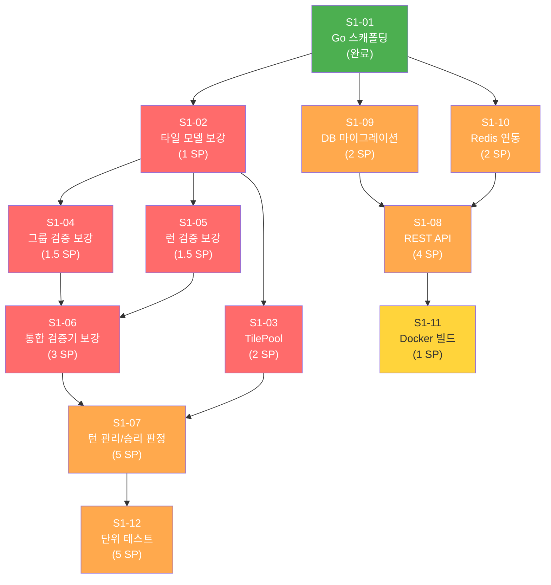
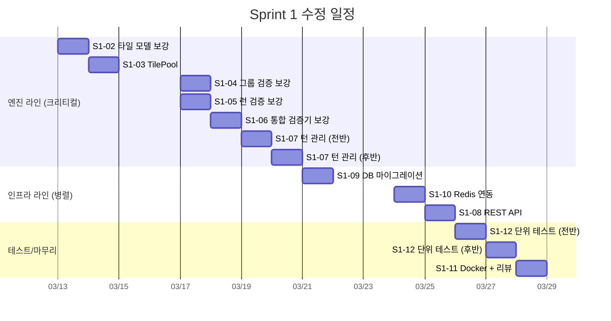
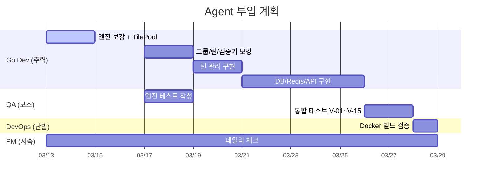
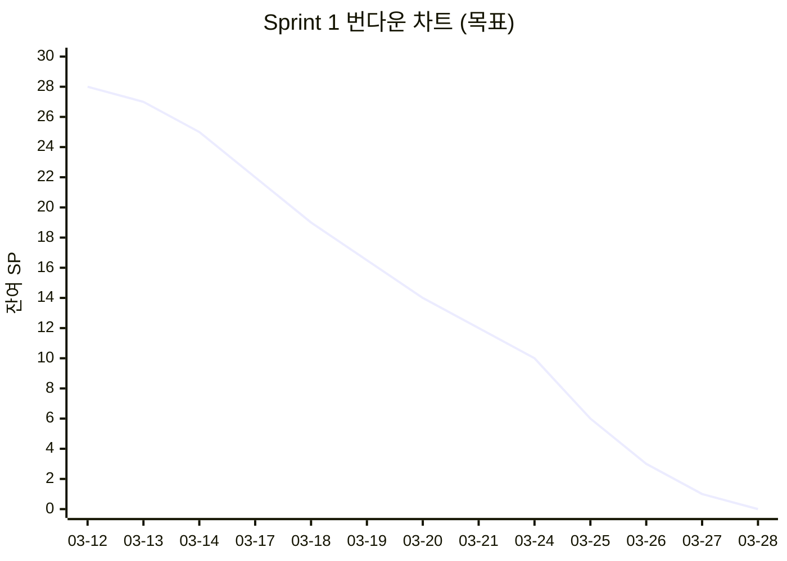

# Sprint 1 수정 계획 (Revised Plan)

## 1. 수정 배경

### 1.1 원래 계획 vs 현실

| 항목 | 원래 계획 | 수정 |
|------|-----------|------|
| 기간 | 2026-03-29 ~ 04-11 (2주) | **2026-03-13 ~ 03-28 (16일, 주말 포함)** |
| 전제 | Sprint 0 완료 후 착수 | Sprint 0과 병행, S1-01 이미 완료 |
| SP | 42 SP (2주) | **39 SP (S1-01 완료 차감)**, 현실 목표 30 SP |
| 속도 | 4.2 SP/일 | **3.0 SP/일 (보수적)** |

### 1.2 앞당기기 근거

- S1-01(Go 스캐폴딩)이 2026-03-12 세션 #02에서 이미 완료됨 (커밋 `3ce45bd`)
- engine 패키지에 tile.go, group.go, run.go, validator.go 기본 구현 존재
- model, repository, service, handler 스텁이 모두 생성됨
- go build/vet 통과, Dockerfile 작성 완료
- Sprint 0의 나머지 작업(GitLab 구성, SonarQube)은 Sprint 1과 병행 가능

### 1.3 100% 구현 목표 폐기 -> 점진적 전략 전환

2026-03-12 자정까지 전체 구현 목표는 미달성으로 확인되었다. 이는 **1인 개발 + 폴리글랏 백엔드(Go + NestJS) + 16GB RAM 제약** 하에서 현실적이지 않았다. Sprint 단위 점진 전략으로 전환하며, Sprint 1에서는 **게임 엔진 + 기본 API가 동작하는 상태**를 목표로 한다.

---

## 2. 완료 항목 분석

### 2.1 S1-01: game-server Go 프로젝트 스캐폴딩 -- DONE

| 수용 조건 | 상태 |
|-----------|------|
| Go 프로젝트 초기화 (go mod init) | 완료 |
| 아키텍처 문서 기준 디렉토리 구조 | 완료 (22개 파일) |
| 핵심 의존성 설치 | 완료 (gin, gorilla/websocket, GORM, go-redis, zap, viper, testify) |
| go build ./... 성공 | 완료 |
| .gitignore 업데이트 | 완료 |

**차감 SP: 3 -> 잔여 SP: 39**

### 2.2 기존 코드 자산 분석 (부분 완료 항목)

| 백로그 | 기존 구현 수준 | 잔여 작업 | 조정 SP |
|--------|---------------|-----------|---------|
| S1-02 타일 모델 | tile.go 구현 완료 (Parse, Score, GenerateDeck) | 단위 테스트, Equal 메서드 보완 | 3 -> **1** |
| S1-03 TilePool | 미구현 | pool.go 신규 구현 | 2 (유지) |
| S1-04 그룹 검증 | group.go 기본 구현 (ValidateGroup, groupScore) | 엣지케이스 보강, 테스트 | 3 -> **1.5** |
| S1-05 런 검증 | run.go 기본 구현 (ValidateRun, runScore) | 조커 로직 보강, 테스트 | 3 -> **1.5** |
| S1-06 통합 검증기 | validator.go 구현 (ValidateTurnConfirm, V-01~V-07) | CalculateSetScore 보강, 테스트 | 5 -> **3** |
| S1-07 턴 관리 | turn_service.go 인터페이스만 (TODO 스텁) | 전체 구현 필요 | 5 (유지) |
| S1-08 REST API | main.go에 /health, /ready만. handler 전부 TODO 스텁 | 라우터 연결, CRUD 구현, CORS, 테스트 | 5 -> **4** |
| S1-09 DB 마이그레이션 | model/*.go 스텁 존재, postgres_repo.go 구조 있음 | AutoMigrate, 시드, 실제 동작 확인 | 3 -> **2** |
| S1-10 Redis 연동 | redis_repo.go 기본 CRUD 구현 | 키 구조 확장, TTL, miniredis 테스트 | 3 -> **2** |
| S1-11 Docker 빌드 | Dockerfile 작성 완료 | docker-compose 추가, 실제 빌드 확인 | 2 -> **1** |
| S1-12 단위 테스트 | 테스트 파일 없음 | 전체 작성 필요 | 5 (유지) |

### 2.3 조정 후 SP 합계

| 구분 | 원래 SP | 조정 SP | 비고 |
|------|---------|---------|------|
| S1-01 스캐폴딩 | 3 | **0** | 완료 |
| S1-02 타일 모델 | 3 | **1** | 80% 완료 |
| S1-03 TilePool | 2 | **2** | 신규 |
| S1-04 그룹 검증 | 3 | **1.5** | 기본 완료 |
| S1-05 런 검증 | 3 | **1.5** | 기본 완료 |
| S1-06 통합 검증기 | 5 | **3** | 코어 완료 |
| S1-07 턴 관리 | 5 | **5** | TODO 스텁만 |
| S1-08 REST API | 5 | **4** | /health만 완료 |
| S1-09 DB 마이그레이션 | 3 | **2** | 모델 스텁 있음 |
| S1-10 Redis 연동 | 3 | **2** | 기본 구현 있음 |
| S1-11 Docker 빌드 | 2 | **1** | Dockerfile 있음 |
| S1-12 단위 테스트 | 5 | **5** | 신규 |
| **합계** | **42** | **28** | **33% 감소** |

---

## 3. Sprint 1 수정 개요

| 항목 | 내용 |
|------|------|
| Sprint | Sprint 1 (Revised) |
| Phase | Phase 2: 핵심 게임 개발 (MVP) |
| 기간 | **2026-03-13 (목) ~ 03-28 (일), 16일** |
| 실 작업일 | 12일 (평일) + 주말 4일 중 선택 |
| 조정 SP | **28 SP** |
| Velocity 목표 | **2.3 SP/일** (보수적, 주말 제외) |
| 목표 | 게임 엔진 완성 + 기본 REST API + DB/Redis 연동 + 단위 테스트 80% |
| Owner | 애벌레 (1인 개발, Claude Agent Teams 지원) |

### Sprint Goal (수정)

> **기존 engine 코드를 보강하고 단위 테스트로 V-01~V-15 규칙 검증을 커버한다. TilePool/턴 관리/승리 판정을 구현하여 게임 1판이 코드 레벨에서 진행 가능한 상태를 만든다. Room CRUD API가 PostgreSQL과 연동하여 실제 동작하고, Redis에 게임 상태가 저장/복원되는 것을 확인한다.**

### Definition of Done (수정)

- [ ] `go test ./internal/engine/... -cover` 커버리지 80% 이상
- [ ] V-01~V-15 규칙 검증이 단위 테스트로 커버됨
- [ ] TilePool 생성/셔플/분배/드로우가 동작
- [ ] 턴 전환/타임아웃/승리/교착 판정 로직이 테스트로 검증됨
- [ ] `GET /health`, `GET /ready` (DB/Redis 체크) 정상 응답
- [ ] Room CRUD API (POST/GET/DELETE) 정상 동작
- [ ] PostgreSQL 마이그레이션 실행, 테이블 생성 확인
- [ ] Redis에 게임 상태 저장/조회 동작 확인 (miniredis 테스트)
- [ ] `docker compose up game-server` 정상 기동

---

## 4. 주차별 / 일일 목표

### Week 1: 엔진 완성 + 테스트 (03-13 ~ 03-19)

게임 엔진 코어에 집중한다. 기존 코드를 보강하고, 미구현 부분(TilePool, 턴 관리)을 완성한 후 단위 테스트로 견고하게 만든다.

| 날짜 | 요일 | 목표 아이템 | SP | 누적 소진 |
|------|------|------------|-----|----------|
| 03-13 (목) | Day 1 | S1-02 타일 모델 보강 + 테스트 | 1 | 1 |
| 03-14 (금) | Day 2 | S1-03 TilePool 구현 + 테스트 | 2 | 3 |
| 03-15 (토) | 선택 | (버퍼 / S1-04, S1-05 선행) | - | - |
| 03-16 (일) | 선택 | (버퍼) | - | - |
| 03-17 (월) | Day 3 | S1-04 그룹 검증 보강 + S1-05 런 검증 보강 | 3 | 6 |
| 03-18 (화) | Day 4 | S1-06 통합 검증기 보강 + 테스트 | 3 | 9 |
| 03-19 (수) | Day 5 | S1-07 턴 관리/승리 판정 구현 (1/2) | 2.5 | 11.5 |

**Week 1 목표 SP: 11.5** (엔진 패키지 전체 구현 완료)

### Week 2: API/인프라 + 통합 테스트 (03-20 ~ 03-28)

엔진이 완성된 상태에서 REST API, DB, Redis를 연결하고, Docker 빌드까지 확인한다.

| 날짜 | 요일 | 목표 아이템 | SP | 누적 소진 |
|------|------|------------|-----|----------|
| 03-20 (목) | Day 6 | S1-07 턴 관리/승리 판정 구현 (2/2) | 2.5 | 14 |
| 03-21 (금) | Day 7 | S1-09 PostgreSQL 마이그레이션 + 모델 확정 | 2 | 16 |
| 03-22 (토) | 선택 | (버퍼 / S1-10 선행) | - | - |
| 03-23 (일) | 선택 | (버퍼) | - | - |
| 03-24 (월) | Day 8 | S1-10 Redis 연동 확장 + TTL/키 구조 | 2 | 18 |
| 03-25 (화) | Day 9 | S1-08 REST API (Room CRUD, CORS, 에러포맷) | 4 | 22 |
| 03-26 (수) | Day 10 | S1-12 단위 테스트 보강 (V-01~V-15 전체) | 3 | 25 |
| 03-27 (목) | Day 11 | S1-12 테스트 마무리 + 커버리지 80% 달성 | 2 | 27 |
| 03-28 (금) | Day 12 | S1-11 Docker 빌드 확인 + Sprint 리뷰 | 1 | 28 |

**Week 2 목표 SP: 16.5** (API + 인프라 + 테스트 전체 완료)

---

## 5. 의존성 그래프 (수정)



**범례**: 녹색 = 완료, 빨강 = P0, 주황 = P1, 노랑 = P2

### 크리티컬 패스 (수정)

```
S1-02(1) -> S1-04/S1-05(1.5) -> S1-06(3) -> S1-07(5) -> S1-12(5) = 15.5 SP
```

크리티컬 패스 15.5 SP / 전체 28 SP = 55%. Week 1에서 엔진 라인을 끝내고 Week 2에 API/테스트로 전환하면 병목 없이 진행 가능하다.

### 병렬 진행 가능 라인



---

## 6. 리스크 및 완화 전략

### 6.1 기존 리스크 재평가

| ID | 리스크 | 원래 등급 | 수정 등급 | 사유 |
|----|--------|----------|----------|------|
| R1 | Go 학습 곡선 | 높음 | **중간** | 스캐폴딩 완료, 기본 Go 코드 작성 경험 확보 |
| R2 | 조커 처리 복잡 | 높음 | **높음** (유지) | run.go 조커 로직 불완전, 엣지케이스 많음 |
| R3 | 16GB RAM 제약 | 높음 | **높음** (유지) | 교대 실행 전략 필수 |
| R4 | 동시성 이슈 | 낮음 | **낮음** (유지) | goroutine 설계로 대응 |
| R5 | Sprint 0 잔여 병행 | 중간 | **낮음** | GitLab/SonarQube는 Sprint 1 이후로 미룸 |
| R6 | 42 SP 과부하 | 높음 | **낮음** | 28 SP로 조정, 12일 기준 2.3 SP/일 |

### 6.2 신규 리스크

| ID | 리스크 | 등급 | 완화 전략 |
|----|--------|------|-----------|
| R7 | 기존 engine 코드 품질 불확실 (테스트 없이 작성됨) | 중간 | S1-02~S1-06에서 테스트 작성하며 검증. 발견된 버그 즉시 수정 |
| R8 | handler/service 스텁이 TODO만 있어 연결 시 대규모 변경 필요 | 중간 | DI(Dependency Injection) 패턴으로 점진적 연결. 인터페이스는 이미 정의됨 |
| R9 | run.go의 possibleStart 계산 로직에 잠재 버그 가능성 | 높음 | 조커 2장 이상 엣지케이스 테스트 우선 작성 (TDD) |
| R10 | Sprint 1 앞당김으로 WBS 전체 일정과 불일치 | 낮음 | Sprint 2 시작일도 04-29에서 03-29로 조정 가능. WBS는 Sprint 1 완료 후 갱신 |

### 6.3 교대 실행 전략 (메모리)

Sprint 1에서 동시 실행이 필요한 조합과 대응:

| 작업 단계 | 필요 서비스 | 예상 메모리 | 비고 |
|-----------|-----------|-----------|------|
| 엔진 개발/테스트 (Week 1) | Go (gopls + test) | ~3GB | DB/Redis 불필요 |
| DB 마이그레이션 (Day 7) | Go + PostgreSQL | ~4GB | Redis 중지 |
| Redis 연동 (Day 8) | Go + Redis | ~3.5GB | PostgreSQL 중지 가능 |
| REST API 테스트 (Day 9) | Go + PostgreSQL + Redis | ~5GB | 모두 필요 |
| Docker 빌드 (Day 12) | Docker Desktop | ~7GB | 다른 서비스 최소화 |

---

## 7. Agent Teams 활용 계획

### 7.1 에이전트 역할별 Sprint 1 담당

| 에이전트 | 역할 | Sprint 1 담당 작업 |
|---------|------|-------------------|
| **Go Dev** | game-server 개발 | S1-02~S1-07 (엔진), S1-08 (API), S1-09 (DB), S1-10 (Redis) |
| **QA** | 테스트 | S1-12 (V-01~V-15 테스트), 테스트 커버리지 확인 |
| **DevOps** | 인프라 | S1-11 (Docker), docker-compose 구성 |
| **PM** | 진행 관리 | 데일리 스크럼, 번다운 차트, 리스크 재평가 |
| **Architect** | 설계 검토 | 코드 리뷰, 아키텍처 일관성 검증 |

### 7.2 일별 에이전트 투입 계획



### 7.3 에이전트 활용 전략

1. **Go Dev 중심**: Sprint 1은 game-server Go 코드가 핵심이므로, Go Dev 에이전트를 메인으로 운용
2. **QA 병렬 투입**: 엔진 구현이 진행되는 동안 QA가 테스트 케이스를 설계하고, 구현 완료 후 즉시 테스트 작성
3. **Architect 코드 리뷰**: Week 1 종료 시점(03-19)과 Sprint 종료 전(03-27)에 코드 리뷰 세션
4. **DevOps 최소화**: Dockerfile이 이미 있으므로 최종 빌드 확인만

---

## 8. Sprint 0 잔여 작업 처리

Sprint 1과 병행해야 할 Sprint 0 잔여 작업:

| 작업 | 우선순위 | 시점 | 비고 |
|------|---------|------|------|
| GitHub Push (미푸시 커밋) | 즉시 | Day 1 | 커밋 6건 push |
| GitLab 인스턴스 구성 | 낮음 | **Sprint 2로 이월** | Sprint 1 블로커 아님 |
| GitLab Runner 등록 | 낮음 | **Sprint 2로 이월** | CI 파이프라인은 Sprint 2에서 필요 |
| SonarQube 컨테이너 | 낮음 | **Sprint 2로 이월** | 코드 분석은 코드가 충분히 쌓인 후 |

---

## 9. 번다운 차트 기준 (수정)

| 일차 | 날짜 | 목표 잔여 SP | 목표 아이템 |
|------|------|-------------|------------|
| Day 0 | 03-12 | 28 | (Sprint 1 시작 전) |
| Day 1 | 03-13 | 27 | S1-02 타일 모델 보강 |
| Day 2 | 03-14 | 25 | S1-03 TilePool |
| Day 3 | 03-17 | 22 | S1-04 그룹 + S1-05 런 보강 |
| Day 4 | 03-18 | 19 | S1-06 통합 검증기 |
| Day 5 | 03-19 | 16.5 | S1-07 턴 관리 (1/2) |
| Day 6 | 03-20 | 14 | S1-07 턴 관리 (2/2) |
| Day 7 | 03-21 | 12 | S1-09 DB 마이그레이션 |
| Day 8 | 03-24 | 10 | S1-10 Redis 연동 |
| Day 9 | 03-25 | 6 | S1-08 REST API |
| Day 10 | 03-26 | 3 | S1-12 테스트 (1/2) |
| Day 11 | 03-27 | 1 | S1-12 테스트 (2/2) |
| Day 12 | 03-28 | 0 | S1-11 Docker + 리뷰 |

### 번다운 차트 (이상치)



---

## 10. WBS 전체 일정 영향

Sprint 1을 앞당김에 따라 후속 Sprint에 미치는 영향:

| Sprint | 원래 기간 | 수정 기간 | 비고 |
|--------|----------|----------|------|
| Sprint 0 | 03-08 ~ 03-28 | 03-08 ~ 03-12 (실질 완료) | 잔여는 Sprint 2로 이월 |
| **Sprint 1** | **03-29 ~ 04-11** | **03-13 ~ 03-28** | **16일 앞당김** |
| Sprint 2 | 04-12 ~ 04-25 | **03-29 ~ 04-11** | Sprint 1 바로 이어서 |
| Sprint 3~ | 이하 동일 간격 | 각 2주씩 앞당김 | 여유 확보 |

전체 프로젝트 종료가 약 2주 앞당겨지므로, Phase 6 운영/실험 기간에 여유를 확보할 수 있다. WBS 문서(05-wbs.md)는 Sprint 1 완료 후 일괄 갱신한다.

---

## 11. Sprint 1 완료 후 Sprint 2 인터페이스

Sprint 1에서 확보하는 산출물이 Sprint 2(백엔드 API 고도화)에 연결되는 지점:

| Sprint 1 산출물 | Sprint 2 활용 |
|-----------------|---------------|
| engine 패키지 (완성) | WebSocket 턴 처리 시 규칙 검증 import |
| Room CRUD API | WebSocket Join/Leave 확장, 게임 시작 API |
| PostgreSQL 스키마 | 추가 테이블 (ai_call_logs, elo_history 등) |
| Redis 게임 상태 | WebSocket 핸들러에서 실시간 읽기/쓰기 |
| 단위 테스트 80% | CI 파이프라인 통합, 통합 테스트 추가 |
| Docker 이미지 | Helm Chart 작성, K8s 배포 |

---

## 12. 성공 기준 요약

Sprint 1이 성공적으로 완료되었는지 판단하는 기준:

1. **게임 엔진**: `go test ./internal/engine/... -cover -v` 실행 시 80%+ 커버리지, V-01~V-15 전원 PASS
2. **API**: `curl localhost:8080/health` 응답 200, `curl localhost:8080/api/rooms` CRUD 동작
3. **DB**: PostgreSQL에 users, games, game_players, game_events, system_config 테이블 존재
4. **Redis**: miniredis 테스트로 게임 상태 저장/조회 왕복 검증
5. **Docker**: `docker compose up game-server` 실행 후 `/health` 응답 확인

---

*작성: 애벌레 (PM) | 2026-03-13*
*기준 문서: 06-sprint1-backlog.md, 05-wbs.md, 03-risk-management.md*
