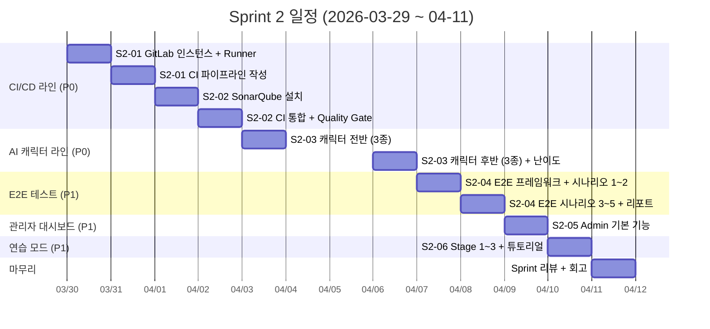
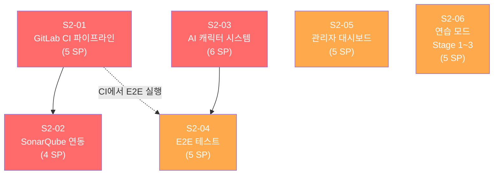
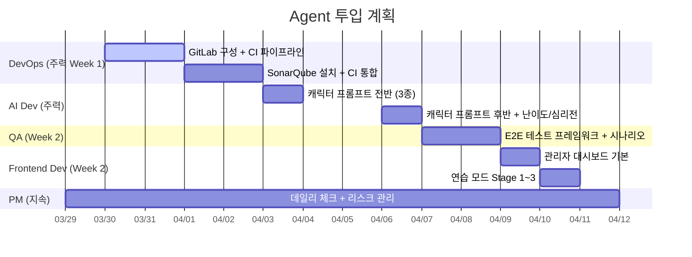
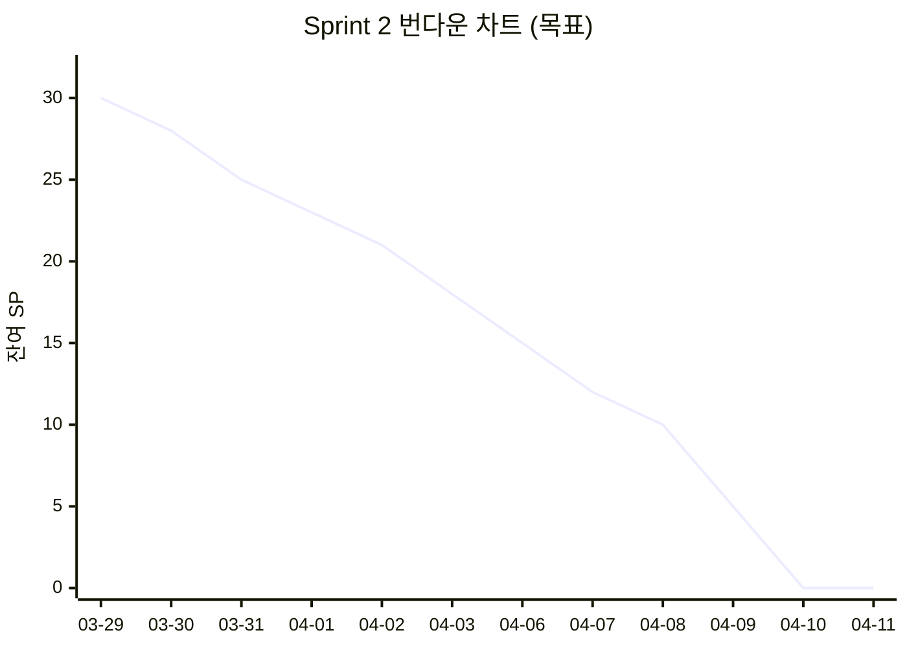

# Sprint 2 계획 (Sprint 2 Plan)

## 1. Sprint 목표

> **CI/CD 파이프라인(GitLab CI + SonarQube)을 구축하여 코드 품질 게이트를 자동화한다. AI 캐릭터 시스템(하수/중수/고수 x 6캐릭터)을 ai-adapter에 구현하고, Frontend → GameServer → AI Adapter 전체 경로의 E2E 테스트를 확보한다. 관리자 대시보드 기본 기능(게임 목록, 상태 모니터링)과 1인 연습 모드 Stage 1~3을 제공한다.**

---

## 2. Sprint 개요

| 항목 | 내용 |
|------|------|
| Sprint | Sprint 2 |
| Phase | Phase 2: 핵심 게임 개발 (MVP) |
| 기간 | **2026-03-29 (일) ~ 04-11 (토), 14일** |
| 실 작업일 | 10일 (평일) + 주말 4일 중 선택 |
| 목표 SP | **30 SP** |
| Velocity 목표 | **3.0 SP/일** (주말 제외 기준) |
| Owner | 애벌레 (1인 개발, Claude Agent Teams 지원) |

### Sprint 1 회고 요약 (Sprint 2 투입 전제)

Sprint 1 (03-13 ~ 03-28)에서 확보한 산출물:

| 산출물 | 상태 | Sprint 2 활용 |
|--------|------|---------------|
| Game Engine (69 테스트, 96.5% 커버리지) | 완료 | CI 파이프라인 통합 대상 |
| REST API 12개 엔드포인트 | 완료 | E2E 테스트 대상, 관리자 API 확장 |
| WebSocket Hub 실구현 | 완료 | E2E 게임 흐름 테스트 |
| Frontend (Next.js + OAuth + 로비 + WS) | 완료 | 게임 보드 고도화, 연습 모드 UI |
| AI Adapter /move (4개 어댑터 + fallback) | 완료 | 캐릭터 시스템 프롬프트 확장 |
| K8s 5개 서비스 배포 | 완료 | CI/CD 파이프라인 연결 |
| 통합 테스트 31/31 | 완료 | E2E 테스트 확장 기반 |

### Sprint 0 이월 항목 (Sprint 2에서 해소)

| 항목 | 이월 사유 | Sprint 2 우선순위 |
|------|-----------|-------------------|
| GitLab 인스턴스 + Runner 등록 | Sprint 1 블로커 아님 | **P0** |
| SonarQube 컨테이너 | 코드 충분히 쌓인 후 | **P0** |

---

## 3. 백로그 항목

### 3.1 백로그 요약 표

| ID | 백로그 항목 | 우선순위 | SP | 의존성 | 관련 요구사항 |
|----|------------|---------|-----|--------|--------------|
| S2-01 | GitLab CI 파이프라인 구축 | P0 | 5 | - | NFR-002-06 |
| S2-02 | SonarQube 연동 (코드 품질 게이트) | P0 | 4 | S2-01 | NFR-002-06 |
| S2-03 | AI 캐릭터 시스템 구현 | P0 | 6 | - | FR-004-09 |
| S2-04 | 게임 흐름 E2E 테스트 | P1 | 5 | S2-03 | FR-002-03 |
| S2-05 | 관리자 대시보드 기본 기능 | P1 | 5 | - | FR-005-01, FR-005-02 |
| S2-06 | 1인 연습 모드 Stage 1~3 | P1 | 5 | - | FR-001B-01~05 |
| **합계** | | | **30** | | |

### 3.2 백로그 상세

#### S2-01: GitLab CI 파이프라인 구축 (5 SP)

**목표**: game-server(Go)와 ai-adapter(NestJS)의 빌드/테스트/린트를 자동화하는 CI 파이프라인을 구축한다.

**수용 조건**:
- [ ] GitLab 인스턴스 구성 (Docker Compose, 로컬)
- [ ] GitLab Runner 등록 (Docker Executor)
- [ ] `.gitlab-ci.yml` 작성
  - game-server: `go build`, `go test`, `golangci-lint`
  - ai-adapter: `npm ci`, `npm run build`, `npm run lint`, `npm run test`
  - frontend: `npm ci`, `npm run build`, `npm run lint`
- [ ] Docker 이미지 빌드 스테이지 (멀티스테이지)
- [ ] Trivy 이미지 스캔 스테이지 (CRITICAL/HIGH 게이트)
- [ ] 파이프라인 평균 소요 시간 5분 이내

**교대 실행 전략**: CI/CD 모드 (~6GB) -- 개발 모드와 교대 실행

---

#### S2-02: SonarQube 연동 (4 SP)

**목표**: SonarQube를 설치하고 CI 파이프라인에 통합하여 코드 품질 게이트를 자동화한다.

**수용 조건**:
- [ ] SonarQube 컨테이너 구성 (Docker Compose, 포트 9000)
- [ ] sonar-project.properties 설정 (game-server, ai-adapter, frontend)
- [ ] Quality Gate 조건 설정
  - Coverage >= 60%
  - Bug: 0개
  - Vulnerability: 0개
  - Code Smell: A 등급
- [ ] GitLab CI 파이프라인에 SonarQube 분석 스테이지 연결
- [ ] Quality Gate 미통과 시 파이프라인 실패 처리
- [ ] SonarQube 대시보드에서 결과 확인 가능

**교대 실행 전략**: 품질 모드 (~4GB) -- SonarQube 단독 실행. 분석 완료 후 컨테이너 중지

---

#### S2-03: AI 캐릭터 시스템 구현 (6 SP)

**목표**: ai-adapter에 6개 캐릭터 x 3개 난이도 x 4단계 심리전 레벨의 프롬프트 시스템을 구현한다.

**수용 조건**:
- [ ] 캐릭터별 프롬프트 템플릿 작성 (6종)
  - Rookie (기본형), Calculator (계산형), Shark (공격형)
  - Fox (전략형), Wall (보수형), Wildcard (변칙형)
- [ ] 난이도별 프롬프트 변형 (3단계)
  - 하수: 기본 규칙만, 최적화 없음
  - 중수: 2~3수 앞 탐색, 기본 전략
  - 고수: 상대 타일 추론, 최적 전략, 장기 계획
- [ ] 심리전 레벨별 프롬프트 확장 (Level 0~3)
  - Level 0: 순수 전략
  - Level 1: 기본 블러핑
  - Level 2: 상대 패턴 분석
  - Level 3: 고급 심리전
- [ ] `MoveRequest`에 persona/difficulty/psychologyLevel 파라미터 반영
- [ ] PromptBuilder에 캐릭터 + 난이도 + 심리전 조합 로직 구현
- [ ] 캐릭터별 단위 테스트 (최소 6개)
- [ ] OpenAI 어댑터로 하수/중수/고수 행동 차이 확인 (수동 검증)

**관련 설계 문서**: `docs/02-design/04-ai-adapter-design.md`, `docs/02-design/08-ai-prompt-templates.md`

---

#### S2-04: 게임 흐름 E2E 테스트 (5 SP)

**목표**: Frontend → GameServer(WebSocket) → AI Adapter 전체 경로를 검증하는 E2E 테스트를 구축한다.

**수용 조건**:
- [ ] E2E 테스트 프레임워크 구성 (scripts/e2e/ 디렉토리)
- [ ] 시나리오 1: Room 생성 → 게임 시작 → Human 턴 → AI 턴 → 게임 종료
- [ ] 시나리오 2: Human 2인 + AI 2인 혼합 게임 (4인전)
- [ ] 시나리오 3: AI 턴 실패 → 재시도 3회 → 강제 드로우 fallback
- [ ] 시나리오 4: 턴 타임아웃 → 자동 드로우 → 다음 턴 전환
- [ ] 시나리오 5: 최초 등록(30점) → 테이블 재배치 → 승리 판정
- [ ] ConfirmTurn + PlaceTiles 통합 테스트 보강 (Sprint 1 P0 이월)
- [ ] PLACE_TILES 실시간 프리뷰 연동 검증
- [ ] E2E 테스트 결과 리포트 생성

**교대 실행 전략**: 개발 모드 (~6GB) -- Go + PostgreSQL + Redis + AI Adapter 동시 실행 필요

---

#### S2-05: 관리자 대시보드 기본 기능 (5 SP)

**목표**: 관리자가 활성 게임 목록과 시스템 상태를 모니터링할 수 있는 기본 대시보드를 구축한다.

**수용 조건**:
- [ ] Admin Next.js 프로젝트 초기화 (`src/admin/`)
- [ ] 관리자 인증 (RBAC: ROLE_ADMIN 화이트리스트)
- [ ] 활성 게임 Room 목록 조회 (FR-005-01)
  - Room ID, 참가자 수, 게임 상태, 시작 시각
- [ ] 게임 강제 종료 기능 (FR-005-02)
- [ ] 시스템 상태 모니터링
  - game-server /health, /ready 상태
  - ai-adapter /health 상태
  - Redis/PostgreSQL 연결 상태
- [ ] Dockerfile + Helm Chart (admin 서비스)
- [ ] 기본 레이아웃 (사이드바 + 메인 콘텐츠)

**관련 요구사항**: FR-005-01, FR-005-02, FR-003-03, FR-003-04

---

#### S2-06: 1인 연습 모드 Stage 1~3 (5 SP)

**목표**: 로그인 없이 접근 가능한 연습 모드의 처음 3개 스테이지를 구현한다.

**수용 조건**:
- [ ] 연습 모드 진입 화면 (로그인 불필요, FR-001B-01)
- [ ] Stage 1: 기본 그룹/런 만들기 연습 (FR-001B-03)
  - 제시된 타일로 유효한 그룹/런 구성
  - 성공/실패 피드백, 규칙 힌트 표시
- [ ] Stage 2: 최초 등록(30점) 연습 (FR-001B-04)
  - 랙 타일로 30점 이상 세트 구성
  - 점수 실시간 표시
- [ ] Stage 3: 조커 활용 연습 (FR-001B-05)
  - 조커가 포함된 타일로 그룹/런 구성
  - 조커 대체 규칙 설명
- [ ] 단계별 튜토리얼 텍스트 (FR-001B-02)
- [ ] 스테이지 선택 UI (잠금/해제 표시)
- [ ] 게임 엔진 검증 로직 재사용 (engine 패키지 직접 호출)

**관련 요구사항**: FR-001B-01~05

---

## 4. 스프린트 일정

### 4.1 주차별 목표

#### Week 1: CI/CD 인프라 + AI 캐릭터 (03-29 ~ 04-04)

CI/CD 파이프라인과 AI 캐릭터 시스템을 병렬 진행한다. GitLab/SonarQube는 인프라 셋업이므로 초반에 완료한다.

| 날짜 | 요일 | 목표 아이템 | SP | 누적 소진 |
|------|------|------------|-----|----------|
| 03-29 (일) | Day 0 | Sprint 2 시작, 환경 확인 | - | 0 |
| 03-30 (월) | Day 1 | S2-01 GitLab 인스턴스 + Runner 등록 | 2 | 2 |
| 03-31 (화) | Day 2 | S2-01 .gitlab-ci.yml 작성 + 파이프라인 확인 | 3 | 5 |
| 04-01 (수) | Day 3 | S2-02 SonarQube 설치 + 프로젝트 설정 | 2 | 7 |
| 04-02 (목) | Day 4 | S2-02 CI 통합 + Quality Gate 확인 | 2 | 9 |
| 04-03 (금) | Day 5 | S2-03 AI 캐릭터 프롬프트 (Rookie, Calculator, Shark) | 3 | 12 |
| 04-04 (토) | 선택 | (버퍼 / S2-03 선행) | - | - |

**Week 1 목표 SP: 12** (CI/CD 완성 + 캐릭터 절반)

#### Week 2: AI 캐릭터 완성 + E2E + 관리자 + 연습 모드 (04-05 ~ 04-11)

| 날짜 | 요일 | 목표 아이템 | SP | 누적 소진 |
|------|------|------------|-----|----------|
| 04-05 (일) | 선택 | (버퍼) | - | - |
| 04-06 (월) | Day 6 | S2-03 AI 캐릭터 프롬프트 (Fox, Wall, Wildcard) + 난이도/심리전 | 3 | 15 |
| 04-07 (화) | Day 7 | S2-04 E2E 테스트 프레임워크 + 시나리오 1~2 | 3 | 18 |
| 04-08 (수) | Day 8 | S2-04 E2E 시나리오 3~5 + 리포트 | 2 | 20 |
| 04-09 (목) | Day 9 | S2-05 관리자 대시보드 (프로젝트 초기화 + Room 목록 + 강제 종료) | 5 | 25 |
| 04-10 (금) | Day 10 | S2-06 연습 모드 Stage 1~3 + 튜토리얼 | 5 | 30 |
| 04-11 (토) | Day 11 | Sprint 리뷰 + 회고 | - | 30 |

**Week 2 목표 SP: 18** (잔여 항목 전체 완료)

### 4.2 Gantt 차트



---

## 5. 의존성 그래프



**범례**: 빨강 = P0, 주황 = P1. 점선 = 약한 의존 (없어도 진행 가능)

### 크리티컬 패스

```
S2-01(5) -> S2-02(4) = 9 SP (CI/CD 라인)
S2-03(6) -> S2-04(5) = 11 SP (AI 캐릭터 + E2E 라인)
```

AI 캐릭터 라인(11 SP)이 크리티컬 패스이다. Week 1에서 CI/CD와 캐릭터 전반부를 병렬 진행하면 병목 없이 소화 가능하다.

### 병렬 진행 구조

| 라인 | 항목 | Week 1 | Week 2 |
|------|------|--------|--------|
| CI/CD | S2-01, S2-02 | Day 1~4 | - |
| AI 캐릭터 | S2-03 | Day 5 | Day 6 |
| E2E 테스트 | S2-04 | - | Day 7~8 |
| 관리자 | S2-05 | - | Day 9 |
| 연습 모드 | S2-06 | - | Day 10 |

---

## 6. 교대 실행 전략 (메모리)

16GB RAM 제약 하에서 Sprint 2 작업별 동시 실행 구성:

| 작업 단계 | 실행 모드 | 필요 서비스 | 예상 메모리 | 비고 |
|-----------|----------|-----------|-----------|------|
| GitLab 인스턴스 구성 (Day 1~2) | CI/CD 모드 | GitLab + Runner | ~6GB | 개발 서비스 중지 |
| SonarQube 설치/분석 (Day 3~4) | 품질 모드 | SonarQube (단독) | ~4GB | GitLab 중지 후 실행 |
| AI 캐릭터 개발 (Day 5~6) | 개발 모드 | Go + NestJS + Redis + PG | ~5GB | SonarQube 중지 |
| E2E 테스트 (Day 7~8) | 개발 모드 | Go + NestJS + Redis + PG + Frontend | ~6GB | 전 서비스 필요 |
| Admin 개발 (Day 9) | 개발 모드 | Go + NestJS + Redis + PG | ~5GB | Admin 추가 |
| 연습 모드 (Day 10) | 개발 모드 | Go + Frontend | ~4GB | AI 불필요 |

> 모든 서비스 동시 실행 시 최대 ~7GB 예상. Docker Desktop K8s 교대 실행으로 메모리 제약 내 운용 가능.

---

## 7. Agent Teams 활용 계획

### 7.1 에이전트별 담당

| 에이전트 | 역할 | Sprint 2 담당 작업 |
|---------|------|-------------------|
| **DevOps** | CI/CD 인프라 | S2-01 (GitLab CI), S2-02 (SonarQube) |
| **AI Dev** | AI Adapter 개발 | S2-03 (캐릭터 시스템, 프롬프트) |
| **QA** | 테스트 | S2-04 (E2E 테스트), 테스트 커버리지 |
| **Frontend Dev** | UI 개발 | S2-05 (관리자 대시보드), S2-06 (연습 모드) |
| **PM** | 진행 관리 | 데일리 스크럼, 번다운 차트, 리스크 재평가 |
| **Architect** | 설계 검토 | 코드 리뷰, AI 프롬프트 품질 검증 |

### 7.2 Agent 투입 Gantt



---

## 8. 스프린트 리스크

### 8.1 기존 리스크 재평가

| ID | 리스크 | Sprint 1 등급 | Sprint 2 등급 | 사유 |
|----|--------|-------------|-------------|------|
| TR-05 | Docker Desktop K8s 리소스 부족 | 심각 | **높음** | 교대 실행 전략 안정화, 경험 축적 |
| TR-07 | SonarQube 메모리 과다 사용 | 중간 | **높음** | Sprint 2에서 SonarQube 실제 구동 |
| SR-01 | 1인 개발 병목 | 높음 | **높음** (유지) | Sprint 2 백로그 30 SP, 10일 소화 |
| ER-03 | Hyper-V 메모리 과점유 | 심각 | **높음** | .wslconfig 프로파일 전환으로 안정화 |

### 8.2 신규 리스크

| ID | 리스크 | 등급 | 발생확률 | 영향도 | 완화 전략 |
|----|--------|------|---------|--------|-----------|
| S2-R01 | GitLab 인스턴스 메모리 과다 (4GB+) | 높음 | 높음 | 높음 | GitLab CE 최소 설정 적용, Puma worker 2개 제한, Sidekiq concurrency 5 이하. 안되면 GitHub Actions 대안 검토 |
| S2-R02 | SonarQube + GitLab 동시 실행 불가 | 중간 | 중간 | 중간 | 교대 실행 전략 적용. SonarQube 분석은 GitLab 파이프라인 외부에서 별도 트리거 |
| S2-R03 | AI 캐릭터 프롬프트 품질 검증 어려움 | 중간 | 높음 | 중간 | 하수/중수/고수 행동 차이를 정량 메트릭으로 비교 (평균 타일 소진 속도, 무효 수 비율). 주관적 판단 최소화 |
| S2-R04 | E2E 테스트 환경 불안정 (다중 서비스 동시 기동) | 중간 | 중간 | 높음 | docker-compose로 테스트 환경 격리. 서비스 health check 대기 후 테스트 시작. 재시도 로직 포함 |
| S2-R05 | 관리자 대시보드 + 연습 모드 동시 5 SP 일정 부담 | 중간 | 중간 | 중간 | Day 9, Day 10에 각각 집중 배치. 완료 못할 경우 연습 모드 Stage 3를 Sprint 3로 이월 |

### 8.3 GitLab 대안 전략 (S2-R01 발동 시)

GitLab CE 인스턴스가 16GB RAM 환경에서 안정적으로 운용 불가능할 경우:

| 옵션 | 장점 | 단점 | 판단 기준 |
|------|------|------|-----------|
| **A. GitHub Actions** | 별도 인스턴스 불필요, 무료 tier | GitOps repo 구조 변경, ArgoCD 연계 재설계 | GitLab이 OOM으로 3회 이상 실패 시 |
| **B. GitLab SaaS (gitlab.com)** | 로컬 메모리 절약, Runner만 로컬 | 프라이빗 repo 제한, Container Registry 무료 한도 | SaaS 무료 tier로 충분한 경우 |
| **C. GitLab 최소화 + 분리 실행** | 기존 계획 유지 | 메모리 관리 복잡, 교대 전환 빈번 | 기본 전략 (P0) |

---

## 9. 번다운 차트 기준

| 일차 | 날짜 | 목표 잔여 SP | 목표 아이템 |
|------|------|-------------|------------|
| Day 0 | 03-29 | 30 | Sprint 2 시작 |
| Day 1 | 03-30 | 28 | S2-01 GitLab 인스턴스 (1/2) |
| Day 2 | 03-31 | 25 | S2-01 CI 파이프라인 (2/2) |
| Day 3 | 04-01 | 23 | S2-02 SonarQube 설치 (1/2) |
| Day 4 | 04-02 | 21 | S2-02 CI 통합 (2/2) |
| Day 5 | 04-03 | 18 | S2-03 AI 캐릭터 전반 |
| Day 6 | 04-06 | 15 | S2-03 AI 캐릭터 후반 |
| Day 7 | 04-07 | 12 | S2-04 E2E 테스트 (1/2) |
| Day 8 | 04-08 | 10 | S2-04 E2E 테스트 (2/2) |
| Day 9 | 04-09 | 5 | S2-05 관리자 대시보드 |
| Day 10 | 04-10 | 0 | S2-06 연습 모드 |
| Day 11 | 04-11 | 0 | Sprint 리뷰 + 회고 |

### 번다운 차트 (이상치)



---

## 10. 완료 기준 (Definition of Done)

### 10.1 스프린트 수준 DoD

- [ ] GitLab CI 파이프라인이 Push 시 자동 실행되고, game-server/ai-adapter/frontend 빌드 + 테스트 + 린트 통과
- [ ] SonarQube Quality Gate 통과 (Coverage >= 60%, Bug 0, Vulnerability 0)
- [ ] AI 캐릭터 6종 x 3난이도 프롬프트가 구현되고, 하수/중수/고수 간 행동 차이 확인
- [ ] E2E 테스트 5개 시나리오 중 최소 4개 PASS
- [ ] 관리자 대시보드에서 활성 Room 목록 조회 + 강제 종료 동작
- [ ] 1인 연습 모드 Stage 1~3 플레이 가능 (로그인 불필요)
- [ ] 모든 신규 코드에 대해 단위 테스트 작성

### 10.2 기술 부채 목표

Sprint 1에서 식별된 기술 부채 해소 목표:

| 부채 항목 | 우선순위 | Sprint 2 대응 |
|-----------|---------|---------------|
| config.go 기본 패스워드 하드코딩 | P2 | SonarQube Vulnerability 스캔으로 탐지 |
| INVALID_MOVE 에러 UI 미표시 | P1 | E2E 테스트에서 에러 UI 동작 검증 |
| 조커만 런 정책 미확정 | P2 | AI 캐릭터 테스트 중 정책 확정 |

---

## 11. Sprint 2 완료 후 Sprint 3 인터페이스

Sprint 2에서 확보하는 산출물이 Sprint 3 이후에 연결되는 지점:

| Sprint 2 산출물 | 후속 Sprint 활용 |
|----------------|-----------------|
| GitLab CI 파이프라인 | Sprint 3+ 모든 코드 변경에 대한 자동 빌드/테스트/보안 게이트 |
| SonarQube Quality Gate | Sprint 3+ 코드 품질 지속 모니터링 |
| AI 캐릭터 시스템 | Sprint 4 AI Adapter 고도화, 전략 비교 실험 |
| E2E 테스트 프레임워크 | Sprint 3+ 회귀 테스트 베이스라인 |
| 관리자 대시보드 | Sprint 6 관리자 기능 확장 (통계, ELO, 알림) |
| 연습 모드 Stage 1~3 | Sprint 3 Stage 4~6 확장, Frontend UI 고도화 |

---

## 12. 성공 기준 요약

Sprint 2가 성공적으로 완료되었는지 판단하는 기준:

1. **CI/CD**: `git push` 시 GitLab CI 파이프라인이 자동 실행되고, 빌드/테스트/린트/보안 스캔 전체 통과
2. **코드 품질**: SonarQube 대시보드에서 Coverage >= 60%, Bug 0, Quality Gate PASSED
3. **AI 캐릭터**: ai-adapter에 6개 캐릭터 프롬프트가 구현되고, 난이도별 행동 차이가 로그로 확인 가능
4. **E2E**: Frontend → GameServer → AI Adapter 전체 경로 게임 시나리오 4개 이상 PASS
5. **관리자**: `http://localhost:3001/admin` 접속 시 활성 Room 목록 표시, 강제 종료 동작
6. **연습 모드**: `http://localhost:3000/practice` 접속 시 Stage 1~3 플레이 가능

---

*작성: 애벌레 (PM) | 2026-03-15*
*기준 문서: 07-sprint1-revised-plan.md, 02-requirements.md, 05-wbs.md, 03-risk-management.md*
