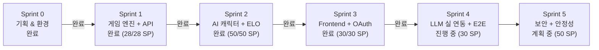
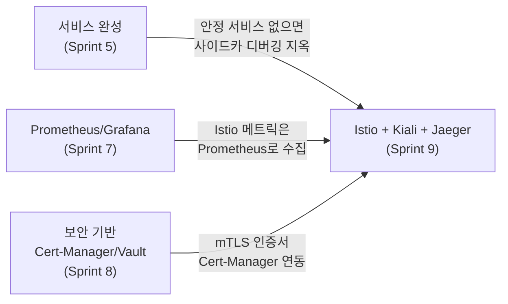
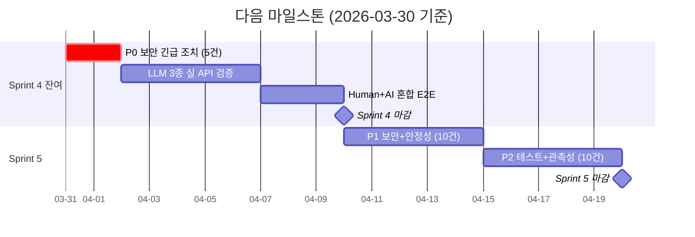

# 잔여 작업 로드맵 & 백로그

> **최종 업데이트**: 2026-03-30
> **현재 위치**: Sprint 4 진행 중 (잔여 LLM 실 연동 + E2E) / All-Hands 리뷰 완료
> **WBS 대비 선행**: 약 7주

---

## 현재 상태 요약

| 항목 | 상태 |
|------|------|
| Phase 1 (Sprint 0, 기획/환경) | 완료 |
| Phase 2 (Sprint 1~3, MVP) | **완료** (108/108 SP, 2026-03-23) |
| Phase 3 (Sprint 4~5, AI+멀티플레이) | **진행 중** (Sprint 4 약 60% 완료) |
| Phase 4 (Sprint 6, 플랫폼 확장) | ELO/관리자 선행 완료 (약 20%) |
| Phase 5 (Sprint 7~9, DevSecOps 고도화) | 미착수 |
| Phase 6 (운영 & 실험) | 미착수 |
| All-Hands 종합 리뷰 | **완료** (2026-03-30, 등급 B+) |

---

## Sprint 1~3 완료 결과 (Phase 2 전량 완료)

### Sprint 1: 게임 엔진 + 백엔드 API (28/28 SP, 2026-03-13~03-21)

- Game Engine (Go): 타일/그룹/런/조커/30점 검증, 69개 테스트 96.5% 커버리지
- REST API 12개 엔드포인트 + WebSocket Hub/Connection
- Google OAuth + Redis + PostgreSQL (10 테이블, GORM AutoMigrate)
- K8s 5개 서비스 배포 + Helm Umbrella Chart + ArgoCD Synced
- CI 파이프라인 13개 job ALL GREEN

### Sprint 2: AI 캐릭터 + ELO 랭킹 (50/50 SP, 2026-03-21~03-22)

- AI 캐릭터 시스템: 6캐릭터 x 3난이도 x 심리전 Level 0~3, 262개 테스트
- Turn Orchestrator goroutine + forceAIDraw 폴백
- ELO Pairwise 엔진 (K-Factor, 6티어, Redis Sorted Set)
- 관리자 대시보드 (Next.js, recharts, 실 API 연동)
- 1인 연습 모드 Stage 1~6 (dnd-kit + joker-aware)

### Sprint 3: Frontend 완성 + OAuth K8s (30/30 SP, 2026-03-22~03-23)

- Google OAuth K8s 복구 (inject-secrets.sh, ArgoCD ignoreDifferences)
- WS 재연결 (PLAYER_RECONNECT 토스트 UI)
- gemma3:4b -> 1b 최적화 (300s -> 4s, 70배 개선)
- Redis Timer/Session Storage 활성화

---

## Sprint 4 진행 현황 (Phase 3)

**기간**: 2026-03-23 조기 착수 ~ 진행 중
**목표**: LLM 3종 실 연동 + Human+AI 혼합 E2E

### 완료된 작업

| 항목 | 내용 |
|------|------|
| ISS-001~004 | ai-adapter 400, AI userID, Ollama K8s, WS GAME_OVER 전부 FIXED |
| BUG-UI-001~003, BUG-GR-001 | UI + 게임 규칙 버그 4건 전부 FIXED |
| Go 유닛 테스트 | 338/338 PASS, 95.3% 커버리지 (271개 신규) |
| Playwright E2E | 131/131 PASS (87개 신규: game-rules, game-ui 등) |
| WS 통합 테스트 | 16/16 PASS (TC-GM-001~050) |
| admin API | 7개 엔드포인트 실 구현 |
| OAuth 구조 해결 | values.yaml GOOGLE_CLIENT_ID 키 완전 제거 |

### 잔여 작업 (미완료)

| ID | 작업 | SP | 상태 |
|----|------|----|------|
| BL-S4-001 | OpenAI GPT-4o Adapter 실 API 검증 | 8 | 미완료 |
| BL-S4-002 | Claude API Adapter 실 API 검증 | 8 | 미완료 |
| BL-S4-003 | DeepSeek Adapter 실 API 검증 | 6 | 미완료 |
| BL-S4-004 | Human 1 + AI 3 혼합 E2E 완주 | 8 | 미완료 |
| BL-S4-005 | 비용 추적 Redis 연동 | 3 | 미완료 |
| BL-S4-006 | 모델별 성능 비교 메트릭 수집 | 3 | 미완료 |
| BL-S4-007 | AI 호출 로그/메트릭 수집 | 5 | 미완료 |

---

## All-Hands 종합 리뷰 결과 (2026-03-30)

10개 전문 에이전트가 코드/설계/인프라/보안/UX 전반을 병렬 리뷰. **전체 등급 B+**.

### CRITICAL 8건 요약

| ID | 내용 | 영향 | 난이도 |
|----|------|------|--------|
| SEC-001 | Admin API 인증 완전 부재 (7개 엔드포인트) | OWASP A01 | 낮음 |
| SEC-002 | inject-secrets.sh 시크릿 Git 커밋 | 시크릿 노출 | 중간 |
| SEC-003 | K8s Pod securityContext 미설정 | 권한 상승 | 낮음 |
| SEC-004 | Google id_token JWKS 서명 미검증 | 인증 우회 | 중간 |
| SEC-005 | API 키 평문 노출 (.env 로컬) | 키 유출 | 중간 |
| INFRA-001 | Redis 영속성 없음 (PVC 미연결) | 데이터 유실 | 낮음 |
| INFRA-002 | 모니터링 인프라 미구축 | 관측 불가 | 중간 |
| QA-001 | repository 패키지 테스트 0개 | 무결성 미검증 | 중간~높음 |

### 강점 (OK 53건 핵심)

- Game Engine 95.3% 커버리지, 순수 함수 설계
- LLM 신뢰 금지 3중 검증 (파서 -> 정규식 -> 엔진)
- E2E 131/131, Go 338/338, WS 21/21
- GitOps (Helm Umbrella + ArgoCD + ignoreDifferences)
- 깔끔한 계층 분리 (handler -> service -> repository)

상세 백로그: `docs/01-planning/13-backlog-2026-03-30.md` (78건, 231 SP)

---

## 개발(코딩) 완료 현황

### 서비스 완성도 (2026-03-30 기준)

| 서비스 | 완성도 | 비고 |
|--------|--------|------|
| game-server (Go) | **~85%** | 엔진 95.3%, REST/WS/admin 완성. 보안 미들웨어 미연결 + repository 테스트 부재 |
| ai-adapter (NestJS) | **~75%** | 4 어댑터 구현 + 262개 테스트. LLM 실 API 검증 미완 + 심리전 프롬프트 버그 |
| frontend (Next.js) | **~75%** | 게임 보드 + DnD + 연습 1~6 + E2E 131개. 반응형 전무 + 단위 테스트 0개 |
| admin (Next.js) | **~65%** | 대시보드 + ELO + 실 API 연동. 인증 부재 + 디자인 시스템 미통일 |

### 남은 개발 작업 (Sprint 4~6)

| Sprint | 개발 볼륨 | 주요 코딩 |
|--------|----------|----------|
| **Sprint 4 잔여** | 중간 | LLM 3종 실 연동, 비용 추적, 성능 메트릭 |
| **Sprint 5** | 큼 | P0 보안 패치, 인증 강화, Redis 영속성, Prometheus, 테스트 보강 |
| Sprint 6 | 중간 | 카카오톡 알림, 게임 복기, 반응형 UI |

**결론: 전체 개발의 약 75% 진행.** Phase 1~2 완료, Phase 3 Sprint 4 중반, Phase 4 ELO/관리자 선행 완료.

---

## Sprint 5+ 로드맵

| Sprint | 기간 (예상) | 목표 | SP | 핵심 작업 |
|--------|-------------|------|-----|-----------|
| **Sprint 4** | **진행 중** | **LLM 실 연동** | **30** | **OpenAI/Claude/DeepSeek 실 검증, Human+AI E2E** |
| **Sprint 5** | 다음 | **보안 + 안정성 + 테스트** | **50** | **P0 보안 5건 + P1 인증/Redis + P2 테스트/Prometheus** |
| Sprint 6 | 다다음 | 플랫폼 확장 + UX | 40 | 카카오톡, 게임 복기, 반응형, 키보드 DnD |
| Sprint 7 | 이후 | Observability 고도화 | 30 | Grafana 대시보드, Loki, k6 부하 테스트 |
| Sprint 8 | 이후 | 보안 고도화 | 30 | OWASP ZAP, Sealed Secrets, CSP, NetworkPolicy |
| Sprint 9 | 이후 | Service Mesh | 30 | Istio, Kiali, Jaeger, mTLS |
| 운영 | 이후 | AI 토너먼트 | - | 100판 실험, 모델 비교, 전략 분석 |

---

## Istio가 Sprint 9 (맨 마지막)인 이유

> **Q**: "Istio Service Mesh 작업이 왜 제일 뒤야?"

짧게 말하면: **Istio는 선행 기술 의존성이 제일 많은 overlay 기술이기 때문이다.**

### 기술 의존성 체인

### 상세 이유 5가지

**1. Prometheus가 먼저 있어야 한다 (Sprint 7 선행)**

Istio의 Envoy sidecar는 메트릭을 Prometheus에 밀어 넣는다. Kiali(서비스 토폴로지)와 Jaeger(분산 트레이싱)도 Prometheus 데이터를 기반으로 동작한다. Sprint 7에서 Prometheus/Grafana 스택을 먼저 구축하지 않으면 Istio를 설치해도 시각화가 안 된다.

**2. 서비스가 모두 안정화된 후 도입해야 한다 (Sprint 5~6 선행)**

Istio는 `istio-injection=enabled` 레이블 하나로 모든 Pod에 Envoy sidecar를 자동 주입한다. 서비스가 완성되지 않은 상태에서 Mesh를 씌우면, 애플리케이션 버그인지 Mesh 이슈인지 구분이 안 된다. "완성된 서비스에 인프라를 더한다"는 순서가 맞다.

**3. 보안 기반이 필요하다 (Sprint 8 선행)**

Istio의 핵심 기능은 mTLS(상호 TLS)이다. Cert-Manager가 없으면 인증서 관리가 수동이 되고, Vault(Sealed Secrets)가 없으면 Istio 설정 secret이 평문으로 들어간다. Sprint 8에서 PKI 기반을 먼저 닦고 Istio를 올리는 것이 보안 설계상 맞다.

**4. Traefik이 이미 North-South를 담당하고 있다**

Traefik Ingress Controller가 Phase 1부터 사용 중이다 (NGINX Ingress EOL 이슈로 선택). Istio는 East-West(서비스 간) 트래픽 메쉬 용도로만 추가하는 overlay다. 이 역할 분리가 명확해야 Istio 도입 시 트래픽 정책 충돌을 피할 수 있다. 역할이 확정되는 시점은 서비스 아키텍처가 안정된 Sprint 5~6 이후다.

**5. 운영 복잡도 vs 학습 곡선 관리**

Istio는 CRD(VirtualService, DestinationRule, PeerAuthentication 등)가 50개 이상이고 Envoy config dump 디버깅이 익숙해지는 데 시간이 필요하다. 이 복잡도를 감당할 여유는 핵심 기능이 완성된 이후다. 특히 이 프로젝트는 **AI 전략 실험이 목적**이므로, 게임 기능(Sprint 1~6)을 먼저 완성하고 Mesh는 마지막에 얹는 것이 우선순위 관점에서도 올바르다.

### 요약

| 의존성 | 없으면 어떻게 되는가? |
|--------|----------------------|
| 서비스 완성 (Sprint 5) | 사이드카 주입 후 버그 추적 불가 |
| Prometheus (Sprint 7) | Kiali/Jaeger 동작 안 함, 메트릭 없음 |
| Cert-Manager (Sprint 8) | mTLS 인증서 수동 관리, 보안 취약 |
| Traefik 역할 확정 | North-South/East-West 트래픽 정책 충돌 |

**결론**: Istio는 "기반이 쌓인 위에 얹는 마지막 계층"이다. 선행 의존이 제일 많기 때문에 Sprint 9가 맞다.

---

## 다음 마일스톤

---

*이 문서는 Sprint 진행에 따라 지속 업데이트된다.*
*최종 업데이트: 2026-03-30 -- All-Hands 리뷰 결과 반영, Sprint 3~4 완료/진행 상태 현행화*
