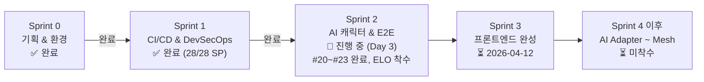
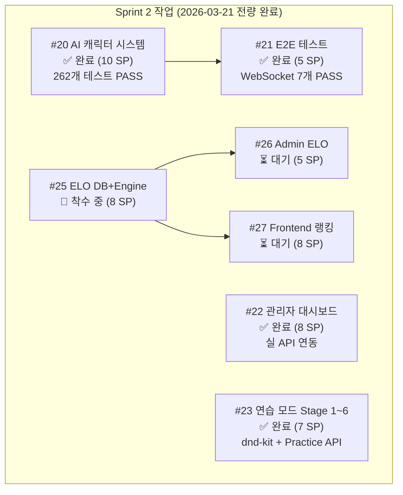
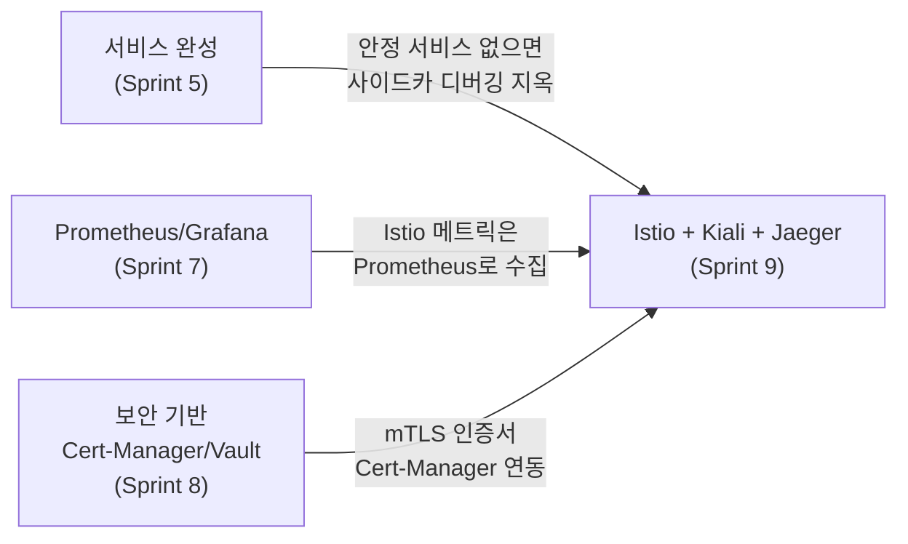

# 잔여 작업 로드맵 & 백로그

> **최종 업데이트**: 2026-03-22
> **현재 위치**: Sprint 1 완료 (28/28 SP) → Sprint 2 사전 진행 중 (Day 3, #20~#23 완료, ELO #25~#27 착수)

---

## 현재 상태 요약

| 항목 | 상태 |
|------|------|
| Sprint 0 (기획/환경) | ✅ 완료 |
| Sprint 1 (CI/CD & DevSecOps) | ✅ 완료 (28/28 SP, 100%) |
| GitLab CI 파이프라인 13개 job ALL GREEN | ✅ 완료 (`2849bb3`) |
| SonarQube Quality Gate (new_coverage ≥ 30%) | ✅ 완료 |
| GitLab Runner K8s 등록 | ✅ 완료 |
| quality/build/update-gitops 단계 GREEN | ✅ 완료 |
| ArgoCD Application 등록 (Synced+Healthy) | ✅ 완료 |
| Sprint 2 개발 (#20~#23) | ✅ 완료 (2026-03-21 조기 완료) |
| Phase 4 ELO 랭킹 (#25~#27) | 🔶 착수 중 (2026-03-22~) |

---

## Sprint 1 완료 결과 (2026-03-21 마감)

> **28/28 SP 100% 달성**, 블로커 없음

| # | 작업 | 결과 |
|---|------|------|
| 1 | quality 단계 GREEN (sonarqube + trivy-fs) | ✅ 완료 |
| 2 | build 단계 GREEN (3개 서비스 Docker 빌드) | ✅ 완료 |
| 3 | update-gitops 단계 GREEN | ✅ 완료 |
| 4 | Sprint 1 공식 회고 + 마감 | ✅ 완료 |
| 5 | ArgoCD Application 등록 (Synced+Healthy) | ✅ 완료 |
| 6 | ai-adapter SonarQube lcov 재스캔 | ✅ 완료 |
| 7 | k8s 서비스 상태 점검 (5개 파드 Running) | ✅ 완료 |

---

## Sprint 2 백로그 (2026-03-29 ~ 04-11, 30 SP)

### [#20] AI 캐릭터 시스템 구현 ✅ 완료 (10 SP, 2026-03-21)

- **서비스**: ai-adapter (NestJS)
- **완료 산출물**:
  - 6개 캐릭터 × 3 난이도 × 심리전 Level 0~3 프롬프트 빌더 (262개 테스트)
  - CharacterService ↔ PromptBuilderService 연동
  - temperature 파라미터화 (하수 1.0 / 중수 0.7 / 고수 0.3)
  - Ollama MIN_RETRIES=5, gemma3:4b 확정

### [#21] 게임 흐름 E2E 테스트 ✅ 완료 (5 SP, 2026-03-21)

- **서비스**: game-server (Go)
- **완료 산출물**:
  - AI Turn Orchestrator goroutine + forceAIDraw 폴백
  - WebSocket 멀티플레이 통합 테스트 7개 PASS (Human 2명 실제 대전)
  - Room 생명주기 완성 (FinishRoom + 재접속 감지 + ListRooms 필터)

### [#22] 관리자 대시보드 기본 기능 ✅ 완료 (8 SP, 2026-03-21)

- **서비스**: src/admin/ (Next.js)
- **완료 산출물**:
  - Next.js 앱 초기화 + recharts 통계 차트
  - fetchHealth/fetchRooms 실 API + fallback (USE_MOCK 플래그)
  - 관리자 인증 getAdminToken() 3단계 fallback
  - Helm chart (port 3001, NodePort 30001)

### [#23] 1인 연습 모드 Stage 1~6 ✅ 완료 (7 SP, 2026-03-21)

- **서비스**: frontend (Next.js)
- **완료 산출물**:
  - Stage 1~6 전량 구현 (dnd-kit + joker-aware + localStorage)
  - Practice Progress API (Go) — POST/GET /api/practice/progress, 9개 테스트
  - practice-api.ts 실 연동 (Bearer 토큰, StagePlayClient)
  - PLAYER_RECONNECT ReconnectToast (Framer Motion, 3s)

### [#25] ELO DB + Game Engine 연동 🔶 착수 중 (8 SP)

- **서비스**: game-server (Go)
- **목표**: EloRating 모델, Pairwise ELO 계산, FinishRoom() 연동

### [#26] Admin ELO 통계 패널 ⏳ 대기 (5 SP)

- **서비스**: admin (Next.js)
- **의존**: #25 완료 후

### [#27] Frontend 랭킹 페이지 ⏳ 대기 (8 SP)

- **서비스**: frontend (Next.js)
- **목표**: 리더보드 `/leaderboard`, 개인 프로필 `/profile/[userId]`

---

## Sprint 3+ 로드맵 (참고)

| Sprint | 기간 | 목표 | 핵심 작업 |
|--------|------|------|-----------|
| **Sprint 2** | **03-29 ~ 04-11** | **AI 캐릭터 & ELO** | **#20~#23 완료 + #25~#27 ELO 랭킹 (조기 착수)** |
| Sprint 3 | 04-12 ~ 04-25 | 프론트엔드 완성 | Google OAuth, 게임 보드 완성, WebSocket 연동 |
| Sprint 4 | 04-26 ~ 05-09 | AI Adapter 4종 | OpenAI/Claude/DeepSeek/Ollama 연동 |
| Sprint 5 | 05-10 ~ 05-23 | 멀티플레이 완성 | Human+AI 혼합, 턴 동기화, 재연결 처리 |
| Sprint 6 | 05-24 ~ 06-06 | 플랫폼 확장 | 카카오톡 알림, 관리자 고도화 (ELO는 Sprint 2에서 선행) |
| Sprint 7 | 06-07 ~ 06-20 | Observability | Prometheus, Grafana, Loki |
| Sprint 8 | 06-21 ~ 07-04 | 보안 고도화 | OWASP ZAP, Sealed Secrets, Cert-Manager |
| Sprint 9 | 07-05 ~ 07-18 | Service Mesh | Istio, Kiali, Jaeger, k6 부하 테스트 |
| 운영 | 07-19 ~ 08-01 | AI 토너먼트 | 100판 실험, 모델 비교 분석 |

---

## Istio가 Sprint 9 (맨 마지막)인 이유

> **Q**: "Istio Service Mesh 작업이 왜 제일 뒤야?"

짧게 말하면: **Istio는 선행 기술 의존성이 제일 많은 overlay 기술이기 때문이다.**

### 기술 의존성 체인

### 상세 이유 5가지

**1. Prometheus가 먼저 있어야 한다 (Sprint 7 선행)**

Istio의 Envoy sidecar는 메트릭을 Prometheus에 밀어 넣는다. Kiali(서비스 토폴로지)와 Jaeger(분산 트레이싱)도 Prometheus 데이터를 기반으로 동작한다. Sprint 7에서 Prometheus/Grafana 스택을 먼저 구축하지 않으면 Istio를 설치해도 시각화가 안 된다.

**2. 서비스가 모두 안정화된 후 도입해야 한다 (Sprint 5~6 선행)**

Istio는 `istio-injection=enabled` 레이블 하나로 모든 Pod에 Envoy sidecar를 자동 주입한다. 서비스가 완성되지 않은 상태에서 Mesh를 씌우면, 애플리케이션 버그인지 Mesh 이슈인지 구분이 안 된다. "완성된 서비스에 인프라를 더한다"는 순서가 맞다.

**3. 보안 기반이 필요하다 (Sprint 8 선행)**

Istio의 핵심 기능은 mTLS(상호 TLS)이다. Cert-Manager가 없으면 인증서 관리가 수동이 되고, Vault(Sealed Secrets)가 없으면 Istio 설정 secret이 평문으로 들어간다. Sprint 8에서 PKI 기반을 먼저 닦고 Istio를 올리는 것이 보안 설계상 맞다.

**4. Traefik이 이미 North-South를 담당하고 있다**

Traefik Ingress Controller가 Phase 1부터 사용 중이다 (NGINX Ingress EOL 이슈로 선택). Istio는 East-West(서비스 간) 트래픽 메쉬 용도로만 추가하는 overlay다. 이 역할 분리가 명확해야 Istio 도입 시 트래픽 정책 충돌을 피할 수 있다. 역할이 확정되는 시점은 서비스 아키텍처가 안정된 Sprint 5~6 이후다.

**5. 운영 복잡도 vs 학습 곡선 관리**

Istio는 CRD(VirtualService, DestinationRule, PeerAuthentication 등)가 50개 이상이고 Envoy config dump 디버깅이 익숙해지는 데 시간이 필요하다. 이 복잡도를 감당할 여유는 핵심 기능이 완성된 이후다. 특히 이 프로젝트는 **AI 전략 실험이 목적**이므로, 게임 기능(Sprint 1~6)을 먼저 완성하고 Mesh는 마지막에 얹는 것이 우선순위 관점에서도 올바르다.

### 요약

| 의존성 | 없으면 어떻게 되는가? |
|--------|----------------------|
| 서비스 완성 (Sprint 5) | 사이드카 주입 후 버그 추적 불가 |
| Prometheus (Sprint 7) | Kiali/Jaeger 동작 안 함, 메트릭 없음 |
| Cert-Manager (Sprint 8) | mTLS 인증서 수동 관리, 보안 취약 |
| Traefik 역할 확정 | North-South/East-West 트래픽 정책 충돌 |

**결론**: Istio는 "기반이 쌓인 위에 얹는 마지막 계층"이다. 선행 의존이 제일 많기 때문에 Sprint 9가 맞다.

---

## 개발(코딩) 완료 현황

> "개발은 모두 끝난 것인가?"에 대한 답변

### 현재까지 완성된 코드

| 서비스 | 완성도 | 비고 |
|--------|--------|------|
| game-server (Go) | ~75% | 게임 엔진 + REST API + WebSocket + AI 오케스트레이터 + Practice API + Room 생명주기 |
| ai-adapter (NestJS) | ~70% | 6캐릭터 × 3난이도 × 4심리전 프롬프트 빌더, 262개 테스트 (Ollama E2E 검증 진행 중) |
| frontend (Next.js) | ~60% | 게임 보드 + DnD + 연습 모드 Stage 1~6 + PLAYER_RECONNECT UX |
| admin (Next.js) | ~45% | 대시보드 초기 구현 + 실 API 연동 + Helm Chart (ELO 패널 미구현) |

### 남은 개발 작업 (Sprint 2~6)

| Sprint | 개발 볼륨 | 주요 코딩 |
|--------|----------|----------|
| **Sprint 2** | **✅ 대부분 완료** | **AI 캐릭터, E2E, 관리자 UI, 연습 모드 1~6 → ELO #25~#27 착수** |
| Sprint 3 | ★★★★ 큼 | Google OAuth, WebSocket 완성, 게임 보드 완성 |
| Sprint 4 | ★★★★ 큼 | 4개 LLM Adapter 구현 |
| Sprint 5 | ★★★ 중간 | 멀티플레이 통합, 턴 동기화 |
| Sprint 6 | ★★ 중소 | 카카오톡, 관리자 고도화 (ELO는 Sprint 2에서 선행 완료 예정) |

**결론: 전체 개발의 약 60% 진행.** Sprint 0~1은 인프라/CI, Sprint 2에서 핵심 게임 로직/AI/프론트엔드 구현 완료. ELO 랭킹은 Sprint 2 내 선행 착수 중.

---

*이 문서는 Sprint 진행에 따라 지속 업데이트된다.*
*최종 업데이트: 2026-03-22 — Sprint 1 마감, Sprint 2 #20~#23 완료, ELO #25~#27 착수 반영*
