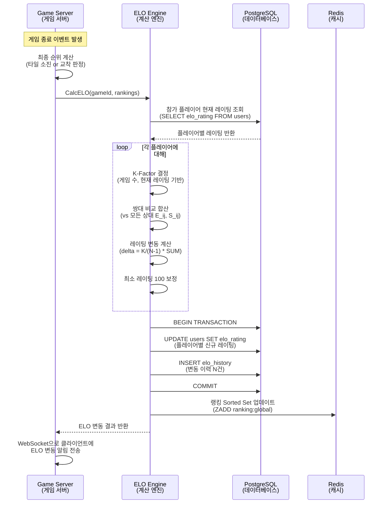
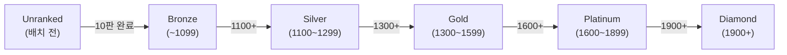
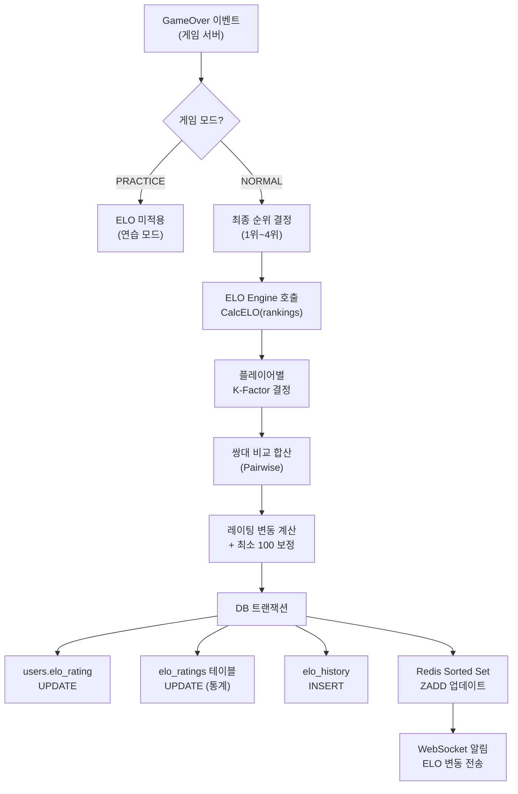

# Phase 4 ELO 랭킹 시스템 설계

> **Phase**: 4 (Sprint 6)
> **예정 기간**: 2026-05-24 ~ 06-06
> **작성일**: 2026-03-21
> **작성자**: 애벌레
> **관련 이슈**: GitHub #25, #26, #27

---

## 1. 개요

RummiArena의 ELO 랭킹 시스템은 2~4인 다자 게임에서 플레이어의 실력을 정량화하고, 티어 기반 동기 부여를 제공한다. 표준 ELO 수식을 다자 게임에 맞게 **쌍대 비교 합산(Pairwise Comparison)** 방식으로 확장한다.

### 1.1 핵심 파라미터

| 파라미터 | 값 | 근거 |
|----------|------|------|
| Initial Rating | 1000 | 표준 체스 입문자 기준, 직관적 |
| K-Factor (기본) | 32 | 변동성과 안정성의 균형 (FIDE 2400 미만 기준) |
| K-Factor (신규, < 30게임) | 40 | 신규 플레이어 빠른 수렴 |
| K-Factor (상위, >= 2000) | 24 | 상위 레이팅 안정화 |
| 최소 레이팅 | 100 | 레이팅 바닥값 (음수 방지) |

### 1.2 기존 구현 현황

| 항목 | 상태 | 위치 |
|------|------|------|
| `users.elo_rating` 필드 | 구현 완료 | `model/player.go` (기본값 1000) |
| `elo_history` 테이블 | 구현 완료 | `model/event.go` (EloHistory struct) |
| DB 마이그레이션 | 자동 (GORM AutoMigrate) | `infra/database.go` |
| ELO 계산 엔진 | **미구현** | Sprint 6 구현 예정 |
| 랭킹 API | **미구현** | Sprint 6 구현 예정 |
| 랭킹 UI | **미구현** | Sprint 6 구현 예정 |

---

## 2. 다자 게임 ELO 계산 방식

### 2.1 표준 ELO (2인)

```
기대 승률: E_A = 1 / (1 + 10^((R_B - R_A) / 400))
레이팅 변동: R_A' = R_A + K * (S_A - E_A)
  - S_A = 1 (승), 0.5 (무승부), 0 (패)
```

### 2.2 다자 게임 확장: 쌍대 비교 합산 (Pairwise Comparison)

루미큐브는 2~4인 게임이므로, 각 플레이어를 다른 모든 플레이어와 1:1로 비교하여 ELO 변동을 합산한다.

**N명 게임에서 플레이어 i의 레이팅 변동**:

```
delta_i = (K / (N-1)) * SUM_j!=i [ S_ij - E_ij ]

여기서:
  E_ij = 1 / (1 + 10^((R_j - R_i) / 400))   -- i가 j를 이길 기대 확률
  S_ij = 순위 기반 실제 점수 (아래 참조)
```

### 2.3 순위 기반 실제 점수 (S_ij)

| 플레이어 i vs j 관계 | S_ij |
|----------------------|------|
| i가 j보다 상위 순위 | 1.0 |
| i와 j가 동일 순위 | 0.5 |
| i가 j보다 하위 순위 | 0.0 |

**순위 결정 기준** (루미큐브 규칙):
1. 타일을 먼저 모두 소진한 플레이어가 1위
2. 나머지 플레이어는 남은 타일 점수 합이 낮은 순 (조커 = 30점)
3. 교착 상태 시: 남은 타일 합산 점수가 가장 낮은 플레이어 1위

### 2.4 계산 예시 (4인 게임)

```
플레이어: A(1200), B(1000), C(1100), D(900)
결과 순위: A(1위), C(2위), B(3위), D(4위)

A의 변동 (K=32):
  vs B: E=0.76, S=1.0 → +0.24
  vs C: E=0.64, S=1.0 → +0.36
  vs D: E=0.85, S=1.0 → +0.15
  delta_A = (32/3) * (0.24 + 0.36 + 0.15) = 10.67 * 0.75 = +8.0

D의 변동 (K=32):
  vs A: E=0.15, S=0.0 → -0.15
  vs B: E=0.36, S=0.0 → -0.36
  vs C: E=0.24, S=0.0 → -0.24
  delta_D = (32/3) * (-0.15 + -0.36 + -0.24) = 10.67 * (-0.75) = -8.0
```

---

## 3. ELO 계산 플로우



---

## 4. DB 스키마

### 4.1 기존 테이블 활용

**users 테이블** (이미 존재):
- `elo_rating INTEGER DEFAULT 1000` -- 현재 레이팅

**elo_history 테이블** (이미 존재):
- 참조: `docs/02-design/02-database-design.md` 2.7절
- Go 모델: `model.EloHistory` (`src/game-server/internal/model/event.go`)

### 4.2 신규 테이블: elo_ratings (확장 통계)

기존 `users.elo_rating`은 현재 레이팅만 보관한다. 승/패/무승부 등 집계 통계를 위해 별도 테이블을 추가한다.

```sql
CREATE TABLE elo_ratings (
    id              UUID PRIMARY KEY DEFAULT gen_random_uuid(),
    user_id         UUID NOT NULL REFERENCES users(id) UNIQUE,
    rating          INTEGER NOT NULL DEFAULT 1000,       -- users.elo_rating과 동기화
    tier            VARCHAR(20) NOT NULL DEFAULT 'UNRANKED',  -- 티어
    wins            INTEGER NOT NULL DEFAULT 0,
    losses          INTEGER NOT NULL DEFAULT 0,
    draws           INTEGER NOT NULL DEFAULT 0,
    games_played    INTEGER NOT NULL DEFAULT 0,
    win_streak      INTEGER NOT NULL DEFAULT 0,          -- 현재 연승
    best_streak     INTEGER NOT NULL DEFAULT 0,          -- 최대 연승
    peak_rating     INTEGER NOT NULL DEFAULT 1000,       -- 역대 최고 레이팅
    last_game_at    TIMESTAMPTZ,
    created_at      TIMESTAMPTZ DEFAULT NOW(),
    updated_at      TIMESTAMPTZ DEFAULT NOW()
);
CREATE INDEX idx_elo_ratings_rating ON elo_ratings(rating DESC);
CREATE INDEX idx_elo_ratings_tier ON elo_ratings(tier);
```

### 4.3 Go 모델 (신규)

```go
// EloRating 플레이어 랭킹 통계 영속 모델 (PostgreSQL)
type EloRating struct {
    ID          string    `gorm:"primaryKey;type:uuid;default:gen_random_uuid()" json:"id"`
    UserID      string    `gorm:"column:user_id;type:uuid;not null;uniqueIndex" json:"userId"`
    Rating      int       `gorm:"column:rating;not null;default:1000"           json:"rating"`
    Tier        string    `gorm:"column:tier;type:varchar(20);not null;default:'UNRANKED'" json:"tier"`
    Wins        int       `gorm:"column:wins;not null;default:0"                json:"wins"`
    Losses      int       `gorm:"column:losses;not null;default:0"              json:"losses"`
    Draws       int       `gorm:"column:draws;not null;default:0"               json:"draws"`
    GamesPlayed int       `gorm:"column:games_played;not null;default:0"        json:"gamesPlayed"`
    WinStreak   int       `gorm:"column:win_streak;not null;default:0"          json:"winStreak"`
    BestStreak  int       `gorm:"column:best_streak;not null;default:0"         json:"bestStreak"`
    PeakRating  int       `gorm:"column:peak_rating;not null;default:1000"      json:"peakRating"`
    LastGameAt  *time.Time `gorm:"column:last_game_at"                          json:"lastGameAt,omitempty"`
    CreatedAt   time.Time `gorm:"column:created_at"                             json:"createdAt"`
    UpdatedAt   time.Time `gorm:"column:updated_at"                             json:"updatedAt"`
}
```

### 4.4 Redis 캐시 구조

```
Key: ranking:global
Type: Sorted Set
Score: ELO 레이팅
Member: user_id
용도: 리더보드 Top N 빠른 조회 (ZREVRANGE)

Key: ranking:tier:{tier}
Type: Sorted Set
Score: ELO 레이팅
Member: user_id
용도: 티어별 랭킹 조회
```

---

## 5. API 엔드포인트 설계

### 5.1 랭킹 API

| Method | Endpoint | 설명 | 인증 |
|--------|----------|------|------|
| GET | `/api/rankings` | 전체 랭킹 리더보드 | 선택 |
| GET | `/api/rankings/tier/:tier` | 티어별 랭킹 | 선택 |
| GET | `/api/users/:id/rating` | 개인 랭킹 상세 | 선택 |
| GET | `/api/users/:id/rating/history` | ELO 변동 이력 | 인증 필요 |

### 5.2 요청/응답 상세

**GET /api/rankings**

```
Query Parameters:
  - page: int (기본 1)
  - size: int (기본 20, 최대 100)
  - tier: string (선택, 필터링)
```

```json
{
  "data": [
    {
      "rank": 1,
      "userId": "uuid",
      "displayName": "애벌레",
      "avatarUrl": "https://...",
      "rating": 1523,
      "tier": "GOLD",
      "wins": 42,
      "losses": 18,
      "draws": 3,
      "gamesPlayed": 63,
      "winRate": 66.7,
      "winStreak": 5
    }
  ],
  "pagination": {
    "page": 1,
    "size": 20,
    "total": 150
  }
}
```

**GET /api/users/:id/rating**

```json
{
  "userId": "uuid",
  "displayName": "애벌레",
  "rating": 1523,
  "tier": "GOLD",
  "tierProgress": 23,
  "nextTier": "PLATINUM",
  "ratingToNextTier": 77,
  "wins": 42,
  "losses": 18,
  "draws": 3,
  "gamesPlayed": 63,
  "winRate": 66.7,
  "winStreak": 5,
  "bestStreak": 8,
  "peakRating": 1580,
  "recentGames": [
    {
      "gameId": "uuid",
      "ratingDelta": "+12",
      "rank": 1,
      "playerCount": 4,
      "playedAt": "2026-06-15T14:30:00Z"
    }
  ]
}
```

**GET /api/users/:id/rating/history**

```
Query Parameters:
  - limit: int (기본 30, 최대 100)
  - from: datetime (선택)
  - to: datetime (선택)
```

```json
{
  "data": [
    {
      "gameId": "uuid",
      "ratingBefore": 1511,
      "ratingAfter": 1523,
      "ratingDelta": 12,
      "kFactor": 32,
      "opponentAvgRating": 1150,
      "rank": 1,
      "playerCount": 4,
      "createdAt": "2026-06-15T14:30:00Z"
    }
  ]
}
```

---

## 6. 랭킹 티어 설계

### 6.1 티어 구간



| 티어 | 레이팅 범위 | 배지 색상 | 진입 조건 |
|------|------------|-----------|-----------|
| Unranked | - | 회색 (#9CA3AF) | 기본값 |
| Bronze | 100 ~ 1099 | 갈색 (#CD7F32) | 배치 10판 완료 |
| Silver | 1100 ~ 1299 | 은색 (#C0C0C0) | 레이팅 1100+ |
| Gold | 1300 ~ 1599 | 금색 (#FFD700) | 레이팅 1300+ |
| Platinum | 1600 ~ 1899 | 백금색 (#E5E4E2) | 레이팅 1600+ |
| Diamond | 1900+ | 다이아몬드색 (#B9F2FF) | 레이팅 1900+ |

### 6.2 배치 게임 (Placement)

- 신규 플레이어는 **10판 배치 게임** 후 티어가 확정된다
- 배치 기간 중 K-Factor = 40 (빠른 수렴)
- 배치 완료 전 티어는 `UNRANKED`로 표시
- 배치 중에도 레이팅은 내부적으로 계산 (1000에서 시작)

### 6.3 티어 강등 방지

- 티어 경계에서 **50점 보호 구간** 적용
  - 예: Gold 진입(1300) 후 1250까지는 Gold 유지, 1249 이하에서 Silver로 강등
- 시즌 리셋은 Phase 6 운영 단계에서 결정

---

## 7. AI 플레이어 ELO 처리

### 7.1 AI도 ELO를 가진다

AI 플레이어도 개별 ELO 레이팅을 보유하며, Human과 동일한 계산을 적용한다. 이를 통해 "AI 모델 간 실력 비교"라는 프로젝트 핵심 목표를 달성한다.

| AI 모델 | 초기 레이팅 | 난이도별 보정 |
|---------|------------|--------------|
| AI_OPENAI | 1000 | 하수 -200, 중수 0, 고수 +200 |
| AI_CLAUDE | 1000 | 하수 -200, 중수 0, 고수 +200 |
| AI_DEEPSEEK | 1000 | 하수 -200, 중수 0, 고수 +200 |
| AI_LLAMA | 1000 | 하수 -200, 중수 0, 고수 +200 |

### 7.2 AI 식별

- AI 플레이어는 `game_players.player_type`으로 구분 (HUMAN / AI_*)
- AI는 `users` 테이블에 가상 유저로 등록 (예: `ai-openai-expert@rummiarena.local`)
- 캐릭터 + 난이도 조합별로 별도 가상 유저 생성

---

## 8. 게임 종료 시 ELO 업데이트 흐름



---

## 9. 프론트엔드 UI 설계

### 9.1 게임 결과 화면 (ELO 변동 표시)

게임 종료 후 결과 모달에 ELO 변동을 시각적으로 표시한다.

```
+---------------------------------------+
|           게임 결과                     |
+---------------------------------------+
| 1위  애벌레       1523 (+12)   Gold    |
| 2위  Calculator   1108 (+3)    Silver  |
| 3위  Shark AI     987  (-5)    Bronze  |
| 4위  Guest_abc    945  (-10)   Bronze  |
+---------------------------------------+
|      [다시 하기]  [로비로]              |
+---------------------------------------+
```

### 9.2 개인 랭킹 페이지 (/profile/[userId])

- ELO 레이팅 + 티어 배지
- 최근 30경기 ELO 추이 라인 차트 (recharts)
- 승률, 연승, 최고 레이팅 카드
- 최근 게임 이력 테이블

### 9.3 리더보드 페이지 (/leaderboard)

- 전체 랭킹 테이블 (페이지네이션)
- 티어별 필터 탭 (전체 / Bronze / Silver / Gold / Platinum / Diamond)
- 내 순위 하이라이트
- AI 모델 랭킹 별도 탭 (모델별 평균 레이팅, 최고 레이팅)

### 9.4 관리자 대시보드 (admin)

- 전체 유저 ELO 분포 히스토그램
- ELO 히스토리 차트 (recharts LineChart, 유저 선택)
- 티어별 인원 파이 차트
- AI 모델별 레이팅 비교 바 차트

---

## 10. 구현 계획 (Sprint 6)

| 작업 | Story Points | 서비스 | 의존성 |
|------|-------------|--------|--------|
| ELO 계산 엔진 + DB 마이그레이션 | 8 SP | game-server (Go) | GameOver 이벤트 |
| 관리자 대시보드 ELO 연동 | 5 SP | admin (Next.js) | 랭킹 API |
| 프론트엔드 랭킹 UI | 8 SP | frontend (Next.js) | 랭킹 API |
| **합계** | **21 SP** | | |

### 10.1 관련 GitHub Issues

- **#25**: ELO 랭킹 시스템 -- DB + 계산 엔진 (Go) [8 SP]
- **#26**: ELO 랭킹 -- 관리자 대시보드 연동 [5 SP]
- **#27**: 랭킹 UI -- Frontend 게임 결과 화면 [8 SP]

---

## 11. 리스크 및 고려사항

| 리스크 | 영향도 | 대응 |
|--------|--------|------|
| AI 레이팅 인플레이션 | 중 | AI끼리만 대전 시 레이팅 풀 분리 검토 |
| 레이팅 조작 (고의 패배) | 낮음 | 내부 실험 프로젝트, 운영 단계 모니터링 |
| 4인 게임 ELO 수렴 속도 | 중 | K-Factor 조정으로 대응 (신규 40, 일반 32) |
| 동시 게임 종료 시 race condition | 중 | DB 트랜잭션 + Redis 원자적 업데이트 |

---

## 12. 참조 문서

- `docs/02-design/02-database-design.md` -- elo_history 테이블 (2.7절)
- `docs/02-design/03-api-design.md` -- REST API 공통 규칙
- `docs/02-design/04-ai-adapter-design.md` -- AI 캐릭터 시스템
- `src/game-server/internal/model/event.go` -- EloHistory Go 모델
- `src/game-server/internal/model/player.go` -- User.EloRating 필드

---

*이 문서는 Sprint 6 착수 시 상세 구현 스펙으로 업데이트된다.*
