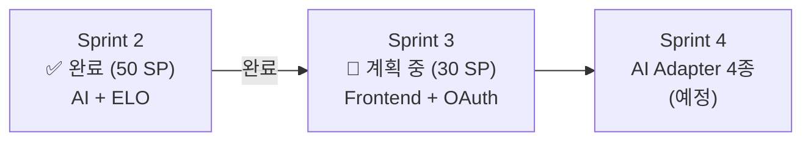
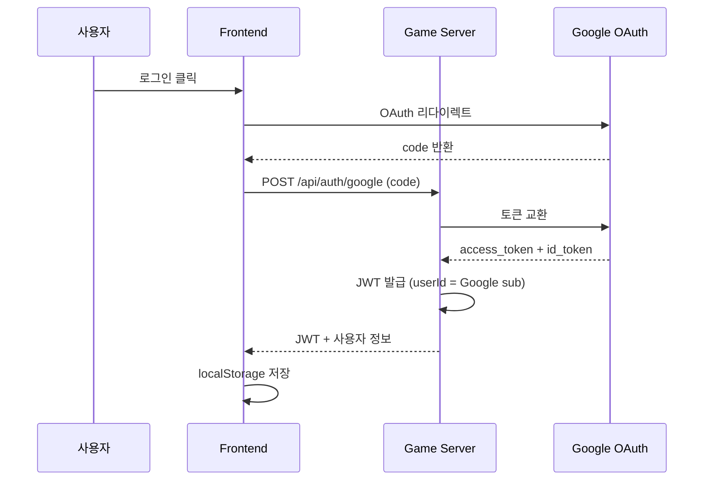
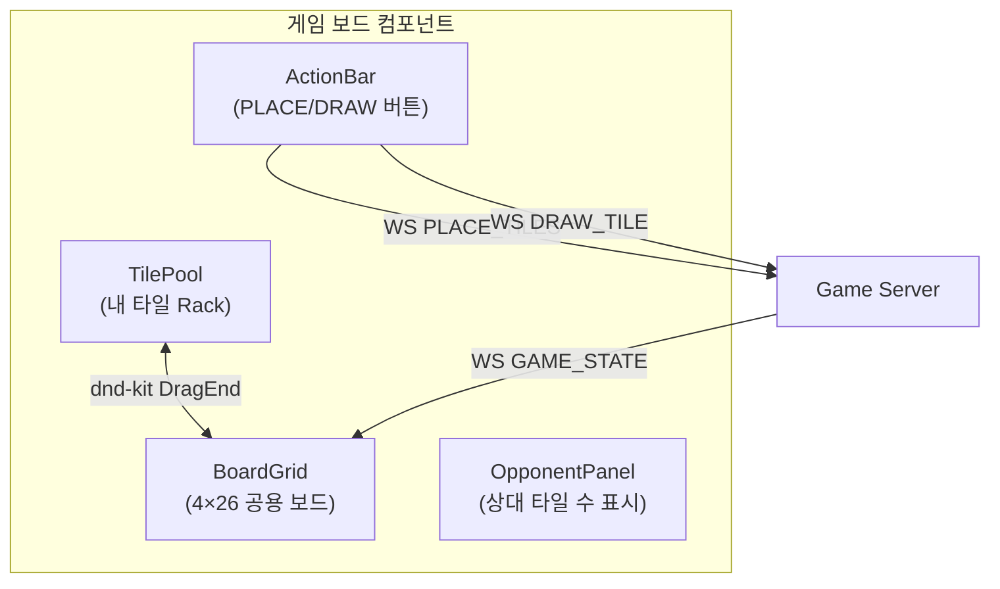
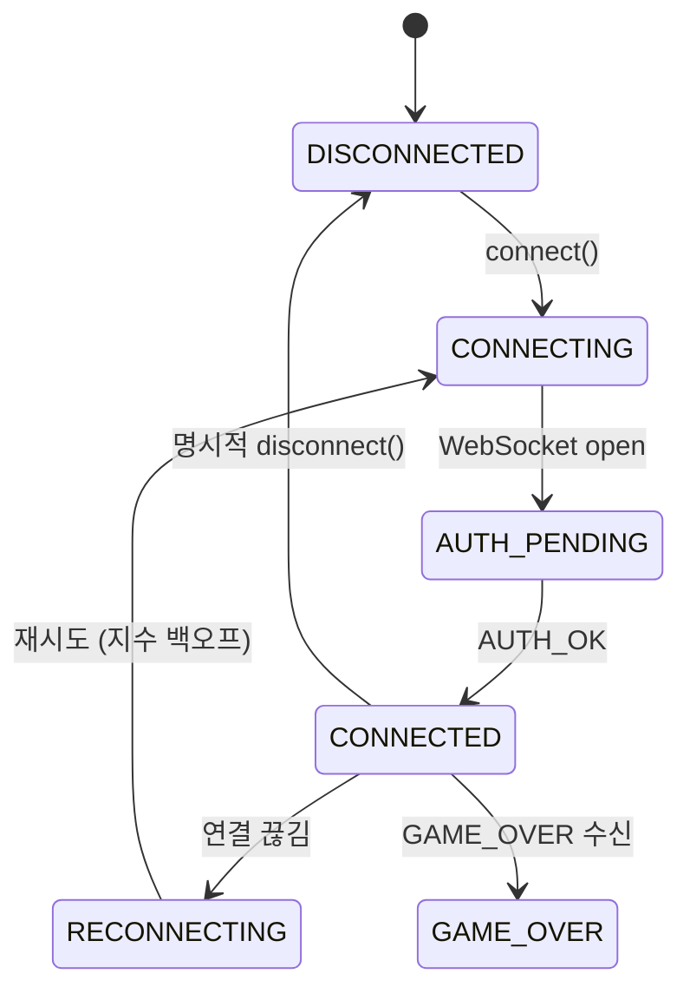
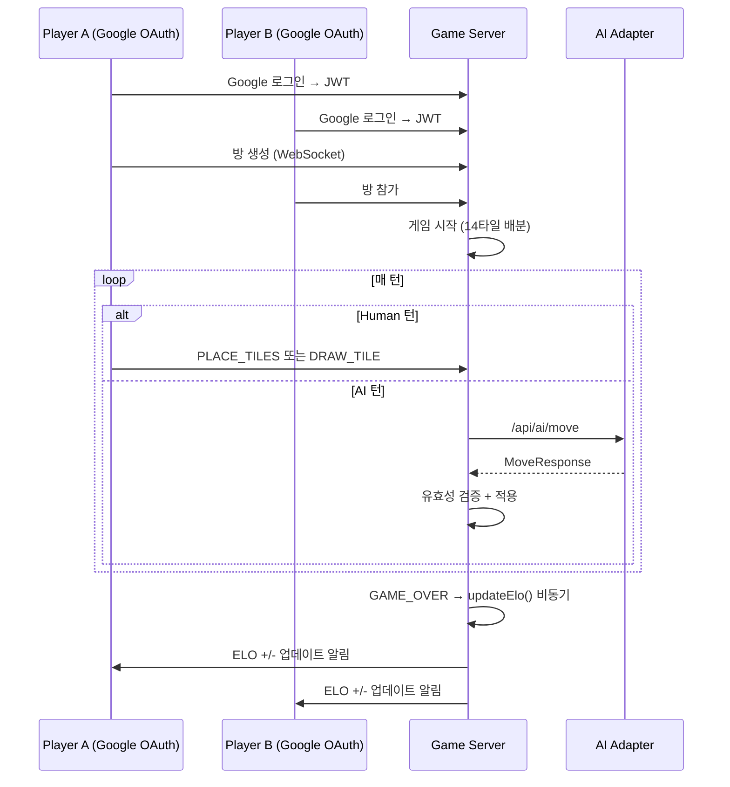

# Sprint 3 계획 (Sprint Plan)

- **Sprint**: Sprint 3
- **기간**: 2026-03-29 ~ 2026-04-11 (2주)
- **목표**: 프론트엔드 완성 + Google OAuth + 게임 UI 고도화
- **작성**: 2026-03-22
- **목표 Velocity**: 30 SP

---

## Sprint 3 배경

Sprint 2가 50 SP / 50 SP = 100% (+ 67% 초과) 달성으로 완료되었다.
ELO 랭킹 시스템(Phase 4)을 Sprint 2에서 선행 구현했으므로, Sprint 3은 **프론트엔드 완성** 과 **실제 사용자(Google OAuth) 연동**에 집중한다.

---

## Sprint 3 목표 이슈

| # | 이슈 | 서비스 | SP | 우선순위 | 설명 |
|---|------|--------|-----|----------|------|
| #28 | Google OAuth 실 연동 | game-server + frontend | 8 | ★★★ | 실제 구글 계정 로그인, JWT 발급, 세션 유지 |
| #29 | 게임 보드 UI 완성 | frontend | 8 | ★★★ | 멀티플레이 실전 UI, 타일 렌더링, 상태 동기화 |
| #30 | WebSocket 클라이언트 완성 | frontend | 8 | ★★★ | useGameSocket Hook, 재연결 로직, 이벤트 핸들러 |
| #31 | gemma3:4b 프롬프트 최적화 | ai-adapter | 6 | ★★ | JSON-only 강제, 응답 시간 목표 ~15s |

**총계: 30 SP**

---

## 이슈 상세

### [#28] Google OAuth 실 연동 (8 SP)

**현황**: `dev-login` 우회 구현으로 내부 테스트만 가능. 실제 구글 계정 로그인 미구현.

**구현 대상**:

| 파일 | 내용 |
|------|------|
| `game-server/internal/handler/auth_handler.go` | POST /api/auth/google 완성 |
| `game-server/internal/handler/auth_handler.go` | JWT 발급 (HMAC-SHA256, 24h) |
| `frontend/src/app/login/page.tsx` | Google 로그인 버튼 + OAuth 플로우 |
| `frontend/src/hooks/useAuth.ts` | 인증 상태 관리 Hook |
| `frontend/src/middleware.ts` | 미인증 리다이렉트 미들웨어 |

**K8s 시크릿 필요**:
- `GOOGLE_CLIENT_ID`, `GOOGLE_CLIENT_SECRET` → game-server-secret에 추가
- Helm `--set` 또는 external-secrets 방식 검토 (Sprint 2 Problem에서 도출)

**수용 조건**:
- 실제 Google 계정으로 로그인 후 JWT 발급 확인
- JWT로 WebSocket 연결 → AUTH_OK 수신
- 실제 사용자 UUID로 ELO 기록 생성 확인

---

### [#29] 게임 보드 UI 완성 (8 SP)

**현황**: 기본 타일 렌더링 구현. 멀티플레이 실전 시나리오 미검증.

**구현 대상**:

| 파일 | 내용 |
|------|------|
| `frontend/src/components/game/BoardGrid.tsx` | 4×26 보드 렌더링 완성 |
| `frontend/src/components/game/TilePool.tsx` | 내 타일 Rack (dnd-kit 소스) |
| `frontend/src/components/game/OpponentPanel.tsx` | 상대방 타일 수 + 턴 표시 |
| `frontend/src/components/game/ActionBar.tsx` | PLACE/DRAW 버튼 + 유효성 표시 |
| `frontend/src/app/game/[roomId]/page.tsx` | 게임 페이지 조합 |

**수용 조건**:
- Human 2명 실제 게임 완주 (GAME_OVER까지)
- 상대방 타일 수 실시간 업데이트
- PLACE_TILES 유효/무효 피드백 UI

---

### [#30] WebSocket 클라이언트 완성 (8 SP)

**현황**: 기본 연결 구현. 재연결 로직 및 이벤트 핸들러 미완성.

**구현 대상**:

| 파일 | 내용 |
|------|------|
| `frontend/src/hooks/useGameSocket.ts` | 메인 WebSocket Hook (상태 머신) |
| `frontend/src/hooks/useReconnect.ts` | 지수 백오프 재연결 로직 |
| `frontend/src/types/ws-messages.ts` | 서버↔클라이언트 메시지 타입 정의 |
| `frontend/src/lib/ws-client.ts` | WebSocket 클라이언트 래퍼 |

**수용 조건**:
- WebSocket 강제 종료 후 자동 재연결 (3초, 6초, 12초 백오프)
- PLAYER_RECONNECT 이벤트 수신 후 게임 상태 복원
- useGameSocket Hook으로 BoardGrid에 상태 주입

---

### [#31] gemma3:4b 프롬프트 최적화 (6 SP)

**현황**: gemma3:4b 응답 ~40s/call, JSON 출력 불안정 (Sprint 2 Problem).

**구현 대상**:

| 개선 항목 | 현재 | 목표 |
|-----------|------|------|
| 응답 시간 | ~40s | ~15s |
| JSON 형식 준수율 | ~70% | ~95% |
| 재시도 횟수 | 평균 2.3회 | ≤ 1.5회 |

**시도할 프롬프트 기법**:
1. **System Prompt JSON-only 강제**: `"Respond ONLY with a valid JSON object. No explanation, no markdown."`
2. **Few-Shot 예시 추가**: 입력→올바른 출력 2~3쌍 제시
3. **Temperature 조정**: 전략 캐릭터별 0.1~0.3 범위 (현재 0.3)
4. **Context 압축**: 보드 상태 직렬화 축소 (타일 목록 → 그룹 요약)

| 파일 | 내용 |
|------|------|
| `ai-adapter/src/prompt/prompt-builder.service.ts` | JSON-only 강제 + Few-Shot 추가 |
| `ai-adapter/src/ollama/ollama.service.ts` | 응답 파싱 강화 |
| `ai-adapter/src/prompt/templates/` | 캐릭터별 최적화 템플릿 |

**수용 조건**:
- E2E 10회 테스트에서 평균 응답 시간 ≤ 20s
- JSON 파싱 실패율 < 5% (현재 ~30%)

---

## Sprint 3 선결 조건 (Sprint 2 Problem → Try)

Sprint 2 회고에서 도출된 사전 수행 항목:

| # | 항목 | 담당 | 기한 |
|---|------|------|------|
| A | K8s Secret 자동 주입 검토 (Helm --set 방식) | DevOps | Sprint 3 시작 전 |
| B | AutoMigrate 개별 에러 처리 (`migrateEach()`) | Go Dev | Sprint 3 Week 1 |
| C | 실제 Google OAuth 사용자 ELO 테스트 | QA | #28 완료 후 |

---

## 검증 계획

### 게임 완주 시나리오 (E2E)

### 수용 기준 체크리스트

| # | 수용 조건 | 담당 |
|---|-----------|------|
| 1 | 실제 Google 계정으로 로그인 → JWT 발급 | #28 |
| 2 | Human vs Human 게임 완주 (WebSocket) | #29, #30 |
| 3 | WebSocket 재연결 자동 복구 | #30 |
| 4 | AI 턴 응답 ≤ 20s (gemma3:4b) | #31 |
| 5 | Google OAuth 사용자로 ELO 업데이트 | #28 + ELO |
| 6 | CI 13개 job ALL GREEN | DevOps |

---

## Sprint 3 리스크

| 리스크 | 확률 | 영향 | 완화 방안 |
|--------|------|------|-----------|
| Google OAuth 로컬 개발 복잡도 | 높음 | 중 | `dev-login` 유지, OAuth는 K8s 환경에서만 |
| gemma3:4b 응답 시간 미달 | 중간 | 중 | Few-shot 효과 미미 시 context 압축 우선 |
| WebSocket 재연결 Race Condition | 중간 | 높음 | 상태 머신 패턴으로 동시성 제어 |
| K8s Secret 주입 실패 | 낮음 | 높음 | Sprint 시작 전 Helm --set 테스트 완료 |

---

## 완료 선언 기준

Sprint 3 공식 완료 조건:
- [ ] 실제 Google 계정 로그인 동작 확인
- [ ] Human vs Human 게임 WebSocket으로 완주
- [ ] WebSocket 재연결 자동 복구 동작 확인
- [ ] AI 턴 평균 응답 ≤ 20s
- [ ] CI 13개 job ALL GREEN
