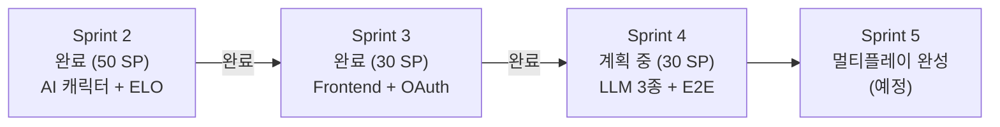
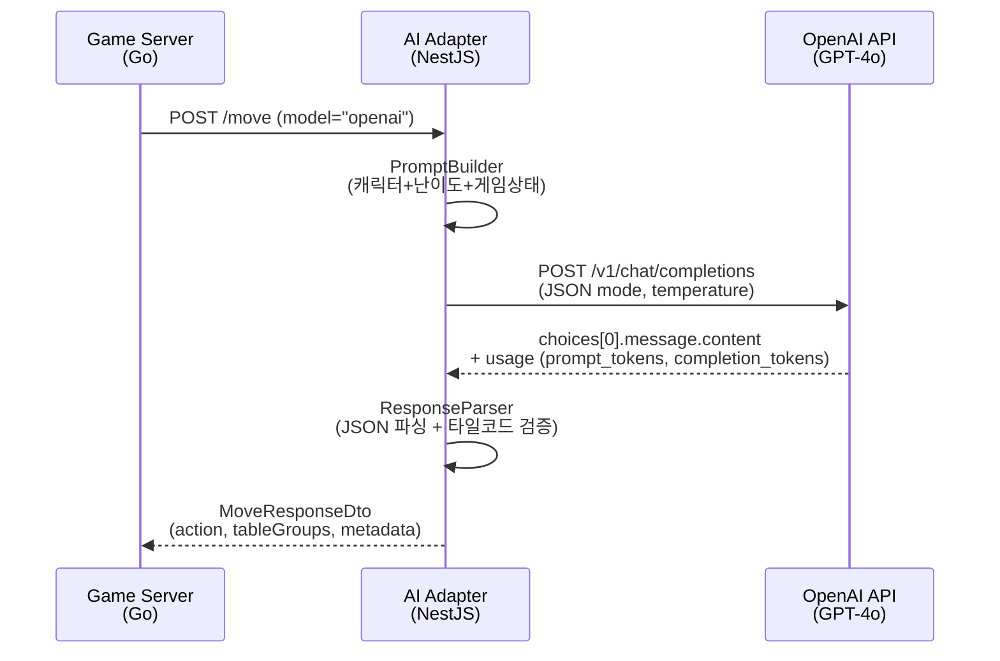
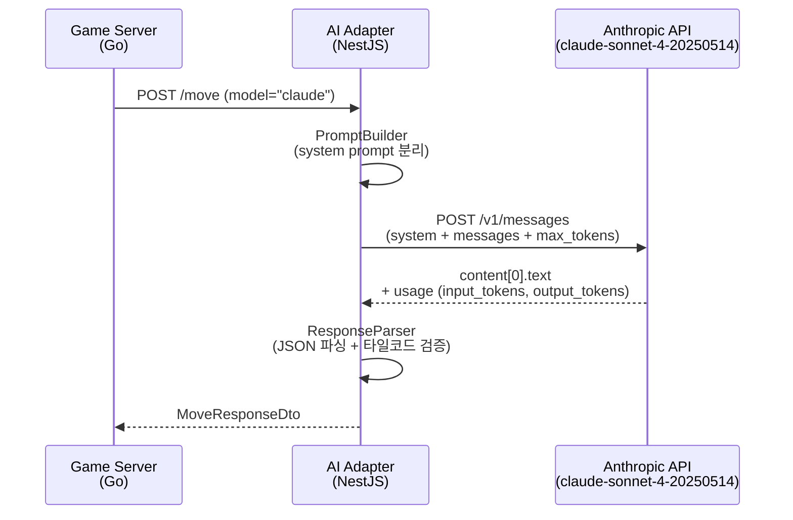
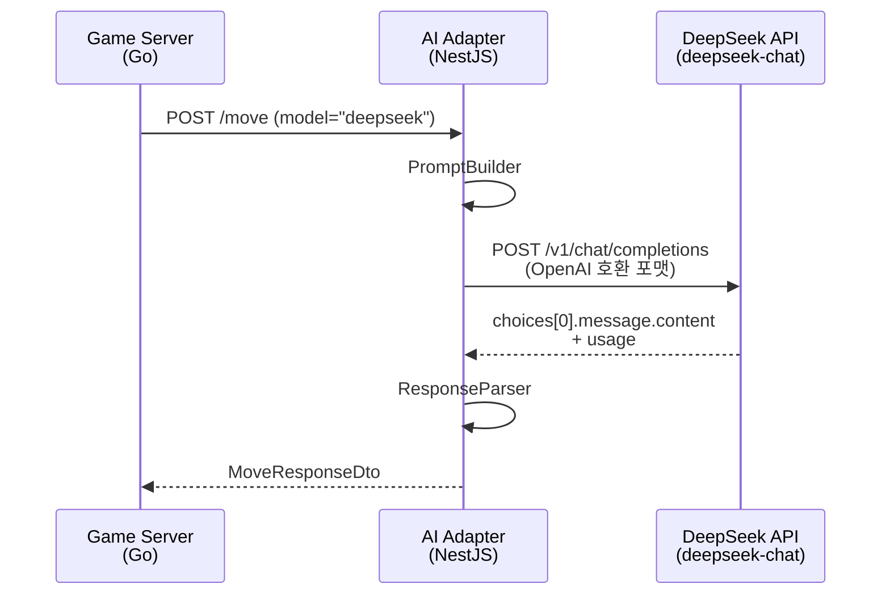
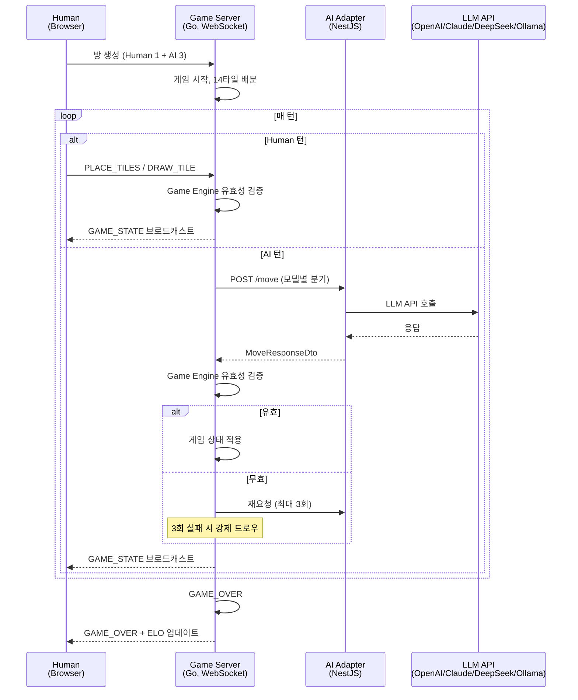
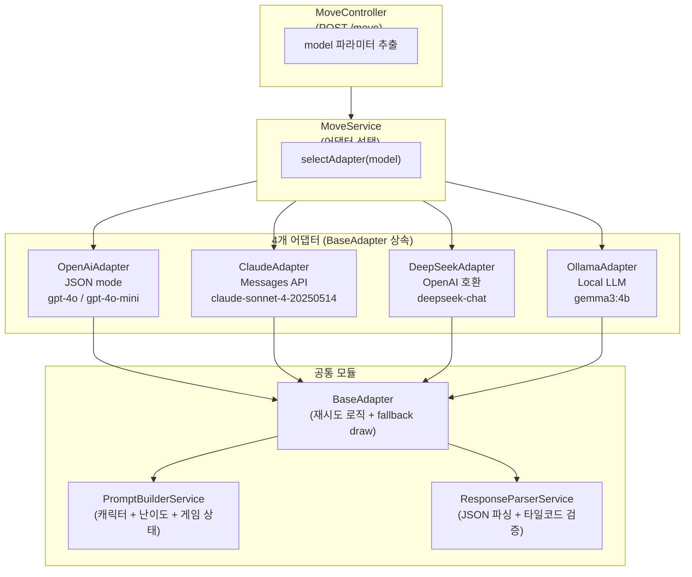
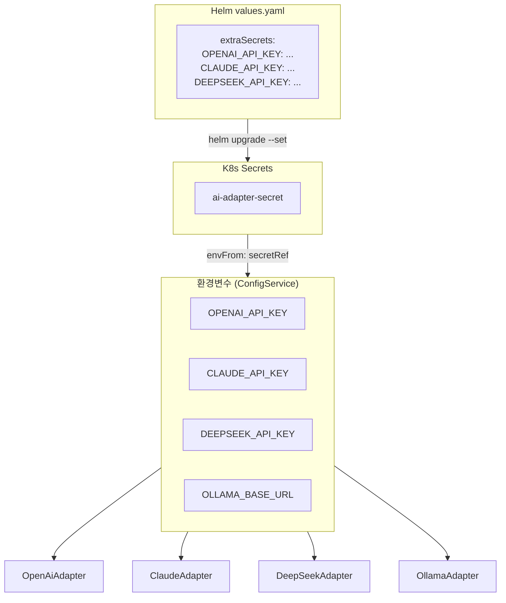
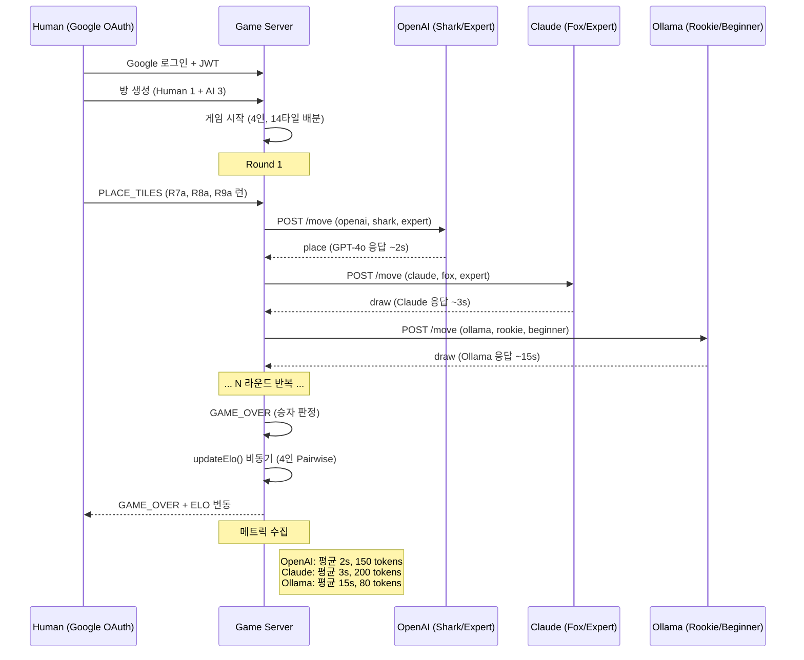
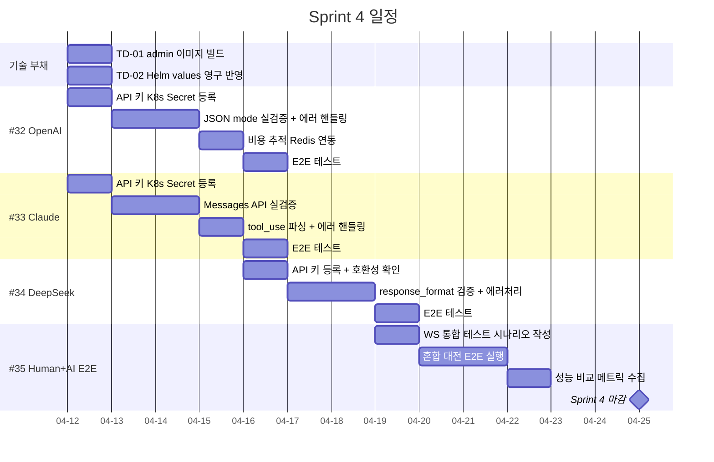

# Sprint 4 계획 (Sprint Plan)

- **Sprint**: Sprint 4
- **기간**: 2026-04-12 ~ 2026-04-25 (2주) -- 조기 착수 시 2026-03-29~
- **목표**: 외부 LLM 3종 실 연동 + Human+AI 혼합 멀티플레이 E2E 검증
- **작성**: 2026-03-23
- **목표 Velocity**: 30 SP

---

## Sprint 4 배경

Sprint 3이 2026-03-23에 완료되어 원래 시작 예정일(03-29)보다 6일 조기 달성되었다. Sprint 0~3을 통해 게임 엔진, WebSocket 통신, 프론트엔드 UI, Google OAuth, ELO 랭킹, Ollama(gemma3:4b) AI 어댑터가 모두 동작하는 상태이다.

Sprint 4에서는 **외부 LLM API 3종(OpenAI GPT-4o, Claude claude-sonnet-4-20250514, DeepSeek deepseek-chat)을 실제 연동**하고, Human+AI 혼합 멀티플레이 E2E 테스트로 플랫폼의 핵심 가치인 "다양한 LLM 전략 비교"를 처음으로 실현한다.



### 어댑터 코드 현황

Sprint 1에서 4개 어댑터 파일과 테스트가 스캐폴딩되어 있다. 그러나 **외부 API 키 없이 mock 테스트만 존재**하며, 실제 API 호출 검증과 프로덕션 수준의 에러 핸들링은 Sprint 4 범위이다.

| 어댑터 | 파일 | 현재 상태 | Sprint 4 목표 |
|--------|------|-----------|---------------|
| OpenAI | `openai.adapter.ts` | 구현체 존재, mock 테스트 14개 | API 키 연동, JSON mode 실검증, 비용 추적 |
| Claude | `claude.adapter.ts` | 구현체 존재, mock 테스트 존재 | Messages API 실검증, tool_use 응답 파싱 고도화 |
| DeepSeek | `deepseek.adapter.ts` | 구현체 존재, mock 테스트 존재 | API 실검증, response_format 호환성 확인 |
| Ollama | `ollama.adapter.ts` | 실동작 완료 (gemma3:1b, K8s Pod) | Sprint 3 완료 + ISS-003 FIXED (2026-03-23) |

### 공통 인터페이스 (이미 확정)

```typescript
// src/ai-adapter/src/common/interfaces/ai-adapter.interface.ts
interface AIAdapter {
  generateMove(request: MoveRequestDto): Promise<MoveResponseDto>;
  getModelInfo(): ModelInfo;
  healthCheck(): Promise<boolean>;
}
```

BaseAdapter 추상 클래스가 재시도 로직(maxRetries), fallback 드로우, 난이도별 temperature를 공통 처리한다. 각 어댑터는 `callLlm()` 메서드만 구현하면 되는 구조가 Sprint 2에서 확립되었다.

---

## Sprint 4 목표 이슈

| # | 이슈 | 서비스 | SP | 우선순위 | 설명 |
|---|------|--------|-----|----------|------|
| #32 | OpenAI GPT-4o Adapter 실 연동 | ai-adapter | 8 | P0 | API 키 연동, JSON mode 실검증, 비용 추적 Redis 연동 |
| #33 | Claude API Adapter 실 연동 | ai-adapter | 8 | P0 | Messages API 실검증, system prompt 분리, tool_use 파싱 |
| #34 | DeepSeek Adapter 실 연동 | ai-adapter | 6 | P1 | OpenAI 호환 API 실검증, response_format 지원 확인 |
| #35 | Human+AI 혼합 E2E | game-server + frontend | 8 | P0 | 2~4인 혼합 대전, WS 통합 테스트, 모델별 성능 비교 |

**총계: 30 SP**

---

## 이슈 상세

### [#32] OpenAI GPT-4o Adapter 실 연동 (8 SP)

**현황**: `openai.adapter.ts` 구현체와 14개 mock 테스트가 존재한다. API 키 없이 axios mock으로만 검증된 상태.

**구현 대상**:



| 작업 | 내용 |
|------|------|
| API 키 K8s Secret 등록 | `ai-adapter-secret`에 `OPENAI_API_KEY` 추가 |
| JSON mode 실검증 | `response_format: { type: 'json_object' }` 실제 응답 파싱 |
| 모델 분기 | expert: gpt-4o / beginner+intermediate: gpt-4o-mini |
| 비용 추적 | Redis `quota:daily:{date}` Hash에 openai:calls, openai:cost 기록 |
| E2E 테스트 추가 | 실제 API 호출 테스트 (CI에서는 skip, 로컬 수동 실행) |
| 에러 핸들링 강화 | Rate Limit (429), Quota Exceeded, Context Length 초과 처리 |

**수용 조건**:
- 실제 OpenAI API로 게임 1판 (10턴 이상) AI 플레이 완주
- JSON mode 파싱 성공률 >= 95%
- 비용 추적 Redis에 호출 수/비용 기록 확인
- Rate Limit 429 수신 시 지수 백오프 재시도 동작
- CI mock 테스트 + 로컬 E2E 테스트 전량 PASS

---

### [#33] Claude API Adapter 실 연동 (8 SP)

**현황**: `claude.adapter.ts` 구현체 존재. Anthropic Messages API 사용, `x-api-key` 헤더, `anthropic-version` 헤더 설정 완료.

**구현 대상**:



| 작업 | 내용 |
|------|------|
| API 키 K8s Secret 등록 | `ai-adapter-secret`에 `CLAUDE_API_KEY` 추가 |
| system prompt 분리 검증 | Anthropic API `system` 필드 vs `messages[0].role=system` 차이 확인 |
| tool_use 응답 파싱 | Claude tool_use 블록 반환 시 JSON 추출 로직 |
| 컨텍스트 활용 | expert 난이도에서 게임 히스토리(최근 5턴) 포함 |
| 비용 추적 | Redis `quota:daily:{date}` Hash에 claude:calls, claude:cost 기록 |
| 에러 핸들링 | Overloaded (529), Rate Limit, Invalid API Key 처리 |

**수용 조건**:
- 실제 Claude API로 게임 1판 (10턴 이상) AI 플레이 완주
- system prompt가 `system` 필드로 정확히 전달되는지 확인
- input_tokens/output_tokens 메타데이터 정확 기록
- CI mock 테스트 + 로컬 E2E 테스트 전량 PASS

---

### [#34] DeepSeek Adapter 실 연동 (6 SP)

**현황**: `deepseek.adapter.ts` 구현체 존재. OpenAI 호환 API 사용으로 `openai.adapter.ts`와 구조 유사.

**구현 대상**:



| 작업 | 내용 |
|------|------|
| API 키 K8s Secret 등록 | `ai-adapter-secret`에 `DEEPSEEK_API_KEY` 추가 |
| response_format 호환성 | DeepSeek `json_object` 지원 여부 확인, 미지원 시 프롬프트 JSON 강제 |
| 비용 추적 | Redis `quota:daily:{date}` Hash에 deepseek:calls, deepseek:cost 기록 |
| 비용 효율 비교 | OpenAI/Claude 대비 토큰당 비용 메트릭 수집 |
| 에러 핸들링 | API 특이 에러 코드 매핑 |

**수용 조건**:
- 실제 DeepSeek API로 게임 1판 (10턴 이상) AI 플레이 완주
- JSON 파싱 성공률 >= 90% (OpenAI 호환 API 불안정 가능성 반영)
- 비용 추적 Redis 기록 확인
- CI mock 테스트 + 로컬 E2E 테스트 전량 PASS

---

### [#35] Human+AI 혼합 E2E (8 SP)

**현황**: Sprint 3에서 Human vs Human WebSocket 게임 완주 확인. AI 턴 오케스트레이터(goroutine)는 Sprint 2에서 구현 완료. 그러나 **Human+AI 혼합 실 대전 E2E**는 미검증.

**구현 대상**:



| 작업 | 내용 |
|------|------|
| 혼합 대전 시나리오 | Human 1 + AI_OPENAI(Shark) + AI_CLAUDE(Fox) + AI_OLLAMA(Rookie) |
| 모델별 성능 비교 | 응답 시간, 토큰 사용량, 유효 수 비율, 승률 기록 |
| WS 통합 테스트 | `scripts/` 아래 E2E 테스트 스크립트 작성 |
| 프론트엔드 AI 턴 표시 | AI 사고 중 스피너 + 캐릭터 이름/모델 표시 |
| 게임 종료 결과 화면 | 모델별 성능 요약 (평균 응답 시간, 총 토큰 등) |
| ELO 반영 확인 | 게임 종료 후 4인 ELO 업데이트 정확성 검증 |

**수용 조건**:
- Human 1 + AI 3 혼합 게임 GAME_OVER까지 완주
- 4개 LLM 모델 모두 최소 1판 이상 참여
- 모델별 성능 비교 메트릭 수집 완료
- 프론트엔드에서 AI 턴 진행 시 모델명 표시
- 게임 종료 후 4인 ELO 업데이트 확인
- CI 13개 job ALL GREEN

---

## 기술 부채 처리 계획

Sprint 3에서 식별된 기술 부채를 Sprint 4 시작 전(또는 Week 1)에 처리한다.

| # | 부채 항목 | 심각도 | 처리 시점 | 내용 |
|---|-----------|--------|-----------|------|
| TD-01 | admin pod ErrImageNeverPull | 높음 | Sprint 4 시작 전 | `rummiarena/admin:dev` Docker 이미지 빌드 + K8s 배포 |
| TD-02 | Helm values.yaml 미반영 | 중간 | Sprint 4 시작 전 | `NEXT_PUBLIC_WS_URL: ws://localhost:30080` 영구 반영 |
| TD-03 | WebSocket 통합 테스트 부재 | 높음 | #35 병행 | REST API만 검증됨, WS 실시간 흐름 E2E 시나리오 필요 |

---

## AI Adapter 공통 아키텍처



### API 키 관리 전략



**보안 원칙**:
- API 키는 절대 소스 코드/Helm values에 평문으로 커밋하지 않는다
- `helm upgrade --set` 또는 `kubectl create secret`으로 런타임 주입
- Phase 8에서 Sealed Secrets 전환 예정

### 비용 추적 Redis 구조

```
Redis Key: quota:daily:{YYYY-MM-DD}
Type: Hash
TTL: 172800 (48시간)
Fields:
  totalCalls: 150
  totalCost: 2.45
  openai:calls: 50
  openai:cost: 1.80
  claude:calls: 40
  claude:cost: 0.55
  deepseek:calls: 30
  deepseek:cost: 0.05
  ollama:calls: 30
  ollama:cost: 0.00
```

비용 계산 기준 (2026-03 기준 추정):

| 모델 | Input ($/1M tokens) | Output ($/1M tokens) | 비고 |
|------|---------------------|----------------------|------|
| gpt-4o | $2.50 | $10.00 | JSON mode 포함 |
| gpt-4o-mini | $0.15 | $0.60 | beginner/intermediate용 |
| claude-sonnet-4-20250514 | $3.00 | $15.00 | Messages API |
| deepseek-chat | $0.14 | $0.28 | OpenAI 호환 |
| gemma3:1b (Ollama) | $0.00 | $0.00 | K8s Pod 로컬 실행 (4b→1b 교체 2026-03-23) |

---

## 선결 조건

| # | 항목 | 담당 | 기한 | 비고 |
|---|------|------|------|------|
| A | OpenAI API 키 발급 | 애벌레 | Sprint 4 시작 전 | platform.openai.com 결제 설정 |
| B | Anthropic API 키 발급 | 애벌레 | Sprint 4 시작 전 | console.anthropic.com 결제 설정 |
| C | DeepSeek API 키 발급 | 애벌레 | Sprint 4 시작 전 | platform.deepseek.com 결제 설정 |
| D | K8s ai-adapter-secret 업데이트 | DevOps | Week 1 | 3개 API 키 Secret 주입 |
| E | TD-01~02 기술 부채 처리 | DevOps | Sprint 4 시작 전 | admin 이미지, Helm 영구 반영 |

---

## 검증 계획

### 어댑터별 단위 검증

각 어댑터에 대해 아래 시나리오를 테스트한다.

| 시나리오 | 기대 결과 |
|----------|-----------|
| 정상 draw 응답 | action=draw, isFallbackDraw=false |
| 정상 place 응답 | action=place, tableGroups/tilesFromRack 포함 |
| JSON 파싱 실패 | 재시도 후 최종 fallback draw |
| API 타임아웃 | 재시도 후 최종 fallback draw |
| Rate Limit (429/529) | 지수 백오프 재시도 |
| API 키 무효 | 즉시 에러 (재시도 불필요) |
| healthCheck 정상 | true 반환 |
| healthCheck 실패 | false 반환 |

### 혼합 대전 E2E 시나리오



### 수용 기준 체크리스트

| # | 수용 조건 | 담당 |
|---|-----------|------|
| 1 | OpenAI GPT-4o 실 API로 10턴 이상 AI 플레이 완주 | #32 |
| 2 | Claude claude-sonnet-4-20250514 실 API로 10턴 이상 AI 플레이 완주 | #33 |
| 3 | DeepSeek deepseek-chat 실 API로 10턴 이상 AI 플레이 완주 | #34 |
| 4 | Human 1 + AI 3 혼합 게임 GAME_OVER 완주 | #35 |
| 5 | 모델별 성능 비교 메트릭 (응답 시간, 토큰, 유효 수 비율) 수집 | #35 |
| 6 | 비용 추적 Redis 기록 정상 동작 | #32, #33, #34 |
| 7 | 4인 ELO 업데이트 정확성 확인 | #35 |
| 8 | CI 13개 job ALL GREEN | DevOps |
| 9 | 기술 부채 TD-01~02 해소 | DevOps |

---

## Sprint 4 리스크

| ID | 리스크 | 확률 | 영향 | 완화 방안 |
|----|--------|------|------|-----------|
| R4-01 | 외부 API 비용 폭증 | 중간 | 높음 | Redis quota 비용 추적, 일일 $10 한도, E2E 테스트 횟수 제한 (5판 이내) |
| R4-02 | API 키 발급 지연 (결제 설정) | 낮음 | 높음 | Sprint 시작 전 3개 API 키 사전 발급, DeepSeek 무료 크레딧 활용 |
| R4-03 | Claude tool_use 응답 파싱 복잡도 | 중간 | 중간 | tool_use 대신 plain text JSON 우선, tool_use는 Phase 5+ |
| R4-04 | DeepSeek response_format 미지원 | 중간 | 낮음 | JSON-only 프롬프트 강제 (Ollama와 동일 전략), 파싱 재시도 |
| R4-05 | 16GB RAM 제약 (4개 LLM 동시 호출) | 높음 | 중간 | 외부 API 3종은 네트워크 호출이므로 로컬 메모리 미소비. Ollama만 로컬 RAM 사용. 교대 실행 불필요. |
| R4-06 | 혼합 대전 시 AI 턴 대기 시간 누적 | 중간 | 중간 | AI 3인 순차 호출 시 최대 ~20s 대기 가능. 프론트엔드 AI 사고 중 스피너로 UX 보완. |
| R4-07 | Rate Limit 도달 (GPT-4o Tier 1) | 중간 | 중간 | 재시도 지수 백오프, Tier 1 RPM 한도 확인 후 테스트 간격 조정 |

---

## 일정 계획



### 조기 착수 옵션

Sprint 3이 03-23에 완료되어 03-29~04-11 공백 기간이 발생한다. 두 가지 옵션을 검토한다.

| 옵션 | 장점 | 단점 |
|------|------|------|
| **A. 03-29 조기 착수** | 전체 일정 2주 단축, 버퍼 확보 | API 키 사전 발급 필요 |
| **B. 04-12 정시 착수** | 충분한 준비, 기술 부채 여유 처리 | 공백 기간 비효율 |

**권장: 옵션 A (03-29 조기 착수)**
- 기술 부채(TD-01~02)를 03-24~28에 처리
- API 키 3개를 03-29 전에 발급
- Sprint 4를 03-29~04-11로 실행하여 원래 로드맵과 정렬

---

## 완료 선언 기준 (Definition of Done)

Sprint 4 공식 완료 조건:

- [ ] OpenAI GPT-4o 실 API 게임 완주 확인
- [ ] Claude claude-sonnet-4-20250514 실 API 게임 완주 확인
- [ ] DeepSeek deepseek-chat 실 API 게임 완주 확인
- [ ] Human 1 + AI 3 혼합 게임 GAME_OVER 완주
- [ ] 모델별 성능 비교 메트릭 수집 (응답 시간, 토큰, 유효 수 비율)
- [ ] 비용 추적 Redis 정상 동작
- [ ] 기술 부채 TD-01~02 해소
- [ ] CI 13개 job ALL GREEN

---

## 참고 문서

| 문서 | 경로 | 용도 |
|------|------|------|
| AI Adapter 설계 | `docs/02-design/04-ai-adapter-design.md` | 어댑터 구조, 인터페이스, 비용 제어 |
| AI Move API 계약서 | `docs/02-design/11-ai-move-api-contract.md` | game-server <-> ai-adapter HTTP 인터페이스 |
| WebSocket 프로토콜 | `docs/02-design/10-websocket-protocol.md` | 클라이언트-서버 WS 메시지 규격 |
| Sprint 3 계획서 | `docs/01-planning/11-sprint3-plan.md` | 이전 Sprint 형식 참고 |
| 전체 로드맵 | `docs/01-planning/09-roadmap-and-backlog.md` | Sprint 4 위치 확인 |
| 리스크 관리 | `docs/01-planning/03-risk-management.md` | CR-01 (비용 폭증), TR-01 (응답 지연) |
