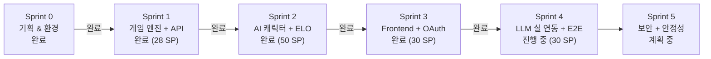
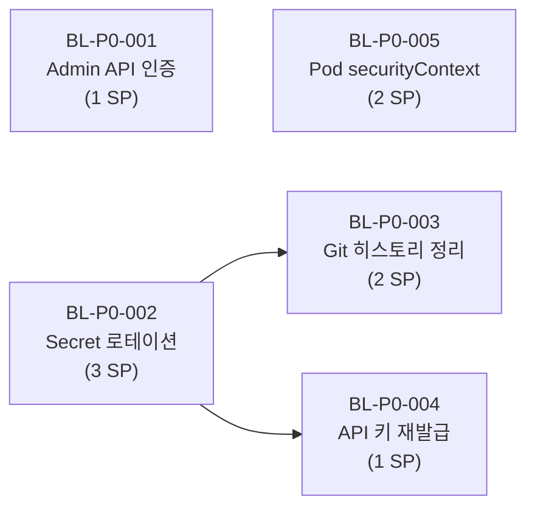
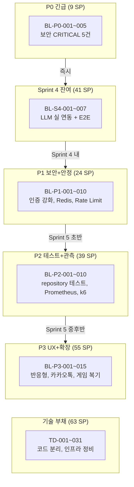

# 프로젝트 백로그 (2026-03-30 All-Hands 리뷰 기반)

> **작성일**: 2026-03-30
> **기반**: `docs/04-testing/19-all-hands-project-review-2026-03-30.md` (10개 에이전트 종합 리뷰)
> **기준 커밋**: `d1d6c96` (main, 2026-03-29 데일리 마감)
> **작성자**: PM (애벌레)

---

## 현재 위치 요약

| 항목 | 수치 |
|------|------|
| 전체 등급 | **B+** (핵심 기능 완료, 보안/운영 기반 보강 필요) |
| CRITICAL 이슈 | **8건** (보안 5, 인프라 2, QA 1) |
| WARN 이슈 | **55건** (보안 11, 아키텍처 7, 코드 20, 인프라 8, QA 6, PM 7, UX 7) |
| OK 항목 | **53건** (설계 5, 코드 6, 프론트엔드 4, 테스트 4, 인프라 3) |
| WBS 대비 선행 | **약 7주** (안전 마진 충분) |

---

## 1. Sprint 4 잔여 백로그

Sprint 4의 핵심 목표(LLM 3종 실 연동 + Human+AI 혼합 E2E)는 미완료 상태.

| ID | 제목 | 우선순위 | 담당 | SP | 선행 조건 | 상태 |
|----|------|----------|------|----|-----------|------|
| BL-S4-001 | OpenAI GPT-4o Adapter 실 API 검증 (10턴+ 완주) | P0 | Go Dev / Node Dev | 8 | API 키 K8s Secret 등록 (#32) | 미완료 |
| BL-S4-002 | Claude API Adapter 실 API 검증 (10턴+ 완주) | P0 | Node Dev | 8 | API 키 K8s Secret 등록 (#33) | 미완료 |
| BL-S4-003 | DeepSeek Adapter 실 API 검증 (10턴+ 완주) | P1 | Node Dev | 6 | API 키 K8s Secret 등록 (#34) | 미완료 |
| BL-S4-004 | Human 1 + AI 3 혼합 게임 GAME_OVER 완주 E2E | P0 | Go Dev / Frontend | 8 | BL-S4-001~003 | 미완료 |
| BL-S4-005 | 비용 추적 Redis 연동 (quota:daily Hash) | P1 | Node Dev | 3 | BL-S4-001 | 미완료 |
| BL-S4-006 | 모델별 성능 비교 메트릭 수집 (응답 시간, 토큰, 유효 수 비율) | P1 | Node Dev / QA | 3 | BL-S4-004 | 미완료 |
| BL-S4-007 | AI 호출 로그/메트릭 수집 구현 (admin /stats/ai 실 데이터화) | P1 | Node Dev / Go Dev | 5 | BL-S4-001 | 미완료 |

**소계**: 41 SP (Sprint 4 원 계획 30 SP + 추가 식별 11 SP)

---

## 2. P0 긴급 백로그 (보안 CRITICAL -- 즉시 조치)

All-Hands 리뷰에서 발견된 CRITICAL 8건 중 보안 관련 5건은 즉시 조치 필요.

| ID | 제목 | 리뷰 ID | 우선순위 | 담당 | SP | 선행 조건 | 상태 |
|----|------|---------|----------|------|----|-----------|------|
| BL-P0-001 | Admin API JWTAuth + RequireRole("admin") 적용 | SEC-001 | **P0** | Go Dev | 1 | 없음 (미들웨어 이미 구현) | 미착수 |
| BL-P0-002 | inject-secrets.sh 시크릿 로테이션 + 환경변수 참조 변경 | SEC-002 | **P0** | DevOps | 3 | 없음 | 미착수 |
| BL-P0-003 | Git 히스토리 시크릿 정리 (bfg/filter-branch) | SEC-002 | **P0** | DevOps | 2 | BL-P0-002 | 미착수 |
| BL-P0-004 | OpenAI/Claude/DeepSeek API 키 로테이션 | SEC-005 | **P0** | 애벌레 | 1 | BL-P0-002 | 미착수 |
| BL-P0-005 | K8s Pod securityContext 추가 (4개 Deployment) | SEC-003 | **P0** | DevOps | 2 | 없음 | 미착수 |

**소계**: 9 SP

### P0 의존성 그래프

- BL-P0-001, BL-P0-005는 독립 실행 가능
- BL-P0-003, BL-P0-004는 BL-P0-002 완료 후 실행

---

## 3. P1 Sprint 5 백로그 (보안 + 안정성)

Sprint 5 초반에 집중 처리. CRITICAL 잔여 3건 + WARN 보안/안정성 7건.

| ID | 제목 | 리뷰 ID | 우선순위 | 담당 | SP | 선행 조건 | 상태 |
|----|------|---------|----------|------|----|-----------|------|
| BL-P1-001 | Google id_token JWKS 서명 검증 | SEC-004 | P1 | Go Dev | 5 | 없음 | 미착수 |
| BL-P1-002 | Redis PVC 추가 (appendonly yes + 영속성 확보) | INFRA-001 | P1 | DevOps | 3 | 없음 | 미착수 |
| BL-P1-003 | 심리전 프롬프트 버그 수정 (psychWarfarePrompt 합산 누락) | W-CODE-01 | P1 | Node Dev | 1 | 없음 | 미착수 |
| BL-P1-004 | AI_ADAPTER_INTERNAL_TOKEN 프로덕션 필수화 + 경고 로깅 | W-SEC-03 | P1 | Node Dev | 2 | 없음 | 미착수 |
| BL-P1-005 | ai-adapter NodePort -> ClusterIP 변경 | W-SEC-04 | P1 | DevOps | 1 | 없음 | 미착수 |
| BL-P1-006 | N+1 쿼리 2건 GROUP BY 변환 (ListRecentGames, ListUsers) | W-CODE-02 | P1 | Go Dev | 2 | 없음 | 미착수 |
| BL-P1-007 | dev-login NODE_ENV=production 조건 제외 (Frontend + Backend) | W-SEC-10 | P1 | Frontend Dev | 1 | 없음 | 미착수 |
| BL-P1-008 | JWT iss/aud 클레임 설정 | W-SEC-01 | P1 | Go Dev | 2 | 없음 | 미착수 |
| BL-P1-009 | REST API seat 파라미터 IDOR 방어 | W-SEC-02 | P1 | Go Dev | 2 | 없음 | 미착수 |
| BL-P1-010 | Rate Limiting 구현 (REST + WS) | W-SEC-06 | P1 | Go Dev | 5 | 없음 | 미착수 |

**소계**: 24 SP

---

## 4. P2 Sprint 5 백로그 (테스트 + 관측성)

Sprint 5 중반~후반. 테스트 피라미드 보강 + 모니터링 인프라 구축.

| ID | 제목 | 리뷰 ID | 우선순위 | 담당 | SP | 선행 조건 | 상태 |
|----|------|---------|----------|------|----|-----------|------|
| BL-P2-001 | repository 패키지 단위 테스트 도입 (인터페이스 모킹) | QA-001 | P2 | Go Dev | 8 | 없음 | 미착수 |
| BL-P2-002 | kube-prometheus-stack 경량 설치 (~300MB) | INFRA-002 | P2 | DevOps | 5 | 없음 | 미착수 |
| BL-P2-003 | handler/service 단위 테스트 보강 | W-QA-02 | P2 | Go Dev | 5 | 없음 | 미착수 |
| BL-P2-004 | k6 부하 테스트 스크립트 작성 (WS + REST) | W-QA-01 | P2 | QA | 5 | BL-P2-002 | 미착수 |
| BL-P2-005 | Frontend 단위 테스트 도입 (jest + RTL) | W-QA-03 | P2 | Frontend Dev | 5 | 없음 | 미착수 |
| BL-P2-006 | CI integration 테스트 단계 추가 (.gitlab-ci.yml) | W-QA-04 | P2 | DevOps | 3 | BL-P2-001 | 미착수 |
| BL-P2-007 | Ollama num_predict 512 상향 + stop 토큰 정리 | W-CODE-10 | P2 | Node Dev | 1 | 없음 | 미착수 |
| BL-P2-008 | 재시도 지수 백오프 추가 (429 Rate Limit 대응) | W-CODE-11 | P2 | Node Dev | 2 | 없음 | 미착수 |
| BL-P2-009 | Grafana 커스텀 대시보드 (AI 메트릭, 게임 통계) | - | P2 | DevOps | 3 | BL-P2-002 | 미착수 |
| BL-P2-010 | Playwright waitForTimeout 하드코딩 제거 (flaky 방지) | W-QA-05 | P2 | QA | 2 | 없음 | 미착수 |

**소계**: 39 SP

---

## 5. P3 Sprint 5~6 백로그 (UX + 확장성)

Sprint 5 후반 또는 Sprint 6에서 처리. 일정 여유에 따라 조절.

| ID | 제목 | 리뷰 ID | 우선순위 | 담당 | SP | 선행 조건 | 상태 |
|----|------|---------|----------|------|----|-----------|------|
| BL-P3-001 | 키보드 DnD (KeyboardSensor) 추가 | W-UX-01 | P3 | Frontend Dev | 3 | 없음 | 미착수 |
| BL-P3-002 | 게임 화면 최소 반응형 (768px 브레이크포인트) | W-UX-02 | P3 | Frontend Dev | 5 | 없음 | 미착수 |
| BL-P3-003 | 방 상태 Redis 이관 (MemoryRoomRepository -> Redis) | W-ARC-01 | P3 | Go Dev | 8 | BL-P1-002 | 미착수 |
| BL-P3-004 | WS PING heartbeat 추가 (클라이언트) | W-CODE-15 | P3 | Frontend Dev | 2 | 없음 | 미착수 |
| BL-P3-005 | error.tsx 에러 바운더리 추가 | W-UX-04 | P3 | Frontend Dev | 2 | 없음 | 미착수 |
| BL-P3-006 | middleware.ts Edge 라우트 보호 추가 | W-CODE-18 | P3 | Frontend Dev | 3 | 없음 | 미착수 |
| BL-P3-007 | CSP 헤더 적용 (next.config.ts) | W-SEC-05 | P3 | Frontend Dev | 2 | 없음 | 미착수 |
| BL-P3-008 | prefers-reduced-motion 적용 | W-UX-03 | P3 | Frontend Dev | 1 | 없음 | 미착수 |
| BL-P3-009 | GitHub Issues #32~#35 등록 | W-PM-01 | P3 | PM | 1 | 없음 | 미착수 |
| BL-P3-010 | 문서 번호 충돌 3건 정리 (04-testing/ 07, 13, 17번) | W-PM-04 | P3 | PM | 1 | 없음 | 미착수 |
| BL-P3-011 | LobbyClient ELO/승률 실 데이터 연동 (하드코딩 제거) | W-CODE-17 | P3 | Frontend Dev | 2 | 없음 | 미착수 |
| BL-P3-012 | 카카오톡 알림 연동 (빌드/배포/게임 결과) | Phase 4 | P3 | Go Dev | 8 | 카카오 API 키 발급 | 미착수 |
| BL-P3-013 | 게임 복기 (4분할 뷰, 턴별 리플레이) | Phase 4 | P3 | Frontend Dev / Go Dev | 13 | W-ARC-02 스냅샷 영속화 | 미착수 |
| BL-P3-014 | 스켈레톤 UI 도입 (방 목록, 랭킹 로딩 화면) | W-UX-05 | P3 | Frontend Dev | 2 | 없음 | 미착수 |
| BL-P3-015 | 명암비 WCAG AA 점검 및 수정 | W-UX-06 | P3 | Designer | 2 | 없음 | 미착수 |

**소계**: 55 SP

---

## 6. 기술 부채 백로그 (누적)

Sprint 전반에 걸쳐 점진적으로 해소. 신규 기능 개발 사이에 삽입.

| ID | 제목 | 리뷰 ID | 심각도 | 담당 | SP | 상태 |
|----|------|---------|--------|------|----|------|
| TD-001 | ws_handler.go 1,530줄 분리 (책임 과다) | W-ARC-07 | 높음 | Go Dev | 5 | 미착수 |
| TD-002 | GameClient.tsx 737줄 분리 | W-CODE-14 | 높음 | Frontend Dev | 5 | 미착수 |
| TD-003 | shouldCreateNewGroup 로직 중복 제거 (GameClient + PracticeBoard) | W-CODE-19 | 중간 | Frontend Dev | 2 | 미착수 |
| TD-004 | GORM 로그 레벨 환경별 분리 (dev: Info, prod: Warn) | W-CODE-03 | 낮음 | Go Dev | 1 | 미착수 |
| TD-005 | AutoMigrate 프로덕션 비보호 (환경 체크 추가) | W-CODE-04 | 중간 | Go Dev | 1 | 미착수 |
| TD-006 | Redis 어댑터 context.Background() -> 요청 context 전파 | W-CODE-05 | 중간 | Go Dev | 2 | 미착수 |
| TD-007 | gameService.snapshots 뮤텍스 추가 | W-CODE-06 | 높음 | Go Dev | 2 | 미착수 |
| TD-008 | AI 고루틴 graceful shutdown 보장 | W-CODE-07 | 중간 | Go Dev | 3 | 미착수 |
| TD-009 | IsConnected 하드코딩 해소 | W-CODE-08 | 낮음 | Go Dev | 1 | 미착수 |
| TD-010 | CORS 이중 파싱 비대칭 해소 | W-CODE-09 | 낮음 | Go Dev | 1 | 미착수 |
| TD-011 | MoveGameStateDto 중복 선언 통합 | W-CODE-12 | 낮음 | Node Dev | 1 | 미착수 |
| TD-012 | reflect-metadata 0.1.x -> 0.2.x 업그레이드 | W-CODE-13 | 낮음 | Node Dev | 1 | 미착수 |
| TD-013 | TILE_DRAWN setState 두 번 호출 통합 | W-CODE-16 | 중간 | Frontend Dev | 1 | 미착수 |
| TD-014 | @dnd-kit/sortable 미사용 의존성 제거 | W-CODE-20 | 낮음 | Frontend Dev | 1 | 미착수 |
| TD-015 | JWT_SECRET 빈 값 dev 환경 허용 제거 | W-SEC-08 | 중간 | Go Dev | 1 | 미착수 |
| TD-016 | 채팅 메시지 XSS sanitize 추가 | W-SEC-09 | 중간 | Go Dev | 2 | 미착수 |
| TD-017 | localStorage fallback 보안 개선 | W-SEC-11 | 중간 | Frontend Dev | 2 | 미착수 |
| TD-018 | K8s NetworkPolicy 구성 | W-SEC-07 | 중간 | DevOps | 3 | 미착수 |
| TD-019 | admin Umbrella Chart 등록 | W-INF-02 | 중간 | DevOps | 2 | 미착수 |
| TD-020 | PVC reclaimPolicy Retain 설정 | W-INF-03 | 중간 | DevOps | 1 | 미착수 |
| TD-021 | Ollama latest 태그 -> 버전 고정 | W-INF-04 | 낮음 | DevOps | 1 | 미착수 |
| TD-022 | frontend memory request 상향 (64Mi -> 128Mi) | W-INF-05 | 중간 | DevOps | 1 | 미착수 |
| TD-023 | startupProbe 추가 (ai-adapter, ollama) | W-INF-06 | 중간 | DevOps | 1 | 미착수 |
| TD-024 | argocd-repo-server memory 상향 (256Mi -> 512Mi) | W-INF-07 | 낮음 | DevOps | 1 | 미착수 |
| TD-025 | CI node:20 -> node:22 버전 통일 | W-INF-08 | 낮음 | DevOps | 1 | 미착수 |
| TD-026 | DinD privileged 설정 불일치 해소 | W-INF-01 | 중간 | DevOps | 2 | 미착수 |
| TD-027 | API 버전 관리 도입 (/api/v1 접두사) | W-ARC-05 | 낮음 | Go Dev | 5 | 미착수 |
| TD-028 | AI Adapter 서킷 브레이커 도입 | W-ARC-06 | 중간 | Go Dev | 5 | 미착수 |
| TD-029 | 게임 종료 시 PostgreSQL 영속화 경로 명확화 | W-ARC-04 | 중간 | Go Dev | 3 | 미착수 |
| TD-030 | 테스트 문서 명시 7개 파일 실체 생성 | W-QA-06 | 낮음 | QA | 2 | 미착수 |
| TD-031 | Admin 디자인 시스템 시맨틱 토큰 통일 | W-UX-07 | 낮음 | Designer | 3 | 미착수 |

**소계**: 63 SP

---

## 7. 총괄 백로그 요약

| 카테고리 | 항목 수 | 합계 SP | 목표 시점 |
|----------|---------|---------|-----------|
| Sprint 4 잔여 | 7 | 41 | Sprint 4 내 완료 |
| P0 긴급 | 5 | 9 | 즉시 (Sprint 4 병행) |
| P1 보안+안정 | 10 | 24 | Sprint 5 초반 (1주차) |
| P2 테스트+관측 | 10 | 39 | Sprint 5 중후반 (2주차) |
| P3 UX+확장 | 15 | 55 | Sprint 5~6 |
| 기술 부채 | 31 | 63 | 점진적 해소 |
| **총계** | **78** | **231** | - |

---

## 8. Sprint 5 계획 초안

Sprint 5 범위를 P0 + P1 + P2 핵심에서 선별. 목표 Velocity 50 SP.

| 주차 | 범위 | SP |
|------|------|----|
| Week 1 | P0 전량 (9) + P1 상위 7건 (18) | 27 |
| Week 2 | P1 잔여 3건 (6) + P2 상위 5건 (23) | 29 |
| 버퍼 | 기술 부채 TD-001, TD-007 (7) | 7 (선택) |

**Sprint 5 예상 총량**: 50~56 SP

---

## 9. 리스크 매트릭스 (All-Hands 리뷰 업데이트)

| ID | 리스크 | 확률 | 영향 | 등급 | 현재 상태 | 대응 백로그 |
|----|--------|------|------|------|-----------|-------------|
| TR-01 | LLM 응답 지연/타임아웃 | 중간 | 심각 | 높음 | 부분 완화 (gemma3:1b) | BL-S4-001~003 |
| TR-02 | LLM 불법 수 | 낮음 | 높음 | 중간 | **완화됨** (3중 검증) | - |
| CR-01 | LLM API 비용 폭증 | 높음 | 심각 | **심각** | **미완화** | BL-S4-005 |
| NR-01 | Admin API 무인가 접근 | 높음 | 심각 | **심각** | **신규** | BL-P0-001 |
| NR-02 | Git 히스토리 시크릿 노출 | 높음 | 심각 | **심각** | **신규** | BL-P0-002~003 |
| NR-03 | Redis 데이터 유실 | 높음 | 높음 | 높음 | **신규** | BL-P1-002 |
| NR-04 | 수평 확장 불가 (인메모리) | 낮음 | 높음 | 중간 | 단일 Pod 운영 중 | BL-P3-003 |
| NR-05 | 관측 불가 (모니터링 부재) | 높음 | 중간 | 높음 | **신규** | BL-P2-002 |
| NR-06 | 테스트 피라미드 하위 빈약 | 중간 | 중간 | 중간 | **신규** | BL-P2-001, BL-P2-003~005 |

---

## 10. 추적 규칙

1. **이슈 ID 체계**: `BL-{카테고리}-{순번}` (BL-P0, BL-P1, BL-P2, BL-P3, BL-S4, TD)
2. **상태 흐름**: 미착수 -> 진행 중 -> 리뷰 중 -> 완료
3. **갱신 주기**: Sprint 종료 시 + 중간 스크럼 시
4. **이원화 방지**: 이 문서를 SSoT(Single Source of Truth)로 사용, GitHub Issues는 실행 트래킹 보조

---

*이 문서는 All-Hands 종합 리뷰(2026-03-30) 결과를 기반으로 작성되었으며, Sprint 진행에 따라 지속 업데이트된다.*
*참조: `docs/04-testing/19-all-hands-project-review-2026-03-30.md`*
