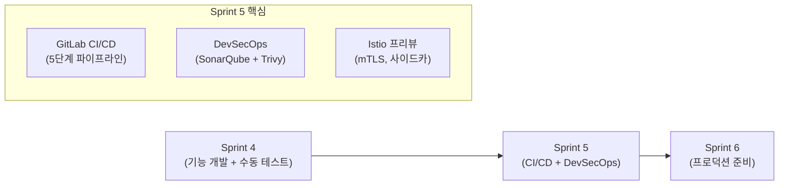
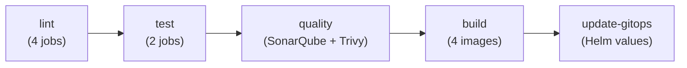
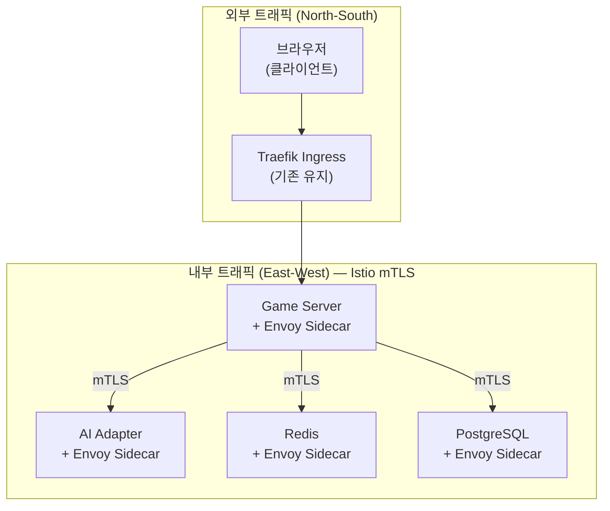

# Sprint 5 킥오프 지시사항

- **작성자**: PM
- **날짜**: 2026-04-01
- **Sprint 기간**: 2026-04-02 ~ 2026-04-15 (2주)
- **전 Sprint**: Sprint 4 (2026-03-24 ~ 04-01, 9일, 종료)

---

## 1. Sprint 5 미션

> **"코드 품질 게이트를 자동화하고, 서비스 메시로 내부 통신을 보호한다"**

Sprint 4까지는 **기능 개발 + 수동 테스트 + 수동 배포** 사이클이었다.
Sprint 5부터는 **자동화된 품질 검증 + 보안 스캔 + GitOps 배포**로 전환한다.

---

## 2. 목표 스토리 포인트

| 우선순위 | SP | 비율 |
|---------|-----|------|
| **P0 (필수)** | 16 | 67% |
| **P1 (권장)** | 8 | 33% |
| **합계** | **24** | 100% |

> Sprint 4 실적: ~30 SP. 인프라 작업은 개발보다 불확실성이 높으므로 24 SP로 보수적 산정.

---

## 3. P0 백로그 (16 SP)

### BL-S5-001: GitLab CI/CD 파이프라인 (8 SP)

**현재 상태**: `.gitlab-ci.yml` 403줄 초안 존재. 5단계 13개 Job 정의 완료.

**필요 작업**:

| # | 작업 | 담당 | 예상 시간 | 기한 |
|---|------|------|----------|------|
| 1 | GitLab Runner K8s 등록 | DevOps | 2h | Day 1 |
| 2 | CI Variables 설정 (SONAR_HOST_URL, SONAR_TOKEN, GITOPS_TOKEN) | DevOps | 1h | Day 1 |
| 3 | 파이프라인 드라이런 (develop 브랜치) | DevOps + QA | 4h | Day 2 |
| 4 | 캐시 전략 검증 (Go/Node 빌드 캐시) | DevOps | 2h | Day 3 |
| 5 | 파이프라인 실패 수정 + 그린 달성 | 전원 | 4h | Day 3~4 |

**파이프라인 상세**:

| 단계 | Job | 실행 조건 | 실패 시 |
|------|-----|----------|--------|
| lint | lint-go, lint-nest, lint-frontend, lint-admin | 모든 커밋 | 파이프라인 중단 |
| test | test-go (coverage.xml), test-nest (coverage.xml) | 모든 커밋 | 파이프라인 중단 |
| quality | sonarqube (품질 게이트 대기), trivy-fs | 모든 커밋 | 파이프라인 중단 |
| build | 4개 Docker 이미지 + Trivy 이미지 스캔 | main만 | CRITICAL 시 중단 |
| update-gitops | dev-values.yaml SHA 업데이트 | main만 | 수동 롤백 |

### BL-S5-002: SonarQube 통합 (5 SP)

**현재 상태**: 가이드 문서 존재 (`docs/05-deployment/05-sonarqube-guide.md`). 서버 미가동.

| # | 작업 | 담당 | 기한 |
|---|------|------|------|
| 1 | SonarQube 서버 배포 (Docker Compose) | DevOps | Day 1 |
| 2 | 프로젝트 3개 등록 (game-server, ai-adapter, frontend) | DevOps | Day 1 |
| 3 | 품질 게이트 규칙 정의 | Security | Day 2 |
| 4 | CI 연동 검증 (coverage 리포트 수집) | QA | Day 3 |

**품질 게이트 기준**:

| 메트릭 | 임계값 | 의미 |
|--------|--------|------|
| Coverage | ≥ 80% | 신규 코드 커버리지 |
| Duplicated Lines | ≤ 3% | 코드 중복 |
| Blocker Issues | 0 | 차단 이슈 없음 |
| Security Hotspots | Reviewed | 보안 검토 완료 |

### BL-S5-003: Trivy 컨테이너 스캔 (3 SP)

| # | 작업 | 담당 | 기한 |
|---|------|------|------|
| 1 | trivy-fs (파일시스템 스캔) CI Job 검증 | DevOps | Day 2 |
| 2 | 4개 이미지 스캔 결과 분석 | Security | Day 3 |
| 3 | CRITICAL/HIGH 취약점 수정 | 해당 팀 | Day 4~5 |

---

## 4. P1 백로그 (8 SP)

### Istio Service Mesh 프리뷰 (8 SP, Week 2)

| # | 작업 | 담당 | 기한 |
|---|------|------|------|
| 1 | Istio minimal 프로필 설치 | DevOps | Week 2 Day 1 |
| 2 | rummikub namespace 사이드카 주입 | DevOps | Week 2 Day 1 |
| 3 | PeerAuthentication (STRICT mTLS) 적용 | Architect | Week 2 Day 2 |
| 4 | game-server ↔ ai-adapter mTLS 검증 | QA | Week 2 Day 2 |
| 5 | DestinationRule (Circuit Breaker) 설정 | Architect | Week 2 Day 3 |

**메모리 예산**: ~400MB (istiod ~200MB + 사이드카 4개 × 50MB)

---

## 5. 병렬 트랙: AI 대전 Round 3

> DeepSeek 최적화 효과를 검증하는 선택적 트랙. CI/CD와 독립적으로 진행 가능.

| 항목 | 내용 |
|------|------|
| **목표** | DeepSeek Reasoner place rate 5% → 15%+ |
| **담당** | AI Engineer + Node Dev |
| **비용** | ~$0.08/게임 (80턴 × $0.001) |
| **시기** | Week 1 중 여유 시간 |
| **잔액** | OpenAI $27.76, Claude $9.11, DeepSeek $6.65 |

---

## 6. 팀 배분

| 역할 | 할당 | 주요 업무 |
|------|------|----------|
| **DevOps** | 60% | Runner 등록, SonarQube, Istio, Helm |
| **Go Dev** | 20% | P1 보안 (JWT, N+1), DevOps 지원 |
| **Node Dev** | 15% | INTERNAL_TOKEN, DeepSeek Round 3 |
| **Frontend Dev** | 10% | 빌드 이슈 지원, 반응형 준비 |
| **Architect** | 20% | Istio 설계 리뷰, mTLS 검증 |
| **Security** | 15% | 품질 게이트 규칙, Trivy 대응 |
| **QA** | 15% | CI 테스트, 스캔 해석, 부하 테스트 설계 |
| **PM** | 10% | 추적, 런북, 커뮤니케이션 |
| **AI Engineer** | 5% | Round 3 실행 |
| **Designer** | 5% | 반응형 디자인 시스템 |

---

## 7. 일정 (2주)

### Week 1 (4/2 ~ 4/8): CI/CD + DevSecOps

| 요일 | 핵심 작업 | 마일스톤 |
|------|----------|---------|
| **수** | Runner 등록 + SonarQube 배포 + CI Variables | 인프라 준비 완료 |
| **목** | 파이프라인 드라이런 + SonarQube 프로젝트 등록 | 첫 파이프라인 실행 |
| **금** | 파이프라인 수정 + Trivy 스캔 | 전 단계 그린 |
| **토~일** | 품질 게이트 튜닝 + 문서화 | DevSecOps 확립 |
| **월** | 안정화 + P1 보안 항목 착수 | CI/CD 안정 |
| **화** | 보안 항목 마무리 + Istio 준비 | Week 1 종료 |

### Week 2 (4/9 ~ 4/15): Istio + 마무리

| 요일 | 핵심 작업 | 마일스톤 |
|------|----------|---------|
| **수** | Istio 설치 + 사이드카 주입 | 메시 기동 |
| **목** | mTLS 검증 + Circuit Breaker | 보안 통신 확인 |
| **금** | 안정화 + 문서화 | Istio 프리뷰 완료 |
| **토~일** | 회고 + Sprint 6 백로그 | 종료 준비 |
| **월** | Sprint 5 데모 + 종료 판정 | Sprint 5 종료 |
| **화** | Sprint 6 킥오프 | 전환 |

---

## 8. 성공 기준

| 메트릭 | 목표 | 측정 방법 |
|--------|------|----------|
| CI 파이프라인 | 5/5 단계 그린 | GitLab Pipelines 대시보드 |
| 테스트 커버리지 | Go ≥80%, Node ≥75% | SonarQube 리포트 |
| 품질 게이트 | 0 Blocker | SonarQube 프로젝트 |
| 컨테이너 스캔 | 0 CRITICAL | Trivy Job 출력 |
| Istio 사이드카 | 전 Pod 2/2 Ready | kubectl get pods |
| mTLS | East-West 암호화 | istioctl authn tls-check |
| 문서 | 3건 발행 | docs/ 디렉토리 |

---

## 9. 리스크

| 리스크 | 확률 | 영향 | 대응 |
|--------|------|------|------|
| Runner 등록 실패 | 중 | 높 | kubectl kubeconfig 사전 검증, WSL2 네트워크 확인 |
| SonarQube 메모리 부족 | 중 | 중 | JVM -Xmx512m, Docker Compose 메모리 제한 |
| Istio 사이드카 메모리 | 낮 | 중 | 50MB/사이드카 모니터링, 초과 시 리소스 조정 |
| mTLS가 기존 트래픽 차단 | 낮 | 높 | PERMISSIVE 모드 우선, 검증 후 STRICT 전환 |
| 10GB WSL 메모리 한도 | 낮 | 높 | CI/개발 교대 실행, 동시 실행 금지 |

---

## 10. 참고 문서

| 문서 | 위치 |
|------|------|
| CI/CD 초안 | `.gitlab-ci.yml` |
| SonarQube 가이드 | `docs/05-deployment/05-sonarqube-guide.md` |
| Istio 매뉴얼 | `docs/00-tools/04-istio.md` |
| K8s 아키텍처 | `docs/05-deployment/04-k8s-architecture.md` |
| 백로그 | `docs/01-planning/13-backlog-2026-03-30.md` |
| Sprint 4 종료 | `work_logs/scrums/2026-04-01-02.md` |
| E2E 보고서 | `docs/04-testing/25-e2e-test-report-2026-04-01.md` |
| DeepSeek 최적화 | `docs/04-testing/26-deepseek-optimization-report.md` |
