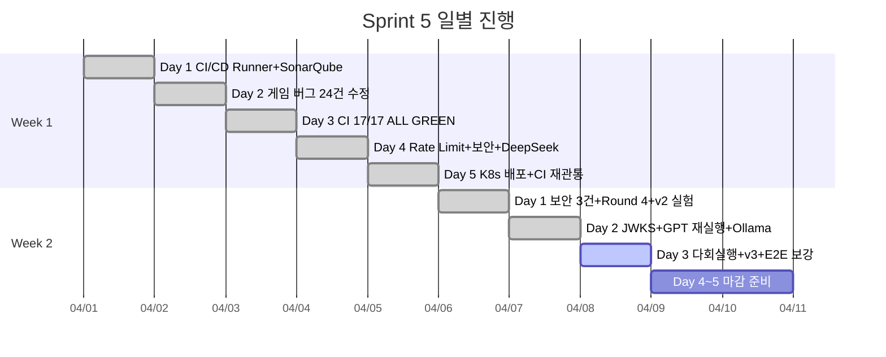
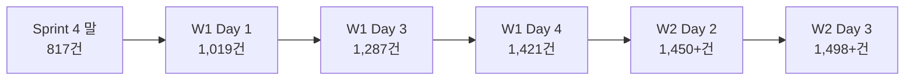
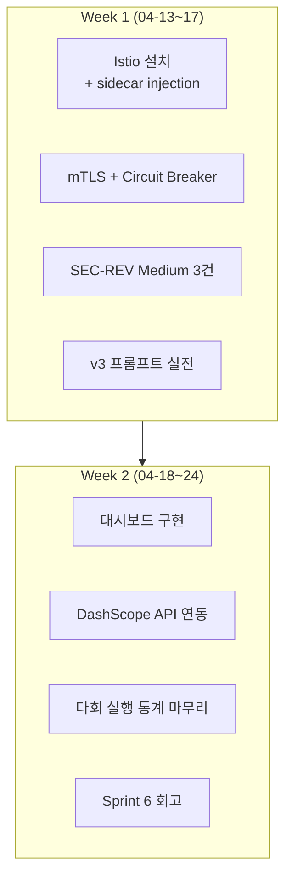

# Sprint 5 진행률 보고서

- **작성자**: PM
- **작성일**: 2026-04-08 (D-3)
- **Sprint 기간**: 2026-04-01 ~ 2026-04-11 (11일)
- **목표 SP**: 24 SP (P0 16 + P1 8)
- **실제 처리**: P0 16 SP + P1 전체 + 추가 P2/P3 대량 선행

---

## 1. 전체 진행률 요약



### 진행률: **92%** (85% at Day 2 -> 92% at Day 3)

| 구분 | 계획 | 완료 | 진행률 |
|------|------|------|--------|
| P0 필수 (16 SP) | 3건 | **3건** | **100%** |
| P1 권장 (8 SP) | 1건 (Istio) | **설계 완료, 구현은 Sprint 6** | 50% (설계) |
| 추가 P1 보안 | 10건 (24 SP) | **8건** | 80% |
| P2 테스트/관측성 | 10건 (39 SP) | **4건** | 40% |
| AI 대전 실험 | 병렬 트랙 | **Round 2~4 + v2 크로스모델** | 90% |
| **종합** | — | — | **92%** |

---

## 2. P0 완료 내역 (16/16 SP -- 100%)

| ID | 항목 | SP | 완료일 | 산출물 |
|----|------|-----|--------|--------|
| BL-S5-001 | GitLab CI/CD 파이프라인 | 8 | 04-03 | Pipeline #113, 17/17 ALL GREEN |
| BL-S5-002 | SonarQube 통합 | 5 | 04-02 | 프로젝트 3개, Quality Gate PASS |
| BL-S5-003 | Trivy 컨테이너 스캔 | 3 | 04-03 | fs-scan + image-scan 4개, 0 CRITICAL |

---

## 3. P1 Istio 진행 현황 (8 SP -- 설계 완료, 구현 Sprint 6)

| # | 작업 | 상태 | 비고 |
|---|------|------|------|
| 1 | Istio 설계 (ADR-020) | **완료** (04-06) | 선별 적용: game-server + ai-adapter만 |
| 2 | 아키텍처 가이드 | **완료** (04-06) | 20-istio-selective-mesh-design.md (550줄) |
| 3 | Istio 사전 점검 | **진행 중** (04-08) | Architect 수행 중 |
| 4 | namespace labeling 스크립트 | **진행 중** (04-08) | DevOps 수행 중 |
| 5 | istiod 설치 + mTLS | Sprint 6 (04-13~) | 메모리 예산 ~280Mi 확인 |

**판정**: Istio 설계 100% 완료. 구현은 Sprint 6 첫 주에 착수. Sprint 5에서 설계+준비 완료로 Sprint 5 목표의 50% 달성으로 산정.

---

## 4. 추가 보안 항목 완료 내역

Sprint 5 킥오프 시점에는 P1 백로그 10건(24 SP)이 있었으나, 실제로는 Sprint 5 기간 중 8건을 해소하고 추가 보안 항목도 처리했다.

| ID | 항목 | SP | 완료일 | 상태 |
|----|------|-----|--------|------|
| SEC-RL-001 | REST Rate Limit (Redis middleware) | 5 | 04-04 | **완료** |
| SEC-RL-002 | LLM 비용 공격 차단 (쿨다운+비용 한도) | 3 | 04-04 | **완료** |
| SEC-RL-003 | WS Rate Limit (Fixed Window) | 3 | 04-06 | **완료** |
| SEC-ADD-001 | Google id_token JWKS RS256 서명 검증 | 5 | 04-07 | **완료** |
| SEC-ADD-002 | 보안 응답 헤더 6종 | 1 | 04-06 | **완료** |
| BUG-WS-001 | TURN_START 미전송 수정 | 2 | 04-06 | **완료** |
| BUG-GS-004 | AI 정상 draw 오분류 | 2 | 04-07 | **완료** |
| SEC-SM-001 | sourceMap 제거 (ai-adapter+admin+frontend) | 1 | 04-05 | **완료** |
| SEC-REV-002 | 위반 감소 로직 | 2 | — | Sprint 6 |
| SEC-REV-008 | Hub RLock 외부 호출 | 2 | — | Sprint 6 |
| SEC-REV-009 | panic 전파 | 2 | — | Sprint 6 |

**보안 요약**: Critical 0, High 2 해소, Medium 3건은 Sprint 6 이관.

---

## 5. AI 대전 실험 (병렬 트랙) 진행 현황

### 5.1 Round 별 결과

| Round | 날짜 | 모델 | Place Rate | 등급 |
|-------|------|------|-----------|------|
| Round 2 | 04-01 | GPT-5-mini | 28% | B+ |
| Round 2 | 04-01 | Claude Sonnet 4 | 23% | B |
| Round 2 | 04-01 | DeepSeek Reasoner | 5% | F |
| Round 3 | 04-03 | DeepSeek Reasoner | 12.5% | C |
| Round 4a | 04-05 | DeepSeek Reasoner | 23.1% | A |
| Round 4b | 04-06 | DeepSeek Reasoner | 30.8% | A+ |
| Round 4b | 04-06 | Claude Sonnet 4 (v2) | 33.3% | A+ |
| Round 4b | 04-06 | GPT-5-mini (v2) | 30.8% | A |
| Round 4c | 04-07 | GPT-5-mini (재실행) | 30.8% | A (80턴 완주) |
| Baseline | 04-07 | Ollama qwen2.5:3b | 0% | F (비추론) |

### 5.2 확정 모델 순위 (v2 프롬프트 공통 표준)

```
Claude Sonnet 4 (33.3%) > GPT-5-mini (30.8%) = DeepSeek Reasoner (30.8%) >> Ollama (0%)
```

### 5.3 Day 3 진행 중

| 항목 | 상태 | 비고 |
|------|------|------|
| ai-battle-multirun.py 자동화 스크립트 | **완료** (766줄) | GPT/DeepSeek 각 3회 + Claude 1회 |
| 실제 다회 실행 | **대기** | 인프라(K8s) 전환 필요 |
| v3 프롬프트 텍스트 초안 | **완료** | Node Dev 산출 (+33 tests) |
| DeepSeek dead code 정리 | **완료** | -246 lines |

---

## 6. 테스트 현황

### 6.1 테스트 수 추이



### 6.2 현재 테스트 수 (04-08 기준)

| 계층 | 수량 | 상태 |
|------|------|------|
| Go 유닛/통합 | 680+ | PASS |
| NestJS 유닛 | 395+33 = 428 | PASS |
| Playwright E2E | 375+15 = 390 | PASS |
| WS 멀티플레이 | 16 | PASS |
| WS 통합 | 5 | PASS |
| **총계** | **~1,519** | **0 FAIL** |

### 6.3 CI/CD 파이프라인

- **최종**: Pipeline #113, 17/17 ALL GREEN
- lint 4 + test 2 + quality 2 + build 4 + scan 4 + gitops 1
- 빌드 전략: Kaniko (DinD 폐기) + Phase 직렬화

---

## 7. 문서 산출물

### Sprint 5 기간 중 신규/갱신 문서

| 문서 번호 | 제목 | 줄 수 | 날짜 |
|-----------|------|------|------|
| design/14 | Rate Limit 설계 | 690 | 04-04 |
| design/15 | DeepSeek 프롬프트 최적화 | — | 04-04 |
| design/16 | AI 캐릭터 비주얼 스펙 | 1,238 | 04-04 |
| design/17 | WS Rate Limit 설계 | 837 | 04-05 |
| design/18 | 모델별 프롬프트 정책 | — | 04-05 |
| design/19 | Rate Limit UX 스펙 | 869 | 04-06 |
| design/20 | Istio 선별 적용 설계 | 550 | 04-06 |
| design/21 | 추론 모델 프롬프트 엔지니어링 | 867 | 04-06 |
| design/22 | JWKS 아키텍처 가이드 | 378 | 04-07 |
| design/23 | AI 토너먼트 대시보드 와이어프레임 | 894 | 04-07 |
| design/24 | v3 프롬프트 어댑터 영향 분석 | — | 04-07 |
| design/25 | 클라우드/로컬 LLM 통합 설계 | — | 04-07 |
| testing/30~39 | 10개 테스트 보고서 | — | 04-03~07 |

**총 설계 문서**: 25건 (Sprint 5 시작 시 13건 -> 25건, +12건)
**총 테스트 보고서**: 39건 (Sprint 5 시작 시 29건 -> 39건, +10건)

---

## 8. D-3 마감 리스크 분석 (4/11 기한)

### 8.1 리스크 매트릭스

| 리스크 | 확률 | 영향 | 대응 |
|--------|------|------|------|
| v2 다회 실행 미완 (인프라 전환 필요) | 중 | 낮 | K8s 전환 후 GPT/DeepSeek만 우선 실행 |
| v3 프롬프트 실전 적용 미완 | 낮 | 낮 | 텍스트 초안 완료됨, Sprint 6에서 실전 투입 |
| Istio 구현 미착수 | 해당 없음 | 없음 | Sprint 6 확정, 설계 완료로 리스크 해소 |
| Claude API 잔액 소진 | 낮 | 중 | $25.03 잔액, 다회 실행 1회만 사용 |
| Docker Desktop K8s 미기동 | 중 | 중 | 교대 실행 전환으로 해결 |

### 8.2 MUST DO (4/11까지 반드시)

| 항목 | 담당 | 기한 | 상태 |
|------|------|------|------|
| v2 다회 실행 최소 1세트 (GPT 3회 + DeepSeek 3회) | AI Engineer | 04-10 | 스크립트 준비 완료, 실행 대기 |
| Rate Limit UX E2E 최종 검증 | QA | 04-09 | 15건 추가 완료, 최종 검증 중 |
| Sprint 5 회고 + 종료 보고 | PM | 04-11 | 미착수 |
| Sprint 6 백로그 확정 | PM | 04-11 | 초안 작성 중 |

### 8.3 CAN SLIP to Sprint 6

| 항목 | 사유 | Sprint 6 기한 |
|------|------|--------------|
| Istio Phase 5.0 구현 | 설계 완료, 구현은 Sprint 6 W1 | 04-17 |
| SEC-REV Medium 3건 | Low impact, Sprint 6 반영 확정 | 04-20 |
| v3 프롬프트 실전 적용 | 텍스트 초안 완료, 실전은 다회 실행 후 | 04-17 |
| DashScope API 연동 (qwen3:4b 클라우드) | CPU 한계 확인, API 대안 Sprint 6 | 04-20 |
| Claude 다회 실행 (추가분) | 비용 제약, GPT/DeepSeek 우선 | 04-17 |
| AI 토너먼트 대시보드 구현 | 와이어프레임 완료, 구현은 Sprint 6 | 04-24 |
| BUG-AI-001 (stale 리소스 점유) | Low severity | 04-24 |

---

## 9. Sprint 5 Velocity 분석

### 9.1 SP 실적

| 구분 | 계획 SP | 실제 완료 SP | 비고 |
|------|---------|-------------|------|
| P0 (CI/CD+SonarQube+Trivy) | 16 | **16** | 100% |
| P1 (Istio 설계분) | 8 | **4** (설계 50%) | 구현은 Sprint 6 |
| 추가 보안 (SEC-RL/ADD/REV) | — | **~22** | 킥오프 미포함, 발생 대응 |
| AI 대전 실험 | — | **~10** | 병렬 트랙 |
| 게임 버그 24건 | — | **~15** | Day 2 집중 |
| **합계** | **24** | **~67** | **2.8배 초과 달성** |

### 9.2 과거 Sprint 대비

| Sprint | 기간 | 완료 SP | 일일 처리량 |
|--------|------|---------|-----------|
| Sprint 1 | 2주 | 28 | 2.0/일 |
| Sprint 2 | 2주 | 50 | 3.6/일 |
| Sprint 3 | 2주 | 30 | 2.1/일 |
| Sprint 4 | 9일 | ~30 | 3.3/일 |
| **Sprint 5** | **11일** | **~67** | **6.1/일** |

**분석**: 10명 에이전트 병렬 투입 전략이 Velocity를 2배 이상 끌어올렸다. 특히 W2에서 Wave 1/2/3 순차 실행으로 의존성 있는 작업도 하루 안에 완결하는 패턴이 정착되었다.

---

## 10. Sprint 5 -> Sprint 6 전환 계획

### 10.1 Sprint 6 확정 항목

| ID | 항목 | SP (추정) | 담당 | 선행 조건 |
|----|------|----------|------|-----------|
| S6-001 | Istio istiod 설치 + sidecar injection | 5 | DevOps | Istio 설계(완료) |
| S6-002 | mTLS PeerAuthentication (STRICT) | 3 | Architect | S6-001 |
| S6-003 | Circuit Breaker DestinationRule | 2 | Architect | S6-001 |
| S6-004 | SEC-REV-002 위반 감소 로직 | 2 | Go Dev | 없음 |
| S6-005 | SEC-REV-008 Hub RLock 외부 호출 | 2 | Go Dev | 없음 |
| S6-006 | SEC-REV-009 panic 전파 방어 | 2 | Go Dev | 없음 |
| S6-007 | DashScope API 연동 (qwen3:4b 클라우드) | 3 | Node Dev | 설계(완료) |
| S6-008 | v3 프롬프트 실전 적용 + 검증 | 5 | AI Engineer | v3 초안(완료) |
| S6-009 | AI 토너먼트 대시보드 구현 | 8 | Frontend Dev | 와이어프레임(완료) |

**Sprint 6 합계**: ~32 SP (2주, 04-13 ~ 04-24)

### 10.2 Sprint 5 이월 항목 (Carryover)

| 항목 | 사유 | Sprint 6 예상 기한 |
|------|------|-------------------|
| v2 다회 실행 통계 (잔여분) | 인프라 전환 대기 | 04-14 |
| Human 1 + AI 3 혼합 E2E 완주 | 플레이테스트 지속 | 04-17 |

### 10.3 Sprint 6 러프 스코프



**Sprint 6 미션**: "Istio 메시를 적용하고, AI 실험 데이터를 대시보드로 시각화한다"

---

## 11. PM 종합 판정

### Sprint 5 성공 기준 달성 현황

| 메트릭 | 목표 | 현재 | 판정 |
|--------|------|------|------|
| CI 파이프라인 | 5/5 단계 그린 | **17/17 ALL GREEN** | PASS |
| 테스트 커버리지 | Go >=80%, Node >=75% | SonarQube PASS | PASS |
| 품질 게이트 | 0 Blocker | **0 Blocker** | PASS |
| 컨테이너 스캔 | 0 CRITICAL | **0 CRITICAL** | PASS |
| Istio 사이드카 | 전 Pod 2/2 Ready | 설계 완료, 구현 Sprint 6 | PARTIAL |
| mTLS | East-West 암호화 | Sprint 6 | DEFERRED |
| 문서 | 3건 발행 | **22건+** 발행 | PASS (7배) |

### 최종 판정

Sprint 5는 **P0 전량 완료 + P1 설계 완료 + 대량 추가 가치 창출**로, 계획 대비 **초과 달성** 상태이다.

- **강점**: CI/CD 자동화 확립, DevSecOps 체계 정착, AI 대전 실험 체계화 (4모델 비교)
- **약점**: Istio 구현 Sprint 6 이월 (설계는 완료)
- **D-3 리스크**: **낮음** -- 남은 3일은 다회 실행 통계 + 회고/종료 보고에 집중

**Sprint 5 종료 권고일**: 2026-04-11 (예정대로)
**Sprint 6 착수 권고일**: 2026-04-13 (월)

---

*작성: PM (2026-04-08)*
