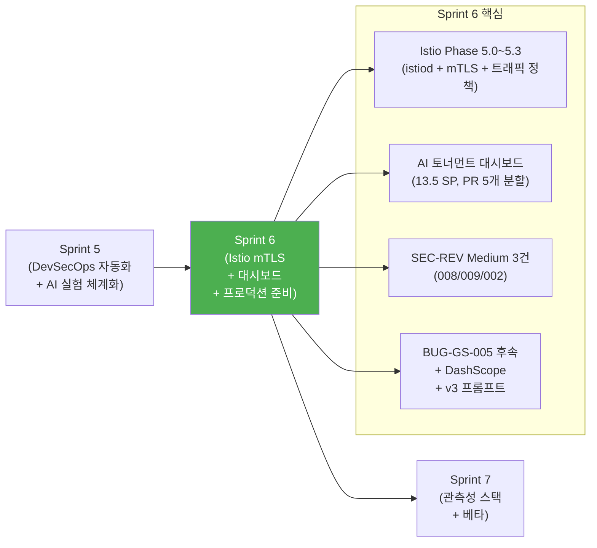
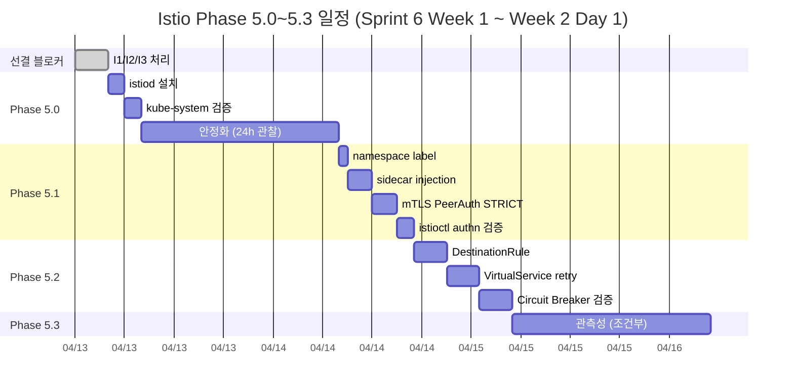
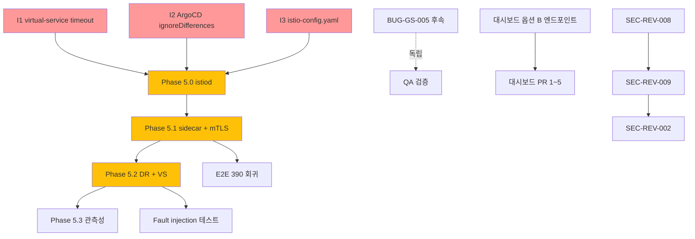

# Sprint 6 킥오프 지시사항 (Sprint 6 Kickoff Directives)

- **작성자**: PM
- **작성일**: 2026-04-13 (Sprint 6 Day 1)
- **Sprint 기간**: 2026-04-13 (월) ~ 2026-04-26 (일) — 2주, 14일
- **전 Sprint**: Sprint 5 (2026-03-31 ~ 04-12, 13일) — 종료 판정 **성공적 종료**, 진행률 100%
- **참조**:
  - `docs/01-planning/16-sprint5-closing-report.md` (Sprint 5 종료 보고 + 이월 항목 ~37 SP)
  - `docs/02-design/20-istio-selective-mesh-design.md` (ADR-020 Istio 선별 적용)
  - `docs/02-design/27-istio-sprint6-precheck.md` (Phase 5 로드맵 781줄)
  - `docs/02-design/32-timeout-redis-cleanup-design.md` (BUG-GS-005 후속)
  - `docs/02-design/33-ai-tournament-dashboard-component-spec.md` (13.5 SP 대시보드 스펙)
  - `docs/02-design/25-cloud-local-llm-integration.md` (DashScope qwen3 설계)
  - `work_logs/retrospectives/sprint5-retrospective.md`
  - `work_logs/scrums/2026-04-13-01.md` (오늘자 킥오프 스크럼)

---

## 1. Sprint 6 미션

> **"Istio 메시로 East-West 통신을 보호하고, AI 실험 데이터를 대시보드로 시각화한다."**

Sprint 5가 "자동화된 품질 게이트 + AI 실험 체계화"였다면, Sprint 6는 **"프로덕션 준비 상태(Production Readiness)"** 를 향한 스프린트이다. Istio 선별 적용(ADR-020, game-server + ai-adapter 2개 Pod만)으로 mTLS를 확보하고, Sprint 5에서 12회 대전으로 축적한 실험 데이터를 관리자 대시보드에서 볼 수 있게 한다. 그리고 Sprint 5에서 의도적으로 남겨둔 Medium 보안 3건과 BUG-GS-005 후속(TIMEOUT Redis cleanup)을 정리한다.



---

## 2. 목표 스토리 포인트

| 우선순위 | SP | 비율 | 설명 |
|---------|-----|------|------|
| **P0 (필수)** | 24 | 60% | Istio Phase 5.0~5.3 + BUG-GS-005 후속 + 에러코드 정리 |
| **P1 (권장)** | 14 | 35% | 대시보드 구현 + SEC-REV Medium 3건 |
| **P2 (가능 시)** | 2 | 5% | v3 프롬프트 실전 + DashScope 설계 |
| **합계** | **40** | 100% | |

> **산정 근거**: Sprint 5 실적 67 SP (6.1 SP/일) 대비 40 SP는 보수적 산정(3.3 SP/일). Istio는 인프라 작업이라 불확실성이 크고(Day 1 P0×3 블로커 사전 발견), 대시보드는 13개 컴포넌트라 분할 PR 관리 비용이 있다. Sprint 5 closing report에서 제시한 32 SP 확정 백로그(S6-001~009)에 **BUG-GS-005 후속(2 SP) + 에러코드 정리(2 SP) + 대시보드 추가분(4 SP)** 을 더하여 40 SP로 확정.

---

## 3. P0 백로그 (24 SP)

### BL-S6-001: Istio Phase 5.0~5.3 선별 적용 (12 SP)

**현재 상태**: 설계 100% 완료. 스크립트 3개(install/uninstall/namespace-label) + CRD 4개(PeerAuth 2 + DestinationRule + VirtualService) + Helm 통합(istio-values.yaml) + 사전 점검 781줄(문서 27번). **즉시 실행 가능**.

**적용 범위**: game-server + ai-adapter 2개 Pod만 sidecar injection (ADR-020). 추가 메모리 ~280Mi (16GB 제약 안전).



#### 3.1.1 선결 블로커 (Day 1 오전, 1 SP)

| ID | 작업 | 담당 | 예상 시간 | 파일 |
|----|------|------|----------|------|
| **I1** | `istio/virtual-service-ai-adapter.yaml` timeout 200→510s 변경 (ConfigMap 500s 정합) | Node Dev | 10분 | `istio/virtual-service-ai-adapter.yaml` |
| **I2** | `argocd/application.yaml` sidecar `ignoreDifferences` 추가 (selfHeal 루프 방지) | DevOps | 20분 | `argocd/application.yaml` |
| **I3** | `argocd/istio-config.yaml` 신설 (GitOps 원칙 준수) | DevOps + Architect | 30분 | `argocd/istio-config.yaml` (신규) |

> **순서 엄수**: I1~I3 완료 확인 후에만 Phase 5.0 진입.

#### 3.1.2 Phase 5.0: istiod 설치 + 안정화 (Day 1~3, 3 SP)

| # | 작업 | 담당 | 기한 | 산출물 |
|---|------|------|------|--------|
| 1 | `istioctl` 바이너리 설치 (~/.local/bin) | DevOps | Day 1 PM | 버전 로그 |
| 2 | minimal profile 설치 (`scripts/istio-install.sh`) | DevOps | Day 1 PM | istiod Pod Running |
| 3 | kube-system + rummikub 기존 Pod 회귀 검증 | QA | Day 2 | 회귀 보고서 |
| 4 | 24시간 안정화 관찰 (memory/CPU) | DevOps | Day 2~3 | 관찰 로그 |

**성공 기준**: istiod 1/1 Ready, 기존 7개 서비스 RESTART=0 유지, 메모리 +200Mi 이하.

#### 3.1.3 Phase 5.1: mTLS PeerAuthentication STRICT (Day 4~6, 4 SP)

| # | 작업 | 담당 | 기한 | 산출물 |
|---|------|------|------|--------|
| 1 | rummikub namespace label (`istio-injection=enabled`) | DevOps | Day 4 | kubectl label 기록 |
| 2 | game-server + ai-adapter sidecar injection (Deployment rollout) | DevOps | Day 4 | Pod 2/2 Ready |
| 3 | PeerAuthentication STRICT 적용 (istio/peer-auth-*.yaml) | Architect | Day 5 | PeerAuth 2개 |
| 4 | `istioctl authn tls-check` 검증 | QA | Day 5 | mTLS PASS 증빙 |
| 5 | E2E 390건 회귀 테스트 | QA | Day 6 | 0 회귀 목표 |

**성공 기준**: `istioctl authn tls-check` STRICT, E2E 회귀 0, 메모리 +280Mi 이하.

#### 3.1.4 Phase 5.2: DestinationRule + VirtualService 트래픽 정책 (Day 7~9, 3 SP)

| # | 작업 | 담당 | 기한 | 산출물 |
|---|------|------|------|--------|
| 1 | DestinationRule: 커넥션 풀 + 서킷 브레이커 | Architect | Day 7 | DR 1개 |
| 2 | VirtualService: retry 3회 + timeout 510s(ai-adapter) | Architect | Day 8 | VS 1개 |
| 3 | Fault injection 테스트 (5% fail → retry 검증) | QA | Day 8 | 시뮬레이션 보고서 |
| 4 | ConfigMap AI_ADAPTER_TIMEOUT_SEC=500 정합성 재확인 | Node Dev | Day 9 | 정합성 확인 |

**성공 기준**: Circuit breaker trigger 확인(시뮬레이션), retry 동작 확인, 실 트래픽 회귀 0.

#### 3.1.5 Phase 5.3: 관측성 (조건부, 1 SP)

Phase 5.2 완료 + 메모리 여유 시에만 선택적 진행. Kiali, Jaeger는 Sprint 7로 이월 가능.

| # | 작업 | 담당 | 기한 | 비고 |
|---|------|------|------|------|
| 1 | Envoy access log 수집 방안 확인 | DevOps | Day 10 | Sprint 7 설계 인풋 |

---

### BL-S6-002: BUG-GS-005 후속 — TIMEOUT Redis cleanup (2 SP)

**현재 상태**: 설계 문서 완료(`docs/02-design/32-timeout-redis-cleanup-design.md`, 321줄). 옵션 A(서버 측 TurnCount 상한 + advanceToNextTurn 귀결 + finishGameStalemate) 권장.

| # | 작업 | 담당 | 기한 |
|---|------|------|------|
| 1 | `GameState.TurnCount` 상한 ConfigMap 상수 도입 (기본 120턴) | Go Dev | Day 1 |
| 2 | `advanceToNextTurn` 초과 시 `finishGameStalemate` 결선 | Go Dev | Day 1 |
| 3 | 유닛 테스트 3~4건 (TurnCount 경계, stalemate 경로, Redis 삭제 검증) | Go Dev | Day 1~2 |
| 4 | AI 대전 스크립트로 재현 테스트 | QA | Day 2 |

**성공 기준**: 80턴 AI 대전 종료 후 Redis `game:{id}:state` 키 자동 삭제 확인, 0 좀비 게임.

---

### BL-S6-003: 에러코드 정리 + 잔여 전수 검토 (2 SP)

**현재 상태**: Sprint 5 Day 5에서 1차 전수 검토 완료(아키텍트). 잔여 영역 2차 검토 필요.

| # | 작업 | 담당 | 기한 |
|---|------|------|------|
| 1 | AI_COOLDOWN 429→403 변경 (HTTP 의미 구분) | Go Dev + Node Dev | Day 2 |
| 2 | 에러코드 레지스트리 2차 전수 검토 (잔여 영역) | Architect | Day 3 |
| 3 | 문서 갱신 (`docs/02-design/29-error-code-registry.md`) | Architect | Day 3 |

---

### BL-S6-004: Istio 관련 문서 + 런북 (2 SP)

| # | 작업 | 담당 | 기한 |
|---|------|------|------|
| 1 | Istio 설치 후 운영 런북 작성 | DevOps | Day 6 |
| 2 | mTLS 검증 스크립트 + 긴급 롤백 절차 | DevOps | Day 6 |
| 3 | ADR-020 실행 결과 보고 | Architect | Day 9 |

---

### BL-S6-005: Sprint 6 품질 게이트 유지 (5 SP)

| # | 작업 | 담당 | 기한 |
|---|------|------|------|
| 1 | Pipeline ALL GREEN 유지 (기존 17/17) | DevOps | 상시 |
| 2 | 테스트 1,528 → 1,600+ 목표 (대시보드 E2E + Istio 회귀) | QA | Week 2 |
| 3 | 플레이테스트 S1~S5 재실행 (Istio 적용 전/후) | QA | Day 6 |
| 4 | SonarQube Quality Gate PASS 유지 | Security | 상시 |

---

## 4. P1 백로그 (14 SP)

### BL-S6-006: AI 토너먼트 대시보드 구현 (8 SP)

**현재 상태**: 컴포넌트 스펙 완료(`docs/02-design/33-*`, 1538줄, 13.5 SP). 13개 컴포넌트, 10개 오픈 이슈.

**PR 5개 분할** (스펙 11.2 구현 순서 기반):

| PR | 범위 | SP | 컴포넌트 | 담당 |
|----|------|-----|----------|------|
| **PR 1** | 기반 구조 + 옵션 B 엔드포인트 | 1.5 | constants, 타입, API 클라이언트, `/tournament` 라우트, Sidebar 메뉴 | Frontend Dev |
| **PR 2** | 공용 컴포넌트 + 필터 | 1.5 | GradeBadge, StatusBadge, Sparkline, ChartTooltip, TournamentFilter | Frontend Dev |
| **PR 3** | ModelCard + ModelCardGrid + ModelLegend | 2.5 | ModelCard ×4, ModelCardGrid, ModelLegend | Frontend Dev |
| **PR 4** | 차트 2종 (Line + Scatter) | 3.0 | PlaceRateChart, CostEfficiencyScatter, CustomizedDot | Frontend Dev |
| **PR 5** | 히스토리 테이블 + 조립 + 반응형 + E2E | 3.5 | RoundHistoryTable, TournamentGrid, TournamentPageClient, a11y, Playwright 5건 | Frontend Dev + QA |

**총 SP**: 12 (스펙 13.5 - 환경 준비 1.5). Sprint 6 P1에 **8 SP 할당**, 초과분 4 SP는 Sprint 7 이월 가능.

**선행 조건**:
- Day 1에 옵션 B 엔드포인트(`GET /admin/stats/ai/tournament` 정적 JSON 프록시) 선행 완료 (이미 스크럼에서 액션 아이템 확정)
- Designer가 오픈 이슈 10건 결정 (Day 1 킥오프 미팅)

**일정**:

| PR | 예상 기한 | Gate |
|----|----------|------|
| PR 1 | Day 2 | Sidebar에 `/tournament` 메뉴 표시 |
| PR 2 | Day 4 | 필터 UI 동작 |
| PR 3 | Day 6 | 4개 ModelCard 표시 |
| PR 4 | Day 9 | 차트 2종 표시 |
| PR 5 | Day 12 | E2E PASS, 반응형 OK |

---

### BL-S6-007: SEC-REV Medium 3건 (6 SP)

**현재 상태**: Sprint 5 종료 시 이월(Low impact). 영향도 분석 완료 문서: `docs/02-design/26-sec-rev-medium-impact-analysis.md`.

**순서**: SEC-REV-008 → SEC-REV-009 → SEC-REV-002 (가벼운 순).

| ID | 항목 | SP | 담당 | 기한 | 사유 |
|----|------|-----|------|------|------|
| SEC-REV-008 | Hub RLock 외부 호출 | 2 | Go Dev | Day 2~3 | Lock scope 축소 |
| SEC-REV-009 | panic 전파 방어 | 2 | Go Dev | Day 4~5 | defer recover 패턴 적용 |
| SEC-REV-002 | 위반 감소 로직 | 2 | Go Dev | Day 6~8 | 비즈니스 로직 수정, 가장 무거움 |

**성공 기준**: 각 항목 유닛 테스트 추가 + 통합 테스트 회귀 0.

---

## 5. P2 백로그 (2 SP — 가능 시)

### BL-S6-008: DashScope API 연동 설계 (1 SP)

**현재 상태**: 설계 문서 `docs/02-design/25-cloud-local-llm-integration.md` 완료. 코드 구현은 Sprint 7.

| # | 작업 | 담당 | 기한 |
|---|------|------|------|
| 1 | ai-adapter DashScope Provider 스켈레톤 | AI Engineer + Node Dev | Day 10 |
| 2 | qwen3 모델 엔드포인트 + 비용 테이블 | AI Engineer | Day 11 |

---

### BL-S6-009: v3 프롬프트 실전 적용 준비 (1 SP)

**현재 상태**: v3 초안 완료(텍스트 4개 개선안 + 33 유닛 테스트). Sprint 5에서 검증 대전 3회로 v2 baseline 확정.

| # | 작업 | 담당 | 기한 |
|---|------|------|------|
| 1 | v3 프롬프트 최종 confirm | AI Engineer | Day 11 |
| 2 | v3 전용 ai-battle-multirun 런북 | AI Engineer | Day 12 |

**실제 적용 대전은 Sprint 7 P0**.

---

## 6. 담당자별 배분

| 역할 | Sprint 5 할당 | Sprint 6 할당 | 주요 업무 |
|------|--------------|--------------|----------|
| **DevOps** | 60% | **50%** | Istio Phase 5.0~5.3, istiod 설치, sidecar injection, 런북 |
| **Architect** | 20% | **25%** | PeerAuth/DR/VS 설계 검증, 에러코드 2차 전수 검토, ADR-020 보고 |
| **Go Dev** | 20% | **25%** | BUG-GS-005 후속, SEC-REV-002/008/009, AI_COOLDOWN 429→403 |
| **Node Dev** | 15% | **10%** | I1 virtual-service timeout, AI_COOLDOWN 429→403, DashScope 스켈레톤 |
| **Frontend Dev** | 10% | **30%** | 대시보드 PR 5개, 옵션 B 엔드포인트, 반응형, a11y |
| **QA** | 15% | **25%** | Istio 회귀 (Phase 5.1/5.2), 플레이테스트 S1~S5, 대시보드 E2E |
| **Security** | 15% | **10%** | PeerAuth 검토, SEC-REV 리뷰, 보안 헤더 회귀 |
| **AI Engineer** | 5% | **10%** | DashScope 스켈레톤, v3 프롬프트 confirm, 대시보드 데이터 연결 |
| **Designer** | 5% | **15%** | 대시보드 13개 컴포넌트 Frontend Dev 지원, 오픈 이슈 10건 결정 |
| **PM** | 10% | **10%** | 추적, 일정 관리, 선결 블로커 조율, 일일 스탠드업 |

---

## 7. 일정표 (2주)

### Week 1 (2026-04-13 ~ 04-19): Istio 5.0~5.1 + BUG-GS-005 + 대시보드 PR 1~3

| 요일 | Day | 핵심 작업 | 마일스톤 |
|------|-----|----------|---------|
| 월 04-13 | D1 | **I1/I2/I3 블로커 해결** → Phase 5.0 istiod 설치 / BUG-GS-005 후속 구현 / 대시보드 엔드포인트 선행 / Sprint 6 킥오프 | Sprint 6 킥오프 + istiod Running |
| 화 04-14 | D2 | istiod 안정화 관찰 / BUG-GS-005 테스트 / SEC-REV-008 착수 / 대시보드 PR 1 | BUG-GS-005 완료, PR 1 Merge |
| 수 04-15 | D3 | Phase 5.0 최종 검증 / SEC-REV-008 완료 / 에러코드 2차 전수 검토 / AI_COOLDOWN 429→403 | Phase 5.0 완료, SEC-REV-008 완료 |
| 목 04-16 | D4 | **Phase 5.1 sidecar injection** / SEC-REV-009 착수 / 대시보드 PR 2 | 2개 Pod 2/2 Ready |
| 금 04-17 | D5 | mTLS STRICT 적용 + 검증 / SEC-REV-009 완료 | mTLS PASS |
| 토 04-18 | D6 | E2E 회귀 테스트 / 대시보드 PR 3 / 플레이테스트 S1~S5 재실행 | Phase 5.1 완료, PR 3 Merge |
| 일 04-19 | D7 | **Week 1 종료 리뷰** / SEC-REV-002 착수 / 일일 마감 + 바이브 | Week 1 종료 판정 |

### Week 2 (2026-04-20 ~ 04-26): Istio 5.2~5.3 + 대시보드 PR 4~5 + 마무리

| 요일 | Day | 핵심 작업 | 마일스톤 |
|------|-----|----------|---------|
| 월 04-20 | D8 | **Phase 5.2 DestinationRule + VirtualService** / SEC-REV-002 | DR + VS 적용 |
| 화 04-21 | D9 | Circuit Breaker + retry 검증 / SEC-REV-002 완료 / ADR-020 결과 보고 | Phase 5.2 완료 |
| 수 04-22 | D10 | Phase 5.3 관측성 (조건부) / DashScope 스켈레톤 / 대시보드 PR 4 | PR 4 Merge |
| 목 04-23 | D11 | DashScope qwen3 엔드포인트 / v3 프롬프트 confirm | DashScope P2 완료 |
| 금 04-24 | D12 | 대시보드 PR 5 + E2E / 전체 품질 게이트 재검증 | 대시보드 완료 |
| 토 04-25 | D13 | **Sprint 6 데모** + 회고 리뷰 / Sprint 7 백로그 초안 | 데모 완료 |
| 일 04-26 | D14 | **Sprint 6 종료 판정** / 종료 보고서 / Sprint 7 킥오프 준비 | **Sprint 6 종료** |

---

## 8. 블록 관계 (의존성 그래프)



**주요 블록 관계**:
- I1/I2/I3 → Phase 5.0 (순서 엄수, Day 1 오전)
- Phase 5.0 → 5.1 → 5.2 → 5.3 (단방향 시퀀스, 이전 단계 성공 기준 통과 필수)
- 대시보드 옵션 B 엔드포인트 → PR 1 (Day 1에 선행)
- BUG-GS-005 후속과 대시보드는 **Istio와 병렬 실행 가능** (독립 트랙)
- SEC-REV-008 → 009 → 002 순서(가벼운 순, Sprint 5 분석 기반)

---

## 9. 리스크 (상위 5개)

| # | 리스크 | 확률 | 영향 | 등급 | 대응 |
|---|--------|------|------|------|------|
| **R1** | **Istio sidecar 메모리 초과로 16GB RAM 한계 초과** | 중 | 높 | High | Phase 5.1 직후 메모리 관찰 1시간 / 초과 시 Ollama 또는 admin Deployment 임시 축소 / 예산 280Mi 기준 |
| **R2** | **Istio mTLS STRICT 적용 시 기존 트래픽 차단** | 중 | 높 | High | PeerAuth PERMISSIVE 모드 먼저 검증 → STRICT 전환 / `istioctl authn tls-check` 선행 / 긴급 롤백 스크립트 Day 4 준비 |
| **R3** | **대시보드 PR 5개 분할 일정 미준수 (13.5 SP)** | 중 | 중 | Medium | PR 1~3 Week 1 종료 전 완료 목표, PR 4~5는 Week 2 / 초과 시 Sprint 7 이월 허용 / Designer 핸드오프 선행 |
| **R4** | **SEC-REV-002 위반 감소 로직 영향도 예상 이상** | 낮 | 중 | Medium | 가장 마지막(Day 8~9)으로 배치, 위험 시 Sprint 7 이월 / 영향도 분석 문서 26번 재검토 |
| **R5** | **ArgoCD selfHeal 루프 (I2 미처리 시)** | 중 | 높 | High | I2 ignoreDifferences 반드시 I3 전에 Merge / ArgoCD auto-sync 일시 중지 옵션 보유 / selfHeal 로그 모니터 |

### 9.1 Sprint 5 잔존 리스크 (그대로 상속)

| 리스크 | 확률 | 영향 | Sprint 6 대응 |
|--------|------|------|---------------|
| 16GB RAM 병목 (TR-05 + ER-03) | 중 | 중 | Istio + AI 대전 교대 실행 |
| Claude API 비용 (~$14.81 잔액) | 낮 | 낮 | 대전 최소화, v3 실전은 Sprint 7 |
| argocd-repo-server 간헐 Error | 낮 | 낮 | Minor, 관찰만 |

---

## 10. 성공 기준

| 메트릭 | 목표 | 측정 방법 |
|--------|------|----------|
| Istio Phase 5.0 | istiod Running, 회귀 0 | `kubectl -n istio-system get pods` |
| Istio Phase 5.1 | game-server + ai-adapter 2/2 Ready, mTLS STRICT | `istioctl authn tls-check` |
| Istio Phase 5.2 | DR + VS 적용, retry/CB 동작 확인 | Fault injection 시뮬레이션 |
| BUG-GS-005 후속 | 80턴 종료 후 Redis 자동 삭제 | `redis-cli KEYS "game:*:state"` 잔존 0 |
| SEC-REV 3건 | 유닛 테스트 추가 + 회귀 0 | Go 테스트 +6건 이상 |
| 대시보드 | PR 3개 이상 Merge, `/tournament` 페이지 표시 | Playwright E2E +5건 |
| 품질 게이트 | 0 Blocker / 0 CRITICAL 유지 | SonarQube + Trivy |
| CI 파이프라인 | 17/17 ALL GREEN 유지 | GitLab Pipelines |
| 테스트 | 1,528 → 1,600+ | 테스트 수집 보고 |
| 문서 | 신규 5~8건 | `docs/` 디렉토리 |

---

## 11. Sprint 5 → Sprint 6 핵심 인계

Sprint 5 종료 보고서 7.4절에서 확정한 6가지 인계 사항을 Sprint 6 Day 1에 확인:

1. **Istio 즉시 실행 가능**: 스크립트·CRD·Helm 준비 100% — 단 **I1/I2/I3 선결 블로커 처리 후** 실행
2. **SEC-REV Medium 3건**: 영향도 분석(26번) 기반 순서 준수
3. **AI 실험 데이터 22회**: v3 적용과 DashScope 연동은 Sprint 6 P2, 본격 실행은 Sprint 7
4. **에러코드 AI_COOLDOWN 429→403**: Day 2 처리
5. **BUG-GS-005 후속 TIMEOUT Redis cleanup**: 설계 32번 옵션 A 구현 (Day 1~2)
6. **클린 환경 확보**: 좀비 게임 0건 상태 유지 (BUG-GS-005 수정 효과)

---

## 12. 참고 문서

| 문서 | 위치 |
|------|------|
| Sprint 5 종료 보고 | `docs/01-planning/16-sprint5-closing-report.md` |
| Sprint 5 회고 | `work_logs/retrospectives/sprint5-retrospective.md` |
| ADR-020 Istio 선별 적용 | `docs/02-design/20-istio-selective-mesh-design.md` |
| Istio 사전 점검 (781줄) | `docs/02-design/27-istio-sprint6-precheck.md` |
| BUG-GS-005 후속 설계 | `docs/02-design/32-timeout-redis-cleanup-design.md` |
| 대시보드 컴포넌트 스펙 | `docs/02-design/33-ai-tournament-dashboard-component-spec.md` |
| 대시보드 와이어프레임 | `docs/02-design/23-ai-tournament-dashboard-wireframe.md` |
| DashScope 설계 | `docs/02-design/25-cloud-local-llm-integration.md` |
| SEC-REV 영향도 분석 | `docs/02-design/26-sec-rev-medium-impact-analysis.md` |
| 에러코드 레지스트리 | `docs/02-design/29-error-code-registry.md` |
| 오늘자 킥오프 스크럼 | `work_logs/scrums/2026-04-13-01.md` |

---

## 13. Sprint 6 킥오프 카드 (요약)

```
┌─────────────────────────────────────────────────┐
│  Sprint 6 Kickoff  |  2026-04-13 ~ 04-26 (2주)  │
├─────────────────────────────────────────────────┤
│  Mission: Istio mTLS + 대시보드 + 프로덕션 준비  │
├─────────────────────────────────────────────────┤
│  Target SP  : 40  (P0 24 + P1 14 + P2 2)        │
│  Velocity   : 3.3 SP/일 (보수적)                │
│  Team       : 11명 (애벌레 + 에이전트 10)       │
├─────────────────────────────────────────────────┤
│  P0 (24 SP)                                     │
│  - Istio Phase 5.0~5.3 (12 SP)                  │
│  - BUG-GS-005 후속 (2 SP)                       │
│  - 에러코드 정리 (2 SP)                          │
│  - Istio 런북 (2 SP)                            │
│  - 품질 게이트 유지 (5 SP)                       │
│  - 기타 (1 SP)                                  │
├─────────────────────────────────────────────────┤
│  P1 (14 SP)                                     │
│  - 대시보드 PR 1~5 (8 SP)                       │
│  - SEC-REV 008/009/002 (6 SP)                   │
├─────────────────────────────────────────────────┤
│  P2 (2 SP)                                      │
│  - DashScope 스켈레톤 (1 SP)                    │
│  - v3 프롬프트 confirm (1 SP)                   │
├─────────────────────────────────────────────────┤
│  Day 1 Must-Do                                  │
│  - [AM] I1/I2/I3 선결 블로커                    │
│  - [PM] Phase 5.0 istiod 설치                   │
│  - [병렬] BUG-GS-005 후속 / 대시보드 엔드포인트  │
├─────────────────────────────────────────────────┤
│  Top Risk: Istio 메모리 280Mi + mTLS 차단        │
│  Contingency: PERMISSIVE → STRICT 2단계 전환    │
└─────────────────────────────────────────────────┘
```

---

*작성: PM (애벌레의 자리에서) — 2026-04-13*
*검토: 애벌레 (PO)*
