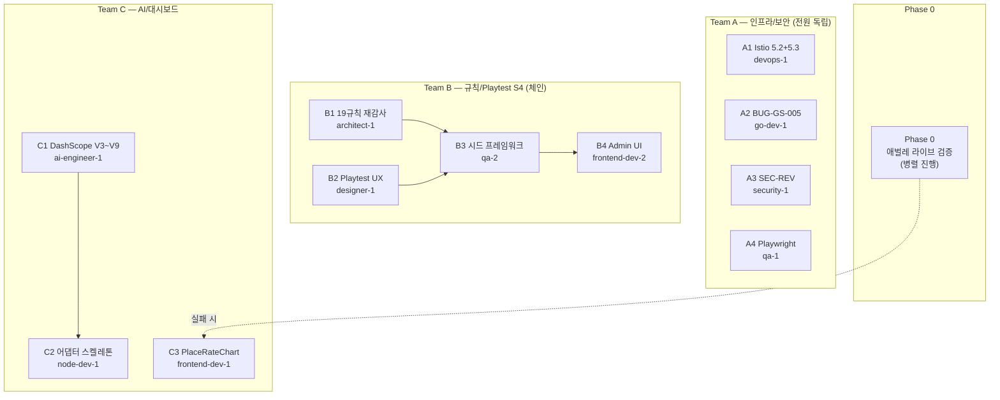

# Sprint 6 Day 3 실행 계획 (2026-04-14)

- **문서 번호**: 18
- **작성일**: 2026-04-14
- **작성자**: 애벌레 + Claude Opus 4.6
- **대상**: Sprint 6 Day 3 전체 팀
- **기반 자료**: `work_logs/scrums/2026-04-13-02.md`(Day 2 마감 스탠드업), `work_logs/daily/2026-04-13.md`(Day 1+2 동시 수행 데일리), `work_logs/vibe/2026-04-13.md`(라이브 테스트 교훈), `docs/04-testing/48-game-rule-coverage-audit.md`(규칙 감사 보고)

## 1. 배경 및 Day 3 성격

### 어제(Day 1+2 동시 수행) 주요 성과
- Istio Phase 5.0/5.1 완료 (sidecar 2/2, mTLS 9회 실체결)
- 재배치 4유형(V-13a~e) UI 최초 구현 — ❌ 3건 → 0건
- 라이브 테스트 버그 16장 스크린샷 → 핫픽스 4건 긴급 반영 + Frontend 2차 재배포
- BUG-GS-005 TIMEOUT Redis cleanup 옵션 A 구현
- SEC-REV-002/008/009 Medium 3건 모두 완료 (Sprint 5 이월분 정리)
- 감사 보고서 48번 (286줄) — "엔진 ✅ / UI ❌" 패턴 근본 원인 분석
- 커밋 24건, Agent Teams 3팀 13명, 신규 문서 다수

### Day 3 성격: "수습과 확장"
어제는 속도전이었고 오늘은 어제의 성과를 **검증**하고 **체계화**한다.
1. **수습**: 핫픽스 4건 실전 검증(애벌레 직접) + Playwright 플레이키 근본 해결 + BUG-GS-005 안정화 확인
2. **확장**: Istio Phase 5.2/5.3 복원력 실증 + 19개 규칙 전수 재감사 + Playtest S4 결정론적 전환 + DashScope V3~V9 재조사 + 대시보드 PR 2

### 운영 규칙 (어제 교훈 반영)
- **`addBlockedBy` 필수**: 의존성 관계는 TaskCreate 시점에 명시 등록, 자체 `git log` 폴링 금지
- **동일 파일 경합 방지**: `frontend-dev-1`과 `frontend-dev-2`는 서로 다른 파일 범위로 분리
- **이미지 태그 경합 방지**: 동일 `rummiarena/frontend:dev` 태그 동시 빌드 금지
- **Agent Teams 운영 지속**: 사용자 명시 "Agent Teams 계속 운용" — 패턴 유지하되 의존성 처리만 개선

## 2. Phase 0 — 애벌레 라이브 검증 (Agent 없음, 병렬 진행)

어제 핫픽스 4건이 실전에서 작동하는지 먼저 확인. Agent Teams와 병렬.

| 검증 항목 | ID | 확인 방법 |
|-----------|----|-----------|
| 히스토리 패널이 하단 ActionBar 가림 해소 | BUG-UI-LAYOUT-001 | 히스토리 패널 토글 → 하단 ActionBar 드러나는지 |
| 그룹 5회 복제 해소 | BUG-UI-REARRANGE-002 | 연속 드롭 5회 → 그룹 복제 없음 확인 |
| 혼합 숫자 자동 분리 | BUG-UI-CLASSIFY-001a | R5, B6, K7 혼합 드래그 → 자동으로 3개 그룹 분리 |
| 런 false positive 제거 | BUG-UI-CLASSIFY-001b | [R5 R6 R7] 런 생성 → 중복 경고 뜨지 않음 |

### 실패 시 Fallback
C3 `frontend-dev-1`의 작업(PlaceRateChart)을 **일시 중단**하고 핫픽스 재작업에 즉시 재투입.

## 3. Team A — 인프라 + 보안 (4 agents, 전원 독립 병렬)

### A1 `devops-1` — Istio Phase 5.2 서킷 브레이커 + Phase 5.3 istioctl PATH

**목표**: 어제 Phase 5.0/5.1(sidecar 주입)까지 성공. 오늘은 복원력(resilience) 기능 실증.

**구체 작업**:
1. **Phase 5.2 — 서킷 브레이커 실증**
   - 파일 확인: `istio/destination-rule-ai-adapter.yaml`에서 `outlierDetection` 필드(consecutiveGatewayErrors, interval, baseEjectionTime) 확인
   - 장애 주입: `kubectl exec -it <ai-adapter-pod> -- kill -STOP 1` 또는 ai-adapter에 `/debug/force-500` 임시 엔드포인트 추가 후 호출
   - 관찰: `istioctl proxy-config cluster <game-server-pod>` → outlier_detection stats 변화, Envoy `upstream_rq_5xx` 카운터 증가
   - 재시도 검증: `istio/virtual-service-ai-adapter.yaml`의 `retries.attempts: 3` 동작 확인
2. **Phase 5.3 — istioctl 편의**
   - `~/.local/bin/istioctl` 심링크
   - 신규 `scripts/istio-proxy-check.sh`: namespace/pod 패턴 입력 → proxy 설정 동기화 여부(SYNC/STALE), mTLS 체결 카운트, upstream cluster 상태 출력
3. **산출물**: `docs/05-deployment/08-istio-phase5.2-circuit-breaker-validation.md`
   - 장애 주입 시나리오 Mermaid sequenceDiagram
   - Envoy stats before/after 비교표
   - 서킷 OPEN → half-open → CLOSED 타임라인

**완료 기준**:
- 서킷 브레이커 OPEN → CLOSED 사이클 1회 이상 재현 증명
- `scripts/istio-proxy-check.sh` 실행 로그 첨부
- `istioctl version` PATH 확인 출력

**예상 공수**: 3~4시간 | **리스크**: 장애 주입이 실제 운영에 영향 없도록 즉시 복구

### A2 `go-dev-1` — BUG-GS-005 cleanup 최종 안정화 + 리팩터링 백로그

**목표**: 어제 구현된 옵션 A의 안정성을 long-tail 테스트로 검증하고, game-server 기술 부채 식별.

**구체 작업**:
1. **BUG-GS-005 재검증**
   - Go 전체 테스트 3회 반복: `cd src/game-server && go test ./... -count=3`
   - 80턴 TIMEOUT 통합 테스트 신설: `src/game-server/internal/game/timeout_cleanup_integration_test.go`
     - 2플레이어 방 생성 → 80턴 강제 진행 → WS close → Redis 키(`room:*`, `game:*`) 전수 삭제 확인 + goroutine dump 잔존 없음
   - Redis 직접 확인: `redis-cli KEYS "room:*" | wc -l` 0 확인
2. **리팩터링 백로그 3~5건**
   - 관심 영역: `handlers/room_service.go` 600줄 초과, `engine/validator.go` 중복 로직, `realtime/hub.go` 패턴 일반화, Redis 키 prefix 상수화, 에러 wrapping 일관성
   - 각 항목: 현재 상태 + 제안 + 예상 공수 + 리스크
3. **산출물**:
   - `docs/04-testing/49-bug-gs-005-stabilization-report.md`
   - `work_logs/insights/2026-04-14-gameserver-refactor-backlog.md`

**완료 기준**:
- Go 전체 테스트 3회 연속 PASS
- 80턴 통합 테스트 PASS + Redis 정리 확인 로그
- 리팩터링 백로그 5건 이내 (P1~P3 분류)

**예상 공수**: 3시간

### A3 `security-1` — SEC-REV 최종 확인 + SEC-REV-010 착수 검토

**목표**: Sprint 5 이월 Medium 3건 완료 상태 최종 감사 + 다음 보안 과제 준비.

**구체 작업**:
1. **Medium 3건 감사 (코드 실재 확인)**
   - SEC-REV-002: `src/game-server/internal/ratelimit/violations.go` 5회 연속 기준 (커밋 8d4d74d)
   - SEC-REV-008: `src/game-server/internal/realtime/hub.go` snapshot-then-iterate 패턴
   - SEC-REV-009: `hub.go` panic recover 감싸기
   - 각 항목 OWASP Top 10 매핑 + CVSS 재평가
2. **SEC-REV-010+ 분석**
   - `docs/04-testing/` 내 보안 리뷰 문서 전수 조사 → 10번 이상 항목 추출
   - 분류: Critical/High/Medium/Low + Sprint 6 내 처리 vs Sprint 7 이월
   - 예상 항목: 세션 만료, CSRF 토큰, 입력 sanitization, 로그 내 PII, rate limit 버킷 고갈, dependency audit
3. **Istio PeerAuth STRICT 영향 분석** (A1과 병렬)
4. **산출물**:
   - `work_logs/reviews/2026-04-14-sec-rev-medium-final.md`
   - `docs/04-testing/50-sec-rev-010-onwards-analysis.md`

**완료 기준**:
- Medium 3건 코드 실재 확인 + 테스트 실행 증명
- SEC-REV-010+ 최소 5항목 식별 + 우선순위 매트릭스

**예상 공수**: 2~3시간

### A4 `qa-1` — Playwright suite 플레이키 근본 해결

**목표**: 어제 발견된 "7회 연속 createRoomAndStart WS 재연결 플레이키" — 코드 회귀 아닌 SEC-RL-003 throttling 문제. 테스트 인프라 근본 해결.

**구체 작업**:
1. **원인 재현**: `cd src/frontend && npx playwright test --repeat-each=7` → FAIL 발생 TC 특정, `game-server` 로그에서 throttling 시점 확인
2. **3개 선택지 비교**
   - **(a) E2E 전용 rate limit 완화**: `RATE_LIMIT_E2E_MODE=true` 환경변수 → `src/game-server/internal/ratelimit/ws.go`에서 E2E 모드 시 limit 10배. 장점: 최소 코드, 단점: 프로덕션 이탈 위험
   - **(b) suite 분할**: `rearrangement.spec.ts`를 별도 Playwright project + `playwright.config.ts`에서 `fullyParallel: false`. 장점: 안전, 단점: CI 시간 증가
   - **(c) E2E seed API**: admin-only `/admin/test/seed-game-state` 엔드포인트 → WS 재연결 의존성 제거. 장점: 근본, 단점: 공수 大
3. **결정 + 구현**
   - 비교표 + 선택 근거: `docs/04-testing/51-playwright-suite-stabilization-decision.md`
   - 선택된 방안 구현
4. **검증**: 전체 suite `--repeat-each=7` 3회 실행 → 플레이키 0건 증명

**완료 기준**:
- 의사결정 문서 + 구현 커밋
- 7회 연속 × 3회 PASS 증명 로그
- **TC-RR-03 fixme는 건드리지 말 것** (V-06 conservation 의도적)

**예상 공수**: 4~5시간 | **추천**: (a)

## 4. Team B — 규칙 커버리지 + Playtest S4 (4 agents, 체인)

### 의존성 그래프
```
B1 (architect-1)  ┐
                  ├──→ B3 (qa-2) ──→ B4 (frontend-dev-2)
B2 (designer-1)   ┘
```

### B1 `architect-1` — 19개 규칙 3단계 매트릭스 재감사 + 체크리스트 템플릿

**목표**: 어제 V-13에서 발견된 "엔진 ✅ / UI ❌ 패턴"이 다른 규칙에도 숨어있는지 전수 감사. 재발 방지 체크리스트 확립.

**구체 작업**:
1. **매트릭스 재감사**
   - 대상: `docs/04-testing/31-traceability-matrix.md`의 V-01~V-19
   - 3단계 평가: Engine 검증 코드 | UI 기능 존재 | E2E 테스트 존재
   - 증거 경로: 엔진 `src/game-server/internal/engine/*.go`, UI `src/frontend/app/game/**`, E2E `src/frontend/e2e/*.spec.ts`
   - ⚠️/❌ 항목마다 원인 주석 (예: "Sprint 3 계획 누락", "조커 확률로 E2E 미발견")
2. **6항목 체크리스트 템플릿**
   - 항목: (1) 문서 (2) 엔진 구현 (3) 엔진 테스트 (4) UI 구현 (5) E2E 테스트 (6) 추적성 매트릭스
   - 각 항목 Definition of Done + 확인 명령어
3. **산출물**:
   - `docs/04-testing/31-traceability-matrix.md` 3차 갱신 (UI 컬럼 추가)
   - `docs/02-design/36-rule-implementation-checklist-template.md` 신규
   - `docs/04-testing/52-19-rules-full-audit-report.md` 신규

**완료 기준**:
- 19개 규칙 전부 3단계 재평가 완료
- ❌/⚠️ 항목 원인 주석 포함
- B3에 전달할 "결정론 전환 필요 규칙 목록" 포함

**예상 공수**: 4~5시간 | **의존**: 없음

### B2 `designer-1` — Playtest S4 결정론적 시드 UX + 색각 접근성

**목표**: Playtest S4를 "시드 입력으로 특정 시나리오 재현 가능한" 결정론적 도구로 전환 + 재배치 drag 시각 피드백 접근성 개선.

**구체 작업**:
1. **Playtest S4 결정론적 UX 제안서**
   - 시드 입력 UI 와이어프레임: admin 대시보드 "Deterministic Mode" 토글 + 64비트 시드 입력 + 최근 시드 이력 10개 + copy-to-clipboard
   - 사용자 흐름: 시드 입력 → 게임 시작 → 결과 재현 → 버그 발견 시 시드 공유
   - Mermaid sequenceDiagram으로 표현
2. **재배치 pulse ring 색각 접근성**
   - 현재 녹색 pulse를 Okabe-Ito 8색 팔레트로 재평가
   - 색만으로 전달하지 않는 대안 추가 (border 두께, 아이콘, 애니메이션 주파수)
3. **산출물**:
   - `docs/02-design/35-playtest-s4-deterministic-ux.md`
   - `docs/02-design/37-colorblind-safe-palette.md`

**완료 기준**:
- 시드 UI 와이어프레임 + 사용자 흐름
- 색각 접근성 팔레트 + pulse ring 구체 스펙
- B3에 전달할 "결정론적 재현 필요 시나리오 목록"

**예상 공수**: 3시간 | **의존**: 없음

### B3 `qa-2` — Playtest S4 시드 프레임워크 설계 + 실행 스크립트

**⚠️ 의존**: B1 (규칙 목록) + B2 (UX 스펙)

**구체 작업**:
1. **프레임워크 아키텍처**
   - 시드 → RNG → 초기 덱 상태 (기존 `src/game-server/internal/game/deck.go` 재사용)
   - 시나리오 DSL: YAML (예: `{seed: 12345, scenario: "joker-replacement-v13e", expected: "success"}`)
   - 실행 엔진: 시드 고정 → 게임 진행 → 스냅샷 비교 → PASS/FAIL
2. **조커+재배치 시나리오 5건**
   - Scenario 1: Y9 → [R9 B9 K9] 합병 (V-13c)
   - Scenario 2: [R4 R5 R6 R7] → 분할 + 재결합 (V-13b)
   - Scenario 3: 조커 교체 후 회수 재배치 (V-13e MVP)
   - Scenario 4: 80턴 TIMEOUT 재현 (BUG-GS-005 회귀 방지)
   - Scenario 5: B1이 식별한 추가 규칙
3. **실행 스크립트**: `scripts/playtest-s4-seed.ts`
   - `npm run playtest:s4 -- --seed 12345 --scenario joker-replacement-v13e`
4. **산출물**:
   - `scripts/playtest-s4-seed.ts`
   - `tests/playtest-s4/scenarios/*.yaml` 5개 이상
   - `docs/04-testing/53-playtest-s4-deterministic-framework.md`

**완료 기준**:
- 프레임워크 스크립트 + 5개 시나리오 YAML
- 5/5 PASS 증명
- B4에 전달할 admin UI 스펙

**예상 공수**: 5시간 | **의존**: B1 + B2 완료 후 착수

### B4 `frontend-dev-2` — Playtest S4 시드 입력 admin UI

**⚠️ 의존**: B3

**구체 작업**:
1. admin 패널에 "Playtest S4 Deterministic" 섹션 추가
2. B2 와이어프레임 기반: 시드 입력 + 시나리오 드롭다운 + 실행 버튼 + 결과 표시
3. B3의 스크립트를 admin API(`POST /admin/playtest/s4/run`)로 래핑
4. 실행 결과 실시간 표시 (WebSocket 또는 polling)

**산출물**:
- `src/frontend/app/admin/playtest-s4/page.tsx` (또는 admin 프로젝트 경로)
- API 핸들러 연동
- Playwright E2E 1건

**완료 기준**:
- UI 실행 → 결과 표시 확인 + 스크린샷
- E2E PASS

**예상 공수**: 3시간 | **의존**: B3 완료 후 착수

## 5. Team C — AI 어댑터 + 대시보드 (4 agents, 부분 체인)

### 의존성 그래프
```
C1 (ai-engineer-1) ──→ C2 (node-dev-1)
C3 (frontend-dev-1)  — 독립
C4 비상 슬롯 ← Phase 0 실패 시 frontend-dev-1 재투입
```

### C1 `ai-engineer-1` — DashScope V3~V9 재조사 + DeepSeek 토큰 분석

**목표**: 어제 V1/V2/V10만 확인되고 V3~V9가 JS 렌더 페이지 접근 한계로 미확인. 대체 경로로 재시도.

**구체 작업**:
1. **V3~V9 재조사 (3단계 전략)**
   - **1단계**: GitHub `dashscope-sdk-python`, `dashscope-sdk-nodejs` 레포 탐색 → 지원 모델 enum 추출
   - **2단계**: curl로 `POST https://dashscope.aliyuncs.com/api/v1/services/aigc/text-generation/generation` 직접 호출 (401 에러 메시지에서 모델 목록 추출 시도)
   - **3단계**: Alibaba Cloud 공식 블로그 + mobile 버전 페이지
2. **DeepSeek 토큰 효율성 분석**
   - Round 4~5 참조: place rate 30.8%, 평균 출력 12K~15K, 최대 356초
   - 차원: (a) 토큰당 place rate (b) 응답 시간 분포 (c) fallback 0 달성 요인 (d) "사고 시간 자율 확장" 정량화
3. **산출물**:
   - `docs/02-design/34-dashscope-qwen3-integration-design.md` 갱신
   - `docs/03-development/19-deepseek-token-efficiency-analysis.md` 신규

**완료 기준**:
- V3~V9 중 최소 4개 이상 모델명 + 스펙 확인 (목표 7개)
- 미확인 항목 "이유" 명시
- DeepSeek 분석 차트 (텍스트 표 허용)

**예상 공수**: 3~4시간

### C2 `node-dev-1` — DashScope 어댑터 스켈레톤 + DeepSeek 프롬프트 튜닝

**⚠️ 의존**: C1

**구체 작업**:
1. **DashScope 어댑터 스켈레톤** (`src/ai-adapter/src/providers/dashscope/`)
   - `dashscope.module.ts`, `dashscope.service.ts`, `dashscope.service.spec.ts`
   - 기존 OpenAI/Claude/DeepSeek provider 패턴 따르기
   - MoveRequest → DashScope API 변환 + MoveResponse 매핑
   - API 키는 ConfigMap + Secret 경로 준비 (실제 키는 Sprint 7)
2. **단위 테스트 5건**: 정상 응답 파싱, 401/429/500 에러, 타임아웃, 빈 응답, JSON 파싱 실패
3. **DeepSeek 프롬프트 튜닝**
   - v3 프롬프트 검토 → "사고 시간 자율 확장" 특성 활용 문구 검토
   - A/B용 v3-tuned 별도 파일 (v3는 건드리지 않음)
4. **산출물**:
   - `src/ai-adapter/src/providers/dashscope/*`
   - `src/ai-adapter/src/providers/deepseek/prompt-v3-tuned.ts` (선택)

**완료 기준**:
- ai-adapter 428 기존 테스트 전수 PASS + 신규 5건
- 목 API로 동작 확인
- DeepSeek 튜닝은 문서만 (대전은 Sprint 6 후반)

**예상 공수**: 4시간 | **의존**: C1 완료 후 착수

### C3 `frontend-dev-1` — 대시보드 PR 2 `PlaceRateChart`

**구체 작업**:
1. **컴포넌트 구현** (`src/frontend/components/dashboard/PlaceRateChart.tsx`)
   - recharts `LineChart`
   - X축: Round 1~5 + 검증 대전
   - Y축: place rate (%) 0~100
   - 색상: GPT-5-mini(녹색), Claude Sonnet 4(보라), DeepSeek(파랑), Ollama(회색)
   - Tooltip: 라운드별 tiles placed, turn count, cost
2. **데이터 소스**: `GET /admin/stats/ai/tournament` 엔드포인트 (어제 구현)
3. **반응형 + 접근성**: ResponsiveContainer, ARIA 라벨, 키보드 포커스
4. **Playwright 스냅샷 테스트**: `src/frontend/e2e/dashboard-place-rate-chart.spec.ts`
5. **산출물**:
   - 컴포넌트 + TournamentPage 연동
   - E2E 스펙 1건
   - 스크린샷 (데스크톱 + 모바일)

**완료 기준**:
- dev 서버 렌더링 확인
- E2E PASS
- 디자인 스펙 33번과 일치

**예상 공수**: 3~4시간 | **의존**: 없음 (단, Phase 0 실패 시 C4 비상 슬롯으로 재투입)

## 6. 의존성 그래프 통합



## 7. 실행 웨이브

| 웨이브 | 에이전트 | 조건 |
|-------|---------|------|
| **1차** | devops-1, go-dev-1, security-1, qa-1, architect-1, designer-1, ai-engineer-1, frontend-dev-1 | **즉시 착수 (8명)** |
| **2차** | qa-2 (B3 착수) | B1 + B2 완료 후 |
| **2차** | node-dev-1 (C2 착수) | C1 완료 후 |
| **3차** | frontend-dev-2 (B4 착수) | B3 완료 후 |
| **총** | **11 agents** | |

## 8. 예상 산출물 (Day 3 마감)

### 커밋
- **예상 12~15건** (전일 24건 대비 축소 — 깊이 있는 검증 중심)

### 신규 문서
| 번호 | 제목 | 담당 |
|------|------|------|
| `docs/05-deployment/08` | Istio Phase 5.2 서킷 브레이커 검증 | devops-1 |
| `docs/04-testing/49` | BUG-GS-005 안정화 보고 | go-dev-1 |
| `docs/04-testing/50` | SEC-REV-010+ 분석 | security-1 |
| `docs/04-testing/51` | Playwright 안정화 결정 | qa-1 |
| `docs/04-testing/52` | 19개 규칙 전수 감사 | architect-1 |
| `docs/04-testing/53` | Playtest S4 결정론 프레임워크 | qa-2 |
| `docs/02-design/35` | Playtest S4 UX | designer-1 |
| `docs/02-design/36` | 규칙 체크리스트 템플릿 | architect-1 |
| `docs/02-design/37` | 색각 접근성 팔레트 | designer-1 |
| `docs/03-development/19` | DeepSeek 토큰 효율성 | ai-engineer-1 |

### 해결 예정
- Playwright 플레이키 근본 해결
- SEC-REV-010+ 분석 완료
- DashScope V3~V9 공백 메움
- BUG-GS-005 완전 종결
- Istio 복원력 실증
- 19개 규칙 커버리지 공백 식별

## 9. 운영 모드

- **완전 자율 실행**: Y/N 승인 없이, 옵션 제시 없이, 자율 판단
- **Agent Teams 병렬**: 단일 팀 `sprint6-day3` 통합, 12 태스크 + 11 agents
- **의존성 시스템 레벨 명시**: TaskUpdate `addBlockedBy` 사용, 자체 폴링 금지
- **실패 시**: 각 에이전트가 TaskUpdate로 in_progress 유지, 새 태스크로 블로커 등록

## 10. 블로커 및 리스크

| 리스크 | 영향 | 완화책 |
|-------|------|-------|
| Phase 0 라이브 테스트 실패 | frontend-dev-1 C3 중단 | C4 비상 슬롯 활성, devops-1 재빌드 대기 |
| A1 장애 주입이 운영에 영향 | 실제 서비스 중단 | 주입 후 즉시 복구 + 야간 시간대 권장 |
| B3 의존성 병목 | B4 착수 지연 | B1+B2 병렬 최대화로 병목 최소화 |
| A4 (c) 선택 시 공수 초과 | Day 3 내 미완료 | (a) 추천 — 최소 코드 경로 |
| 동일 파일 편집 경합 | 커밋 귀속 혼선 | frontend-dev-1(대시보드), frontend-dev-2(admin) 분리 |

## 11. 참조

- `work_logs/scrums/2026-04-14-01.md` — Day 3 킥오프 스탠드업 (부주제: Trump is God)
- `work_logs/scrums/2026-04-13-02.md` — Day 2 마감 스탠드업
- `work_logs/daily/2026-04-13.md` — Day 1+2 동시 수행 데일리
- `work_logs/vibe/2026-04-13.md` — 라이브 테스트 교훈
- `docs/04-testing/48-game-rule-coverage-audit.md` — 규칙 감사 보고
- `docs/01-planning/17-sprint6-kickoff-directives.md` — Sprint 6 킥오프 지시서

---

## 12. 실행 결과 (사후 업데이트 — 2026-04-14 14:40 KST 마감)

**결과**: 11/11 태스크 전원 완료. 9 커밋, origin/main push 완료.

### 12.1 최종 집계 테이블

| 태스크 | 담당 | 커밋 | 핵심 결과 |
|--------|------|------|----------|
| A1 Istio 5.2/5.3 | devops-1 | `1a4a2bd` | 서킷 브레이커 OPEN→CLOSED 실증, istioctl PATH + proxy-check.sh |
| A2 BUG-GS-005 | go-dev-1 | `deb9635` | 723 tests × 3회 PASS, 리팩터링 R-01~R-05 |
| A3 SEC-REV | security-1 | `84e2b6e` | Medium 3건 Resolved, 010+ 8건 분석 |
| A4 Playwright | qa-1 | `fd95dcc` | **192 test runs flaky=0**, `RATE_LIMIT_WS_MAX=300` |
| B1 19규칙 재감사 | architect-1 | `deb9635` | V-13 외 동일 패턴 없음, 매트릭스 ✅ 6→9 |
| B2 Playtest UX | designer-1 | `84e2b6e` | 5 scenarios + 색각 안전 팔레트 |
| B3 시드 프레임워크 | qa-2 | `72b81ce` | **5/5 PASS**, `NewTilePoolWithSeed` |
| B4 admin UI | frontend-dev-2 | `ad56ee1` | E2E 7/7 PASS, `/playtest-s4` |
| C1 DashScope 재조사 | ai-engineer-1 | `6618610` | V1~V10 전량 확정 |
| C2 DashScope 어댑터 | node-dev-1 | `1bea414` | **456 tests GREEN** (428+28) |
| C3 PlaceRateChart | frontend-dev-1 | `c3c8b05` | E2E 6/6 PASS |

### 12.2 웨이브별 실행 실적

| 웨이브 | 시점 | 에이전트 | 결과 |
|-------|------|---------|------|
| 1차 | 오전 동시 spawn | devops-1, go-dev-1, security-1, qa-1, architect-1, designer-1, ai-engineer-1, frontend-dev-1 | 8명 전원 완료 |
| 2차 | B1+B2 해제 / C1 해제 후 | qa-2, node-dev-1 | 2명 완료 |
| 3차 | B3 해제 후 | frontend-dev-2 | 1명 완료 |
| **총** | **5h 40m** | **11명** | **11/11 PASS** |

### 12.3 계획 대비 변동

| 항목 | 계획 | 실제 | 사유 |
|------|------|------|------|
| 문서 번호 (Playtest UX) | `docs/02-design/35` | `docs/02-design/37` | designer-1이 기존 번호 충돌 회피 |
| 문서 번호 (색각 팔레트) | `docs/02-design/37` | `docs/02-design/38` | 위 shift 영향 |
| DashScope 조사 | V3~V9 중 4개 이상 | **V1~V10 전량 10/10** | GitHub SDK 소스 직접 조사로 초과 달성 |
| A4 Playwright 옵션 | (a) 추천 | (a) 채택 + dnd-kit race 부수 수정 | 원인 추적 중 TC-RR-05 dnd-kit PointerSensor race 별도 발견 |
| DashScope 어댑터 경로 | `src/providers/dashscope/` | `src/adapter/dashscope/` | 프로젝트 실제 컨벤션과 일치시킴 |

### 12.4 총 산출물 수치

- **9 커밋 → `origin/main` push 완료** (87c8cbf..fd95dcc)
- **신규 문서 10건**: `docs/01-planning/18`, `docs/02-design/31`(갱신)/`36`/`37`/`38`, `docs/03-development/19`, `docs/04-testing/49`/`50`/`51`/`52`/`53`, `docs/05-deployment/08`
- **신규 코드**: Go engine seed + 통합 테스트 3건 + cmd s4-engine-check + cmd seed-finder, DashScope adapter 5파일 + v3-tuned, React PlaceRateChart + Playtest S4 admin UI + API routes, `playtest-s4-seeded.mjs`, `istio-proxy-check.sh`
- **신규 E2E 테스트**: dashboard-place-rate-chart(6), admin-playtest-s4(7), rearrangement TC-RR-05 race 수정
- **테스트 실행 검증**:
  - Go: **723 × 3회 PASS**
  - AI Adapter: **456 PASS** (428 + 28 신규)
  - Playwright: **192 runs × 0 flaky** (TC-RR-05 7/7 + rearrangement 42×3 + lifecycle 66)
- **추적성 매트릭스**: ✅ 6→9, ⚠️ 13→10, ❌ 0 유지
- **보안 상태판**: 13건 중 9건 Closed (Open은 Low/Info만)

### 12.5 이슈 / 관찰

**🚨 Git commit attribution 경합 (반복 발생)**
- 병렬 agent들이 `git add` → `git commit` 사이 윈도우에 다른 agent의 staged 파일을 함께 scoop
- 사례: `6618610`(BUG-GS-005 라벨 / C1 파일 포함), `deb9635`(B1 라벨 / A2 파일 포함), `84e2b6e`(A3 라벨 / B2 파일 포함)
- 내용은 모두 main에 정상 반영, 라벨만 어긋남
- 다음 Agent Teams 가동 시 git commit mutex/queue 또는 worktree 분리 구조 필요

**⚠️ Ephemeral K8s 롤아웃**
- A1 Istio 실증 중 game-server Pod 롤링 재시작 (원인 devops-1 아님 확인), xDS sync 즉시 복구

**📌 후속 티켓 후보**
- 프로덕션 `values.yaml`에서 `RATE_LIMIT_WS_MAX` override 미설정 시 보안 완화 상태 (P2, 현재 운영 배포 없음)
- V-13a `ErrNoRearrangePerm` orphan code — 에러 메시지 정확도 gap, Sprint 6 후반 엔진 리팩터 권장
- 다른 heavy spec(game-ui-state, game-ui-multiplayer) Playwright 안정화 확산 검증 — Day 4

### 12.6 Phase 0 상태

라이브 검증(BUG-UI-LAYOUT-001/REARRANGE-002/CLASSIFY-001a/b)은 **퇴근 후 애벌레 직접 수행 예정** (마감 시점 기준 미실행). Day 4 아침에 피드백 반영 루프 연결.

### 12.7 Day 3 체감 평가

- 어제(Day 1+2 동시 수행, 24 커밋, 13명)보다 오늘이 **더 고품질 산출물 밀도**. 어제가 "속도"였다면 오늘은 "깊이"
- **qa-1 A4의 근본 원인 추적**: `WSConnectionPolicy` 기본값 5/min이 Helm values에 누락되어 throttle된 것을 식별. 보통 "flaky 완화"로 끝나는 문제를 "근본 해결"로 돌파
- **ai-engineer-1 C1의 전략 전환**: curl API probe 포기 후 GitHub SDK 소스 직접 조사로 목표 4건 대비 10/10 전량 확정
- **node-dev-1 C2의 자율 판단**: task 지시 경로(`providers/`)와 프로젝트 실제 컨벤션(`adapter/`) 차이를 스스로 교정
- **완전 자율 실행 모드 확립**: 1차 웨이브 8명 동시 spawn → 의존성 해제 감지 → 2차 2명 → 3차 1명까지 사용자 개입 없이 자동 진행
