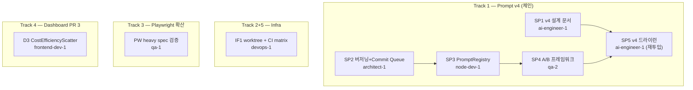

# Sprint 6 Day 3 오후 — 5 트랙 병렬 실행 계획

- **문서 번호**: 19
- **작성일**: 2026-04-14 (오후)
- **대상**: Sprint 6 Day 3 오후 잔여 시간
- **선행 문서**: `docs/01-planning/18-sprint6-day3-execution-plan.md` (오전 11 태스크, 전부 완료)
- **사용자 의견 반영**: 공통 system prompt 고도화 우선 트랙으로 배치
- **실행 모드**: **완전 자율 실행** — Y/N 승인 없이, 옵션 제시 없이, 스스로 판단

## 1. 배경

Sprint 6 Day 3 오전에 Agent Teams 11명이 11 태스크를 완료하면서 공통 system prompt v4로 진화할 수 있는 재료가 한꺼번에 모였다.

### 1.1 확보된 자산
- Round 2~5 + 검증 대전 전체 결과 (place rate / token / cost / fallback)
- `docs/03-development/19-deepseek-token-efficiency-analysis.md` (오전 C1 — burst thinking 정량화, 4축 분석)
- `docs/03-development/17~18` (GPT/Claude 에세이 보고)
- `docs/02-design/34` §17 DashScope 파라미터 (enable_thinking, thinking_budget, reasoning_content, JSON response format, 10/10 전량 확정)
- v3-tuned (DeepSeek 전용, 오전 C2) vs v3 원본 — 튜닝 포인트 명세 존재
- `scripts/playtest-s4/scenarios/*.yaml` 5 시나리오 + `NewTilePoolWithSeed` (오전 B3) — 결정론 A/B 실험 인프라 기반

### 1.2 반복 이슈
- Day 1+2, Day 3 오전 연속으로 **git commit attribution 경합** 발생
- 오전 교훈 메모리만 남기고 루트 원인 미해결
- 오후에 다시 Agent Teams 돌리면 또 겪을 것 → **인프라 개선 필수**

## 2. 5개 트랙 개요

| 트랙 | 제목 | 우선순위 | 에이전트 수 |
|------|------|---------|------------|
| 1 | 공통 System Prompt v4 설계 + 기반 구축 | 🥇 1순위 | 5명 (SP1~SP5) |
| 2 | Agent Teams 경합 인프라 개선 | 🥈 2순위 | 2명 (IF1~IF2, 병합 가능) |
| 3 | Playwright 확산 검증 | 🥉 3순위 | 1명 (qa-1) |
| 4 | 대시보드 PR 3 CostEfficiencyScatter | 🏅 4순위 | 1명 (frontend-dev-1) |
| 5 | CI rule-matrix-check job | 5순위 | 1명 (devops 병합) |

## 3. 트랙 1 — 공통 System Prompt v4 설계 + 기반 구축

### 3.1 목표
v3 프롬프트가 DeepSeek에만 `v3-tuned`로 파편화된 상태를 정돈. 4모델 공통 코어 + 모델 variant 체계로 v4 재구성. A/B 실험 인프라까지 함께 구축하여 실제 대전 없이도 가치 평가 가능.

### 3.2 제약
- **실제 LLM 호출 금지** (API 비용 보존)
- 검증은 결정론 시드 A/B 프레임워크 + 드라이런으로
- 실제 대전은 Day 4 이후 별도 결정

### 3.3 Task 분해

#### SP1 `ai-engineer-1` — v4 프롬프트 설계 문서
**구체 작업**:
1. v1/v2/v3/v3-tuned 전부 diff 분석 → 공통 코어 추출
2. 4모델 특성 매핑:
   - GPT-5-mini: 빠르고 얕음, JSON 준수 강함, 토큰 효율 1위
   - Claude Sonnet 4 (extended thinking): 느리고 신중, 안전성 높음
   - DeepSeek Reasoner: 깊게 사고, burst thinking 패턴, 비용 효율 최고
   - Ollama qwen2.5:3b: 리소스 제한, JSON 구조 준수 우수
3. 차원별 지시어 설계:
   - `thinking_budget`: 모델별 상한 차등 (DeepSeek 15000 / Claude 10000 / GPT 0 / Ollama 0)
   - `evaluation_criteria`: 보드 평가 5개 축 (타일 소모 / 런 확장 / 조커 보존 / 교환 기회 / 드로우 비용)
   - `retry_discipline`: invalid move 재요청 시 프롬프트 강화 방식
   - `json_strictness`: response_format 모델별 지원 차이
4. v4 공통 코어 + 4개 variant 드래프트
5. 산출물: `docs/03-development/20-common-system-prompt-v4-design.md`

**완료 기준**: v4 설계 문서 + v3→v4 진화 매핑 표 + 4개 variant 초안 코드 블록 + SP3 구현용 JSON 스키마 제안

#### SP2 `architect-1` — 프롬프트 버저닝 아키텍처 + Commit Queue 대안 설계
**구체 작업 A (프롬프트 버저닝)**:
1. `PromptRegistry` 클래스 설계 — id/version/model/variant/metadata 필드
2. 실험 메타데이터 저장 스키마 (prompt_id, model_id, round_id, seed, timestamp)
3. 현재 파편화 경로(`src/ai-adapter/src/adapter/deepseek/prompt-v3.ts`, `prompt-v3-tuned.ts`, OpenAI/Claude 분산) 통합 경로 제안
4. 프로파일 기반 로딩 전략 (환경변수 `PROMPT_VARIANT=v3|v3-tuned|v4|v4-thinking`)

**구체 작업 B (Commit Queue 대안)**:
1. 오전 attribution 경합(`6618610`/`deb9635`/`84e2b6e`) 사례 분석
2. Commit Queue 패턴: 단일 커미터(team-lead) + agent는 diff 패치만 제출
3. git worktree 대안과의 비교표 (공수/리스크/격리도)
4. PoC용 스크립트 인터페이스 제안

**산출물**: `docs/02-design/39-prompt-registry-architecture.md`, `docs/02-design/40-agent-commit-queue-design.md`

**완료 기준**: 두 설계 문서 완성 + SP3에 넘길 TypeScript 인터페이스 규격 명시

#### SP3 `node-dev-1` — PromptRegistry 구현 (blocked by SP2)
**구체 작업**:
1. `src/ai-adapter/src/prompts/registry.ts` 신설 (SP2 규격 기반)
2. 모든 provider 리팩터 — OpenAI/Claude/DeepSeek/DashScope 공통 `registry.load(modelId, variant)` 호출
3. 기존 v3, v3-tuned 파일을 registry 포맷으로 이식 (원본 유지)
4. v4 variant 초안도 registry에 등록 (SP1 산출물 기반)
5. 단위 테스트: registry load/cache/variant switch/fallback

**완료 기준**: 기존 456 ai-adapter 테스트 전수 PASS + registry 신규 테스트 10건 이상

#### SP4 `qa-2` — 프롬프트 A/B 실험 프레임워크 (blocked by SP3)
**구체 작업**:
1. `scripts/prompt-ab-eval.mjs` 신설 — Playtest S4 시드 × 프롬프트 matrix 실행
2. 입력: `--seeds <seed1,seed2,...>` × `--prompts <v3,v4>` × `--model <openai|claude|deepseek>`
3. 출력: 고정 시드 × 프롬프트 변종별 move 결정 비교 (실제 LLM 호출 없이 registry만 읽어서 diff)
4. 고정 시드 10~20개 사용, 프롬프트 간 "결정이 다른 지점" 카운트
5. 결과 JSON 저장 → Markdown 리포트 생성

**완료 기준**: 프레임워크 스크립트 + 최소 1회 드라이런 (v3 vs v4 × 3 모델 × 10 시드) + 리포트 샘플

#### SP5 `ai-engineer-1` (재투입) — v4 베이스라인 드라이런 + 통합 리포트
**의존**: SP1 + SP4 완료
**구체 작업**:
1. SP4 프레임워크로 v3 vs v4 비교 실행 (드라이런, 실제 LLM 호출 없이)
2. 결과 해석 — 프롬프트 변화가 어떤 결정 지점에 영향 주는지 정성 분석
3. Day 4 실제 대전 착수 가능 여부 판정 (프롬프트 자체 결함 유무)
4. 산출물: `docs/03-development/21-prompt-v4-baseline-dry-run-report.md`

**완료 기준**: 드라이런 리포트 + Day 4 대전 Go/No-Go 판정

---

## 4. 트랙 2 — Agent Teams 경합 인프라 개선

### 4.1 목표
Day 1+2, Day 3 오전 연속 재발한 git commit attribution 경합 근본 해결.

### 4.2 Task 분해

#### IF1 `devops-1` — git worktree 기반 Agent 격리 + CI rule-matrix-check job (병합)
**구체 작업 A (worktree 격리)**:
1. `.git/worktrees/agent-<name>` 생성 스크립트 — agent spawn 시 자동 생성
2. 각 worktree 내에서 agent가 작업 → 완료 시 main으로 머지 (fast-forward 우선, 충돌 시 리베이스)
3. 머지 후 worktree 자동 정리
4. PoC 스크립트: `scripts/agent-worktree-setup.sh`, `scripts/agent-worktree-merge.sh`
5. 다음 Agent Teams 가동 시 즉시 적용 가능한 가이드

**구체 작업 B (CI rule-matrix-check — 트랙 5 병합)**:
1. `.gitlab-ci.yml`에 `rule-matrix-check` job 신설
2. `docs/02-design/31-game-rule-traceability.md` 매트릭스 ↔ 실제 테스트 정합성 grep 기반 자동 검증
3. 각 ✅ 규칙에 대해: 엔진 코드 + UI 코드 + E2E 테스트 grep → 모두 hit되어야 PASS
4. 실패 시 PR block
5. PoC로 현재 매트릭스 상태(✅ 9건) 전수 통과 증명

**완료 기준**: 두 PoC 스크립트 + CI job 초안 + 문서 `docs/05-deployment/09-agent-worktree-ci-matrix-check.md`

---

## 5. 트랙 3 — Playwright 확산 검증

### 5.1 목표
오전 A4(qa-1)가 rearrangement + lifecycle suite만 192 runs × 0 flaky 증명. 다른 heavy spec도 동일 근본 해결 효과 확산되는지 확인.

### 5.2 Task 분해

#### PW `qa-1` — heavy spec 확산 검증
**구체 작업**:
1. `src/frontend/e2e/game-ui-state.spec.ts` --repeat-each=7 × 3연속 실행
2. `src/frontend/e2e/game-ui-multiplayer.spec.ts` --repeat-each=7 × 3연속 실행
3. 기타 heavy spec 1~2개 (createRoomAndStart 5회 이상 호출하는 것) 자동 식별 + 검증
4. 플레이키 잔존 시 추가 튜닝, 없으면 전수 suite 안정성 보고
5. 결과: `docs/04-testing/54-playwright-suite-stability-full-report.md`

**완료 기준**: 전체 heavy spec flaky=0 증명 또는 잔존 이슈 목록화 + 후속 티켓 제안

---

## 6. 트랙 4 — 대시보드 PR 3 CostEfficiencyScatter

### 6.1 목표
오전 C1 DeepSeek 분석에서 나온 "비용 효율 DeepSeek > GPT 29~93배" 수치를 시각화. PR 2 완료 후 자연스러운 다음 단계.

### 6.2 Task 분해

#### D3 `frontend-dev-1` — CostEfficiencyScatter 컴포넌트
**구체 작업**:
1. `src/admin/src/components/tournament/CostEfficiencyScatter.tsx` 신설
2. recharts `ScatterChart` 사용
   - X축: $/턴 (log scale)
   - Y축: place rate (%)
   - Bubble size: 총 턴 수
   - 모델별 색상 (기존 `MODEL_COLORS` 재활용)
3. **Pareto frontier line** — 비용 효율 경계선 (DeepSeek 근처 지나갈 것으로 예상)
4. Tooltip: 모델명, round, $/턴, place rate, 총 턴
5. Legend + 필터 (PR 2와 일관성 유지)
6. devops-1 제안 반영 검토: `response_flags=URX` 카운터(재시도 예산 소진) 세컨더리 축 또는 별도 섹션
7. TournamentPage에 추가 (topRight 또는 centerMain 슬롯)
8. E2E 테스트: `src/frontend/e2e/dashboard-cost-efficiency-scatter.spec.ts`
9. 데스크톱 + 모바일 스크린샷

**완료 기준**: 컴포넌트 렌더링 + E2E 5/5 PASS + 스크린샷 첨부 + 커밋 + 푸시

---

## 7. 트랙 5 — CI rule-matrix-check job

**트랙 2 IF1에 병합** — devops-1이 git worktree 설계와 함께 처리. 별도 Task 생성하지 않음.

---

## 8. 의존성 그래프

## 9. 실행 웨이브

| 웨이브 | 에이전트 | 조건 |
|-------|---------|------|
| **1차** | ai-engineer-1 (SP1), architect-1 (SP2), devops-1 (IF1+CI), qa-1 (PW), frontend-dev-1 (D3) | **즉시 착수 (5명)** |
| **2차** | node-dev-1 (SP3) | SP2 완료 후 |
| **3차** | qa-2 (SP4) | SP3 완료 후 |
| **4차** | ai-engineer-1 재투입 (SP5) | SP1 + SP4 완료 후 |

## 10. 자율 실행 원칙 (모든 agent에게 강제 주지)

### 🚨 절대 금지
- ❌ Y/N 승인 질문
- ❌ "이렇게 할까요, 저렇게 할까요?" 옵션 제시
- ❌ "확인 부탁드립니다" "괜찮을까요?" 류의 대기형 질문
- ❌ 결정 보류 후 team-lead에게 판단 위임
- ❌ 작업 시작 전 "시작해도 될까요?" 확인

### ✅ 필수
- ✅ 모든 판단은 자율적으로, 근거와 함께 즉시 결정
- ✅ 애매한 지점도 스스로 합리적 선택 내리고 진행
- ✅ 에러 발생 시 블로커 태스크 만들고 다른 영역으로 우회하거나 대안 경로 즉시 탐색
- ✅ 결정 내용은 산출물 문서에 근거와 함께 기록 (사후 검토 가능)
- ✅ 완료 후에만 SendMessage로 team-lead에게 결과 보고

### 📋 CLAUDE.md 자율 실행 정책 준수
- 사용자 지시 "자동 진행 = 최대 자율" (feedback_automation_means_option_a.md)
- "승인 요청 금지" (feedback_no_confirmation_prompts.md)
- 실수 리스크보다 **속도와 일관성**이 우선

## 11. Git 운영 규칙 (오전 경합 교훈 반영 — 임시 적용)

Track 2 IF1이 worktree 구조 완성 전까지는:
1. 각 agent는 `git add <specific-file-path>` 만 사용 (`-A` 금지)
2. 커밋 메시지 prefix로 task ID 명시 (예: `(SP1)`, `(IF1)`)
3. `git commit` 실행 전 `git status --short`로 staged 파일 재확인
4. git index lock 충돌 시 3초 wait 후 재시도 (최대 3회)
5. 동일 파일 충돌 시 절대 `git reset` 또는 `git checkout --` 금지 → 블로커 태스크 생성

## 12. 산출물 예상 (오후 전체)

### 신규 문서
- `docs/01-planning/19-sprint6-day3-afternoon-tracks.md` (본 문서)
- `docs/03-development/20-common-system-prompt-v4-design.md` (SP1)
- `docs/02-design/39-prompt-registry-architecture.md` (SP2)
- `docs/02-design/40-agent-commit-queue-design.md` (SP2)
- `docs/03-development/21-prompt-v4-baseline-dry-run-report.md` (SP5)
- `docs/05-deployment/09-agent-worktree-ci-matrix-check.md` (IF1)
- `docs/04-testing/54-playwright-suite-stability-full-report.md` (PW)

### 신규 코드
- `src/ai-adapter/src/prompts/registry.ts` + 신규 v4 variant 파일 × 4
- `scripts/prompt-ab-eval.mjs`
- `scripts/agent-worktree-setup.sh`, `scripts/agent-worktree-merge.sh`
- `.gitlab-ci.yml` rule-matrix-check job 추가
- `src/admin/src/components/tournament/CostEfficiencyScatter.tsx`
- E2E 테스트 1~2건

### 커밋 예상
- **6~8건** (1차 웨이브 5건 + 2~3차 웨이브 2~3건)

## 13. 참조

- `docs/01-planning/18-sprint6-day3-execution-plan.md` — 오전 실행 계획 + 결과
- `docs/03-development/19-deepseek-token-efficiency-analysis.md` — C1 분석 (SP1 입력)
- `docs/02-design/34-dashscope-qwen3-adapter-design.md` §17 — C1 파라미터 (SP1 입력)
- `work_logs/sessions/2026-04-14-01.md` — 오전 세션 종료 보고
