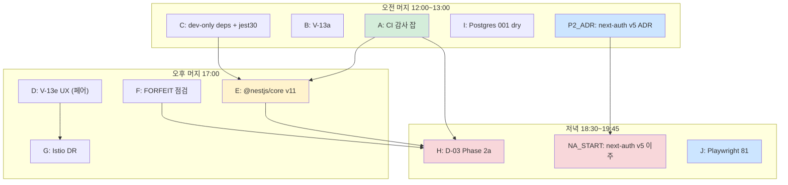

# Day 3 (2026-04-24) 집행 계획서 — Production 기준 Sprint 7 전면 완결 착수

- **문서**: `docs/01-planning/day3-execution-plan.md`
- **Sprint**: 7 / **Day**: 3 (Sprint 7 Week 1 Day 3)
- **Owner**: 애벌레 (PM/Dev, 1인)
- **상태**: 집행 전 (사전 계획 — Production 기준 재작성)
- **작성**: 2026-04-23 Day 2 마감 직후
- **재작성**: 2026-04-23 오후 (사용자 지시 — 이관 없음, Production 기준)
- **대원칙**: **내일까지 프로그램 외 전부 완료**. **프로그램은 오류 0 까지 반복**. **UI 수정은 architect + frontend-dev 페어 의무**.

---

## 0. 재작성 근거 (2026-04-23 오후 사용자 지시)

1. 이관 / WONTFIX / Sprint 8 후보 / Week 2 이월 표현 전면 삭제 → Sprint 7 내 전부 처리
2. Scope 전제 변경: Production 기준. dev-only low 도 해소 대상
3. 일정 전제 변경:
   - **프로그램 외 (문서·인프라·감사·의존성)**: Day 3 ~ Day 4 오전 사이 **완료 목표 확정**
   - **프로그램 (기능·메이저 bump·마이그레이션·Auth 이주)**: **오류 0 까지 재시도** (Sprint 7 Week 2 마감까지)
4. 본 계획서의 SP 상한 삭제. 성공 기준 단일화: "A = Production 기준 해소 진행". B/C 단계 구분 삭제.

---

## 1. Executive Summary (재작성 버전)

### 1.1 Day 2 실측 속도 (재확인)
- **Day 2 결과**: 5 PR 머지 (32분 구간), 8.5 SP 소화, 1.5h 집중
- **환산 속도**: 5.7 SP/h (architect 사전 분석 효과). 일반일 평균 2.0 SP/h.
- **Day 3 의 장애물**: 신규 설계·조사 항목 비중이 오늘보다 크다 (next-auth ADR, Phase 2a shadow). 실속도는 2.0~3.5 SP/h 예상.

### 1.2 Day 3 Scope (Production 기준, 이관 없음)

| 구분 | 항목 | SP | 기한 |
|---|---|---|---|
| **문서/인프라 (반드시 Day 3~ Day 4 오전)** | A, C, I, G, J, P2_ADR | 17 SP | Day 4 오전 까지 |
| **프로그램 (오류 0 반복)** | B, D, E, F | 13 SP | 오류 0 까지 (Day 3~ 반복) |
| **프로그램 Day 3 착수 후 반복** | H (Phase 2a), NA (next-auth v5 이주 시작) | 16 SP | Sprint 7 Week 2 마감 |
| **Day 3 합계 착수 범위** | | **46 SP** | |

### 1.3 성공 기준 (단일)

- Day 3 종료 시점 (20:00) 기준:
  - 문서/인프라 17 SP 중 **최소 13 SP 머지** (80%+)
  - 프로그램 13 SP 중 **최소 8 SP 머지** 또는 **명확한 revert+재시도 계획 수립**
  - H (Phase 2a shadow read) **관찰 시작** 또는 **다음 재시도 일정 확정**
  - NA (next-auth v5 이주 ADR) **머지**
- **모든 Playwright/Jest/Go 테스트 회귀 0**

**Production 기준이므로 "SP 40 이상이면 S, 30 이상이면 A" 와 같은 단계 구분은 삭제**. 해소가 완료되지 않으면 **다음 날 재시도**.

---

## 2. Day 3 작업 매트릭스 (Production 기준)

### 2.1 대상 12건 (Day 3 착수 기준, Sprint 7 전체는 sprint7-decisions.md §3 참조)

| ID | 작업 | SP | 리스크 | 분류 | 기한 구분 |
|---|---|---|---|---|---|
| **A** | CI/CD 감사 잡 3건 (sca-npm-audit + sca-govulncheck + weekly-dep-audit) | 5 | LOW | 인프라 | 내일까지 |
| **B** | V-13a `ErrNoRearrangePerm` orphan 리팩터 | 2 | LOW | 프로그램 | 오류 0 |
| **C** | dev-only deps 3건 (@typescript-eslint + @nestjs/cli + jest+jest-env-jsdom 동반) | 3 | LOW-MED | 의존성 | 내일까지 |
| **D** | V-13e 조커 재드래그 UX (**architect + frontend-dev 페어**) | 3 | MED | 프로그램/UI | 오류 0 |
| **E** | @nestjs/core v11 + file-type transitive bump | 7 | MED-HIGH | 의존성 | 오류 0 (반복) |
| **F** | FORFEIT 경로 완결성 점검 (Issue #47 후속) | 3 | MED | 프로그램 | 오류 0 |
| **G** | Istio DestinationRule 세밀 조정 | 2 | LOW | 인프라 | 내일까지 |
| **H** | D-03 Phase 2a shadow read (rooms PostgreSQL) | 8 | **HIGH** | 프로그램/인프라 | 오류 0 (Week 2 까지 반복) |
| **I** | PostgreSQL 001 마이그레이션 staging dry-run | 2 | MED | 인프라 | 내일까지 |
| **J** | Playwright 전수 회귀 + 회귀 보고서 81 | 2 | LOW | QA | 내일까지 (저녁) |
| **P2_ADR** | next-auth v5 (Auth.js) 이주 ADR 선행 | 3 | LOW (ADR) | 문서 | 내일까지 |
| **NA_START** | next-auth v5 이주 실구현 착수 (ADR 승인 후) | 8 | **HIGH** | 프로그램/Auth | 오류 0 (Week 2 까지 반복) |
| **합계 Day 3** | | **48 SP** | | | |

**제외**: Day 3 에 시작하지 않는 항목은 sprint7-decisions.md §3 (H2, P3, M1, M2, DS, Istio5.2, PRB, MODEL) 로 이관. 하지만 Sprint 7 밖으로 는 **이관 없음**.

### 2.2 리스크 레벨별 분류 및 완화책 (Production 기준)

| Risk | 항목 | 완화책 |
|---|---|---|
| **HIGH** | H (Phase 2a shadow read) | 저녁 블록 시작. ai-adapter 안정 후. drift 모니터링 1일 후 Phase 2b/2c. **오류 감지 시 즉시 중단 후 익일 재시도** (Week 2 내 반드시) |
| **HIGH** | NA_START (next-auth v5 이주 실구현) | ADR 승인 후에만 착수. frontend 인증 Playwright 스펙 전수 회귀 필수. 실패 시 revert 후 재설계 |
| **MED-HIGH** | E (@nestjs/core v11) | 오후 초반. Jest 회귀 1건 발생 시 revert. **Sprint 7 내 재시도 의무** (dev-only WONTFIX 금지) |
| **MED** | D (V-13e), F (FORFEIT), I (마이그레이션), C (jest 30 동반) | 각 단일 PR. 실패 시 독립 revert + 재시도 |
| **LOW** | A, B, G, J, P2_ADR | 병렬 실행 |

### 2.3 "이관 없음" 원칙의 실무 적용

- 이전 계획: "Jest 30 동반 bump 리스크 → Week 2 후반 WONTFIX 고려"
- 재작성 후: Jest 30 동반 bump 는 **Day 3 오전 병렬 트랙 C 에서 착수**. 회귀 발생 시 단독 revert 하되 **Day 5 오전 재시도 예정** (Sprint 7 내 반드시 해소)
- 이전 계획: "Phase 2b/2c 는 WONTFIX Week 3 이월 검토"
- 재작성 후: Phase 2b/2c 는 Day 4 ~ Day 6 내 반드시 완료. drift 관찰 결과에 따라 Day 순서만 조정

---

## 3. 시간표 (블록 기반, 09:00 ~ 20:00, Production 기준)

```mermaid
gantt
    title Day 3 (2026-04-24) 11h 집행 Gantt (Production 재작성)
    dateFormat HH:mm
    axisFormat %H:%M

    section 오전 09:00-13:00 병렬 5트랙
    A CI/CD 감사 잡        :a1, 09:00, 180m
    B V-13a orphan         :b1, 09:00, 120m
    C dev-only deps (+jest30) :c1, 09:00, 180m
    D V-13e UX (페어)       :d1, 09:00, 240m
    I Postgres 001 dry     :i1, 11:00, 60m
    P2_ADR next-auth v5    :adr, 10:00, 180m

    section 점심 13:00-14:00
    점심+산책               :lunch, 13:00, 60m

    section 오후 14:00-18:00
    E @nestjs/core v11      :e1, 14:00, 150m
    F FORFEIT 점검           :f1, 14:00, 120m
    휴식 15분 ×2            :rest1, 16:00, 15m
    G Istio DR               :g1, 16:30, 60m
    오후 머지 일괄            :merge1, 17:00, 60m

    section 저녁 18:00-20:00
    저녁식사                  :dinner, 18:00, 30m
    H Phase 2a shadow        :h1, 18:30, 75m
    NA_START 이주 착수        :na, 19:00, 60m
    K8s smoke + J Playwright  :smoke, 19:45, 15m
```



### 3.1 오전 (09:00 ~ 13:00) — 독립 5+1 트랙 병렬 (Production 기준)

| Worktree | 에이전트 | 항목 | 예상 종료 | 분류 |
|---|---|---|---|---|
| `worktree-a` | go-dev + devops | **A** CI/CD 감사 잡 (.gitlab-ci.yml) | 12:00 | 내일까지 |
| `worktree-b` | go-dev (별도 세션) | **B** V-13a orphan 리팩터 | 11:00 | 오류 0 |
| `worktree-c` | node-dev + frontend-dev | **C** dev-only deps 3건 + jest 30 동반 bump | 12:00 | 내일까지 |
| `worktree-d` | **architect + frontend-dev 페어** | **D** V-13e 조커 재드래그 UX | 13:00 | 오류 0 |
| main (11:00~) | devops | **I** Postgres 001 staging dry-run | 12:00 | 내일까지 |
| 병렬 ADR (10:00~) | architect + security | **P2_ADR** next-auth v5 이주 ADR | 13:00 | 내일까지 |

**오전 머지 목표**: A, B, C, I, P2_ADR → 5 PR + 1 ADR 문서 (약 15 SP)

**D 는 오전 내 머지 권장하나 페어 리뷰 시간 포함 시 오후 이월 허용**

### 3.2 점심 (13:00 ~ 14:00) — 필수 휴식

- 식사 30분 + 산책/음악 30분
- **화면 완전 차단**. 카톡/메일 금지
- 번아웃 방지선. Production 기준이라도 휴식은 단축 금지

### 3.3 오후 (14:00 ~ 18:00) — 중간 난이도 + 머지 일괄

| 시간 | 트랙 | 항목 | 비고 |
|---|---|---|---|
| 14:00~16:30 | 메인 | **E** @nestjs/core v11 메이저 | Jest 전수 통과 필수. 실패 시 revert → Day 5 오전 재시도 |
| 14:00~16:00 | 병렬 | **F** FORFEIT 경로 점검 | 2h |
| 16:00~16:15 | 휴식 | 15분 | 필수 |
| 16:30~17:30 | 여유 | **G** Istio DR 조정 | 내일까지 기한 |
| 17:00~18:00 | 머지 | 오후 PR 일괄 머지 + main pull | E/F/D/G 순 |

**오후 머지 목표**: D (오전 못 끝냈으면), E, F, G → 최대 4 PR (약 13 SP)

### 3.4 저녁 (18:00 ~ 20:00) — HIGH risk + 마감

| 시간 | 항목 | 비고 |
|---|---|---|
| 18:00~18:30 | 저녁식사 | 30분 |
| 18:30~19:45 | **H** D-03 Phase 2a shadow read | 1.25h. 오류 시 중단 후 Day 4 재시도 |
| 19:00~20:00 | **NA_START** next-auth v5 이주 실구현 착수 (ADR 승인 후) | 병렬. 오류 시 Day 4 이후 반복 |
| 19:00~20:00 | **J** Playwright 전수 + 보고서 81 | qa 병렬 세션 |
| 19:45~20:00 | K8s smoke + main 최종 pull | 마감 점검 |

**저녁 머지 목표**: H, NA_START, J → 2~3 PR (약 17 SP 착수)

### 3.5 식사/휴식 총계

- 점심 60분 (필수)
- 오후 휴식 15분 × 2 = 30분
- 저녁 30분
- **총 휴식 2h** (목표 유지. 단축 금지)

---

## 4. 에이전트 투입 매트릭스 (Production 재편)

| 에이전트 | 모델 | Day 3 투입 | 담당 |
|---|---|---|---|
| **pm** | Opus 4.7 xhigh | 1 세션 | 이 계획서 + 마감 데일리 |
| **architect** | Opus 4.7 xhigh | **3~4 세션** | P2_ADR 설계 + D 페어 + E/H 블로커 대기 |
| **ai-engineer** | Opus 4.7 xhigh | 0 | 대기 |
| **security** | Opus 4.7 xhigh | 2 세션 | A 검토 + P2_ADR 리뷰 |
| **qa** | Opus 4.7 xhigh | 2 세션 | J + 각 PR 회귀 게이트 |
| **go-dev** | Sonnet 4.6 | **3 세션** (병렬) | A + B + F |
| **node-dev** | Sonnet 4.6 | **2 세션** (시차) | C + E |
| **frontend-dev** | Sonnet 4.6 | **2 세션** | D 페어 + NA_START |
| **devops** | Sonnet 4.6 | **3 세션** | A 지원 + I + H K8s smoke |
| **designer** | Sonnet 4.6 | 0 | 미사용 |

**총 세션**: 약 **16~18 개**. 이전 계획 (12~14) 대비 증가는 페어 코딩(D) + ADR 동시 진행(P2_ADR) + NA_START 착수 반영.

**페어 코딩 세션 운영 (D)**:
1. architect 가 먼저 설계 세션 (30분) → ADR 코멘트 또는 PR description 에 근거 기록
2. frontend-dev 가 구현 (2~3h)
3. architect 가 PR 리뷰 + 회귀 체크리스트 검증 후 approve → 머지

---

## 5. PR 머지 순서 + 의존성 (재편)

### 5.1 머지 순서 (권장)



### 5.2 의존성 주요 포인트

1. **A → E**: CI sca-npm-audit 가 머지되어야 E 의 audit 게이트 확인 가능
2. **C → E**: @nestjs/cli (dev) 와 @nestjs/core 는 호환 쌍. C 먼저 머지
3. **E → H**: ai-adapter 재배포 안정 (30분 관찰) 후 shadow read
4. **D → G**: V-13e UX 회귀 없음 확인 후 Istio DR 조정
5. **F → H**: FORFEIT 경로는 rooms 테이블 업데이트 경로에 연결
6. **P2_ADR → NA_START**: ADR 승인 이후에만 이주 실구현 착수

### 5.3 K8s smoke 게이트

- **12:00 smoke**: 오전 머지 후
- **17:30 smoke**: 오후 머지 후
- **19:45 smoke**: 저녁 H + NA_START 착수 후 **필수**

---

## 6. 성공 기준 + 실패 기준 + 오류 0 반복 절차

### 6.1 성공 기준 (Production 기준, 단일)

- [ ] 문서/인프라 6건 (A, C, I, G, J, P2_ADR) 전부 머지 또는 Day 4 오전 완료 예약
- [ ] 프로그램 4건 (B, D, E, F) 중 **B, D, F 는 Day 3 완료**. E 는 Day 3 완료 **또는 명확한 재시도 일정 (Day 5 오전)**
- [ ] H (Phase 2a) 관찰 시작 또는 Day 4 재시도 확정
- [ ] NA_START ADR 머지 + 이주 실구현 첫 커밋 완료 또는 Day 4 재시도 확정
- [ ] Playwright 전수 PASS (기존 flaky 허용, 신규 FAIL 0)
- [ ] Jest 599 → 599 유지 (또는 신규 추가분 포함 증가)
- [ ] K8s smoke 19:45 PASS
- [ ] 번다운 차트 업데이트

### 6.2 실패 기준 (즉시 revert, **이관 금지**)

| 트리거 | 대응 | 재시도 일정 |
|---|---|---|
| Jest 599 → 598 이하 | E 단독 revert | **Day 5 오전 재시도** (Sprint 7 내 오류 0) |
| Playwright 신규 FAIL ≥ 2 | 원인 PR 식별 → revert | 같은 날 저녁 또는 익일 오전 재시도 |
| K8s Pod CrashLoopBackoff | 최근 1h PR 순차 revert (LIFO) | 원인 분리 후 당일 재시도 |
| Phase 2a drift > 5% | shadow read 비활성 | Day 4 원인 분석 + 재시도 |
| next-auth v5 이주 회귀 | NA_START revert | Day 4~5 재설계 후 재시도 |
| **번아웃 조짐** (집중도 60% 이하, 30분+ 정체) | 즉시 마감 | Day 4 이후 재시도 (프로그램 외는 Day 4 오전 마감) |

### 6.3 오류 0 반복 절차 (프로그램 항목)

1. `gh pr revert <NUMBER>` 로 revert PR 생성
2. 즉시 머지 (LIFO)
3. K8s 재배포: `kubectl rollout undo deployment/<svc> -n rummikub`
4. `work_logs/incidents/2026-04-24-revert-<PR>.md` 생성
5. 원인 분석 → 재시도 일정 sprint7-decisions.md §3 에 반영
6. **Sprint 7 Week 2 마감 (2026-05-02) 까지 재시도 지속**
7. 마감 당일에도 미해소 시 **Sprint 7 연장** 판단 (Sprint 밖 이월 금지)

---

## 7. 번아웃 리스크 완화 설계 (Production 기준에서도 유지)

### 7.1 왜 이게 최우선 리스크인가

- Day 2 속도 (5.7 SP/h) 는 architect 사전 준비 효과. Day 3 는 신규 설계·조사 비중 큼
- Production 재편으로 총 Scope 가 77.5 SP 로 확대 → **속도 착시 위험 증가**
- 사용자 Preference: "딸깍 프로젝트 아님, 천천히 확실하게"
- 1인 개발 11h 집중 한계. 중단 지점 설계 필수

### 7.2 완화 설계

1. **점심 60분 필수**. 30분으로 단축 금지
2. **오후 휴식 15분 × 2** 고정. 스킵 금지
3. **저녁 H 는 최대 1.25h 박스**. 넘으면 중단 → Day 4 재시도
4. **집중도 셀프 체크 3시점**: 12:00, 16:00, 19:00
5. **실패 기준 6.2 번아웃 조건 엄수**
6. **내일 밤 야근 금지**. 20:00 이후 작업 시 Day 4 휴식 반영
7. **Production 기준 유지의 의미**: "오늘 못 끝내면 내일 재시도" 는 허용. "Sprint 밖 이관" 은 금지. 이 차이를 명확히 구분

---

## 8. 번다운 차트 (Production 재편)

### 8.1 Sprint 7 전체 번다운

```
SP 잔여 (총 77.5 SP: Day 12 3 + Day 2 P1 8.5 + 내일까지 17 + 오류0 49)
  ^
77 |█ Sprint 7 시작 (Day 1 아침)
  |
70 |████ Day 12 마감 (rooms Phase 1)
  |
66 |██████ Day 2 마감 (P1 8.5 소화, 66 잔여)
  |
50 |██████████ Day 3 목표 (13~15 SP 소화, ~50 잔여)
  |
40 |████████████ Day 4 목표 (문서/인프라 완전 소화, 프로그램 반복)
  |
20 |██████████████████ Day 5~6 목표 (프로그램 오류 0 집중)
  |
 0 |_____________________________________ Week 2 마감 (2026-05-02)
     D1  D2  D3  D4  D5  D6  D7  W2종료
                ↑ 이 계획서 목표 지점
```

**Day 3 성공 시**: Sprint 7 전체의 약 36% 소화 (누적). 내일까지 (Day 4 오전) 약 48% 목표.

**Sprint 7 예상 종료**: Week 2 마감 (2026-05-02) 또는 **오류 0 까지 연장**.

### 8.2 일자별 목표 (Production 재편)

| 일자 | 목표 SP | 누적 % | 비고 |
|---|---|---|---|
| Day 2 (완료) | 8.5 | 15% | P1 전량 |
| **Day 3** | 13~15 | 33% | 내일까지 (문서/인프라) + 프로그램 일부 |
| **Day 4** | 15~18 | 52% | 내일까지 완결 목표 (문서/인프라 100%) |
| Day 5 | 10~12 | 67% | 프로그램 오류 0 반복 |
| Day 6 | 8~10 | 80% | 프로그램 오류 0 반복 |
| Day 7 | 5~8 | 90% | H2, P3, M1, M2 |
| Week 2 마감 | 7~10 | 100% | MODEL, PRB 마지막 |

---

## 9. 다음날 (Day 4, 2026-04-25) 준비도

### 9.1 Day 3 성공 시 Day 4 예정

1. **문서/인프라 100% 완결 마감** (Day 3 잔여 + 회귀 보고서)
2. **Phase 2a drift 리뷰** → Phase 2b 착수 판단
3. **next-auth v5 이주 실구현 계속** (NA_START 연장)
4. **E @nestjs/core v11 회귀 발생 시 재시도**
5. **Playwright flaky 재분류** (J 결과 기반)

### 9.2 Day 3 미달 시 Day 4 예정

1. **내일까지 기한 문서/인프라** 잔여 완주 (A/C/I/G/J/P2_ADR 누락분)
2. 프로그램 B/D/F 잔여 완주
3. Phase 2a 는 Day 5 로 재배치
4. 번아웃 회복 우선
5. **Sprint 7 밖 이관은 여전히 금지**

### 9.3 Sprint 7 연장 판단 기준

- Week 2 마감 (2026-05-02) 에 H/H2/NA/P3 중 **1건 이상 오류 잔존** 시 Sprint 7 연장
- 연장 범위: 오류 0 까지. 최대 1주 추가 검토 (Sprint 8 시작 지연 감수)

---

## 10. 체크리스트 (Day 3 아침 09:00 직전)

### 10.1 사전 점검 (08:30~09:00)

- [ ] architect 가 사전 작성 중인 문서 5건 (79, 80, 49, 50, 51) 완료 확인
- [ ] main 최신 pull (Day 2 머지분 반영)
- [ ] K8s 전체 서비스 Running 확인 (`kubectl get pods -n rummikub`)
- [ ] Jest/Go 베이스라인 테스트 수 재확인 (회귀 기준점 599 / 530 / 201)
- [ ] next-auth v5 ADR 준비 자료 — `docs/04-testing/78` §5.1 검토 완료
- [ ] 번아웃 셀프 진단 (어제 수면 6h 이상?)

### 10.2 작업 중 (시간별)

- [ ] 12:00 오전 머지 확인 + 점심 + smoke
- [ ] 16:00 오후 휴식
- [ ] 17:00 오후 머지 확인
- [ ] 17:30 smoke
- [ ] 19:45 저녁 smoke + 마감

### 10.3 마감 (20:00)

- [ ] 데일리 로그 작성 (`/daily-close`)
- [ ] 바이브 로그 작성 (에세이 톤)
- [ ] `docs/01-planning/sprint7-decisions.md` Day 3 섹션 추가
- [ ] 번다운 차트 업데이트
- [ ] Day 4 TODO 갱신
- [ ] Sprint 7 내 이관 여부 재확인 (0 건이어야 함)

---

## 11. 요약 (Production 기준, 300자)

Day 3 에 문서/인프라 6건 (A, C, I, G, J, P2_ADR, 17 SP) 을 **내일까지 전량 완료** 하고, 프로그램 7건 (B, D, E, F, H, NA_START, 31 SP) 은 **오류 0 까지 반복** 한다. UI 변경 (D) 은 architect + frontend-dev **페어 의무**. next-auth v5 이주는 ADR 부터 시작하여 Sprint 7 내 종료. Scope 밖 이관 금지. 실패 시 단독 revert 후 Sprint 7 Week 2 마감 (2026-05-02) 까지 반복. 점심 60분 + 오후 휴식 30분 필수. 번아웃 조짐 시 즉시 마감, 다음 날 재시도. Production 기준이지만 번아웃 방지선은 유지.
