# 시스템 아키텍처 설계 (System Architecture)

## 1. 전체 아키텍처 개요

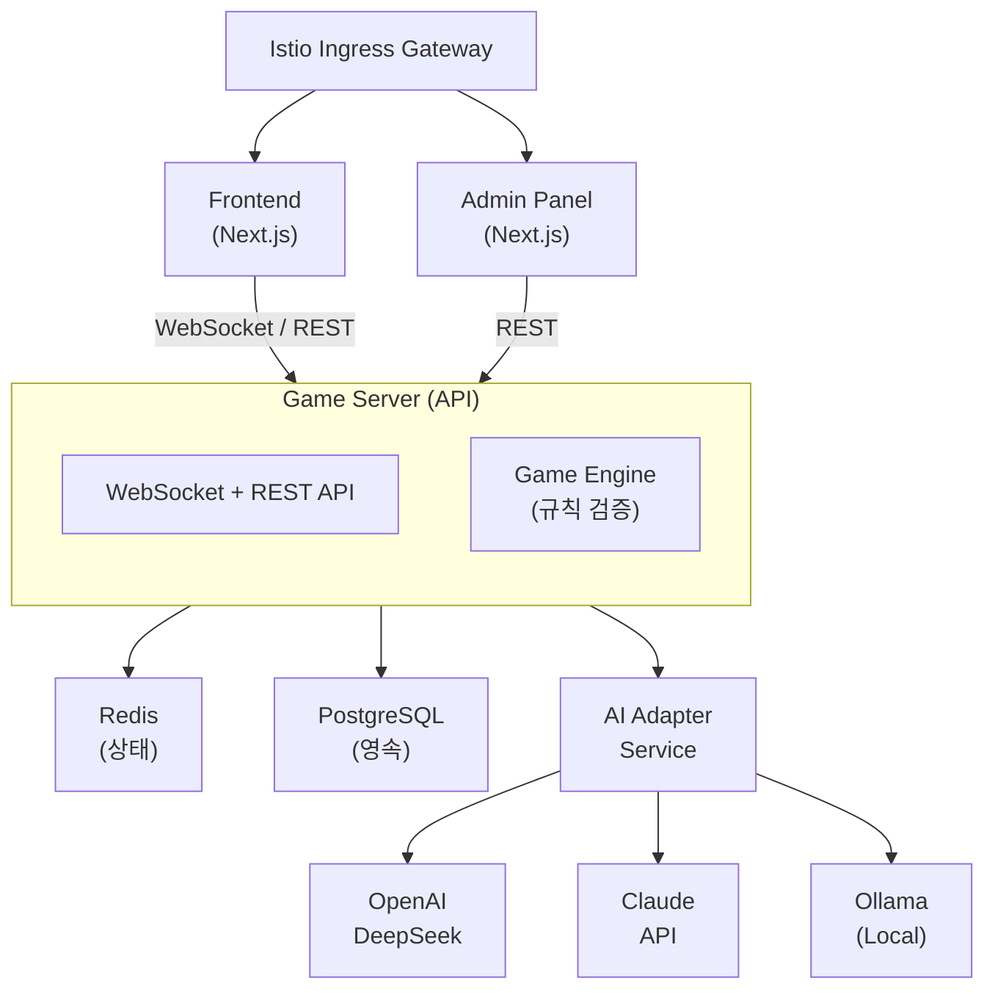

## 2. 서비스 구성

| 서비스 | 역할 | 포트 | 기술 |
|--------|------|------|------|
| frontend | 게임 UI | 3000 | Next.js |
| game-server | 게임 로직, API, WebSocket | 8080 | Go (gin + gorilla/websocket) |
| ai-adapter | LLM 호출 추상화 | 8081 | NestJS (TypeScript) |
| admin | 관리자 대시보드 | 3001 | Next.js |
| redis | 게임 상태 캐시 | 6379 | Redis 7 |
| postgres | 유저, 전적, 로그 영속 저장 | 5432 | PostgreSQL 16 |
| ollama | 로컬 LLM 서빙 | 11434 | Ollama |

## 3. 핵심 설계 원칙

### 3.1 Stateless Game Server
- 게임 상태는 Redis에 저장
- Pod 재시작 시에도 게임 유지
- 수평 확장 가능
- **수평 확장 시 WebSocket 전략**: 현재 replicas:1이므로 단일 인스턴스에서 모든 WebSocket 연결을 처리한다. 수평 확장(replicas > 1) 시에는 Redis Pub/Sub 기반 메시지 브로커를 도입하여 인스턴스 간 WebSocket 이벤트를 동기화해야 한다.

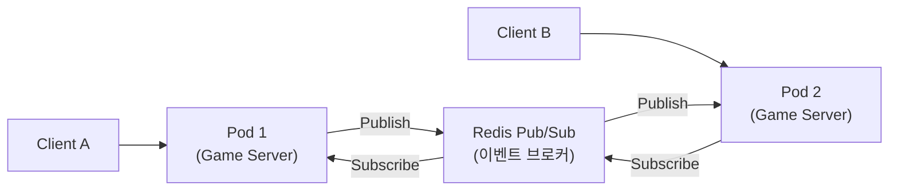

### 3.2 LLM 신뢰 금지 원칙
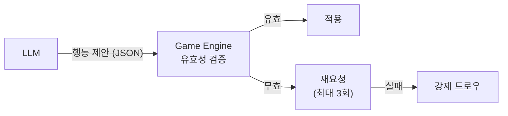

### 3.3 AI Adapter 분리
- Game Engine은 특정 LLM에 의존하지 않음
- 공통 인터페이스를 통해 모델 교체 가능
- Istio VirtualService로 모델별 트래픽 분배 가능

### 3.4 이벤트 기반 턴 관리
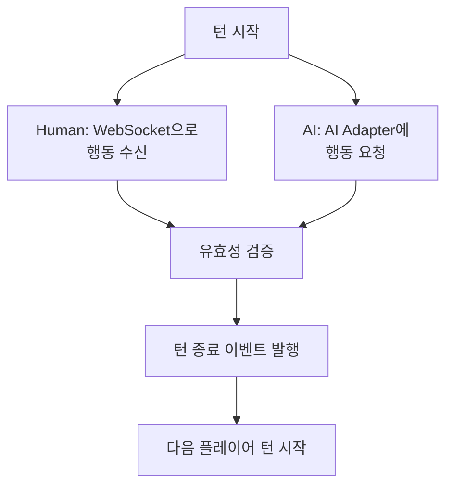

## 4. 데이터 흐름

### 4.1 Human 플레이어 턴
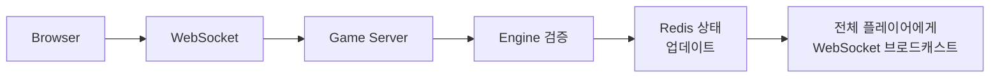

### 4.2 AI 플레이어 턴
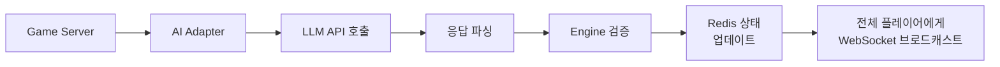

## 5. 인증/인가 아키텍처

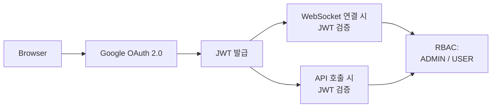

## 6. Kubernetes 배포 아키텍처

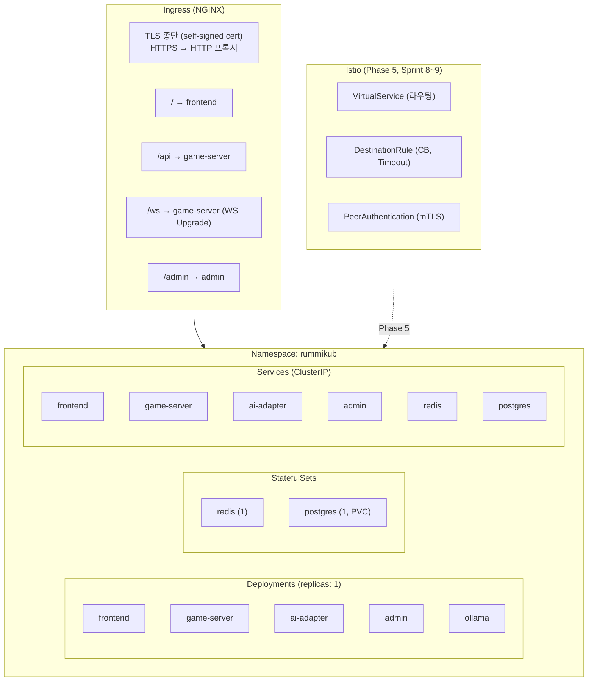

## 7. 외부 시스템 연동

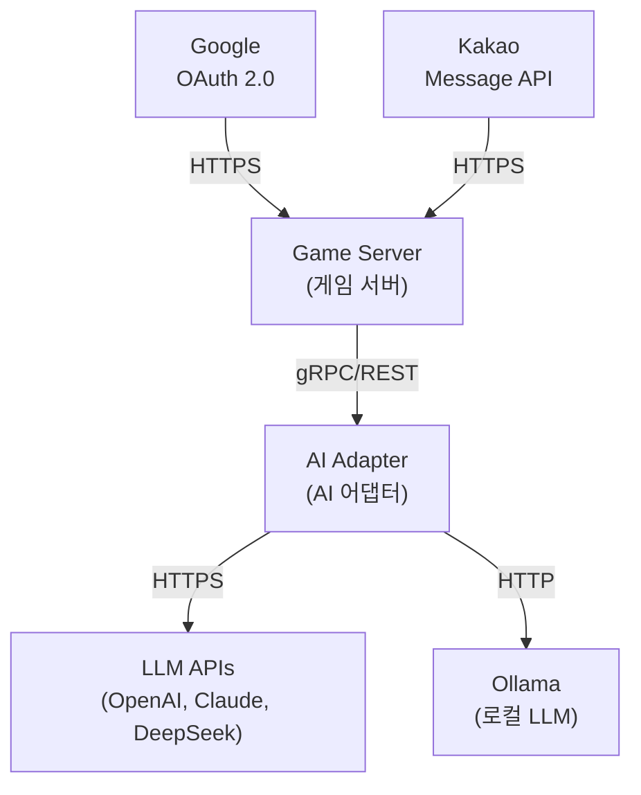

> **참고**: LLM API 호출은 Game Server가 직접 수행하지 않는다. 반드시 AI Adapter를 경유하여 모델 무관 인터페이스로 통신한다.

## 8. 게임 상태 Enum

모든 서비스에서 동일한 게임 상태 값을 사용한다.

| 상태 | 설명 |
|------|------|
| WAITING | Room 생성 후 플레이어 입장 대기 |
| PLAYING | 게임 진행 중 |
| FINISHED | 정상 종료 (승자 확정) |
| CANCELLED | 비정상 종료 (강제 종료, 인원 부족) |

> CREATED 상태는 사용하지 않는다. Room 생성 시 즉시 WAITING 상태로 진입한다.

## 9. 백엔드 기술 결정 (폴리글랏 구성)

### 9.1 결정 사항

| 서비스 | 언어/프레임워크 | 결정 이유 |
|--------|---------------|-----------|
| game-server | **Go** (gin + gorilla/websocket + GORM) | WebSocket 동시성, 게임 엔진 성능, 낮은 메모리 사용 |
| ai-adapter | **NestJS** (TypeScript) | LLM API JSON 조작 편의, 프롬프트 템플릿 관리, 풍부한 HTTP 생태계 |

> **결정일**: 2026-03-11 (Sprint 0)

### 9.2 폴리글랏 아키텍처 개요

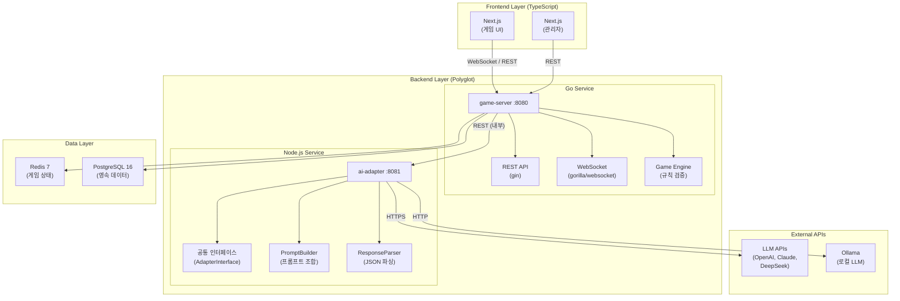

### 9.3 서비스별 기술 스택 상세

#### game-server (Go)

| 항목 | 기술 | 설명 |
|------|------|------|
| HTTP Framework | gin | 경량 고성능 REST 프레임워크 |
| WebSocket | gorilla/websocket | 표준 WebSocket 라이브러리 |
| ORM | GORM | Go 표준 ORM, PostgreSQL 지원 |
| Redis Client | go-redis/redis | Redis 7 호환 클라이언트 |
| JWT | golang-jwt/jwt | Google OAuth JWT 검증 |
| Logger | zap | 구조화 JSON 로그 (Uber) |
| Config | viper | 환경변수/설정 파일 관리 |
| Test | testing + testify | 표준 테스트 + assertion |

```
src/game-server/
├── cmd/
│   └── server/
│       └── main.go              # 엔트리포인트
├── internal/
│   ├── handler/                 # HTTP/WS 핸들러 (Controller 역할)
│   │   ├── room_handler.go
│   │   ├── game_handler.go
│   │   └── ws_handler.go
│   ├── service/                 # 비즈니스 로직 (Service 역할)
│   │   ├── room_service.go
│   │   ├── game_service.go
│   │   └── turn_service.go
│   ├── engine/                  # 게임 엔진 (규칙 검증)
│   │   ├── validator.go
│   │   ├── tile.go
│   │   ├── group.go
│   │   └── run.go
│   ├── repository/              # 데이터 접근 (Repository 역할)
│   │   ├── redis_repo.go
│   │   └── postgres_repo.go
│   ├── model/                   # 도메인 모델
│   │   ├── game.go
│   │   ├── player.go
│   │   └── tile.go
│   ├── middleware/               # 미들웨어 (JWT, CORS, 로깅)
│   │   ├── auth.go
│   │   └── logger.go
│   └── config/                  # 설정
│       └── config.go
├── go.mod
├── go.sum
└── Dockerfile
```

#### ai-adapter (NestJS)

| 항목 | 기술 | 설명 |
|------|------|------|
| Framework | NestJS | TypeScript 서버 프레임워크 |
| HTTP Client | axios | LLM API 호출 |
| Validation | class-validator | DTO 검증 |
| Logger | nestjs/common Logger | 구조화 로그 |
| Test | jest | 단위/통합 테스트 |
| Config | @nestjs/config | 환경변수 관리 |

```
src/ai-adapter/
├── src/
│   ├── app.module.ts
│   ├── main.ts
│   ├── adapter/                 # LLM 어댑터
│   │   ├── adapter.interface.ts
│   │   ├── openai.adapter.ts
│   │   ├── claude.adapter.ts
│   │   ├── deepseek.adapter.ts
│   │   └── ollama.adapter.ts
│   ├── prompt/                  # 프롬프트 빌더
│   │   ├── prompt.builder.ts
│   │   └── persona.templates.ts
│   ├── parser/                  # 응답 파서
│   │   └── response.parser.ts
│   ├── dto/                     # 요청/응답 DTO
│   │   ├── move-request.dto.ts
│   │   └── move-response.dto.ts
│   ├── health/                  # 헬스체크
│   │   └── health.controller.ts
│   └── metrics/                 # 메트릭 수집
│       └── metrics.service.ts
├── package.json
├── tsconfig.json
└── Dockerfile
```

### 9.4 서비스 간 통신

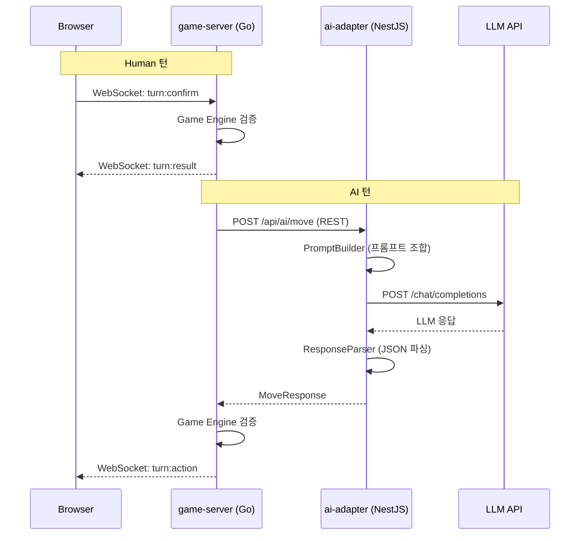

### 9.5 빌드/배포 파이프라인

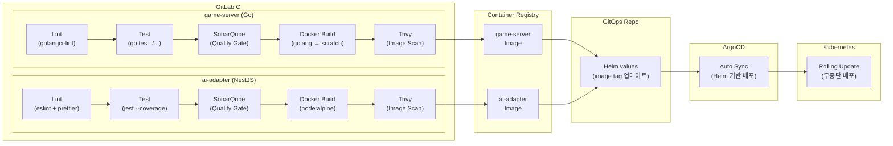

#### DevSecOps 보안 게이트

| 단계 | 도구 | 역할 | 실패 시 |
|------|------|------|---------|
| Lint | golangci-lint / eslint | 코드 스타일, 잠재 버그 탐지 | 파이프라인 중단 |
| Test | go test / jest | 단위/통합 테스트 + 커버리지 | 파이프라인 중단 |
| **SonarQube** | SonarQube Scanner | 정적 분석, Quality Gate (버그/취약점/코드스멜/커버리지) | 파이프라인 중단 |
| **Trivy** | Trivy | Docker 이미지 CVE 취약점 스캔 | Critical/High 발견 시 중단 |
| **OWASP ZAP** | ZAP (Phase 5) | 배포 후 동적 보안 테스트 (DAST) | 리포트 생성 (경고) |

> **SonarQube Quality Gate 기준**: 신규 코드 기준 — 버그 0건, 취약점 0건, 코드 스멜 A등급, 커버리지 80% 이상

#### 컨테이너 이미지 구성

| 서비스 | Base Image | 빌드 방식 | 예상 크기 | 예상 메모리 |
|--------|-----------|----------|----------|------------|
| game-server | golang:alpine → scratch | 멀티스테이지 | ~15MB | ~50-100MB |
| ai-adapter | node:20-alpine | 싱글스테이지 | ~200MB | ~150-256MB |
| frontend | node:20-alpine | 멀티스테이지 (빌드→nginx) | ~50MB | ~64-128MB |
| admin | node:20-alpine | 멀티스테이지 (빌드→nginx) | ~50MB | ~64-128MB |
| redis | redis:7-alpine | 공식 이미지 | ~30MB | ~64-128MB |
| postgres | postgres:16-alpine | 공식 이미지 | ~80MB | ~128-256MB |
| ollama | ollama/ollama | 공식 이미지 | ~1.2GB | ~2-4GB |

### 9.6 결정 근거 요약

**Go를 game-server에 선택한 이유**:
1. goroutine 기반 WebSocket 동시 처리 — 연결당 스레드 모델보다 메모리 효율적
2. 게임 엔진(규칙 검증)은 CPU-bound 로직 — Go의 컴파일 언어 성능이 유리
3. Docker 이미지 ~15MB (scratch) — K8s Pod 시작 시간 최소화
4. Go는 K8s 생태계 네이티브 언어 — 플랫폼 엔지니어링 실습 목적에 부합

**NestJS를 ai-adapter에 선택한 이유**:
1. LLM API 호출은 I/O-bound — Node.js 비동기 모델로 충분
2. JSON 조작, 프롬프트 템플릿 관리에 TypeScript가 편리
3. 프론트엔드(Next.js)와 DTO/타입을 공유 가능 (monorepo)
4. class-validator, axios 등 풍부한 생태계로 빠른 개발

**폴리글랏 추가 비용 감수 이유**:
- Go 실전 경험 확보 (학습 목적)
- 서비스별 최적 기술 선택 (마이크로서비스 원칙)
- 빌드 파이프라인 2벌은 GitLab CI 멀티스테이지로 관리 가능
